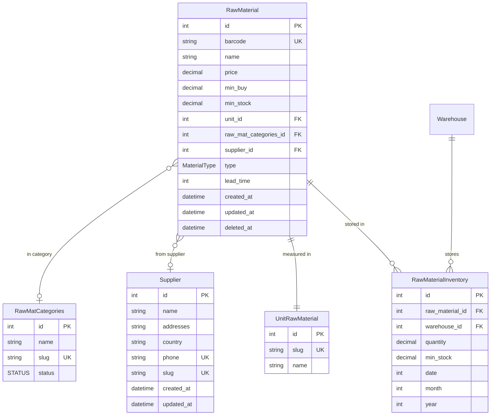
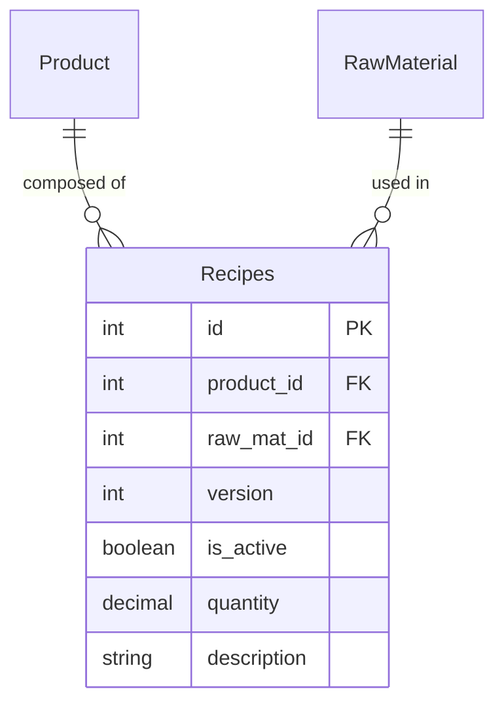
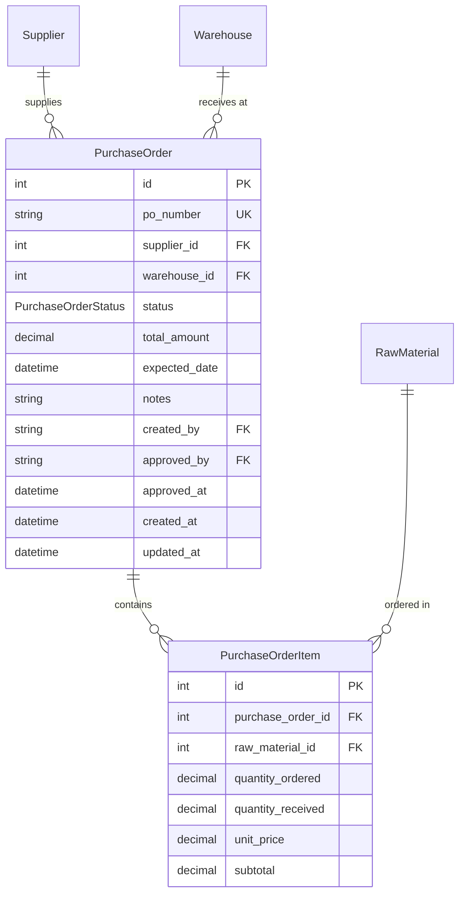
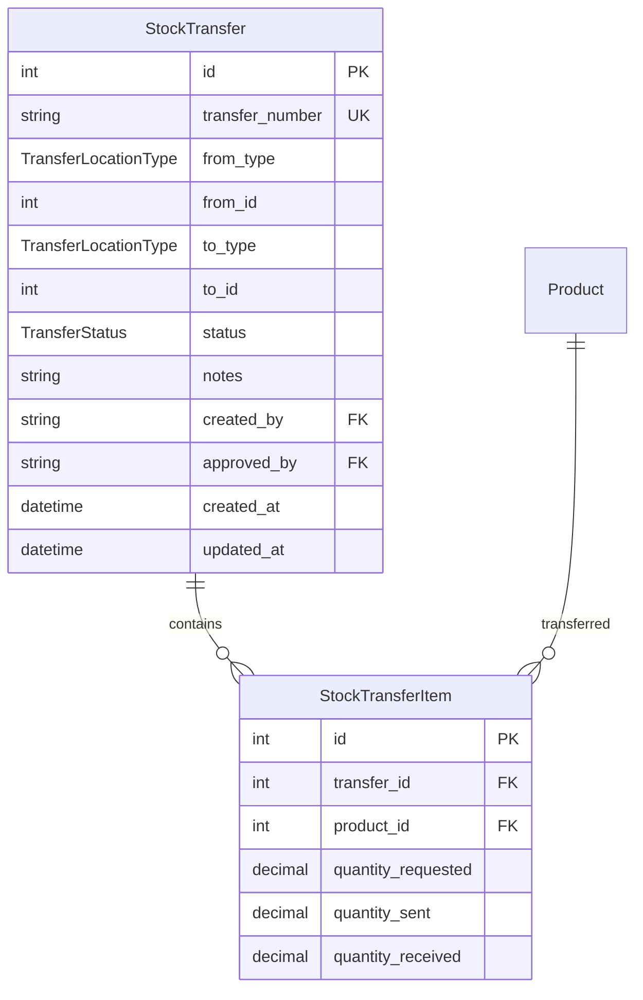
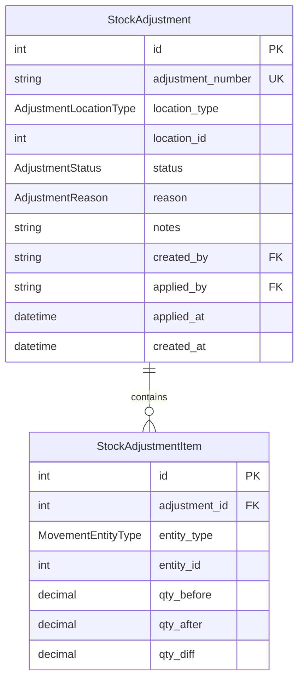
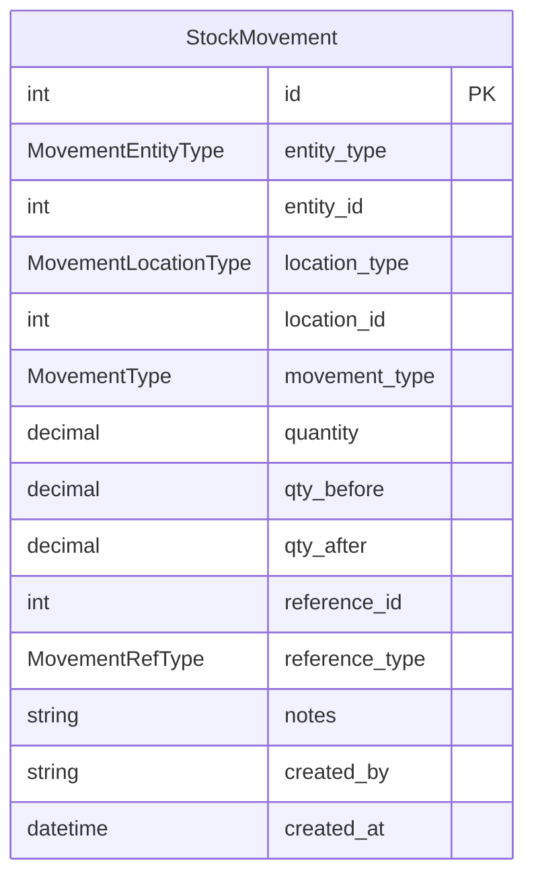
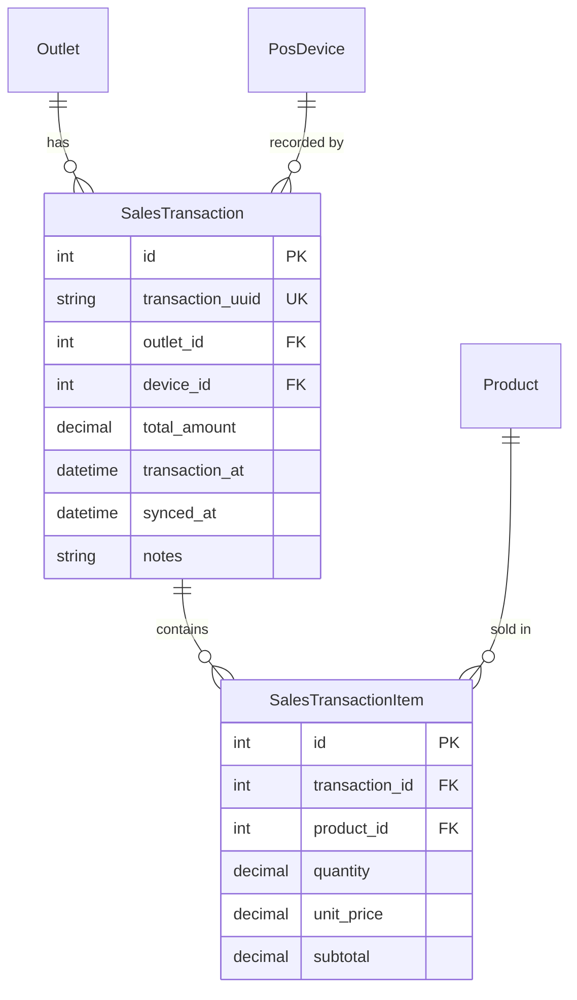
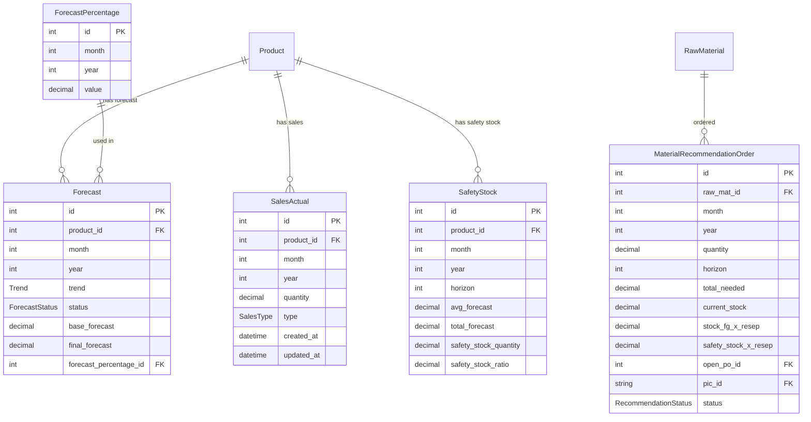
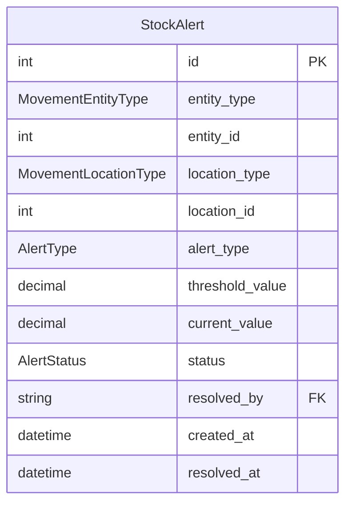

# Entity Relationship Diagram (ERD)
## Mandalika ERP — Full Schema (v2.0)

**Last Updated:** 2026-03-18
**Render:** https://mermaid.live

> Legend:
> - ✅ = Sudah ada di schema.prisma
> - ⬜ = Perlu ditambahkan

---

## 1. Domain: Authentication & Users ✅

```mermaid
erDiagram
    Account {
        string id PK
        string email UK
        string password
        STATUS status
        ROLE role
        datetime created_at
        datetime updated_at
        datetime deleted_at
    }

    User {
        string id PK
        string account_id UK_FK
        string first_name
        string last_name
        string photo
        string phone
        string whatsapp
        datetime created_at
        datetime updated_at
        datetime deleted_at
    }

    EmailVerify {
        int id PK
        string email UK_FK
        TYPE_EMAIL type
        string code
        datetime created_at
        datetime accepted_at
        datetime expired_at
    }

    Address {
        int id PK
        string name
        string street
        string district
        string city
        string province
        string country
        string postal_code
        string user_id FK
    }

    Account ||--o| User : "has profile"
    Account ||--o| EmailVerify : "has verify"
    User ||--o{ Address : "has addresses"
```

---

## 2. Domain: Outlet & POS ⬜ (Baru)

```mermaid
erDiagram
    Outlet {
        int id PK
        string name
        string code UK
        string phone
        boolean is_active
        boolean pos_enabled
        datetime created_at
        datetime updated_at
        datetime deleted_at
    }

    OutletAddress {
        int outlet_id PK_FK
        string street
        string district
        string city
        string province
        string country
        string postal_code
        string url_google_maps
    }

    OutletStaff {
        int id PK
        int outlet_id FK
        string account_id FK
        OutletRole role
        datetime created_at
    }

    PosDevice {
        int id PK
        int outlet_id FK
        string device_name
        string device_token UK
        datetime last_sync_at
        boolean is_active
        datetime created_at
    }

    OutletInventory {
        int id PK
        int outlet_id FK
        int product_id FK
        decimal quantity
        decimal min_stock
        datetime updated_at
    }

    Outlet ||--o| OutletAddress : "has address"
    Outlet ||--o{ OutletStaff : "has staff"
    Outlet ||--o{ PosDevice : "has devices"
    Outlet ||--o{ OutletInventory : "has stock"
    Account ||--o{ OutletStaff : "assigned to"
```

---

## 3. Domain: Warehouse & Product ✅

```mermaid
erDiagram
    Warehouse {
        int id PK
        string name
        WarehouseType type
        datetime created_at
        datetime updated_at
        datetime deleted_at
    }

    WarehouseAddress {
        int warehouse_id PK_FK
        string street
        string district
        string city
        string province
        string country
        string postal_code
    }

    Product {
        int id PK
        string name
        string code UK
        int type_id FK
        int size_id FK
        int unit_id FK
        GENDER gender
        STATUS status
        decimal z_value
        int lead_time
        int review_period
        decimal distribution_percentage
        decimal safety_percentage
        datetime created_at
        datetime updated_at
        datetime deleted_at
    }

    ProductType {
        int id PK
        string slug UK
        string name
    }

    ProductSize {
        int id PK
        int size UK
    }

    Unit {
        int id PK
        string slug UK
        string name
    }

    ProductInventory {
        int id PK
        int product_id FK
        int warehouse_id FK
        decimal quantity
        decimal min_stock
        int date
        int month
        int year
    }

    Warehouse ||--o| WarehouseAddress : "has"
    Warehouse ||--o{ ProductInventory : "stores"
    Product ||--o{ ProductInventory : "stored in"
    Product }o--o| ProductType : "classified as"
    Product }o--o| ProductSize : "has size"
    Product }o--o| Unit : "measured in"
```

---

## 4. Domain: Raw Material ✅



---

## 5. Domain: Recipe & BOM ✅



---

## 6. Domain: Purchase Order ⬜ (Baru - gantikan RawMaterialOpenPo)



---

## 7. Domain: Stock Transfer ⬜ (Baru)



> **Catatan:** `from_id` dan `to_id` bersifat polymorphic — bisa merujuk ke `warehouse_id` atau `outlet_id` tergantung `from_type` / `to_type`.

---

## 8. Domain: Stock Adjustment ⬜ (Baru)



---

## 9. Domain: Stock Movement Log ⬜ (Baru)



> `StockMovement` adalah **universal audit log** — setiap perubahan stok dari modul apapun (PO, Transfer, Adjustment, POS) wajib membuat satu record di sini.

---

## 10. Domain: POS Sales ⬜ (Baru)



---

## 11. Domain: Forecasting (✅ Sudah Ada)



---

## 12. Domain: Alerts ⬜ (Baru)



---

## 13. Tabel Referensi Enum

| Enum | Values |
|------|--------|
| `ROLE` | STAFF, SUPER_ADMIN, OWNER, DEVELOPER |
| `STATUS` | PENDING, ACTIVE, FAVOURITE, BLOCK, DELETE |
| `WarehouseType` | FINISH_GOODS, RAW_MATERIAL |
| `OutletRole` | MANAGER, STAFF, CASHIER |
| `PurchaseOrderStatus` | DRAFT, SUBMITTED, APPROVED, PARTIAL, COMPLETED, CANCELLED, REJECTED |
| `TransferStatus` | PENDING, APPROVED, IN_TRANSIT, COMPLETED, CANCELLED |
| `TransferLocationType` | WAREHOUSE, OUTLET |
| `AdjustmentReason` | DAMAGE, LOSS, CORRECTION, EXPIRED, FOUND, OTHER |
| `AdjustmentStatus` | DRAFT, APPLIED |
| `AdjustmentLocationType` | WAREHOUSE, OUTLET |
| `MovementEntityType` | PRODUCT, RAW_MATERIAL |
| `MovementLocationType` | WAREHOUSE, OUTLET |
| `MovementType` | IN, OUT, TRANSFER_IN, TRANSFER_OUT, ADJUSTMENT, OPNAME, INITIAL, POS_SALE |
| `MovementRefType` | PURCHASE_ORDER, STOCK_TRANSFER, STOCK_ADJUSTMENT, SALES_TRANSACTION, MANUAL |
| `AlertType` | LOW_STOCK, OVERSTOCK |
| `AlertStatus` | ACTIVE, RESOLVED, DISMISSED |
| `SalesType` | ALL, OFFLINE, ONLINE, SPIN_WHEEL, GARANSI_OUT |
| `ForecastStatus` | DRAFT, FINALIZED, ADJUSTED |
| `Trend` | UP, DOWN, STABLE |
| `MaterialType` | FO, PCKG |
| `RecommendationStatus` | DRAFT, ACC, REJECTED |
