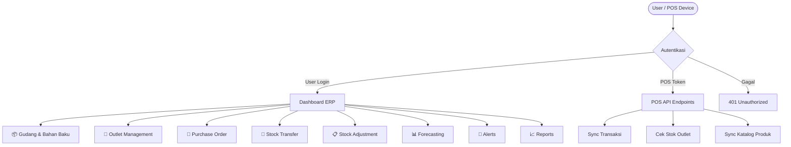
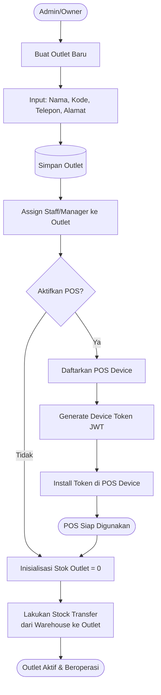
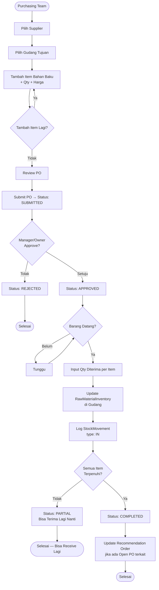
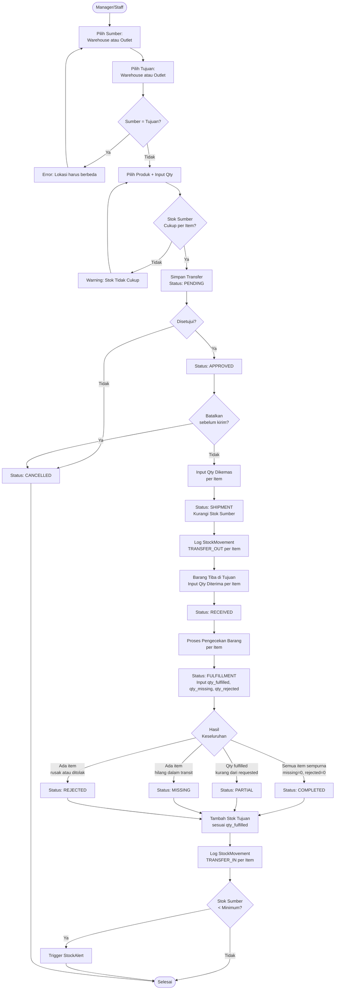
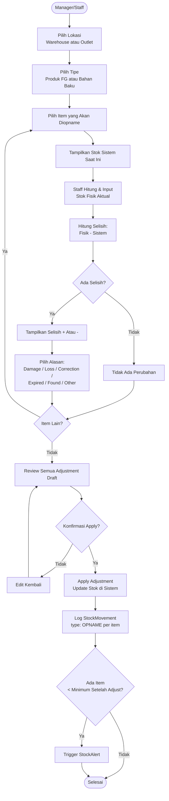
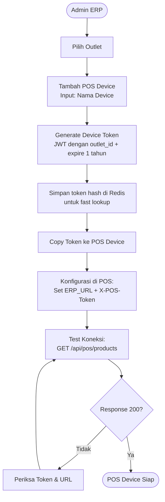
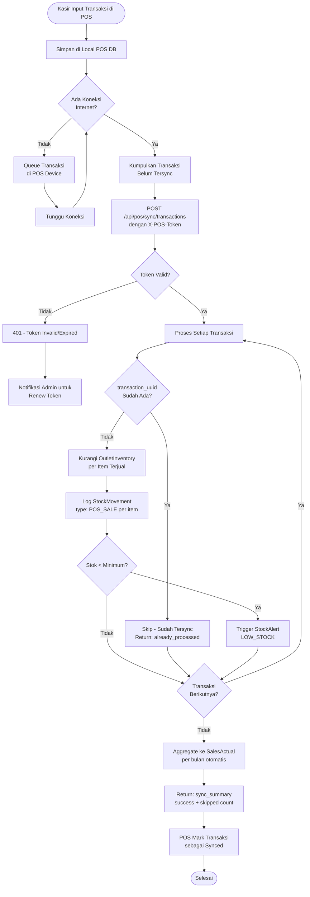
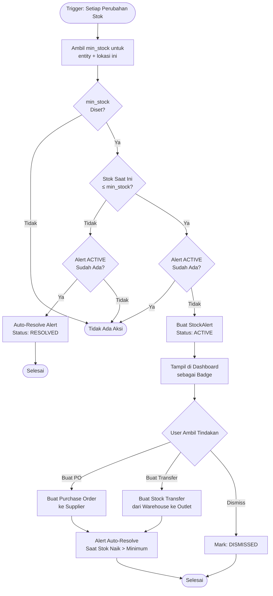
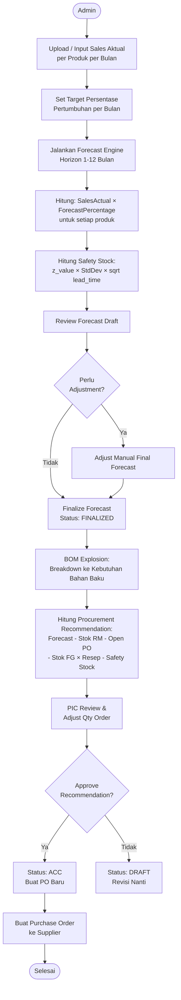
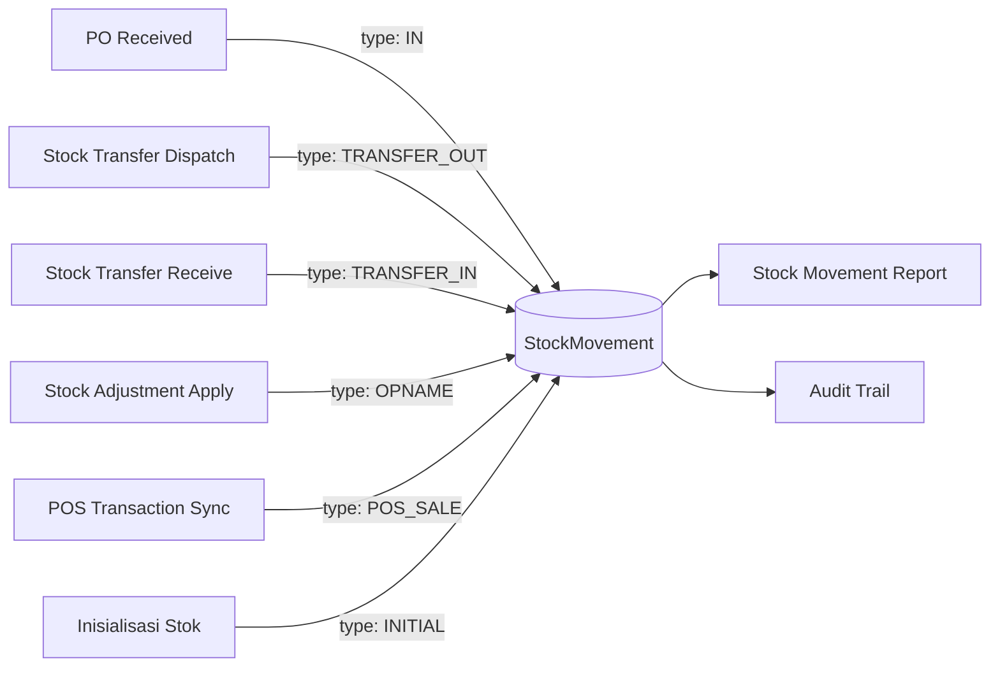

# System Flowchart — Mandalika ERP
## All Module Business Flows (v2.0)

**Last Updated:** 2026-03-18
**Render:** https://mermaid.live

---

## 1. Alur Sistem Utama



---

## 2. Alur Outlet Management



---

## 3. Alur Purchase Order (PO) — Lengkap



---

## 4. Alur Stock Transfer — 10 Status (W→W, W→O, O→O, O→W)



### Skenario Transfer yang Didukung (Optimasi Finish Goods)

| Skenario | From | To | Keterangan |
|----------|------|----|-----------|
| **W→O** | Warehouse | Outlet | Resupply ke toko (Fokus Utama) |
| **O→O** | Outlet | Outlet | Redistribusi stok antar toko |
| **O→W** | Outlet | Warehouse | Retur stok dari toko ke gudang |
| **W→W** | Warehouse | Warehouse | *Pending/Custom Flow untuk Raw Material* |

### Tracking Quantity Per Item

```
quantity_requested  ← Set saat PENDING    (berapa yang diminta)
quantity_packed     ← Set saat SHIPMENT   (berapa yang dikemas)
quantity_received   ← Set saat RECEIVED   (berapa yang tiba fisik)
quantity_fulfilled  ← Set saat FULFILLMENT (berapa yang OK/diterima)
quantity_missing    ← Set saat FULFILLMENT (berapa yang hilang)
quantity_rejected   ← Set saat FULFILLMENT (berapa yang rusak/ditolak)

Invariant: fulfilled + missing + rejected = received
```

---

## 5. Alur Stock Adjustment / Opname



---

## 6. Alur POS Integration — Device Setup



---

## 7. Alur POS Sync Transaksi



---

## 8. Alur Low Stock Alert



---

## 9. Alur Forecasting & Procurement



---

## 10. Alur Stock Movement Universal



> Setiap operasi yang mengubah stok **wajib** membuat record di `StockMovement`. Ini adalah prinsip tidak dapat dikompromikan untuk menjamin audit trail 100%.
