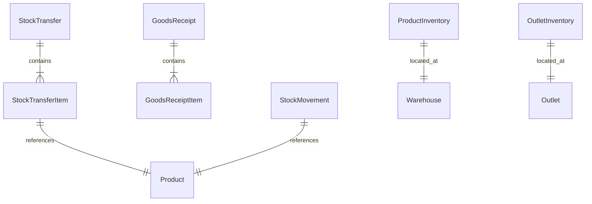

# Inventory V2 Module – ROADMAP

## Overview

Modul Inventory V2 mengelola semua pergerakan stok barang (Produk & Raw Material) di seluruh entitas (Gudang & Outlet). Modul ini merupakan inti dari sistem ERP untuk memastikan akurasi stok dan audit trail yang lengkap.

---

## Business Flows

### 1. Delivery Order (DO)
Aliran barang dari **Gudang (Warehouse)** ke **Outlet**.
- **Lifecycle**: `PENDING → APPROVED → SHIPMENT → RECEIVED → FULFILLMENT → COMPLETED`
- **Logic**:
  - `SHIPMENT`: Mengurangi stok di Gudang Asal.
  - `FULFILLMENT`: Menambah stok di Outlet Tujuan berdasarkan item yang diterima.
  - `REJECTION`: Jika ada barang ditolak saat fulfillment, otomatis membuat data **Return**.

### 2. Goods Receipt (GR)
Penerimaan barang masuk ke **Gudang**.
- **Lifecycle**: `PENDING → COMPLETED` (via Post)
- **Logic**:
  - `POST`: Menambah stok di Gudang tujuan dan mencatat movement.
  - Digunakan untuk penerimaan dari Supplier, hasil Produksi (QC FG), atau penyesuaian stok.

### 3. Transfer Gudang (TG)
Perpindahan barang antar **Gudang**.
- **Lifecycle**: `PENDING → APPROVED → SHIPMENT → RECEIVED → FULFILLMENT → COMPLETED/PARTIAL`
- **Logic**:
  - Mendukung pengiriman parsial jika stok dikirim dalam beberapa tahap.
  - `SHIPMENT`: Mengurangi stok Gudang Asal.
  - `FULFILLMENT`: Menambah stok Gudang Tujuan.

---

## Core Components

### `InventoryHelper`
Utility terpusat untuk memproses mutasi stok.
- **`deductWarehouseStock` / `addWarehouseStock`**: Mengelola tabel `ProductInventory` atau `RawMaterialInventory`.
- **`deductOutletStock` / `addOutletStock`**: Mengelola tabel `OutletInventory`.
- **`StockMovement`**: Setiap pemanggilan helper otomatis membuat record audit di tabel `StockMovement` dengan info `qty_before` dan `qty_after`.

### Monitoring & Analytics
- **Stock Card**: Laporan kronologis mutasi stok per barang (Raw Material atau Product) di lokasi tertentu.
  - **Date Range Filtering**: Mendukung filter rentang tanggal untuk audit spesifik.
  - **In/Out/Balance**: Menampilkan saldo awal, mutasi masuk/keluar, dan saldo akhir secara real-time.
- **Daily Progress View**: Visualisasi tren stok harian untuk memudahkan identifikasi lonjakan atau penurunan stok yang tidak wajar.
- **Unit Utility Count**: Sistem rekap total referensi (Supplier, Unit, Kategori) yang tersemat pada master data.

---

## Master Data Lifecycle

Modul ini mendukung pengelolaan data bahan baku dan barang jadi dengan fitur canggih:

### Fitur Master Data:
- **Soft-Delete & Restore**: Data yang dihapus masuk ke filter `actived` vs `deleted`. Data `deleted` bisa dipulihkan (Restore) asalkan belum dihapus permanen via fitur `Clean`.
- **Bulk Status Modification**: Mengubah status (ACTIVE/DELETE) untuk banyak baris sekaligus melalui sistem seleksi baris.
- **Sticky UI**: Tabel master data dilengkapi dengan kolom aksi yang lengket (sticky) dan toolbar melayang untuk aksi massal.

---

## Database Schema (Key Tables)

---

## Movement Reference Types

| Type | Description |
|---|---|
| `STOCK_TRANSFER` | Aktivitas DO atau TG |
| `GOODS_RECEIPT` | Penerimaan barang (GR) |
| `PRODUCTION` | Pemakaian RM atau hasil FG produksi |
| `ADJUSTMENT` | Penyesuaian stok manual |
| `RETURN` | Pengembalian barang dari outlet/rejection |
