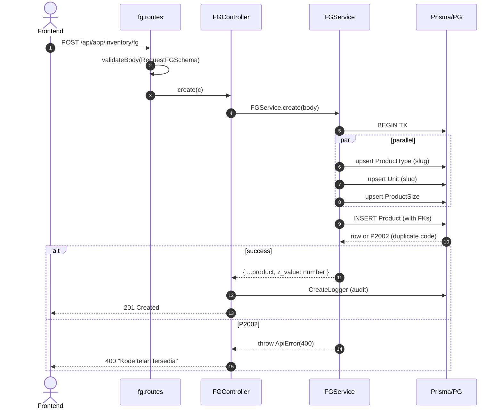
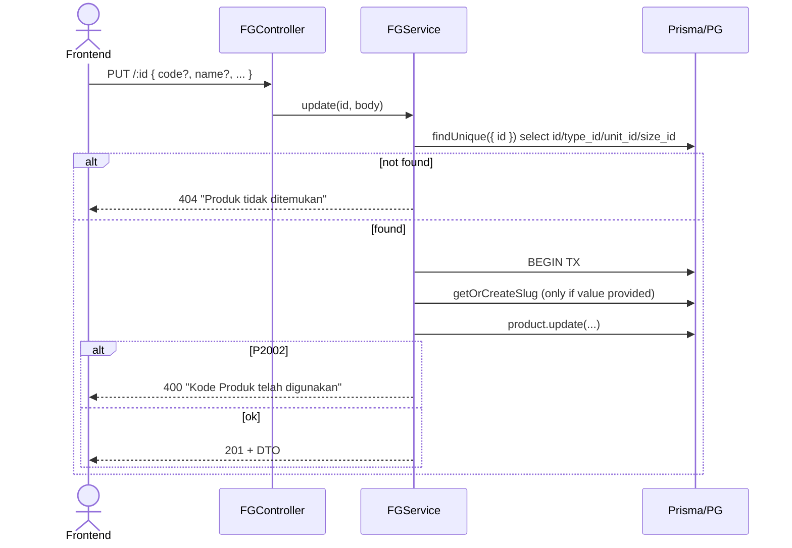

# Module: Inventory / FG (Finished Goods)

**Base path**: `/api/app/inventory/fg`
**Source**: `src/module/application/inventory/fg/`
**Tests**: `src/tests/inventory/fg/`
**Prisma model**: `Product`

Master data produk jadi (FG) — terutama parfum dengan size (mis. 110 ml). Mengikuti SOP modul-arsitektur: `schema → service → controller → routes`.

> **Catatan**: FG **tidak** memakai Redis cache lagi. Pencarian/listing FG langsung query DB (sudah dioptimasi dengan B-tree + GIN trigram index). Wrapper `Cache.afterMutation` dihapus dari controller.

---

## 1. Scope & Fitur

| Fitur                          | Endpoint                          | Catatan                                                        |
| :----------------------------- | :-------------------------------- | :------------------------------------------------------------- |
| CRUD produk                    | `POST /`, `GET /:id`, `PUT /:id`  | Code unik. Slug upsert untuk `product_type` & `unit`.          |
| List + filter + search         | `GET /`                           | Sort 7 kolom, pagination, filter type/size/gender/status.      |
| Soft-delete / restore          | `PATCH /status/:id?status=...`    | Status DELETE → `deleted_at = now`. ACTIVE → `deleted_at = null`. |
| Bulk status                    | `PUT /bulk-status`                | Banyak ID sekaligus.                                           |
| Permanent delete (clean)       | `DELETE /clean`                   | Transaksional. Cek FK RESTRICT (`ProductionOrder`).            |
| Export CSV                     | `GET /export`                     | Cap 50.000 baris, kolom selektif via `visibleColumns`.         |
| Detail (FG + inventories + BoM)| `GET /:id`                        | Include warehouse inventories + recipe RM (preferred supplier).|

### Out of scope (tidak dihandle di sini)

- Receipt / GR — di `manufacturing` & `purchase`.
- Stock transfer & movement — di `stock-transfer`, `stock-movement`.
- Forecasting & recommendation — di `forecast`, `recomendation-v2`.
- POS / outlet sales — di `outlet`.

---

## 2. Arsitektur & Flow

### Layer map

```text
┌────────────── routes/fg.routes.ts ──────────────┐
│ Hono router + validateBody(RequestFGSchema)     │
└─────────────────────┬───────────────────────────┘
                      ▼
┌──────────── controller/fg.controller.ts ─────────┐
│ - parse Query lewat QueryFGSchema.parse          │
│ - Panggil FGService langsung (tanpa cache wrap)  │
│ - CreateLogger audit trail                       │
└─────────────────────┬───────────────────────────┘
                      ▼
┌─────────── service/fg.service.ts (RM_INCLUDE) ──┐
│ - Prisma $transaction (atomic)                   │
│ - getOrCreateSlug (productType/unit)             │
│ - getOrCreateSize (productSize)                  │
│ - P2002 catch (race-safe, no TOCTOU pre-check)   │
│ - DoS cap di export (EXPORT_MAX_ROWS)            │
│ - clean(): FK RESTRICT pre-check + cascade       │
└─────────────────────┬───────────────────────────┘
                      ▼
              Prisma → PostgreSQL
```

### Mermaid: Create flow



### Mermaid: Update flow



### Mermaid: Clean (hard delete)

```mermaid
flowchart TD
    A[DELETE /clean] --> B{Find products deleted_at != null AND status = DELETE}
    B -->|none| E1[400 'Tidak ada produk untuk dihapus']
    B -->|some| C{ProductionOrder.count > 0?}
    C -->|yes| E2[409 'Masih terkait Production Order']
    C -->|no| D[Cascade deleteMany: wastes, outputs, inventories, issuances, recipes, safety_stock, stock_transfer_items, gr_items, return_items]
    D --> F[product.deleteMany]
    F --> G[Return { deleted: count }]
```

---

## 3. DTO / Schemas

Source: `src/module/application/inventory/fg/fg.schema.ts`. Semua DTO di-export dari schema yang sama (SSOT).

### 3.1 RequestFGSchema (POST / & PUT /:id partial)

```ts
{
  code:                    string;          // wajib, max 100, no whitespace
  name:                    string;          // wajib, 5-100 char
  size:                    number;          // wajib, min 1, di-coerce dari string
  gender?:                 GENDER;          // default UNISEX
  status?:                 STATUS;          // default PENDING
  z_value?:                number;          // default 1.65
  lead_time?:              number;          // default 14 hari
  review_period?:          number;          // default 30 hari
  unit?:                   string | null;   // mis. "ml"
  product_type?:           string | null;   // mis. "Parfum EDP"
  distribution_percentage?: number;         // default 0
  safety_percentage?:      number;          // default 0
  description?:            string | null;
}
```

- `code` di-regex `^\S+$` — gunakan `_` untuk spasi (mis. `EDP_110`).
- `unit` & `product_type` adalah **string**; service akan upsert ke tabel master lewat `getOrCreateSlug`.
- `size` adalah **angka**; service upsert ke `productSize` by `{ size }`.

### 3.2 ResponseFGDTO

```ts
{
  id:                       number;
  code:                     string;
  name:                     string;
  gender:                   GENDER;        // default UNISEX
  status:                   STATUS;
  size:                     string;        // FORMAT: `${size}${unit}` mis. "110ml"
  unit:                     string | null;
  product_type:             string | null;
  z_value:                  number;        // decimal di DB → number
  lead_time:                number;
  review_period:            number;
  distribution_percentage:  number;
  safety_percentage:        number;
  description:              string | null;
  created_at:               Date;
  updated_at:               Date;
  deleted_at:               Date | null;
}
```

### 3.3 FGDetailResponse (GET /:id)

Extends `ResponseFGDTO` + relasi:

```ts
{
  ...ResponseFGDTO,
  product_inventories: Array<{ id, product_id, warehouse_id, quantity, ..., warehouse: { ... } }>;
  recipes: Array<{                       // hanya is_active = true
    id, product_id, raw_mat_id, quantity, use_size_calc, ...
    raw_materials: {
      id, name, barcode, ...
      unit_raw_material: { ... };
      supplier_materials: [ { is_preferred: true, ... } ];   // max 1, preferred only
    };
  }>;
}
```

### 3.4 QueryFGDTO (GET / & GET /export)

```ts
{
  page?:           number;             // default 1
  take?:           number;             // default 25, max 100
  search?:         string;             // ILIKE pada name, code, product_type.name
  status?:         STATUS;             // default: WHERE status != DELETE
  type_id?:        number;
  size_id?:        number;
  gender?:         GENDER;
  sortBy?:         "code" | "name" | "gender" | "type" | "size" | "updated_at" | "created_at";  // default updated_at
  sortOrder?:      "asc" | "desc";     // default desc
  visibleColumns?: string;             // CSV header IDs untuk export
}
```

### 3.5 BulkStatusFGSchema (PUT /bulk-status)

```ts
{
  ids:    number[];   // min 1
  status: STATUS;
}
```

### 3.6 Enum referensi

```ts
enum STATUS  { ACTIVE, PENDING, BLOCK, DELETE }
enum GENDER  { UNISEX, MALE, FEMALE }
```

Lihat `prisma/schema.prisma` untuk daftar lengkap.

---

## 4. Routing untuk integrasi Frontend

Semua endpoint terproteksi `authMiddleware` (session cookie + Redis session) — lihat [AUTH.md](../../AUTH.md).

### 4.1 Daftar endpoint

| #   | Method  | Path                | Body / Query                                | Body type      | Response (200/201)            | Error utama                              |
| :-- | :------ | :------------------ | :------------------------------------------ | :------------- | :---------------------------- | :--------------------------------------- |
| 1   | GET     | `/`                 | `QueryFGDTO` (querystring)                  | —              | `{ data, len }`               | 400 (query invalid)                      |
| 2   | POST    | `/`                 | `RequestFGDTO`                              | JSON           | `ResponseFGDTO` (201)         | 400 (Zod / duplicate code)               |
| 3   | GET     | `/:id`              | —                                           | —              | `FGDetailResponse`            | 404                                      |
| 4   | PUT     | `/:id`              | `Partial<RequestFGDTO>`                     | JSON           | `ResponseFGDTO` (201)         | 400 / 404                                |
| 5   | PATCH   | `/status/:id`       | `?status=ACTIVE\|PENDING\|BLOCK\|DELETE`    | —              | `{}` (201)                    | 400 (status invalid) / 404               |
| 6   | PUT     | `/bulk-status`      | `{ ids, status }`                           | JSON           | `{ affected: number }`        | 400 / 404                                |
| 7   | DELETE  | `/clean`            | —                                           | —              | `{ deleted: number }`         | 400 (tidak ada) / 409 (FK Production)    |
| 8   | GET     | `/export`           | `QueryFGDTO` + `visibleColumns`             | —              | `text/csv` (200, buffer)      | 400 (>50k rows)                          |

### 4.2 Konvensi response

Semua endpoint JSON sukses memakai wrapper standar:

```jsonc
{
  "query": null | <echo querystring>,
  "status": "success",
  "data": <payload>
}
```

Error:

```jsonc
{ "status": "error", "message": "<pesan>" }
```

Status code mengikuti HTTP standar (200/201/400/404/409/500).

### 4.3 Contoh integrasi frontend (TanStack Query)

Module FE pattern (lihat skill `frontend-query-mutation`):

```ts
// fg.service.ts (FE)
import { axios } from "@/lib/axios";
import type { ResponseFGDTO, FGDetailResponse, QueryFGDTO, RequestFGDTO } from "./fg.dto";

export const fgService = {
    list: (query: QueryFGDTO) =>
        axios.get<{ data: ResponseFGDTO[]; len: number }>("/api/app/inventory/fg", { params: query }),

    detail: (id: number) =>
        axios.get<FGDetailResponse>(`/api/app/inventory/fg/${id}`),

    create: (body: RequestFGDTO) =>
        axios.post<ResponseFGDTO>("/api/app/inventory/fg", body),

    update: (id: number, body: Partial<RequestFGDTO>) =>
        axios.put<ResponseFGDTO>(`/api/app/inventory/fg/${id}`, body),

    status: (id: number, status: STATUS) =>
        axios.patch(`/api/app/inventory/fg/status/${id}`, null, { params: { status } }),

    bulkStatus: (ids: number[], status: STATUS) =>
        axios.put("/api/app/inventory/fg/bulk-status", { ids, status }),

    clean: () => axios.delete<{ deleted: number }>("/api/app/inventory/fg/clean"),

    exportCsv: (query: QueryFGDTO) =>
        axios.get("/api/app/inventory/fg/export", { params: query, responseType: "blob" }),
};
```

```ts
// fg.queries.ts (FE — TanStack Query)
export const useFGList = (query: QueryFGDTO) =>
    useQuery({
        queryKey: ["fg", "list", query],
        queryFn: () => fgService.list(query).then((r) => r.data.data),
    });

export const useFGDetail = (id: number) =>
    useQuery({
        queryKey: ["fg", "detail", id],
        queryFn: () => fgService.detail(id).then((r) => r.data.data),
        enabled: id > 0,
    });

export const useFGCreate = () => {
    const qc = useQueryClient();
    return useMutation({
        mutationFn: fgService.create,
        onSuccess: () => qc.invalidateQueries({ queryKey: ["fg"] }),
    });
};
```

### 4.4 Header & autentikasi

- Cookie session: nama dari `env.SESSION_COOKIE_NAME` (default `session`).
- CSRF: header `x-csrf-token` (lihat [AUTH.md](../../AUTH.md)).
- `Content-Type: application/json` untuk semua mutasi.

---

## 5. Database / Indexes

Model `Product` di `prisma/schema.prisma`:

```prisma
model Product {
  id   Int    @id @default(autoincrement())
  code String @unique @db.VarChar(100)
  name String @db.VarChar(100)
  ...
  @@index([type_id])
  @@index([size_id])
  @@index([status])
  @@index([updated_at])
  @@index([gender, status])
}
```

Plus **trigram GIN** dari migration `20260516120000_fg_search_trgm_indexes`:

- `products.name`, `products.code` (untuk `ILIKE '%text%'`)
- `product_types.name`

Pastikan migration sudah dijalankan di lingkungan target — `pg_trgm` adalah PostgreSQL extension.

---

## 6. Error catalog

| HTTP | Pesan                                              | Trigger                                                       |
| :--- | :------------------------------------------------- | :------------------------------------------------------------ |
| 400  | `Validation Error` + array `{ message, path }`     | Body / query gagal Zod.                                       |
| 400  | `Produk dengan kode: {code} telah tersedia`        | P2002 saat create (race-safe).                                |
| 400  | `Kode Produk telah digunakan`                      | P2002 saat update.                                            |
| 400  | `Status tidak valid`                               | Query `status` di `PATCH /status/:id` tidak match enum.       |
| 400  | `Tidak ada produk yang dipilih` / `…akan dihapus`  | `ids` kosong di bulkStatus / clean tidak menemukan kandidat.  |
| 400  | `Data terlalu besar ({n} baris). Gunakan filter …` | Export > 50.000 row.                                          |
| 404  | `Produk tidak ditemukan` / `dengan kode {id} …`    | findUnique = null.                                            |
| 409  | `Produk masih terkait dengan Production Order …`   | `clean()` FK RESTRICT.                                        |
| 500  | `Internal Server Error`                            | Error tak terduga (re-throw non-Prisma).                      |

---

## 7. Testing

Lokasi: `src/tests/inventory/fg/`. Total **36 tests** (22 service + 14 routes).

### 8.1 Setup global

`src/tests/setup.ts` me-mock:

- `env` (envalid bypass)
- `prisma` (semua model yang dipakai)
- `redisClient` (get/set/del/keys)
- `logger`

### 8.2 Service test (`fg.service.test.ts`)

Mencakup:

| Suite          | Test cases                                                                                          |
| :------------- | :-------------------------------------------------------------------------------------------------- |
| `create`       | sukses serialize Decimal; P2002 → ApiError 400; re-throw error non-P2002                            |
| `update`       | 404 jika tidak ada; sukses + serialize; P2002 saat update                                           |
| `status`       | 404; set `deleted_at = Date` saat DELETE; set `deleted_at = null` saat non-DELETE                   |
| `bulkStatus`   | 400 ids kosong; 404 no match; affected count saat sukses                                            |
| `list`         | default sort + len; status filter default `!= DELETE`                                               |
| `detail`       | 404; flatten size/unit/product_type ke string                                                       |
| `export`       | 400 > EXPORT_MAX_ROWS; buffer saat dalam batas                                                      |
| `clean`        | 400 tidak ada produk; 409 ProductionOrder FK                                                        |

### 8.3 Routes test (`fg.routes.test.ts`)

`app.request()` simulate HTTP. Mencakup:

- `GET /` list 200
- `GET /:id` 200 / 404
- `POST /` 201 sukses / 400 invalid body
- `PUT /:id` 201
- `PATCH /status/:id` 201 / 400 status invalid
- `PUT /bulk-status` 200 / 400 ids kosong
- `GET /export` CSV `Content-Type: text/csv`

### 8.4 Menjalankan test

```bash
# Semua test FG
rtk npm test -- --run src/tests/inventory/fg/

# File spesifik
rtk npm test -- --run src/tests/inventory/fg/fg.service.test.ts

# Watch
rtk npx vitest src/tests/inventory/fg/
```

---

## 8. Postman testing

Import koleksi berikut ke Postman. Set environment variables:

| Var          | Value contoh                       |
| :----------- | :--------------------------------- |
| `base_url`   | `http://localhost:3000`            |
| `session_id` | `<isi dari login>`                 |
| `csrf_token` | `<dari cookie / login response>`   |

Header global tiap request:

- `Cookie: session=<{{session_id}}>`
- `x-csrf-token: <{{csrf_token}}>` (untuk mutasi)
- `Content-Type: application/json` (untuk POST/PUT/PATCH dengan body)

### 8.1 List

```
GET {{base_url}}/api/app/inventory/fg?page=1&take=25&sortBy=updated_at&sortOrder=desc
```

### 8.2 Create

```
POST {{base_url}}/api/app/inventory/fg
Content-Type: application/json

{
  "code": "EDP_110",
  "name": "Parfum EDP 110ml Signature",
  "size": 110,
  "gender": "UNISEX",
  "status": "PENDING",
  "z_value": 1.65,
  "lead_time": 14,
  "review_period": 30,
  "unit": "ml",
  "product_type": "Parfum EDP",
  "distribution_percentage": 50,
  "safety_percentage": 10,
  "description": "Varian signature"
}
```

**Expected 201**:

```json
{
  "query": null,
  "status": "success",
  "data": {
    "id": 1, "code": "EDP_110", "name": "Parfum EDP 110ml Signature",
    "z_value": 1.65, "size": { "id": 1, "size": 110 },
    "unit": { "id": 1, "name": "ml", "slug": "ml" },
    "product_type": { "id": 1, "name": "Parfum EDP", "slug": "parfum-edp" },
    "...": "..."
  }
}
```

### 8.3 Detail

```
GET {{base_url}}/api/app/inventory/fg/1
```

### 8.4 Update (partial)

```
PUT {{base_url}}/api/app/inventory/fg/1
Content-Type: application/json

{ "name": "Parfum EDP 110ml Updated", "lead_time": 21 }
```

### 8.5 Status

```
PATCH {{base_url}}/api/app/inventory/fg/status/1?status=ACTIVE
```

### 8.6 Bulk status

```
PUT {{base_url}}/api/app/inventory/fg/bulk-status
Content-Type: application/json

{ "ids": [1, 2, 3], "status": "DELETE" }
```

### 8.7 Export CSV

```
GET {{base_url}}/api/app/inventory/fg/export?status=ACTIVE&visibleColumns=code,name,size,unit,gender
```

Response: `text/csv`, simpan ke file `data-produk.csv`.

### 8.8 Clean (hard delete)

```
DELETE {{base_url}}/api/app/inventory/fg/clean
```

**Expected 400** jika tidak ada produk dengan `status=DELETE` + `deleted_at != null`.
**Expected 409** jika ada produk yang masih terkait Production Order.

---

## 9. Activity log

Setiap mutasi sukses men-trigger `CreateLogger` dengan payload:

```ts
{
  activity:    "CREATE" | "UPDATE" | "DELETE" | "CLEAN",
  description: "FG {code}: {name}" | "Status FG {id}" | "Bulk Status FG ({n} items)",
  email:       <accountSession.email>,
}
```

Lihat tabel `logging_activities` (model `LoggingActivity`). Lognya dipakai audit/UI activity feed.

---

## 10. Checklist saat menambah fitur ke FG

- [ ] Tambah field di `RequestFGSchema` (Zod) + tipe TS.
- [ ] Update `RM_INCLUDE` (kalau perlu relasi baru) atau `FGDetailPayload`.
- [ ] Tulis test unit di `fg.service.test.ts` **sebelum** implementasi (TDD).
- [ ] Tambah index `@@index` / migration trigram bila ada filter/sort baru pada kolom belum ter-index.
- [ ] Update bagian relevan dari dokumen ini (DTO, endpoint table, Postman).
- [ ] `rtk tsc --noEmit` clean.
- [ ] `rtk npm test -- --run src/tests/inventory/fg/` 36+ tests pass.

---

## 11. Referensi silang

- Arsitektur global: [ARCHITECTURE.md](../../ARCHITECTURE.md)
- Konvensi SOP: [CONVENTIONS.md](../../CONVENTIONS.md)
- Testing global: [TESTING.md](../../TESTING.md)
- Auth & session: [AUTH.md](../../AUTH.md)
- Error format: [ERROR_HANDLING.md](../../ERROR_HANDLING.md)
- DB schema: [DATABASE.md](../../DATABASE.md)
- Recipe & BoM (terkait `recipes` di detail FG): [recipe-bom.md](../recipe-bom.md)
- Recommendation & forecast (konsumer dari FG): [forecast.md](../forecast.md), [recommendation.md](../recommendation.md)
