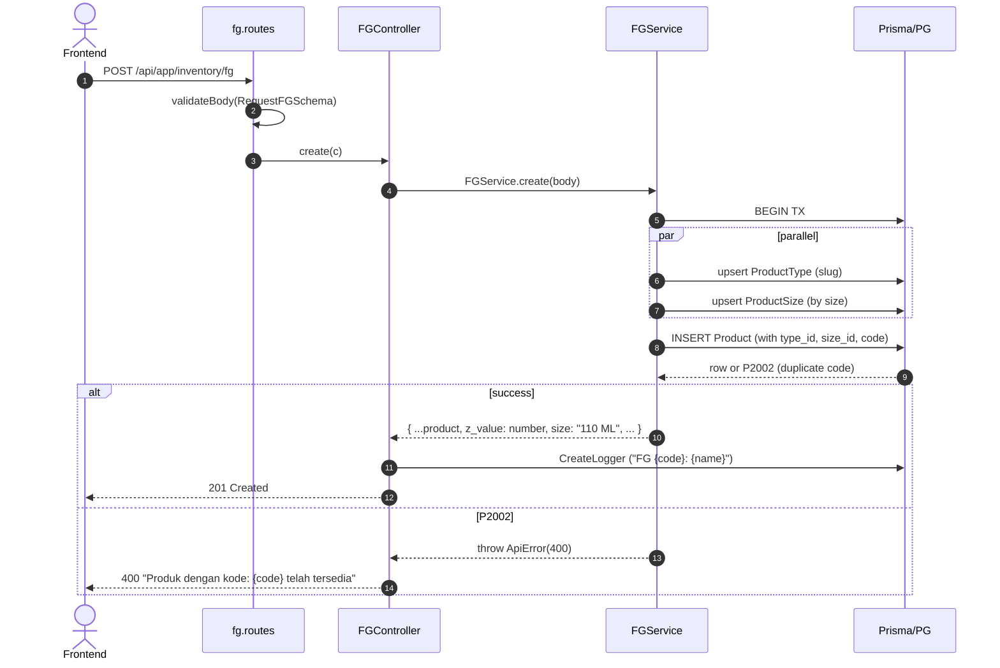
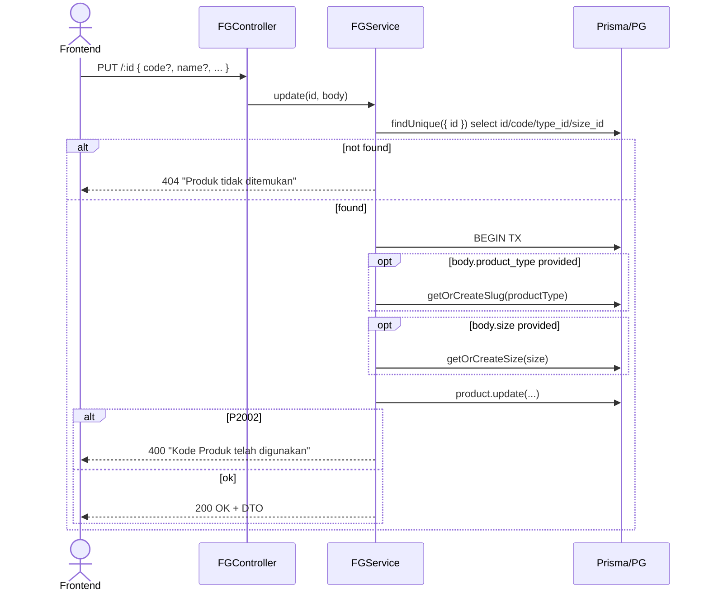

# Module: Inventory / FG (Finished Goods)

**Base path**: `/api/app/inventory/fg`
**Source**: `src/module/application/inventory/fg/`
**Tests**: `src/tests/inventory/fg/`
**Prisma model**: `Product`

Master data produk jadi (FG) — terutama parfum dengan size dalam satuan **ML**. Mengikuti SOP modul-arsitektur: `schema → service → controller → routes`.

> **Catatan**:
>
> - Satuan size **hardcoded `ML`** di service (konstanta `SIZE_UNIT`). Field `unit` dari payload sudah dihapus — DB column `unit_id` masih ada untuk safety, tapi tidak ditulis lagi dari API.
> - FG **tidak** memakai Redis cache. List/detail/search langsung query DB (sudah dioptimasi dengan B-tree + GIN trigram index).
> - FG punya 3 sub-modul: [`import`](./import/README.md), [`sizes`](./size/README.md), [`types`](./type/README.md). Sub-mount terpasang lewat `fg.routes.ts` sebelum routes utama.

---

## 1. Scope & Fitur

| Fitur                          | Endpoint                          | Catatan                                                        |
| :----------------------------- | :-------------------------------- | :------------------------------------------------------------- |
| CRUD produk                    | `POST /`, `GET /:id`, `PUT /:id`  | Code unik. Slug upsert untuk `product_type`.                   |
| List + filter + search         | `GET /`                           | Sort 7 kolom, pagination, filter type/size/gender/status.      |
| Soft-delete / restore          | `PATCH /status/:id?status=...`    | DELETE → `deleted_at = now`. Non-DELETE → `deleted_at = null`. |
| Bulk status                    | `PUT /bulk-status`                | Banyak ID sekaligus.                                           |
| Permanent delete (clean)       | `DELETE /clean`                   | Transaksional. Cek FK RESTRICT (`ProductionOrder`).            |
| Export CSV                     | `GET /export`                     | Cap 50.000 baris, kolom selektif via `visibleColumns`.         |
| Detail (FG + stocks + BoM)     | `GET /:id`                        | Recipes aktif + stok warehouse (period terbaru saja) + stok outlet aktif (`deleted_at = null`). |
| Master data Size               | `GET/POST/PUT/DELETE /sizes/*`    | Lihat [`./size/README.md`](./size/README.md).                  |
| Master data Type               | `GET/POST/PUT/DELETE /types/*`    | Lihat [`./type/README.md`](./type/README.md).                  |
| Bulk import (preview + queue)  | `POST/GET /import/*`              | BullMQ async, lihat [`./import/README.md`](./import/README.md).|

### Out of scope (tidak dihandle di sini)

- Receipt / GR — di `manufacturing` & `purchase`.
- Stock transfer & movement — di `stock-transfer`, `stock-movement`.
- Forecasting & recommendation — di `forecast`, `recomendation-v2`.
- POS / outlet sales — di `outlet`.
- Field `unit` (ml/g/dll) — sudah dihapus dari API; satuan size FG selalu `ML`.

---

## 2. Arsitektur & Flow

### Layer map

```text
┌────────────── routes/fg.routes.ts ──────────────────────────────┐
│ Sub-mount: /import, /sizes, /types                              │
│ Hono router + validateBody(RequestFGSchema | partial | bulk)    │
└─────────────────────┬───────────────────────────────────────────┘
                      ▼
┌──────────── controller/fg.controller.ts ────────────────────────┐
│ - parse Query lewat QueryFGSchema.parse                         │
│ - parse Status query lewat StatusParamFGSchema.safeParse        │
│ - Panggil FGService langsung (tanpa cache wrap)                 │
│ - CreateLogger audit trail per mutasi                           │
└─────────────────────┬───────────────────────────────────────────┘
                      ▼
┌─────────── service/fg.service.ts (FGDetailPayload include) ─────┐
│ - Prisma $transaction (atomic)                                  │
│ - getOrCreateSlug(productType) + getOrCreateSize(productSize)   │
│ - P2002 catch (race-safe, no TOCTOU pre-check)                  │
│ - formatSize(size) → "${size} ML"                               │
│ - export(): ExcelJS CSV, cap EXPORT_MAX_ROWS = 50_000           │
│ - clean(): FK RESTRICT pre-check (ProductionOrder) + cascade    │
└─────────────────────┬───────────────────────────────────────────┘
                      ▼
              Prisma → PostgreSQL
```

### Mermaid: Create flow



### Mermaid: Update flow



### Mermaid: Clean (hard delete)

```mermaid
flowchart TD
    A[DELETE /clean] --> B{Find products deleted_at != null AND status = DELETE}
    B -->|none| E1[400 'Tidak ada produk yang akan dihapus']
    B -->|some| C{ProductionOrder.count > 0?}
    C -->|yes| E2[409 'Masih terkait Production Order']
    C -->|no| D[Cascade deleteMany: wastes, outputs, outletInventories, productInventories, issuances, recipes, safety_stock, stock_transfer_items, gr_items, return_items]
    D --> F[product.deleteMany]
    F --> G[Return { deleted: count }]
```

---

## 3. DTO / Schemas (end-to-end SSOT)

**Source**: `src/module/application/inventory/fg/fg.schema.ts`. Semua DTO ditarik dari Zod schema yang sama. **FE wajib mirror schema ini 1:1** — lihat [`../frontend-integration.md`](../frontend-integration.md) §2.

> **Aturan dokumentasi**: setiap schema ditulis dalam tiga bentuk: (a) block Zod verbatim, (b) tabel field, (c) tipe TS yang di-export. Diff antara ketiganya = bug.

### 3.1 `RequestFGSchema` — POST / & PUT /:id (partial)

**Zod chain (verbatim dari `fg.schema.ts`)**:

```ts
export const RequestFGSchema = z.object({
    code: z.string().max(100).regex(/^\S+$/, { message: "Gunakan '_' (underscore) untuk spasi" }),
    name: z
        .string()
        .min(5, "Nama produk minimal memiliki 5 karakter")
        .max(100, "Nama produk tidak boleh melebihi 100 karakter"),
    size: z.coerce.number("Ukuran tidak boleh kosong").min(1),
    gender: z.enum(GENDER).optional().default("UNISEX"),
    status: z.enum(STATUS).default("PENDING").optional(),
    z_value: z.number().default(1.65),
    lead_time: z.number().int().min(1).default(14),
    review_period: z.number().int().min(1).default(30),
    product_type: z.string().nullable().optional(),
    distribution_percentage: z.coerce.number().min(0).default(0).optional(),
    safety_percentage: z.coerce.number().min(0).default(0).optional(),
    description: z.string().nullable().optional(),
});
```

**Field detail**:

| Field                     | Type              | Required | Default     | Constraint                                    | Error msg                                       | Catatan                                                       |
| :------------------------ | :---------------- | :------- | :---------- | :-------------------------------------------- | :---------------------------------------------- | :------------------------------------------------------------ |
| `code`                    | `string`          | ✅       | —           | `max(100)`, regex `/^\S+$/`                   | `"Gunakan '_' (underscore) untuk spasi"`        | Gunakan `_` untuk separator (mis. `EDP_110`). `@unique`.      |
| `name`                    | `string`          | ✅       | —           | `min(5)`, `max(100)`                          | `"Nama produk minimal/melebihi…"`               | Nama produk display.                                          |
| `size`                    | `number`          | ✅       | —           | `coerce`, `min(1)`                            | `"Ukuran tidak boleh kosong"`                   | Angka murni; service upsert ke `productSize` lalu format `"${n} ML"`. |
| `gender`                  | `enum GENDER`     | ❌       | `"UNISEX"`  | enum `GENDER`                                 | (default Zod)                                   | —                                                             |
| `status`                  | `enum STATUS`     | ❌       | `"PENDING"` | enum `STATUS`                                 | (default Zod)                                   | —                                                             |
| `z_value`                 | `number`          | ❌       | `1.65`      | —                                             | —                                               | Z-score untuk safety stock calc.                              |
| `lead_time`               | `number` (int)    | ❌       | `14`        | `int()`, `min(1)`                             | (default Zod)                                   | Hari.                                                         |
| `review_period`           | `number` (int)    | ❌       | `30`        | `int()`, `min(1)`                             | (default Zod)                                   | Hari.                                                         |
| `product_type`            | `string \| null`  | ❌       | —           | nullable + optional                           | —                                               | Nama tipe. Service auto-upsert lewat `getOrCreateSlug`.       |
| `distribution_percentage` | `number`          | ❌       | `0`         | `coerce`, `min(0)`                            | (default Zod)                                   | Persentase distribusi.                                        |
| `safety_percentage`       | `number`          | ❌       | `0`         | `coerce`, `min(0)`                            | (default Zod)                                   | Persentase safety stock.                                      |
| `description`             | `string \| null`  | ❌       | —           | nullable + optional                           | —                                               | —                                                             |

**TS DTO**:

```ts
export type RequestFGDTO = z.infer<typeof RequestFGSchema>;
```

### 3.2 `ResponseFGSchema` — list payload

**Zod chain (verbatim)**:

```ts
export const ResponseFGSchema = RequestFGSchema.extend({
    id: z.number(),
    gender: z.enum(GENDER).default("UNISEX"),
    size: z.string("Ukuran tidak boleh kosong"),   // di response sudah formatted "${size} ML"
    product_type: z.string().nullable().optional(),
    created_at: z.date(),
    updated_at: z.date(),
    deleted_at: z.date().nullable(),
});

export type ResponseFGDTO = z.infer<typeof ResponseFGSchema>;
```

**Catatan transformasi service** (`list`/`detail` melakukan post-processing sebelum return):

| Field di response  | Sumber Prisma                       | Transformasi service                                       |
| :----------------- | :---------------------------------- | :--------------------------------------------------------- |
| `z_value`                  | `Product.z_value` (Decimal)         | `Number(p.z_value)` agar JSON-safe.                |
| `distribution_percentage`  | `Product.distribution_percentage` (Decimal) | `Number(p.distribution_percentage)`.      |
| `safety_percentage`        | `Product.safety_percentage` (Decimal)       | `Number(p.safety_percentage)`.            |
| `size`                     | `Product.size.size` (Int, via relasi `ProductSize`) | `formatSize(p.size?.size)` → `"110 ML"` atau `""`. |
| `product_type`             | `Product.product_type.name` (via relasi `ProductType`) | `p.product_type?.name ?? null`.        |

> **Catatan response inkonsisten — endpoint `create`/`update`**: di hasil `create` dan `update`, service mengembalikan `size` dan `product_type` sebagai **objek mentah** dari include (mis. `{ id: 1, size: 110 }`, `{ id: 1, name: "Parfum EDP", slug: "parfum-edp" }`), **bukan** string ter-flatten. Hanya `list` dan `detail` yang melakukan `formatSize` + `.name` flatten. FE wajib handle dua bentuk. <!-- verify: pertimbangkan unifikasi shape di service untuk konsistensi -->

### 3.3 `ResponseFGDetailSchema` — GET /:id

Mengembangkan `ResponseFGSchema` (list shape) dengan **recipes aktif** (di root) dan **objek `stock`** yang mengelompokkan `latest_period`, `warehouse_stocks`, dan `outlet_stocks` di satu tempat.

```ts
export const FGRecipeItemSchema = z.object({
    id: z.number(),
    quantity: z.number(),                    // Decimal → Number
    version: z.number(),
    is_active: z.boolean(),
    raw_material: z.object({
        id: z.number(),
        name: z.string(),
        unit: z.string().nullable(),         // dari unit_raw_material.name
        preferred_unit_price: z.number().nullable(), // supplier_materials[is_preferred=true].unit_price
    }),
});

export const FGWarehouseStockSchema = z.object({
    quantity: z.number(),
    min_stock: z.number().nullable(),
    warehouse: z.object({
        id: z.number(),
        name: z.string(),
        code: z.string().nullable(),
        type: z.enum(WarehouseType),         // FINISH_GOODS | RAW_MATERIAL
    }),
});

export const FGOutletStockSchema = z.object({
    quantity: z.number(),
    min_stock: z.number().nullable(),
    outlet: z.object({
        id: z.number(),
        name: z.string(),
        code: z.string(),
        type: z.enum(OutletType),            // RETAIL | MARKETPLACE
    }),
});

export const FGLatestPeriodSchema = z.object({
    year: z.number(),
    month: z.number(),
    date: z.number(),
});

export const FGStockSchema = z.object({
    latest_period: FGLatestPeriodSchema.nullable(),
    warehouse_stocks: z.array(FGWarehouseStockSchema),
    outlet_stocks: z.array(FGOutletStockSchema),
});

export const ResponseFGDetailSchema = ResponseFGSchema.extend({
    recipes: z.array(FGRecipeItemSchema),
    stock: FGStockSchema,
});

export type ResponseFGDetailDTO = z.infer<typeof ResponseFGDetailSchema>;
export type FGStockDTO = z.infer<typeof FGStockSchema>;
```

**Aturan service (`FGService.detail`)**:

- **Empat query paralel** + 1 dependent: `findUnique` produk · `findFirst` period stok terbaru (`orderBy: [year desc, month desc, date desc]`) · `findMany` recipes `is_active=true` · `findMany` outlet inventory `outlet.deleted_at = null`. Lalu `findMany` warehouse inventory di period terbaru bila ada.
- **Filter recipes**: `is_active = true` (hard-coded di service, tidak via query param). Order by `id asc`.
- **Preferred supplier price**: ambil `supplier_materials` `where { is_preferred: true } take: 1`. Bila kosong → `preferred_unit_price = null`.
- **`stock.warehouse_stocks`**: hanya satu period — period terbaru dari `ProductInventory.{year, month, date}`. Bila tabel kosong → `stock.latest_period = null` dan `stock.warehouse_stocks = []` (query findMany di-skip).
- **`stock.outlet_stocks`**: model `OutletInventory` **tidak punya** kolom periode (snapshot per `(outlet, product)` unik); jadi semua row dikembalikan, filter `outlet.deleted_at = null` untuk menyembunyikan outlet yang sudah soft-deleted.
- **Grouping `stock`**: objek `stock` **selalu ada** (tidak null sendirian); FE cukup satu-level null-check pada `stock.latest_period` saja. Recipes tetap di root karena domainnya berbeda (BoM, bukan stok).
- **Decimal → Number**: `quantity`, `min_stock`, `unit_price` di-cast ke `Number` di helper `to*DTO`. Field `unit` di-flatten dari `unit_raw_material.name`.

### 3.4 `QueryFGSchema` — GET / & GET /export

**Zod chain (verbatim)**:

```ts
export const QueryFGSchema = z.object({
    type_id: z.coerce.number().positive().optional(),
    size_id: z.coerce.number().positive().optional(),
    gender: z.enum(GENDER).optional(),

    page: z.coerce.number().int().positive().default(1).optional(),
    take: z.coerce.number().int().positive().max(100).default(25).optional(),

    search: z.string().optional(),
    status: z.enum(STATUS).optional(),
    sortBy: z
        .enum([
            "code",
            "name",
            "gender",
            "type",
            "size",
            "updated_at",
            "created_at",
        ])
        .default("updated_at"),
    sortOrder: z.enum(["asc", "desc"]).default("desc"),
    visibleColumns: z.string().optional(),
});

export type QueryFGDTO = z.infer<typeof QueryFGSchema>;
```

**Param detail**:

| Param            | Type              | Default        | Constraint                  | Catatan                                                                                |
| :--------------- | :---------------- | :------------- | :-------------------------- | :------------------------------------------------------------------------------------- |
| `type_id`        | `number`          | —              | `coerce`, `positive()`      | Filter FK `Product.type_id`.                                                           |
| `size_id`        | `number`          | —              | `coerce`, `positive()`      | Filter FK `Product.size_id`.                                                           |
| `gender`         | `enum GENDER`     | —              | enum                        | —                                                                                      |
| `page`           | `number` (int)    | `1`            | `coerce`, `int()`, `> 0`    | —                                                                                      |
| `take`           | `number` (int)    | `25`           | `coerce`, `int()`, `1..100` | Diabaikan di endpoint `/export` (override jadi `EXPORT_MAX_ROWS = 50_000`).            |
| `search`         | `string`          | —              | —                           | ILIKE pada `name`, `code`, `product_type.name`. Indeks trigram GIN.                    |
| `status`         | `enum STATUS`     | —              | enum                        | Tanpa param → service auto-exclude `STATUS.DELETE` di WHERE.                           |
| `sortBy`         | enum 7 nilai      | `"updated_at"` | whitelist                   | Mapping ke `orderBy` Prisma; `type` → `product_type.name`, `size` → `size.size`.       |
| `sortOrder`      | `"asc" \| "desc"` | `"desc"`       | enum                        | —                                                                                      |
| `visibleColumns` | `string`          | —              | —                           | CSV ID kolom untuk export (mis. `"code,name,size"`). Kolom `no` selalu disertakan.     |

### 3.5 `BulkStatusFGSchema` — PUT /bulk-status

```ts
export const BulkStatusFGSchema = z.object({
    ids: z.array(z.number().int().positive()).min(1, "Minimal 1 produk harus dipilih"),
    status: z.enum(STATUS),
});

export type BulkStatusFGDTO = z.infer<typeof BulkStatusFGSchema>;
```

| Field    | Type       | Required | Constraint                          | Error msg                              |
| :------- | :--------- | :------- | :---------------------------------- | :------------------------------------- |
| `ids`    | `number[]` | ✅       | `min(1)`, semua int positif         | `"Minimal 1 produk harus dipilih"`     |
| `status` | `STATUS`   | ✅       | enum                                | (default Zod)                          |

### 3.6 `StatusParamFGSchema` — PATCH /status/:id query

```ts
export const StatusParamFGSchema = z.object({
    status: z.enum(STATUS),
});
```

Di-parse via `.safeParse({ status: c.req.query("status") })`. Gagal → 400 `"Status tidak valid"`.

### 3.7 Enum referensi (Prisma)

```prisma
enum GENDER {
    WOMEN
    MEN
    UNISEX
}

enum STATUS {
    PENDING
    ACTIVE
    FAVOURITE
    BLOCK
    DELETE
}
```

Lokasi: `prisma/schema.prisma:1307` (`GENDER`) dan `prisma/schema.prisma:1335` (`STATUS`).

### 3.8 Catatan integrasi FE

Schema di atas adalah kontrak. FE mirror di:

- Schema: `app/src/app/(application)/inventory/fg/server/inventory.fg.schema.ts` 🚧 TBD
- DTO export: `RequestFGDTO`, `ResponseFGDTO`, `QueryFGDTO`, `BulkStatusFGDTO`

Detail mirror, naming dot-chain, hook split, dan komponen ada di [`../frontend-integration.md`](../frontend-integration.md).

---

## 4. Routing untuk integrasi Frontend

Semua endpoint terproteksi `authMiddleware` (session cookie + Redis session) — lihat [AUTH.md](../../../AUTH.md).

### 4.1 Daftar endpoint FG (tanpa sub-modul)

> **Status code SOP** (lihat `dev-flow §1.G`): `201` untuk create resource, `202` untuk async/BullMQ enqueue (FG inti tidak punya — lihat `/import`), `200` untuk read, update, status change, bulk, dan permanent delete sinkron.

| #   | Method  | Path                | Body / Query                                  | Body type | Response (status)              | Error utama                              |
| :-- | :------ | :------------------ | :-------------------------------------------- | :-------- | :----------------------------- | :--------------------------------------- |
| 1   | GET     | `/`                 | `QueryFGDTO` (querystring)                    | —         | `{ data, len }` (**200**)      | 400 (query invalid)                      |
| 2   | POST    | `/`                 | `RequestFGDTO`                                | JSON      | `ResponseFGDTO` (**201**)      | 400 (Zod / duplicate code)               |
| 3   | GET     | `/:id`              | —                                             | —         | `ResponseFGDetailDTO` (**200**) — base FG + `recipes[]` + `stock: { latest_period, warehouse_stocks[], outlet_stocks[] }` | 404 |
| 4   | PUT     | `/:id`              | `Partial<RequestFGDTO>`                       | JSON      | `ResponseFGDTO` (**200**)      | 400 / 404                                |
| 5   | PATCH   | `/status/:id`       | `?status=PENDING\|ACTIVE\|FAVOURITE\|BLOCK\|DELETE` | —   | `{}` (**200**)                 | 400 (status invalid) / 404               |
| 6   | PUT     | `/bulk-status`      | `{ ids, status }`                             | JSON      | `{}` (**200**)                 | 400 / 404                                |
| 7   | DELETE  | `/clean`            | —                                             | —         | `{}` (**200**)                 | 400 (tidak ada) / 409 (FK Production)    |
| 8   | GET     | `/export`           | `QueryFGDTO` + `visibleColumns`               | —         | `text/csv` (**200**, buffer)   | 400 (>50k rows)                          |

### 4.2 Endpoint sub-modul (mount terpisah)

| Sub-mount  | Detail                                                                              |
| :--------- | :---------------------------------------------------------------------------------- |
| `/import`  | 4 endpoint (`POST /preview`, `GET /preview/:import_id`, `POST /execute`, `GET /status/:import_id`). Lihat [`./import/README.md`](./import/README.md). |
| `/sizes`   | CRUD master `product_size`. Lihat [`./size/README.md`](./size/README.md).           |
| `/types`   | CRUD master `product_types`. Lihat [`./type/README.md`](./type/README.md).          |

### 4.3 Konvensi response

Semua endpoint JSON sukses memakai wrapper standar:

```jsonc
{
  "query":  null | <echo querystring>,
  "status": "success",
  "data":   <payload>
}
```

Error:

```jsonc
{ "status": "error", "message": "<pesan>" }
```

Status code mengikuti HTTP standar (200/201/400/404/409/500).

### 4.4 Contoh integrasi frontend

Snippet di bawah hanya **ringkasan endpoint FG inti**. Konvensi lengkap (service class `InventoryFGService`, `setupCSRFToken`, hook split READ/WRITE/ACTION/TableState/Query-wrapper, queryKey `["inventory.fg", ...]`, invalidation, error handler `FetchError`, debounce, design tokens) **ada di** [`../frontend-integration.md`](../frontend-integration.md). Jangan duplikasi konvensi di scope README ini.

```ts
// Endpoint-specific (di FE inventory.fg.service.ts)
const API = `${process.env.NEXT_PUBLIC_API}/api/app/inventory/fg`;

static async list(params: QueryFGDTO) {
    const { data } = await api.get<ApiSuccessResponse<{ len: number; data: Array<ResponseFGDTO> }>>(API, { params });
    return data.data;
}
static async create(body: RequestFGDTO) {
    await setupCSRFToken();
    await api.post(API, body);
}
static async changeStatus(id: number, status: (typeof STATUS)[number]) {
    await setupCSRFToken();
    await api.patch(`${API}/status/${id}`, null, { params: { status } });
}
static async exportCsv(params: QueryFGDTO): Promise<Blob> {
    const { data } = await api.get<Blob>(`${API}/export`, { params, responseType: "blob" });
    return data;
}
```

### 4.5 Header & autentikasi

- Cookie session: nama dari `env.SESSION_COOKIE_NAME` (default `session`).
- CSRF: header `x-xsrf-header` (lihat [AUTH.md](../../../AUTH.md)).
- `Content-Type: application/json` untuk semua mutasi.

---

## 5. Database / Indexes

Model `Product` di `prisma/schema.prisma:112`:

```prisma
model Product {
  id                       Int       @id @default(autoincrement())
  code                     String    @unique @db.VarChar(100)
  name                     String    @db.VarChar(100)
  unit_id                  Int?
  type_id                  Int?
  size_id                  Int?
  gender                   GENDER    @default(UNISEX)
  status                   STATUS    @default(PENDING)
  z_value                  Decimal   @default(1.65) @db.Decimal(5, 2)
  lead_time                Int       @default(30)
  review_period            Int       @default(30)
  distribution_percentage  Decimal?  @default(0) @db.Decimal(5, 2)
  safety_percentage        Decimal?  @default(0) @db.Decimal(5, 2)
  // relations: product_type, size, unit, recipes, product_inventories, ...
  @@index([type_id])
  @@index([size_id])
  @@index([status])
  @@index([updated_at])
  @@index([gender, status])
  @@map("products")
}
```

Plus **trigram GIN** dari migration `20260516120000_fg_search_trgm_indexes`:

- `products.name`, `products.code` (untuk `ILIKE '%text%'`)
- `product_types.name`

Pastikan migration sudah dijalankan di lingkungan target — `pg_trgm` adalah PostgreSQL extension.

Master table terkait:

- `product_size` (model `ProductSize`) — `size Int @unique`.
- `product_types` (model `ProductType`) — `slug @unique`, `@@index([name])`.

---

## 6. Error catalog

| HTTP | Pesan                                                          | Trigger                                                       |
| :--- | :------------------------------------------------------------- | :------------------------------------------------------------ |
| 400  | `Validation Error` + array `{ message, path }`                 | Body / query gagal Zod (`validateBody`).                      |
| 400  | `Produk dengan kode: {code} telah tersedia`                    | P2002 saat `create` (race-safe).                              |
| 400  | `Kode Produk telah digunakan`                                  | P2002 saat `update`.                                          |
| 400  | `Status tidak valid`                                           | Query `status` di `PATCH /status/:id` tidak match enum.       |
| 400  | `Kesalahan pada proses permintaan data`                        | `c.req.param("id")` undefined.                                |
| 400  | `Tidak ada produk yang dipilih`                                | `bulkStatus` dipanggil dengan `ids` kosong (defense layer).   |
| 400  | `Tidak ada produk yang akan dihapus`                           | `clean()` tidak menemukan kandidat `status=DELETE`.           |
| 400  | `Data terlalu besar ({n} baris). Gunakan filter …`             | Export > 50.000 row.                                          |
| 404  | `Produk tidak ditemukan`                                       | `update` / `detail` find = null.                              |
| 404  | `Produk dengan kode {id} tidak ditemukan`                      | `status` find = null.                                         |
| 404  | `Tidak ada produk yang cocok dengan id terpilih`               | `bulkStatus` updateMany affected = 0.                         |
| 409  | `Produk masih terkait dengan Production Order. Hapus permanen ditolak.` | `clean()` FK RESTRICT.                               |
| 500  | `Internal Server Error`                                        | Error tak terduga (re-throw non-Prisma).                      |

---

## 7. Testing

Lokasi: `src/tests/inventory/fg/`. **Total scope FG inti = 37 test** (26 service + 11 routes). Sub-modul `import` punya test sendiri (22 test, lihat doc import).

### 7.1 Setup global

`src/tests/setup.ts` me-mock:

- `env` (envalid bypass)
- `prisma` (semua model yang dipakai termasuk `productType`, `productSize`, `productionOrder`, `recipes`, dst.)
- `redisClient` (get/set/del/keys/exists/expire)
- `logger`
- `bullmq` Queue/Worker (untuk test import)

### 7.2 Service test (`fg.service.test.ts` — 26 tests)

| Suite          | Test cases                                                                                          |
| :------------- | :-------------------------------------------------------------------------------------------------- |
| `create`       | (1) sukses + serialize Decimal; (2) P2002 → ApiError 400; (3) re-throw error non-P2002              |
| `update`       | (1) 404 jika tidak ada; (2) sukses + serialize; (3) P2002 saat update                               |
| `status`       | (1) 404; (2) `deleted_at = Date` saat DELETE; (3) `deleted_at = null` saat non-DELETE               |
| `bulkStatus`   | (1) 400 ids kosong; (2) 404 no match; (3) `{ affected: n }` saat sukses                             |
| `list`         | (1) default sort `updated_at` + len; (2) filter status default `!= DELETE`                          |
| `detail`       | (1) 404 produk tidak ada; (2) flatten size/product_type + `stock` default (latest_period null, arrays kosong) saat tidak ada relasi; (3) map recipe aktif `quantity` Decimal → Number + preferred supplier price; (4) preferred supplier kosong → `preferred_unit_price = null`; (5) filter `is_active = true` diteruskan ke `where`; (6) `stock.warehouse_stocks` query memakai period terbaru dari `findFirst`; (7) skip `findMany` warehouse saat `stock.latest_period = null`; (8) `stock.outlet_stocks` filter `outlet.deleted_at = null` |
| `export`       | (1) 400 > `EXPORT_MAX_ROWS`; (2) CSV buffer saat dalam batas                                        |
| `clean`        | (1) 400 tidak ada produk; (2) 409 ProductionOrder FK                                                |

### 7.3 Routes test (`fg.routes.test.ts` — 11 tests)

`app.request()` simulate HTTP (lewat `app.ts` Hono root).

- `GET /` → 200 list
- `GET /:id` → 200 / 404
- `POST /` → 201 sukses / 400 invalid body (code missing)
- `PUT /:id` → 200 sukses
- `PATCH /status/:id` → 200 sukses / 400 status invalid
- `PUT /bulk-status` → 200 sukses / 400 ids kosong (Zod)
- `GET /export` → CSV `Content-Type: text/csv`

### 7.4 Menjalankan test

```bash
# Semua test FG (termasuk import)
rtk npm test -- --run src/tests/inventory/fg/

# Hanya FG inti
rtk npm test -- --run src/tests/inventory/fg/fg.service.test.ts src/tests/inventory/fg/fg.routes.test.ts

# Watch
rtk npx vitest src/tests/inventory/fg/
```

---

## 8. Postman testing

Import koleksi `docs/postman/erp-mandalika.postman_collection.json` → folder `Inventory / FG`. Set environment variables:

| Var          | Value contoh                       |
| :----------- | :--------------------------------- |
| `base_url`   | `http://localhost:3000`            |
| `session_id` | `<isi dari login>`                 |
| `csrf_token` | `<dari cookie / login response>`   |

Header global tiap request:

- `Cookie: session={{session_id}}`
- `x-xsrf-header: {{csrf_token}}` (untuk mutasi)
- `Content-Type: application/json` (untuk POST/PUT/PATCH dengan body)

### 8.1 List

```
GET {{base_url}}/api/app/inventory/fg?page=1&take=25&sortBy=updated_at&sortOrder=desc
```

### 8.2 Create

```
POST {{base_url}}/api/app/inventory/fg
Content-Type: application/json

{
  "code": "EDP_110",
  "name": "Parfum EDP 110ml Signature",
  "size": 110,
  "gender": "UNISEX",
  "status": "PENDING",
  "z_value": 1.65,
  "lead_time": 14,
  "review_period": 30,
  "product_type": "Parfum EDP",
  "distribution_percentage": 50,
  "safety_percentage": 10,
  "description": "Varian signature"
}
```

**Expected 201**:

```json
{
  "query": null,
  "status": "success",
  "data": {
    "id": 1,
    "code": "EDP_110",
    "name": "Parfum EDP 110ml Signature",
    "gender": "UNISEX",
    "status": "PENDING",
    "z_value": 1.65,
    "lead_time": 14,
    "review_period": 30,
    "distribution_percentage": 50,
    "safety_percentage": 10,
    "size": { "id": 1, "size": 110 },
    "product_type": { "id": 1, "name": "Parfum EDP", "slug": "parfum-edp" }
  }
}
```

> Catatan: di response `create`/`update` service mengembalikan **objek** untuk `size` & `product_type` (raw include). Di `list`/`detail` keduanya di-flatten ke `string` (`"110 ML"` / `"Parfum EDP"`). Sesuaikan DTO FE.

### 8.3 Detail

```
GET {{base_url}}/api/app/inventory/fg/1
```

**Expected 200** — base FG (`list shape`) + relasi tambahan:

```jsonc
{
  "query": null,
  "status": "success",
  "data": {
    "id": 1,
    "code": "PRF_EDP_110",
    "name": "Parfum EDP 110ml",
    "gender": "UNISEX",
    "status": "ACTIVE",
    "z_value": 1.65,
    "lead_time": 14,
    "review_period": 30,
    "distribution_percentage": 50,
    "safety_percentage": 10,
    "size": "110 ML",
    "product_type": "Parfum EDP",
    "created_at": "2026-05-19T03:00:00.000Z",
    "updated_at": "2026-05-19T03:00:00.000Z",
    "deleted_at": null,

    "recipes": [
      {
        "id": 11,
        "quantity": 2.5,
        "version": 3,
        "is_active": true,
        "raw_material": {
          "id": 50,
          "name": "Fragrance Oil Citrus Burst",
          "unit": "ML",
          "preferred_unit_price": 25000
        }
      }
    ],

    "stock": {
      "latest_period": { "year": 2026, "month": 5, "date": 19 },
      "warehouse_stocks": [
        {
          "quantity": 120,
          "min_stock": 50,
          "warehouse": { "id": 1, "name": "Gudang Pusat", "code": "WH-01", "type": "FINISH_GOODS" }
        }
      ],
      "outlet_stocks": [
        {
          "quantity": 40,
          "min_stock": null,
          "outlet": { "id": 7, "name": "Outlet Sudirman", "code": "OUT-SDR", "type": "RETAIL" }
        }
      ]
    }
  }
}
```

Saat produk belum punya entry stok sama sekali, `stock` tetap dikirim sebagai object (bukan `null`):

```jsonc
{
  "stock": {
    "latest_period": null,
    "warehouse_stocks": [],
    "outlet_stocks": []
  }
}
```

Catatan field detail:

- `recipes` (root) — hanya yang `is_active = true`, sorted by `id asc`. `quantity` Decimal → Number. `preferred_unit_price` ditarik dari `supplier_materials[is_preferred=true]`; `null` kalau tidak ada.
- `stock` — selalu ada (object, bukan null). Mengelompokkan 3 field stok agar FE cukup satu null-check (`stock.latest_period`).
- `stock.latest_period` — period stok warehouse terbaru (`max(year, month, date)`). `null` bila produk belum punya entry `ProductInventory` sama sekali; `stock.warehouse_stocks` ikut `[]`.
- `stock.warehouse_stocks` — hanya satu period (`stock.latest_period`). Histori bulan sebelumnya tidak dikirim.
- `stock.outlet_stocks` — snapshot per outlet aktif (`outlet.deleted_at = null`). Tabel `OutletInventory` tidak memiliki kolom periode.

### 8.4 Update (partial)

```
PUT {{base_url}}/api/app/inventory/fg/1
Content-Type: application/json

{ "name": "Parfum EDP 110ml Updated", "lead_time": 21 }
```

**Expected 200** dengan payload product yang sudah ter-update.

### 8.5 Status

```
PATCH {{base_url}}/api/app/inventory/fg/status/1?status=ACTIVE
```

**Expected 200** dengan body `{}`. **Error 400** `"Status tidak valid"` jika query `status` bukan enum.

### 8.6 Bulk status

```
PUT {{base_url}}/api/app/inventory/fg/bulk-status
Content-Type: application/json

{ "ids": [1, 2, 3], "status": "DELETE" }
```

**Expected 200** dengan body `{}`.

### 8.7 Export CSV

```
GET {{base_url}}/api/app/inventory/fg/export?status=ACTIVE&visibleColumns=code,name,size,gender
```

Response: `text/csv`, simpan ke file `data-produk.csv`.

### 8.8 Clean (hard delete)

```
DELETE {{base_url}}/api/app/inventory/fg/clean
```

**Expected 400** jika tidak ada produk dengan `status=DELETE` + `deleted_at != null`.
**Expected 409** jika ada produk yang masih terkait Production Order.
**Expected 200** dengan body `{}` jika sukses.

---

## 9. Activity log

Setiap mutasi sukses men-trigger `CreateLogger` dengan payload:

```ts
{
  activity:    "CREATE" | "UPDATE" | "CLEAN",
  description: "FG {code}: {name}"            // create / update
             | "Status FG {id}"               // status
             | "Bulk Status FG ({n} items)"   // bulkStatus
             | "FG",                          // clean
  email:       <accountSession.email>,
}
```

Lihat tabel `logging_activities` (model `LoggingActivity`). Log dipakai untuk audit/UI activity feed.

---

## 10. Checklist saat menambah fitur ke FG

- [ ] Tambah field di `RequestFGSchema` (Zod) + tipe TS.
- [ ] Update `ResponseFGDetailSchema` + child schemas (`FGStockSchema`, `FGRecipeItemSchema`, `FGWarehouseStockSchema`, `FGOutletStockSchema`, `FGLatestPeriodSchema`) kalau perlu relasi baru.
- [ ] Tulis test unit di `fg.service.test.ts` **sebelum** implementasi (TDD).
- [ ] Tambah `@@index` di `Product` atau migration trigram bila ada filter/sort baru pada kolom belum ter-index.
- [ ] Update bagian relevan dari dokumen ini (DTO, endpoint table, Postman).
- [ ] Update folder Postman `Inventory / FG` di `docs/postman/erp-mandalika.postman_collection.json`.
- [ ] `rtk tsc --noEmit` clean.
- [ ] `rtk npm test -- --run src/tests/inventory/fg/` pass.

---

## 11. Referensi silang

- **Frontend integration**: [`../frontend-integration.md`](../frontend-integration.md) — schema mirror, service, hooks, component map untuk seluruh modul `inventory`.
- SOP FE canonical: [`frontend-dev-flow`](../../../../.claude/skills/frontend-dev-flow/SKILL.md)
- SOP BE canonical: [`dev-flow`](../../../../.claude/skills/dev-flow/SKILL.md)
- Arsitektur global: [ARCHITECTURE.md](../../../ARCHITECTURE.md)
- Konvensi SOP: [CONVENTIONS.md](../../../CONVENTIONS.md)
- Testing global: [TESTING.md](../../../TESTING.md)
- Auth & session: [AUTH.md](../../../AUTH.md)
- Error format: [ERROR_HANDLING.md](../../../ERROR_HANDLING.md)
- DB schema: [DATABASE.md](../../../DATABASE.md)
- Sub-modul FG:
    - [Import](./import/README.md) — bulk import via BullMQ + chunked upsert.
    - [Size](./size/README.md) — master `product_size`.
    - [Type](./type/README.md) — master `product_types`.
- Recipe & BoM (terkait `recipes` di detail FG): [recipe-bom.md](../../recipe-bom.md)
- Recommendation & forecast (konsumer FG): [forecast.md](../../forecast.md), [recommendation.md](../../recommendation.md)
