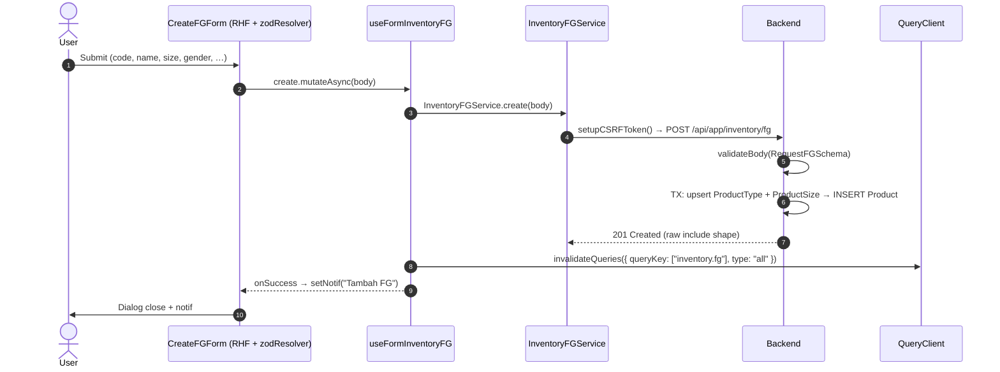
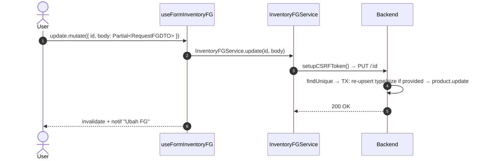
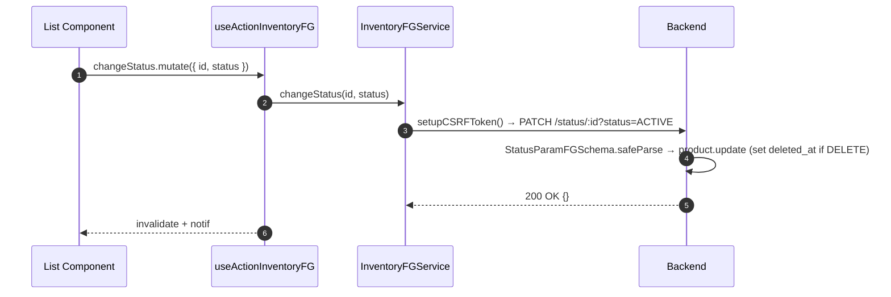
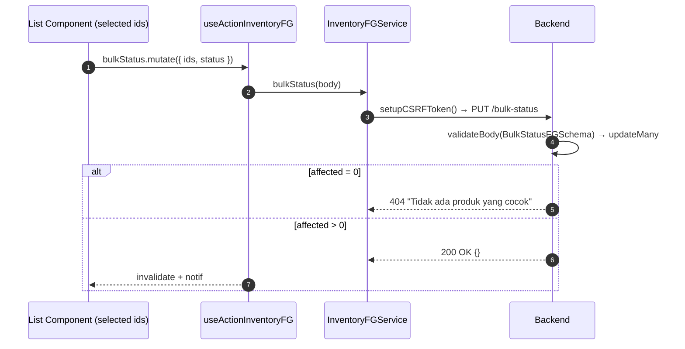
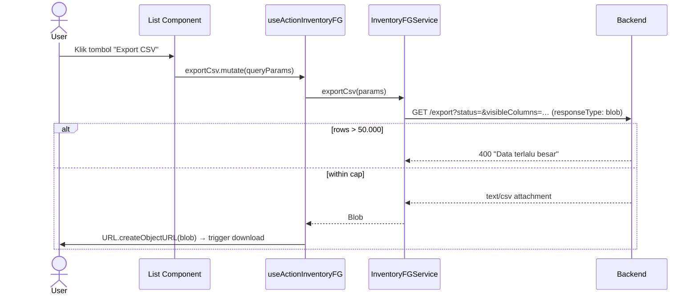

# Inventory / FG — Frontend Integration (Scope Level)

End-to-end FE integration **lengkap** untuk scope Finished Goods (FG). FE engineer baca file ini saja → bisa implement dari nol.

**Backend scope path**: `api/src/module/application/inventory/fg/`
**Frontend scope path**: `app/src/app/(application)/inventory/fg/server/` 🚧 TBD
**Component path**: `app/src/components/pages/inventory/fg/` 🚧 TBD
**Endpoint base**: `/api/app/inventory/fg`
**Status FE**: 🚧 TBD <!-- ubah ke ✅ Ready setelah file FE dibuat -->

**Dependencies**:

- Konvensi global modul ([`../frontend-integration.md`](../frontend-integration.md)) — CSRF, queryKey naming, error pattern, debounce, design tokens, status code expectation.
- BE scope doc ([`./README.md`](./README.md)) — Zod schema source, endpoint detail, error catalog.
- SOP canonical: [`frontend-dev-flow`](../../../../.claude/skills/frontend-dev-flow/SKILL.md).

Master data produk jadi (parfum dalam satuan ML). CRUD lengkap + filter/sort/search + bulk status + soft-delete (trash mode) + permanent delete (`/clean`) + CSV export. Detail endpoint mengembalikan FG + recipes aktif + stok warehouse (period terbaru) + stok outlet aktif.

---

## 1. Schema Mirror End-to-End

**Source BE**: `src/module/application/inventory/fg/fg.schema.ts`. FE mirror WAJIB 1:1 (kecuali import enum: BE pakai relative path Prisma client, FE pakai `@/shared/types`).

### 1.1 `RequestFGSchema` (BE — verbatim)

```ts
import z from "zod";
import { GENDER, STATUS, WarehouseType, OutletType } from "../../../../generated/prisma/enums.js";

export const RequestFGSchema = z.object({
    code: z.string().max(100).regex(/^\S+$/, { message: "Gunakan '_' (underscore) untuk spasi" }),
    name: z
        .string()
        .min(5, "Nama produk minimal memiliki 5 karakter")
        .max(100, "Nama produk tidak boleh melebihi 100 karakter"),
    size: z.coerce.number("Ukuran tidak boleh kosong").min(1),
    gender: z.enum(GENDER).optional().default("UNISEX"),
    status: z.enum(STATUS).default("PENDING").optional(),
    z_value: z.number().default(1.65),
    lead_time: z.number().int().min(1).default(14),
    review_period: z.number().int().min(1).default(30),
    product_type: z.string().nullable().optional(),
    distribution_percentage: z.coerce.number().min(0).default(0).optional(),
    safety_percentage: z.coerce.number().min(0).default(0).optional(),
    description: z.string().nullable().optional(),
});
```

**Field detail**:

| Field                     | Type             | Required | Default     | Constraint                  | Error msg                                  | Catatan                                                                       |
| :------------------------ | :--------------- | :------- | :---------- | :-------------------------- | :----------------------------------------- | :---------------------------------------------------------------------------- |
| `code`                    | `string`         | ✅       | —           | `max(100)`, regex `/^\S+$/` | `"Gunakan '_' (underscore) untuk spasi"`   | `@unique`. Gunakan `_` sebagai separator (mis. `EDP_110`).                    |
| `name`                    | `string`         | ✅       | —           | `min(5)`, `max(100)`        | `"Nama produk minimal memiliki 5 karakter"` / `"…melebihi 100 karakter"` | Display name.                                  |
| `size`                    | `number`         | ✅       | —           | `coerce`, `min(1)`          | `"Ukuran tidak boleh kosong"`              | Angka murni; service auto-upsert ke `ProductSize` via `getOrCreateSize`.      |
| `gender`                  | `enum GENDER`    | ❌       | `"UNISEX"`  | enum `GENDER`               | (default Zod)                              | `WOMEN \| MEN \| UNISEX`.                                                     |
| `status`                  | `enum STATUS`    | ❌       | `"PENDING"` | enum `STATUS`               | (default Zod)                              | `PENDING \| ACTIVE \| FAVOURITE \| BLOCK \| DELETE`.                          |
| `z_value`                 | `number`         | ❌       | `1.65`      | —                           | —                                          | Z-score safety stock (BE Decimal 5,2 → cast Number di response).              |
| `lead_time`               | `number` (int)   | ❌       | `14`        | `int()`, `min(1)`           | (default Zod)                              | Hari.                                                                         |
| `review_period`           | `number` (int)   | ❌       | `30`        | `int()`, `min(1)`           | (default Zod)                              | Hari.                                                                         |
| `product_type`            | `string \| null` | ❌       | —           | nullable + optional         | —                                          | Nama tipe. Service auto-upsert via `getOrCreateSlug(ProductType)`.            |
| `distribution_percentage` | `number`         | ❌       | `0`         | `coerce`, `min(0)`          | (default Zod)                              | Persentase distribusi (Decimal 5,2).                                          |
| `safety_percentage`       | `number`         | ❌       | `0`         | `coerce`, `min(0)`          | (default Zod)                              | Persentase safety stock (Decimal 5,2).                                        |
| `description`             | `string \| null` | ❌       | —           | nullable + optional         | —                                          | Free text.                                                                    |

### 1.2 `ResponseFGSchema` & DTO (BE — verbatim)

```ts
export const ResponseFGSchema = RequestFGSchema.extend({
    id: z.number(),
    gender: z.enum(GENDER).default("UNISEX"),
    size: z.string("Ukuran tidak boleh kosong"),
    product_type: z.string().nullable().optional(),
    created_at: z.date(),
    updated_at: z.date(),
    deleted_at: z.date().nullable(),
});

export type ResponseFGDTO = z.infer<typeof ResponseFGSchema>;
```

**Transformasi service** (FE harus tahu agar render tepat):

| Field di response         | Sumber Prisma                                          | Transformasi service                                       |
| :------------------------ | :----------------------------------------------------- | :--------------------------------------------------------- |
| `z_value`                 | `Product.z_value` (Decimal)                            | `Number(p.z_value)` agar JSON-safe.                        |
| `distribution_percentage` | `Product.distribution_percentage` (Decimal)            | `Number(p.distribution_percentage)`.                       |
| `safety_percentage`       | `Product.safety_percentage` (Decimal)                  | `Number(p.safety_percentage)`.                             |
| `size`                    | `Product.size.size` (Int via `ProductSize`)            | `formatSize(p.size?.size)` → `"110 ML"` atau `""`.         |
| `product_type`            | `Product.product_type.name` (via `ProductType`)        | `p.product_type?.name ?? null`.                            |

> **Quirk shape — `create` & `update`**: response `create`/`update` mengembalikan `size` & `product_type` sebagai **objek mentah include** (mis. `{ id: 1, size: 110 }`, `{ id: 1, name: "Parfum EDP", slug: "parfum-edp" }`), bukan string ter-flatten. Hanya `list` & `detail` yang flatten. FE wajib handle dua bentuk atau optimistic-merge dari form state. <!-- verify: pertimbangkan unifikasi shape di service untuk konsistensi -->

### 1.3 `ResponseFGDetailSchema` (BE — verbatim)

```ts
export const FGRecipeItemSchema = z.object({
    id: z.number(),
    quantity: z.number(),
    version: z.number(),
    is_active: z.boolean(),
    raw_material: z.object({
        id: z.number(),
        name: z.string(),
        unit: z.string().nullable(),
        preferred_unit_price: z.number().nullable(),
    }),
});

export const FGWarehouseStockSchema = z.object({
    quantity: z.number(),
    min_stock: z.number().nullable(),
    warehouse: z.object({
        id: z.number(),
        name: z.string(),
        code: z.string().nullable(),
        type: z.enum(WarehouseType),
    }),
});

export const FGOutletStockSchema = z.object({
    quantity: z.number(),
    min_stock: z.number().nullable(),
    outlet: z.object({
        id: z.number(),
        name: z.string(),
        code: z.string(),
        type: z.enum(OutletType),
    }),
});

export const FGLatestPeriodSchema = z.object({
    year: z.number(),
    month: z.number(),
    date: z.number(),
});

export const FGStockSchema = z.object({
    latest_period: FGLatestPeriodSchema.nullable(),
    warehouse_stocks: z.array(FGWarehouseStockSchema),
    outlet_stocks: z.array(FGOutletStockSchema),
});

export const ResponseFGDetailSchema = ResponseFGSchema.extend({
    recipes: z.array(FGRecipeItemSchema),
    stock: FGStockSchema,
});
```

### 1.4 `QueryFGSchema` (BE — verbatim)

```ts
export const QueryFGSchema = z.object({
    type_id: z.coerce.number().positive().optional(),
    size_id: z.coerce.number().positive().optional(),
    gender: z.enum(GENDER).optional(),

    page: z.coerce.number().int().positive().default(1).optional(),
    take: z.coerce.number().int().positive().max(100).default(25).optional(),

    search: z.string().optional(),
    status: z.enum(STATUS).optional(),
    sortBy: z
        .enum([
            "code",
            "name",
            "gender",
            "type",
            "size",
            "updated_at",
            "created_at",
        ])
        .default("updated_at"),
    sortOrder: z.enum(["asc", "desc"]).default("desc"),
    visibleColumns: z.string().optional(),
});
```

### 1.5 `BulkStatusFGSchema` & `StatusParamFGSchema` (BE — verbatim)

```ts
export const BulkStatusFGSchema = z.object({
    ids: z.array(z.number().int().positive()).min(1, "Minimal 1 produk harus dipilih"),
    status: z.enum(STATUS),
});

export const StatusParamFGSchema = z.object({
    status: z.enum(STATUS),
});
```

### 1.6 Enum referensi (Prisma)

```prisma
enum GENDER {
    WOMEN
    MEN
    UNISEX
}

enum STATUS {
    PENDING
    ACTIVE
    FAVOURITE
    BLOCK
    DELETE
}

enum WarehouseType {
    FINISH_GOODS
    RAW_MATERIAL
}

enum OutletType {
    RETAIL
    MARKETPLACE
}
```

FE import via `@/shared/types` — **JANGAN duplikasi literal**.

---

## 2. FE Schema Mirror

**File**: `app/src/app/(application)/inventory/fg/server/inventory.fg.schema.ts` 🚧 TBD

```ts
import { z } from "zod";
import { GENDER, STATUS, WarehouseType, OutletType } from "@/shared/types";

export const RequestFGSchema = z.object({
    code: z.string().max(100).regex(/^\S+$/, { message: "Gunakan '_' (underscore) untuk spasi" }),
    name: z
        .string()
        .min(5, "Nama produk minimal memiliki 5 karakter")
        .max(100, "Nama produk tidak boleh melebihi 100 karakter"),
    size: z.coerce.number("Ukuran tidak boleh kosong").min(1),
    gender: z.enum(GENDER).optional().default("UNISEX"),
    status: z.enum(STATUS).default("PENDING").optional(),
    z_value: z.number().default(1.65),
    lead_time: z.number().int().min(1).default(14),
    review_period: z.number().int().min(1).default(30),
    product_type: z.string().nullable().optional(),
    distribution_percentage: z.coerce.number().min(0).default(0).optional(),
    safety_percentage: z.coerce.number().min(0).default(0).optional(),
    description: z.string().nullable().optional(),
});

export type RequestFGDTO = z.input<typeof RequestFGSchema>;

export const ResponseFGSchema = RequestFGSchema.extend({
    id: z.number(),
    gender: z.enum(GENDER).default("UNISEX"),
    size: z.string("Ukuran tidak boleh kosong"),
    product_type: z.string().nullable().optional(),
    created_at: z.coerce.date(),
    updated_at: z.coerce.date(),
    deleted_at: z.coerce.date().nullable(),
});

export type ResponseFGDTO = z.infer<typeof ResponseFGSchema>;

export const FGRecipeItemSchema = z.object({
    id: z.number(),
    quantity: z.number(),
    version: z.number(),
    is_active: z.boolean(),
    raw_material: z.object({
        id: z.number(),
        name: z.string(),
        unit: z.string().nullable(),
        preferred_unit_price: z.number().nullable(),
    }),
});

export const FGWarehouseStockSchema = z.object({
    quantity: z.number(),
    min_stock: z.number().nullable(),
    warehouse: z.object({
        id: z.number(),
        name: z.string(),
        code: z.string().nullable(),
        type: z.enum(WarehouseType),
    }),
});

export const FGOutletStockSchema = z.object({
    quantity: z.number(),
    min_stock: z.number().nullable(),
    outlet: z.object({
        id: z.number(),
        name: z.string(),
        code: z.string(),
        type: z.enum(OutletType),
    }),
});

export const FGLatestPeriodSchema = z.object({
    year: z.number(),
    month: z.number(),
    date: z.number(),
});

export const FGStockSchema = z.object({
    latest_period: FGLatestPeriodSchema.nullable(),
    warehouse_stocks: z.array(FGWarehouseStockSchema),
    outlet_stocks: z.array(FGOutletStockSchema),
});

export const ResponseFGDetailSchema = ResponseFGSchema.extend({
    recipes: z.array(FGRecipeItemSchema),
    stock: FGStockSchema,
});

export type ResponseFGDetailDTO = z.infer<typeof ResponseFGDetailSchema>;
export type FGRecipeItemDTO = z.infer<typeof FGRecipeItemSchema>;
export type FGWarehouseStockDTO = z.infer<typeof FGWarehouseStockSchema>;
export type FGOutletStockDTO = z.infer<typeof FGOutletStockSchema>;
export type FGLatestPeriodDTO = z.infer<typeof FGLatestPeriodSchema>;
export type FGStockDTO = z.infer<typeof FGStockSchema>;

export const QueryFGSchema = z.object({
    type_id: z.coerce.number().positive().optional(),
    size_id: z.coerce.number().positive().optional(),
    gender: z.enum(GENDER).optional(),
    page: z.coerce.number().int().positive().default(1).optional(),
    take: z.coerce.number().int().positive().max(100).default(25).optional(),
    search: z.string().optional(),
    status: z.enum(STATUS).optional(),
    sortBy: z
        .enum(["code", "name", "gender", "type", "size", "updated_at", "created_at"])
        .default("updated_at"),
    sortOrder: z.enum(["asc", "desc"]).default("desc"),
    visibleColumns: z.string().optional(),
});

export type QueryFGDTO = z.infer<typeof QueryFGSchema>;

export const BulkStatusFGSchema = z.object({
    ids: z.array(z.number().int().positive()).min(1, "Minimal 1 produk harus dipilih"),
    status: z.enum(STATUS),
});

export type BulkStatusFGDTO = z.infer<typeof BulkStatusFGSchema>;
```

**Diff vs BE**: empty — field, enum, default, regex, min/max, error message identik. Pembedanya: `created_at`/`updated_at`/`deleted_at` pakai `z.coerce.date()` di FE (BE pakai `z.date()` karena Prisma sudah return Date object). Enum di-import dari `@/shared/types` agar tidak duplikasi literal.

---

## 3. Service Class — FULL CODE

**File**: `app/src/app/(application)/inventory/fg/server/inventory.fg.service.ts` 🚧 TBD

```ts
import api from "@/lib/api";
import { setupCSRFToken } from "@/shared/api/csrf";
import type { ApiSuccessResponse } from "@/shared/types/api";
import type { STATUS } from "@/shared/types";
import type {
    RequestFGDTO,
    ResponseFGDTO,
    ResponseFGDetailDTO,
    QueryFGDTO,
    BulkStatusFGDTO,
} from "./inventory.fg.schema";

const API = `${process.env.NEXT_PUBLIC_API}/api/app/inventory/fg`;

export class InventoryFGService {
    static async list(params: QueryFGDTO): Promise<{ data: ResponseFGDTO[]; len: number }> {
        try {
            const { data } = await api.get<ApiSuccessResponse<{ data: ResponseFGDTO[]; len: number }>>(
                API,
                { params },
            );
            return data.data;
        } catch (error) {
            throw error;
        }
    }

    static async detail(id: number): Promise<ResponseFGDetailDTO> {
        try {
            const { data } = await api.get<ApiSuccessResponse<ResponseFGDetailDTO>>(`${API}/${id}`);
            return data.data;
        } catch (error) {
            throw error;
        }
    }

    static async create(body: RequestFGDTO): Promise<void> {
        try {
            await setupCSRFToken();
            await api.post(API, body);
        } catch (error) {
            throw error;
        }
    }

    static async update(id: number, body: Partial<RequestFGDTO>): Promise<void> {
        try {
            await setupCSRFToken();
            await api.put(`${API}/${id}`, body);
        } catch (error) {
            throw error;
        }
    }

    // PATCH /status/:id?status=ACTIVE — query param, no body.
    static async changeStatus(id: number, status: STATUS): Promise<void> {
        try {
            await setupCSRFToken();
            await api.patch(`${API}/status/${id}`, null, { params: { status } });
        } catch (error) {
            throw error;
        }
    }

    static async bulkStatus(body: BulkStatusFGDTO): Promise<void> {
        try {
            await setupCSRFToken();
            await api.put(`${API}/bulk-status`, body);
        } catch (error) {
            throw error;
        }
    }

    static async clean(): Promise<void> {
        try {
            await setupCSRFToken();
            await api.delete(`${API}/clean`);
        } catch (error) {
            throw error;
        }
    }

    static async exportCsv(params: QueryFGDTO): Promise<Blob> {
        try {
            const { data } = await api.get<Blob>(`${API}/export`, { params, responseType: "blob" });
            return data;
        } catch (error) {
            throw error;
        }
    }
}
```

---

## 4. Hooks — 5 Hook Split FULL CODE

**File**: `app/src/app/(application)/inventory/fg/server/use.inventory.fg.ts` 🚧 TBD

```ts
"use client";
import { useQuery, useMutation, useQueryClient } from "@tanstack/react-query";
import { useSetAtom } from "jotai";
import { useState, useMemo, useCallback } from "react";
import { useSearchParams } from "next/navigation";
import { useDebounce, useQueryParams } from "@/shared/hooks";
import { errorAtom, notificationAtom } from "@/shared/atoms";
import { FetchError } from "@/shared/api/errors";
import type { ResponseError } from "@/shared/types/api";
import type { STATUS } from "@/shared/types";
import { InventoryFGService } from "./inventory.fg.service";
import type {
    RequestFGDTO,
    ResponseFGDTO,
    ResponseFGDetailDTO,
    QueryFGDTO,
    BulkStatusFGDTO,
} from "./inventory.fg.schema";

const KEY = ["inventory.fg"] as const;

// ──────────────────────────────────────────────────────────────────────────────
// 4.1 READ — list + detail
// ──────────────────────────────────────────────────────────────────────────────
export function useInventoryFG(params: QueryFGDTO, enabled = true) {
    return useQuery<{ data: ResponseFGDTO[]; len: number }, ResponseError>({
        queryKey: [...KEY, params],
        queryFn: () => InventoryFGService.list(params),
        enabled,
        staleTime: 30_000,
    });
}

export function useInventoryFGDetail(id: number, enabled = true) {
    return useQuery<ResponseFGDetailDTO, ResponseError>({
        queryKey: [...KEY, id],
        queryFn: () => InventoryFGService.detail(id),
        enabled: enabled && Boolean(id),
    });
}

// ──────────────────────────────────────────────────────────────────────────────
// 4.2 WRITE — create + update mutations
// ──────────────────────────────────────────────────────────────────────────────
export function useFormInventoryFG() {
    const setErr = useSetAtom(errorAtom);
    const setNotif = useSetAtom(notificationAtom);
    const queryClient = useQueryClient();

    const invalidate = () => queryClient.invalidateQueries({ queryKey: KEY, type: "all" });

    const create = useMutation<unknown, ResponseError, RequestFGDTO>({
        mutationKey: [...KEY, "create"],
        mutationFn: (body) => InventoryFGService.create(body),
        onSuccess: () => {
            setNotif({ title: "Tambah FG", message: "Berhasil menambahkan produk baru" });
            invalidate();
        },
        onError: (err) => FetchError(err, setErr),
    });

    const update = useMutation<unknown, ResponseError, { id: number; body: Partial<RequestFGDTO> }>({
        mutationKey: [...KEY, "update"],
        mutationFn: ({ id, body }) => InventoryFGService.update(id, body),
        onSuccess: () => {
            setNotif({ title: "Ubah FG", message: "Berhasil memperbarui produk" });
            invalidate();
        },
        onError: (err) => FetchError(err, setErr),
    });

    return { create, update };
}

// ──────────────────────────────────────────────────────────────────────────────
// 4.3 ACTION — status + bulk + clean + export
// ──────────────────────────────────────────────────────────────────────────────
export function useActionInventoryFG() {
    const setErr = useSetAtom(errorAtom);
    const setNotif = useSetAtom(notificationAtom);
    const queryClient = useQueryClient();
    const invalidate = () => queryClient.invalidateQueries({ queryKey: KEY, type: "all" });

    const changeStatus = useMutation<unknown, ResponseError, { id: number; status: STATUS }>({
        mutationKey: [...KEY, "changeStatus"],
        mutationFn: ({ id, status }) => InventoryFGService.changeStatus(id, status),
        onSuccess: () => {
            setNotif({ title: "Ubah Status", message: "Status produk berhasil diubah" });
            invalidate();
        },
        onError: (err) => FetchError(err, setErr),
    });

    const bulkStatus = useMutation<unknown, ResponseError, BulkStatusFGDTO>({
        mutationKey: [...KEY, "bulkStatus"],
        mutationFn: (body) => InventoryFGService.bulkStatus(body),
        onSuccess: () => {
            setNotif({ title: "Bulk Status", message: "Status produk berhasil diubah massal" });
            invalidate();
        },
        onError: (err) => FetchError(err, setErr),
    });

    const clean = useMutation<unknown, ResponseError, void>({
        mutationKey: [...KEY, "clean"],
        mutationFn: () => InventoryFGService.clean(),
        onSuccess: () => {
            setNotif({ title: "Bersihkan Sampah", message: "Produk sampah berhasil dibersihkan" });
            invalidate();
        },
        onError: (err) => FetchError(err, setErr),
    });

    const exportCsv = useMutation<Blob, ResponseError, QueryFGDTO>({
        mutationKey: [...KEY, "exportCsv"],
        mutationFn: (params) => InventoryFGService.exportCsv(params),
        onSuccess: (blob) => {
            const url = URL.createObjectURL(blob);
            const a = document.createElement("a");
            a.href = url;
            a.download = `fg-export-${Date.now()}.csv`;
            a.click();
            URL.revokeObjectURL(url);
            setNotif({ title: "Export CSV", message: "Export selesai" });
        },
        onError: (err) => FetchError(err, setErr),
    });

    return { changeStatus, bulkStatus, clean, exportCsv };
}

// ──────────────────────────────────────────────────────────────────────────────
// 4.4 TableState — URL sync + debounce search + trash toggle + gender filter
// ──────────────────────────────────────────────────────────────────────────────
export function useInventoryFGTableState() {
    const searchParams = useSearchParams();
    const { batchSet } = useQueryParams();

    const rawSearch = searchParams.get("search") ?? "";
    const [search, setSearchState] = useState(rawSearch);
    const debouncedSearch = useDebounce(search, 500);

    const setSearch = useCallback((val: string) => {
        setSearchState(val);
    }, []);

    // Sync ke URL setelah debounce
    useMemo(() => {
        batchSet({ search: debouncedSearch || null, page: "1" });
    }, [debouncedSearch, batchSet]);

    const page = Number(searchParams.get("page") ?? 1);
    const take = Number(searchParams.get("take") ?? 25);
    const sortBy = (searchParams.get("sortBy") ?? "updated_at") as QueryFGDTO["sortBy"];
    const sortOrder = (searchParams.get("sortOrder") ?? "desc") as QueryFGDTO["sortOrder"];
    const gender = (searchParams.get("gender") ?? undefined) as QueryFGDTO["gender"];
    const status = (searchParams.get("status") ?? undefined) as QueryFGDTO["status"];
    const isTrashMode = searchParams.get("trash") === "1";

    const toggleTrashMode = useCallback(() => {
        // Trash mode = filter status=DELETE; FE wajib explicit set status agar BE tidak auto-exclude.
        batchSet({
            trash: isTrashMode ? null : "1",
            status: isTrashMode ? null : "DELETE",
            page: "1",
        });
    }, [isTrashMode, batchSet]);

    const queryParams = useMemo<QueryFGDTO>(
        () => ({
            page,
            take,
            search: debouncedSearch || undefined,
            sortBy,
            sortOrder,
            gender,
            status,
        }),
        [page, take, debouncedSearch, sortBy, sortOrder, gender, status],
    );

    return {
        search,
        setSearch,
        page,
        take,
        sortBy,
        sortOrder,
        gender,
        status,
        isTrashMode,
        toggleTrashMode,
        queryParams,
    };
}

// ──────────────────────────────────────────────────────────────────────────────
// 4.5 Query-wrapper — bundle list + tableState untuk page consumer
// ──────────────────────────────────────────────────────────────────────────────
export function useInventoryFGQuery() {
    const tableState = useInventoryFGTableState();
    const query = useInventoryFG(tableState.queryParams);
    return { ...tableState, query };
}
```

---

## 5. Components — Snippets

### 5.1 List page — `components/pages/inventory/fg/index.tsx` 🚧 TBD

```tsx
"use client";
import {
    useInventoryFGQuery,
    useActionInventoryFG,
} from "@/app/(application)/inventory/fg/server/use.inventory.fg";
import { DataTable } from "@/components/ui/data-table";
import { columns } from "./table/columns";
import { FGFormDialog } from "./form/fg-form-dialog";

export default function InventoryFGList() {
    const { query, search, setSearch, isTrashMode, toggleTrashMode, queryParams } =
        useInventoryFGQuery();
    const { bulkStatus, clean, exportCsv } = useActionInventoryFG();

    return (
        <section className="space-y-4">
            <header className="flex items-center justify-between gap-2">
                <input
                    value={search}
                    onChange={(e) => setSearch(e.target.value)}
                    placeholder="Cari kode / nama / tipe…"
                    className="rounded-xl border border-zinc-200 px-3 py-2"
                />
                <div className="flex gap-2">
                    <button onClick={toggleTrashMode}>
                        {isTrashMode ? "Lihat Aktif" : "Lihat Sampah"}
                    </button>
                    <button onClick={() => exportCsv.mutate(queryParams)} disabled={exportCsv.isPending}>
                        {exportCsv.isPending ? "Mengekspor…" : "Export CSV"}
                    </button>
                    {isTrashMode ? (
                        <button onClick={() => clean.mutate()} disabled={clean.isPending}>
                            Bersihkan Sampah
                        </button>
                    ) : (
                        <FGFormDialog mode="create" />
                    )}
                </div>
            </header>
            <DataTable
                tableId="inventory-fg-table"
                columns={columns}
                data={query.data?.data ?? []}
                total={query.data?.len ?? 0}
                loading={query.isLoading}
                enableMultiSelect
                onBulkAction={(ids, action) => bulkStatus.mutate({ ids, status: action })}
            />
        </section>
    );
}
```

### 5.2 Form create — `components/pages/inventory/fg/form/create.tsx` 🚧 TBD

```tsx
"use client";
import { useForm } from "react-hook-form";
import { zodResolver } from "@hookform/resolvers/zod";
import { Form } from "@/components/ui/form/main";
import { InputForm, SelectForm, TextareaForm } from "@/components/ui/form";
import {
    RequestFGSchema,
    type RequestFGDTO,
} from "@/app/(application)/inventory/fg/server/inventory.fg.schema";
import { useFormInventoryFG } from "@/app/(application)/inventory/fg/server/use.inventory.fg";

const GENDER_OPTIONS = [
    { value: "WOMEN", label: "Wanita" },
    { value: "MEN", label: "Pria" },
    { value: "UNISEX", label: "Unisex" },
];

export function CreateFGForm({ onSuccess }: { onSuccess?: () => void }) {
    const form = useForm<RequestFGDTO>({
        resolver: zodResolver(RequestFGSchema),
        defaultValues: { gender: "UNISEX", status: "PENDING", z_value: 1.65, lead_time: 14, review_period: 30 },
    });
    const { create } = useFormInventoryFG();

    const handleSubmit = form.handleSubmit(async (body) => {
        await create.mutateAsync(body);
        form.reset();
        onSuccess?.();
    });

    return (
        <Form methods={form}>
            <form onSubmit={handleSubmit} className="space-y-3">
                <InputForm name="code" label="Kode" required placeholder="EDP_110" />
                <InputForm name="name" label="Nama Produk" required />
                <InputForm name="product_type" label="Tipe Produk" placeholder="Parfum EDP" />
                <SelectForm name="gender" label="Gender" options={GENDER_OPTIONS} />
                <InputForm name="size" label="Ukuran (ML)" type="number" required />
                <InputForm name="lead_time" label="Lead Time (hari)" type="number" />
                <InputForm name="review_period" label="Review Period (hari)" type="number" />
                <InputForm name="z_value" label="Nilai Z" type="number" step="0.01" />
                <InputForm name="distribution_percentage" label="Distribusi %" type="number" />
                <InputForm name="safety_percentage" label="Safety %" type="number" />
                <TextareaForm name="description" label="Deskripsi" />
                <button type="submit" disabled={create.isPending}>
                    {create.isPending ? "Menyimpan…" : "Simpan"}
                </button>
            </form>
        </Form>
    );
}
```

### 5.3 Form edit — `components/pages/inventory/fg/form/edit.tsx` 🚧 TBD

```tsx
"use client";
import { useForm } from "react-hook-form";
import { zodResolver } from "@hookform/resolvers/zod";
import { Form } from "@/components/ui/form/main";
import { InputForm, SelectForm } from "@/components/ui/form";
import {
    RequestFGSchema,
    type RequestFGDTO,
    type ResponseFGDTO,
} from "@/app/(application)/inventory/fg/server/inventory.fg.schema";
import { useFormInventoryFG } from "@/app/(application)/inventory/fg/server/use.inventory.fg";

export function EditFGForm({ initial, onSuccess }: { initial: ResponseFGDTO; onSuccess?: () => void }) {
    const form = useForm<RequestFGDTO>({
        resolver: zodResolver(RequestFGSchema.partial()),
        defaultValues: {
            code: initial.code,
            name: initial.name,
            // initial.size = "110 ML" → parse balik ke number sebelum submit
            size: Number(String(initial.size).replace(/\D/g, "")) || undefined,
            gender: initial.gender,
            status: initial.status,
            z_value: initial.z_value,
            lead_time: initial.lead_time,
            review_period: initial.review_period,
            product_type: initial.product_type ?? undefined,
            distribution_percentage: initial.distribution_percentage,
            safety_percentage: initial.safety_percentage,
            description: initial.description ?? undefined,
        },
    });
    const { update } = useFormInventoryFG();

    const handleSubmit = form.handleSubmit(async (body) => {
        await update.mutateAsync({ id: initial.id, body });
        onSuccess?.();
    });

    return (
        <Form methods={form}>
            <form onSubmit={handleSubmit} className="space-y-3">
                {/* field list sama dengan CreateFGForm */}
                <InputForm name="name" label="Nama Produk" required />
                {/* … */}
                <button type="submit" disabled={update.isPending}>
                    {update.isPending ? "Menyimpan…" : "Simpan Perubahan"}
                </button>
            </form>
        </Form>
    );
}
```

### 5.4 Columns — `components/pages/inventory/fg/table/columns.tsx` 🚧 TBD

```tsx
import type { ColumnDef } from "@tanstack/react-table";
import type { ResponseFGDTO } from "@/app/(application)/inventory/fg/server/inventory.fg.schema";
import { StatusBadge, GenderBadge } from "@/components/ui/badge";

export const columns: ColumnDef<ResponseFGDTO>[] = [
    { accessorKey: "code", header: "Kode", cell: ({ row }) => <span className="font-mono">{row.original.code}</span> },
    { accessorKey: "name", header: "Nama Produk" },
    { accessorKey: "product_type", header: "Tipe", cell: ({ row }) => row.original.product_type ?? "—" },
    { accessorKey: "size", header: "Ukuran" }, // sudah "110 ML"
    {
        accessorKey: "gender",
        header: "Gender",
        cell: ({ row }) => <GenderBadge value={row.original.gender} />,
    },
    {
        accessorKey: "z_value",
        header: "Nilai Z",
        cell: ({ row }) => <span className="font-mono">{row.original.z_value.toFixed(2)}</span>,
    },
    { accessorKey: "lead_time", header: "Lead Time" },
    {
        accessorKey: "status",
        header: "Status",
        cell: ({ row }) => <StatusBadge value={row.original.status} />,
    },
    {
        accessorKey: "updated_at",
        header: "Diperbarui",
        cell: ({ row }) => new Date(row.original.updated_at).toLocaleDateString("id-ID"),
    },
];
```

### 5.5 Page entry — `app/(application)/inventory/fg/page.tsx` 🚧 TBD

```tsx
import { Suspense } from "react";
import InventoryFGList from "@/components/pages/inventory/fg";

export default function InventoryFGPage() {
    return (
        <Suspense fallback={<div>Loading…</div>}>
            <InventoryFGList />
        </Suspense>
    );
}
```

---

## 6. End-to-End Flow per Operasi

### 6.1 Create (POST /)



### 6.2 Update (PUT /:id)



### 6.3 Status (PATCH /status/:id?status=…)



### 6.4 Bulk Status (PUT /bulk-status)



### 6.5 Export CSV (GET /export)



---

## 7. Edge Cases & Per-Scope Quirks

- **Debounce search 500ms**: `useDebounce(search, 500)`. URL sync via `batchSet({ search, page: "1" })` setelah debounce — page selalu reset ke 1 saat search berubah. Search di-ILIKE pada `name`, `code`, `product_type.name` (indeks trigram GIN).
- **Trash mode toggle (`?trash=1`)**: FE wajib explicit set `status=DELETE` saat toggle ke trash; tanpa param `status`, BE auto-exclude `STATUS.DELETE` di WHERE (`buildProductWhere` di `fg.service.ts:36`). Bulk bar swap "Hapus" → "Restore" (status ACTIVE) + tombol "Bersihkan Sampah" (`clean`).
- **Gender filter**: enum `GENDER` Prisma = `WOMEN | MEN | UNISEX`. Default form `UNISEX`. Filter via `?gender=…` di query.
- **`z_value` Decimal display**: BE Decimal 5,2 → cast `Number` di service. FE render `.toFixed(2)` di kolom (font mono).
- **`product_type` auto-upsert**: kirim string nama tipe; service panggil `getOrCreateSlug(tx.productType, product_type)`. Tidak perlu pre-create master. Slug-conflict aman (race-safe lewat `getOrCreateSlug`).
- **`ProductSize` auto-upsert**: `size` dikirim sebagai number; service panggil `getOrCreateSize(tx, size)`. FE form pakai input number; tidak ada dropdown master size di create.
- **Response shape mismatch `create`/`update` vs `list`/`detail`**:
    - `list`/`detail`: `size: "110 ML"` (string), `product_type: "Parfum EDP"` (string).
    - `create`/`update`: `size: { id, size }` (objek), `product_type: { id, name, slug }` (objek).
    - FE: setelah `mutate.onSuccess`, jangan render hasil mutation langsung — invalidate `KEY` lalu tampilkan dari `useInventoryFG` (list shape).
- **CSV export header consistency**: `EXPORT_COLUMNS` di `fg.service.ts:65` memakai `FG_IMPORT_HEADERS` untuk kolom roundtrip (code/name/type/gender/size/distribution/safety) — header export ↔ import sinkron. **Catatan dari BE README**: header display ("Lead Time", "Nilai Z", "Status") **belum** dikanonkan ke konstanta `FG_IMPORT_HEADERS` — flagged sebagai pending unifikasi. FE: jangan hard-code header CSV di sisi FE; selalu ambil dari blob attachment.
- **`visibleColumns` param**: CSV `"code,name,size,gender"`. Kolom `no` selalu disertakan otomatis. FE kirim hanya kolom ID yang user toggle di column visibility menu.
- **BulkActionEnum**: scope ini pakai **full `STATUS`** enum (`PENDING | ACTIVE | FAVOURITE | BLOCK | DELETE`) — beda dengan RM yang hanya subset.
- **Cascade `clean` 409**: ProductionOrder FK = RESTRICT. FE wajib tampilkan toast jelas `"Produk masih terkait dengan Production Order. Hapus permanen ditolak."` (raw dari BE).
- **Stock detail null-handling**: `stock` selalu object (never null). FE cukup null-check `stock.latest_period` saja. Jika `latest_period = null` → `warehouse_stocks = []` (BE skip query). `outlet_stocks` independen dari period.
- **`recipes`** di detail hanya yang `is_active=true`, sorted by `id asc`. Untuk BoM history pakai endpoint terpisah di scope recipe (out of scope).
- **Optimistic UI**: tidak dipakai. Invalidate-on-success cukup karena server response shape mismatch akan menyebabkan optimistic merge bermasalah.

---

## 8. Testing FE (Vitest + RTL)

**Lokasi**: `app/src/__tests__/inventory/fg/` 🚧 TBD. Mengikuti SOP [`frontend-testing`](../../../../.claude/skills/frontend-testing/SKILL.md).

### 8.1 Service test

```ts
import { describe, it, expect, vi, beforeEach } from "vitest";
import api from "@/lib/api";
import { InventoryFGService } from "@/app/(application)/inventory/fg/server/inventory.fg.service";

vi.mock("@/lib/api");
vi.mock("@/shared/api/csrf", () => ({ setupCSRFToken: vi.fn() }));

describe("InventoryFGService", () => {
    beforeEach(() => vi.clearAllMocks());

    it("list passes params to GET", async () => {
        (api.get as any).mockResolvedValue({ data: { data: { data: [], len: 0 } } });
        await InventoryFGService.list({ page: 1, take: 25 });
        expect(api.get).toHaveBeenCalledWith(expect.stringContaining("/inventory/fg"), {
            params: { page: 1, take: 25 },
        });
    });

    it("create calls setupCSRFToken before POST", async () => {
        const { setupCSRFToken } = await import("@/shared/api/csrf");
        (api.post as any).mockResolvedValue({});
        await InventoryFGService.create({ code: "EDP_110", name: "Parfum EDP 110ml", size: 110 } as any);
        expect(setupCSRFToken).toHaveBeenCalled();
        expect(api.post).toHaveBeenCalled();
    });

    it("changeStatus sends query param", async () => {
        (api.patch as any).mockResolvedValue({});
        await InventoryFGService.changeStatus(1, "ACTIVE" as any);
        expect(api.patch).toHaveBeenCalledWith(
            expect.stringContaining("/status/1"),
            null,
            { params: { status: "ACTIVE" } },
        );
    });

    it("exportCsv requests blob responseType", async () => {
        (api.get as any).mockResolvedValue({ data: new Blob(["csv"]) });
        const blob = await InventoryFGService.exportCsv({ page: 1 });
        expect(blob).toBeInstanceOf(Blob);
        expect(api.get).toHaveBeenCalledWith(
            expect.stringContaining("/export"),
            expect.objectContaining({ responseType: "blob" }),
        );
    });
});
```

### 8.2 Hook test

```tsx
import { describe, it, expect, vi } from "vitest";
import { renderHook, waitFor } from "@testing-library/react";
import { QueryClient, QueryClientProvider } from "@tanstack/react-query";
import { useInventoryFG } from "@/app/(application)/inventory/fg/server/use.inventory.fg";
import { InventoryFGService } from "@/app/(application)/inventory/fg/server/inventory.fg.service";

vi.mock("@/app/(application)/inventory/fg/server/inventory.fg.service");

const wrapper = ({ children }: { children: React.ReactNode }) => {
    const client = new QueryClient({ defaultOptions: { queries: { retry: false } } });
    return <QueryClientProvider client={client}>{children}</QueryClientProvider>;
};

describe("useInventoryFG", () => {
    it("fetches list via service", async () => {
        (InventoryFGService.list as any).mockResolvedValue({ data: [], len: 0 });
        const { result } = renderHook(() => useInventoryFG({ page: 1 }), { wrapper });
        await waitFor(() => expect(result.current.isSuccess).toBe(true));
        expect(InventoryFGService.list).toHaveBeenCalledWith({ page: 1 });
    });
});
```

### 8.3 Component test

```tsx
import { describe, it, expect, vi } from "vitest";
import { render, screen } from "@testing-library/react";
import { CreateFGForm } from "@/components/pages/inventory/fg/form/create";

vi.mock("@/app/(application)/inventory/fg/server/use.inventory.fg", () => ({
    useFormInventoryFG: () => ({
        create: { mutateAsync: vi.fn(), isPending: false },
        update: { mutateAsync: vi.fn(), isPending: false },
    }),
}));

describe("CreateFGForm", () => {
    it("renders required fields", () => {
        render(<CreateFGForm />);
        expect(screen.getByLabelText("Kode")).toBeInTheDocument();
        expect(screen.getByLabelText("Nama Produk")).toBeInTheDocument();
        expect(screen.getByLabelText("Ukuran (ML)")).toBeInTheDocument();
    });
});
```

---

## 9. Cross-link

- BE scope doc: [`./README.md`](./README.md)
- Module-level konvensi FE: [`../frontend-integration.md`](../frontend-integration.md)
- SOP FE canonical: [`frontend-dev-flow`](../../../../.claude/skills/frontend-dev-flow/SKILL.md)
- SOP FE testing: [`frontend-testing`](../../../../.claude/skills/frontend-testing/SKILL.md)
- SOP query/mutation: [`frontend-query-mutation`](../../../../.claude/skills/frontend-query-mutation/SKILL.md)
- Sub-modul FG (terkait): [`./import/README.md`](./import/README.md), [`./size/README.md`](./size/README.md), [`./type/README.md`](./type/README.md)
- Postman folder: `Inventory → FG` di `docs/postman/erp-mandalika.postman_collection.json`.
