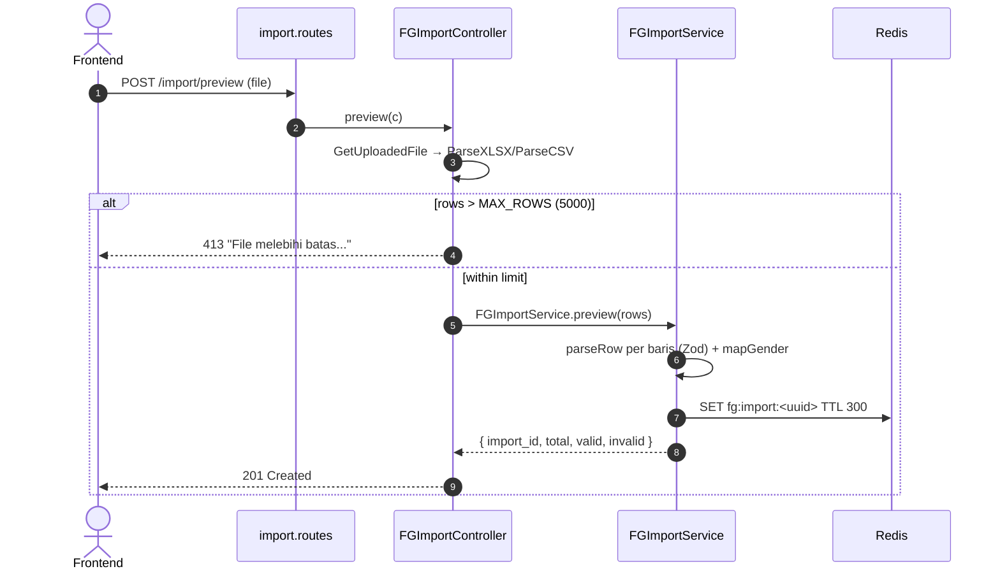
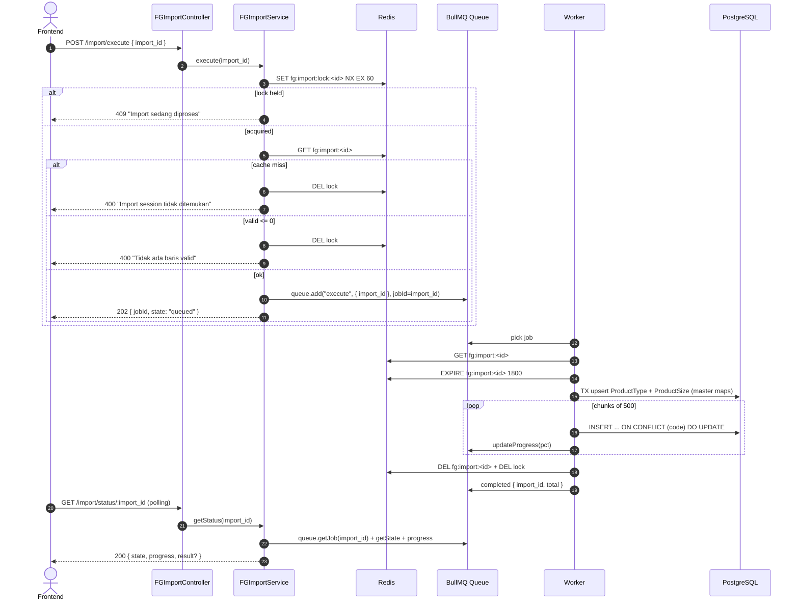

# Module: Inventory / FG / Import (Bulk Import)

**Base path**: `/api/app/inventory/fg/import`
**Source**: `src/module/application/inventory/fg/import/`
**Tests**: `src/tests/inventory/fg/import/`
**Prisma model**: `Product` (target tabel), `ProductType`, `ProductSize` (master data lookup)
**Queue**: BullMQ — `FG_IMPORT_QUEUE_NAME` (lihat `src/config/queue.ts`)

Pipeline bulk import FG dari file Excel / CSV (XLSX & CSV). Dua tahap:

1. **Preview** — parse file di HTTP request, validate per-row dengan Zod, simpan ke Redis cache.
2. **Execute** — async via BullMQ worker, chunked bulk upsert (`INSERT … ON CONFLICT (code) DO UPDATE`).

> **Catatan kritis**:
>
> - Worker dijalankan terpisah lewat `src/worker.ts` (PM2 process `api-erp-worker` di `ecosystem.config.cjs`). Lihat [DEPLOYMENT.md](../../../../DEPLOYMENT.md).
> - Lock per `import_id` di Redis (`fg:import:lock:<id>`, TTL 60s) untuk cegah double-execute.
> - Cache preview TTL **5 menit** (`ImportCacheService.save` default 300s), di-extend ke **30 menit** oleh worker selama job aktif.
> - File limit: `MAX_ROWS = 5000` baris (cek `src/lib/get.file.ts`).

---

## 1. Scope & Fitur

| Fitur                          | Endpoint                                | Catatan                                                       |
| :----------------------------- | :-------------------------------------- | :------------------------------------------------------------ |
| Upload + preview validasi      | `POST /preview`                         | multipart/form-data. Return `import_id` + counter valid/invalid. |
| Lihat ulang preview            | `GET /preview/:import_id`               | Ambil snapshot dari Redis selama belum expired.               |
| Enqueue execute (async)        | `POST /execute`                         | Body `{ import_id }`. Return `jobId`. 409 jika lock terkunci. |
| Polling status job             | `GET /status/:import_id`                | State BullMQ + progress 0-100. Auto-release lock saat terminal.|

### Out of scope

- Preview tidak menulis ke DB. Eksekusi nyata hanya lewat worker.
- File parser (XLSX, CSV) di `src/lib/excel.ts` & `src/lib/csv.ts` — bukan tanggung jawab modul ini.
- Authorization / RBAC — diatur middleware (lihat AUTH.md).
- Master data (`ProductType`, `ProductSize`) — di-upsert otomatis tapi master CRUD-nya di [`../type`](../type/README.md) & [`../size`](../size/README.md).

---

## 2. Arsitektur & Flow

### Layer map

```text
┌─────────────── routes/import.routes.ts ───────────────────────┐
│ GET  /preview/:import_id        → getPreview                  │
│ POST /preview  (multipart)      → preview                     │
│ POST /execute  (JSON body)      → execute (+ validateBody)    │
│ GET  /status/:import_id         → getStatus                   │
└────────────────────┬──────────────────────────────────────────┘
                     ▼
┌─────────── controller/import.controller.ts ───────────────────┐
│ - preview:   GetUploadedFile → ParseXLSX/ParseCSV → service   │
│ - execute:   validate body.import_id (UUID) → service         │
│ - getStatus: param → service                                  │
└────────────────────┬──────────────────────────────────────────┘
                     ▼
┌─────────── service/import.service.ts (FGImportService) ───────┐
│ - preview:    parseRow (Zod) → ImportCacheService.save (TTL 300s) │
│ - execute:    acquireLock (Redis NX) → cache check → enqueue   │
│ - getStatus:  fgImportQueue.getJob → state + progress + result │
│ - getPreview: ImportCacheService.get → snapshot                │
└──────────┬─────────────────────────────┬───────────────────────┘
           ▼                             ▼
   Redis (cache + lock)         BullMQ Queue (Redis backed)
                                         │
                                         ▼
   ┌────────────── worker (src/worker.ts) ─────────────────────────┐
   │ queue/fg-import.worker.ts → processFGImportJob:               │
   │ - validRows + dedupe by code                                  │
   │ - $transaction: getOrCreateSlug(type), getOrCreateSize(size)  │
   │ - chunkArray(500) → bulkUpsertProducts (SQL raw upsert)       │
   │ - updateProgress(pct) per chunk                               │
   │ - cleanup: ImportCacheService.remove + releaseLock            │
   └───────────────────────────────────────────────────────────────┘
```

### Mermaid: Preview flow



### Mermaid: Execute → Worker → Status



---

## 3. DTO / Schemas (end-to-end SSOT)

**Source**: `src/module/application/inventory/fg/import/import.schema.ts`. **FE wajib mirror** — lihat [`../../frontend-integration.md`](../../frontend-integration.md) §2.

### 3.1 `FGImportRowSchema` — parse per baris file (header CSV/XLSX)

**Preprocess helper (verbatim)**:

```ts
const sanitizeNumber = (val: unknown): number => {
    if (val === "" || val === null || val === undefined) return 0;
    if (typeof val === "number") return val;
    if (typeof val === "string") {
        const cleaned = val.replace(/[%,\s]/g, "").trim();
        const num = Number(cleaned);
        return isNaN(num) ? 0 : num;
    }
    return Number(val);
};
```

`sanitizeNumber()` membersihkan karakter `%`, koma, whitespace sebelum `Number()`. Nilai NaN/null/`""` → `0`. Dipakai di `SIZE`, `EDAR`, `SAFETY`.

**Zod chain (verbatim dari `import.schema.ts`)**:

```ts
export const FGImportRowSchema = z.object({
    "PRODUCT CODE": z.string().min(1).max(100),
    "PRODUCT NAME": z.string().min(1).max(200),
    TYPE: z.string().min(1).max(100),
    GENDER: z.string().max(20).optional().default(""),
    SIZE: z.preprocess(sanitizeNumber, z.coerce.number().positive()),
    EDAR: z.preprocess(sanitizeNumber, z.coerce.number().min(0).optional().default(0)),
    SAFETY: z.preprocess(sanitizeNumber, z.coerce.number().min(0).optional().default(0)),
});

export type FGImportRow = z.infer<typeof FGImportRowSchema>;
```

> **Header key case-sensitive.** Backend membaca cell dengan key Zod tersebut persis — **kolom file harus bernama** `PRODUCT CODE`, `PRODUCT NAME`, `TYPE`, `GENDER`, `SIZE`, `EDAR`, `SAFETY`. Lihat dev-flow §1.I untuk aturan konsistensi export ↔ import.

**Field detail**:

| Header (Zod key)  | Type     | Required | Default | Constraint                                                | Catatan                                                            |
| :---------------- | :------- | :------- | :------ | :-------------------------------------------------------- | :----------------------------------------------------------------- |
| `PRODUCT CODE`    | `string` | ✅       | —       | `min(1)`, `max(100)`                                      | Unique business key. Trimmed di service.                            |
| `PRODUCT NAME`    | `string` | ✅       | —       | `min(1)`, `max(200)`                                      | Trimmed di service.                                                 |
| `TYPE`            | `string` | ✅       | —       | `min(1)`, `max(100)`                                      | Nama tipe. Worker upsert lewat `getOrCreateSlug(productType)`.      |
| `GENDER`          | `string` | ❌       | `""`    | `max(20)`                                                 | Normalisasi via `mapGender()` → `WOMEN`/`MEN`/`UNISEX`. Lihat §3.4. |
| `SIZE`            | `number` | ✅       | —       | preprocess `sanitizeNumber` + `coerce.number().positive()`| Worker upsert ke `productSize.size`.                                |
| `EDAR`            | `number` | ❌       | `0`     | preprocess `sanitizeNumber` + `coerce.number().min(0)`    | Distribution percentage.                                            |
| `SAFETY`          | `number` | ❌       | `0`     | preprocess `sanitizeNumber` + `coerce.number().min(0)`    | Safety percentage.                                                  |

### 3.2 `RequestExecuteFGImportSchema` — POST /execute body

```ts
export const RequestExecuteFGImportSchema = z.object({
    import_id: z.string().uuid("Import ID tidak valid"),
});

export type RequestExecuteFGImportDTO = z.infer<typeof RequestExecuteFGImportSchema>;
```

| Field        | Type     | Required | Constraint           | Error msg                  |
| :----------- | :------- | :------- | :------------------- | :------------------------- |
| `import_id`  | `string` | ✅       | UUID                 | `"Import ID tidak valid"`  |

### 3.3 Response DTO

Response **tidak** punya Zod schema (controller-side type-only). Definisi TS di `import.schema.ts`:

```ts
// POST /preview (201)
export type ResponseFGImportDTO = {
    import_id: string;   // UUID
    total: number;
    valid: number;
    invalid: number;
};

// POST /execute (202)
export type ResponseEnqueueFGImportDTO = {
    import_id: string;
    jobId: string;       // sama dengan import_id (deterministic, dipakai `Queue.add` opts `{ jobId }`)
    state: "queued";
};

// GET /status/:import_id (200)
export type ImportJobState =
    | "queued"
    | "active"
    | "completed"
    | "failed"
    | "delayed"
    | "waiting-children"
    | "prioritized"
    | "unknown";

export type ResponseImportStatusDTO = {
    import_id: string;
    state: ImportJobState;
    progress: number;                                    // 0..100
    result?: { import_id: string; total: number };       // hanya saat state === "completed"
    failedReason?: string;                               // hanya saat state === "failed"
    attemptsMade?: number;                               // hanya saat state === "failed"
};

// GET /preview/:import_id (200) — payload internal cache
type FGImportPreviewSnapshot = {
    import_id: string;
    total: number;
    valid: number;
    invalid: number;
    rows: FGImportPreviewDTO[];
    createdAt: number;   // epoch ms (Date.now())
};

// satu row hasil parsing
export type FGImportPreviewDTO = {
    code: string;
    name: string;
    gender: GENDER;                  // hasil mapGender — WOMEN | MEN | UNISEX
    size: number;
    type: string | null;
    distribution_percentage: number;
    safety_percentage: number;
    errors: string[];                // hasil Zod issues, [] jika valid
};
```

### 3.4 GENDER normalization (`mapGender`)

| Input (lowercased)  | Output      |
| :------------------ | :---------- |
| `"woman"`, `"women"`| `WOMEN`     |
| `"man"`, `"men"`    | `MEN`       |
| selain itu          | `UNISEX`    |

### 3.5 Enum referensi

```prisma
enum GENDER { WOMEN MEN UNISEX }
```

`ImportJobState` adalah union literal TS (bukan Prisma enum) — sinkron dengan state machine BullMQ + alias `waiting → queued`.

### 3.6 Catatan integrasi FE

Schema di atas adalah kontrak. FE mirror di:

- Schema: `app/src/app/(application)/inventory/fg/import/server/inventory.fg.import.schema.ts` 🚧 TBD
- DTO export: `FGImportRowDTO`, `RequestExecuteFGImportDTO`, `ResponseFGImportDTO`, `ResponseEnqueueFGImportDTO`, `ResponseImportStatusDTO`, `FGImportPreviewDTO`

**Header konstanta sharing**: pertimbangkan export `FG_IMPORT_HEADERS` dari schema agar FE re-use untuk wizard label dan validasi pre-upload (lihat dev-flow §1.I — single source of truth header CSV).

Detail mirror, service class (`InventoryFGImportService`), hook polling pattern, dan komponen wizard ada di [`../../frontend-integration.md`](../../frontend-integration.md) §3-§6.

---

## 4. Routing untuk integrasi Frontend

Semua endpoint terproteksi `authMiddleware` (mount di parent `FGRoutes`). Lihat [AUTH.md](../../../../AUTH.md).

### 4.1 Daftar endpoint

| #   | Method | Path                       | Body / Query                                  | Body type            | Response             | Error utama                              |
| :-- | :----- | :------------------------- | :-------------------------------------------- | :------------------- | :------------------- | :--------------------------------------- |
| 1   | POST   | `/preview`                 | file upload (`file`)                          | multipart/form-data  | `ResponseFGImportDTO` (201) | 400 (file kosong) / 413 (>5k rows) |
| 2   | GET    | `/preview/:import_id`      | —                                             | —                    | `FGImportPreviewSnapshot` (200) | 404                                |
| 3   | POST   | `/execute`                 | `{ import_id }`                               | JSON                 | `ResponseEnqueueFGImportDTO` (202) | 400 / 404 / 409                |
| 4   | GET    | `/status/:import_id`       | —                                             | —                    | `ResponseImportStatusDTO` (200) | 404                                |

### 4.2 Konvensi response wrapper

Sama dengan modul lain: `{ status: "success", data: <payload>, query: null | <echo> }`.

### 4.3 Contoh integrasi frontend

Snippet di bawah hanya **ringkasan endpoint import**. Konvensi lengkap (service class `InventoryFGImportService`, `setupCSRFToken`, wizard 3-step, hook polling, queryKey `["inventory.fg.import.status", import_id]`, invalidation `["inventory.fg"]` saat completed, design tokens) **ada di** [`../../frontend-integration.md`](../../frontend-integration.md) §3-§6. Jangan duplikasi konvensi di scope README ini.

```ts
// Endpoint-specific (di FE inventory.fg.import.service.ts)
const API = `${process.env.NEXT_PUBLIC_API}/api/app/inventory/fg/import`;

static async preview(file: File): Promise<ResponseFGImportDTO> {
    await setupCSRFToken();
    const form = new FormData();
    form.append("file", file);
    const { data } = await api.post<ApiSuccessResponse<ResponseFGImportDTO>>(
        `${API}/preview`, form,
        { headers: { "Content-Type": "multipart/form-data" } },
    );
    return data.data;
}
static async execute(import_id: string): Promise<ResponseEnqueueFGImportDTO> {
    await setupCSRFToken();
    const { data } = await api.post<ApiSuccessResponse<ResponseEnqueueFGImportDTO>>(`${API}/execute`, { import_id });
    return data.data;
}
static async status(import_id: string): Promise<ResponseImportStatusDTO> {
    const { data } = await api.get<ApiSuccessResponse<ResponseImportStatusDTO>>(`${API}/status/${import_id}`);
    return data.data;
}
```

```ts
// Polling pattern (refetchInterval gating)
useQuery({
    queryKey: ["inventory.fg.import.status", import_id],
    queryFn: () => InventoryFGImportService.status(import_id),
    enabled: !!import_id,
    refetchInterval: (q) => {
        const data = q.state.data;
        if (!data) return 1500;
        if (data.state === "completed" || data.state === "failed") return false;
        return 1500;
    },
});
```

### 4.4 Header & autentikasi

- `Cookie: session={{session_id}}` (semua endpoint).
- `x-xsrf-header: {{csrf_token}}` (untuk `POST /preview` dan `POST /execute`).
- `Content-Type: multipart/form-data` untuk `/preview`; `application/json` untuk `/execute`.

---

## 5. Database / Indexes

Endpoint ini tidak punya tabel sendiri — ia menulis ke `products` (FG) lewat raw SQL upsert. Cek index di `prisma/schema.prisma:112` (lihat [`../README.md`](../README.md#5-database--indexes)).

Penting: kolom unique untuk konflik = `code` (`@unique` di `products.code`). Bulk upsert pakai `ON CONFLICT (code) DO UPDATE`.

Master lookup ter-upsert otomatis ke:

- `product_types` (slug-based via `getOrCreateSlug`).
- `product_size` (numeric via `getOrCreateSize`).

---

## 6. Error catalog

| HTTP | Pesan                                                | Trigger / source                                       |
| :--- | :--------------------------------------------------- | :----------------------------------------------------- |
| 400  | `Import ID wajib dilampirkan`                        | Path param `:import_id` undefined (controller guard).  |
| 400  | `Validation Error` + `{ message: "Import ID tidak valid", path: ["import_id"] }` | Body `import_id` bukan UUID (Zod `z.uuid`). |
| 400  | `Import session tidak ditemukan atau sudah kadaluarsa` | Cache hilang saat `execute` (TTL habis / tidak pernah preview). |
| 400  | `Tidak ada baris valid untuk diimport`               | `cache.valid <= 0` saat `execute`.                     |
| 404  | `Import preview tidak ditemukan atau sudah kadaluarsa` | `getPreview` cache miss.                             |
| 404  | `Import job tidak ditemukan`                         | `getStatus` queue.getJob = null.                       |
| 409  | `Import sedang diproses, coba lagi sebentar`         | Lock `fg:import:lock:<id>` sudah dipegang (SET NX gagal). |
| 413  | `File melebihi batas maksimum {MAX_ROWS} baris`      | Jumlah baris > `MAX_ROWS = 5000`.                      |
| 500  | `Internal Server Error`                              | Worker error tak terduga (re-throw).                   |

Worker-side error (tidak via HTTP, muncul di `failedReason` saat polling status):

| Pesan                                                | Kapan                                                  |
| :--------------------------------------------------- | :----------------------------------------------------- |
| `Import session tidak ditemukan atau sudah kadaluarsa` | Cache hilang sebelum worker mulai (TTL race).         |
| `Tidak ada baris valid untuk diimport`               | Setelah dedupe by code, hasil = 0.                     |
| (Prisma errors)                                      | DB constraint pelanggaran saat bulk upsert.            |

---

## 7. Testing

Lokasi: `src/tests/inventory/fg/import/`. **Total 22 tests** (14 service + 8 routes).

### 7.1 Setup global

Sama dengan setup FG inti (`src/tests/setup.ts`). Tambahan:

- `bullmq.Queue` di-mock untuk `getJob`, `add`.
- `redisClient` di-mock untuk `set NX EX`, `get`, `del`, `expire`, `exists`.

### 7.2 Service test (`import.service.test.ts` — 14 tests)

| Suite          | Test cases                                                                                           |
| :------------- | :--------------------------------------------------------------------------------------------------- |
| `preview`      | (1) row valid → import_id + counter; (2) row invalid → errors[]; (3) normalize GENDER ke WOMEN/MEN/UNISEX |
| `execute`      | (1) 409 lock held; (2) 400 cache hilang; (3) 400 tidak ada baris valid; (4) sukses queued; (5) lock dilepas saat enqueue gagal |
| `getStatus`    | (1) 404 job hilang; (2) state queued utk waiting; (3) result saat completed; (4) failedReason saat failed |
| `getPreview`   | (1) 404 cache miss; (2) snapshot lengkap saat cache ada                                              |

### 7.3 Routes test (`import.routes.test.ts` — 8 tests)

`app.request()` simulate HTTP. Mock `getCookie` + `csrfMiddleware`.

- `POST /execute` → 400 missing body / 400 bukan UUID / 400 cache miss / 202 enqueued.
- `GET /preview/:import_id` → 404 / 200 snapshot.
- `GET /status/:import_id` → 404 / 200 state + progress.

### 7.4 Menjalankan test

```bash
# Semua test import
rtk npm test -- --run src/tests/inventory/fg/import/

# File spesifik
rtk npm test -- --run src/tests/inventory/fg/import/import.service.test.ts
```

---

## 8. Postman testing

Folder Postman: `Inventory / FG / Import` di `docs/postman/erp-mandalika.postman_collection.json`.

| Var          | Value contoh                       |
| :----------- | :--------------------------------- |
| `base_url`   | `http://localhost:3000`            |
| `session_id` | `<isi dari login>`                 |
| `csrf_token` | `<dari cookie / login response>`   |

Header global:

- `Cookie: session={{session_id}}`
- `x-xsrf-header: {{csrf_token}}` (mutasi)
- `Content-Type: application/json` (untuk `/execute`)

### 8.1 Preview (upload file)

```
POST {{base_url}}/api/app/inventory/fg/import/preview
Content-Type: multipart/form-data

form-data:
  file = <select FG.xlsx / FG.csv>
```

**Expected 201**:

```json
{
  "query": null,
  "status": "success",
  "data": { "import_id": "9c83f...e4", "total": 120, "valid": 118, "invalid": 2 }
}
```

### 8.2 Get Preview Snapshot

```
GET {{base_url}}/api/app/inventory/fg/import/preview/9c83f...e4
```

**Expected 200** dengan `data.rows` array per-baris (termasuk `errors`).

### 8.3 Execute

```
POST {{base_url}}/api/app/inventory/fg/import/execute
Content-Type: application/json

{ "import_id": "9c83f...e4" }
```

**Expected 202**:

```json
{ "query": null, "status": "success", "data": { "import_id": "9c83f...e4", "jobId": "9c83f...e4", "state": "queued" } }
```

**Expected 409** kalau dipanggil dua kali cepat.

### 8.4 Status (polling)

```
GET {{base_url}}/api/app/inventory/fg/import/status/9c83f...e4
```

State lifecycle:

| state       | meaning                                  | poll lagi? |
| :---------- | :--------------------------------------- | :--------- |
| `queued`    | Menunggu worker pick-up                  | ya         |
| `active`    | Worker memproses chunk                   | ya         |
| `completed` | Selesai, `result.total = jumlah upsert`  | tidak      |
| `failed`    | Gagal final (attempts exhausted)         | tidak      |

---

## 9. Activity log

Modul import **belum** menulis `CreateLogger` (lihat `import.controller.ts` — tidak ada `CreateLogger`). Bila dibutuhkan audit per import, hook di akhir `execute` controller dengan `activity: "CREATE"`, `description: "FG Import ${import_id}"`.

Logger BullMQ default (`logger.info` / `logger.error`) men-emit event `completed` / `failed` ke stdout — cek log PM2 `api-erp-worker` (lihat [DEPLOYMENT.md](../../../../DEPLOYMENT.md)).

---

## 10. Checklist saat menambah fitur ke FG Import

- [ ] Update `FGImportRowSchema` di `import.schema.ts` (header kolom = key case-sensitive).
- [ ] Sesuaikan `parseRow()` di service (mapping field → `FGImportPreviewDTO`).
- [ ] Update `bulkUpsertProducts` di `bulk/bulk.upsert.ts` (kolom INSERT + `ON CONFLICT DO UPDATE`).
- [ ] Tambah test TDD di `import.service.test.ts` **sebelum** implementasi.
- [ ] Update Postman folder `Inventory / FG / Import`.
- [ ] Restart PM2 worker (`pm2 restart api-erp-worker`) setelah deploy — perubahan di worker tidak hot-reload.
- [ ] `rtk tsc --noEmit` clean.
- [ ] `rtk npm test -- --run src/tests/inventory/fg/import/` pass.

---

## 11. Referensi silang

- **Frontend integration**: [`../../frontend-integration.md`](../../frontend-integration.md) — schema mirror, service, hooks polling, wizard component map.
- SOP BE canonical (BullMQ pipeline + CSV header consistency): [`dev-flow §1.H, §1.I`](../../../../.claude/skills/dev-flow/SKILL.md)
- Parent scope: [`../README.md`](../README.md) — FG inti.
- Arsitektur global: [ARCHITECTURE.md](../../../../ARCHITECTURE.md)
- Konvensi SOP: [CONVENTIONS.md](../../../../CONVENTIONS.md)
- Deployment & worker process: [DEPLOYMENT.md](../../../../DEPLOYMENT.md)
- Error format: [ERROR_HANDLING.md](../../../../ERROR_HANDLING.md)
- Plan dokumen migrasi: [`docs/superpowers/plans/2026-05-18-fg-import-migration.md`](../../../../superpowers/plans/2026-05-18-fg-import-migration.md)
- Design spec: [`docs/superpowers/specs/2026-05-18-fg-import-migration-design.md`](../../../../superpowers/specs/2026-05-18-fg-import-migration-design.md)
