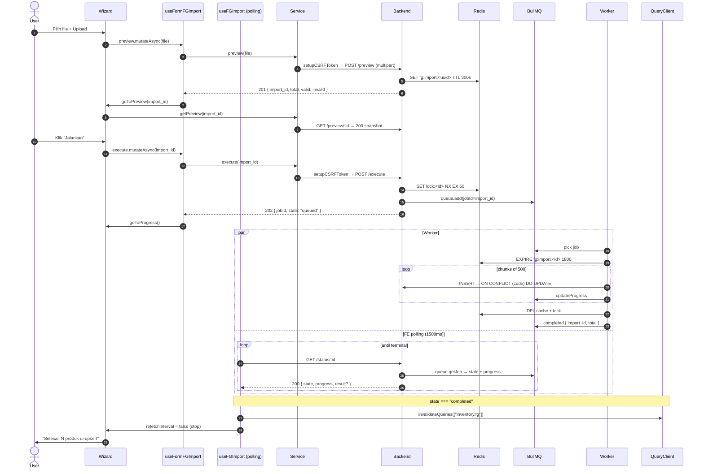

# Inventory / FG / Import — Frontend Integration (Scope Level)

Kontrak BE→FE. Wizard UI component (Upload → Preview → Progress) diserahkan ke frontend-dev-flow SOP.

**Backend scope path**: `api/src/module/application/inventory/fg/import/`
**Frontend scope path**: `app/src/app/(application)/inventory/fg/import/server/` 🚧 TBD
**Endpoint base**: `/api/app/inventory/fg/import`
**Status FE**: 🚧 TBD

**Dependencies**:

- Konvensi global modul ([`../../frontend-integration.md`](../../frontend-integration.md)) — `setupCSRFToken` policy, queryKey naming `["inventory.<scope>", ...]`, `FetchError` pattern, design tokens Gold/Zinc, status code expectation (201 preview, 202 enqueue, 200 read).
- BE scope doc ([`./README.md`](./README.md)) — Zod source, endpoint detail, error catalog, worker pipeline detail.
- SOP canonical: [frontend-dev-flow](../../../../.claude/skills/frontend-dev-flow/SKILL.md).

FG Import adalah pipeline **2-tahap async** untuk meng-upsert ratusan Product (FG) sekaligus dari file CSV/XLSX. Tahap 1 (`/preview`) parse + Zod validate per-baris dan simpan snapshot di Redis (TTL 5 menit). Tahap 2 (`/execute`) enqueue BullMQ job; FE polling `/status/:import_id` sampai terminal state.

---

## 1. Schema Mirror End-to-End

**Source BE**: `src/module/application/inventory/fg/import/import.schema.ts`. FE mirror WAJIB 1:1.

### 1.1 `FG_IMPORT_HEADERS` constant — single source of truth header CSV/XLSX

```ts
// Single source of truth untuk header CSV (import & export wajib pakai konstanta yang sama).
// Reference: dev-flow §1.I rule 1.
export const FG_IMPORT_HEADERS = {
    code: "PRODUCT CODE",
    name: "PRODUCT NAME",
    type: "TYPE",
    gender: "GENDER",
    size: "SIZE",
    distribution: "EDAR",
    safety: "SAFETY",
} as const;
```

> **Header CSV wajib match konstanta ini persis (case-sensitive).** FE wizard preview wajib pakai konstanta ini saat render kolom label & saat memberi template download. Hindari literal string `"PRODUCT CODE"` di komponen — selalu impor `FG_IMPORT_HEADERS.code`.

### 1.2 `FGImportRowSchema` (BE — verbatim)

```ts
const sanitizeNumber = (val: unknown): number => {
    if (val === "" || val === null || val === undefined) return 0;
    if (typeof val === "number") return val;
    if (typeof val === "string") {
        const cleaned = val.replace(/[%,\s]/g, "").trim();
        const num = Number(cleaned);
        return isNaN(num) ? 0 : num;
    }
    return Number(val);
};

export const FGImportRowSchema = z.object({
    [FG_IMPORT_HEADERS.code]: z.string().min(1).max(100),
    [FG_IMPORT_HEADERS.name]: z.string().min(1).max(200),
    [FG_IMPORT_HEADERS.type]: z.string().min(1).max(100),
    [FG_IMPORT_HEADERS.gender]: z.string().max(20).optional().default(""),
    [FG_IMPORT_HEADERS.size]: z.preprocess(sanitizeNumber, z.coerce.number().positive()),
    [FG_IMPORT_HEADERS.distribution]: z.preprocess(
        sanitizeNumber,
        z.coerce.number().min(0).optional().default(0),
    ),
    [FG_IMPORT_HEADERS.safety]: z.preprocess(
        sanitizeNumber,
        z.coerce.number().min(0).optional().default(0),
    ),
});
```

**Field detail** (ringkas — Zod block di atas = SSOT):

| Header (Zod key) | Type | Req | Default | Catatan |
| :--------------- | :--- | :-- | :------ | :------ |
| `PRODUCT CODE`   | `string` | ✅ | — | `min(1) max(100)`. Unique key. Trimmed di service. |
| `PRODUCT NAME`   | `string` | ✅ | — | `min(1) max(200)`. Trimmed. |
| `TYPE`           | `string` | ✅ | — | `min(1) max(100)`. Worker upsert via `getOrCreateSlug`. |
| `GENDER`         | `string` | ❌ | `""` | `max(20)`. Normalized → `WOMEN`/`MEN`/`UNISEX` via `mapGender()`. |
| `SIZE`           | `number` | ✅ | — | preprocess `sanitizeNumber` + `positive()`. |
| `EDAR`           | `number` | ❌ | `0` | preprocess + `min(0)`. Distribution percentage. |
| `SAFETY`         | `number` | ❌ | `0` | preprocess + `min(0)`. Safety percentage. |

### 1.3 `RequestExecuteFGImportSchema` (BE — verbatim)

```ts
export const RequestExecuteFGImportSchema = z.object({
    import_id: z.string().uuid("Import ID tidak valid"),
});

export type RequestExecuteFGImportDTO = z.infer<typeof RequestExecuteFGImportSchema>;
```

| Field       | Type     | Required | Constraint | Error msg                 |
| :---------- | :------- | :------- | :--------- | :------------------------ |
| `import_id` | `string` | ✅       | UUID v4    | `"Import ID tidak valid"` |

### 1.4 Response shapes (TS only — bukan Zod)

```ts
// POST /preview → 201
export type ResponseFGImportDTO = { import_id: string; total: number; valid: number; invalid: number };

// POST /execute → 202 (jobId deterministic = import_id)
export type ResponseEnqueueFGImportDTO = { import_id: string; jobId: string; state: "queued" };

// GET /status/:import_id → 200
export type ImportJobState =
    | "queued" | "active" | "completed" | "failed"
    | "delayed" | "waiting-children" | "prioritized" | "unknown";

export type ResponseImportStatusDTO = {
    import_id: string;
    state: ImportJobState;
    progress: number;                              // 0..100
    result?: { import_id: string; total: number }; // hanya saat state === "completed"
    failedReason?: string;                         // hanya saat state === "failed"
    attemptsMade?: number;                         // hanya saat state === "failed"
};

// GET /preview/:import_id → 200 (snapshot dari Redis cache)
export type FGImportPreviewDTO = {
    code: string; name: string; gender: GENDER; size: number;
    type: string | null; distribution_percentage: number; safety_percentage: number;
    errors: string[];                // [] = valid, isi = Zod issues message
};

export type FGImportPreviewSnapshotDTO = {
    import_id: string; total: number; valid: number; invalid: number;
    rows: FGImportPreviewDTO[]; createdAt: number;  // epoch ms
};
```

### 1.5 Enum referensi (Prisma)

```prisma
enum GENDER {
    WOMEN
    MEN
    UNISEX
}
```

Lokasi BE: `prisma/schema.prisma`. FE import via `@/shared/types` — **JANGAN duplikasi literal**.

`ImportJobState` adalah union TS literal (bukan Prisma enum) — di-mirror persis di FE schema.

---

## 2. FE Schema Mirror

**File**: `app/src/app/(application)/inventory/fg/import/server/inventory.fg.import.schema.ts` 🚧 TBD

Mirror identik 1:1 dengan BE §1. Copy block `FG_IMPORT_HEADERS`, `sanitizeNumber`, `FGImportRowSchema`, dan `RequestExecuteFGImportSchema` apa adanya (ganti import `GENDER` jadi `import type { GENDER } from "@/shared/types"`). Response DTO ditulis sebagai TS type seperti di §1.4.

**Exports wajib** (dipakai service & hooks):

```ts
export const FG_IMPORT_HEADERS = { /* identik §1.1 */ } as const;
export const FGImportRowSchema = z.object({ /* identik §1.2 */ });
export const RequestExecuteFGImportSchema = z.object({
    import_id: z.string().uuid("Import ID tidak valid"),
});

export type FGImportRowDTO = z.infer<typeof FGImportRowSchema>;
export type RequestExecuteFGImportDTO = z.infer<typeof RequestExecuteFGImportSchema>;
export type ResponseFGImportDTO = { import_id: string; total: number; valid: number; invalid: number };
export type ResponseEnqueueFGImportDTO = { import_id: string; jobId: string; state: "queued" };
export type ImportJobState =
    | "queued" | "active" | "completed" | "failed"
    | "delayed" | "waiting-children" | "prioritized" | "unknown";
export type ResponseImportStatusDTO = {
    import_id: string;
    state: ImportJobState;
    progress: number;
    result?: { import_id: string; total: number };
    failedReason?: string;
    attemptsMade?: number;
};
export type FGImportPreviewDTO = {
    code: string; name: string; gender: GENDER; size: number;
    type: string | null; distribution_percentage: number; safety_percentage: number;
    errors: string[];
};
export type FGImportPreviewSnapshotDTO = {
    import_id: string; total: number; valid: number; invalid: number;
    rows: FGImportPreviewDTO[]; createdAt: number;
};
```

**Diff vs BE**: empty. Setiap deviasi = bug, fix di kode.

---

## 3. Routing — Endpoint Table

**Path prefix**: `/api/app/inventory/fg/import` (mounted via parent module router).

**Source BE**: `src/module/application/inventory/fg/import/import.routes.ts` + `import.controller.ts`.

| Method | Path | Body type | Success status | Handler | Catatan |
| :----- | :--- | :-------- | :------------- | :------ | :------ |
| `POST` | `/preview` | `multipart/form-data` (field `file`) | **201 Created** | `FGImportController.preview` | Upload CSV/XLSX. BE parse + Zod validate per-baris, simpan snapshot Redis (TTL 300s). Return `{ import_id, total, valid, invalid }`. Limit `MAX_ROWS = 5000` → **413** jika lebih. |
| `GET` | `/preview/:import_id` | — | **200 OK** | `FGImportController.getPreview` | Reload snapshot row preview dari Redis cache (untuk recovery setelah F5 di Step 2). |
| `POST` | `/execute` | `application/json` `{ import_id: uuid }` | **202 Accepted** | `FGImportController.execute` | Enqueue BullMQ job (`jobId = import_id`). BE acquire lock `NX EX 60` → **409** jika double-call. |
| `GET` | `/status/:import_id` | — | **200 OK** | `FGImportController.getStatus` | Polling state job. Terminal = `completed` \| `failed` → FE stop polling. |

**CSRF policy**: `setupCSRFToken()` WAJIB sebelum kedua `POST` (preview & execute). `GET` tidak perlu.

**Status code contract**:

- `201` (POST /preview) — resource snapshot baru terbentuk di Redis.
- `202` (POST /execute) — job enqueued, belum tentu selesai. FE harus polling `/status`.
- `200` (GET /preview/:id, GET /status/:id) — pembacaan resource yang sudah ada.

---

## 4. Service Class — FULL CODE

**File**: `app/src/app/(application)/inventory/fg/import/server/inventory.fg.import.service.ts` 🚧 TBD

```ts
import api from "@/lib/api";
import { setupCSRFToken } from "@/shared/api/csrf";
import type { ApiSuccessResponse } from "@/shared/types/api";
import type {
    ResponseFGImportDTO, ResponseEnqueueFGImportDTO,
    ResponseImportStatusDTO, FGImportPreviewSnapshotDTO,
} from "./inventory.fg.import.schema";

const API = `${process.env.NEXT_PUBLIC_API}/api/app/inventory/fg/import`;

export class InventoryFGImportService {
    /** Tahap 1 — Upload CSV/XLSX, BE parse + Zod validate, simpan snapshot Redis (TTL 5m). BE: 201. */
    static async preview(file: File): Promise<ResponseFGImportDTO> {
        try {
            await setupCSRFToken();
            const form = new FormData();
            form.append("file", file);
            const { data } = await api.post<ApiSuccessResponse<ResponseFGImportDTO>>(
                `${API}/preview`, form,
                { headers: { "Content-Type": "multipart/form-data" } },
            );
            return data.data;
        } catch (error) { throw error; }
    }

    /** Reload snapshot preview tanpa upload ulang. BE: 200. */
    static async getPreview(import_id: string): Promise<FGImportPreviewSnapshotDTO> {
        try {
            const { data } = await api.get<ApiSuccessResponse<FGImportPreviewSnapshotDTO>>(
                `${API}/preview/${import_id}`,
            );
            return data.data;
        } catch (error) { throw error; }
    }

    /** Tahap 2 — Enqueue BullMQ. BE acquire lock NX EX 60 → 409 jika double-call. BE: 202. */
    static async execute(import_id: string): Promise<ResponseEnqueueFGImportDTO> {
        try {
            await setupCSRFToken();
            const { data } = await api.post<ApiSuccessResponse<ResponseEnqueueFGImportDTO>>(
                `${API}/execute`, { import_id },
            );
            return data.data;
        } catch (error) { throw error; }
    }

    /** Poll status. Terminal = completed | failed → FE stop polling. BE: 200. */
    static async status(import_id: string): Promise<ResponseImportStatusDTO> {
        try {
            const { data } = await api.get<ApiSuccessResponse<ResponseImportStatusDTO>>(
                `${API}/status/${import_id}`,
            );
            return data.data;
        } catch (error) { throw error; }
    }
}
```

> **Catatan**: tidak ada `list`/`detail`/`create`/`update`/`exportCsv` — import scope bukan CRUD. Mutasi terjadi via 2-step async, bukan POST tunggal.

---

## 5. Hooks — 5 Hook Split FULL CODE

**File**: `app/src/app/(application)/inventory/fg/import/server/use.inventory.fg.import.ts` 🚧 TBD

```ts
"use client";
import { useQuery, useMutation, useQueryClient } from "@tanstack/react-query";
import { useSetAtom } from "jotai";
import { useState, useCallback, useMemo } from "react";
import { FetchError } from "@/shared/api/errors";
import { errorAtom, notificationAtom } from "@/shared/atoms";
import type { ResponseError } from "@/shared/types/api";
import { InventoryFGImportService } from "./inventory.fg.import.service";
import type {
    ResponseFGImportDTO, ResponseEnqueueFGImportDTO, ResponseImportStatusDTO,
    FGImportPreviewSnapshotDTO, ImportJobState,
} from "./inventory.fg.import.schema";

const KEY = ["inventory.fg.import"] as const;
const STATUS_KEY = (id: string) => [...KEY, "status", id] as const;
const PREVIEW_KEY = (id: string) => [...KEY, "preview", id] as const;
const TERMINAL_STATES = new Set<ImportJobState>(["completed", "failed"]);
const POLL_INTERVAL_MS = 1500;

// 5.1 READ — status polling, auto-stop saat terminal + invalidate list FG saat completed
export function useInventoryFGImport(import_id: string | null) {
    const queryClient = useQueryClient();
    return useQuery<ResponseImportStatusDTO, ResponseError>({
        queryKey: STATUS_KEY(import_id ?? ""),
        queryFn: () => InventoryFGImportService.status(import_id as string),
        enabled: Boolean(import_id),
        refetchInterval: (q) => {
            const data = q.state.data;
            if (!data) return POLL_INTERVAL_MS;
            if (TERMINAL_STATES.has(data.state)) {
                if (data.state === "completed") {
                    queryClient.invalidateQueries({ queryKey: ["inventory.fg"], type: "all" });
                }
                return false;
            }
            return POLL_INTERVAL_MS;
        },
        refetchIntervalInBackground: false,
        staleTime: 0,
    });
}

// Helper: snapshot preview dari Redis cache (untuk reload step 2 setelah F5)
export function useInventoryFGImportPreview(import_id: string | null) {
    return useQuery<FGImportPreviewSnapshotDTO, ResponseError>({
        queryKey: PREVIEW_KEY(import_id ?? ""),
        queryFn: () => InventoryFGImportService.getPreview(import_id as string),
        enabled: Boolean(import_id),
        staleTime: 60_000,
        retry: false,
    });
}

// 5.2 WRITE — preview (upload) + execute (enqueue) mutations
export function useFormInventoryFGImport() {
    const setErr = useSetAtom(errorAtom);
    const setNotif = useSetAtom(notificationAtom);
    const queryClient = useQueryClient();

    const preview = useMutation<ResponseFGImportDTO, ResponseError, File>({
        mutationKey: [...KEY, "preview"],
        mutationFn: (file) => InventoryFGImportService.preview(file),
        onSuccess: (data) => {
            setNotif({ title: "Preview Import", message: `${data.valid}/${data.total} baris valid` });
            queryClient.invalidateQueries({ queryKey: PREVIEW_KEY(data.import_id) });
        },
        onError: (err) => FetchError(err, setErr),
    });

    const execute = useMutation<ResponseEnqueueFGImportDTO, ResponseError, string>({
        mutationKey: [...KEY, "execute"],
        mutationFn: (import_id) => InventoryFGImportService.execute(import_id),
        onSuccess: (data) => {
            setNotif({ title: "Import Dijalankan", message: `Job ${data.jobId} masuk antrian` });
            queryClient.invalidateQueries({ queryKey: STATUS_KEY(data.import_id) });
        },
        onError: (err) => FetchError(err, setErr),
    });

    return { preview, execute };
}

// 5.3 ACTION — placeholder (BE belum punya retry/cancel; isi saat endpoint tersedia)
export function useActionInventoryFGImport() {
    // N/A — no status toggle, no bulk, no soft-delete in import scope.
    return {} as const;
}

// 5.4 SessionState — wizard step + import_id (local state, no URL sync)
export type FGImportStep = "upload" | "preview" | "progress";

export function useInventoryFGImportSessionState() {
    const [importId, setImportId] = useState<string | null>(null);
    const [step, setStep] = useState<FGImportStep>("upload");
    const goToPreview = useCallback((id: string) => { setImportId(id); setStep("preview"); }, []);
    const goToProgress = useCallback(() => setStep("progress"), []);
    const reset = useCallback(() => { setImportId(null); setStep("upload"); }, []);
    return useMemo(
        () => ({ importId, step, goToPreview, goToProgress, reset, setImportId, setStep }),
        [importId, step, goToPreview, goToProgress, reset],
    );
}

// 5.5 Query-wrapper — bundle session state + status polling untuk page consumer
export function useInventoryFGImportQuery() {
    const session = useInventoryFGImportSessionState();
    const status = useInventoryFGImport(session.step === "progress" ? session.importId : null);
    const previewSnapshot = useInventoryFGImportPreview(
        session.step === "preview" ? session.importId : null,
    );
    return { ...session, status, previewSnapshot };
}
```

**queryKey contract**:

- `["inventory.fg.import", "status", <import_id>]` — polling status, auto-stop saat terminal.
- `["inventory.fg.import", "preview", <import_id>]` — snapshot row preview.
- `["inventory.fg.import", "preview"]` / `["inventory.fg.import", "execute"]` — mutationKey.
- Invalidation lintas-scope: saat `state === "completed"` → invalidate `["inventory.fg"]` (table FG inti refresh).

> Komponen wizard (Upload → Preview Table → Progress) di-implement mengikuti **frontend-dev-flow SOP** — bukan bagian dari kontrak BE→FE ini.

---

## 6. End-to-End Flow — Mermaid

### 6.1 Full async import flow (Upload → Preview → Execute → Polling)



---

## 7. Edge Cases & Per-Scope Quirks

- **File size cap**: 10 MB hard limit di FE (`MAX_FILE_BYTES`). BE menolak >5.000 baris (`MAX_ROWS = 5000`) dengan **413** — tampilkan ke user.
- **Multipart**: WAJIB `Content-Type: multipart/form-data` di `POST /preview`; field name = `"file"`. Jangan kirim JSON.
- **CSRF**: `setupCSRFToken()` di-call sebelum `POST /preview` & `POST /execute`. GET tidak butuh.
- **Header CSV match konstanta `FG_IMPORT_HEADERS`** (case-sensitive). Sediakan tombol "Download Template" di Step 1 yang generate file dengan header persis konstanta — hindari literal string di komponen.
- **Preview cache TTL = 5 menit** (300s). Idle lama di Step 2 → klik Execute → **400 "Import session tidak ditemukan atau sudah kadaluarsa"**. Tangani: toast + auto-reset ke Step 1.
- **Lock TTL 60s**: double-click Execute → **409 "Import sedang diproses"**. Tombol di-`disabled` saat `execute.isPending`.
- **Polling auto-stop**: `refetchInterval` return `false` saat `state ∈ {completed, failed}` (`TERMINAL_STATES` Set).
- **Worker TTL extension**: worker `EXPIRE` cache ke 1800s saat aktif. Reload Step 3 mid-job aman.
- **GENDER normalize**: input `"women"`/`"woman"` → `WOMEN`, `"men"`/`"man"` → `MEN`, lainnya → `UNISEX`. FE tidak perlu normalize.
- **Invalidation lintas-scope**: saat completed, hook invalidate `["inventory.fg"]`. **Jangan** invalidate di komponen — sudah di hook.
- **No retry/cancel** endpoint saat ini. `useActionInventoryFGImport` placeholder kosong — isi saat BE add `POST /retry` / `POST /cancel`.

---

## 8. Cross-link

- BE scope doc: [./README.md](./README.md)
- Module-level konvensi FE: [../../frontend-integration.md](../../frontend-integration.md)
- Parent scope FG (CRUD inti): [../README.md](../README.md) + [../frontend-integration.md](../frontend-integration.md)
- SOP FE component (wizard Upload/Preview/Progress): [frontend-dev-flow](../../../../.claude/skills/frontend-dev-flow/SKILL.md)
- SOP FE testing (Vitest + RTL): [frontend-testing](../../../../.claude/skills/frontend-testing/SKILL.md)
- SOP FE query/mutation pattern: [frontend-query-mutation](../../../../.claude/skills/frontend-query-mutation/SKILL.md)
- SOP BE BullMQ pipeline + header CSV: [dev-flow §1.H, §1.I](../../../../.claude/skills/dev-flow/SKILL.md)
- Postman folder: `Inventory → FG → Import` di `docs/postman/erp-mandalika.postman_collection.json`.
- Deployment & worker process: [DEPLOYMENT.md](../../../../DEPLOYMENT.md)
