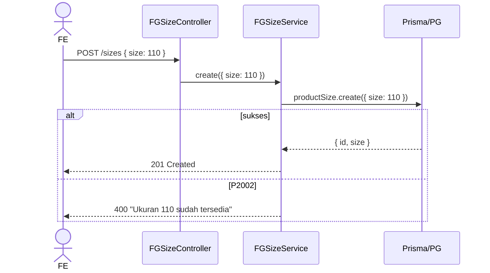

# Module: Inventory / FG / Size (Product Size Master)

**Base path**: `/api/app/inventory/fg/sizes`
**Source**: `src/module/application/inventory/fg/size/`
**Tests**: belum ada test khusus untuk `size/*` (cover by `fg.service.test.ts` upsert path).
**Prisma model**: `ProductSize` (`product_size` table)

Master data ukuran FG (angka, satuan implicit `ML`). Dipakai sebagai FK `Product.size_id` dan diisi otomatis lewat `getOrCreateSize` di FG create/update/import.

> **Catatan**: Master size **tidak menyimpan unit string**. Satuan ditampilkan oleh FG service sebagai `"${size} ML"` (lihat `fg.service.ts:13`).

---

## 1. Scope & Fitur

| Fitur            | Endpoint              | Catatan                                                            |
| :--------------- | :-------------------- | :----------------------------------------------------------------- |
| List + search    | `GET /`               | Filter `?search=<int>` exact match. Sort ascending `size`.         |
| Create           | `POST /`              | Unique constraint `size` → 400 jika duplikat.                      |
| Update           | `PUT /:id`            | Partial. Tanpa body → no-op return existing.                       |
| Delete           | `DELETE /:id`         | Hard delete; tolak jika masih dipakai produk (`_count.products`).  |

### Out of scope

- Konversi satuan (ML → L, kg, dll) — tidak ada; satuan tetap `ML`.
- Bulk import size — tidak ada endpoint khusus; upsert otomatis dari FG import (lihat [`../import`](../import/README.md)).
- Soft delete — tidak diaplikasikan; size yang sudah ditarik → hard delete.

---

## 2. Arsitektur & Flow

### Layer map

```text
┌────── routes/size.routes.ts ──────┐
│ GET    /                          │
│ POST   /        validateBody      │
│ PUT    /:id     validateBody p.   │
│ DELETE /:id                       │
└────────────┬──────────────────────┘
             ▼
┌────── controller/size.controller.ts ─┐
│ - validate id Number.isInteger > 0   │
│ - QueryFGSizeSchema.safeParse        │
│ - panggil FGSizeService              │
└────────────┬─────────────────────────┘
             ▼
┌────── service/size.service.ts ───────┐
│ - prisma.productSize.create/update   │
│ - P2002 / P2025 mapping → ApiError   │
│ - delete: cek _count.products        │
└────────────┬─────────────────────────┘
             ▼
       Prisma → product_size
```

### Mermaid: Create



### Mermaid: Delete

```mermaid
flowchart TD
    A[DELETE /:id] --> B[findUnique select _count.products]
    B -->|not found| E1[404 'Ukuran tidak ditemukan']
    B -->|found| C{_count.products > 0?}
    C -->|yes| E2[400 'Ukuran tidak dapat dihapus karena masih digunakan']
    C -->|no| D[productSize.delete] --> F[200 {}]
```

---

## 3. DTO / Schemas (end-to-end SSOT)

**Source**: `src/module/application/inventory/fg/size/size.schema.ts`. **FE wajib mirror** — lihat [`../../frontend-integration.md`](../../frontend-integration.md) §2.

### 3.1 `RequestFGSizeSchema` — POST / & PUT /:id (partial)

**Zod chain (verbatim)**:

```ts
export const RequestFGSizeSchema = z.object({
    size: z.coerce
        .number("Ukuran harus berupa angka")
        .int("Ukuran harus bilangan bulat")
        .min(1, "Ukuran minimal 1"),
});

export type RequestFGSizeDTO = z.infer<typeof RequestFGSizeSchema>;
```

| Field   | Type     | Required | Constraint                     | Error msg                                                       |
| :------ | :------- | :------- | :----------------------------- | :-------------------------------------------------------------- |
| `size`  | `number` | ✅       | `coerce`, `int()`, `min(1)`    | `"Ukuran harus berupa angka"` / `"…bilangan bulat"` / `"…min 1"` |

### 3.2 `QueryFGSizeSchema` — GET /

**Zod chain (verbatim)**:

```ts
export const QueryFGSizeSchema = z.object({
    search: z.coerce.number().int().positive().optional(),
    page: z.coerce.number().int().positive().default(1),
    take: z.coerce.number().int().positive().max(100).default(25),
});

export type QueryFGSizeDTO = z.infer<typeof QueryFGSizeSchema>;
```

| Param     | Type     | Default | Constraint                          | Catatan                          |
| :-------- | :------- | :------ | :---------------------------------- | :------------------------------- |
| `search`  | `number` | —       | `coerce`, `int()`, `positive()`     | Exact match pada `size`.         |
| `page`    | `number` | `1`     | `coerce`, `int()`, `positive()`     | —                                |
| `take`    | `number` | `25`    | `coerce`, `int()`, `1..100`         | —                                |

### 3.3 `ResponseFGSizeSchema`

```ts
export const ResponseFGSizeSchema = z.object({
    id: z.number(),
    size: z.number(),
});

export type ResponseFGSizeDTO = z.infer<typeof ResponseFGSizeSchema>;
```

| Field  | Type     | Catatan                                 |
| :----- | :------- | :-------------------------------------- |
| `id`   | `number` | PK.                                     |
| `size` | `number` | Integer. Display unit ditangani konsumer (`"110 ML"` di FG). |

### 3.4 Catatan integrasi FE

Schema di atas adalah kontrak. FE mirror di:

- Schema: `app/src/app/(application)/inventory/fg/sizes/server/inventory.fg.size.schema.ts` 🚧 TBD
- DTO export: `RequestFGSizeDTO`, `QueryFGSizeDTO`, `ResponseFGSizeDTO`

Service & hook pattern (`InventoryFGSizeService`, `useInventoryFGSize`, dst.): lihat [`../../frontend-integration.md`](../../frontend-integration.md).

---

## 4. Routing untuk integrasi Frontend

Mount di parent `/api/app/inventory/fg/sizes`. Terproteksi `authMiddleware` (inherit dari `FGRoutes`).

### 4.1 Daftar endpoint

| #   | Method | Path        | Body / Query                  | Body type | Response (200/201)               | Error utama                              |
| :-- | :----- | :---------- | :---------------------------- | :-------- | :------------------------------- | :--------------------------------------- |
| 1   | GET    | `/`         | `?search=&page=&take=`        | —         | `{ data: ProductSize[], len }` (200) | 400 (query invalid)                  |
| 2   | POST   | `/`         | `{ size }`                    | JSON      | `ResponseFGSizeDTO` (201)        | 400 (Zod / duplikat)                     |
| 3   | PUT    | `/:id`      | `Partial<{ size }>`           | JSON      | `ResponseFGSizeDTO` (200)        | 400 (Zod / duplikat) / 404               |
| 4   | DELETE | `/:id`      | —                             | —         | `{}` (200)                       | 400 (FK products) / 404                  |

### 4.2 Contoh integrasi frontend

Konvensi lengkap (service class `InventoryFGSizeService`, hook split, queryKey `["inventory.fg.size", ...]`, invalidation **juga** ke `["inventory.fg"]` karena FG list join via size) ada di [`../../frontend-integration.md`](../../frontend-integration.md).

```ts
const API = `${process.env.NEXT_PUBLIC_API}/api/app/inventory/fg/sizes`;

static async list(params: QueryFGSizeDTO) {
    const { data } = await api.get<ApiSuccessResponse<{ len: number; data: Array<ResponseFGSizeDTO> }>>(API, { params });
    return data.data;
}
static async create(body: RequestFGSizeDTO) {
    await setupCSRFToken();
    await api.post(API, body);
}
```

### 4.3 Header & autentikasi

- `Cookie: session={{session_id}}`
- `x-csrf-token: {{csrf_token}}` (mutasi)
- `Content-Type: application/json` (POST/PUT)

---

## 5. Database / Indexes

```prisma
model ProductSize {
  id       Int       @id @default(autoincrement())
  size     Int       @unique
  products Product[]

  @@map("product_size")
}
```

- `size` adalah **unique** integer → unique violation = P2002.
- Tidak ada index tambahan. Tabel kecil (< 100 rows expected), full scan murah.

---

## 6. Error catalog

| HTTP | Pesan                                                                          | Trigger                                                       |
| :--- | :----------------------------------------------------------------------------- | :------------------------------------------------------------ |
| 400  | `Validation Error` + `{ message, path }`                                       | Body `size` tidak valid (bukan int / < 1).                    |
| 400  | `Query tidak valid`                                                            | Query string gagal `QueryFGSizeSchema.safeParse`.             |
| 400  | `ID tidak valid`                                                               | `:id` bukan integer positif (controller guard).               |
| 400  | `Ukuran {size} sudah tersedia`                                                 | P2002 saat create.                                            |
| 400  | `Ukuran {size} sudah digunakan`                                                | P2002 saat update.                                            |
| 400  | `Ukuran tidak dapat dihapus karena masih digunakan oleh produk`                | `_count.products > 0` saat delete.                            |
| 404  | `Ukuran tidak ditemukan`                                                       | findUnique = null (update no-body case + delete).             |
| 404  | `Ukuran tidak ditemukan`                                                       | P2025 saat update (race antara findUnique dan update).        |
| 500  | `Internal Server Error`                                                        | Error Prisma tak terduga (re-throw).                          |

---

## 7. Testing

Belum ada file test dedicated untuk `size/*`. Coverage tidak langsung:

- `fg.service.test.ts` indirectly cover `getOrCreateSize` lewat path create FG.
- TODO: tambahkan `src/tests/inventory/fg/size/size.service.test.ts` mengikuti pola `fg.service.test.ts` (mock `prisma.productSize`, test create/update/delete/list). <!-- verify -->

Test sub-modul ini di-handle oleh hierarki test FG inti sampai ada test khusus.

---

## 8. Postman testing

Folder Postman: `Inventory / FG / Size` di `docs/postman/erp-mandalika.postman_collection.json`.

### 8.1 List

```
GET {{base_url}}/api/app/inventory/fg/sizes?page=1&take=25
```

### 8.2 Create

```
POST {{base_url}}/api/app/inventory/fg/sizes
Content-Type: application/json

{ "size": 110 }
```

**Expected 201**:

```json
{ "query": null, "status": "success", "data": { "id": 1, "size": 110 } }
```

### 8.3 Update

```
PUT {{base_url}}/api/app/inventory/fg/sizes/1
Content-Type: application/json

{ "size": 120 }
```

### 8.4 Delete

```
DELETE {{base_url}}/api/app/inventory/fg/sizes/1
```

**Expected 400** jika size masih dipakai produk: `"Ukuran tidak dapat dihapus karena masih digunakan oleh produk"`.

---

## 9. Activity log

Modul size **tidak** menulis `CreateLogger` (master data, audit lewat operasi FG yang menulisnya). Kalau ingin audit penuh, hook di controller setelah service call.

---

## 10. Checklist saat menambah fitur ke FG Size

- [ ] Update `RequestFGSizeSchema` jika ada field tambahan (catatan: model `ProductSize` saat ini hanya `id`, `size`).
- [ ] Buat file test `src/tests/inventory/fg/size/size.service.test.ts` (belum ada).
- [ ] Update `Product` relation kalau menambah kolom yang mempengaruhi join.
- [ ] Update Postman folder `Inventory / FG / Size`.
- [ ] `rtk tsc --noEmit` clean.

---

## 11. Referensi silang

- **Frontend integration**: [`../../frontend-integration.md`](../../frontend-integration.md)
- Parent scope: [`../README.md`](../README.md)
- Sibling: [`../type/README.md`](../type/README.md), [`../import/README.md`](../import/README.md)
- Konvensi SOP: [CONVENTIONS.md](../../../../CONVENTIONS.md)
- DB schema: [DATABASE.md](../../../../DATABASE.md)
