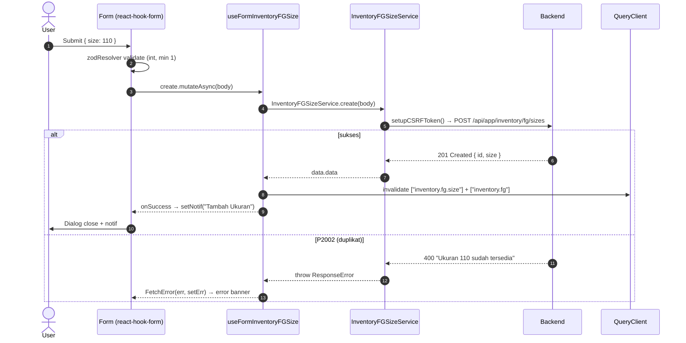
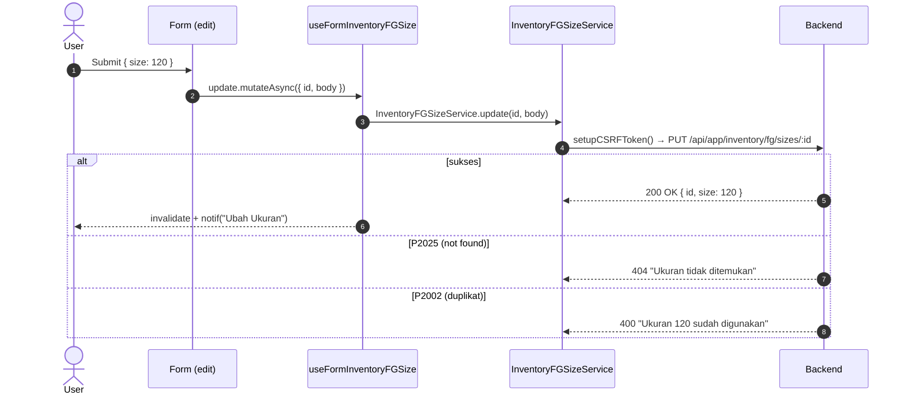
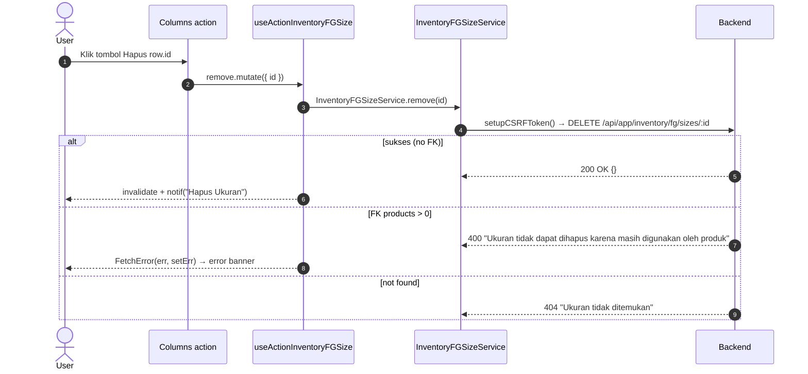

# Inventory / FG / Size — Frontend Integration (Scope Level)

Kontrak BE→FE. Komponen Form (integer-only ML field) ke frontend-dev-flow SOP.

**Backend scope path**: `api/src/module/application/inventory/fg/size/`
**Frontend scope path**: `app/src/app/(application)/inventory/fg/sizes/server/` 🚧 TBD
**Component path**: `app/src/components/pages/inventory/fg/sizes/` 🚧 TBD
**Endpoint base**: `/api/app/inventory/fg/sizes`
**Status FE**: 🚧 TBD

**Dependencies**:

- Konvensi global modul ([`../../frontend-integration.md`](../../frontend-integration.md)) — CSRF, queryKey naming, error pattern, debounce, design tokens, status code expectation.
- BE scope doc ([`./README.md`](./README.md)) — Zod schema source, endpoint detail, error catalog.
- SOP canonical: [frontend-dev-flow](../../../../../.claude/skills/frontend-dev-flow/SKILL.md).

Master data ukuran (volume) produk FG. Integer-only, satuan implicit `ML`, unique constraint pada kolom `size`. Endpoint scope ini dipakai untuk **manual CRUD master size**; mayoritas upsert size dilakukan otomatis oleh FG service (`getOrCreateSize`) saat user create/update/import FG.

---

## 1. Schema Mirror End-to-End

**Source BE**: `src/module/application/inventory/fg/size/size.schema.ts`. FE mirror WAJIB 1:1.

### 1.1 `RequestFGSizeSchema` (BE — verbatim)

```ts
import z from "zod";

export const RequestFGSizeSchema = z.object({
    size: z.coerce
        .number("Ukuran harus berupa angka")
        .int("Ukuran harus bilangan bulat")
        .min(1, "Ukuran minimal 1"),
});

export type RequestFGSizeDTO = z.infer<typeof RequestFGSizeSchema>;
```

**Field detail**:

| Field  | Type     | Required | Default | Constraint                  | Error msg                                                                                | Catatan                                              |
| :----- | :------- | :------- | :------ | :-------------------------- | :--------------------------------------------------------------------------------------- | :--------------------------------------------------- |
| `size` | `number` | ✅       | —       | `coerce`, `int()`, `min(1)` | `"Ukuran harus berupa angka"` / `"Ukuran harus bilangan bulat"` / `"Ukuran minimal 1"` | Integer murni. Label UI: `"Ukuran (ML)"`. Unik.      |

### 1.2 `ResponseFGSizeSchema` (BE — verbatim) & DTO

```ts
export const ResponseFGSizeSchema = z.object({
    id: z.number(),
    size: z.number(),
});

export type ResponseFGSizeDTO = z.infer<typeof ResponseFGSizeSchema>;
```

**Transformasi service** (BE post-processing):

| Field di response | Sumber Prisma     | Transformasi service                                                          |
| :---------------- | :---------------- | :---------------------------------------------------------------------------- |
| `id`              | `ProductSize.id`  | Direct.                                                                       |
| `size`            | `ProductSize.size`| Integer murni. Konsumer (FG list/detail) merender sebagai `"${size} ML"`.     |

> **Catatan**: tabel master size **tidak** menyimpan field `created_at` / `updated_at` / `deleted_at`. Hanya `id` dan `size`. FE schema mirror harus mencerminkan ini — jangan tambah field timestamp.

### 1.3 `QueryFGSizeSchema` (BE — verbatim) — GET /

```ts
export const QueryFGSizeSchema = z.object({
    search: z.coerce.number().int().positive().optional(),
    page: z.coerce.number().int().positive().default(1),
    take: z.coerce.number().int().positive().max(100).default(25),
});

export type QueryFGSizeDTO = z.infer<typeof QueryFGSizeSchema>;
```

| Param    | Type     | Default | Constraint                       | Catatan                                              |
| :------- | :------- | :------ | :------------------------------- | :--------------------------------------------------- |
| `search` | `number` | —       | `coerce`, `int()`, `positive()`  | **Exact match** pada `size`, BUKAN substring search. |
| `page`   | `number` | `1`     | `coerce`, `int()`, `positive()`  | Halaman 1-based.                                     |
| `take`   | `number` | `25`    | `coerce`, `int()`, `1..100`      | Max 100 row per halaman.                             |

### 1.4 Bulk schema

**N/A** — scope ini tidak punya endpoint bulk status / bulk delete / clean trash. Master size = hard delete only.

### 1.5 Enum referensi

**N/A** — scope ini tidak punya enum. `ProductSize` adalah master dengan 2 kolom (`id`, `size`).

---

## 2. FE Schema Mirror

**File**: `app/src/app/(application)/inventory/fg/sizes/server/inventory.fg.size.schema.ts` 🚧 TBD

```ts
import { z } from "zod";

export const RequestFGSizeSchema = z.object({
    size: z.coerce
        .number("Ukuran harus berupa angka")
        .int("Ukuran harus bilangan bulat")
        .min(1, "Ukuran minimal 1"),
});

export type RequestFGSizeDTO = z.input<typeof RequestFGSizeSchema>;

export const ResponseFGSizeSchema = z.object({
    id: z.number(),
    size: z.number(),
});

export type ResponseFGSizeDTO = z.infer<typeof ResponseFGSizeSchema>;

export const QueryFGSizeSchema = z.object({
    search: z.coerce.number().int().positive().optional(),
    page: z.coerce.number().int().positive().default(1),
    take: z.coerce.number().int().positive().max(100).default(25),
});

export type QueryFGSizeDTO = z.infer<typeof QueryFGSizeSchema>;
```

**Diff vs BE**: empty. Field identik (`size` integer ≥ 1, no timestamp, no enum). Schema BE pakai `z.infer` untuk `RequestFGSizeDTO`; FE pakai `z.input` agar `z.coerce` di form input (string dari `<input type="number">`) tetap valid sebelum coercion. Tidak ada deviasi semantik.

---

## 3. Routing — Endpoint Table

**Path prefix**: `/api/app/inventory/fg/sizes`

| Method | Path        | Status | Body                                      | Query              | Response                                   | Deskripsi                                              |
| :----- | :---------- | :----- | :---------------------------------------- | :----------------- | :----------------------------------------- | :----------------------------------------------------- |
| GET    | `/`         | `200`  | —                                         | `QueryFGSizeDTO`   | `{ data: ResponseFGSizeDTO[], len }`       | List size paginated, `orderBy: { size: "asc" }`.       |
| POST   | `/`         | `201`  | `RequestFGSizeDTO`                        | —                  | `ResponseFGSizeDTO`                        | Create size. P2002 → 400 "Ukuran {size} sudah tersedia". |
| PUT    | `/:id`      | `200`  | `Partial<RequestFGSizeDTO>`               | —                  | `ResponseFGSizeDTO`                        | Update size by id. P2025 → 404, P2002 → 400.            |
| DELETE | `/:id`      | `200`  | —                                         | —                  | `{}`                                       | Hard delete. FK products > 0 → 400.                    |

**Sumber verifikasi**:

- Routes: `api/src/module/application/inventory/fg/size/size.routes.ts` (4 handler — GET/POST/PUT/DELETE).
- Controller status codes: `api/src/module/application/inventory/fg/size/size.controller.ts` — `create` → `sendSuccess(c, result, 201)`, `list/update/delete` → `200`.
- Validation: `validateBody(RequestFGSizeSchema)` pada POST, `validateBody(RequestFGSizeSchema.partial())` pada PUT, `id` divalidasi `Number.isInteger(id) && id >= 1` di controller.

---

## 4. Service Class — FULL CODE

**File**: `app/src/app/(application)/inventory/fg/sizes/server/inventory.fg.size.service.ts` 🚧 TBD

```ts
import api from "@/lib/api";
import { setupCSRFToken } from "@/shared/api/csrf";
import type { ApiSuccessResponse } from "@/shared/types/api";
import type {
    RequestFGSizeDTO,
    ResponseFGSizeDTO,
    QueryFGSizeDTO,
} from "./inventory.fg.size.schema";

const API = `${process.env.NEXT_PUBLIC_API}/api/app/inventory/fg/sizes`;

export class InventoryFGSizeService {
    static async list(
        params: QueryFGSizeDTO,
    ): Promise<{ data: ResponseFGSizeDTO[]; len: number }> {
        try {
            const { data } = await api.get<
                ApiSuccessResponse<{ data: ResponseFGSizeDTO[]; len: number }>
            >(API, { params });
            return data.data;
        } catch (error) {
            throw error;
        }
    }

    static async create(body: RequestFGSizeDTO): Promise<ResponseFGSizeDTO> {
        try {
            await setupCSRFToken();
            const { data } = await api.post<ApiSuccessResponse<ResponseFGSizeDTO>>(
                API,
                body,
            );
            return data.data;
        } catch (error) {
            throw error;
        }
    }

    static async update(
        id: number,
        body: Partial<RequestFGSizeDTO>,
    ): Promise<ResponseFGSizeDTO> {
        try {
            await setupCSRFToken();
            const { data } = await api.put<ApiSuccessResponse<ResponseFGSizeDTO>>(
                `${API}/${id}`,
                body,
            );
            return data.data;
        } catch (error) {
            throw error;
        }
    }

    static async remove(id: number): Promise<void> {
        try {
            await setupCSRFToken();
            await api.delete(`${API}/${id}`);
        } catch (error) {
            throw error;
        }
    }
}
```

> **Catatan**: tidak ada `detail()`, `changeStatus()`, `bulkStatus()`, `clean()`, `exportCsv()` karena endpoint scope ini hanya 4 (list/create/update/remove). Jangan tambah method yang tidak punya endpoint BE.

---

## 5. Hooks — 5 Hook Split FULL CODE

**File**: `app/src/app/(application)/inventory/fg/sizes/server/use.inventory.fg.size.ts` 🚧 TBD

```ts
"use client";
import { useQuery, useMutation, useQueryClient } from "@tanstack/react-query";
import { useSetAtom } from "jotai";
import { useState, useMemo, useCallback } from "react";
import { useSearchParams } from "next/navigation";
import { useDebounce, useQueryParams } from "@/shared/hooks";
import { errorAtom, notificationAtom } from "@/shared/atoms";
import { FetchError } from "@/shared/api/errors";
import type { ResponseError } from "@/shared/types/api";
import { InventoryFGSizeService } from "./inventory.fg.size.service";
import type {
    RequestFGSizeDTO,
    ResponseFGSizeDTO,
    QueryFGSizeDTO,
} from "./inventory.fg.size.schema";

const KEY = ["inventory.fg.size"] as const;

// ──────────────────────────────────────────────────────────────────────────────
// 5.1 READ — useQuery wrapper
// ──────────────────────────────────────────────────────────────────────────────
export function useInventoryFGSize(params: QueryFGSizeDTO, enabled = true) {
    return useQuery<
        { data: ResponseFGSizeDTO[]; len: number },
        ResponseError
    >({
        queryKey: [...KEY, params],
        queryFn: () => InventoryFGSizeService.list(params),
        enabled,
        staleTime: 30_000,
    });
}

// ──────────────────────────────────────────────────────────────────────────────
// 5.2 WRITE — create + update mutations
// ──────────────────────────────────────────────────────────────────────────────
export function useFormInventoryFGSize() {
    const setErr = useSetAtom(errorAtom);
    const setNotif = useSetAtom(notificationAtom);
    const queryClient = useQueryClient();

    const invalidate = () => {
        queryClient.invalidateQueries({ queryKey: KEY, type: "all" });
        // FG list join via size → invalidate juga supaya label "X ML" di tabel FG fresh.
        queryClient.invalidateQueries({ queryKey: ["inventory.fg"], type: "all" });
    };

    const create = useMutation<ResponseFGSizeDTO, ResponseError, RequestFGSizeDTO>({
        mutationKey: [...KEY, "create"],
        mutationFn: (body) => InventoryFGSizeService.create(body),
        onSuccess: () => {
            setNotif({
                title: "Tambah Ukuran",
                message: "Berhasil menambahkan ukuran baru",
            });
            invalidate();
        },
        onError: (err) => FetchError(err, setErr),
    });

    const update = useMutation<
        ResponseFGSizeDTO,
        ResponseError,
        { id: number; body: Partial<RequestFGSizeDTO> }
    >({
        mutationKey: [...KEY, "update"],
        mutationFn: ({ id, body }) => InventoryFGSizeService.update(id, body),
        onSuccess: () => {
            setNotif({
                title: "Ubah Ukuran",
                message: "Berhasil memperbarui ukuran",
            });
            invalidate();
        },
        onError: (err) => FetchError(err, setErr),
    });

    return { create, update };
}

// ──────────────────────────────────────────────────────────────────────────────
// 5.3 ACTION — delete only (no status / no bulk / no clean)
// ──────────────────────────────────────────────────────────────────────────────
export function useActionInventoryFGSize() {
    const setErr = useSetAtom(errorAtom);
    const setNotif = useSetAtom(notificationAtom);
    const queryClient = useQueryClient();
    const invalidate = () => {
        queryClient.invalidateQueries({ queryKey: KEY, type: "all" });
        queryClient.invalidateQueries({ queryKey: ["inventory.fg"], type: "all" });
    };

    const remove = useMutation<unknown, ResponseError, { id: number }>({
        mutationKey: [...KEY, "remove"],
        mutationFn: ({ id }) => InventoryFGSizeService.remove(id),
        onSuccess: () => {
            setNotif({
                title: "Hapus Ukuran",
                message: "Berhasil menghapus ukuran",
            });
            invalidate();
        },
        onError: (err) => FetchError(err, setErr),
    });

    return { remove };
}

// ──────────────────────────────────────────────────────────────────────────────
// 5.4 TableState — URL sync + debounce search + filter
// ──────────────────────────────────────────────────────────────────────────────
export function useInventoryFGSizeTableState() {
    const searchParams = useSearchParams();
    const { batchSet } = useQueryParams();

    const rawSearch = searchParams.get("search") ?? "";
    const [search, setSearchState] = useState(rawSearch);
    const debouncedSearch = useDebounce(search, 500);

    const setSearch = useCallback((val: string) => {
        setSearchState(val);
    }, []);

    // Sync ke URL setelah debounce
    useMemo(() => {
        batchSet({ search: debouncedSearch || null, page: "1" });
    }, [debouncedSearch, batchSet]);

    const page = Number(searchParams.get("page") ?? 1);
    const take = Number(searchParams.get("take") ?? 25);

    // search field di BE adalah integer exact-match — convert string -> number atau undefined
    const searchNumber = useMemo(() => {
        if (!debouncedSearch) return undefined;
        const parsed = Number(debouncedSearch);
        return Number.isInteger(parsed) && parsed > 0 ? parsed : undefined;
    }, [debouncedSearch]);

    const queryParams = useMemo<QueryFGSizeDTO>(
        () => ({ page, take, search: searchNumber }),
        [page, take, searchNumber],
    );

    return { search, setSearch, page, take, queryParams };
}

// ──────────────────────────────────────────────────────────────────────────────
// 5.5 Query-wrapper — bundling list + tableState untuk page consumer
// ──────────────────────────────────────────────────────────────────────────────
export function useInventoryFGSizeQuery() {
    const tableState = useInventoryFGSizeTableState();
    const query = useInventoryFGSize(tableState.queryParams);
    return { ...tableState, query };
}
```

---

## 6. End-to-End Flow per Operasi

### 6.1 Create



### 6.2 Update



### 6.3 Delete



---

## 7. Edge Cases & Per-Scope Quirks

- **Integer-only validation**: kolom `size` adalah integer murni. Form field WAJIB pakai `<InputForm type="number" min={1} step={1} inputMode="numeric" />`. Jangan pakai `step="any"` atau decimal. Zod chain `z.coerce.number().int().min(1)` di FE & BE menolak `0`, negatif, dan non-integer (mis. `110.5`).
- **Unique constraint**: kolom `size` adalah `@unique` di Prisma. Insert/update yang menghasilkan duplikat → P2002 → BE map ke `400 "Ukuran {size} sudah tersedia"` (create) atau `400 "Ukuran {size} sudah digunakan"` (update). FE tampilkan via `FetchError → errorAtom`.
- **Search exact match (bukan substring)**: query `?search=` di BE adalah `z.coerce.number().int().positive()` dengan filter `where: { size: search }`. FE TableState harus convert string input ke integer; kalau bukan integer valid → kirim `undefined` (tampilkan semua). Search "11" tidak match `110` — ini perilaku BE yang sengaja.
- **Master data auto-upsert via FG**: mayoritas user create size **tidak** lewat endpoint ini. Saat FG create/update/import, BE `getOrCreateSize` otomatis insert size baru kalau belum ada (lihat `inventory/fg/fg.service.ts` & `inventory/fg/import`). Endpoint scope ini untuk kebutuhan **manual administrasi master** (mis. delete size yang tidak terpakai, koreksi typo). Komponen scope ini boleh ditempatkan di submenu "Master Data" terpisah dari halaman FG utama.
- **No timestamp / no soft delete**: response cuma `{ id, size }`. Tidak ada `created_at`/`updated_at`/`deleted_at`. Tidak ada trash mode. Delete = hard delete (BE block dengan 400 kalau masih dipakai produk).
- **No pagination sort**: BE selalu `orderBy: { size: "asc" }`. FE tidak punya kontrol `sortBy`/`sortOrder` (skip dari TableState — beda dengan scope lain).
- **Cross-invalidation**: setiap mutasi size **wajib** invalidate juga `["inventory.fg"]` karena FG list join via size dan merender `"${size} ML"` di kolom; kalau size diubah/dihapus, label di FG list bisa stale.
- **No bulk / no export / no clean / no trash**: endpoint scope ini hanya 4 (list, create, update, delete). Jangan tambah hook/component untuk fitur yang tidak ada endpoint-nya.
- **Label UI**: header kolom "Ukuran", render cell `"${size} ML"` (font-mono), label form `"Ukuran (ML)"`.

---

## 8. Cross-link

- BE scope doc: [./README.md](./README.md)
- Module-level konvensi FE: [../../frontend-integration.md](../../frontend-integration.md)
- Parent FG scope: [../README.md](../README.md)
- Sibling scope: [../type/README.md](../type/README.md), [../import/README.md](../import/README.md)
- SOP FE canonical — **component implementation pattern** (List page, Form create/edit dengan integer-only `InputForm`, Dialog wrapper, Columns, Page entry): [frontend-dev-flow](../../../../../.claude/skills/frontend-dev-flow/SKILL.md)
- SOP FE testing — **service/hook/component test pattern** (Vitest + RTL, mock api & CSRF, RHF integer validation assertion): [frontend-testing](../../../../../.claude/skills/frontend-testing/SKILL.md)
- Postman folder: `Inventory → FG → Size` di `docs/postman/erp-mandalika.postman_collection.json`.
