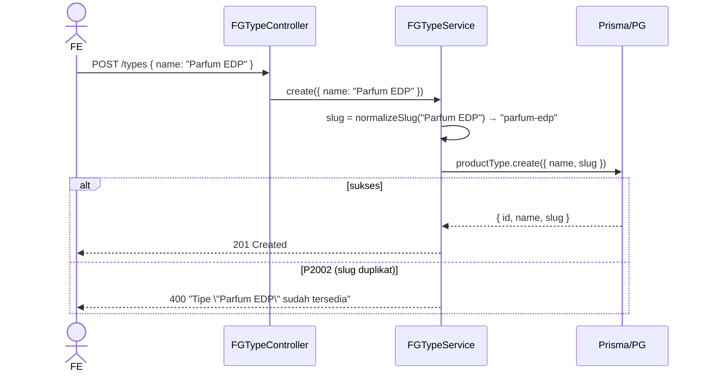

# Module: Inventory / FG / Type (Product Type Master)

**Base path**: `/api/app/inventory/fg/types`
**Source**: `src/module/application/inventory/fg/type/`
**Tests**: belum ada test khusus untuk `type/*` (cover by `fg.service.test.ts` upsert path).
**Prisma model**: `ProductType` (`product_types` table)

Master data tipe produk FG (mis. `Parfum EDP`, `Parfum EDT`). Dipakai sebagai FK `Product.type_id` dan diisi otomatis lewat `getOrCreateSlug` di FG create/update/import.

> **Catatan**: `slug` di-derive dari `name` lewat `normalizeSlug(name)` di `src/lib/index.ts`. Konsumer FG cukup kirim `name` — slug auto-generated.

---

## 1. Scope & Fitur

| Fitur            | Endpoint              | Catatan                                                            |
| :--------------- | :-------------------- | :----------------------------------------------------------------- |
| List + search    | `GET /`               | Filter `?search=<text>` ILIKE pada `name`. Sort ascending `name`.  |
| Create           | `POST /`              | Unique constraint `slug` → 400 jika duplikat.                      |
| Update           | `PUT /:id`            | Partial. Tanpa body → no-op return existing. Re-generate slug.     |
| Delete           | `DELETE /:id`         | Hard delete; tolak jika masih dipakai produk (`_count.products`).  |

### Out of scope

- Bulk import tipe — tidak ada endpoint khusus; upsert otomatis dari FG import (lihat [`../import`](../import/README.md)).
- Slug manual override — slug selalu di-derive otomatis.
- Soft delete — tidak diaplikasikan.

---

## 2. Arsitektur & Flow

### Layer map

```text
┌────── routes/type.routes.ts ──────┐
│ GET    /                          │
│ POST   /        validateBody      │
│ PUT    /:id     validateBody p.   │
│ DELETE /:id                       │
└────────────┬──────────────────────┘
             ▼
┌────── controller/type.controller.ts ─┐
│ - validate id Number.isInteger > 0   │
│ - QueryFGTypeSchema.safeParse        │
│ - panggil FGTypeService              │
└────────────┬─────────────────────────┘
             ▼
┌────── service/type.service.ts ───────┐
│ - normalizeSlug(name) → slug         │
│ - prisma.productType.create/update   │
│ - P2002 / P2025 mapping → ApiError   │
│ - delete: cek _count.products        │
└────────────┬─────────────────────────┘
             ▼
       Prisma → product_types
```

### Mermaid: Create



### Mermaid: Delete

```mermaid
flowchart TD
    A[DELETE /:id] --> B[findUnique select _count.products]
    B -->|not found| E1[404 'Tipe produk tidak ditemukan']
    B -->|found| C{_count.products > 0?}
    C -->|yes| E2[400 'Tipe produk tidak dapat dihapus karena masih digunakan']
    C -->|no| D[productType.delete] --> F[200 {}]
```

---

## 3. DTO / Schemas (end-to-end SSOT)

**Source**: `src/module/application/inventory/fg/type/type.schema.ts`. **FE wajib mirror** — lihat [`../../frontend-integration.md`](../../frontend-integration.md) §2.

### 3.1 `RequestFGTypeSchema` — POST / & PUT /:id (partial)

**Zod chain (verbatim)**:

```ts
export const RequestFGTypeSchema = z.object({
    name: z
        .string()
        .trim()
        .min(1, "Nama tipe wajib diisi")
        .max(50, "Nama tipe maksimal 50 karakter"),
});

export type RequestFGTypeDTO = z.infer<typeof RequestFGTypeSchema>;
```

| Field  | Type     | Required | Constraint                          | Error msg                                                  | Catatan                                          |
| :----- | :------- | :------- | :---------------------------------- | :--------------------------------------------------------- | :----------------------------------------------- |
| `name` | `string` | ✅       | `trim()`, `min(1)`, `max(50)`       | `"Nama tipe wajib diisi"` / `"Nama tipe maksimal 50 karakter"` | Service derive `slug` lewat `normalizeSlug(name)`. |

### 3.2 `QueryFGTypeSchema` — GET /

**Zod chain (verbatim)**:

```ts
export const QueryFGTypeSchema = z.object({
    search: z.string().trim().min(1).optional(),
    page: z.coerce.number().int().positive().default(1),
    take: z.coerce.number().int().positive().max(100).default(25),
});

export type QueryFGTypeDTO = z.infer<typeof QueryFGTypeSchema>;
```

| Param     | Type     | Default | Constraint                        | Catatan                                       |
| :-------- | :------- | :------ | :-------------------------------- | :-------------------------------------------- |
| `search`  | `string` | —       | `trim()`, `min(1)`                | ILIKE insensitive pada `name`. Trigram GIN.   |
| `page`    | `number` | `1`     | `coerce`, `int()`, `positive()`   | —                                             |
| `take`    | `number` | `25`    | `coerce`, `int()`, `1..100`       | —                                             |

### 3.3 `ResponseFGTypeSchema`

```ts
export const ResponseFGTypeSchema = z.object({
    id: z.number(),
    name: z.string(),
    slug: z.string(),
});

export type ResponseFGTypeDTO = z.infer<typeof ResponseFGTypeSchema>;
```

| Field  | Type     | Catatan                                                    |
| :----- | :------- | :--------------------------------------------------------- |
| `id`   | `number` | PK.                                                        |
| `name` | `string` | Display name.                                              |
| `slug` | `string` | Auto-derived dari `name` via `normalizeSlug()`. `@unique`. |

### 3.4 Catatan integrasi FE

Schema di atas adalah kontrak. FE mirror di:

- Schema: `app/src/app/(application)/inventory/fg/types/server/inventory.fg.type.schema.ts` 🚧 TBD
- DTO export: `RequestFGTypeDTO`, `QueryFGTypeDTO`, `ResponseFGTypeDTO`

Service & hook pattern (`InventoryFGTypeService`, `useInventoryFGType`, dst.): lihat [`../../frontend-integration.md`](../../frontend-integration.md). Invalidation `inventory.fg.type` **juga** trigger `["inventory.fg"]` (FG list join via type).

---

## 4. Routing untuk integrasi Frontend

Mount di parent `/api/app/inventory/fg/types`. Terproteksi `authMiddleware` (inherit dari `FGRoutes`).

### 4.1 Daftar endpoint

| #   | Method | Path        | Body / Query                  | Body type | Response (200/201)              | Error utama                              |
| :-- | :----- | :---------- | :---------------------------- | :-------- | :------------------------------ | :--------------------------------------- |
| 1   | GET    | `/`         | `?search=&page=&take=`        | —         | `{ data: ProductType[], len }` (200) | 400 (query invalid)                 |
| 2   | POST   | `/`         | `{ name }`                    | JSON      | `ResponseFGTypeDTO` (201)       | 400 (Zod / duplikat)                     |
| 3   | PUT    | `/:id`      | `Partial<{ name }>`           | JSON      | `ResponseFGTypeDTO` (200)       | 400 (Zod / duplikat) / 404               |
| 4   | DELETE | `/:id`      | —                             | —         | `{}` (200)                      | 400 (FK products) / 404                  |

### 4.2 Contoh integrasi frontend

Konvensi lengkap (service class `InventoryFGTypeService`, hook split, queryKey `["inventory.fg.type", ...]`, invalidation juga ke `["inventory.fg"]`) ada di [`../../frontend-integration.md`](../../frontend-integration.md).

```ts
const API = `${process.env.NEXT_PUBLIC_API}/api/app/inventory/fg/types`;

static async list(params: QueryFGTypeDTO) {
    const { data } = await api.get<ApiSuccessResponse<{ len: number; data: Array<ResponseFGTypeDTO> }>>(API, { params });
    return data.data;
}
static async create(body: RequestFGTypeDTO) {
    await setupCSRFToken();
    await api.post(API, body);
}
```

### 4.3 Header & autentikasi

- `Cookie: session={{session_id}}`
- `x-csrf-token: {{csrf_token}}` (mutasi)
- `Content-Type: application/json` (POST/PUT)

---

## 5. Database / Indexes

```prisma
model ProductType {
  id       Int       @id @default(autoincrement())
  slug     String    @unique @db.VarChar(100)
  name     String    @db.VarChar(100)
  products Product[]

  @@index([name])
  @@map("product_types")
}
```

- `slug` adalah **unique** (constraint level DB) → unique violation = P2002.
- `@@index([name])` mempercepat ILIKE search (dipasangkan dengan trigram GIN di migration `20260516120000_fg_search_trgm_indexes`).

---

## 6. Error catalog

| HTTP | Pesan                                                                             | Trigger                                                       |
| :--- | :-------------------------------------------------------------------------------- | :------------------------------------------------------------ |
| 400  | `Validation Error` + `{ message, path }`                                          | Body `name` tidak valid (empty / > 50 char).                  |
| 400  | `Query tidak valid`                                                               | Query string gagal `QueryFGTypeSchema.safeParse`.             |
| 400  | `ID tidak valid`                                                                  | `:id` bukan integer positif (controller guard).               |
| 400  | `Tipe "{name}" sudah tersedia`                                                    | P2002 saat create.                                            |
| 400  | `Tipe "{name}" sudah digunakan`                                                   | P2002 saat update.                                            |
| 400  | `Tipe produk tidak dapat dihapus karena masih digunakan oleh produk`              | `_count.products > 0` saat delete.                            |
| 404  | `Tipe produk tidak ditemukan`                                                     | findUnique = null (update no-body case + delete).             |
| 404  | `Tipe produk tidak ditemukan`                                                     | P2025 saat update.                                            |
| 500  | `Internal Server Error`                                                           | Error Prisma tak terduga (re-throw).                          |

---

## 7. Testing

Belum ada file test dedicated untuk `type/*`. Coverage tidak langsung:

- `fg.service.test.ts` indirectly cover `getOrCreateSlug(productType, name)` lewat path create FG.
- TODO: tambahkan `src/tests/inventory/fg/type/type.service.test.ts` mengikuti pola `fg.service.test.ts` (mock `prisma.productType`, test create/update/delete/list + slug generation). <!-- verify -->

---

## 8. Postman testing

Folder Postman: `Inventory / FG / Type` di `docs/postman/erp-mandalika.postman_collection.json`.

### 8.1 List

```
GET {{base_url}}/api/app/inventory/fg/types?page=1&take=25&search=parfum
```

### 8.2 Create

```
POST {{base_url}}/api/app/inventory/fg/types
Content-Type: application/json

{ "name": "Parfum EDP" }
```

**Expected 201**:

```json
{ "query": null, "status": "success", "data": { "id": 1, "name": "Parfum EDP", "slug": "parfum-edp" } }
```

### 8.3 Update

```
PUT {{base_url}}/api/app/inventory/fg/types/1
Content-Type: application/json

{ "name": "Parfum EDT" }
```

### 8.4 Delete

```
DELETE {{base_url}}/api/app/inventory/fg/types/1
```

**Expected 400** jika tipe masih dipakai produk: `"Tipe produk tidak dapat dihapus karena masih digunakan oleh produk"`.

---

## 9. Activity log

Modul type **tidak** menulis `CreateLogger` (master data, audit lewat operasi FG yang menulisnya). Kalau ingin audit penuh, hook di controller setelah service call.

---

## 10. Checklist saat menambah fitur ke FG Type

- [ ] Update `RequestFGTypeSchema` jika ada field tambahan (catatan: model `ProductType` saat ini hanya `id`, `name`, `slug`).
- [ ] Pastikan `normalizeSlug` di `src/lib/index.ts` masih sesuai (slug = lowercase, kebab-case, ASCII).
- [ ] Buat file test `src/tests/inventory/fg/type/type.service.test.ts` (belum ada).
- [ ] Update Postman folder `Inventory / FG / Type`.
- [ ] `rtk tsc --noEmit` clean.

---

## 11. Referensi silang

- **Frontend integration**: [`../../frontend-integration.md`](../../frontend-integration.md)
- Parent scope: [`../README.md`](../README.md)
- Sibling: [`../size/README.md`](../size/README.md), [`../import/README.md`](../import/README.md)
- Konvensi SOP: [CONVENTIONS.md](../../../../CONVENTIONS.md)
- DB schema: [DATABASE.md](../../../../DATABASE.md)
