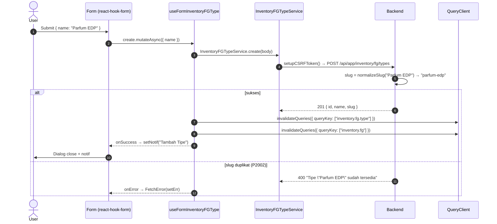
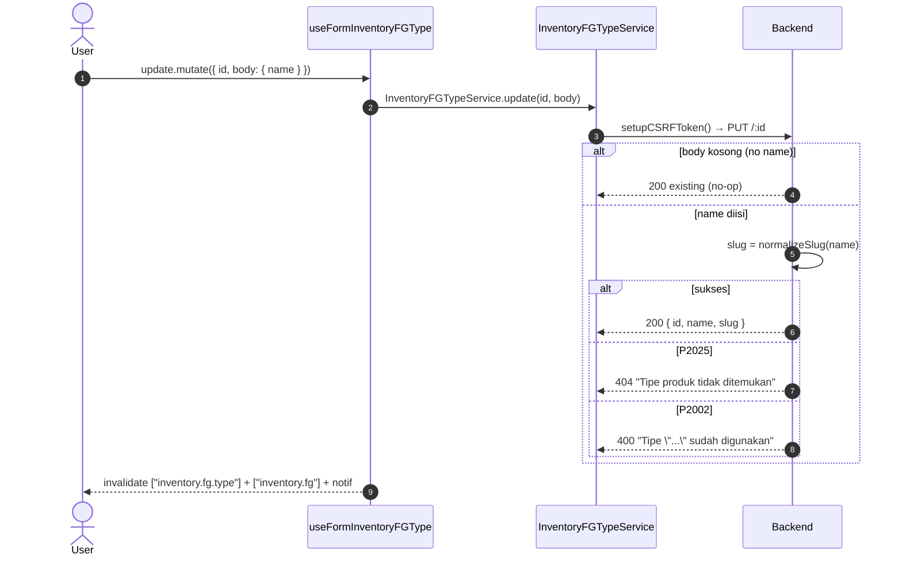
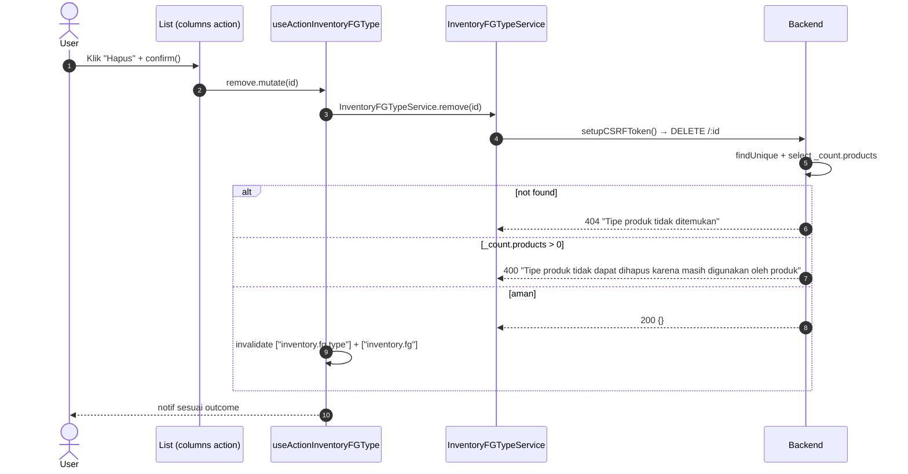

# Inventory / FG / Type — Frontend Integration (Scope Level)

End-to-end FE integration **lengkap** untuk scope master data tipe produk FG. FE engineer baca file ini saja → bisa implement dari nol.

**Backend scope path**: `api/src/module/application/inventory/fg/type/`
**Frontend scope path**: `app/src/app/(application)/inventory/fg/types/server/`
**Component path**: `app/src/components/pages/inventory/fg/types/`
**Endpoint base**: `/api/app/inventory/fg/types`
**Status FE**: 🚧 TBD <!-- ubah ke ✅ Ready setelah file FE dibuat -->

**Dependencies**:

- Konvensi global modul ([`../../frontend-integration.md`](../../frontend-integration.md)) — CSRF, queryKey naming, error pattern, debounce, design tokens, status code expectation.
- BE scope doc ([`./README.md`](./README.md)) — Zod schema source, endpoint detail, error catalog.
- SOP canonical: [frontend-dev-flow](../../../../.claude/skills/frontend-dev-flow/SKILL.md).

Master data **ProductType** (mis. `Parfum EDP`, `Parfum EDT`) yang dipakai sebagai FK `Product.type_id`. Slug auto-derived dari `name` di service (`normalizeSlug(name)`) — FE **tidak** mengirim slug. Master ini juga di-upsert otomatis lewat `getOrCreateSlug` saat FG create/update/import; endpoint scope ini hanya untuk manual CRUD master.

---

## 1. Schema Mirror End-to-End

**Source BE**: `src/module/application/inventory/fg/type/type.schema.ts`. FE mirror WAJIB 1:1.

### 1.1 `RequestFGTypeSchema` (BE — verbatim)

```ts
import z from "zod";

export const RequestFGTypeSchema = z.object({
    name: z
        .string()
        .trim()
        .min(1, "Nama tipe wajib diisi")
        .max(50, "Nama tipe maksimal 50 karakter"),
});
```

**Field detail**:

| Field  | Type     | Required | Default | Constraint                    | Error msg                                                          | Catatan                                              |
| :----- | :------- | :------- | :------ | :---------------------------- | :----------------------------------------------------------------- | :--------------------------------------------------- |
| `name` | `string` | ✅       | —       | `trim()`, `min(1)`, `max(50)` | `"Nama tipe wajib diisi"` / `"Nama tipe maksimal 50 karakter"`     | Service derive `slug` lewat `normalizeSlug(name)`.   |

> ⚠️ **Tidak ada field `slug` di Request**. FE hanya kirim `name`. BE generate `slug` lewat `normalizeSlug(name)` di `src/lib/index.ts`. Lihat §7.

### 1.2 `ResponseFGTypeSchema` & DTO (BE — verbatim)

```ts
export const ResponseFGTypeSchema = z.object({
    id: z.number(),
    name: z.string(),
    slug: z.string(),
});

export type ResponseFGTypeDTO = z.infer<typeof ResponseFGTypeSchema>;
```

**Field response**:

| Field di response | Sumber Prisma         | Transformasi service                                  |
| :---------------- | :-------------------- | :---------------------------------------------------- |
| `id`              | `ProductType.id`      | as-is.                                                |
| `name`            | `ProductType.name`    | as-is.                                                |
| `slug`            | `ProductType.slug`    | auto-generated server-side via `normalizeSlug(name)`. |

> 💡 Tidak ada `created_at` / `updated_at` / `deleted_at` di model `ProductType` (master data sederhana, tanpa soft delete & timestamps).

### 1.3 `QueryFGTypeSchema` — GET / (BE — verbatim)

```ts
export const QueryFGTypeSchema = z.object({
    search: z.string().trim().min(1).optional(),
    page: z.coerce.number().int().positive().default(1),
    take: z.coerce.number().int().positive().max(100).default(25),
});

export type QueryFGTypeDTO = z.infer<typeof QueryFGTypeSchema>;
```

**Param detail**:

| Param    | Type     | Default | Constraint                       | Catatan                                          |
| :------- | :------- | :------ | :------------------------------- | :----------------------------------------------- |
| `search` | `string` | —       | `trim()`, `min(1)`               | ILIKE insensitive pada `name`. Trigram GIN.      |
| `page`   | `number` | `1`     | `coerce`, `int()`, `positive()`  | —                                                |
| `take`   | `number` | `25`    | `coerce`, `int()`, `1..100`      | Max 100 per page.                                |

> 💡 Tidak ada `sortBy` / `sortOrder` di query — BE hardcode `orderBy: { name: "asc" }`.

### 1.4 Tidak ada Bulk Action

Scope ini **tidak** punya bulk status / bulk delete / soft-delete / trash. CRUD only.

### 1.5 Prisma model referensi

```prisma
model ProductType {
  id       Int       @id @default(autoincrement())
  slug     String    @unique @db.VarChar(100)
  name     String    @db.VarChar(100)
  products Product[]

  @@index([name])
  @@map("product_types")
}
```

Lokasi BE: `prisma/schema.prisma`. Tidak ada enum khusus untuk scope ini.

---

## 2. FE Schema Mirror

**File**: `app/src/app/(application)/inventory/fg/types/server/inventory.fg.type.schema.ts` 🚧 TBD

```ts
import { z } from "zod";

export const RequestFGTypeSchema = z.object({
    name: z
        .string()
        .trim()
        .min(1, "Nama tipe wajib diisi")
        .max(50, "Nama tipe maksimal 50 karakter"),
});

export type RequestFGTypeDTO = z.input<typeof RequestFGTypeSchema>;

export const ResponseFGTypeSchema = z.object({
    id: z.number(),
    name: z.string(),
    slug: z.string(),
});

export type ResponseFGTypeDTO = z.infer<typeof ResponseFGTypeSchema>;

export const QueryFGTypeSchema = z.object({
    search: z.string().trim().min(1).optional(),
    page: z.coerce.number().int().positive().default(1),
    take: z.coerce.number().int().positive().max(100).default(25),
});

export type QueryFGTypeDTO = z.infer<typeof QueryFGTypeSchema>;
```

**Diff vs BE**: tidak ada deviation. Mirror 1:1.

---

## 3. Service Class — FULL CODE

**File**: `app/src/app/(application)/inventory/fg/types/server/inventory.fg.type.service.ts` 🚧 TBD

```ts
import api from "@/lib/api";
import { setupCSRFToken } from "@/shared/api/csrf";
import type { ApiSuccessResponse } from "@/shared/types/api";
import type {
    RequestFGTypeDTO,
    ResponseFGTypeDTO,
    QueryFGTypeDTO,
} from "./inventory.fg.type.schema";

const API = `${process.env.NEXT_PUBLIC_API}/api/app/inventory/fg/types`;

export class InventoryFGTypeService {
    static async list(
        params: QueryFGTypeDTO,
    ): Promise<{ data: ResponseFGTypeDTO[]; len: number }> {
        try {
            const { data } = await api.get<
                ApiSuccessResponse<{ data: ResponseFGTypeDTO[]; len: number }>
            >(API, { params });
            return data.data;
        } catch (error) {
            throw error;
        }
    }

    static async create(body: RequestFGTypeDTO): Promise<ResponseFGTypeDTO> {
        try {
            await setupCSRFToken();
            const { data } = await api.post<ApiSuccessResponse<ResponseFGTypeDTO>>(
                API,
                body,
            );
            return data.data;
        } catch (error) {
            throw error;
        }
    }

    static async update(
        id: number,
        body: Partial<RequestFGTypeDTO>,
    ): Promise<ResponseFGTypeDTO> {
        try {
            await setupCSRFToken();
            const { data } = await api.put<ApiSuccessResponse<ResponseFGTypeDTO>>(
                `${API}/${id}`,
                body,
            );
            return data.data;
        } catch (error) {
            throw error;
        }
    }

    static async remove(id: number): Promise<void> {
        try {
            await setupCSRFToken();
            await api.delete(`${API}/${id}`);
        } catch (error) {
            throw error;
        }
    }
}
```

> 💡 **Tidak ada** `detail`, `changeStatus`, `bulkStatus`, `clean`, `exportCsv` di scope ini — BE tidak expose endpoint-endpoint tersebut.

---

## 4. Hooks — 5 Hook Split FULL CODE

**File**: `app/src/app/(application)/inventory/fg/types/server/use.inventory.fg.type.ts` 🚧 TBD

```ts
"use client";
import { useQuery, useMutation, useQueryClient } from "@tanstack/react-query";
import { useSetAtom } from "jotai";
import { useState, useMemo, useCallback } from "react";
import { useSearchParams } from "next/navigation";
import { useDebounce, useQueryParams } from "@/shared/hooks";
import { errorAtom, notificationAtom } from "@/shared/atoms";
import { FetchError } from "@/shared/api/errors";
import type { ResponseError } from "@/shared/types/api";
import { InventoryFGTypeService } from "./inventory.fg.type.service";
import type {
    RequestFGTypeDTO,
    ResponseFGTypeDTO,
    QueryFGTypeDTO,
} from "./inventory.fg.type.schema";

const KEY = ["inventory.fg.type"] as const;
// Invalidate juga ke FG list (relasi Product.type_id)
const FG_KEY = ["inventory.fg"] as const;

// ──────────────────────────────────────────────────────────────────────────────
// 4.1 READ — useQuery wrapper
// ──────────────────────────────────────────────────────────────────────────────
export function useInventoryFGType(params: QueryFGTypeDTO, enabled = true) {
    return useQuery<{ data: ResponseFGTypeDTO[]; len: number }, ResponseError>({
        queryKey: [...KEY, params],
        queryFn: () => InventoryFGTypeService.list(params),
        enabled,
        staleTime: 30_000,
    });
}

// ──────────────────────────────────────────────────────────────────────────────
// 4.2 WRITE — create + update mutations
// ──────────────────────────────────────────────────────────────────────────────
export function useFormInventoryFGType() {
    const setErr = useSetAtom(errorAtom);
    const setNotif = useSetAtom(notificationAtom);
    const queryClient = useQueryClient();

    const invalidate = () => {
        queryClient.invalidateQueries({ queryKey: KEY, type: "all" });
        queryClient.invalidateQueries({ queryKey: FG_KEY, type: "all" });
    };

    const create = useMutation<ResponseFGTypeDTO, ResponseError, RequestFGTypeDTO>({
        mutationKey: [...KEY, "create"],
        mutationFn: (body) => InventoryFGTypeService.create(body),
        onSuccess: () => {
            setNotif({
                title: "Tambah Tipe",
                message: "Berhasil menambahkan tipe produk baru",
            });
            invalidate();
        },
        onError: (err) => FetchError(err, setErr),
    });

    const update = useMutation<
        ResponseFGTypeDTO,
        ResponseError,
        { id: number; body: Partial<RequestFGTypeDTO> }
    >({
        mutationKey: [...KEY, "update"],
        mutationFn: ({ id, body }) => InventoryFGTypeService.update(id, body),
        onSuccess: () => {
            setNotif({
                title: "Ubah Tipe",
                message: "Berhasil memperbarui tipe produk",
            });
            invalidate();
        },
        onError: (err) => FetchError(err, setErr),
    });

    return { create, update };
}

// ──────────────────────────────────────────────────────────────────────────────
// 4.3 ACTION — delete (hard delete)
// ──────────────────────────────────────────────────────────────────────────────
export function useActionInventoryFGType() {
    const setErr = useSetAtom(errorAtom);
    const setNotif = useSetAtom(notificationAtom);
    const queryClient = useQueryClient();
    const invalidate = () => {
        queryClient.invalidateQueries({ queryKey: KEY, type: "all" });
        queryClient.invalidateQueries({ queryKey: FG_KEY, type: "all" });
    };

    const remove = useMutation<unknown, ResponseError, number>({
        mutationKey: [...KEY, "remove"],
        mutationFn: (id) => InventoryFGTypeService.remove(id),
        onSuccess: () => {
            setNotif({
                title: "Hapus Tipe",
                message: "Tipe produk berhasil dihapus",
            });
            invalidate();
        },
        onError: (err) => FetchError(err, setErr),
    });

    return { remove };
}

// ──────────────────────────────────────────────────────────────────────────────
// 4.4 TableState — URL sync + debounce search
// ──────────────────────────────────────────────────────────────────────────────
export function useInventoryFGTypeTableState() {
    const searchParams = useSearchParams();
    const { batchSet } = useQueryParams();

    const rawSearch = searchParams.get("search") ?? "";
    const [search, setSearchState] = useState(rawSearch);
    const debouncedSearch = useDebounce(search, 500);

    const setSearch = useCallback((val: string) => {
        setSearchState(val);
    }, []);

    // Sync ke URL setelah debounce
    useMemo(() => {
        batchSet({ search: debouncedSearch || null, page: "1" });
    }, [debouncedSearch, batchSet]);

    const page = Number(searchParams.get("page") ?? 1);
    const take = Number(searchParams.get("take") ?? 25);

    const queryParams = useMemo<QueryFGTypeDTO>(
        () => ({ page, take, search: debouncedSearch || undefined }),
        [page, take, debouncedSearch],
    );

    return { search, setSearch, page, take, queryParams };
}

// ──────────────────────────────────────────────────────────────────────────────
// 4.5 Query-wrapper — bundling list + tableState untuk page consumer
// ──────────────────────────────────────────────────────────────────────────────
export function useInventoryFGTypeQuery() {
    const tableState = useInventoryFGTypeTableState();
    const query = useInventoryFGType(tableState.queryParams);
    return { ...tableState, query };
}
```

> 💡 QueryKey root **`["inventory.fg.type"]`**. Setiap mutasi juga invalidate `["inventory.fg"]` karena FG list join lewat `Product.type_id` — perubahan nama tipe harus refleksi langsung di table FG.

---

## 5. Components — Snippets

### 5.1 List page — `components/pages/inventory/fg/types/index.tsx` 🚧 TBD

```tsx
"use client";
import {
    useInventoryFGTypeQuery,
    useActionInventoryFGType,
} from "@/app/(application)/inventory/fg/types/server/use.inventory.fg.type";
import { DataTable } from "@/components/ui/data-table";
import { columns } from "./table/columns";
import { FGTypeFormDialog } from "./form/fg-type-form-dialog";

export default function FGTypeList() {
    const { query, search, setSearch } = useInventoryFGTypeQuery();
    const { remove } = useActionInventoryFGType();

    return (
        <section className="space-y-4">
            <header className="flex items-center justify-between gap-2">
                <input
                    value={search}
                    onChange={(e) => setSearch(e.target.value)}
                    placeholder="Cari tipe produk…"
                    className="rounded-xl border-zinc-200 px-3 py-2"
                />
                <FGTypeFormDialog mode="create" />
            </header>
            <DataTable
                tableId="inventory-fg-type-table"
                columns={columns({ onDelete: (id) => remove.mutate(id) })}
                data={query.data?.data ?? []}
                total={query.data?.len ?? 0}
                loading={query.isLoading}
            />
        </section>
    );
}
```

### 5.2 Form (single field "Nama Tipe") — `components/pages/inventory/fg/types/form/create.tsx` 🚧 TBD

```tsx
"use client";
import { useForm } from "react-hook-form";
import { zodResolver } from "@hookform/resolvers/zod";
import { Form } from "@/components/ui/form/main";
import { InputForm } from "@/components/ui/form";
import {
    RequestFGTypeSchema,
    type RequestFGTypeDTO,
} from "@/app/(application)/inventory/fg/types/server/inventory.fg.type.schema";
import { useFormInventoryFGType } from "@/app/(application)/inventory/fg/types/server/use.inventory.fg.type";

export function CreateFGTypeForm({ onSuccess }: { onSuccess?: () => void }) {
    const form = useForm<RequestFGTypeDTO>({
        resolver: zodResolver(RequestFGTypeSchema),
        defaultValues: { name: "" },
    });
    const { create } = useFormInventoryFGType();

    const handleSubmit = form.handleSubmit(async (body) => {
        await create.mutateAsync(body);
        form.reset();
        onSuccess?.();
    });

    return (
        <Form methods={form}>
            <form onSubmit={handleSubmit} className="space-y-3">
                <InputForm
                    name="name"
                    label="Nama Tipe"
                    placeholder="cth. Parfum EDP"
                    maxLength={50}
                    required
                />
                <p className="text-xs text-zinc-500">
                    Slug akan dibuat otomatis dari nama (mis. <code>parfum-edp</code>).
                </p>
                <button type="submit" disabled={create.isPending}>
                    {create.isPending ? "Menyimpan…" : "Simpan"}
                </button>
            </form>
        </Form>
    );
}
```

### 5.3 Dialog — `components/pages/inventory/fg/types/form/fg-type-form-dialog.tsx` 🚧 TBD

```tsx
"use client";
import { useState } from "react";
import { Dialog, DialogContent, DialogTrigger } from "@/components/ui/dialog";
import { CreateFGTypeForm } from "./create";
import { UpdateFGTypeForm } from "./update";
import type { ResponseFGTypeDTO } from "@/app/(application)/inventory/fg/types/server/inventory.fg.type.schema";

type Props =
    | { mode: "create" }
    | { mode: "update"; row: ResponseFGTypeDTO };

export function FGTypeFormDialog(props: Props) {
    const [open, setOpen] = useState(false);
    return (
        <Dialog open={open} onOpenChange={setOpen}>
            <DialogTrigger asChild>
                <button className="rounded-xl bg-amber-600 px-3 py-2 text-white">
                    {props.mode === "create" ? "Tambah Tipe" : "Edit"}
                </button>
            </DialogTrigger>
            <DialogContent>
                {props.mode === "create" ? (
                    <CreateFGTypeForm onSuccess={() => setOpen(false)} />
                ) : (
                    <UpdateFGTypeForm row={props.row} onSuccess={() => setOpen(false)} />
                )}
            </DialogContent>
        </Dialog>
    );
}
```

### 5.4 Columns — `components/pages/inventory/fg/types/table/columns.tsx` 🚧 TBD

```tsx
import type { ColumnDef } from "@tanstack/react-table";
import type { ResponseFGTypeDTO } from "@/app/(application)/inventory/fg/types/server/inventory.fg.type.schema";
import { FGTypeFormDialog } from "../form/fg-type-form-dialog";

export const columns = ({
    onDelete,
}: {
    onDelete: (id: number) => void;
}): ColumnDef<ResponseFGTypeDTO>[] => [
    { accessorKey: "name", header: "Nama Tipe" },
    {
        accessorKey: "slug",
        header: "Slug",
        cell: ({ row }) => (
            <span className="font-mono text-xs text-zinc-500">
                {row.original.slug}
            </span>
        ),
    },
    {
        id: "actions",
        header: "Aksi",
        cell: ({ row }) => (
            <div className="flex gap-2">
                <FGTypeFormDialog mode="update" row={row.original} />
                <button
                    onClick={() => {
                        if (confirm(`Hapus tipe "${row.original.name}"?`)) {
                            onDelete(row.original.id);
                        }
                    }}
                    className="rounded-lg px-2 py-1 text-red-600 hover:bg-red-50"
                >
                    Hapus
                </button>
            </div>
        ),
    },
];
```

### 5.5 Page entry — `app/(application)/inventory/fg/types/page.tsx` 🚧 TBD

```tsx
import { Suspense } from "react";
import FGTypeList from "@/components/pages/inventory/fg/types";

export default function FGTypePage() {
    return (
        <Suspense fallback={<div>Loading…</div>}>
            <FGTypeList />
        </Suspense>
    );
}
```

---

## 6. End-to-End Flow per Operasi

### 6.1 Create



### 6.2 Update



### 6.3 Delete



---

## 7. Edge Cases & Per-Scope Quirks

- **Slug auto-generated server-side** — FE **JANGAN** mengirim field `slug`. BE generate via `normalizeSlug(name)` di `src/lib/index.ts` (lowercase, kebab-case, ASCII). Field di response read-only untuk display.
- **Unique constraint** — `slug` `@unique`. Dua nama berbeda yang menormalisasi ke slug yang sama (mis. "Parfum EDP" vs "parfum  edp") akan trigger 400 dengan pesan `"Tipe \"<name>\" sudah tersedia"` (create) atau `"Tipe \"<name>\" sudah digunakan"` (update). Tangkap 400 → tampilkan inline di field `name`.
- **Master data auto-upsert lewat FG** — scope endpoint ini untuk **manual CRUD**. Saat FG create/update/import dijalankan, BE memanggil `getOrCreateSlug(productType, name)` yang otomatis insert tipe baru kalau belum ada. Artinya daftar tipe bisa bertambah tanpa user pernah membuka halaman ini → setelah operasi FG, **invalidate `["inventory.fg.type"]`** dari hook FG (atau sebaliknya gunakan `refetchOnWindowFocus`).
- **Delete protection (FK guard)** — BE menolak delete bila `_count.products > 0`. FE wajib `confirm()` user dan tampilkan pesan 400 BE apa adanya (sudah human-readable).
- **No-op update** — `PUT /:id` tanpa body `name` akan return existing tanpa error → consumer hook tetap menerima `ResponseFGTypeDTO`.
- **Tidak ada soft delete / trash** — hard delete only. Tidak ada toggle trash mode di list.
- **Tidak ada timestamps** — model `ProductType` tidak punya `created_at` / `updated_at` / `deleted_at`. Jangan render kolom-kolom ini.
- **Search debounce**: 500ms (via `useDebounce`). URL sync via `useQueryParams.batchSet` setelah debounce, reset `page=1`.
- **Sort fixed**: BE hardcode `orderBy: { name: "asc" }`. Tidak ada `sortBy` / `sortOrder` query param.
- **Cross-query invalidation**: setiap mutasi (create/update/remove) **juga** invalidate `["inventory.fg"]` karena FG table render `product.type.name`. Tanpa invalidate ini, edit nama tipe tidak langsung terlihat di table FG.

---

## 8. Testing FE (Vitest + RTL)

**Lokasi**: `app/src/__tests__/inventory/fg/types/` 🚧 TBD. Mengikuti SOP `frontend-testing`.

### 8.1 Service test

```ts
import { describe, it, expect, vi } from "vitest";
import api from "@/lib/api";
import { InventoryFGTypeService } from "@/app/(application)/inventory/fg/types/server/inventory.fg.type.service";

vi.mock("@/lib/api");
vi.mock("@/shared/api/csrf", () => ({ setupCSRFToken: vi.fn() }));

describe("InventoryFGTypeService", () => {
    it("list passes params to GET", async () => {
        (api.get as any).mockResolvedValue({
            data: { data: { data: [], len: 0 } },
        });
        await InventoryFGTypeService.list({ page: 1, take: 25 });
        expect(api.get).toHaveBeenCalledWith(expect.any(String), {
            params: { page: 1, take: 25 },
        });
    });

    it("create calls setupCSRFToken before POST", async () => {
        (api.post as any).mockResolvedValue({
            data: { data: { id: 1, name: "Parfum EDP", slug: "parfum-edp" } },
        });
        const res = await InventoryFGTypeService.create({ name: "Parfum EDP" });
        expect(api.post).toHaveBeenCalledWith(expect.any(String), {
            name: "Parfum EDP",
        });
        expect(res.slug).toBe("parfum-edp");
    });

    it("remove sends DELETE /:id", async () => {
        (api.delete as any).mockResolvedValue({});
        await InventoryFGTypeService.remove(7);
        expect(api.delete).toHaveBeenCalledWith(expect.stringMatching(/\/7$/));
    });
});
```

### 8.2 Hook test

```tsx
import { describe, it, expect, vi } from "vitest";
import { renderHook, waitFor } from "@testing-library/react";
import { QueryClient, QueryClientProvider } from "@tanstack/react-query";
import { useInventoryFGType } from "@/app/(application)/inventory/fg/types/server/use.inventory.fg.type";
import { InventoryFGTypeService } from "@/app/(application)/inventory/fg/types/server/inventory.fg.type.service";

vi.mock(
    "@/app/(application)/inventory/fg/types/server/inventory.fg.type.service",
);

const wrapper = ({ children }: { children: React.ReactNode }) => {
    const client = new QueryClient({
        defaultOptions: { queries: { retry: false } },
    });
    return <QueryClientProvider client={client}>{children}</QueryClientProvider>;
};

describe("useInventoryFGType", () => {
    it("fetches list via service", async () => {
        (InventoryFGTypeService.list as any).mockResolvedValue({
            data: [{ id: 1, name: "Parfum EDP", slug: "parfum-edp" }],
            len: 1,
        });
        const { result } = renderHook(
            () => useInventoryFGType({ page: 1, take: 25 }),
            { wrapper },
        );
        await waitFor(() => expect(result.current.isSuccess).toBe(true));
        expect(InventoryFGTypeService.list).toHaveBeenCalledWith({
            page: 1,
            take: 25,
        });
    });
});
```

### 8.3 Component test

```tsx
import { describe, it, expect, vi } from "vitest";
import { render, screen } from "@testing-library/react";
import { CreateFGTypeForm } from "@/components/pages/inventory/fg/types/form/create";

vi.mock(
    "@/app/(application)/inventory/fg/types/server/use.inventory.fg.type",
    () => ({
        useFormInventoryFGType: () => ({
            create: { mutateAsync: vi.fn(), isPending: false },
        }),
    }),
);

describe("CreateFGTypeForm", () => {
    it("renders the Nama Tipe input", () => {
        render(<CreateFGTypeForm />);
        expect(screen.getByLabelText("Nama Tipe")).toBeInTheDocument();
    });
});
```

---

## 9. Cross-link

- BE scope doc: [./README.md](./README.md)
- Module-level konvensi FE: [../../frontend-integration.md](../../frontend-integration.md)
- Parent scope BE: [../README.md](../README.md)
- Sibling scope: [../size/README.md](../size/README.md), [../import/README.md](../import/README.md)
- SOP FE canonical: [frontend-dev-flow](../../../../.claude/skills/frontend-dev-flow/SKILL.md)
- SOP FE testing: [frontend-testing](../../../../.claude/skills/frontend-testing/SKILL.md)
- Postman folder: `Inventory / FG / Type` di `docs/postman/erp-mandalika.postman_collection.json`.
