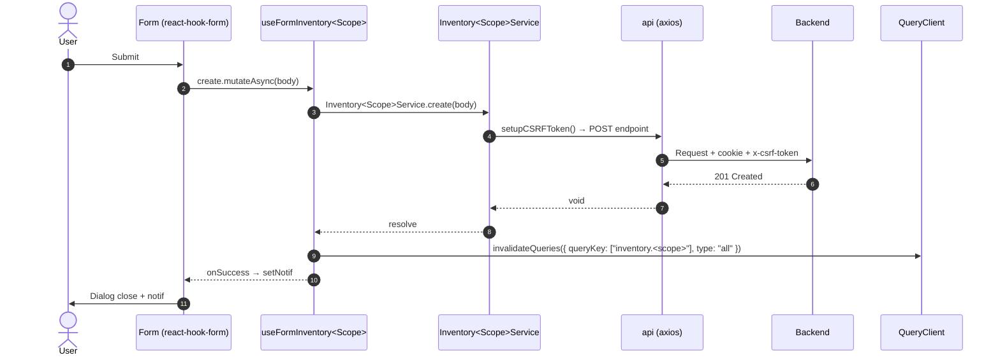

# Inventory — Frontend Integration (Module Level)

**TIPIS by design** — dokumen ini hanya berisi (a) konvensi global yang berlaku se-modul, (b) navigasi ke per-scope FE doc. Untuk implementasi end-to-end satu scope, **baca per-scope file** `<scope>/frontend-integration.md`.

Mengikuti SOP canonical [frontend-dev-flow](../../../.claude/skills/frontend-dev-flow/SKILL.md).

**Backend base path**: `/api/app/inventory`
**Frontend base path**: `app/src/app/(application)/inventory/`
**Component base path**: `app/src/components/pages/inventory/`

> **Status FE**: per 2026-05-19, modul FE `inventory/*` **belum diimplementasikan** di `app/src/app/(application)/`. Setiap per-scope doc menyiapkan rencana lengkap end-to-end (schema verbatim, service code, hooks code, component snippet, Mermaid, testing). BE sudah lengkap untuk seluruh scope.

---

## 1. Path Mirror (Backend ↔ Frontend)

Frontend module path **WAJIB** cermin backend. Diff struktur = sinkronisasi rusak.

| Layer       | Backend                                                                  | Frontend (rencana)                                                                    |
| :---------- | :----------------------------------------------------------------------- | :------------------------------------------------------------------------------------ |
| Module      | `api/src/module/application/inventory/`                                  | `app/src/app/(application)/inventory/`                                                |
| Routes agg  | `api/src/module/application/inventory/inventory.routes.ts`               | _(per-page route — Next.js app router)_                                               |
| FG scope    | `api/src/module/application/inventory/fg/`                               | `app/src/app/(application)/inventory/fg/server/` 🚧 TBD                               |
| FG / Import | `api/src/module/application/inventory/fg/import/`                        | `app/src/app/(application)/inventory/fg/import/server/` 🚧 TBD                        |
| FG / Sizes  | `api/src/module/application/inventory/fg/size/`                          | `app/src/app/(application)/inventory/fg/sizes/server/` 🚧 TBD                         |
| FG / Types  | `api/src/module/application/inventory/fg/type/`                          | `app/src/app/(application)/inventory/fg/types/server/` 🚧 TBD                         |
| RM scope    | `api/src/module/application/inventory/rm/`                               | `app/src/app/(application)/inventory/rm/server/` 🚧 TBD                               |
| RM / Import | `api/src/module/application/inventory/rm/import/`                        | `app/src/app/(application)/inventory/rm/import/server/` 🚧 TBD                        |
| RM / Suppliers | `api/src/module/application/inventory/rm/supplier/`                   | `app/src/app/(application)/inventory/rm/suppliers/server/` 🚧 TBD                     |
| RM / Categories | `api/src/module/application/inventory/rm/category/`                  | `app/src/app/(application)/inventory/rm/categories/server/` 🚧 TBD                    |
| RM / Units      | `api/src/module/application/inventory/rm/unit/`                       | `app/src/app/(application)/inventory/rm/units/server/` 🚧 TBD                         |
| Monitoring / Stock Distribution | `api/src/module/application/inventory/monitoring/stock-distribution/` | `app/src/app/(application)/inventory/monitoring/stock-distribution/server/` 🚧 TBD |
| Components  | —                                                                        | `app/src/components/pages/inventory/<scope>/` 🚧 TBD                                  |
| Page entry  | —                                                                        | `app/src/app/(application)/inventory/<scope>/page.tsx` (Suspense saja) 🚧 TBD          |

**Naming sub-module (dot-chain)**:

- Schema: `inventory.<scope>.schema.ts` (mis. `inventory.fg.schema.ts`, `inventory.fg.import.schema.ts`).
- Service: `inventory.<scope>.service.ts`, class `Inventory<Scope>Service`.
- Hook: `use.inventory.<scope>.ts` (export: `useInventory<Scope>`, `useFormInventory<Scope>`, `useActionInventory<Scope>`, `useInventory<Scope>TableState`, `useInventory<Scope>Query`).
- Folder route Next.js mirror **plural BE** (`sizes`, `types`, `suppliers`, `categories`, `units`).

---

## 2. Konvensi Global Modul `Inventory`

Berlaku untuk **SEMUA** scope di bawah `inventory`. Detail di [frontend-dev-flow](../../../.claude/skills/frontend-dev-flow/SKILL.md) — di sini referensi cepat:

- **API client**: `@/lib/api` (`withCredentials: true`, auto CSRF, auto-handle 401/403). Tidak boleh di-override.
- **CSRF**: `setupCSRFToken()` (= `GET /csrf`) **wajib** sebelum POST/PUT/PATCH/DELETE.
- **Service pattern**: class statis, `try / catch + throw error` di setiap method agar error bubble ke hook layer (`FetchError`).
- **queryKey naming**: `["inventory.<scope>", params]` untuk list, `["inventory.<scope>", id]` untuk detail. Invalidation: `queryClient.invalidateQueries({ queryKey: ["inventory.<scope>"], type: "all" })`.
- **mutationKey**: `["inventory.<scope>", "<verb>"]`.
- **Error handler**: `onError: (err) => FetchError(err, setErr)` di setiap mutation. Sukses: `setNotif({ title, message })`. Jangan handle manual di komponen/service.
- **Status code expectation**: 201 create (POST /, /sizes, /types, /import/preview), 202 async/enqueue (POST /import/execute), 200 read/status/list/update/bulk/clean/export.
- **Debounce**: `useDebounce(search, 500)` untuk semua search input. URL sync via `useQueryParams.batchSet` dari `@/shared/hooks`.
- **Hook split**: WAJIB 5 hook per scope — READ / WRITE / ACTION / TableState / Query-wrapper. Scope read-only (monitoring): WRITE & ACTION boleh `N/A (read-only)` eksplisit, **tidak** dihilangkan diam-diam.
- **Design system**: Gold/Zinc — `bg-primary` (#D4AF37), Plus Jakarta Sans, IBM Plex Mono untuk SKU/kode, `rounded-xl` card, label `uppercase text-[10px] font-extrabold text-muted-foreground`.
- **Thin client**: tidak ada business logic di FE — semua hitung/validasi domain di backend. FE hanya validasi format input via Zod (mirror BE).

---

## 3. Reusable Mermaid — Create flow (template lintas scope)

Untuk flow spesifik per scope (Update / Status / Bulk / Import async / Export), lihat per-scope `frontend-integration.md` §6.

---

## 4. Per-scope FE Docs Index

| Scope                              | BE README                                                                                            | FE Integration (end-to-end)                                                                                  | Status FE |
| :--------------------------------- | :--------------------------------------------------------------------------------------------------- | :----------------------------------------------------------------------------------------------------------- | :-------- |
| `fg`                               | [./fg/README.md](./fg/README.md)                                                                     | [./fg/frontend-integration.md](./fg/frontend-integration.md)                                                 | 🚧 TBD    |
| `fg/import`                        | [./fg/import/README.md](./fg/import/README.md)                                                       | [./fg/import/frontend-integration.md](./fg/import/frontend-integration.md)                                   | 🚧 TBD    |
| `fg/sizes`                         | [./fg/size/README.md](./fg/size/README.md)                                                           | [./fg/size/frontend-integration.md](./fg/size/frontend-integration.md)                                       | 🚧 TBD    |
| `fg/types`                         | [./fg/type/README.md](./fg/type/README.md)                                                           | [./fg/type/frontend-integration.md](./fg/type/frontend-integration.md)                                       | 🚧 TBD    |
| `rm`                               | [./rm/README.md](./rm/README.md)                                                                     | [./rm/frontend-integration.md](./rm/frontend-integration.md)                                                 | 🚧 TBD    |
| `rm/import`                        | [./rm/import/README.md](./rm/import/README.md)                                                       | [./rm/import/frontend-integration.md](./rm/import/frontend-integration.md)                                   | 🚧 TBD    |
| `rm/suppliers`                     | [./rm/supplier/README.md](./rm/supplier/README.md)                                                   | [./rm/supplier/frontend-integration.md](./rm/supplier/frontend-integration.md)                               | 🚧 TBD    |
| `rm/categories`                    | [./rm/category/README.md](./rm/category/README.md)                                                   | [./rm/category/frontend-integration.md](./rm/category/frontend-integration.md)                               | 🚧 TBD    |
| `rm/units`                         | [./rm/unit/README.md](./rm/unit/README.md)                                                           | [./rm/unit/frontend-integration.md](./rm/unit/frontend-integration.md)                                       | 🚧 TBD    |
| `monitoring/stock-distribution`    | [./monitoring/stock-distribution/README.md](./monitoring/stock-distribution/README.md)               | [./monitoring/stock-distribution/frontend-integration.md](./monitoring/stock-distribution/frontend-integration.md) | 🚧 TBD |

---

## 5. Checklist saat menambah scope baru ke modul `Inventory`

1. Generate BE scope README via skill `module-documentation` (`docs/modules/inventory/<new_scope>/README.md`).
2. Generate per-scope `frontend-integration.md` via skill yang sama.
3. Update tabel §1 (path mirror) dan §4 (index) di dokumen ini — **hanya** tambah baris.
4. Update tabel sub-modul di `./README.md` (index modul).
5. Update folder Postman scope di `docs/postman/erp-mandalika.postman_collection.json`.
6. Setelah FE diimplementasi: ubah Status FE di §4 dari `🚧 TBD` → `✅ Ready` + update file path link.

---

## 6. Cross-link

- SOP FE canonical: [frontend-dev-flow](../../../.claude/skills/frontend-dev-flow/SKILL.md)
- SOP FE testing: [frontend-testing](../../../.claude/skills/frontend-testing/SKILL.md)
- SOP BE canonical: [dev-flow](../../../.claude/skills/dev-flow/SKILL.md)
- Module index: [./README.md](./README.md)
- Postman collection: [`docs/postman/erp-mandalika.postman_collection.json`](../../postman/erp-mandalika.postman_collection.json) — folder `Inventory`.
