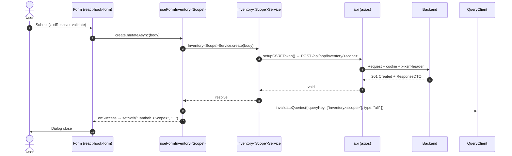
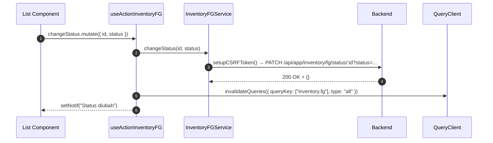
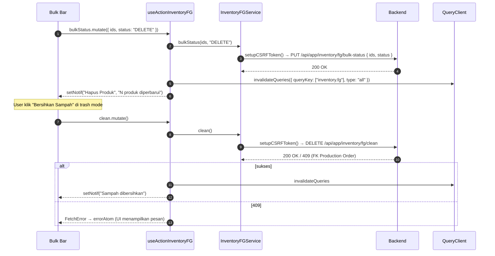
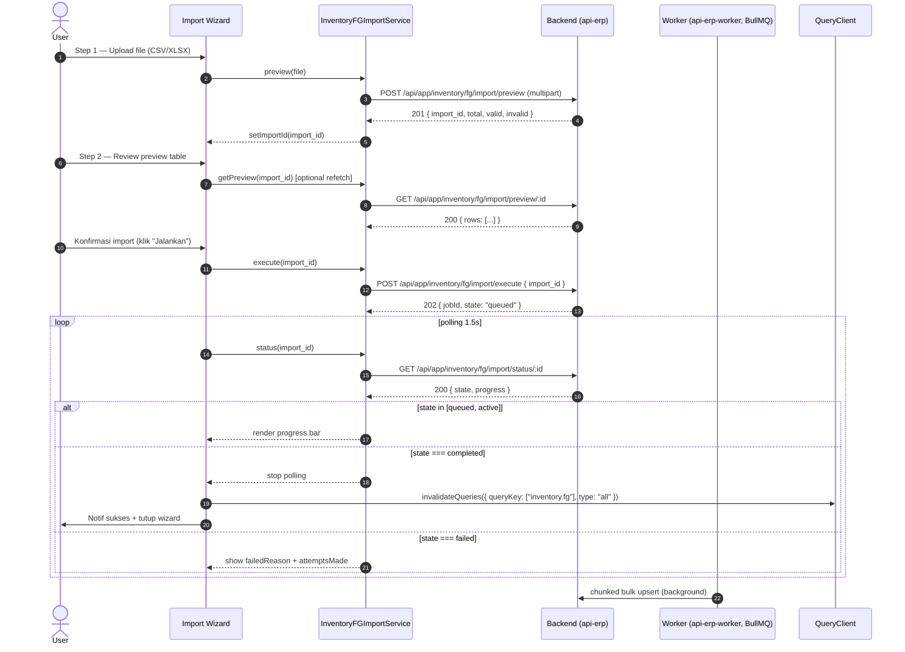
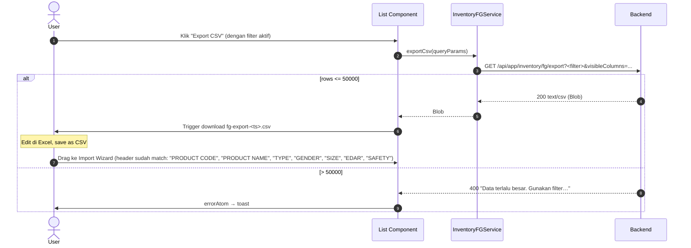

# Inventory — Frontend Integration Flow

Dokumen **level modul** untuk seluruh kontrak FE ↔ BE modul `inventory`. Berlaku untuk sub-modul `fg`, `fg/import`, `fg/sizes`, `fg/types`, `rm`, `rm/import`, `rm/suppliers`, `rm/categories`, dan `rm/units`.

Mengikuti SOP canonical [frontend-dev-flow](../../../../.claude/skills/frontend-dev-flow/SKILL.md) — path mirror BE↔FE, naming dot-chain di sub-module, pemisahan READ/WRITE/ACTION/TableState/Query-wrapper untuk hook.

**Backend base path**: `/api/app/inventory`
**Frontend base path**: `app/src/app/(application)/inventory/`
**Component base path**: `app/src/components/pages/inventory/`

> **Status FE**: per 2026-05-19, modul FE `inventory/*` **belum diimplementasikan** di `app/src/app/(application)/`. Dokumen ini mendefinisikan **rencana** struktur FE yang harus dibangun saat FE mulai. Tandai baris `🚧 TBD` di tabel sampai file dibuat. Konvensi global (§7) tetap berlaku saat implementasi dimulai. BE sudah lengkap untuk FG (+ import/sizes/types) dan RM (+ import/suppliers).

---

## 1. Path Mirror (Backend ↔ Frontend)

| Layer       | Backend                                                                  | Frontend (rencana)                                                                    |
| :---------- | :----------------------------------------------------------------------- | :------------------------------------------------------------------------------------ |
| Module      | `api/src/module/application/inventory/`                                  | `app/src/app/(application)/inventory/`                                                |
| Routes agg  | `api/src/module/application/inventory/inventory.routes.ts`               | _(per-page route — Next.js app router)_                                               |
| FG scope    | `api/src/module/application/inventory/fg/`                               | `app/src/app/(application)/inventory/fg/server/` 🚧 TBD                               |
| FG / Import | `api/src/module/application/inventory/fg/import/`                        | `app/src/app/(application)/inventory/fg/import/server/` 🚧 TBD                        |
| FG / Sizes  | `api/src/module/application/inventory/fg/size/`                          | `app/src/app/(application)/inventory/fg/sizes/server/` 🚧 TBD                         |
| FG / Types  | `api/src/module/application/inventory/fg/type/`                          | `app/src/app/(application)/inventory/fg/types/server/` 🚧 TBD                         |
| RM scope    | `api/src/module/application/inventory/rm/`                               | `app/src/app/(application)/inventory/rm/server/` 🚧 TBD                               |
| RM / Import | `api/src/module/application/inventory/rm/import/`                        | `app/src/app/(application)/inventory/rm/import/server/` 🚧 TBD                        |
| RM / Suppliers | `api/src/module/application/inventory/rm/supplier/`                   | `app/src/app/(application)/inventory/rm/suppliers/server/` 🚧 TBD                     |
| RM / Categories | `api/src/module/application/inventory/rm/category/`                  | `app/src/app/(application)/inventory/rm/categories/server/` 🚧 TBD                    |
| RM / Units     | `api/src/module/application/inventory/rm/unit/`                       | `app/src/app/(application)/inventory/rm/units/server/` 🚧 TBD                         |
| Monitoring scope                | `api/src/module/application/inventory/monitoring/`                              | `app/src/app/(application)/inventory/monitoring/server/` 🚧 TBD                                       |
| Monitoring / Stock Distribution | `api/src/module/application/inventory/monitoring/stock-distribution/`           | `app/src/app/(application)/inventory/monitoring/stock-distribution/server/` 🚧 TBD                    |
| Components  | —                                                                        | `app/src/components/pages/inventory/<scope>/` 🚧 TBD                                  |
| Page entry  | —                                                                        | `app/src/app/(application)/inventory/<scope>/page.tsx` (Suspense saja) 🚧 TBD          |

**Naming sub-module (dot-chain)**:

- Schema: `inventory.fg.schema.ts` (atau `inventory.fg.import.schema.ts` untuk double-nested).
- Service: `inventory.fg.service.ts` (class: `InventoryFGService`).
- Hook: `use.inventory.fg.ts` (export: `useInventoryFG`, `useFormInventoryFG`, `useActionInventoryFG`, `useInventoryFGTableState`, `useInventoryFGQuery`).
- **Catatan**: nama folder route Next.js mirror **plural BE** (`sizes`, `types`) — backend mount `/sizes` & `/types`. Tapi naming dot-chain di file pakai bentuk singular sesuai folder BE (`size`, `type`) — opsional konsensus tim, tandai di PR pertama.

---

## 2. Schema Mirror Registry

> **Aturan SSOT**: FE schema field, enum value, required/optional, default, validation chain WAJIB persis sama dengan BE Zod. Source of truth = backend (`*.schema.ts`). Diff = bug runtime.

| Scope        | BE schema (file + identifier)                                                                                          | FE schema (file + DTO export)                                                                                                                       | Enum sumber                                | Status     | Catatan diff |
| :----------- | :--------------------------------------------------------------------------------------------------------------------- | :-------------------------------------------------------------------------------------------------------------------------------------------------- | :----------------------------------------- | :--------- | :----------- |
| `fg`         | `src/module/application/inventory/fg/fg.schema.ts` → `RequestFGSchema` / `ResponseFGSchema` / `ResponseFGDetailSchema` / `QueryFGSchema` / `BulkStatusFGSchema` / `StatusParamFGSchema` (+ child: `FGStockSchema` / `FGRecipeItemSchema` / `FGWarehouseStockSchema` / `FGOutletStockSchema` / `FGLatestPeriodSchema`) | `app/src/app/(application)/inventory/fg/server/inventory.fg.schema.ts` → `RequestFGDTO` / `ResponseFGDTO` / `ResponseFGDetailDTO` / `QueryFGDTO` / `BulkStatusFGDTO` / `FGStockDTO` / `FGRecipeItemDTO` / `FGWarehouseStockDTO` / `FGOutletStockDTO` / `FGLatestPeriodDTO` | `@/shared/types` (`STATUS`, `GENDER`, `WarehouseType`, `OutletType`) | 🚧 TBD     | FE belum ada. `GET /:id` response = list shape + `recipes[]` (is_active=true, preferred_unit_price nullable) + **`stock: { latest_period, warehouse_stocks[], outlet_stocks[] }`** (objek `stock` selalu ada — null-check cukup di `stock.latest_period`). |
| `fg/import`  | `src/module/application/inventory/fg/import/import.schema.ts` → `FGImportRowSchema` / `RequestExecuteFGImportSchema`     | `app/src/app/(application)/inventory/fg/import/server/inventory.fg.import.schema.ts` → `FGImportRowDTO` / `RequestExecuteFGImportDTO` / `ResponseFGImportDTO` / `ResponseEnqueueFGImportDTO` / `ResponseImportStatusDTO` | `@/shared/types` (`GENDER`, `ImportJobState`) | 🚧 TBD | FE belum ada |
| `fg/sizes`   | `src/module/application/inventory/fg/size/size.schema.ts` → `RequestFGSizeSchema` / `QueryFGSizeSchema` / `ResponseFGSizeSchema` | `app/src/app/(application)/inventory/fg/sizes/server/inventory.fg.size.schema.ts` → `RequestFGSizeDTO` / `QueryFGSizeDTO` / `ResponseFGSizeDTO`     | —                                          | 🚧 TBD     | FE belum ada |
| `fg/types`   | `src/module/application/inventory/fg/type/type.schema.ts` → `RequestFGTypeSchema` / `QueryFGTypeSchema` / `ResponseFGTypeSchema` | `app/src/app/(application)/inventory/fg/types/server/inventory.fg.type.schema.ts` → `RequestFGTypeDTO` / `QueryFGTypeDTO` / `ResponseFGTypeDTO`     | —                                          | 🚧 TBD     | FE belum ada |
| `rm`         | `src/module/application/inventory/rm/rm.schema.ts` → `RequestRMSchema` / `ResponseRMSchema` / `QueryRMSchema` / `BulkStatusRMSchema` / `RequestSupplierMaterialSchema` / `ResponseSupplierMaterialSchema` | `app/src/app/(application)/inventory/rm/server/inventory.rm.schema.ts` → `RequestRMDTO` / `ResponseRMDTO` / `QueryRMDTO` / `BulkStatusRMDTO` / `RequestSupplierMaterialDTO` / `ResponseSupplierMaterialDTO` | `@/shared/types` (`STATUS`, `MaterialType`, `RawMaterialSource`) | 🚧 TBD | FE belum ada. RM `BulkActionEnum` hanya `["ACTIVE","DELETE"]` — beda dengan FG yang pakai full `STATUS`. **Response v2 (breaking)**: tidak ada root `source`/`price`/`min_buy`/`lead_time`/`supplier` — semua data preferred ditarik via `suppliers.find(s => s.is_preferred)`. `RM_SORT_KEYS` 5 nilai (drop `price`). |
| `rm/import`  | `src/module/application/inventory/rm/import/import.schema.ts` → `RMImportRowSchema` / `RequestExecuteRMImportSchema` (+ `RM_IMPORT_HEADERS`) | `app/src/app/(application)/inventory/rm/import/server/inventory.rm.import.schema.ts` → `RMImportPreviewDTO` / `RequestExecuteRMImportDTO` / `ResponseRMImportDTO` / `ResponseEnqueueRMImportDTO` / `ResponseRMImportStatusDTO` / `ImportJobState` | `@/shared/types` (`RawMaterialSource`, `ImportJobState`) | 🚧 TBD | FE belum ada. Header CSV via konstanta `RM_IMPORT_HEADERS` (BARCODE, MATERIAL NAME, CATEGORY, UOM, MOQ, MIN STOCK, LEAD TIME, SUPPLIER, LOCAL/IMPORT, COUNTRY, PRICE). Header export RM **sudah** selaras dengan import. |
| `rm/suppliers` | `src/module/application/inventory/rm/supplier/supplier.schema.ts` → `RequestSupplierSchema` / `QuerySupplierSchema` / `BulkDeleteSupplierSchema` | `app/src/app/(application)/inventory/rm/suppliers/server/inventory.rm.supplier.schema.ts` → `RequestSupplierDTO` / `QuerySupplierDTO` / `BulkDeleteSupplierDTO` / `ResponseSupplierDTO` | `@/shared/types` (`RawMaterialSource`) | 🚧 TBD | FE belum ada. `ResponseSupplierDTO` plain (tidak via Zod). `slug` nullable di BE — mirror sebagai `string \| null`. |
| `rm/categories` | `src/module/application/inventory/rm/category/category.schema.ts` → `RequestRawMatCategorySchema` / `UpdateRawMatCategorySchema` / `ChangeStatusRawMatCategorySchema` / `QueryRawMatCategorySchema` / `ResponseRawMatCategorySchema` | `app/src/app/(application)/inventory/rm/categories/server/inventory.rm.category.schema.ts` → `RequestRawMatCategoryDTO` / `UpdateRawMatCategoryDTO` / `ChangeStatusRawMatCategoryDTO` / `QueryRawMatCategoryDTO` / `ResponseRawMatCategoryDTO` | `@/shared/types` (`STATUS`) | 🚧 TBD | FE belum ada. `UpdateRawMatCategorySchema` pakai `.refine` (minimal 1 field). Default `status = "ACTIVE"` di service (bukan Zod). |
| `rm/units`      | `src/module/application/inventory/rm/unit/unit.schema.ts` → `RequestRawMaterialUnitSchema` / `UpdateRawMaterialUnitSchema` / `QueryRawMaterialUnitSchema` / `ResponseRawMaterialUnitSchema` | `app/src/app/(application)/inventory/rm/units/server/inventory.rm.unit.schema.ts` → `RequestRawMaterialUnitDTO` / `UpdateRawMaterialUnitDTO` / `QueryRawMaterialUnitDTO` / `ResponseRawMaterialUnitDTO` | — | 🚧 TBD | FE belum ada. `UpdateRawMaterialUnitSchema` pakai `.refine` (field `name` wajib). Response **tanpa** timestamp (model belum punya `created_at`/`updated_at`). |
| `monitoring/stock-distribution/fg` | `src/module/application/inventory/monitoring/stock-distribution/fg/fg.schema.ts` → `QueryStockDistributionFGSchema` + interfaces `ResponseStockDistributionFGDTO` / `ResponseStockDistributionLocationDTO` | `app/src/app/(application)/inventory/monitoring/stock-distribution/server/inventory.monitoring.stock-distribution.schema.ts` → `QueryStockDistributionFGDTO` / `ResponseStockDistributionFGDTO` / `ResponseStockDistributionLocationDTO` | `@/shared/types` (`GENDER`) | 🚧 TBD | FE belum ada. Read-only matrix view. `gender` enum diimport dari Prisma `GENDER` (WOMEN/MEN/UNISEX) — bukan literal. `location_stocks` adalah `Record<string, number>` (kolom dinamis per lokasi). |
| `monitoring/stock-distribution/rm` | `src/module/application/inventory/monitoring/stock-distribution/rm/rm.schema.ts` → `QueryStockDistributionRMSchema` + interfaces `ResponseStockDistributionRMDTO` / `ResponseStockDistributionRMLocationDTO` | `app/src/app/(application)/inventory/monitoring/stock-distribution/server/inventory.monitoring.stock-distribution.schema.ts` → `QueryStockDistributionRMDTO` / `ResponseStockDistributionRMDTO` / `ResponseStockDistributionRMLocationDTO` | `@/shared/types` (`MaterialType`) | 🚧 TBD | FE belum ada. Read-only matrix view, warehouse-only (RAW_MATERIAL). `material_type` enum diimport dari Prisma `MaterialType` (FO/PCKG). Tidak ada `total_missing` di RM. |

**Aturan turunan**:

- `Request<X>DTO = z.input<typeof Request<X>Schema>` (input shape, sebelum `.default()`).
- `Response<X>DTO = z.infer<typeof Response<X>Schema>` (output shape, setelah transform / coerce).
- `Query<X>DTO = z.infer<typeof Query<X>Schema>`.
- Tanggal: BE return ISO string → FE schema pakai `z.coerce.date()` agar field `created_at` / `updated_at` / `deleted_at` jadi `Date`.
- Enum: import dari `@/shared/types` — jangan duplikasi literal `"PENDING" | "ACTIVE" | ...`.
- Header import CSV (untuk `fg/import`): konstanta `FG_IMPORT_HEADERS` di-share — FE pakai konstanta yang **persis sama** dengan BE supaya download → edit → re-import konsisten (lihat dev-flow §1.I). Header current: `"PRODUCT CODE"`, `"PRODUCT NAME"`, `TYPE`, `GENDER`, `SIZE`, `EDAR`, `SAFETY`.

---

## 3. Service Registry

Class statis. `setupCSRFToken()` **wajib** sebelum POST/PUT/PATCH/DELETE. Setiap method wrap `try/catch + throw error` agar error bubble ke hook layer (`FetchError`).

| Scope        | Class                     | File (rencana)                                                                              | Endpoint base                              | Methods                                                                                                                                                                                                                              |
| :----------- | :------------------------ | :------------------------------------------------------------------------------------------ | :----------------------------------------- | :----------------------------------------------------------------------------------------------------------------------------------------------------------------------------------------------------------------------------------- |
| `fg`         | `InventoryFGService`      | `app/src/app/(application)/inventory/fg/server/inventory.fg.service.ts` 🚧 TBD              | `/api/app/inventory/fg`                    | `list(params)`, `detail(id)`, `create(body)`, `update(id, body)`, `changeStatus(id, status)`, `bulkStatus(ids, status)`, `clean()`, `exportCsv(params)` (responseType `blob`)                                                            |
| `fg/import`  | `InventoryFGImportService`| `app/src/app/(application)/inventory/fg/import/server/inventory.fg.import.service.ts` 🚧 TBD | `/api/app/inventory/fg/import`             | `preview(file: File)` (multipart), `getPreview(import_id)`, `execute(import_id)`, `status(import_id)`                                                                                                                                |
| `fg/sizes`   | `InventoryFGSizeService`  | `app/src/app/(application)/inventory/fg/sizes/server/inventory.fg.size.service.ts` 🚧 TBD   | `/api/app/inventory/fg/sizes`              | `list(params)`, `create(body)`, `update(id, body)`, `remove(id)`                                                                                                                                                                     |
| `fg/types`   | `InventoryFGTypeService`  | `app/src/app/(application)/inventory/fg/types/server/inventory.fg.type.service.ts` 🚧 TBD   | `/api/app/inventory/fg/types`              | `list(params)`, `create(body)`, `update(id, body)`, `remove(id)`                                                                                                                                                                     |
| `rm`         | `InventoryRMService`      | `app/src/app/(application)/inventory/rm/server/inventory.rm.service.ts` 🚧 TBD              | `/api/app/inventory/rm`                    | `list(params)`, `detail(id)`, `create(body)`, `update(id, body)`, `remove(id)` (soft-delete), `restore(id)`, `bulkStatus(ids, "ACTIVE"\|"DELETE")`, `clean()`, `exportCsv(params)` (responseType `blob`) |
| `rm/import`  | `InventoryRMImportService`| `app/src/app/(application)/inventory/rm/import/server/inventory.rm.import.service.ts` 🚧 TBD | `/api/app/inventory/rm/import`             | `preview(file: File)` (multipart), `getPreview(import_id)`, `execute(import_id)`, `status(import_id)`                                                                                                                                |
| `rm/suppliers` | `InventoryRMSupplierService` | `app/src/app/(application)/inventory/rm/suppliers/server/inventory.rm.supplier.service.ts` 🚧 TBD | `/api/app/inventory/rm/suppliers`     | `list(params)`, `detail(id)`, `create(body)`, `update(id, body)`, `remove(id)` (**hard delete**), `bulkDelete(ids)` (POST `/bulk-delete`)                                                                              |
| `rm/categories` | `InventoryRMCategoryService` | `app/src/app/(application)/inventory/rm/categories/server/inventory.rm.category.service.ts` 🚧 TBD | `/api/app/inventory/rm/categories` | `list(params)`, `detail(id)`, `create(body)`, `update(id, body)` (PUT/PATCH), `changeStatus(id, status)` (PATCH `/:id/status`), `remove(id)` (**hard delete**, 400 jika masih dipakai RM)                              |
| `rm/units`      | `InventoryRMUnitService`     | `app/src/app/(application)/inventory/rm/units/server/inventory.rm.unit.service.ts` 🚧 TBD          | `/api/app/inventory/rm/units`      | `list(params)`, `detail(id)`, `create(body)`, `update(id, body)` (PUT/PATCH), `remove(id)` (**hard delete**, 400 jika masih dipakai RM)                                                                                |
| `monitoring/stock-distribution` | `InventoryMonitoringStockDistributionService` | `app/src/app/(application)/inventory/monitoring/stock-distribution/server/inventory.monitoring.stock-distribution.service.ts` 🚧 TBD | `/api/app/inventory/monitoring/stock-distribution` | `listFG(params)`, `listFGLocations()`, `exportFG(params)` (blob), `listRM(params)`, `listRMLocations()`, `exportRM(params)` (blob). Read-only → tidak ada `setupCSRFToken()`. |

**Pola implementasi** (ringkas — detail di [frontend-dev-flow](../../../../.claude/skills/frontend-dev-flow/SKILL.md) Step 2):

```ts
const API = `${process.env.NEXT_PUBLIC_API}/api/app/inventory/fg`;

export class InventoryFGService {
    static async list(params: QueryFGDTO) {
        try {
            const { data } = await api.get<ApiSuccessResponse<{ len: number; data: Array<ResponseFGDTO> }>>(API, { params });
            return data.data;
        } catch (error) {
            throw error;
        }
    }
    static async create(body: RequestFGDTO) {
        try {
            await setupCSRFToken();
            await api.post(API, body);
        } catch (error) {
            throw error;
        }
    }
    static async changeStatus(id: number, status: (typeof STATUS)[number]) {
        try {
            await setupCSRFToken();
            await api.patch(`${API}/status/${id}`, null, { params: { status } });
        } catch (error) {
            throw error;
        }
    }
    static async bulkStatus(ids: number[], status: (typeof STATUS)[number]) {
        try {
            await setupCSRFToken();
            await api.put(`${API}/bulk-status`, { ids, status });
        } catch (error) {
            throw error;
        }
    }
    static async exportCsv(params: QueryFGDTO): Promise<Blob> {
        try {
            const { data } = await api.get<Blob>(`${API}/export`, { params, responseType: "blob" });
            return data;
        } catch (error) {
            throw error;
        }
    }
    // update, detail, clean — pattern identik
}
```

**Catatan import file (FG / Import)**:

```ts
static async preview(file: File): Promise<ResponseFGImportDTO> {
    try {
        await setupCSRFToken();
        const form = new FormData();
        form.append("file", file);
        const { data } = await api.post<ApiSuccessResponse<ResponseFGImportDTO>>(
            `${API}/preview`,
            form,
            { headers: { "Content-Type": "multipart/form-data" } },
        );
        return data.data;
    } catch (error) {
        throw error;
    }
}
```

---

## 4. Hooks Registry & Responsibility Split

WAJIB pisah lima hook per scope. Campur = SOP `frontend-dev-flow` dilanggar.

| Scope        | READ                     | WRITE                       | ACTION                       | TableState                          | Query-wrapper                |
| :----------- | :----------------------- | :-------------------------- | :--------------------------- | :---------------------------------- | :--------------------------- |
| `fg`         | `useInventoryFG`         | `useFormInventoryFG`        | `useActionInventoryFG`       | `useInventoryFGTableState`          | `useInventoryFGQuery`        |
| `fg/import`  | `useInventoryFGImport` *(status polling — refetchInterval-based)* | `useFormInventoryFGImport` *(preview + execute mutations)* | `useActionInventoryFGImport` *(retry / cancel — placeholder)* | `useInventoryFGImportSessionState` *(import_id state + step)* | `useInventoryFGImportQuery` *(status polling wrapper)* |
| `fg/sizes`   | `useInventoryFGSize`     | `useFormInventoryFGSize`    | `useActionInventoryFGSize` *(delete)* | `useInventoryFGSizeTableState`      | `useInventoryFGSizeQuery`    |
| `fg/types`   | `useInventoryFGType`     | `useFormInventoryFGType`    | `useActionInventoryFGType` *(delete)* | `useInventoryFGTypeTableState`      | `useInventoryFGTypeQuery`    |
| `rm`         | `useInventoryRM`         | `useFormInventoryRM` *(supports `suppliers[]` field-array + legacy single `supplier_id`)* | `useActionInventoryRM` *(soft-delete/restore/bulkStatus ACTIVE\|DELETE/clean)* | `useInventoryRMTableState` *(filter type/category/supplier/unit)* | `useInventoryRMQuery`        |
| `rm/import`  | `useInventoryRMImport` *(status polling — refetchInterval)* | `useFormInventoryRMImport` *(preview + execute mutations)* | `useActionInventoryRMImport` *(retry / cancel — placeholder)* | `useInventoryRMImportSessionState` *(import_id state + step)* | `useInventoryRMImportQuery` |
| `rm/suppliers` | `useInventoryRMSupplier` | `useFormInventoryRMSupplier` | `useActionInventoryRMSupplier` *(delete + bulkDelete)* | `useInventoryRMSupplierTableState` | `useInventoryRMSupplierQuery` |
| `rm/categories` | `useInventoryRMCategory` | `useFormInventoryRMCategory` | `useActionInventoryRMCategory` *(changeStatus + delete)* | `useInventoryRMCategoryTableState` *(filter status)* | `useInventoryRMCategoryQuery` |
| `rm/units`      | `useInventoryRMUnit`     | `useFormInventoryRMUnit`     | `useActionInventoryRMUnit` *(delete)*                  | `useInventoryRMUnitTableState`     | `useInventoryRMUnitQuery`     |
| `monitoring/stock-distribution/fg` | `useInventoryMonitoringStockDistributionFG` *(matrix + locations)* | _N/A (read-only)_ | _N/A_ | `useInventoryMonitoringStockDistributionFGTableState` *(period/filter/sort)* | `useInventoryMonitoringStockDistributionFGQuery` *(list + locations query wrapper, exportCsv mutation)* |
| `monitoring/stock-distribution/rm` | `useInventoryMonitoringStockDistributionRM` *(matrix + locations)* | _N/A (read-only)_ | _N/A_ | `useInventoryMonitoringStockDistributionRMTableState` *(period/filter/sort)* | `useInventoryMonitoringStockDistributionRMQuery` *(list + locations query wrapper, exportCsv mutation)* |

**File**: `app/src/app/(application)/inventory/<scope>/server/use.inventory.<scope>.ts`.

### Konvensi queryKey + invalidation (berlaku se-modul)

| Operasi                                  | queryKey                                          | Trigger invalidation                                                                          |
| :--------------------------------------- | :------------------------------------------------ | :-------------------------------------------------------------------------------------------- |
| List `fg`                                | `["inventory.fg", params]`                        | —                                                                                             |
| Detail `fg`                              | `["inventory.fg", id]`                            | —                                                                                             |
| Create / Update / Status / Bulk / Clean  | mutationKey `["inventory.fg", "<verb>"]`          | `queryClient.invalidateQueries({ queryKey: ["inventory.fg"], type: "all" })`                  |
| List size                                | `["inventory.fg.size", params]`                   | invalidate `["inventory.fg.size"]` setelah mutasi size; **juga** `["inventory.fg"]` (FG list pakai size join). |
| List type                                | `["inventory.fg.type", params]`                   | invalidate `["inventory.fg.type"]` setelah mutasi type; **juga** `["inventory.fg"]`.          |
| Import preview                           | mutationKey `["inventory.fg.import", "preview"]`  | —                                                                                             |
| Import execute                           | mutationKey `["inventory.fg.import", "execute"]`  | —                                                                                             |
| Import status (polling)                  | `["inventory.fg.import.status", import_id]`       | Saat `state === "completed"` → invalidate `["inventory.fg"]`.                                 |
| List `rm`                                | `["inventory.rm", params]`                        | —                                                                                             |
| Detail `rm`                              | `["inventory.rm", id]`                            | —                                                                                             |
| Create / Update / Delete / Restore / Bulk / Clean RM | mutationKey `["inventory.rm", "<verb>"]` | `queryClient.invalidateQueries({ queryKey: ["inventory.rm"], type: "all" })`                  |
| RM import preview                        | mutationKey `["inventory.rm.import", "preview"]`  | —                                                                                             |
| RM import execute                        | mutationKey `["inventory.rm.import", "execute"]`  | —                                                                                             |
| RM import status (polling)               | `["inventory.rm.import.status", import_id]`       | Saat `state === "completed"` → invalidate `["inventory.rm"]`.                                 |
| List `rm/suppliers`                      | `["inventory.rm.supplier", params]`               | —                                                                                             |
| Mutasi `rm/suppliers`                    | mutationKey `["inventory.rm.supplier", "<verb>"]` | invalidate `["inventory.rm.supplier"]` **dan** `["inventory.rm"]` (RM list menampilkan nama supplier preferred). |
| List `rm/categories`                     | `["inventory.rm.category", params]`               | —                                                                                             |
| Mutasi `rm/categories`                   | mutationKey `["inventory.rm.category", "<verb>"]` | invalidate `["inventory.rm.category"]` **dan** `["inventory.rm"]` (RM list/detail menampilkan nama kategori). |
| List `rm/units`                          | `["inventory.rm.unit", params]`                   | —                                                                                             |
| Mutasi `rm/units`                        | mutationKey `["inventory.rm.unit", "<verb>"]`     | invalidate `["inventory.rm.unit"]` **dan** `["inventory.rm"]` (RM list/detail menampilkan unit). |

### Pola READ + polling (FG / Import)

```ts
export function useInventoryFGImport(import_id?: string) {
    const status = useQuery({
        queryKey: ["inventory.fg.import.status", import_id],
        queryFn: () => InventoryFGImportService.status(import_id!),
        enabled: !!import_id,
        refetchInterval: (q) => {
            const data = q.state.data;
            if (!data) return 1500;
            if (data.state === "completed" || data.state === "failed") return false;
            return 1500;
        },
    });
    return { status: status.data, isLoading: status.isLoading, isError: status.isError };
}
```

### Pola WRITE (FG create)

```ts
export function useFormInventoryFG() {
    const setErr = useSetAtom(errorAtom);
    const setNotif = useSetAtom(notificationAtom);
    const queryClient = useQueryClient();

    const create = useMutation<unknown, ResponseError, RequestFGDTO>({
        mutationKey: ["inventory.fg", "create"],
        mutationFn: (body) => InventoryFGService.create(body),
        onSuccess: () => {
            setNotif({ title: "Tambah FG", message: "Berhasil menambahkan produk jadi" });
            queryClient.invalidateQueries({ queryKey: ["inventory.fg"], type: "all" });
        },
        onError: (err) => FetchError(err, setErr),
    });
    // update — mutationFn: ({ id, body }) => InventoryFGService.update(id, body)
    return { create, update };
}
```

### Pola ACTION (FG bulkStatus + clean)

```ts
export function useActionInventoryFG() {
    const setErr = useSetAtom(errorAtom);
    const setNotif = useSetAtom(notificationAtom);
    const queryClient = useQueryClient();

    const changeStatus = useMutation({
        mutationKey: ["inventory.fg", "changeStatus"],
        mutationFn: ({ id, status }: { id: number; status: (typeof STATUS)[number] }) =>
            InventoryFGService.changeStatus(id, status),
        onSuccess: () => {
            setNotif({ title: "Ubah Status", message: "Status produk diubah" });
            queryClient.invalidateQueries({ queryKey: ["inventory.fg"], type: "all" });
        },
        onError: (err) => FetchError(err, setErr),
    });

    const bulkStatus = useMutation({
        mutationKey: ["inventory.fg", "bulkStatus"],
        mutationFn: ({ ids, status }: { ids: number[]; status: (typeof STATUS)[number] }) =>
            InventoryFGService.bulkStatus(ids, status),
        onSuccess: (_, { ids, status }) => {
            setNotif({
                title: status === "DELETE" ? "Hapus Produk" : "Restore Produk",
                message: `${ids.length} produk diperbarui`,
            });
            queryClient.invalidateQueries({ queryKey: ["inventory.fg"], type: "all" });
        },
        onError: (err) => FetchError(err, setErr),
    });

    const clean = useMutation({
        mutationKey: ["inventory.fg", "clean"],
        mutationFn: () => InventoryFGService.clean(),
        onSuccess: () => {
            setNotif({ title: "Bersihkan Trash", message: "Produk terhapus permanen" });
            queryClient.invalidateQueries({ queryKey: ["inventory.fg"], type: "all" });
        },
        onError: (err) => FetchError(err, setErr),
    });

    return { changeStatus, bulkStatus, clean };
}
```

### Pola TableState (FG)

Wajib pakai `useDebounce(search, 500)` + `useQueryParams.batchSet` dari `@/shared/hooks` — sync filter/sort/search ke URL. Lihat [frontend-dev-flow Step 3](../../../../.claude/skills/frontend-dev-flow/SKILL.md).

```ts
export function useInventoryFGTableState() {
    const { get, batchSet, searchParams } = useQueryParams();
    const [search, setSearch] = useState(get("search") ?? "");
    const debouncedSearch = useDebounce(search, 500);
    useEffect(() => { batchSet({ search: debouncedSearch || undefined, page: "1" }); }, [debouncedSearch]);

    const sortBy = get("sortBy") ?? "updated_at";
    const sortOrder = (get("sortOrder") as "asc" | "desc") ?? "desc";
    const status = get("status") as QueryFGDTO["status"];
    const gender = get("gender") as QueryFGDTO["gender"];
    const type_id = get("type_id") ? Number(get("type_id")) : undefined;
    const size_id = get("size_id") ? Number(get("size_id")) : undefined;

    const isTrashMode = status === "DELETE";
    const toggleTrashMode = () => batchSet({ status: isTrashMode ? undefined : "DELETE", page: "1" });

    const queryParams = useMemo<QueryFGDTO>(() => ({
        page: Number(get("page") ?? 1),
        take: Number(get("take") ?? 25),
        search: get("search") ?? undefined,
        sortBy: sortBy as QueryFGDTO["sortBy"],
        sortOrder,
        status,
        gender,
        type_id,
        size_id,
    }), [searchParams]);

    return { search, setSearch, sortBy, sortOrder, isTrashMode, toggleTrashMode, queryParams, /* setPage, setPageSize, onSort, resetFilters */ };
}
```

---

## 5. Component Map

| Scope        | List (`index.tsx`)                                                  | Form `create` / `edit`                                                                    | Dialog wrapper                                                                | Columns                                                          | Detail (opsional)                                  |
| :----------- | :------------------------------------------------------------------ | :---------------------------------------------------------------------------------------- | :---------------------------------------------------------------------------- | :--------------------------------------------------------------- | :------------------------------------------------- |
| `fg`         | `components/pages/inventory/fg/index.tsx` 🚧 TBD                    | `components/pages/inventory/fg/form/{create,edit}.tsx` 🚧 TBD                              | `components/pages/inventory/fg/form/fg-form-dialog.tsx` 🚧 TBD                | `components/pages/inventory/fg/table/columns.tsx` 🚧 TBD         | `components/pages/inventory/fg/detail.tsx` 🚧 TBD  |
| `fg/import`  | `components/pages/inventory/fg/import/index.tsx` 🚧 TBD *(wizard 3 step)* | `components/pages/inventory/fg/import/form/upload.tsx` 🚧 TBD *(dropzone)*                  | `components/pages/inventory/fg/import/dialog.tsx` 🚧 TBD *(wizard wrapper)*    | `components/pages/inventory/fg/import/table/preview-columns.tsx` 🚧 TBD | —                                            |
| `fg/sizes`   | `components/pages/inventory/fg/sizes/index.tsx` 🚧 TBD              | `components/pages/inventory/fg/sizes/form/{create,edit}.tsx` 🚧 TBD                        | `components/pages/inventory/fg/sizes/form/size-form-dialog.tsx` 🚧 TBD        | `components/pages/inventory/fg/sizes/table/columns.tsx` 🚧 TBD   | —                                                  |
| `fg/types`   | `components/pages/inventory/fg/types/index.tsx` 🚧 TBD              | `components/pages/inventory/fg/types/form/{create,edit}.tsx` 🚧 TBD                        | `components/pages/inventory/fg/types/form/type-form-dialog.tsx` 🚧 TBD        | `components/pages/inventory/fg/types/table/columns.tsx` 🚧 TBD   | —                                                  |
| `rm`         | `components/pages/inventory/rm/index.tsx` 🚧 TBD                    | `components/pages/inventory/rm/form/{create,edit}.tsx` 🚧 TBD *(suppliers field-array + nested form)* | `components/pages/inventory/rm/form/rm-form-dialog.tsx` 🚧 TBD                | `components/pages/inventory/rm/table/columns.tsx` 🚧 TBD         | `components/pages/inventory/rm/detail.tsx` 🚧 TBD  |
| `rm/import`  | `components/pages/inventory/rm/import/index.tsx` 🚧 TBD *(wizard 3 step)* | `components/pages/inventory/rm/import/form/upload.tsx` 🚧 TBD *(dropzone)*                  | `components/pages/inventory/rm/import/dialog.tsx` 🚧 TBD *(wizard wrapper)*    | `components/pages/inventory/rm/import/table/preview-columns.tsx` 🚧 TBD | —                                            |
| `rm/suppliers` | `components/pages/inventory/rm/suppliers/index.tsx` 🚧 TBD        | `components/pages/inventory/rm/suppliers/form/{create,edit}.tsx` 🚧 TBD                    | `components/pages/inventory/rm/suppliers/form/supplier-form-dialog.tsx` 🚧 TBD | `components/pages/inventory/rm/suppliers/table/columns.tsx` 🚧 TBD | —                                                  |
| `rm/categories` | `components/pages/inventory/rm/categories/index.tsx` 🚧 TBD      | `components/pages/inventory/rm/categories/form/{create,edit}.tsx` 🚧 TBD                   | `components/pages/inventory/rm/categories/form/category-form-dialog.tsx` 🚧 TBD | `components/pages/inventory/rm/categories/table/columns.tsx` 🚧 TBD | —                                                  |
| `rm/units`      | `components/pages/inventory/rm/units/index.tsx` 🚧 TBD            | `components/pages/inventory/rm/units/form/{create,edit}.tsx` 🚧 TBD                        | `components/pages/inventory/rm/units/form/unit-form-dialog.tsx` 🚧 TBD          | `components/pages/inventory/rm/units/table/columns.tsx` 🚧 TBD     | —                                                  |
| `monitoring/stock-distribution/fg` | `components/pages/inventory/monitoring/stock-distribution/fg/index.tsx` 🚧 TBD *(matrix view)* | _N/A (read-only)_ | _N/A_ | `components/pages/inventory/monitoring/stock-distribution/fg/table/columns.tsx` 🚧 TBD *(static + dynamic location columns)* | —                                                  |
| `monitoring/stock-distribution/rm` | `components/pages/inventory/monitoring/stock-distribution/rm/index.tsx` 🚧 TBD *(matrix view)* | _N/A (read-only)_ | _N/A_ | `components/pages/inventory/monitoring/stock-distribution/rm/table/columns.tsx` 🚧 TBD *(static + dynamic warehouse columns)* | —                                                  |

**Aturan komponen** (lihat detail di [frontend-dev-flow Step 6-8](../../../../.claude/skills/frontend-dev-flow/SKILL.md)):

- Form **WAJIB** wrap `<Form methods={form}>` dari `@/components/ui/form/main.tsx`.
- Field: `<InputForm>`, `<SelectForm>` (gender, status), `<EnhancedCreatableCombobox>` (product_type — kirim string, BE upsert slug), `<TextAreaForm>` (description), `<MultiSelectForm>` (bulk), `<DatePicker>` _(jika perlu)_.
- Resolver: `zodResolver(RequestFGSchema)` / `zodResolver(RequestFGSizeSchema)` / `zodResolver(RequestFGTypeSchema)`.
- List: `DataTable` (`@/components/ui/`), `enableMultiSelect`, `tableId="fg-table"`, pagination via `useInventoryFGTableState`.
- Page entry (`app/(application)/inventory/<scope>/page.tsx`): **hanya** `<Suspense fallback={...}><ScopeList /></Suspense>`.
- **Import wizard**: 3 step — Upload → Preview Table (row valid/invalid) → Progress (status polling).
- **Size combobox**: integer-only, `<InputForm type="number" />` dengan label "Ukuran (ML)". Satuan "ML" di-suffix display, tidak masuk body.
- **Bulk bar**: trash mode → tombol "Restore" (variant primary) + "Bersihkan Sampah" (variant destructive, panggil `clean`). Normal mode → "Hapus" (variant destructive — `bulkStatus({ status: "DELETE" })`).
- **Reset filter**: tampil hanya saat ada filter aktif (`search`, `status`, `gender`, `type_id`, `size_id`).
- **Stock distribution (matrix view)**: kolom statis pertama (SKU/Nama untuk FG; Nama/Kategori untuk RM) → diikuti kolom dinamis dari `listLocations()`. Pakai `DataTable` dengan column generator: ambil hasil locations query, map jadi `ColumnDef` per location dengan accessor `row.original.location_stocks[name] ?? 0`. **Tidak ada form/dialog/bulk** — read-only. Filter bar: period (`month`/`year` MonthYearPicker) + search + type/category + gender/material_type + tombol Export CSV (panggil `exportCsv` mutation → `URL.createObjectURL(blob)`).

---

## 6. End-to-End Flow per CRUD (reusable lintas scope)

### Create flow (FG, Size, Type)



### Status (single) flow



### Bulk action flow (FG bulk-status + clean)



### Async import (BullMQ) wizard flow



### Export CSV (round-trip dengan Import)



> **Header round-trip**: export CSV memakai header `Kode`, `Nama Produk`, `Tipe`, `Size`, `Gender`, `Distribusi %`, `Safety %`, `Status`, `Lead Time`, `Nilai Z` (dari `fg.service.ts` saat ini). Untuk **konsistensi import**, FE wajib me-rename kolom yang relevan menjadi `PRODUCT CODE`, `PRODUCT NAME`, `TYPE`, `GENDER`, `SIZE`, `EDAR`, `SAFETY` sebelum re-import — atau BE memerlukan migration untuk sinkron headernya. **Tracked**: lihat dev-flow §1.I — header export ↔ import harus dirapikan ke single source of truth. <!-- verify dengan tim BE saat FE start -->

---

## 7. Konvensi Global Modul `Inventory`

Berlaku untuk semua scope. **Detail di** [frontend-dev-flow](../../../../.claude/skills/frontend-dev-flow/SKILL.md) — di sini cuma referensi cepat:

- **API client**: `@/lib/api` (`withCredentials: true`, auto CSRF interceptor, auto-handle 401/403). Jangan di-override.
- **CSRF**: `setupCSRFToken()` (= `GET /csrf`) **wajib** sebelum POST/PUT/PATCH/DELETE.
- **Error**: `onError: (err) => FetchError(err, setErr)` di setiap mutation. Sukses: `setNotif({ title, message })`. Tidak handle manual di komponen/service.
- **Status code expectation** (sesuaikan dengan dev-flow §1.G):

  | Operasi                                         | Status code yang diharapkan |
  | :---------------------------------------------- | :-------------------------- |
  | Create (POST /, POST /sizes, POST /types)       | **201**                     |
  | Import preview (POST /import/preview)           | **201**                     |
  | Import execute (POST /import/execute)           | **202** (BullMQ enqueue)    |
  | Read (GET /, GET /:id, GET /status/:id, dll)    | **200**                     |
  | Update (PUT /:id, PUT /bulk-status)             | **200**                     |
  | Status change (PATCH /status/:id)               | **200**                     |
  | Delete master (DELETE /sizes/:id, /types/:id)   | **200**                     |
  | Permanent delete (DELETE /clean)                | **200**                     |
  | Export CSV (GET /export)                        | **200** (`text/csv`)        |

- **Debounce search**: `useDebounce(search, 500)` + `useQueryParams.batchSet({ search, page: "1" })` dari `@/shared/hooks`.
- **Design system**: Gold/Zinc — `bg-primary` (#D4AF37), Plus Jakarta Sans, IBM Plex Mono untuk SKU/kode produk, `rounded-xl` card, label `uppercase text-[10px] font-extrabold text-muted-foreground`. Table header `text-[9px] uppercase`, sticky, Slate 50 bg.
- **Thin client**: semua hitungan domain (safety stock, distribution percentage interpretation, dst.) di backend. FE cuma render + collect input.
- **Master combobox**: `product_type` dan `size` pakai `<EnhancedCreatableCombobox>` — user boleh ketik nama baru, BE auto-upsert lewat `getOrCreateSlug` / `getOrCreateSize`. **Jangan** load master endpoint untuk validasi exists — BE handle.

---

## 8. Checklist saat menambah scope `<new_scope>` ke modul `inventory`

- [ ] Buat folder `app/src/app/(application)/inventory/<new_scope>/server/`.
- [ ] Tulis `inventory.<new_scope>.schema.ts` mirror BE Zod (lihat §2). DTO export via `z.input` / `z.infer`. Tanggal pakai `z.coerce.date()`. Enum import dari `@/shared/types`.
- [ ] Tulis `inventory.<new_scope>.service.ts` (static class `Inventory<Scope>Service`, `setupCSRFToken`, try/catch + throw, `API` constant).
- [ ] Tulis `use.inventory.<new_scope>.ts` — **5 hook** lengkap (READ/WRITE/ACTION/TableState/Query-wrapper).
- [ ] Buat folder komponen `app/src/components/pages/inventory/<new_scope>/` (`index.tsx`, `form/`, `table/columns.tsx`, `detail.tsx`).
- [ ] Buat `page.tsx` (Suspense saja) di `(application)/inventory/<new_scope>/`.
- [ ] **Update dokumen ini**: tambah baris di tabel §1 (path mirror), §2 (schema mirror), §3 (service registry), §4 (hooks registry), §5 (component map). Ubah status `🚧 TBD` → `✅ Ready`.
- [ ] Cek queryKey baru cocok dengan konvensi `["inventory.<scope>", ...]`.
- [ ] Verifikasi schema FE diff vs BE = empty (field, enum, default, validation chain).
- [ ] Update scope README di `api/docs/modules/inventory/<new_scope>/README.md` (lewat skill `module-documentation`).

---

## 9. Cross-link

- SOP FE canonical: [frontend-dev-flow](../../../../.claude/skills/frontend-dev-flow/SKILL.md)
- SOP BE canonical: [dev-flow](../../../../.claude/skills/dev-flow/SKILL.md)
- Module index: [./README.md](./README.md)
- Scope docs:
    - [./fg/README.md](./fg/README.md) — FG inti (CRUD, bulk, export)
    - [./fg/import/README.md](./fg/import/README.md) — bulk import via BullMQ
    - [./fg/size/README.md](./fg/size/README.md) — master `product_size`
    - [./fg/type/README.md](./fg/type/README.md) — master `product_types`
    - [./rm/README.md](./rm/README.md) — RM inti (CRUD multi-supplier, bulk, export)
    - [./rm/import/README.md](./rm/import/README.md) — RM bulk import via BullMQ
    - [./rm/supplier/README.md](./rm/supplier/README.md) — master `Supplier`
    - [./rm/category/README.md](./rm/category/README.md) — master `RawMatCategories`
    - [./rm/unit/README.md](./rm/unit/README.md) — master `UnitRawMaterial`
- Postman collection: [`docs/postman/erp-mandalika.postman_collection.json`](../../postman/erp-mandalika.postman_collection.json) — folder `Inventory`.
- Arsitektur global: [ARCHITECTURE.md](../../ARCHITECTURE.md)
- Auth & session: [AUTH.md](../../AUTH.md)
- Error format: [ERROR_HANDLING.md](../../ERROR_HANDLING.md)
