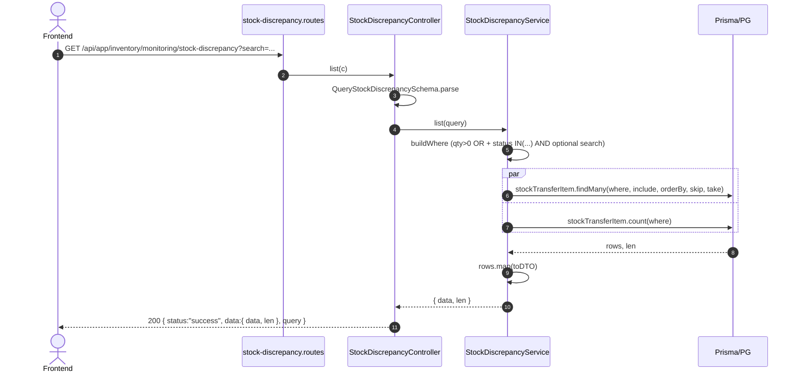

# Module: Inventory / Monitoring / Stock Discrepancy (Audit Selisih Transfer)

**Base path**: `/api/app/inventory/monitoring/stock-discrepancy`
**Source**: `src/module/application/inventory/monitoring/stock-discrepancy/`
**Tests**: `src/tests/inventory/monitoring/stock-discrepancy/`
**Prisma models**: `StockTransferItem` (+ relasi `Product`, `StockTransfer`, `Warehouse`, `Outlet`)

Audit selisih (discrepancy) hasil stock transfer — daftar item transfer yang punya `quantity_missing > 0` atau `quantity_rejected > 0`. Read-only — data terisi otomatis saat operator transfer melakukan unpacking/QC dan menulis nilai missing/rejected ke `stock_transfer_items`.

> **Catatan khusus**:
> - **Scope hanya transfer "selesai"**: filter status hard-coded ke `COMPLETED`, `PARTIAL`, `MISSING`, `REJECTED`. Transfer di status `PENDING/PACKING/IN_TRANSIT` tidak muncul karena nilai missing/rejected belum final.
> - **ORM-first** (Prisma): `findMany` + `count` + nested `include`. Tidak ada raw SQL.
> - **Export cap**: 5.000 baris (discrepancy jarang terjadi; cap kecil cukup). `count()` di-jalankan sebelum fetch — exceed → 400.

---

## 1. Scope & Fitur (PRD ringkas)

| Fitur                                  | Endpoint                                                   | Catatan                                                                                                       |
| :------------------------------------- | :--------------------------------------------------------- | :------------------------------------------------------------------------------------------------------------ |
| List item transfer dengan discrepancy  | `GET /`                                                    | Filter `search` (transfer_number / product name/code). Status transfer fixed (COMPLETED/PARTIAL/MISSING/REJECTED). |
| Export CSV                             | `GET /export`                                              | RFC 4180 + UTF-8 BOM + CRLF. Cap `EXPORT_MAX_ROWS = 5_000`; lebih → 400.                                       |

### Out of scope (tidak dihandle di sini)

- **Memutasi nilai missing/rejected** — itu dilakukan di flow Stock Transfer (unpacking + QC). Lihat `stock-transfer` service.
- **Discrepancy raw material** — sementara hanya untuk produk (FG). RM transfer-missing bisa ditambah saat kebutuhan muncul (kolom `raw_material_id` sudah ada di `stock_transfer_items`).
- **Discrepancy POS sale / return** — beda domain. Stock movement audit lihat `inventory/monitoring/stock-movement`.
- **Resolution workflow** (approve/reject discrepancy claim) — bila nanti dibutuhkan, ditambah di modul tersendiri (mis. `inventory/discrepancy-claim`).

---

## 2. Arsitektur & Flow

### 2.1 Layer map

```text
┌──────────────── stock-discrepancy.routes.ts ──────────────────┐
│ Hono router: GET /export → controller.export                  │
│              GET /       → controller.list                    │
└──────────────────────────────┬────────────────────────────────┘
                               ▼
            StockDiscrepancyController
            ┌──────────────────────────────────────┐
            │ list(c):                             │
            │  - parse Query schema                │
            │  - delegate service.list             │
            │  - ApiResponse.sendSuccess(200, q)   │
            │ export(c):                           │
            │  - parse Query schema                │
            │  - delegate service.export           │
            │  - empty → 200 JSON message          │
            │  - else → enrich (_no, _route)       │
            │         + buildCsv + Response(CSV)   │
            └────────────────┬─────────────────────┘
                             ▼
            StockDiscrepancyService
            ┌──────────────────────────────────────┐
            │ list(q):                             │
            │  buildWhere (AND of qty>0 + status   │
            │              + optional search)      │
            │  Promise.all([findMany, count])      │
            │  rows.map(toDTO)                     │
            │ export(q):                           │
            │  buildWhere                          │
            │  count > 5000 → throw 400            │
            │  findMany + map(toDTO)               │
            └────────────────┬─────────────────────┘
                             ▼
                    Prisma → PostgreSQL
                  (stock_transfer_items + JOIN)
```

### 2.2 Mermaid: List flow



### 2.3 Mermaid: Export flow

```mermaid
sequenceDiagram
    autonumber
    actor FE as Frontend
    participant R as stock-discrepancy.routes
    participant C as StockDiscrepancyController
    participant S as StockDiscrepancyService
    participant DB as Prisma/PG

    FE->>R: GET /api/app/inventory/monitoring/stock-discrepancy/export?...
    R->>C: export(c)
    C->>C: QueryStockDiscrepancySchema.parse
    C->>S: export(query)
    S->>S: buildWhere
    S->>DB: stockTransferItem.count(where)
    DB-->>S: total
    alt total > 5_000
        S--xC: throw ApiError(400, "Hasil melebihi batas export...")
        C-->>FE: 400 { status:"error", message }
    else
        S->>DB: findMany(take=5_000, include)
        DB-->>S: rows
        S->>S: rows.map(toDTO)
        S-->>C: ResponseStockDiscrepancyDTO[]
        alt rows empty
            C-->>FE: 200 { data:{ message:"Tidak ada data untuk di-export" } }
        else
            C->>C: enrich (_no, _route) + buildCsv
            C-->>FE: 200 text/csv; Content-Disposition: attachment
        end
    end
```

---

## 3. DTO / Schemas (end-to-end SSOT)

Sumber: [`src/module/application/inventory/monitoring/stock-discrepancy/stock-discrepancy.schema.ts`](../../../../../src/module/application/inventory/monitoring/stock-discrepancy/stock-discrepancy.schema.ts).

### 3.1 `QueryStockDiscrepancySchema`

```ts
import { z } from "zod";

export const QueryStockDiscrepancySchema = z.object({
    page:   z.coerce.number().int().positive().default(1).optional(),
    take:   z.coerce.number().int().positive().max(100).default(25).optional(),
    /** Cari berdasarkan transfer_number, product.name, atau product.code */
    search: z.string().trim().min(1).optional(),
});

export type QueryStockDiscrepancyDTO = z.infer<typeof QueryStockDiscrepancySchema>;
```

| Field    | Type     | Required | Default | Constraint    | Error msg     | Catatan                                                            |
| :------- | :------- | :------- | :------ | :------------ | :------------ | :----------------------------------------------------------------- |
| `page`   | `number` | No       | `1`     | `int >= 1`    | (Zod default) | Coerce dari string query                                            |
| `take`   | `number` | No       | `25`    | `int 1..100`  | (Zod default) | Cap 100 (discrepancy jarang, page kecil cukup)                     |
| `search` | `string` | No       | —       | `trim, min 1` | (Zod default) | ILIKE `%search%` ke `transfer.transfer_number` + `product.name/code` |

### 3.2 `ResponseStockDiscrepancyDTO`

```ts
export interface ResponseStockDiscrepancyDTO {
    id:                 number;
    transfer_id:        number;
    transfer_number:    string;
    transfer_date:      Date;
    from_location:      string | null;
    to_location:        string | null;
    product_id:         number | null;
    product_code:       string | null;
    product_name:       string | null;
    quantity_requested: number;
    quantity_missing:   number;
    quantity_rejected:  number;
    notes:              string | null;
}
```

| Field                | Source (Prisma include)                                  | Catatan                                                                       |
| :------------------- | :-------------------------------------------------------- | :---------------------------------------------------------------------------- |
| `id`                 | `stock_transfer_items.id`                                 | PK row item                                                                    |
| `transfer_id`        | `stock_transfer_items.transfer_id`                        | FK ke `stock_transfers`                                                        |
| `transfer_number`    | `transfer.transfer_number`                                | Format `TRF-YYYYMM-NNNN`                                                       |
| `transfer_date`      | `transfer.created_at`                                     | Timestamp transfer dibuat                                                      |
| `from_location`      | `transfer.from_warehouse?.name`                           | Sumber transfer (selalu warehouse di flow saat ini)                            |
| `to_location`        | `transfer.to_outlet?.name ?? transfer.to_warehouse?.name` | Tujuan transfer — outlet (DO) atau warehouse (TG)                              |
| `product_id`         | `product?.id`                                             | FK ke `products`. Null kalau item RM (belum di-scope)                          |
| `product_code`       | `product?.code`                                           | SKU                                                                            |
| `product_name`       | `product?.name`                                           | Nama produk                                                                    |
| `quantity_requested` | `stock_transfer_items.quantity_requested`                 | Decimal → number                                                               |
| `quantity_missing`   | `stock_transfer_items.quantity_missing ?? 0`              | Decimal → number; default 0 bila null                                          |
| `quantity_rejected`  | `stock_transfer_items.quantity_rejected ?? 0`             | Decimal → number; default 0 bila null                                          |
| `notes`              | `stock_transfer_items.notes`                              | Catatan dari operator (alasan missing/rejected)                                |

### 3.3 Enum referensi (Prisma)

```prisma
enum TransferStatus {
    PENDING  PACKING  IN_TRANSIT
    COMPLETED  PARTIAL  MISSING  REJECTED
    CANCELLED
}
```

Service hard-code filter ke `COMPLETED | PARTIAL | MISSING | REJECTED` (lihat konstanta `DISCREPANCY_TRANSFER_STATUSES` di service).

---

## 4. Routing untuk integrasi Frontend

Base URL: `/api/app/inventory/monitoring/stock-discrepancy`.

| #   | Method | Path        | Query type                  | Response status code | Error utama                                                            |
| :-- | :----- | :---------- | :-------------------------- | :------------------- | :--------------------------------------------------------------------- |
| 1   | `GET`  | `/`         | `QueryStockDiscrepancyDTO`  | `200`                | `400` validasi Zod (take > 100, page negatif)                          |
| 2   | `GET`  | `/export`   | `QueryStockDiscrepancyDTO`  | `200` (CSV body)     | `400` validasi Zod / hasil > 5.000 baris                               |

### 4.1 Response wrapper

```jsonc
{
  "status":  "success",
  "data":    { "data": [/* ResponseStockDiscrepancyDTO[] */], "len": 42 },
  "query":   { /* echo of parsed query */ },
  "message": null
}
```

`/export` data kosong → 200 JSON `{ data: { message: "Tidak ada data untuk di-export" } }`. Ada data → 200 + `Content-Type: text/csv; charset=utf-8` + `Content-Disposition: attachment; filename="stock-discrepancy-audit-YYYY-MM-DD.csv"`.

### 4.2 TanStack Query

Konvensi global (queryKey, mutationKey, error handling) di [../../frontend-integration.md §2](../../frontend-integration.md). Per-scope wiring di [./frontend-integration.md](./frontend-integration.md).

### 4.3 Header & auth

- `Cookie: session={{session_id}}` (wajib)
- GET-only, tidak butuh `x-xsrf-header`

---

## 5. Database / Indexes

```prisma
model StockTransferItem {
  id                 Int           @id @default(autoincrement())
  transfer_id        Int
  product_id         Int?
  raw_material_id    Int?
  quantity_requested Decimal       @db.Decimal(18, 2)
  quantity_packed    Decimal?      @db.Decimal(18, 2)
  quantity_received  Decimal?      @db.Decimal(18, 2)
  quantity_fulfilled Decimal?      @db.Decimal(18, 2)
  quantity_missing   Decimal?      @db.Decimal(18, 2)
  quantity_rejected  Decimal?      @db.Decimal(18, 2)
  notes              String?
  product            Product?      @relation(fields: [product_id], references: [id])
  raw_material       RawMaterial?  @relation(fields: [raw_material_id], references: [id])
  transfer           StockTransfer @relation(fields: [transfer_id], references: [id], onDelete: Cascade)

  @@index([transfer_id])
  @@index([product_id])
  @@map("stock_transfer_items")
}
```

### 5.1 Index relevan untuk service ini

| Index            | Dipakai oleh                                       |
| :--------------- | :------------------------------------------------- |
| `(transfer_id)`  | Nested filter `transfer.status` (via JOIN)         |
| `(product_id)`   | Nested filter `product.name/code`                  |

> Filter `quantity_missing > 0 OR quantity_rejected > 0` saat ini full-scan kolom decimal. Karena dataset stock_transfer_items biasanya tidak masif (puluhan-ribuan per bulan), index khusus belum perlu. Pertimbangkan partial index `WHERE quantity_missing > 0 OR quantity_rejected > 0` bila volume melonjak.

### 5.2 Migrasi khusus

Tidak ada migrasi index dedicated untuk modul ini. Index existing dari migrasi modul stock-transfer sudah cukup.

---

## 6. Error catalog

| HTTP | Message                                                                                    | Trigger                                                              |
| :--- | :----------------------------------------------------------------------------------------- | :------------------------------------------------------------------- |
| 400  | (Zod validation — mis. `"Number must be greater than or equal to 1"`)                       | Query param tidak match Zod schema (take > 100, page <= 0)            |
| 400  | `"Hasil melebihi batas export (5000 baris). Persempit filter terlebih dahulu."`              | `/export` dipanggil dan COUNT(*) > `EXPORT_MAX_ROWS`                  |
| 401  | `"Unauthorized, please login to access our system"`                                         | Session tidak valid (auth middleware global)                          |
| 500  | (Mask oleh global error handler)                                                            | Unhandled exception                                                   |

---

## 7. Testing

**Lokasi**: `src/tests/inventory/monitoring/stock-discrepancy/`

| File                                       | Jumlah test | Cakupan                                                                                                  |
| :----------------------------------------- | :---------- | :------------------------------------------------------------------------------------------------------- |
| `stock-discrepancy.service.test.ts`        | 9           | list DTO mapping, search filter, status filter hard-coded, null product/locations mapping, null qty default 0, empty result, export rows, export oversize 400, export empty |
| `stock-discrepancy.routes.test.ts`         | 5           | GET / 200, GET / 400 validasi, GET /export 200 CSV, GET /export empty body, GET /export 400 oversize     |

**Perintah jalanin**:

```bash
rtk npm test -- --run src/tests/inventory/monitoring/stock-discrepancy/
# atau
npx vitest run src/tests/inventory/monitoring/stock-discrepancy/
```

Saat ini 14/14 hijau.

---

## 8. Postman testing

### 8.1 Variable koleksi

| Key          | Value                       |
| :----------- | :-------------------------- |
| `base_url`   | `http://localhost:3000`     |
| `session_id` | (isi setelah login)         |

### 8.2 Header global

```
Cookie: session={{session_id}}
```

### 8.3 Contoh request — List

```http
GET {{base_url}}/api/app/inventory/monitoring/stock-discrepancy?page=1&take=25
Cookie: session={{session_id}}
```

Query opsional:

```
?search=TRF-202605
?search=TSHIRT
```

Expected (200):

```jsonc
{
  "status": "success",
  "data": {
    "data": [
      {
        "id": 1,
        "transfer_id": 100,
        "transfer_number": "TRF-202605-0001",
        "transfer_date": "2026-05-20T08:00:00.000Z",
        "from_location": "Gudang SBY",
        "to_location": "Toko Mandalika A",
        "product_id": 10,
        "product_code": "P-001",
        "product_name": "T-Shirt",
        "quantity_requested": 50,
        "quantity_missing": 2,
        "quantity_rejected": 0,
        "notes": "Kurang 2 pcs saat unloading"
      }
    ],
    "len": 1
  },
  "query": { /* echo */ }
}
```

### 8.4 Contoh request — Export

```http
GET {{base_url}}/api/app/inventory/monitoring/stock-discrepancy/export
Cookie: session={{session_id}}
```

Expected (200): `text/csv; charset=utf-8` body diawali UTF-8 BOM, header CRLF-separated:

```
No,No. Dokumen,Tanggal,Rute (Asal -> Tujuan),SKU / Code,Nama Produk,Qty (Requested),Qty Missing,Qty Rejected,Catatan
```

Bila > 5.000 baris (400):

```jsonc
{
  "status":  "error",
  "message": "Hasil melebihi batas export (5000 baris). Persempit filter terlebih dahulu."
}
```

---

## 9. Activity log

Service ini **read-only** — tidak menulis ke `logging_activities`. Audit-trail asal-usul nilai discrepancy ada di `stock_transfer_items` (kolom `notes`) dan `stock_transfers.updated_at` yang ditulis oleh service `stock-transfer` saat operator submit QC/unpacking.

---

## 10. Checklist saat menambah fitur

- [ ] Update `stock-discrepancy.schema.ts` — Zod chain verbatim.
- [ ] TDD: tulis test (`src/tests/inventory/monitoring/stock-discrepancy/`) **sebelum** implementasi.
- [ ] Update `stock-discrepancy.service.ts` — Prisma ORM, no raw SQL.
- [ ] Bila menambah filter status baru → update konstanta `DISCREPANCY_TRANSFER_STATUSES`.
- [ ] Bila menambah filter ke kolom RM (`raw_material_id`) → tambah `raw_material` include + adjust ResponseDTO.
- [ ] Update file ini (§3 DTO, §4 routing, §6 error catalog, §8 Postman example).
- [ ] Update [`./frontend-integration.md`](./frontend-integration.md).
- [ ] Update folder Postman `Inventory → Monitoring → Stock Discrepancy` di `docs/postman/erp-mandalika.postman_collection.json`.
- [ ] Jalankan `rtk tsc --noEmit` → no errors.
- [ ] Jalankan `npx vitest run src/tests/inventory/monitoring/stock-discrepancy/` → all green.

---

## 11. Referensi silang

- [`../../README.md`](../../README.md) — index modul `inventory`
- [`../README.md`](../README.md) — index sub-modul `inventory/monitoring`
- [`../../frontend-integration.md`](../../frontend-integration.md) — konvensi global FE modul inventory
- [`./frontend-integration.md`](./frontend-integration.md) — BE→FE contract per scope
- [`../stock-movement/README.md`](../stock-movement/README.md) — sibling: ledger pergerakan stok
- [`../stock-distribution/README.md`](../stock-distribution/README.md) — sibling: snapshot stok per-lokasi
- [`../../../../../prisma/schema.prisma`](../../../../../prisma/schema.prisma) — model `StockTransferItem` + enum `TransferStatus`
- [`../../../../../.claude/skills/dev-flow/SKILL.md`](../../../../../.claude/skills/dev-flow/SKILL.md) — SOP backend
- ARCHITECTURE / CONVENTIONS / AUTH / ERROR_HANDLING / DATABASE — dokumen lintas-modul
