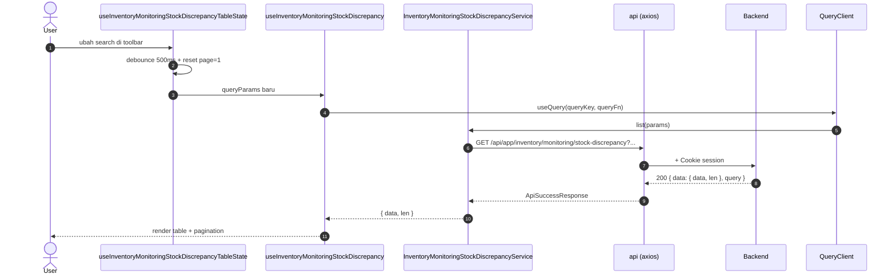
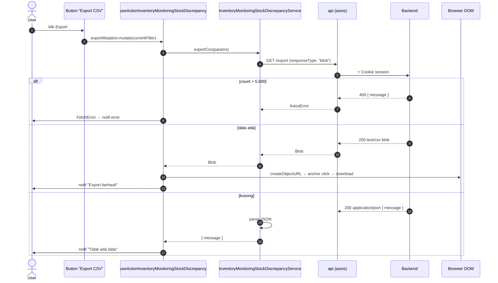

# Inventory / Monitoring / Stock Discrepancy — Frontend Integration

**Module / Scope**: `inventory/monitoring/stock-discrepancy` (Audit Selisih Transfer)
**Backend base path**: `/api/app/inventory/monitoring/stock-discrepancy`
**Frontend base path** (rencana): `app/src/app/(application)/inventory/monitoring/stock-discrepancy/`
**Component base path** (rencana): `app/src/components/pages/inventory/monitoring/stock-discrepancy/`

**Dependencies**:

- Konvensi global modul → [`../../frontend-integration.md`](../../frontend-integration.md) §2.
- BE scope doc → [`./README.md`](./README.md).
- Komponen UI implementation → [frontend-dev-flow](../../../../../.claude/skills/frontend-dev-flow/SKILL.md).
- Test patterns → [frontend-testing](../../../../../.claude/skills/frontend-testing/SKILL.md).

**Domain**: list item transfer dengan selisih (`quantity_missing > 0` atau `quantity_rejected > 0`) untuk keperluan audit. Read-only — data ditulis oleh flow Stock Transfer (unpacking + QC).

**Status FE**: 🚧 **TBD** (per 2026-05-20). Implementasi FE legacy ada di `inventory-v2/monitoring/discrepancy` — perlu migrasi ke path baru `inventory/monitoring/stock-discrepancy/`.

---

## 1. Schema BE verbatim

Sumber: [`api/src/module/application/inventory/monitoring/stock-discrepancy/stock-discrepancy.schema.ts`](../../../../../src/module/application/inventory/monitoring/stock-discrepancy/stock-discrepancy.schema.ts).

### 1.1 `QueryStockDiscrepancySchema`

```ts
import { z } from "zod";

export const QueryStockDiscrepancySchema = z.object({
    page:   z.coerce.number().int().positive().default(1).optional(),
    take:   z.coerce.number().int().positive().max(100).default(25).optional(),
    /** Cari berdasarkan transfer_number, product.name, atau product.code */
    search: z.string().trim().min(1).optional(),
});

export type QueryStockDiscrepancyDTO = z.infer<typeof QueryStockDiscrepancySchema>;
```

| Field    | Type     | Required | Default | Constraint    | Catatan FE                                                                          |
| :------- | :------- | :------- | :------ | :------------ | :---------------------------------------------------------------------------------- |
| `page`   | `number` | No       | `1`     | `int >= 1`    | Pagination                                                                          |
| `take`   | `number` | No       | `25`    | `int 1..100`  | Cap 100. UI default 25                                                              |
| `search` | `string` | No       | —       | `trim, min 1` | **WAJIB** debounce 500ms (`useDebounce` di [konvensi modul](../../frontend-integration.md#2-konvensi-global-modul-inventory)) |

### 1.2 `ResponseStockDiscrepancyDTO`

```ts
export interface ResponseStockDiscrepancyDTO {
    id:                 number;
    transfer_id:        number;
    transfer_number:    string;
    transfer_date:      Date;
    from_location:      string | null;
    to_location:        string | null;
    product_id:         number | null;
    product_code:       string | null;
    product_name:       string | null;
    quantity_requested: number;
    quantity_missing:   number;
    quantity_rejected:  number;
    notes:              string | null;
}
```

### 1.3 Enum referensi (Prisma)

```prisma
enum TransferStatus {
    PENDING  PACKING  IN_TRANSIT
    COMPLETED  PARTIAL  MISSING  REJECTED
    CANCELLED
}
```

Service hard-code filter `COMPLETED|PARTIAL|MISSING|REJECTED`. FE tidak perlu expose enum ini sebagai filter — UI cukup tampilkan status sebagai badge per row (kalau diperlukan di kolom tabel).

---

## 2. FE Schema Mirror

Lokasi (rencana): `app/src/app/(application)/inventory/monitoring/stock-discrepancy/server/inventory.monitoring.stock-discrepancy.schema.ts`.

```ts
import { z } from "zod";

export const QueryStockDiscrepancySchema = z.object({
    page:   z.coerce.number().int().positive().default(1).optional(),
    take:   z.coerce.number().int().positive().max(100).default(25).optional(),
    search: z.string().trim().min(1).optional(),
});

export type QueryStockDiscrepancyDTO = z.input<typeof QueryStockDiscrepancySchema>;

export const ResponseStockDiscrepancySchema = z.object({
    id:                 z.number(),
    transfer_id:        z.number(),
    transfer_number:    z.string(),
    transfer_date:      z.coerce.date(),
    from_location:      z.string().nullable(),
    to_location:        z.string().nullable(),
    product_id:         z.number().nullable(),
    product_code:       z.string().nullable(),
    product_name:       z.string().nullable(),
    quantity_requested: z.number(),
    quantity_missing:   z.number(),
    quantity_rejected:  z.number(),
    notes:              z.string().nullable(),
});

export type ResponseStockDiscrepancyDTO = z.infer<typeof ResponseStockDiscrepancySchema>;
```

**Diff vs BE** (per 2026-05-20): ✅ 1:1. `transfer_date` di FE pakai `z.coerce.date()` untuk parse ISO string dari HTTP response → `Date` object.

---

## 3. Routing — Endpoint Table

Base URL: `/api/app/inventory/monitoring/stock-discrepancy`. Sumber kebenaran tunggal saat FE wiring service.

| #   | Method | Path        | Query type                  | Response (status code)                                                                                            | Error utama                                                          |
| :-- | :----- | :---------- | :-------------------------- | :---------------------------------------------------------------------------------------------------------------- | :------------------------------------------------------------------- |
| 1   | `GET`  | `/`         | `QueryStockDiscrepancyDTO`  | `200` — `ApiSuccessResponse<{ data: ResponseStockDiscrepancyDTO[]; len: number }>`                                | `400` — Zod (mis. `take > 100`)                                       |
| 2   | `GET`  | `/export`   | `QueryStockDiscrepancyDTO`  | `200` — `text/csv` body **atau** `ApiSuccessResponse<{ message: string }>` saat data kosong                       | `400` — Zod **atau** hasil > 5.000 baris                              |

> **Status code** mengikuti SOP `dev-flow §1.G`: 200 untuk read sinkron. Verifikasi di `stock-discrepancy.controller.ts`:
>
> ```ts
> return ApiResponse.sendSuccess(c, result, 200, query);             // list
> return ApiResponse.sendSuccess(c, { message: "..." }, 200);         // export empty
> return new Response(csv, { status: 200, headers: { ... } });        // export CSV
> ```

---

## 4. Service Class FE — FULL CODE

Lokasi (rencana): `app/src/app/(application)/inventory/monitoring/stock-discrepancy/server/inventory.monitoring.stock-discrepancy.service.ts`.

```ts
import { api, ApiSuccessResponse } from "@/lib/api";
import {
    QueryStockDiscrepancyDTO,
    ResponseStockDiscrepancyDTO,
} from "./inventory.monitoring.stock-discrepancy.schema";

const BASE_URL = "/api/app/inventory/monitoring/stock-discrepancy";

export class InventoryMonitoringStockDiscrepancyService {
    /** GET / — paginated list discrepancy */
    static async list(params: QueryStockDiscrepancyDTO) {
        try {
            const res = await api.get<
                ApiSuccessResponse<{ data: ResponseStockDiscrepancyDTO[]; len: number }>
            >(BASE_URL, { params });
            return res.data;
        } catch (e) {
            throw e;
        }
    }

    /** GET /export — download CSV */
    static async exportCsv(params: QueryStockDiscrepancyDTO): Promise<Blob | { message: string }> {
        try {
            const res = await api.get(`${BASE_URL}/export`, {
                params,
                responseType: "blob",
            });

            // Bila data kosong, BE return JSON dengan Content-Type application/json
            const contentType = res.headers["content-type"] ?? "";
            if (contentType.includes("application/json")) {
                const text = await (res.data as Blob).text();
                const parsed = JSON.parse(text) as ApiSuccessResponse<{ message: string }>;
                return parsed.data;
            }

            return res.data as Blob;
        } catch (e) {
            throw e;
        }
    }
}
```

**Catatan**: GET-only, tidak butuh `setupCSRFToken()`.

---

## 5. Hooks — 5 hook split FULL CODE

Lokasi (rencana): `app/src/app/(application)/inventory/monitoring/stock-discrepancy/server/use.inventory.monitoring.stock-discrepancy.ts`.

```ts
import { useMutation, useQuery } from "@tanstack/react-query";
import { useState, useMemo } from "react";
import { useDebounce, useQueryParams } from "@/shared/hooks";
import { FetchError, ResponseError } from "@/lib/api";
import { useNotif } from "@/shared/notif";
import { InventoryMonitoringStockDiscrepancyService } from "./inventory.monitoring.stock-discrepancy.service";
import { QueryStockDiscrepancyDTO } from "./inventory.monitoring.stock-discrepancy.schema";

const QUERY_KEY_LIST = "inventory.monitoring.stock-discrepancy";

// ─── 1. READ ─────────────────────────────────────────────────────────────

export function useInventoryMonitoringStockDiscrepancy(params?: QueryStockDiscrepancyDTO) {
    return useQuery({
        queryKey: [QUERY_KEY_LIST, params],
        queryFn:  () =>
            InventoryMonitoringStockDiscrepancyService.list(params as QueryStockDiscrepancyDTO),
        enabled:  Boolean(params),
        staleTime: 30_000,
    });
}

// ─── 2. WRITE ────────────────────────────────────────────────────────────

export const useFormInventoryMonitoringStockDiscrepancy = () => {
    // N/A (read-only) — discrepancy ditulis oleh flow Stock Transfer (unpacking + QC).
    return null;
};

// ─── 3. ACTION ───────────────────────────────────────────────────────────

export function useActionInventoryMonitoringStockDiscrepancy() {
    const { setNotif } = useNotif();
    const [err, setErr] = useState<ResponseError | null>(null);

    const exportMutation = useMutation<Blob | { message: string }, ResponseError, QueryStockDiscrepancyDTO>({
        mutationKey: [QUERY_KEY_LIST, "export"],
        mutationFn:  (params) =>
            InventoryMonitoringStockDiscrepancyService.exportCsv(params),
        onSuccess: (data) => {
            if (data instanceof Blob) {
                const url = window.URL.createObjectURL(data);
                const link = document.createElement("a");
                link.href = url;
                link.download = `stock-discrepancy-audit-${new Date().toISOString().slice(0, 10)}.csv`;
                document.body.appendChild(link);
                link.click();
                link.remove();
                window.URL.revokeObjectURL(url);
                setNotif({ title: "Export berhasil", message: "File CSV terunduh." });
            } else {
                setNotif({ title: "Tidak ada data", message: data.message });
            }
        },
        onError: (e) => FetchError(e, setErr),
    });

    return { exportMutation, err, setErr };
}

// ─── 4. TABLE STATE (URL sync + debounce search) ─────────────────────────

export function useInventoryMonitoringStockDiscrepancyTableState() {
    const { params, batchSet } = useQueryParams<QueryStockDiscrepancyDTO>();
    const [search, setSearch] = useState(params.search ?? "");
    const debouncedSearch = useDebounce(search, 500);

    const setParams = (next: Partial<QueryStockDiscrepancyDTO>) => {
        batchSet({ ...next, page: 1 });
    };

    const queryParams = useMemo<QueryStockDiscrepancyDTO>(
        () => ({
            ...params,
            search: debouncedSearch || undefined,
        }),
        [params, debouncedSearch],
    );

    return { params: queryParams, setParams, search, setSearch };
}

// ─── 5. QUERY WRAPPER ────────────────────────────────────────────────────

export function useInventoryMonitoringStockDiscrepancyQuery() {
    const state   = useInventoryMonitoringStockDiscrepancyTableState();
    const query   = useInventoryMonitoringStockDiscrepancy(state.params);
    const actions = useActionInventoryMonitoringStockDiscrepancy();

    return { ...state, ...query, actions };
}
```

**queryKey & invalidation**:

- queryKey list: `["inventory.monitoring.stock-discrepancy", params]`
- mutationKey export: `["inventory.monitoring.stock-discrepancy", "export"]`
- Invalidation: **tidak ada** (read-only). Modul Stock Transfer yang menulis `quantity_missing/rejected` boleh `invalidateQueries({ queryKey: ["inventory.monitoring.stock-discrepancy"], type: "all" })` setelah submit QC.

---

## 6. End-to-end flow Mermaid

### 6.1 List flow



### 6.2 Export CSV flow



---

## 7. Edge cases & per-scope quirks

1. **Debounce search 500ms** — wajib (konvensi modul).
2. **Status transfer hard-coded** — UI tidak perlu kasih filter status. Service auto-filter ke `COMPLETED|PARTIAL|MISSING|REJECTED`. Bila product di transfer status `PENDING/PACKING/IN_TRANSIT`, **tidak akan muncul** di list ini.
3. **Filter `quantity_missing > 0 OR quantity_rejected > 0`** — built-in. Tidak bisa di-disable. Row dengan kedua-duanya 0 tidak akan masuk.
4. **`from_location` selalu warehouse** — flow Stock Transfer saat ini: source selalu warehouse, destination bisa outlet (DO) atau warehouse (TG). FE bisa tampilkan badge "DO" vs "TG" berdasarkan apakah `to_location` outlet atau warehouse — info ini bisa dilacak via `transfer_number` prefix atau via field tambahan (saat ini belum di-expose; tambah di Response DTO bila perlu).
5. **`product_id = null`** untuk item RM — saat ini RM transfer-missing belum di-scope. Bila item RM punya discrepancy, akan muncul di list dengan `product_*` semua null. UI bisa tampilkan placeholder atau skip row (tergantung kebijakan product team).
6. **Export cap 5.000** — UI WAJIB tampilkan warning "Export dibatasi 5.000 baris" sebelum trigger. BE return 400 dengan pesan ramah.
7. **CSV format**: UTF-8 BOM + CRLF — kompatibel Excel macOS/Windows.
8. **Notes** sering panjang — UI di table sebaiknya truncate dengan tooltip full text, atau drawer detail.
9. **Migrasi dari `inventory-v2/monitoring/discrepancy`**: legacy FE masih hidup. Saat migrate, ubah:
    - Path: `inventory-v2/monitoring/discrepancy` → `inventory/monitoring/stock-discrepancy`
    - Class: `DiscrepancyService` → `InventoryMonitoringStockDiscrepancyService`
    - Hook: `useDiscrepancy` → `useInventoryMonitoringStockDiscrepancy`
    - Sidebar URL & label: sesuaikan ke "Audit Selisih Transfer" atau "Discrepancy".

---

## 8. Cross-link

- BE scope README: [`./README.md`](./README.md)
- Module-level FE konvensi: [`../../frontend-integration.md`](../../frontend-integration.md)
- SOP FE canonical: [frontend-dev-flow](../../../../../.claude/skills/frontend-dev-flow/SKILL.md)
- SOP FE testing: [frontend-testing](../../../../../.claude/skills/frontend-testing/SKILL.md)
- SOP BE canonical: [dev-flow](../../../../../.claude/skills/dev-flow/SKILL.md)
- Postman folder: `Inventory → Monitoring → Stock Discrepancy` di [`docs/postman/erp-mandalika.postman_collection.json`](../../../../postman/erp-mandalika.postman_collection.json)
- Sibling FE doc: [`../stock-movement/frontend-integration.md`](../stock-movement/frontend-integration.md) — ledger pergerakan
