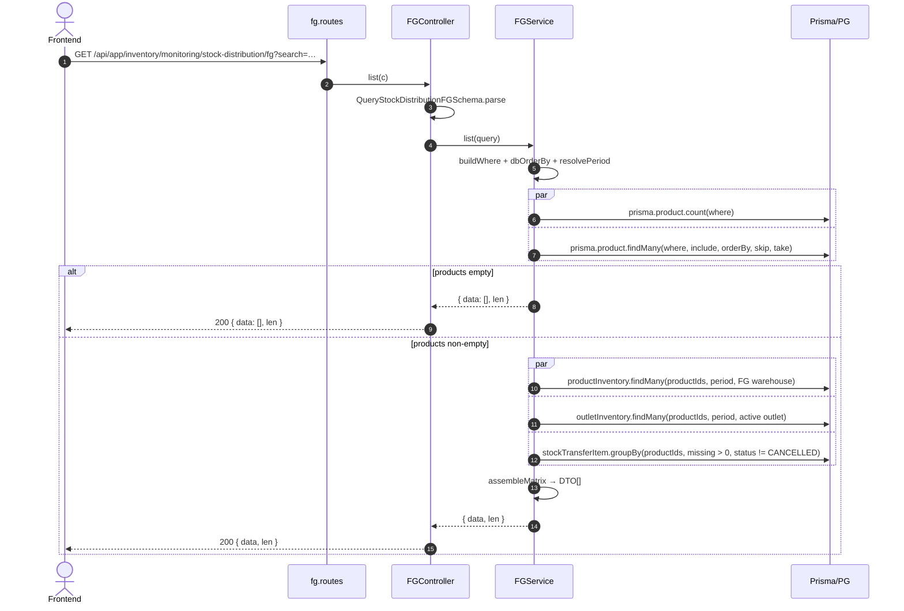
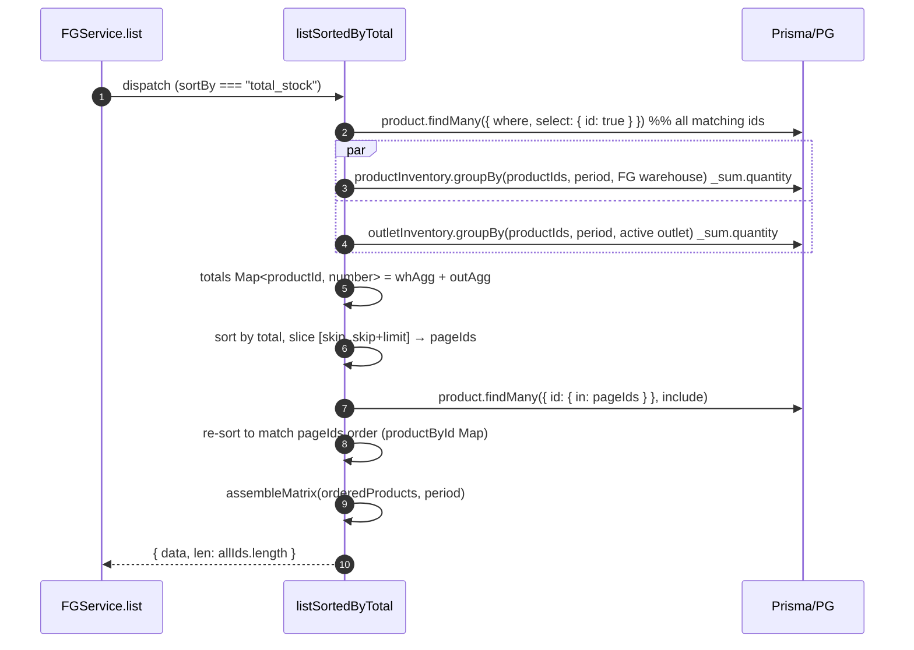

# Module: Inventory / Monitoring / Stock Distribution

**Base path**: `/api/app/inventory/monitoring/stock-distribution`
**Source**: `src/module/application/inventory/monitoring/stock-distribution/`
**Tests**: `src/tests/inventory/monitoring/stock-distribution/`
**Prisma models**: `Product`, `ProductInventory`, `OutletInventory`, `StockTransferItem` (FG); `RawMaterial`, `RawMaterialInventory` (RM); `Warehouse`, `Outlet`

Matrix view stok per-lokasi: setiap baris adalah produk (FG) atau bahan baku (RM), dan setiap kolom dinamis adalah lokasi (warehouse + outlet untuk FG, warehouse only untuk RM). Periode bisa dipilih (`?month=&year=`); default bulan & tahun berjalan.

> **Catatan khusus**:
> - **Dua sub-scope, satu modul**: `fg` dan `rm` punya schema/service/controller/routes terpisah tapi berbagi helper di `_shared/`. Endpoint juga simetris.
> - **Bergantung pada Phase A** (`outlet_inventories.month/year`). Tanpa migrasi tersebut, outlet leg di FG hanya akurat di bulan berjalan.
> - **ORM-first**: tidak ada raw SQL. `findMany` + `groupBy` Prisma + agregasi in-memory.
> - **`sortBy=total_stock`** memakai jalur tersendiri (lihat §2.2): fetch semua ID matching → `groupBy` per ID → sort → slice page. Mengurutkan in-memory **per page** salah karena pagination DB terjadi sebelum total terkomputasi.

---

## 1. Scope & Fitur

| Fitur                                    | Endpoint                                                            | Catatan                                                                              |
| :--------------------------------------- | :------------------------------------------------------------------ | :----------------------------------------------------------------------------------- |
| List FG matrix (paginated)               | `GET /fg`                                                           | Filter `search`, `type_id`, `gender`, `month`, `year`. Sort by name/code/type/size/total_stock/updated_at. |
| List FG locations (dropdown)             | `GET /fg/locations`                                                 | Warehouse `FINISH_GOODS` + semua outlet aktif (label `type: "WAREHOUSE" \| "OUTLET"`). |
| Export FG CSV                            | `GET /fg/export`                                                    | Kolom statis (SKU, Nama, Tipe, Size, Gender, UOM, Total Stok, Total Hilang) + per lokasi. Cap `EXPORT_ROW_LIMIT = 5000`. |
| List RM matrix (paginated)               | `GET /rm`                                                           | Filter `search`, `category_id`, `material_type`, `month`, `year`. Sort by name/category/unit/material_type/total_stock/updated_at. |
| List RM locations (dropdown)             | `GET /rm/locations`                                                 | Hanya warehouse `RAW_MATERIAL` (label `type: "WAREHOUSE"`).                          |
| Export RM CSV                            | `GET /rm/export`                                                    | Kolom statis (Nama, Kategori, Satuan, Tipe Material, Min Stock, Total Stok) + per lokasi. |

### Out of scope (tidak dihandle di sini)

- Mutasi stok (in/out, transfer, return) — lihat `inventory-v2/do`, `inventory-v2/tg`, `inventory-v2/return`, `inventory-v2/gr`.
- `total_missing` untuk RM — tidak diinklusikan (keputusan brainstorming 2026-05-19). RM transfer-missing bisa ditambah di masa depan via `stockTransferItem` join.
- Stock card / movement history per item — lihat `inventory-v2/monitoring/stock-card`.
- Stock per-lokasi single-location view — lihat `inventory-v2/monitoring/stock-location`.
- Modul lama `inventory-v2/monitoring/stock-total` — slated deprecate setelah FE migrasi ke `stock-distribution/fg`.

---

## 2. Arsitektur & Flow

### 2.1 Layer map

```text
┌──────────────────── stock-distribution.routes.ts ────────────────────┐
│ Hono parent router: /fg → FGRoutes, /rm → RMRoutes                   │
└──────────────────────────────────┬───────────────────────────────────┘
                                   ▼
┌─── fg/fg.routes.ts ─────────┐   ┌─── rm/rm.routes.ts ─────────┐
│ GET /                       │   │ GET /                       │
│ GET /locations              │   │ GET /locations              │
│ GET /export                 │   │ GET /export                 │
└────────────────┬────────────┘   └────────────────┬────────────┘
                 ▼                                  ▼
   StockDistributionFGController        StockDistributionRMController
   - parse Query schema                  - parse Query schema
   - delegate ke Service                 - delegate ke Service
   - emit Response / Response(CSV)       - emit Response / Response(CSV)
                 │                                  │
                 ▼                                  ▼
   StockDistributionFGService            StockDistributionRMService
   ┌────────────────────────────┐       ┌────────────────────────────┐
   │ list() dispatches:         │       │ list() dispatches:         │
   │  - listSortedByTotal()     │       │  - listSortedByTotal()     │
   │  - standard path           │       │  - standard path           │
   │ assembleMatrix() (shared)  │       │ assembleMatrix() (shared)  │
   │ listLocations() / export() │       │ listLocations() / export() │
   └────────────────────────────┘       └────────────────────────────┘
                 │                                  │
                 └───── _shared/csv.helpers.ts ─────┤
                 └───── _shared/matrix.helpers.ts ──┤
                                                    ▼
                                           Prisma → PostgreSQL
```

### 2.2 Mermaid: List flow (default sort, FG)



### 2.3 Mermaid: Sort by total_stock (cross-page) flow



---

## 3. DTO / Schemas (end-to-end SSOT)

**Source FG**: `src/module/application/inventory/monitoring/stock-distribution/fg/fg.schema.ts`
**Source RM**: `src/module/application/inventory/monitoring/stock-distribution/rm/rm.schema.ts`

Semua enum filter ditarik dari Prisma client (`generated/prisma/client.js`) — **bukan** hardcoded literal. FE wajib mirror schema ini 1:1.

### 3.1 FG — `QueryStockDistributionFGSchema`

**Zod chain (verbatim)**:

```ts
import { GENDER } from "../../../../../../generated/prisma/client.js";

export const QueryStockDistributionFGSchema = z.object({
    page:      z.coerce.number().int().positive().default(1).optional(),
    take:      z.coerce.number().int().positive().max(5000).default(50).optional(),
    search:    z.string().optional(),
    type_id:   z.coerce.number().int().positive().optional(),
    gender:    z.enum(GENDER).optional(),
    month:     z.coerce.number().int().min(1).max(12).optional(),
    year:      z.coerce.number().int().min(2000).max(2100).optional(),
    sortBy:    z.enum(["name", "code", "type", "size", "total_stock", "updated_at"])
                .default("updated_at").optional(),
    sortOrder: z.enum(["asc", "desc"]).default("desc").optional(),
});

export type QueryStockDistributionFGDTO = z.infer<typeof QueryStockDistributionFGSchema>;
```

**Field detail**:

| Field       | Type     | Required | Default        | Constraint              | Catatan                                                          |
| :---------- | :------- | :------- | :------------- | :---------------------- | :--------------------------------------------------------------- |
| `page`      | `number` | ❌       | `1`            | `> 0`                   | —                                                                |
| `take`      | `number` | ❌       | `50`           | `1..5000`               | Sama dengan `EXPORT_ROW_LIMIT` di `export`.                       |
| `search`    | `string` | ❌       | —              | —                       | ILIKE pada `name` & `code`.                                       |
| `type_id`   | `number` | ❌       | —              | `> 0`                   | Filter `ProductType` FK.                                          |
| `gender`    | `GENDER` | ❌       | —              | enum `WOMEN/MEN/UNISEX` | Diimport dari Prisma client. Hardcoded literal dilarang.          |
| `month`     | `number` | ❌       | now            | `1..12`                 | Default ke bulan berjalan via `resolvePeriod`.                    |
| `year`      | `number` | ❌       | now            | `2000..2100`            | Default ke tahun berjalan via `resolvePeriod`.                    |
| `sortBy`    | `enum`   | ❌       | `"updated_at"` | whitelist               | `total_stock` memakai jalur tersendiri di service.                |
| `sortOrder` | `enum`   | ❌       | `"desc"`       | `"asc" \| "desc"`       | —                                                                 |

### 3.2 FG — `ResponseStockDistributionFGDTO`

```ts
export interface ResponseStockDistributionFGDTO {
    code:            string;
    name:            string;
    type:            string;
    size:            number;
    gender:          string;
    uom:             string;
    total_stock:     number;
    total_missing:   number;
    location_stocks: Record<string, number>;
}
```

**Transformasi service**:

| Field             | Sumber                                                          | Transformasi                                                  |
| :---------------- | :-------------------------------------------------------------- | :------------------------------------------------------------ |
| `type`            | `Product.product_type.name`                                     | Fallback `"Unknown"` jika relasi null.                        |
| `size`            | `Product.size.size` (Int)                                       | `Number(...)`; fallback `0`.                                  |
| `uom`             | `Product.unit.name`                                             | Fallback `"Unknown"`.                                          |
| `gender`          | `Product.gender` (Prisma enum `GENDER`)                         | `String(...)`.                                                 |
| `total_stock`     | sum `productInventory.quantity` + sum `outletInventory.quantity` | Aggregate in-memory dari row warehouse FG + outlet aktif (period filter). |
| `total_missing`   | sum `stockTransferItem.quantity_missing`                        | `groupBy product_id`, filter `quantity_missing > 0` & status non-CANCELLED. |
| `location_stocks` | warehouse FG (`type=FINISH_GOODS`) + outlet aktif               | Map nama lokasi → qty per period.                              |

### 3.3 FG — `ResponseStockDistributionLocationDTO`

```ts
export interface ResponseStockDistributionLocationDTO {
    id:   number;
    name: string;
    type: "WAREHOUSE" | "OUTLET";
}
```

Diisi oleh `listLocations()` (warehouse FG + outlet aktif).

### 3.4 RM — `QueryStockDistributionRMSchema`

```ts
import { MaterialType } from "../../../../../../generated/prisma/client.js";

export const QueryStockDistributionRMSchema = z.object({
    page:          z.coerce.number().int().positive().default(1).optional(),
    take:          z.coerce.number().int().positive().max(5000).default(50).optional(),
    search:        z.string().optional(),
    category_id:   z.coerce.number().int().positive().optional(),
    material_type: z.enum(MaterialType).optional(),
    month:         z.coerce.number().int().min(1).max(12).optional(),
    year:          z.coerce.number().int().min(2000).max(2100).optional(),
    sortBy:        z.enum(["name", "category", "unit", "material_type", "total_stock", "updated_at"])
                    .default("updated_at").optional(),
    sortOrder:     z.enum(["asc", "desc"]).default("desc").optional(),
});

export type QueryStockDistributionRMDTO = z.infer<typeof QueryStockDistributionRMSchema>;
```

**Field detail**:

| Field            | Type           | Required | Default        | Constraint                | Catatan                                              |
| :--------------- | :------------- | :------- | :------------- | :------------------------ | :--------------------------------------------------- |
| `page`           | `number`       | ❌       | `1`            | `> 0`                     | —                                                    |
| `take`           | `number`       | ❌       | `50`           | `1..5000`                 | —                                                    |
| `search`         | `string`       | ❌       | —              | —                         | ILIKE pada `name`.                                   |
| `category_id`    | `number`       | ❌       | —              | `> 0`                     | Filter `RawMatCategories.id` FK.                     |
| `material_type`  | `MaterialType` | ❌       | —              | enum `FO/PCKG`            | Diimport dari Prisma. Hardcoded literal dilarang.    |
| `month` / `year` | `number`       | ❌       | now            | sama dengan FG            | —                                                    |
| `sortBy`         | `enum`         | ❌       | `"updated_at"` | whitelist                 | `total_stock` jalur tersendiri.                      |
| `sortOrder`      | `enum`         | ❌       | `"desc"`       | `"asc" \| "desc"`         | —                                                    |

### 3.5 RM — `ResponseStockDistributionRMDTO`

```ts
export interface ResponseStockDistributionRMDTO {
    name:            string;
    category:        string;
    unit:            string;
    material_type:   "FO" | "PCKG" | null;
    min_stock:       number | null;
    total_stock:     number;
    location_stocks: Record<string, number>;
}
```

**Transformasi service**:

| Field             | Sumber                                              | Transformasi                                              |
| :---------------- | :-------------------------------------------------- | :-------------------------------------------------------- |
| `category`        | `RawMaterial.raw_mat_category.name`                 | Fallback `"Unknown"`.                                     |
| `unit`            | `RawMaterial.unit_raw_material.name`                | Fallback `"Unknown"`.                                     |
| `material_type`   | `RawMaterial.type` (Prisma enum `MaterialType?`)    | Pass-through (nullable).                                  |
| `min_stock`       | `RawMaterial.min_stock` (Decimal?)                  | `Number(...)` saat tidak null; null sebaliknya.           |
| `total_stock`     | sum `rawMaterialInventory.quantity`                 | Aggregate dari warehouse `RAW_MATERIAL` per period.       |
| `location_stocks` | warehouse `RAW_MATERIAL`                            | Map nama warehouse → qty per period.                      |

### 3.6 RM — `ResponseStockDistributionRMLocationDTO`

```ts
export interface ResponseStockDistributionRMLocationDTO {
    id:   number;
    name: string;
    type: "WAREHOUSE";
}
```

Diisi oleh `listLocations()` (warehouse `RAW_MATERIAL` aktif saja).

### 3.7 Enum referensi (Prisma)

```prisma
enum GENDER {
    WOMEN
    MEN
    UNISEX
}

enum MaterialType {
    FO
    PCKG
}

enum WarehouseType {
    FINISH_GOODS
    RAW_MATERIAL
}
```

Lokasi: `prisma/schema.prisma`. FE wajib re-derive dari `@/shared/types` — **jangan duplikasi literal**.

### 3.8 Catatan integrasi FE

Schema di atas adalah kontrak. FE mirror di:

- Schema: `app/src/app/(application)/inventory/monitoring/stock-distribution/server/inventory.monitoring.stock-distribution.schema.ts`
- DTO exports: `QueryStockDistributionFGDTO`, `ResponseStockDistributionFGDTO`, `QueryStockDistributionRMDTO`, `ResponseStockDistributionRMDTO`, `ResponseStockDistributionLocationDTO`, `ResponseStockDistributionRMLocationDTO`

Detail mirror, naming dot-chain, dan rules `z.input`/`z.infer` ada di [../../frontend-integration.md](../../frontend-integration.md).

---

## 4. Routing untuk integrasi Frontend

Semua endpoint terproteksi `authMiddleware` (session cookie + Redis session) — lihat [AUTH.md](../../../../AUTH.md).

### 4.1 Daftar endpoint

> **Status code SOP**: semua endpoint sub-modul ini read-only → `200`. Tidak ada `201`/`202` di sini.

| #   | Method | Path                  | Body / Query                              | Response (status)                                                                | Error utama         |
| :-- | :----- | :-------------------- | :---------------------------------------- | :------------------------------------------------------------------------------- | :------------------ |
| 1   | GET    | `/fg`                 | `QueryStockDistributionFGDTO`             | `{ data: ResponseStockDistributionFGDTO[]; len: number }` (**200**)              | 400                 |
| 2   | GET    | `/fg/locations`       | —                                         | `ResponseStockDistributionLocationDTO[]` (**200**)                               | —                   |
| 3   | GET    | `/fg/export`          | `QueryStockDistributionFGDTO`             | `text/csv` attachment (**200**); kalau kosong → `{ message: "Tidak ada data untuk di-export" }` (**200**) | 400 |
| 4   | GET    | `/rm`                 | `QueryStockDistributionRMDTO`             | `{ data: ResponseStockDistributionRMDTO[]; len: number }` (**200**)              | 400                 |
| 5   | GET    | `/rm/locations`       | —                                         | `ResponseStockDistributionRMLocationDTO[]` (**200**)                             | —                   |
| 6   | GET    | `/rm/export`          | `QueryStockDistributionRMDTO`             | `text/csv` attachment (**200**); kalau kosong → JSON dengan message (**200**)   | 400                 |

Path lengkap di-prefix `/api/app/inventory/monitoring/stock-distribution`.

### 4.2 Konvensi response (JSON)

```jsonc
{
  "query": { /* echo query parsed */ },
  "status": "success",
  "data": { /* ResponseDTO */ }
}
```

Error:

```jsonc
{ "status": "error", "message": "<pesan>" }
```

CSV export menggunakan `Content-Type: text/csv; charset=utf-8` + `Content-Disposition: attachment; filename="stock-distribution-{fg|rm}-YYYY-MM-DD.csv"`.

### 4.3 Contoh integrasi FE

Konvensi lengkap (service class pattern, `setupCSRFToken` — tidak diperlukan untuk GET, hook split READ/TableState/Query-wrapper, queryKey, design tokens) di [../../frontend-integration.md](../../frontend-integration.md).

```ts
// FE service (rencana, inventory.monitoring.stock-distribution.service.ts)
const API = "/api/app/inventory/monitoring/stock-distribution";

export class InventoryMonitoringStockDistributionService {
    static async listFG(params: QueryStockDistributionFGDTO) {
        const { data } = await api.get<ApiSuccessResponse<{ data: ResponseStockDistributionFGDTO[]; len: number }>>(`${API}/fg`, { params });
        return data.data;
    }

    static async listFGLocations() {
        const { data } = await api.get<ApiSuccessResponse<ResponseStockDistributionLocationDTO[]>>(`${API}/fg/locations`);
        return data.data;
    }

    static async exportFG(params: QueryStockDistributionFGDTO) {
        const res = await api.get(`${API}/fg/export`, { params, responseType: "blob" });
        return res.data;
    }

    // RM mirip.
}
```

### 4.4 Header & auth

- Cookie session: `env.SESSION_COOKIE_NAME` (default `session`).
- CSRF: **tidak diperlukan** karena seluruh endpoint `GET`.
- `Accept: application/json` (default) atau `text/csv` untuk export (otomatis dari `Content-Disposition`).

---

## 5. Database / Indexes

Model yang disentuh:

```prisma
model Product {
    id        Int       @id @default(autoincrement())
    code      String    @unique
    name      String
    gender    GENDER
    type_id   Int?
    unit_id   Int
    size_id   Int?
    deleted_at DateTime?
    // ...
    product_type ProductType? @relation(fields: [type_id], references: [id])
    unit         Unit         @relation(fields: [unit_id], references: [id])
    size         ProductSize? @relation(fields: [size_id], references: [id])
    @@index([deleted_at])
}

model ProductInventory {
    product_id   Int
    warehouse_id Int
    quantity     Decimal @db.Decimal(18, 2)
    date         Int
    month        Int
    year         Int
    product   Product   @relation(fields: [product_id], references: [id])
    warehouse Warehouse @relation(fields: [warehouse_id], references: [id])
    @@unique([product_id, warehouse_id, date, month, year])
    @@index([product_id, month, year])
}

model OutletInventory {
    outlet_id  Int
    product_id Int
    quantity   Decimal @db.Decimal(18, 2)
    month      Int    // ditambah di migrasi 20260519140000_outlet_inventory_period (Phase A)
    year       Int
    outlet  Outlet  @relation(fields: [outlet_id], references: [id])
    product Product @relation(fields: [product_id], references: [id])
    @@unique([outlet_id, product_id, month, year])
    @@index([month, year])
}

model RawMaterialInventory {
    raw_material_id Int
    warehouse_id    Int
    quantity        Decimal @db.Decimal(18, 2)
    date            Int
    month           Int
    year            Int
    @@unique([raw_material_id, warehouse_id, date, month, year])
    @@index([raw_material_id, month, year])
}

model StockTransferItem {
    transfer_id      Int
    product_id       Int?
    raw_material_id  Int?
    quantity_missing Decimal? @db.Decimal(18, 2)
    transfer StockTransfer @relation(fields: [transfer_id], references: [id])
    @@index([product_id])
}
```

Migrasi terkait:

- `prisma/migrations/20260519140000_outlet_inventory_period/migration.sql` — tambah `month/year` ke `outlet_inventories` (Phase A; gitignored — apply manual). Wajib applied sebelum FG outlet leg akurat untuk bulan non-current.

---

## 6. Error catalog

Endpoint ini read-only; error utama berasal dari validasi Zod.

| HTTP | Pesan                                                                  | Trigger                                                          |
| :--- | :--------------------------------------------------------------------- | :--------------------------------------------------------------- |
| 400  | Zod error message (mis. `"Number must be greater than 0"`, dst.)      | Query gagal `QueryStockDistributionFGSchema.parse` / `...RM`.    |
| 500  | `Internal Server Error`                                                | Error Prisma / unexpected (tidak ada exception khusus di service). |

Tidak ada `404`/`409` karena tidak ada path parameter atau write operation.

---

## 7. Testing

Lokasi: `src/tests/inventory/monitoring/stock-distribution/`. Total **15 tests** (8 FG service + 7 RM service).

### 7.1 Setup global

`src/tests/setup.ts` me-mock: `env`, `prisma`, `redisClient`, `logger`. Mock yang ditambahkan oleh modul ini:

- `productInventory.findMany`, `productInventory.groupBy`
- `outletInventory.findMany` (sudah ada period dari Phase A), `outletInventory.groupBy`
- `rawMaterialInventory.groupBy`
- `stockTransferItem.groupBy`

### 7.2 Service test (`fg.service.test.ts`)

| Suite                          | Test cases                                                                                                |
| :----------------------------- | :-------------------------------------------------------------------------------------------------------- |
| `list`                         | empty result; matrix assembly (warehouse + outlet + missing); filter `search`/`type_id`/`gender`; period filter `?month=&year=`. |
| `list sorted by total_stock`   | cross-page ranking via `listSortedByTotal`; empty matching set.                                           |
| `listLocations`                | merge FG warehouse + outlet aktif, label `type`.                                                          |
| `export`                       | delegate ke `list` dengan `take=EXPORT_ROW_LIMIT`, `page=1`.                                              |

### 7.3 Service test (`rm.service.test.ts`)

| Suite                          | Test cases                                                                                                |
| :----------------------------- | :-------------------------------------------------------------------------------------------------------- |
| `list`                         | empty result; matrix assembly (RM warehouse only); filter `search`/`category_id`/`material_type`; warehouse type-scope. |
| `list sorted by total_stock`   | cross-page ranking; empty matching set.                                                                   |
| `listLocations`                | hanya warehouse `RAW_MATERIAL`.                                                                            |

### 7.4 Menjalankan test

```bash
npx vitest run src/tests/inventory/monitoring/stock-distribution/
```

Expected: 15/15 pass.

---

## 8. Postman testing

Import koleksi `docs/postman/erp-mandalika.postman_collection.json` → folder `Application → Inventory → Monitoring → Stock Distribution`. Set environment variables:

| Var          | Value contoh                       |
| :----------- | :--------------------------------- |
| `base_url`   | `http://localhost:3000`            |
| `session_id` | `<isi dari login>`                 |
| `csrf_token` | `<dari cookie / login response>`   |

Header global tiap request:

- `Cookie: session={{session_id}}`
- `Content-Type: application/json` (tidak relevan untuk GET tapi tetap di-set untuk konsistensi)
- **Tidak** perlu `x-csrf-token` karena semua endpoint `GET`.

### 8.1 List FG

```
GET {{base_url}}/api/app/inventory/monitoring/stock-distribution/fg?page=1&take=25&sortBy=updated_at&sortOrder=desc
```

**Expected 200**:

```json
{
  "query": { "page": 1, "take": 25, "sortBy": "updated_at", "sortOrder": "desc" },
  "status": "success",
  "data": {
    "data": [
      {
        "code": "TSHIRT",
        "name": "T-Shirt",
        "type": "Apparel",
        "size": 40,
        "gender": "UNISEX",
        "uom": "pcs",
        "total_stock": 50,
        "total_missing": 2,
        "location_stocks": { "Gudang SBY": 40, "Toko A": 10 }
      }
    ],
    "len": 1
  }
}
```

### 8.2 List FG with filter + period

```
GET {{base_url}}/api/app/inventory/monitoring/stock-distribution/fg?type_id=2&gender=MEN&month=3&year=2025
```

### 8.3 List FG sorted by total_stock

```
GET {{base_url}}/api/app/inventory/monitoring/stock-distribution/fg?sortBy=total_stock&sortOrder=desc
```

### 8.4 List FG locations

```
GET {{base_url}}/api/app/inventory/monitoring/stock-distribution/fg/locations
```

**Expected 200**:

```json
{
  "status": "success",
  "data": [
    { "id": 10, "name": "Gudang SBY", "type": "WAREHOUSE" },
    { "id": 20, "name": "Toko A",     "type": "OUTLET" }
  ]
}
```

### 8.5 Export FG CSV

```
GET {{base_url}}/api/app/inventory/monitoring/stock-distribution/fg/export
```

**Expected 200** dengan header `Content-Disposition: attachment; filename="stock-distribution-fg-YYYY-MM-DD.csv"`. Body CSV:

```
SKU / Code,Nama Produk,Tipe,Size,Gender,UOM,Total Stok,Total Hilang,Gudang SBY,Toko A
TSHIRT,T-Shirt,Apparel,40,UNISEX,pcs,50,2,40,10
```

### 8.6 List RM

```
GET {{base_url}}/api/app/inventory/monitoring/stock-distribution/rm?page=1&take=25
```

**Expected 200**:

```json
{
  "status": "success",
  "data": {
    "data": [
      {
        "name": "Kain Katun",
        "category": "Fabric",
        "unit": "meter",
        "material_type": "FO",
        "min_stock": 5,
        "total_stock": 150,
        "location_stocks": { "Gudang RM A": 120, "Gudang RM B": 30 }
      }
    ],
    "len": 1
  }
}
```

### 8.7 List RM with filter

```
GET {{base_url}}/api/app/inventory/monitoring/stock-distribution/rm?category_id=1&material_type=FO
```

### 8.8 List RM locations

```
GET {{base_url}}/api/app/inventory/monitoring/stock-distribution/rm/locations
```

**Expected 200**:

```json
{
  "status": "success",
  "data": [
    { "id": 3, "name": "Gudang RM A", "type": "WAREHOUSE" }
  ]
}
```

### 8.9 Export RM CSV

```
GET {{base_url}}/api/app/inventory/monitoring/stock-distribution/rm/export
```

**Expected 200** CSV body:

```
Nama Bahan Baku,Kategori,Satuan,Tipe Material,Min Stock,Total Stok,Gudang RM A,Gudang RM B
Kain Katun,Fabric,meter,FO,5,150,120,30
```

---

## 9. Activity log

Endpoint ini read-only → **tidak** trigger `CreateLogger`. Tidak ada entry di `logging_activities`.

---

## 10. Checklist saat menambah fitur ke Stock Distribution

- [ ] Tambah field di `QueryStockDistribution{FG|RM}Schema` (Zod) + update tipe DTO.
- [ ] Tulis test unit di `src/tests/inventory/monitoring/stock-distribution/{fg|rm}.service.test.ts` **sebelum** implementasi (TDD).
- [ ] Tambah `groupBy` mock relevan di `src/tests/setup.ts` jika query baru memanggilnya.
- [ ] Untuk filter berbasis kolom baru: pastikan `@@index` di Prisma menutupi.
- [ ] Update §3 (Zod block + tabel field), §4 (tabel endpoint), §8 (Postman testing) di dokumen ini.
- [ ] Update folder Postman scope di `docs/postman/erp-mandalika.postman_collection.json`.
- [ ] Update [../../frontend-integration.md](../../frontend-integration.md) bila menambah DTO/hook baru.
- [ ] `npx tsc --noEmit` clean.
- [ ] `npx vitest run src/tests/inventory/monitoring/stock-distribution/` semua pass.

---

## 11. Referensi silang

- Arsitektur global: [ARCHITECTURE.md](../../../../ARCHITECTURE.md)
- Konvensi SOP: [CONVENTIONS.md](../../../../CONVENTIONS.md)
- Auth & session: [AUTH.md](../../../../AUTH.md)
- Error format: [ERROR_HANDLING.md](../../../../ERROR_HANDLING.md)
- DB schema: [DATABASE.md](../../../../DATABASE.md)
- Testing global: [TESTING.md](../../../../TESTING.md)
- Frontend integration: [../../frontend-integration.md](../../frontend-integration.md)
- Phase A spec (outlet period): [../../../../superpowers/specs/2026-05-19-outlet-inventory-period-migration-design.md](../../../../superpowers/specs/2026-05-19-outlet-inventory-period-migration-design.md)
- Phase B spec (this module): [../../../../superpowers/specs/2026-05-19-stock-distribution-design.md](../../../../superpowers/specs/2026-05-19-stock-distribution-design.md)
- Modul terkait: [../../../inventory/fg/README.md](../../fg/README.md), [../../../inventory/rm/README.md](../../rm/README.md)
- Modul existing (akan deprecate): `src/module/application/inventory-v2/monitoring/stock-total/`
