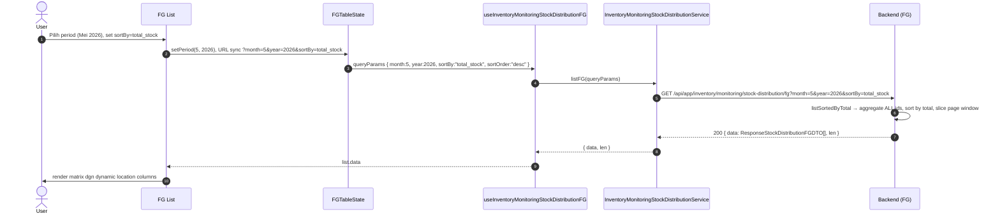
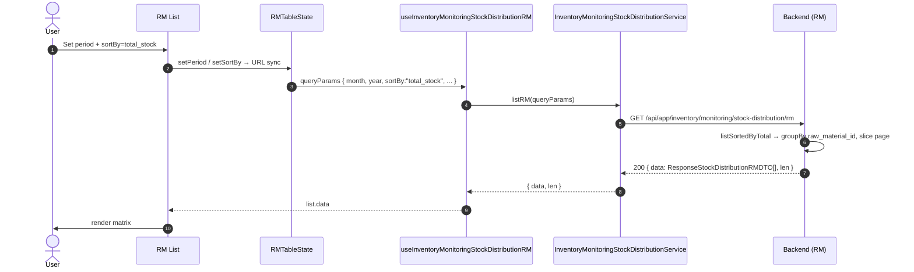
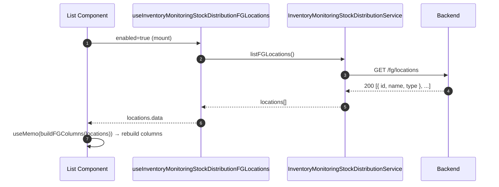

# Inventory / Monitoring / Stock Distribution — Frontend Integration (Scope Level)

Kontrak BE→FE (read-only matrix view). Komponen matrix UI (kolom dinamis per lokasi, sticky header, period filter, export button) diserahkan ke frontend-dev-flow SOP.

**Backend scope path**: `api/src/module/application/inventory/monitoring/stock-distribution/`
**Frontend scope path**: `app/src/app/(application)/inventory/monitoring/stock-distribution/server/`
**Endpoint base**: `/api/app/inventory/monitoring/stock-distribution`
**Status FE**: 🚧 TBD <!-- ubah ke ✅ Ready setelah file FE dibuat -->

**Dependencies**:

- Konvensi global modul ([`../../../frontend-integration.md`](../../../frontend-integration.md)) — queryKey naming, error pattern, debounce, design tokens, status code expectation.
- BE scope doc ([`./README.md`](./README.md)) — Zod schema source, endpoint detail, error catalog.
- SOP canonical: [frontend-dev-flow](../../../../.claude/skills/frontend-dev-flow/SKILL.md).

Scope ini adalah **read-only matrix view** untuk monitoring distribusi stok per lokasi (warehouse + outlet) untuk satu period (`month`/`year`). Dua sub-scope: **FG** (Finished Goods, warehouse type `FINISH_GOODS` + semua outlet) dan **RM** (Raw Material, warehouse type `RAW_MATERIAL`). Output berupa tabel matrix dengan baris item dan kolom dinamis per lokasi. Tidak ada Create/Update/Delete/Status — hanya GET list, GET locations, dan Export CSV.

---

## 1. Schema Mirror End-to-End

**Source BE**:
- `src/module/application/inventory/monitoring/stock-distribution/fg/fg.schema.ts`
- `src/module/application/inventory/monitoring/stock-distribution/rm/rm.schema.ts`

FE mirror WAJIB 1:1.

### 1.1 `QueryStockDistributionFGSchema` (BE — verbatim)

```ts
import { z } from "zod";
import { GENDER } from "../../../../../../generated/prisma/client.js";

export const QueryStockDistributionFGSchema = z.object({
    page:      z.coerce.number().int().positive().default(1).optional(),
    take:      z.coerce.number().int().positive().max(5000).default(50).optional(),
    search:    z.string().optional(),
    type_id:   z.coerce.number().int().positive().optional(),
    gender:    z.enum(GENDER).optional(),
    month:     z.coerce.number().int().min(1).max(12).optional(),
    year:      z.coerce.number().int().min(2000).max(2100).optional(),
    sortBy:    z.enum(["name", "code", "type", "size", "total_stock", "updated_at"])
                .default("updated_at").optional(),
    sortOrder: z.enum(["asc", "desc"]).default("desc").optional(),
});

export type QueryStockDistributionFGDTO = z.infer<typeof QueryStockDistributionFGSchema>;

export interface ResponseStockDistributionFGDTO {
    code:            string;
    name:            string;
    type:            string;
    size:            number;
    gender:          string;
    uom:             string;
    total_stock:     number;
    total_missing:   number;
    location_stocks: Record<string, number>;
}

export interface ResponseStockDistributionLocationDTO {
    id:   number;
    name: string;
    type: "WAREHOUSE" | "OUTLET";
}
```

**Field detail FG**:

| Field        | Type     | Required | Default        | Constraint               | Catatan                                         |
| :----------- | :------- | :------- | :------------- | :----------------------- | :---------------------------------------------- |
| `page`       | `number` | ❌       | `1`            | `int().positive()`       | Default 1.                                      |
| `take`       | `number` | ❌       | `50`           | `int().positive().max(5000)` | Cap 5000 untuk export & matrix.            |
| `search`     | `string` | ❌       | —              | optional                 | OR `name`/`code` insensitive di service.        |
| `type_id`    | `number` | ❌       | —              | `int().positive()`       | Filter Product.type_id.                         |
| `gender`     | `enum`   | ❌       | —              | enum `GENDER`            | Lihat §1.5.                                     |
| `month`      | `number` | ❌       | current month  | `int().min(1).max(12)`   | Default via `resolvePeriod()` BE.               |
| `year`       | `number` | ❌       | current year   | `int().min(2000).max(2100)` | Default via `resolvePeriod()` BE.            |
| `sortBy`     | `enum`   | ❌       | `updated_at`   | enum kolom               | `total_stock` → cross-page sort path.           |
| `sortOrder`  | `enum`   | ❌       | `desc`         | `asc`/`desc`             | —                                               |

### 1.2 `QueryStockDistributionRMSchema` (BE — verbatim)

```ts
import { z } from "zod";
import { MaterialType } from "../../../../../../generated/prisma/client.js";

export const QueryStockDistributionRMSchema = z.object({
    page:          z.coerce.number().int().positive().default(1).optional(),
    take:          z.coerce.number().int().positive().max(5000).default(50).optional(),
    search:        z.string().optional(),
    category_id:   z.coerce.number().int().positive().optional(),
    material_type: z.enum(MaterialType).optional(),
    month:         z.coerce.number().int().min(1).max(12).optional(),
    year:          z.coerce.number().int().min(2000).max(2100).optional(),
    sortBy:        z.enum(["name", "category", "unit", "material_type", "total_stock", "updated_at"])
                    .default("updated_at").optional(),
    sortOrder:     z.enum(["asc", "desc"]).default("desc").optional(),
});

export type QueryStockDistributionRMDTO = z.infer<typeof QueryStockDistributionRMSchema>;

export interface ResponseStockDistributionRMDTO {
    name:            string;
    category:        string;
    unit:            string;
    material_type:   "FO" | "PCKG" | null;
    min_stock:       number | null;
    total_stock:     number;
    location_stocks: Record<string, number>;
}

export interface ResponseStockDistributionRMLocationDTO {
    id:   number;
    name: string;
    type: "WAREHOUSE";
}
```

**Field detail RM**:

| Field           | Type     | Required | Default        | Constraint                  | Catatan                                            |
| :-------------- | :------- | :------- | :------------- | :-------------------------- | :------------------------------------------------- |
| `page`          | `number` | ❌       | `1`            | `int().positive()`          | Default 1.                                         |
| `take`          | `number` | ❌       | `50`           | `int().positive().max(5000)`| Cap 5000.                                          |
| `search`        | `string` | ❌       | —              | optional                    | OR `name` insensitive only di service.             |
| `category_id`   | `number` | ❌       | —              | `int().positive()`          | Filter RawMaterial.raw_mat_categories_id.          |
| `material_type` | `enum`   | ❌       | —              | enum `MaterialType`         | Lihat §1.5.                                        |
| `month`         | `number` | ❌       | current month  | `int().min(1).max(12)`      | Default via `resolvePeriod()` BE.                  |
| `year`          | `number` | ❌       | current year   | `int().min(2000).max(2100)` | Default via `resolvePeriod()` BE.                  |
| `sortBy`        | `enum`   | ❌       | `updated_at`   | enum kolom                  | `total_stock` → cross-page sort path.              |
| `sortOrder`     | `enum`   | ❌       | `desc`         | `asc`/`desc`                | —                                                  |

### 1.3 Transformasi service (FG & RM — BE post-processing)

| Sub | Field di response  | Sumber Prisma                                        | Transformasi service                                       |
| :-- | :----------------- | :--------------------------------------------------- | :--------------------------------------------------------- |
| FG  | `code`             | `Product.code`                                       | —                                                          |
| FG  | `name`             | `Product.name`                                       | —                                                          |
| FG  | `type`             | `Product.product_type.name`                          | `?? "Unknown"`                                             |
| FG  | `size`             | `Product.size.size` (Decimal)                        | `Number(...)`                                              |
| FG  | `gender`           | `Product.gender` (enum)                              | `String(...)`                                              |
| FG  | `uom`              | `Product.unit.name`                                  | `?? "Unknown"`                                             |
| FG  | `total_stock`      | sum(ProductInventory.quantity + OutletInventory.quantity) untuk `month`/`year` | `Number(...)` agregat per product   |
| FG  | `total_missing`    | sum(StockTransferItem.quantity_missing) where status != CANCELLED, qty > 0      | `Number(...)`                       |
| FG  | `location_stocks`  | `Record<warehouseName/outletName, sumQty>`           | accumulator dari WH + OUTLET rows (FINISH_GOODS only)      |
| RM  | `name`             | `RawMaterial.name`                                   | —                                                          |
| RM  | `category`         | `RawMaterial.raw_mat_category.name`                  | `?? "Unknown"`                                             |
| RM  | `unit`             | `RawMaterial.unit_raw_material.name`                 | `?? "Unknown"`                                             |
| RM  | `material_type`    | `RawMaterial.type` (enum, nullable)                  | passthrough                                                |
| RM  | `min_stock`        | `RawMaterial.min_stock` (Decimal, nullable)          | `Number(...)` atau `null`                                  |
| RM  | `total_stock`      | sum(RawMaterialInventory.quantity) RAW_MATERIAL warehouses untuk `month`/`year` | `Number(...)` agregat                |
| RM  | `location_stocks`  | `Record<warehouseName, sumQty>`                      | accumulator dari WH rows (RAW_MATERIAL only)               |

### 1.4 BulkStatus / BulkDelete

**N/A (read-only)** — scope ini tidak memiliki mutasi.

### 1.5 Enum referensi (Prisma)

```prisma
enum GENDER {
    WOMEN
    MEN
    UNISEX
}

enum MaterialType {
    FO
    PCKG
}
```

Lokasi BE: `prisma/schema.prisma`. FE import via `@/shared/types` — **JANGAN duplikasi literal**.

---

## 2. FE Schema Mirror

**File FG + RM digabung dalam satu schema file**: `app/src/app/(application)/inventory/monitoring/stock-distribution/server/inventory.monitoring.stock-distribution.schema.ts` 🚧 TBD

```ts
import { z } from "zod";
import { GENDER, MaterialType } from "@/shared/types";

// ─────────────────────────────────────────────────────────────────────────────
// FG
// ─────────────────────────────────────────────────────────────────────────────
export const QueryStockDistributionFGSchema = z.object({
    page:      z.coerce.number().int().positive().default(1).optional(),
    take:      z.coerce.number().int().positive().max(5000).default(50).optional(),
    search:    z.string().optional(),
    type_id:   z.coerce.number().int().positive().optional(),
    gender:    z.enum(GENDER).optional(),
    month:     z.coerce.number().int().min(1).max(12).optional(),
    year:      z.coerce.number().int().min(2000).max(2100).optional(),
    sortBy:    z.enum(["name", "code", "type", "size", "total_stock", "updated_at"])
                .default("updated_at").optional(),
    sortOrder: z.enum(["asc", "desc"]).default("desc").optional(),
});

export type QueryStockDistributionFGDTO = z.infer<typeof QueryStockDistributionFGSchema>;

export interface ResponseStockDistributionFGDTO {
    code:            string;
    name:            string;
    type:            string;
    size:            number;
    gender:          string;
    uom:             string;
    total_stock:     number;
    total_missing:   number;
    location_stocks: Record<string, number>;
}

export interface ResponseStockDistributionLocationDTO {
    id:   number;
    name: string;
    type: "WAREHOUSE" | "OUTLET";
}

// ─────────────────────────────────────────────────────────────────────────────
// RM
// ─────────────────────────────────────────────────────────────────────────────
export const QueryStockDistributionRMSchema = z.object({
    page:          z.coerce.number().int().positive().default(1).optional(),
    take:          z.coerce.number().int().positive().max(5000).default(50).optional(),
    search:        z.string().optional(),
    category_id:   z.coerce.number().int().positive().optional(),
    material_type: z.enum(MaterialType).optional(),
    month:         z.coerce.number().int().min(1).max(12).optional(),
    year:          z.coerce.number().int().min(2000).max(2100).optional(),
    sortBy:        z.enum(["name", "category", "unit", "material_type", "total_stock", "updated_at"])
                    .default("updated_at").optional(),
    sortOrder:     z.enum(["asc", "desc"]).default("desc").optional(),
});

export type QueryStockDistributionRMDTO = z.infer<typeof QueryStockDistributionRMSchema>;

export interface ResponseStockDistributionRMDTO {
    name:            string;
    category:        string;
    unit:            string;
    material_type:   "FO" | "PCKG" | null;
    min_stock:       number | null;
    total_stock:     number;
    location_stocks: Record<string, number>;
}

export interface ResponseStockDistributionRMLocationDTO {
    id:   number;
    name: string;
    type: "WAREHOUSE";
}
```

**Diff vs BE**: (kosong — FE schema mirror 1:1 dengan BE).

---

## 3. Routing — Endpoint Table

Path prefix: `/api/app/inventory/monitoring/stock-distribution`. Semua endpoint **read-only `GET`** → tidak ada `setupCSRFToken()` di FE service (CSRF hanya untuk POST/PUT/PATCH/DELETE).

| Method | Path             | Controller                                       | Query / Params                                 | Success Status | Response Body                                                                                                  |
| :----- | :--------------- | :----------------------------------------------- | :--------------------------------------------- | :------------- | :------------------------------------------------------------------------------------------------------------- |
| `GET`  | `/fg`            | `StockDistributionFGController.list`             | `QueryStockDistributionFGSchema`               | `200`          | `ApiSuccessResponse<{ data: ResponseStockDistributionFGDTO[]; len: number }>` — matrix list; `sortBy=total_stock` aktifkan cross-page sort path (`listSortedByTotal`). |
| `GET`  | `/fg/locations`  | `StockDistributionFGController.listLocations`    | —                                              | `200`          | `ApiSuccessResponse<ResponseStockDistributionLocationDTO[]>` — sumber kolom dinamis (warehouse `FINISH_GOODS` + outlet). |
| `GET`  | `/fg/export`     | `StockDistributionFGController.export`           | `QueryStockDistributionFGSchema`               | `200`          | **Dual response**: `text/csv; charset=utf-8` (Blob, `Content-Disposition: attachment`) saat ada data; `ApiSuccessResponse<{ message: string }>` (JSON) saat dataset kosong. |
| `GET`  | `/rm`            | `StockDistributionRMController.list`             | `QueryStockDistributionRMSchema`               | `200`          | `ApiSuccessResponse<{ data: ResponseStockDistributionRMDTO[]; len: number }>` — matrix list; `sortBy=total_stock` cross-page sort. |
| `GET`  | `/rm/locations`  | `StockDistributionRMController.listLocations`    | —                                              | `200`          | `ApiSuccessResponse<ResponseStockDistributionRMLocationDTO[]>` — warehouse `RAW_MATERIAL` only.                |
| `GET`  | `/rm/export`     | `StockDistributionRMController.export`           | `QueryStockDistributionRMSchema`               | `200`          | **Dual response**: `text/csv; charset=utf-8` (Blob) saat ada data; `ApiSuccessResponse<{ message: string }>` (JSON) saat dataset kosong. |

**Catatan integrasi FE**:

- Tidak ada `POST` / `PUT` / `PATCH` / `DELETE` → **tidak panggil `setupCSRFToken()`** di service.
- `*/export` endpoint perlu `responseType: "blob"` di axios. Defensive: cek `blob.type` / inspect `Content-Type` untuk membedakan blob CSV vs JSON empty message (lihat §7 Edge Cases).
- Error path standar global modul (`401`/`403`/`422`/`500`) — handled via `FetchError(err, setErr)` di hook.

---

## 4. Service Class — FULL CODE

**File**: `app/src/app/(application)/inventory/monitoring/stock-distribution/server/inventory.monitoring.stock-distribution.service.ts` 🚧 TBD

> Scope ini **read-only GET**. **TIDAK ADA `setupCSRFToken()`** — CSRF token hanya diperlukan untuk POST/PUT/PATCH/DELETE.

```ts
import api from "@/lib/api";
import type { ApiSuccessResponse } from "@/shared/types/api";
import type {
    QueryStockDistributionFGDTO,
    ResponseStockDistributionFGDTO,
    ResponseStockDistributionLocationDTO,
    QueryStockDistributionRMDTO,
    ResponseStockDistributionRMDTO,
    ResponseStockDistributionRMLocationDTO,
} from "./inventory.monitoring.stock-distribution.schema";

const API = `${process.env.NEXT_PUBLIC_API}/api/app/inventory/monitoring/stock-distribution`;

export class InventoryMonitoringStockDistributionService {
    // ─────────────────────────────────────────────────────────────────────────
    // FG
    // ─────────────────────────────────────────────────────────────────────────
    static async listFG(params: QueryStockDistributionFGDTO): Promise<{
        data: ResponseStockDistributionFGDTO[];
        len:  number;
    }> {
        try {
            const { data } = await api.get<ApiSuccessResponse<{
                data: ResponseStockDistributionFGDTO[];
                len:  number;
            }>>(`${API}/fg`, { params });
            return data.data;
        } catch (error) {
            throw error;
        }
    }

    static async listFGLocations(): Promise<ResponseStockDistributionLocationDTO[]> {
        try {
            const { data } = await api.get<
                ApiSuccessResponse<ResponseStockDistributionLocationDTO[]>
            >(`${API}/fg/locations`);
            return data.data;
        } catch (error) {
            throw error;
        }
    }

    static async exportFG(params: QueryStockDistributionFGDTO): Promise<Blob> {
        try {
            const { data } = await api.get<Blob>(`${API}/fg/export`, {
                params,
                responseType: "blob",
            });
            return data;
        } catch (error) {
            throw error;
        }
    }

    // ─────────────────────────────────────────────────────────────────────────
    // RM
    // ─────────────────────────────────────────────────────────────────────────
    static async listRM(params: QueryStockDistributionRMDTO): Promise<{
        data: ResponseStockDistributionRMDTO[];
        len:  number;
    }> {
        try {
            const { data } = await api.get<ApiSuccessResponse<{
                data: ResponseStockDistributionRMDTO[];
                len:  number;
            }>>(`${API}/rm`, { params });
            return data.data;
        } catch (error) {
            throw error;
        }
    }

    static async listRMLocations(): Promise<ResponseStockDistributionRMLocationDTO[]> {
        try {
            const { data } = await api.get<
                ApiSuccessResponse<ResponseStockDistributionRMLocationDTO[]>
            >(`${API}/rm/locations`);
            return data.data;
        } catch (error) {
            throw error;
        }
    }

    static async exportRM(params: QueryStockDistributionRMDTO): Promise<Blob> {
        try {
            const { data } = await api.get<Blob>(`${API}/rm/export`, {
                params,
                responseType: "blob",
            });
            return data;
        } catch (error) {
            throw error;
        }
    }
}

/** Shared helper: trigger browser download dari blob CSV. */
export function downloadBlob(blob: Blob, filename: string) {
    const url = URL.createObjectURL(blob);
    const link = document.createElement("a");
    link.href = url;
    link.download = filename;
    document.body.appendChild(link);
    link.click();
    document.body.removeChild(link);
    URL.revokeObjectURL(url);
}
```

---

## 5. Hooks — Split per Sub-Scope (FG & RM)

**File**: `app/src/app/(application)/inventory/monitoring/stock-distribution/server/use.inventory.monitoring.stock-distribution.ts` 🚧 TBD

> **READ-only scope** — WRITE = **N/A (read-only)**, ACTION = **N/A (read-only)**.
> Hook 5.2 dan 5.3 tidak ada. Replaced oleh export-csv mutation di hook 5.5 (Query wrapper).

```ts
"use client";
import { useQuery, useMutation } from "@tanstack/react-query";
import { useSetAtom } from "jotai";
import { useState, useMemo, useCallback } from "react";
import { useSearchParams } from "next/navigation";
import { useDebounce, useQueryParams } from "@/shared/hooks";
import { errorAtom, notificationAtom } from "@/shared/atoms";
import { FetchError } from "@/shared/api/errors";
import type { ResponseError } from "@/shared/types/api";
import {
    InventoryMonitoringStockDistributionService,
    downloadBlob,
} from "./inventory.monitoring.stock-distribution.service";
import type {
    QueryStockDistributionFGDTO,
    ResponseStockDistributionFGDTO,
    ResponseStockDistributionLocationDTO,
    QueryStockDistributionRMDTO,
    ResponseStockDistributionRMDTO,
    ResponseStockDistributionRMLocationDTO,
} from "./inventory.monitoring.stock-distribution.schema";

const KEY_FG = ["inventory.monitoring.stock-distribution.fg"] as const;
const KEY_RM = ["inventory.monitoring.stock-distribution.rm"] as const;

// ════════════════════════════════════════════════════════════════════════════
// FG
// ════════════════════════════════════════════════════════════════════════════

// 5.1.FG READ — list matrix
export function useInventoryMonitoringStockDistributionFG(
    params: QueryStockDistributionFGDTO,
    enabled = true,
) {
    return useQuery<
        { data: ResponseStockDistributionFGDTO[]; len: number },
        ResponseError
    >({
        queryKey: [...KEY_FG, params],
        queryFn: () => InventoryMonitoringStockDistributionService.listFG(params),
        enabled,
        staleTime: 30_000,
    });
}

// 5.1.FG READ — list locations (dynamic columns source)
export function useInventoryMonitoringStockDistributionFGLocations(enabled = true) {
    return useQuery<ResponseStockDistributionLocationDTO[], ResponseError>({
        queryKey: [...KEY_FG, "locations"],
        queryFn: () => InventoryMonitoringStockDistributionService.listFGLocations(),
        enabled,
        staleTime: 5 * 60_000, // locations rarely change
    });
}

// 5.2.FG WRITE — N/A (read-only)
// 5.3.FG ACTION — N/A (read-only)

// 5.4.FG TableState — URL sync + debounce search + period filter
export function useInventoryMonitoringStockDistributionFGTableState() {
    const searchParams = useSearchParams();
    const { batchSet } = useQueryParams();

    const rawSearch = searchParams.get("search") ?? "";
    const [search, setSearchState] = useState(rawSearch);
    const debouncedSearch = useDebounce(search, 500);

    const setSearch = useCallback((val: string) => {
        setSearchState(val);
    }, []);

    useMemo(() => {
        batchSet({ search: debouncedSearch || null, page: "1" });
    }, [debouncedSearch, batchSet]);

    const now      = new Date();
    const page     = Number(searchParams.get("page") ?? 1);
    const take     = Number(searchParams.get("take") ?? 50);
    const sortBy   = (searchParams.get("sortBy") ?? "updated_at") as QueryStockDistributionFGDTO["sortBy"];
    const sortOrder= (searchParams.get("sortOrder") ?? "desc") as QueryStockDistributionFGDTO["sortOrder"];
    const month    = Number(searchParams.get("month") ?? now.getMonth() + 1);
    const year     = Number(searchParams.get("year")  ?? now.getFullYear());
    const type_id  = searchParams.get("type_id") ? Number(searchParams.get("type_id")) : undefined;
    const gender   = (searchParams.get("gender") ?? undefined) as QueryStockDistributionFGDTO["gender"];

    const setPeriod = useCallback((m: number, y: number) => {
        batchSet({ month: String(m), year: String(y), page: "1" });
    }, [batchSet]);

    const setTypeId = useCallback((v: number | undefined) => {
        batchSet({ type_id: v ? String(v) : null, page: "1" });
    }, [batchSet]);

    const setGender = useCallback((v: QueryStockDistributionFGDTO["gender"]) => {
        batchSet({ gender: v ?? null, page: "1" });
    }, [batchSet]);

    const queryParams = useMemo<QueryStockDistributionFGDTO>(
        () => ({
            page, take,
            search: debouncedSearch || undefined,
            type_id, gender,
            month, year,
            sortBy, sortOrder,
        }),
        [page, take, debouncedSearch, type_id, gender, month, year, sortBy, sortOrder],
    );

    return {
        search, setSearch,
        page, take,
        sortBy, sortOrder,
        month, year, setPeriod,
        type_id, setTypeId,
        gender, setGender,
        queryParams,
    };
}

// 5.5.FG Query wrapper — list + locations + exportCsv mutation
export function useInventoryMonitoringStockDistributionFGQuery() {
    const tableState = useInventoryMonitoringStockDistributionFGTableState();
    const list       = useInventoryMonitoringStockDistributionFG(tableState.queryParams);
    const locations  = useInventoryMonitoringStockDistributionFGLocations();

    const setErr   = useSetAtom(errorAtom);
    const setNotif = useSetAtom(notificationAtom);

    const exportCsv = useMutation<Blob, ResponseError, QueryStockDistributionFGDTO>({
        mutationKey: [...KEY_FG, "exportCsv"],
        mutationFn: (params) => InventoryMonitoringStockDistributionService.exportFG(params),
        onSuccess: (blob) => {
            const filename = `stock-distribution-fg-${new Date().toISOString().slice(0, 10)}.csv`;
            downloadBlob(blob, filename);
            setNotif({ title: "Export CSV", message: "File berhasil diunduh" });
        },
        onError: (err) => FetchError(err, setErr),
    });

    return { ...tableState, list, locations, exportCsv };
}

// ════════════════════════════════════════════════════════════════════════════
// RM
// ════════════════════════════════════════════════════════════════════════════

// 5.1.RM READ — list matrix
export function useInventoryMonitoringStockDistributionRM(
    params: QueryStockDistributionRMDTO,
    enabled = true,
) {
    return useQuery<
        { data: ResponseStockDistributionRMDTO[]; len: number },
        ResponseError
    >({
        queryKey: [...KEY_RM, params],
        queryFn: () => InventoryMonitoringStockDistributionService.listRM(params),
        enabled,
        staleTime: 30_000,
    });
}

// 5.1.RM READ — list locations
export function useInventoryMonitoringStockDistributionRMLocations(enabled = true) {
    return useQuery<ResponseStockDistributionRMLocationDTO[], ResponseError>({
        queryKey: [...KEY_RM, "locations"],
        queryFn: () => InventoryMonitoringStockDistributionService.listRMLocations(),
        enabled,
        staleTime: 5 * 60_000,
    });
}

// 5.2.RM WRITE — N/A (read-only)
// 5.3.RM ACTION — N/A (read-only)

// 5.4.RM TableState
export function useInventoryMonitoringStockDistributionRMTableState() {
    const searchParams = useSearchParams();
    const { batchSet } = useQueryParams();

    const rawSearch = searchParams.get("search") ?? "";
    const [search, setSearchState] = useState(rawSearch);
    const debouncedSearch = useDebounce(search, 500);

    const setSearch = useCallback((val: string) => {
        setSearchState(val);
    }, []);

    useMemo(() => {
        batchSet({ search: debouncedSearch || null, page: "1" });
    }, [debouncedSearch, batchSet]);

    const now         = new Date();
    const page        = Number(searchParams.get("page") ?? 1);
    const take        = Number(searchParams.get("take") ?? 50);
    const sortBy      = (searchParams.get("sortBy") ?? "updated_at") as QueryStockDistributionRMDTO["sortBy"];
    const sortOrder   = (searchParams.get("sortOrder") ?? "desc") as QueryStockDistributionRMDTO["sortOrder"];
    const month       = Number(searchParams.get("month") ?? now.getMonth() + 1);
    const year        = Number(searchParams.get("year")  ?? now.getFullYear());
    const category_id = searchParams.get("category_id") ? Number(searchParams.get("category_id")) : undefined;
    const material_type = (searchParams.get("material_type") ?? undefined) as QueryStockDistributionRMDTO["material_type"];

    const setPeriod = useCallback((m: number, y: number) => {
        batchSet({ month: String(m), year: String(y), page: "1" });
    }, [batchSet]);

    const setCategoryId = useCallback((v: number | undefined) => {
        batchSet({ category_id: v ? String(v) : null, page: "1" });
    }, [batchSet]);

    const setMaterialType = useCallback((v: QueryStockDistributionRMDTO["material_type"]) => {
        batchSet({ material_type: v ?? null, page: "1" });
    }, [batchSet]);

    const queryParams = useMemo<QueryStockDistributionRMDTO>(
        () => ({
            page, take,
            search: debouncedSearch || undefined,
            category_id, material_type,
            month, year,
            sortBy, sortOrder,
        }),
        [page, take, debouncedSearch, category_id, material_type, month, year, sortBy, sortOrder],
    );

    return {
        search, setSearch,
        page, take,
        sortBy, sortOrder,
        month, year, setPeriod,
        category_id, setCategoryId,
        material_type, setMaterialType,
        queryParams,
    };
}

// 5.5.RM Query wrapper — list + locations + exportCsv mutation
export function useInventoryMonitoringStockDistributionRMQuery() {
    const tableState = useInventoryMonitoringStockDistributionRMTableState();
    const list       = useInventoryMonitoringStockDistributionRM(tableState.queryParams);
    const locations  = useInventoryMonitoringStockDistributionRMLocations();

    const setErr   = useSetAtom(errorAtom);
    const setNotif = useSetAtom(notificationAtom);

    const exportCsv = useMutation<Blob, ResponseError, QueryStockDistributionRMDTO>({
        mutationKey: [...KEY_RM, "exportCsv"],
        mutationFn: (params) => InventoryMonitoringStockDistributionService.exportRM(params),
        onSuccess: (blob) => {
            const filename = `stock-distribution-rm-${new Date().toISOString().slice(0, 10)}.csv`;
            downloadBlob(blob, filename);
            setNotif({ title: "Export CSV", message: "File berhasil diunduh" });
        },
        onError: (err) => FetchError(err, setErr),
    });

    return { ...tableState, list, locations, exportCsv };
}
```

**queryKey mapping**:

| Hook                                                            | queryKey                                                                  |
| :-------------------------------------------------------------- | :------------------------------------------------------------------------ |
| `useInventoryMonitoringStockDistributionFG(params)`             | `["inventory.monitoring.stock-distribution.fg", params]`                  |
| `useInventoryMonitoringStockDistributionFGLocations()`          | `["inventory.monitoring.stock-distribution.fg", "locations"]`             |
| `useInventoryMonitoringStockDistributionRM(params)`             | `["inventory.monitoring.stock-distribution.rm", params]`                  |
| `useInventoryMonitoringStockDistributionRMLocations()`          | `["inventory.monitoring.stock-distribution.rm", "locations"]`             |

---

## 6. End-to-End Flow per Operasi

> Scope read-only — hanya List (FG + RM) dan Export CSV. **Tidak ada Create/Update/Status/Delete**.

### 6.1 List FG (dengan sortBy=total_stock cross-page sort)



### 6.2 List RM (dengan sortBy=total_stock)



### 6.3 List Locations (paralel dengan list — dynamic columns source)



### 6.4 Export CSV (FG & RM — Blob → download)

```mermaid
sequenceDiagram
    autonumber
    actor U as User
    participant C as List Component
    participant M as exportCsv mutation
    participant S as InventoryMonitoringStockDistributionService
    participant BE as Backend
    participant DL as downloadBlob helper

    U->>C: Klik tombol "Export CSV"
    C->>M: exportCsv.mutate(queryParams)
    M->>S: exportFG(queryParams) / exportRM(queryParams)
    S->>BE: GET /fg/export (or /rm/export) ?responseType=blob
    BE->>BE: list({...query, take: EXPORT_ROW_LIMIT, page: 1}) → buildDynamicCsv
    BE-->>S: 200 text/csv; charset=utf-8 (Content-Disposition: attachment)
    S-->>M: Blob
    M->>DL: downloadBlob(blob, "stock-distribution-fg-YYYY-MM-DD.csv")
    DL->>DL: URL.createObjectURL → click anchor → revokeObjectURL
    DL->>U: file tersimpan di Downloads
    M-->>C: setNotif("Export CSV berhasil")
```

---

## 7. Edge Cases & Per-Scope Quirks

- **`sortBy=total_stock` cross-page path**: BE menggunakan `listSortedByTotal` yang menarik **semua ID** dulu sebelum agregasi & slicing, agar ordering tetap konsisten lintas page (bukan per-page). FE tidak perlu logic khusus — cukup pass `sortBy: "total_stock"`. Konsekuensi performa: lebih berat untuk dataset besar; pertimbangkan disable infinite scroll dan pakai pagination eksplisit.
- **Period default ke current month/year**: jika `month`/`year` tidak ada di URL, BE `resolvePeriod()` mengisi dengan `now.getMonth()+1` dan `now.getFullYear()`. FE TableState **juga** mengisi default yang sama agar URL dan UI konsisten — `MonthYearPicker` menampilkan period aktif.
- **Dynamic column rebuild**: `useMemo(buildFGColumns(locations), [locations])` wajib — kalau warehouse/outlet ditambah/dihapus, columns harus rebuild. Tanpa memoization, columns identity berubah tiap render → DataTable kehilangan state (column order, width).
- **RM tidak punya `total_missing`**: hanya FG yang mengagregasi `StockTransferItem.quantity_missing`. Kolom "Total Hilang" **hanya** ada di FG matrix. Jangan duplicate di RM columns generator.
- **Read-only GET**: `setupCSRFToken()` **TIDAK DIPANGGIL** di service ini — CSRF hanya untuk POST/PUT/PATCH/DELETE. Konvensi proyek: GET tidak butuh CSRF.
- **Export blob handling**: gunakan `responseType: "blob"` di axios + helper `downloadBlob()` yang `URL.createObjectURL` → trigger anchor click → `URL.revokeObjectURL`. **JANGAN** lupa revoke untuk menghindari memory leak.
- **Empty export response**: BE mengembalikan `ApiSuccessResponse<{ message: "..." }>` (JSON, **bukan** blob) saat dataset kosong. FE service signature mengembalikan `Blob` — perlu defensive handling kalau ingin tampilkan notif "Tidak ada data" tanpa men-trigger download. Opsi: ubah service signature ke `Promise<Blob | { message: string }>` dan branching di mutation `onSuccess`. Saat ini dokumen menjelaskan happy-path saja; **TODO**: tambahkan handling empty di FE saat implementasi.
- **Shared BE `_shared/` helpers**: `resolvePeriod` dan `buildDynamicCsv` dipakai bersama FG & RM. FE mirror helper untuk download (`downloadBlob` di service file) cukup satu untuk dua sub-scope.
- **Matrix view layout**: gunakan `stickyFirstColumn` (item name) + `horizontalScroll` di `DataTable`. Header location bisa membengkak (puluhan warehouse/outlet) → wajib horizontal scroll dengan sticky first col agar nama item tetap terlihat saat scroll horizontal.
- **`take` cap 5000**: berbeda dari scope lain yang biasanya cap 100. Matrix view butuh `take` besar karena tidak ada virtual scrolling, dan export dipaksa `EXPORT_ROW_LIMIT` (lihat `inventory.constants.ts`) — FE harus expose pagination size selector dengan opsi 25/50/100/500/1000/5000.
- **Filter param naming**: FG pakai `type_id`+`gender`, RM pakai `category_id`+`material_type`. **Jangan** tukar nama di URL — schema BE strict.
- **Debounce search**: 500ms via `useDebounce`. URL sync via `useQueryParams.batchSet` setelah debounce, dengan `page: "1"` reset.

---

## 8. Cross-link

- BE scope doc: [./README.md](./README.md)
- Module-level konvensi FE: [../../../frontend-integration.md](../../../frontend-integration.md)
- SOP FE canonical (komponen, page entry, columns generator, filter bar, Export button, matrix view dengan sticky first column + dynamic location columns + `MonthYearPicker` filter bar): [frontend-dev-flow](../../../../.claude/skills/frontend-dev-flow/SKILL.md)
- SOP FE testing (service test untuk blob response, hook test dengan `QueryClientProvider`, columns generator test): [frontend-testing](../../../../.claude/skills/frontend-testing/SKILL.md)
- Postman folder: `Inventory → Monitoring → Stock Distribution` di `docs/postman/erp-mandalika.postman_collection.json`.
- Sibling scope BE: `api/src/module/application/inventory/monitoring/stock-distribution/_shared/{matrix.helpers,csv.helpers}.ts` — period default + dynamic CSV builder, reused by FG & RM.
