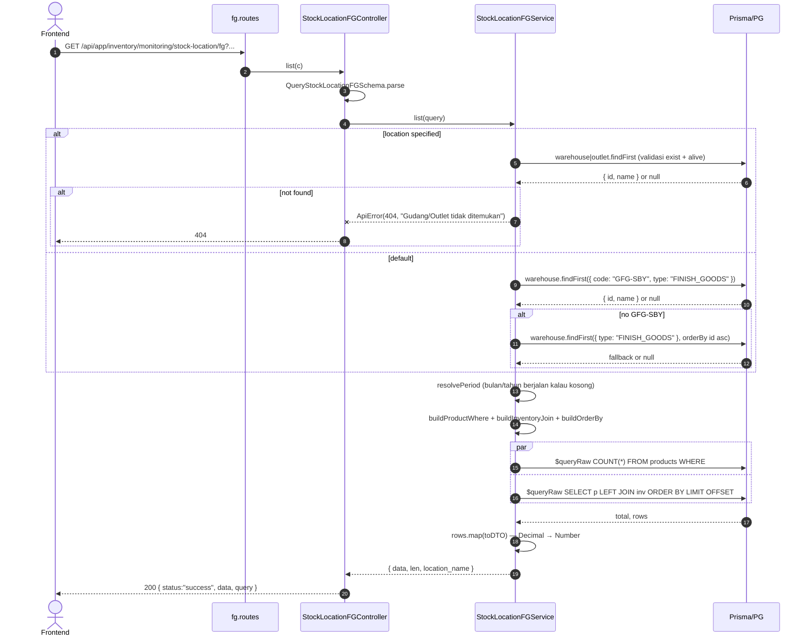
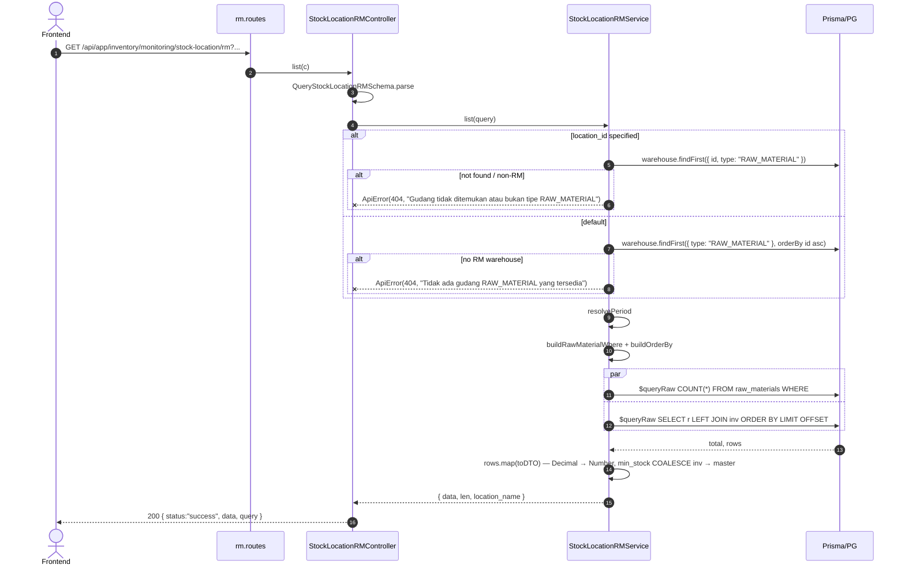

# Module: Inventory / Monitoring / Stock Location

**Base path**: `/api/app/inventory/monitoring/stock-location`
**Source**: `src/module/application/inventory/monitoring/stock-location/`
**Tests**: `src/tests/inventory/monitoring/stock-location/`
**Prisma models**: `Product`, `ProductInventory` (warehouse FG), `OutletInventory` (outlet), `RawMaterial`, `RawMaterialInventory` (warehouse RM), `Warehouse`, `Outlet`, `ProductType`, `ProductSize`, `UnitOfMaterial`, `RawMatCategories`, `UnitRawMaterial`

Snapshot stok untuk **satu lokasi** pada periode bulan/tahun tertentu. Bedanya dengan `stock-distribution`: stock-distribution = matrix multi-lokasi (1 item × banyak lokasi sebagai kolom dinamis); stock-location = single-location list (1 lokasi × banyak item sebagai baris). Sub-scope: **`fg`** untuk produk jadi (warehouse FG atau outlet) dan **`rm`** untuk bahan baku (warehouse RM saja).

> **Catatan khusus**:
> - **Dua sub-scope, satu modul**: `fg` dan `rm` punya schema/service/controller/routes terpisah tapi berbagi helper di `_shared/period.helpers.ts`. Endpoint simetris.
> - **Polymorphic JOIN (FG)**: kolom `inv` di-resolve via conditional JOIN — `product_inventories` (warehouse) atau `outlet_inventories` (outlet) tergantung `location_type`. SQL polymorphic dihandle dengan dua varian `Prisma.sql` join di `buildInventoryJoin` (ORM `include` tidak cocok untuk discriminator runtime).
> - **Default lokasi FG**: tanpa `location_type`/`location_id` → service auto-resolve ke warehouse FG dengan code `GFG-SBY`; fallback ke FG warehouse pertama by id; tidak ada → 404.
> - **Default lokasi RM**: tanpa `location_id` → RM warehouse pertama by id; tidak ada → 404. RM hanya menerima `WAREHOUSE` (`type = RAW_MATERIAL`) — tidak ada konsep outlet untuk RM.
> - **Default period**: tanpa `month`/`year` → bulan & tahun berjalan (via `resolvePeriod`).
> - **`min_stock`**: FG → hanya untuk OUTLET (`outlet_inventories.min_stock`); WAREHOUSE selalu null. RM → `COALESCE(raw_material_inventories.min_stock, raw_materials.min_stock)` (per-warehouse override → master fallback).
> - **Export cap**: 5.000 baris untuk kedua sub-scope. Hasil > cap → 400 (hindari silent truncation).

---

## 1. Scope & Fitur (PRD ringkas)

| Fitur                                  | Endpoint                                                    | Catatan                                                                                                       |
| :------------------------------------- | :---------------------------------------------------------- | :------------------------------------------------------------------------------------------------------------ |
| List stok FG per-lokasi                | `GET /fg`                                                   | Filter `search`, `type_id`, `gender`, `month`, `year`. Sort name/code/quantity/updated_at. Default lokasi GFG-SBY. |
| List lokasi tersedia (FG)              | `GET /fg/locations`                                         | Dropdown: warehouse FG aktif + outlet aktif (label `type: "WAREHOUSE" \| "OUTLET"`).                          |
| Export CSV (FG)                        | `GET /fg/export`                                            | RFC 4180 + UTF-8 BOM + CRLF. Cap `EXPORT_ROW_LIMIT = 5_000`.                                                  |
| List stok RM per-lokasi                | `GET /rm`                                                   | Filter `search`, `category_id`, `material_type`, `month`, `year`. Sort name/quantity/updated_at. Default RM warehouse pertama. |
| List lokasi tersedia (RM)              | `GET /rm/locations`                                         | Dropdown: warehouse RM aktif saja (`type: "WAREHOUSE"`).                                                       |
| Export CSV (RM)                        | `GET /rm/export`                                            | RFC 4180 + UTF-8 BOM + CRLF. Cap `EXPORT_ROW_LIMIT = 5_000`.                                                  |

### Out of scope (tidak dihandle di sini)

- **Matrix view multi-lokasi** — lihat `inventory/monitoring/stock-distribution/{fg,rm}`.
- **Pergerakan / ledger** — lihat `inventory/monitoring/stock-movement`.
- **Audit selisih transfer** — lihat `inventory/monitoring/stock-discrepancy`.
- **Mutasi stok** (in/out/transfer/return) — lihat modul mutasi (`fg`, `gr`, `do`, `tg`, `return`).

---

## 2. Arsitektur & Flow

### 2.1 Layer map

```text
┌──────────────────── stock-location.routes.ts ─────────────────────┐
│ Hono parent router: /fg → FGRoutes, /rm → RMRoutes                │
└──────────────────────────────────┬────────────────────────────────┘
                                   ▼
┌─── fg/fg.routes.ts ─────────┐   ┌─── rm/rm.routes.ts ─────────┐
│ GET /                       │   │ GET /                       │
│ GET /locations              │   │ GET /locations              │
│ GET /export                 │   │ GET /export                 │
└────────────────┬────────────┘   └────────────────┬────────────┘
                 ▼                                  ▼
   StockLocationFGController            StockLocationRMController
   - parse Query schema                  - parse Query schema
   - delegate ke Service                 - delegate ke Service
   - emit Response / Response(CSV)       - emit Response / Response(CSV)
                 │                                  │
                 ▼                                  ▼
   StockLocationFGService                StockLocationRMService
   ┌──────────────────────────────┐     ┌──────────────────────────────┐
   │ resolveLocation              │     │ resolveLocation              │
   │  (GFG-SBY → fallback FG-1st) │     │  (RM warehouse pertama)      │
   │ buildProductWhere            │     │ buildRawMaterialWhere        │
   │ buildInventoryJoin (WH/OUT)  │     │ (warehouse-only inv join)    │
   │ buildOrderBy (whitelist)     │     │ buildOrderBy (whitelist)     │
   │ list: Promise.all([cnt,rows])│     │ list: Promise.all([cnt,rows])│
   │ export: list + cap check     │     │ export: list + cap check     │
   │ listAvailableLocations: WH+O │     │ listAvailableLocations: WH   │
   └──────────────┬───────────────┘     └──────────────┬───────────────┘
                  │                                     │
                  └────── _shared/period.helpers.ts ────┤
                  └────── ../_shared/csv.helpers.ts ────┤
                                                        ▼
                                              Prisma → PostgreSQL
                                          ($queryRaw parametrized)
```

### 2.2 Mermaid: FG List flow (default + explicit)



### 2.3 Mermaid: RM List flow



### 2.4 Mermaid: Export flow (FG/RM identik)

```mermaid
sequenceDiagram
    autonumber
    actor FE as Frontend
    participant C as Controller
    participant S as Service
    participant DB as Prisma/PG

    FE->>C: GET /{fg|rm}/export?...
    C->>S: export(query)
    S->>S: list({ ...query, take: 5000, page: 1 })
    Note over S,DB: list internal: count + rows fetched in parallel
    S-->>S: result { data, len, location_name }
    alt result.len > 5_000
        S--xC: ApiError(400, "Hasil melebihi batas export...")
        C-->>FE: 400
    else data kosong
        C-->>FE: 200 { data: { message: "Tidak ada data untuk di-export" } }
    else
        C->>C: buildCsv(data, EXPORT_COLUMNS) — UTF-8 BOM + CRLF
        C-->>FE: 200 text/csv; filename="stock-location-{fg|rm}-{loc}-YYYY-MM-DD.csv"
    end
```

---

## 3. DTO / Schemas (end-to-end SSOT)

**Source FG**: [`src/module/application/inventory/monitoring/stock-location/fg/fg.schema.ts`](../../../../../src/module/application/inventory/monitoring/stock-location/fg/fg.schema.ts)
**Source RM**: [`src/module/application/inventory/monitoring/stock-location/rm/rm.schema.ts`](../../../../../src/module/application/inventory/monitoring/stock-location/rm/rm.schema.ts)

Semua enum ditarik dari Prisma client (`generated/prisma/client.js`). FE wajib mirror 1:1.

### 3.1 FG — `QueryStockLocationFGSchema`

```ts
import { z } from "zod";
import { GENDER } from "../../../../../../generated/prisma/client.js";

export const QueryStockLocationFGSchema = z.object({
    location_type: z.enum(["WAREHOUSE", "OUTLET"]).optional(),
    location_id:   z.coerce.number().int().positive().optional(),
    month:         z.coerce.number().int().min(1).max(12).optional(),
    year:          z.coerce.number().int().min(2000).max(2100).optional(),
    search:        z.string().trim().min(1).optional(),
    type_id:       z.coerce.number().int().positive().optional(),
    gender:        z.enum(GENDER).optional(),
    page:          z.coerce.number().int().positive().default(1).optional(),
    take:          z.coerce.number().int().positive().max(5000).default(50).optional(),
    sortBy:        z.enum(["name", "code", "quantity", "updated_at"]).default("name").optional(),
    sortOrder:     z.enum(["asc", "desc"]).default("asc").optional(),
});

export type QueryStockLocationFGDTO = z.infer<typeof QueryStockLocationFGSchema>;
```

| Field           | Type                                | Required | Default               | Constraint                          | Catatan                                                                  |
| :-------------- | :---------------------------------- | :------- | :-------------------- | :---------------------------------- | :----------------------------------------------------------------------- |
| `location_type` | `"WAREHOUSE" \| "OUTLET"`            | No       | (auto WAREHOUSE)      | enum                                | Bila kosong & `location_id` kosong → service auto GFG-SBY warehouse      |
| `location_id`   | `number`                            | No       | (auto)                | `int positive`                      | Pair dengan `location_type`                                              |
| `month`         | `number`                            | No       | bulan berjalan         | `int 1..12`                         | Period inventory snapshot                                                |
| `year`          | `number`                            | No       | tahun berjalan         | `int 2000..2100`                    | Period inventory snapshot                                                |
| `search`        | `string`                            | No       | —                     | `trim, min 1`                       | ILIKE `%search%` ke `products.name/code`                                  |
| `type_id`       | `number`                            | No       | —                     | `int positive`                      | Filter `product_types.id`                                                |
| `gender`        | `GENDER`                            | No       | —                     | `WOMEN \| MEN \| UNISEX`             | Prisma enum                                                              |
| `page`          | `number`                            | No       | `1`                   | `int >= 1`                          | Pagination                                                                |
| `take`          | `number`                            | No       | `50`                  | `int 1..5000`                       | Cap 5000                                                                  |
| `sortBy`        | `name \| code \| quantity \| updated_at` | No   | `"name"`              | whitelist                           | Via `SORT_COLUMN` Record sebelum `Prisma.raw`                            |
| `sortOrder`     | `"asc" \| "desc"`                    | No       | `"asc"`               | enum                                | Normalize ke `"ASC"`/`"DESC"` sebelum `Prisma.raw`                       |

### 3.2 FG — `ResponseStockLocationFGItemDTO`

```ts
export interface ResponseStockLocationFGItemDTO {
    product_code:  string;
    product_name:  string;
    type:          string;
    size:          number;
    gender:        string;
    uom:           string;
    quantity:      number;
    /** Hanya tersedia untuk OUTLET. */
    min_stock:     number | null;
    location_name: string;
}
```

| Field           | Source SQL                                                                       | Catatan                                                  |
| :-------------- | :------------------------------------------------------------------------------- | :------------------------------------------------------- |
| `product_code`  | `p.code`                                                                         | SKU                                                       |
| `product_name`  | `p.name`                                                                         | Nama produk                                               |
| `type`          | `COALESCE(pt.name, 'Unknown')`                                                   | Dari `product_types`                                      |
| `size`          | `COALESCE(ps.size, 0)::int`                                                      | Dari `product_size`                                       |
| `gender`        | `p.gender::text`                                                                 | `WOMEN`/`MEN`/`UNISEX`                                    |
| `uom`           | `COALESCE(u.name, 'Unknown')`                                                    | Unit of material                                          |
| `quantity`      | `COALESCE(inv.quantity, 0)::numeric`                                             | Decimal → number                                          |
| `min_stock`     | `COALESCE(inv.min_stock, 0)::numeric` (OUTLET) atau `NULL::numeric` (WAREHOUSE)  | OUTLET only; WAREHOUSE selalu null                        |
| `location_name` | (injected dari resolved location)                                                | Nama warehouse / outlet                                   |

### 3.3 FG — `ResponseStockLocationFGAvailableDTO`

```ts
export interface ResponseStockLocationFGAvailableDTO {
    id:   number;
    name: string;
    type: "WAREHOUSE" | "OUTLET";
}
```

Diisi `listAvailableLocations()` (warehouse `FINISH_GOODS` + outlet aktif, ordered by name).

### 3.4 RM — `QueryStockLocationRMSchema`

```ts
import { z } from "zod";
import { MaterialType } from "../../../../../../generated/prisma/client.js";

export const QueryStockLocationRMSchema = z.object({
    location_id:   z.coerce.number().int().positive().optional(),
    month:         z.coerce.number().int().min(1).max(12).optional(),
    year:          z.coerce.number().int().min(2000).max(2100).optional(),
    search:        z.string().trim().min(1).optional(),
    category_id:   z.coerce.number().int().positive().optional(),
    material_type: z.enum(MaterialType).optional(),
    page:          z.coerce.number().int().positive().default(1).optional(),
    take:          z.coerce.number().int().positive().max(5000).default(50).optional(),
    sortBy:        z.enum(["name", "quantity", "updated_at"]).default("name").optional(),
    sortOrder:     z.enum(["asc", "desc"]).default("asc").optional(),
});

export type QueryStockLocationRMDTO = z.infer<typeof QueryStockLocationRMSchema>;
```

| Field           | Type                              | Required | Default               | Constraint                | Catatan                                                                  |
| :-------------- | :-------------------------------- | :------- | :-------------------- | :------------------------ | :----------------------------------------------------------------------- |
| `location_id`   | `number`                          | No       | (auto)                | `int positive`            | Tanpa `location_type` — RM hanya WAREHOUSE (`type = RAW_MATERIAL`)        |
| `month`         | `number`                          | No       | bulan berjalan         | `int 1..12`               | Period inventory snapshot                                                |
| `year`          | `number`                          | No       | tahun berjalan         | `int 2000..2100`          | Period inventory snapshot                                                |
| `search`        | `string`                          | No       | —                     | `trim, min 1`             | ILIKE `%search%` ke `raw_materials.name`                                  |
| `category_id`   | `number`                          | No       | —                     | `int positive`            | Filter `raw_mat_categories.id`                                            |
| `material_type` | `MaterialType`                    | No       | —                     | `FO \| PCKG`              | Prisma enum (`MaterialType?`)                                            |
| `page`          | `number`                          | No       | `1`                   | `int >= 1`                | Pagination                                                                |
| `take`          | `number`                          | No       | `50`                  | `int 1..5000`             | Cap 5000                                                                  |
| `sortBy`        | `name \| quantity \| updated_at`   | No       | `"name"`              | whitelist                 | Via `SORT_COLUMN` Record sebelum `Prisma.raw`                            |
| `sortOrder`     | `"asc" \| "desc"`                  | No       | `"asc"`               | enum                      | Normalize ke `"ASC"`/`"DESC"`                                            |

### 3.5 RM — `ResponseStockLocationRMItemDTO`

```ts
export interface ResponseStockLocationRMItemDTO {
    name:          string;
    category:      string;
    unit:          string;
    material_type: "FO" | "PCKG" | null;
    quantity:      number;
    min_stock:     number | null;
    location_name: string;
}
```

| Field           | Source SQL                                                | Catatan                                                                       |
| :-------------- | :-------------------------------------------------------- | :---------------------------------------------------------------------------- |
| `name`          | `r.name`                                                  | Nama bahan baku                                                                |
| `category`      | `COALESCE(rc.name, 'Unknown')`                            | Dari `raw_mat_categories`                                                     |
| `unit`          | `COALESCE(ur.name, 'Unknown')`                            | Dari `unit_raw_materials`                                                     |
| `material_type` | `r.type::text`                                            | `FO \| PCKG \| NULL`                                                          |
| `quantity`      | `COALESCE(inv.quantity, 0)::numeric`                      | Decimal → number                                                              |
| `min_stock`     | `COALESCE(inv.min_stock, r.min_stock)::numeric`           | Per-warehouse override → fallback master `RawMaterial.min_stock` → null       |
| `location_name` | (injected dari resolved location)                         | Nama warehouse RM                                                             |

### 3.6 RM — `ResponseStockLocationRMAvailableDTO`

```ts
export interface ResponseStockLocationRMAvailableDTO {
    id:   number;
    name: string;
    type: "WAREHOUSE";
}
```

Diisi `listAvailableLocations()` (warehouse `RAW_MATERIAL` aktif saja, ordered by name).

### 3.7 Enum referensi (Prisma)

```prisma
enum GENDER       { WOMEN  MEN  UNISEX }
enum MaterialType { FO  PCKG }
enum WarehouseType { FINISH_GOODS  RAW_MATERIAL }
```

Lokasi: `prisma/schema.prisma`. FE wajib re-derive dari `@/shared/types` — **jangan duplikasi literal**.

---

## 4. Routing untuk integrasi Frontend

Base URL: `/api/app/inventory/monitoring/stock-location`. Semua endpoint terproteksi `authMiddleware` (session cookie + Redis session).

### 4.1 Daftar endpoint

> **Status code SOP**: semua endpoint sub-modul ini read-only → `200`. Tidak ada `201`/`202` di sini.

| #   | Method | Path             | Query type                     | Response (status)                                                                                                                 | Error utama                                                                                       |
| :-- | :----- | :--------------- | :----------------------------- | :-------------------------------------------------------------------------------------------------------------------------------- | :------------------------------------------------------------------------------------------------ |
| 1   | GET    | `/fg`            | `QueryStockLocationFGDTO`      | `{ data: ResponseStockLocationFGItemDTO[]; len: number; location_name: string }` (**200**)                                       | `400` Zod / `404` lokasi tidak ditemukan / `404` tidak ada FG warehouse                            |
| 2   | GET    | `/fg/locations`  | —                              | `ResponseStockLocationFGAvailableDTO[]` (**200**)                                                                                 | _(global error)_                                                                                  |
| 3   | GET    | `/fg/export`     | `QueryStockLocationFGDTO`      | `text/csv` attachment (**200**); empty → `{ message: "Tidak ada data untuk di-export" }` (**200**)                                | `400` Zod / `400` hasil > 5.000 / `404` lokasi tidak ditemukan                                    |
| 4   | GET    | `/rm`            | `QueryStockLocationRMDTO`      | `{ data: ResponseStockLocationRMItemDTO[]; len: number; location_name: string }` (**200**)                                       | `400` Zod / `404` lokasi tidak ditemukan / `404` tidak ada RM warehouse                            |
| 5   | GET    | `/rm/locations`  | —                              | `ResponseStockLocationRMAvailableDTO[]` (**200**)                                                                                 | _(global error)_                                                                                  |
| 6   | GET    | `/rm/export`     | `QueryStockLocationRMDTO`      | `text/csv` attachment (**200**); empty → JSON dengan message (**200**)                                                            | `400` Zod / `400` hasil > 5.000 / `404` lokasi tidak ditemukan                                    |

### 4.2 Konvensi response wrapper

```jsonc
{
  "status":  "success",
  "data":    {
    "data":          [/* ResponseStockLocation{FG,RM}ItemDTO[] */],
    "len":           123,
    "location_name": "Gudang FG SBY"
  },
  "query":   { /* echo of parsed query */ },
  "message": null
}
```

`/locations`:

```jsonc
{
  "status": "success",
  "data":   [ { "id": 1, "name": "Gudang FG SBY", "type": "WAREHOUSE" } /* , ... */ ]
}
```

`/export` empty:

```jsonc
{ "status":"success", "data":{ "message":"Tidak ada data untuk di-export" } }
```

`/export` data: `Content-Type: text/csv; charset=utf-8`, body diawali UTF-8 BOM, header CRLF-separated. Filename pattern: `stock-location-{fg|rm}-{Nama-Lokasi}-YYYY-MM-DD.csv`.

### 4.3 TanStack Query

Konvensi global di [`../../frontend-integration.md §2`](../../frontend-integration.md). Per-scope wiring di [`./frontend-integration.md`](./frontend-integration.md).

### 4.4 Header & auth

- `Cookie: session={{session_id}}` (wajib).
- GET-only — tidak butuh `x-xsrf-header`.
- `Accept: application/json` (default) atau auto `text/csv` untuk `/export` via `Content-Disposition`.

---

## 5. Database / Indexes

### 5.1 Model relevan

```prisma
model ProductInventory {
  id           Int      @id @default(autoincrement())
  product_id   Int
  warehouse_id Int
  quantity     Decimal  @default(0) @db.Decimal(18, 2)
  month        Int      @default(1)
  year         Int      @default(2024)
  product   Product   @relation(fields: [product_id], references: [id], onDelete: Cascade)
  warehouse Warehouse @relation(fields: [warehouse_id], references: [id], onDelete: Cascade)
  @@unique([product_id, warehouse_id, date, month, year])
  @@index([product_id])
  @@index([warehouse_id])
  @@index([date, month, year])
  @@map("product_inventories")
}

model OutletInventory {
  id         Int      @id @default(autoincrement())
  outlet_id  Int
  product_id Int
  quantity   Decimal  @default(0) @db.Decimal(18, 2)
  min_stock  Decimal? @db.Decimal(18, 2)
  month      Int      @default(1)
  year       Int      @default(2024)
  outlet  Outlet  @relation(fields: [outlet_id], references: [id], onDelete: Cascade)
  product Product @relation(fields: [product_id], references: [id], onDelete: Cascade)
  @@unique([outlet_id, product_id, month, year])
  @@index([outlet_id])
  @@index([product_id])
  @@index([month, year])
  @@map("outlet_inventories")
}

model RawMaterialInventory {
  id              Int         @id @default(autoincrement())
  raw_material_id Int
  warehouse_id    Int
  quantity        Decimal     @default(0) @db.Decimal(18, 2)
  min_stock       Decimal?    @db.Decimal(18, 2)
  month           Int         @default(1)
  year            Int         @default(2024)
  raw_material RawMaterial @relation(fields: [raw_material_id], references: [id], onDelete: Cascade)
  warehouse    Warehouse   @relation(fields: [warehouse_id], references: [id], onDelete: Cascade)
  @@unique([raw_material_id, warehouse_id, date, month, year])
  @@index([raw_material_id])
  @@index([warehouse_id])
  @@index([date, month, year])
  @@map("raw_material_inventories")
}
```

### 5.2 Index relevan untuk service ini

| Index                                                                            | Dipakai oleh                                                  |
| :------------------------------------------------------------------------------- | :------------------------------------------------------------ |
| `product_inventories.@@unique([product_id, warehouse_id, date, month, year])`    | JOIN `inv ON product_id AND warehouse_id AND month/year` (FG WAREHOUSE) |
| `outlet_inventories.@@unique([outlet_id, product_id, month, year])`              | JOIN `inv ON product_id AND outlet_id AND month/year` (FG OUTLET)       |
| `raw_material_inventories.@@unique([raw_material_id, warehouse_id, date, month, year])` | JOIN `inv ON raw_material_id AND warehouse_id AND month/year` (RM)      |
| `products.name` GIN trigram (`fg_search_trgm_indexes`)                            | `p.name ILIKE %search%` (FG)                                  |
| `products.code` GIN trigram                                                       | `p.code ILIKE %search%` (FG)                                  |
| `raw_materials.name` GIN trigram (`raw_materials_name_trgm`)                      | `r.name ILIKE %search%` (RM)                                  |

> Migrasi `20260519140000_outlet_inventory_period` menambah `month/year` di `outlet_inventories` (Phase A) — wajib agar JOIN OUTLET di sub-scope FG tidak full-scan.

---

## 6. Error catalog

| HTTP | Message                                                                                    | Trigger                                                                          | Scope     |
| :--- | :----------------------------------------------------------------------------------------- | :------------------------------------------------------------------------------- | :-------- |
| 400  | (Zod validation — mis. `gender` bukan WOMEN/MEN/UNISEX, `take > 5000`, `material_type` invalid) | Query param tidak match Zod schema                                              | FG / RM   |
| 400  | `"Hasil melebihi batas export (5000 baris). Persempit filter terlebih dahulu."`             | `/{fg,rm}/export` dipanggil dan total rows > `EXPORT_ROW_LIMIT`                  | FG / RM   |
| 404  | `"Gudang tidak ditemukan atau bukan tipe FINISH_GOODS"`                                     | FG `location_type=WAREHOUSE` & `location_id` tidak ditemukan / soft-deleted / non-FG | FG        |
| 404  | `"Outlet tidak ditemukan"`                                                                  | FG `location_type=OUTLET` & `location_id` tidak ditemukan / soft-deleted          | FG        |
| 404  | `"Tidak ada lokasi (Gudang/Outlet) yang tersedia"`                                          | FG default path: tidak ada FG warehouse sama sekali (DB kosong)                   | FG        |
| 404  | `"Gudang tidak ditemukan atau bukan tipe RAW_MATERIAL"`                                     | RM `location_id` tidak ditemukan / soft-deleted / non-RM                          | RM        |
| 404  | `"Tidak ada gudang RAW_MATERIAL yang tersedia"`                                             | RM default path: tidak ada RM warehouse sama sekali                                | RM        |
| 401  | `"Unauthorized, please login to access our system"`                                         | Session tidak valid                                                              | Global    |
| 500  | (Mask oleh global error handler)                                                            | Unhandled exception                                                              | Global    |

---

## 7. Testing

**Lokasi**: `src/tests/inventory/monitoring/stock-location/`

| File                                  | Jumlah test | Cakupan                                                                                                                                       |
| :------------------------------------ | :---------- | :-------------------------------------------------------------------------------------------------------------------------------------------- |
| `fg.service.test.ts`                  | 12          | list WAREHOUSE/OUTLET DTO mapping, default GFG-SBY, fallback ke FG warehouse pertama, 404 location, listAvailableLocations merging WH+outlet, export delegate + oversize 400 |
| `rm.service.test.ts`                  | 9           | list explicit RM warehouse, 404 non-RM, default first RM warehouse, 404 no RM warehouse, listAvailableLocations RM-only, export delegate + oversize 400               |
| `stock-location.routes.test.ts`       | 12          | FG (6): GET / 200, /sortBy 400, /location 404, /locations 200, /export CSV 200, /export empty body. RM (6): GET / 200, /sortBy 400, /location 404, /locations 200, /export CSV 200, /export empty body |

Saat ini **33/33 hijau**. Monitoring suite penuh: **70/70 hijau**.

**Perintah jalanin**:

```bash
rtk vitest run src/tests/inventory/monitoring/stock-location/
# atau seluruh monitoring
rtk vitest run src/tests/inventory/monitoring/
```

---

## 8. Postman testing

### 8.1 Variable koleksi

| Key          | Value                       |
| :----------- | :-------------------------- |
| `base_url`   | `http://localhost:3000`     |
| `session_id` | (isi setelah login)         |

### 8.2 Header global

```
Cookie: session={{session_id}}
```

### 8.3 Contoh request — List FG

```http
GET {{base_url}}/api/app/inventory/monitoring/stock-location/fg?location_type=WAREHOUSE&location_id=1&month=5&year=2026&page=1&take=25
Cookie: session={{session_id}}
```

Query opsional: `?search=TSHIRT` · `?type_id=2` · `?gender=MEN` · `?sortBy=quantity&sortOrder=desc`.

Expected (200):

```jsonc
{
  "status": "success",
  "data": {
    "data": [
      {
        "product_code": "TSHIRT-001",
        "product_name": "T-Shirt Basic",
        "type": "Apparel",
        "size": 40,
        "gender": "MEN",
        "uom": "pcs",
        "quantity": 80,
        "min_stock": null,
        "location_name": "Gudang FG SBY"
      }
    ],
    "len": 1,
    "location_name": "Gudang FG SBY"
  },
  "query": { /* echo */ }
}
```

### 8.4 Contoh request — List Available Locations FG

```http
GET {{base_url}}/api/app/inventory/monitoring/stock-location/fg/locations
Cookie: session={{session_id}}
```

Expected (200):

```jsonc
{
  "status": "success",
  "data": [
    { "id": 1, "name": "Gudang FG SBY", "type": "WAREHOUSE" },
    { "id": 5, "name": "Toko Mandalika A", "type": "OUTLET" }
  ]
}
```

### 8.5 Contoh request — Export FG

```http
GET {{base_url}}/api/app/inventory/monitoring/stock-location/fg/export?location_type=OUTLET&location_id=5&month=5&year=2026
Cookie: session={{session_id}}
```

Expected (200): `text/csv; charset=utf-8` body diawali UTF-8 BOM, header:

```
Nama Lokasi,SKU / Code,Nama Produk,Tipe,Size,Gender,UOM,Quantity,Min. Stok
```

### 8.6 Contoh request — List RM

```http
GET {{base_url}}/api/app/inventory/monitoring/stock-location/rm?location_id=3&month=5&year=2026&page=1&take=25
Cookie: session={{session_id}}
```

Query opsional: `?search=Kain` · `?category_id=1` · `?material_type=FO` · `?sortBy=quantity&sortOrder=desc`.

Expected (200):

```jsonc
{
  "status": "success",
  "data": {
    "data": [
      {
        "name": "Kain Katun",
        "category": "Fabric",
        "unit": "meter",
        "material_type": "FO",
        "quantity": 120,
        "min_stock": 20,
        "location_name": "Gudang RM SBY"
      }
    ],
    "len": 1,
    "location_name": "Gudang RM SBY"
  },
  "query": { /* echo */ }
}
```

### 8.7 Contoh request — List Available Locations RM

```http
GET {{base_url}}/api/app/inventory/monitoring/stock-location/rm/locations
Cookie: session={{session_id}}
```

Expected (200):

```jsonc
{
  "status": "success",
  "data": [
    { "id": 3, "name": "Gudang RM SBY", "type": "WAREHOUSE" }
  ]
}
```

### 8.8 Contoh request — Export RM

```http
GET {{base_url}}/api/app/inventory/monitoring/stock-location/rm/export?location_id=3&month=5&year=2026
Cookie: session={{session_id}}
```

Expected (200): `text/csv; charset=utf-8` body diawali UTF-8 BOM, header:

```
Nama Lokasi,Nama Bahan Baku,Kategori,Satuan,Tipe Material,Quantity,Min. Stok
```

Bila > 5.000 baris (400):

```jsonc
{
  "status":  "error",
  "message": "Hasil melebihi batas export (5000 baris). Persempit filter terlebih dahulu."
}
```

---

## 9. Activity log

Service ini **read-only** — tidak menulis ke `logging_activities`. Audit-trail asal data stok ada di modul mutasi (`inventory/fg`, `rm/import`, `gr`, `do`, `tg`, `return`) yang menulis ke `product_inventories` / `outlet_inventories` / `raw_material_inventories`.

---

## 10. Checklist saat menambah fitur

- [ ] Update `<scope>/<scope>.schema.ts` — Zod chain verbatim. Enum dari Prisma client, bukan literal.
- [ ] TDD: tulis test di `src/tests/inventory/monitoring/stock-location/{fg,rm,routes}.test.ts` **sebelum** implementasi.
- [ ] Update service — tetap `$queryRaw` dengan **`Prisma.sql` parametrized** + **identifier whitelist** untuk ORDER BY.
- [ ] Tambah filter ke kolom baru → periksa `prisma/schema.prisma` apakah ada index; tambah `@@index` + migration kalau perlu (lihat dev-flow §1.J.A).
- [ ] Update file ini (§3 DTO, §4 routing, §6 error catalog, §8 Postman example).
- [ ] Update [`./frontend-integration.md`](./frontend-integration.md).
- [ ] Update folder Postman `Inventory → Monitoring → Stock Location → {FG|RM}` di `docs/postman/erp-mandalika.postman_collection.json`.
- [ ] `rtk tsc --noEmit` → no errors.
- [ ] `rtk vitest run src/tests/inventory/monitoring/stock-location/` → all green.

---

## 11. Referensi silang

- [`../../README.md`](../../README.md) — index modul `inventory`
- [`../README.md`](../README.md) — index sub-modul `inventory/monitoring`
- [`../../frontend-integration.md`](../../frontend-integration.md) — konvensi global FE
- [`./frontend-integration.md`](./frontend-integration.md) — BE→FE contract per scope (FG + RM)
- [`../stock-distribution/README.md`](../stock-distribution/README.md) — sibling: matrix view (multi-lokasi)
- [`../stock-movement/README.md`](../stock-movement/README.md) — sibling: ledger pergerakan
- [`../stock-discrepancy/README.md`](../stock-discrepancy/README.md) — sibling: audit selisih
- [`../../../../../prisma/schema.prisma`](../../../../../prisma/schema.prisma) — `Product`, `ProductInventory`, `OutletInventory`, `RawMaterial`, `RawMaterialInventory`, enums
- [`../../../../../.claude/skills/dev-flow/SKILL.md`](../../../../../.claude/skills/dev-flow/SKILL.md) — SOP backend
