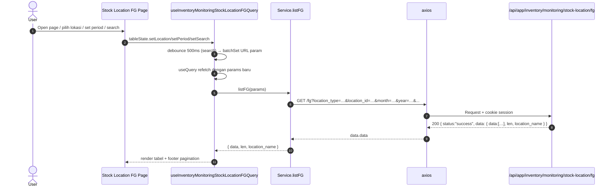
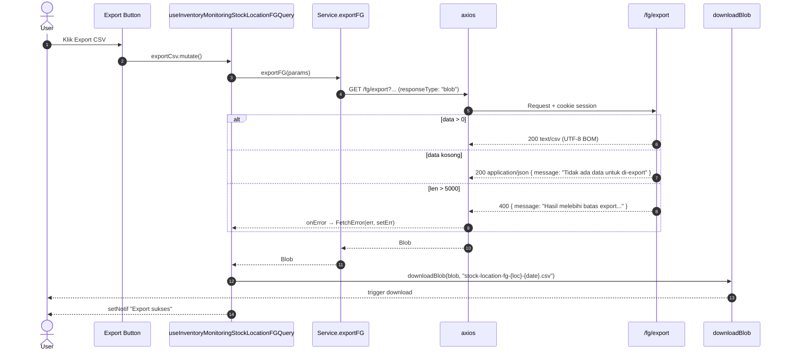

# Inventory / Monitoring / Stock Location — Frontend Integration (Scope Level)

Kontrak BE→FE (read-only single-location view). Komponen UI (selector lokasi, period filter, tabel produk/bahan baku, export button) diserahkan ke `frontend-dev-flow` SOP.

**Backend scope path**: `api/src/module/application/inventory/monitoring/stock-location/`
**Frontend scope path** (rencana): `app/src/app/(application)/inventory/monitoring/stock-location/server/`
**Endpoint base**: `/api/app/inventory/monitoring/stock-location`
**Status FE**: 🚧 TBD <!-- ubah ke ✅ Ready setelah file FE dibuat -->

**Dependencies**:

- Konvensi global modul → [`../../../frontend-integration.md`](../../../frontend-integration.md) (queryKey, error pattern, debounce, design tokens, status code expectation).
- BE scope doc → [`./README.md`](./README.md) (Zod source, endpoint detail, error catalog).
- SOP canonical: [frontend-dev-flow](../../../../../.claude/skills/frontend-dev-flow/SKILL.md).
- Test patterns: [frontend-testing](../../../../../.claude/skills/frontend-testing/SKILL.md).

Scope ini adalah **read-only single-location view** untuk monitoring stok di satu lokasi (warehouse / outlet) pada satu period (`month`/`year`). Dua sub-scope simetris: **FG** (Finished Goods, lokasi bisa warehouse FG atau outlet) dan **RM** (Raw Material, lokasi hanya warehouse RM). UI flow: pilih lokasi dari `/locations` → render tabel item + qty + min_stock. Tidak ada Create/Update/Delete/Status — hanya GET list, GET locations, dan Export CSV.

---

## 1. Schema BE verbatim

**Source BE**:

- `src/module/application/inventory/monitoring/stock-location/fg/fg.schema.ts`
- `src/module/application/inventory/monitoring/stock-location/rm/rm.schema.ts`

FE mirror WAJIB 1:1.

### 1.1 `QueryStockLocationFGSchema` (BE — verbatim)

```ts
import { z } from "zod";
import { GENDER } from "../../../../../../generated/prisma/client.js";

export const QueryStockLocationFGSchema = z.object({
    location_type: z.enum(["WAREHOUSE", "OUTLET"]).optional(),
    location_id:   z.coerce.number().int().positive().optional(),
    month:         z.coerce.number().int().min(1).max(12).optional(),
    year:          z.coerce.number().int().min(2000).max(2100).optional(),
    search:        z.string().trim().min(1).optional(),
    type_id:       z.coerce.number().int().positive().optional(),
    gender:        z.enum(GENDER).optional(),
    page:          z.coerce.number().int().positive().default(1).optional(),
    take:          z.coerce.number().int().positive().max(5000).default(50).optional(),
    sortBy:        z.enum(["name", "code", "quantity", "updated_at"]).default("name").optional(),
    sortOrder:     z.enum(["asc", "desc"]).default("asc").optional(),
});

export type QueryStockLocationFGDTO = z.infer<typeof QueryStockLocationFGSchema>;

export interface ResponseStockLocationFGItemDTO {
    product_code:  string;
    product_name:  string;
    type:          string;
    size:          number;
    gender:        string;
    uom:           string;
    quantity:      number;
    /** Hanya tersedia untuk OUTLET. */
    min_stock:     number | null;
    location_name: string;
}

export interface ResponseStockLocationFGAvailableDTO {
    id:   number;
    name: string;
    type: "WAREHOUSE" | "OUTLET";
}
```

**Field detail FG (Query)**:

| Field           | Type     | Required | Default               | Constraint                          | Catatan                                                                  |
| :-------------- | :------- | :------- | :-------------------- | :---------------------------------- | :----------------------------------------------------------------------- |
| `location_type` | `enum`   | ❌       | (auto)                | `WAREHOUSE \| OUTLET`               | Pair dengan `location_id`; kosong → default GFG-SBY.                     |
| `location_id`   | `number` | ❌       | (auto)                | `int().positive()`                  | Dari hasil `/fg/locations`.                                              |
| `month`         | `number` | ❌       | current month         | `int().min(1).max(12)`              | Default `resolvePeriod()` BE.                                            |
| `year`          | `number` | ❌       | current year          | `int().min(2000).max(2100)`         | Default `resolvePeriod()` BE.                                            |
| `search`        | `string` | ❌       | —                     | `trim, min 1`                       | ILIKE `name` / `code`. **WAJIB** debounce 500ms.                          |
| `type_id`       | `number` | ❌       | —                     | `int().positive()`                  | Filter `product_types.id`.                                               |
| `gender`        | `enum`   | ❌       | —                     | enum `GENDER`                       | Lihat §1.5.                                                              |
| `page`          | `number` | ❌       | `1`                   | `int().positive()`                  | —                                                                         |
| `take`          | `number` | ❌       | `50`                  | `int().positive().max(5000)`        | UI default 25; cap 5000.                                                 |
| `sortBy`        | `enum`   | ❌       | `"name"`              | whitelist                           | `name \| code \| quantity \| updated_at`.                                |
| `sortOrder`     | `enum`   | ❌       | `"asc"`               | `asc \| desc`                       | —                                                                         |

### 1.2 `QueryStockLocationRMSchema` (BE — verbatim)

```ts
import { z } from "zod";
import { MaterialType } from "../../../../../../generated/prisma/client.js";

export const QueryStockLocationRMSchema = z.object({
    location_id:   z.coerce.number().int().positive().optional(),
    month:         z.coerce.number().int().min(1).max(12).optional(),
    year:          z.coerce.number().int().min(2000).max(2100).optional(),
    search:        z.string().trim().min(1).optional(),
    category_id:   z.coerce.number().int().positive().optional(),
    material_type: z.enum(MaterialType).optional(),
    page:          z.coerce.number().int().positive().default(1).optional(),
    take:          z.coerce.number().int().positive().max(5000).default(50).optional(),
    sortBy:        z.enum(["name", "quantity", "updated_at"]).default("name").optional(),
    sortOrder:     z.enum(["asc", "desc"]).default("asc").optional(),
});

export type QueryStockLocationRMDTO = z.infer<typeof QueryStockLocationRMSchema>;

export interface ResponseStockLocationRMItemDTO {
    name:          string;
    category:      string;
    unit:          string;
    material_type: "FO" | "PCKG" | null;
    quantity:      number;
    min_stock:     number | null;
    location_name: string;
}

export interface ResponseStockLocationRMAvailableDTO {
    id:   number;
    name: string;
    type: "WAREHOUSE";
}
```

**Field detail RM (Query)**:

| Field           | Type     | Required | Default               | Constraint                          | Catatan                                                                  |
| :-------------- | :------- | :------- | :-------------------- | :---------------------------------- | :----------------------------------------------------------------------- |
| `location_id`   | `number` | ❌       | (auto)                | `int().positive()`                  | Dari hasil `/rm/locations`. RM hanya WAREHOUSE (`RAW_MATERIAL`).         |
| `month`         | `number` | ❌       | current month         | `int().min(1).max(12)`              | Default `resolvePeriod()` BE.                                            |
| `year`          | `number` | ❌       | current year          | `int().min(2000).max(2100)`         | Default `resolvePeriod()` BE.                                            |
| `search`        | `string` | ❌       | —                     | `trim, min 1`                       | ILIKE `name`. Debounce 500ms.                                            |
| `category_id`   | `number` | ❌       | —                     | `int().positive()`                  | Filter `raw_mat_categories.id`.                                          |
| `material_type` | `enum`   | ❌       | —                     | enum `MaterialType`                 | `FO \| PCKG`. Lihat §1.5.                                                |
| `page`          | `number` | ❌       | `1`                   | `int().positive()`                  | —                                                                         |
| `take`          | `number` | ❌       | `50`                  | `int().positive().max(5000)`        | UI default 25; cap 5000.                                                 |
| `sortBy`        | `enum`   | ❌       | `"name"`              | whitelist                           | `name \| quantity \| updated_at`.                                        |
| `sortOrder`     | `enum`   | ❌       | `"asc"`               | `asc \| desc`                       | —                                                                         |

### 1.3 Transformasi service (FG & RM — BE post-processing)

| Sub | Field di response  | Sumber Prisma / SQL                                                              | Transformasi service                                              |
| :-- | :----------------- | :------------------------------------------------------------------------------- | :---------------------------------------------------------------- |
| FG  | `product_code`     | `Product.code`                                                                   | —                                                                  |
| FG  | `product_name`     | `Product.name`                                                                   | —                                                                  |
| FG  | `type`             | `Product.product_type.name`                                                      | `COALESCE(..., 'Unknown')`                                         |
| FG  | `size`             | `Product.size.size`                                                              | `Number(...)`; fallback `0`                                        |
| FG  | `gender`           | `Product.gender` (enum)                                                          | `String(...)`                                                      |
| FG  | `uom`              | `Product.unit.name`                                                              | `COALESCE(..., 'Unknown')`                                         |
| FG  | `quantity`         | `product_inventories.quantity` (WAREHOUSE) atau `outlet_inventories.quantity` (OUTLET) | `Number(Decimal)` per period                                |
| FG  | `min_stock`        | `outlet_inventories.min_stock` (OUTLET only) atau `NULL` (WAREHOUSE)              | `Number(...)` atau `null`                                          |
| FG  | `location_name`    | (injected dari `resolveLocation()`)                                              | Nama warehouse / outlet                                            |
| RM  | `name`             | `RawMaterial.name`                                                               | —                                                                  |
| RM  | `category`         | `RawMaterial.raw_mat_category.name`                                              | `COALESCE(..., 'Unknown')`                                         |
| RM  | `unit`             | `RawMaterial.unit_raw_material.name`                                             | `COALESCE(..., 'Unknown')`                                         |
| RM  | `material_type`    | `RawMaterial.type` (enum, nullable)                                              | passthrough                                                        |
| RM  | `quantity`         | `raw_material_inventories.quantity` (warehouse RM)                               | `Number(Decimal)` per period                                       |
| RM  | `min_stock`        | `COALESCE(raw_material_inventories.min_stock, raw_materials.min_stock)`          | per-warehouse override → master fallback → `null`                  |
| RM  | `location_name`    | (injected dari `resolveLocation()`)                                              | Nama warehouse RM                                                  |

### 1.4 BulkStatus / BulkDelete

**N/A (read-only)** — scope ini tidak memiliki mutasi.

### 1.5 Enum referensi (Prisma)

```prisma
enum GENDER       { WOMEN  MEN  UNISEX }
enum MaterialType { FO  PCKG }
```

Lokasi BE: `prisma/schema.prisma`. FE import via `@/shared/types` — **JANGAN duplikasi literal**.

---

## 2. FE Schema Mirror

**File FG + RM digabung dalam satu schema file**: `app/src/app/(application)/inventory/monitoring/stock-location/server/inventory.monitoring.stock-location.schema.ts` 🚧 TBD

```ts
import { z } from "zod";
import { GENDER, MaterialType } from "@/shared/types";

// ─────────────────────────────────────────────────────────────────────────────
// FG
// ─────────────────────────────────────────────────────────────────────────────
export const QueryStockLocationFGSchema = z.object({
    location_type: z.enum(["WAREHOUSE", "OUTLET"]).optional(),
    location_id:   z.coerce.number().int().positive().optional(),
    month:         z.coerce.number().int().min(1).max(12).optional(),
    year:          z.coerce.number().int().min(2000).max(2100).optional(),
    search:        z.string().trim().min(1).optional(),
    type_id:       z.coerce.number().int().positive().optional(),
    gender:        z.enum(GENDER).optional(),
    page:          z.coerce.number().int().positive().default(1).optional(),
    take:          z.coerce.number().int().positive().max(5000).default(50).optional(),
    sortBy:        z.enum(["name", "code", "quantity", "updated_at"]).default("name").optional(),
    sortOrder:     z.enum(["asc", "desc"]).default("asc").optional(),
});

export type QueryStockLocationFGDTO = z.infer<typeof QueryStockLocationFGSchema>;

export interface ResponseStockLocationFGItemDTO {
    product_code:  string;
    product_name:  string;
    type:          string;
    size:          number;
    gender:        string;
    uom:           string;
    quantity:      number;
    min_stock:     number | null;
    location_name: string;
}

export interface ResponseStockLocationFGAvailableDTO {
    id:   number;
    name: string;
    type: "WAREHOUSE" | "OUTLET";
}

// ─────────────────────────────────────────────────────────────────────────────
// RM
// ─────────────────────────────────────────────────────────────────────────────
export const QueryStockLocationRMSchema = z.object({
    location_id:   z.coerce.number().int().positive().optional(),
    month:         z.coerce.number().int().min(1).max(12).optional(),
    year:          z.coerce.number().int().min(2000).max(2100).optional(),
    search:        z.string().trim().min(1).optional(),
    category_id:   z.coerce.number().int().positive().optional(),
    material_type: z.enum(MaterialType).optional(),
    page:          z.coerce.number().int().positive().default(1).optional(),
    take:          z.coerce.number().int().positive().max(5000).default(50).optional(),
    sortBy:        z.enum(["name", "quantity", "updated_at"]).default("name").optional(),
    sortOrder:     z.enum(["asc", "desc"]).default("asc").optional(),
});

export type QueryStockLocationRMDTO = z.infer<typeof QueryStockLocationRMSchema>;

export interface ResponseStockLocationRMItemDTO {
    name:          string;
    category:      string;
    unit:          string;
    material_type: "FO" | "PCKG" | null;
    quantity:      number;
    min_stock:     number | null;
    location_name: string;
}

export interface ResponseStockLocationRMAvailableDTO {
    id:   number;
    name: string;
    type: "WAREHOUSE";
}
```

**Diff vs BE**: (kosong — FE schema mirror 1:1 dengan BE).

---

## 3. Routing — Endpoint Table

Path prefix: `/api/app/inventory/monitoring/stock-location`. Semua endpoint **read-only `GET`** → tidak ada `setupCSRFToken()` di FE service.

| Method | Path             | Controller                                       | Query / Params                          | Success Status | Response Body                                                                                                  |
| :----- | :--------------- | :----------------------------------------------- | :-------------------------------------- | :------------- | :------------------------------------------------------------------------------------------------------------- |
| `GET`  | `/fg`            | `StockLocationFGController.list`                 | `QueryStockLocationFGSchema`            | `200`          | `ApiSuccessResponse<{ data: ResponseStockLocationFGItemDTO[]; len: number; location_name: string }>`           |
| `GET`  | `/fg/locations`  | `StockLocationFGController.listAvailableLocations` | —                                     | `200`          | `ApiSuccessResponse<ResponseStockLocationFGAvailableDTO[]>` — warehouse FG aktif + outlet aktif.               |
| `GET`  | `/fg/export`     | `StockLocationFGController.export`               | `QueryStockLocationFGSchema`            | `200`          | **Dual**: `text/csv; charset=utf-8` (Blob, `Content-Disposition: attachment`) saat ada data; `ApiSuccessResponse<{ message: string }>` (JSON) saat dataset kosong. |
| `GET`  | `/rm`            | `StockLocationRMController.list`                 | `QueryStockLocationRMSchema`            | `200`          | `ApiSuccessResponse<{ data: ResponseStockLocationRMItemDTO[]; len: number; location_name: string }>`           |
| `GET`  | `/rm/locations`  | `StockLocationRMController.listAvailableLocations` | —                                     | `200`          | `ApiSuccessResponse<ResponseStockLocationRMAvailableDTO[]>` — warehouse `RAW_MATERIAL` only.                   |
| `GET`  | `/rm/export`     | `StockLocationRMController.export`               | `QueryStockLocationRMSchema`            | `200`          | **Dual**: `text/csv` (Blob) saat ada data; JSON dengan message saat dataset kosong.                            |

**Catatan integrasi FE**:

- Tidak ada `POST` / `PUT` / `PATCH` / `DELETE` → **tidak panggil `setupCSRFToken()`** di service.
- `*/export` perlu `responseType: "blob"` di axios. Defensive: cek `blob.type` untuk membedakan blob CSV vs JSON empty message (lihat §7 Edge Cases).
- Error path standar (`401`/`403`/`500`) via global `FetchError(err, setErr)` di hook.

---

## 4. Service Class — FULL CODE

**File**: `app/src/app/(application)/inventory/monitoring/stock-location/server/inventory.monitoring.stock-location.service.ts` 🚧 TBD

> Scope ini **read-only GET**. **TIDAK ADA `setupCSRFToken()`** — CSRF token hanya diperlukan untuk POST/PUT/PATCH/DELETE.

```ts
import api from "@/lib/api";
import type { ApiSuccessResponse } from "@/shared/types/api";
import type {
    QueryStockLocationFGDTO,
    ResponseStockLocationFGItemDTO,
    ResponseStockLocationFGAvailableDTO,
    QueryStockLocationRMDTO,
    ResponseStockLocationRMItemDTO,
    ResponseStockLocationRMAvailableDTO,
} from "./inventory.monitoring.stock-location.schema";

const API = `${process.env.NEXT_PUBLIC_API}/api/app/inventory/monitoring/stock-location`;

type FGListResult = {
    data:          ResponseStockLocationFGItemDTO[];
    len:           number;
    location_name: string;
};

type RMListResult = {
    data:          ResponseStockLocationRMItemDTO[];
    len:           number;
    location_name: string;
};

export class InventoryMonitoringStockLocationService {
    // ─────────────────────────────────────────────────────────────────────────
    // FG
    // ─────────────────────────────────────────────────────────────────────────
    static async listFG(params: QueryStockLocationFGDTO): Promise<FGListResult> {
        try {
            const { data } = await api.get<ApiSuccessResponse<FGListResult>>(`${API}/fg`, { params });
            return data.data;
        } catch (error) {
            throw error;
        }
    }

    static async listFGLocations(): Promise<ResponseStockLocationFGAvailableDTO[]> {
        try {
            const { data } = await api.get<
                ApiSuccessResponse<ResponseStockLocationFGAvailableDTO[]>
            >(`${API}/fg/locations`);
            return data.data;
        } catch (error) {
            throw error;
        }
    }

    static async exportFG(params: QueryStockLocationFGDTO): Promise<Blob> {
        try {
            const { data } = await api.get<Blob>(`${API}/fg/export`, {
                params,
                responseType: "blob",
            });
            return data;
        } catch (error) {
            throw error;
        }
    }

    // ─────────────────────────────────────────────────────────────────────────
    // RM
    // ─────────────────────────────────────────────────────────────────────────
    static async listRM(params: QueryStockLocationRMDTO): Promise<RMListResult> {
        try {
            const { data } = await api.get<ApiSuccessResponse<RMListResult>>(`${API}/rm`, { params });
            return data.data;
        } catch (error) {
            throw error;
        }
    }

    static async listRMLocations(): Promise<ResponseStockLocationRMAvailableDTO[]> {
        try {
            const { data } = await api.get<
                ApiSuccessResponse<ResponseStockLocationRMAvailableDTO[]>
            >(`${API}/rm/locations`);
            return data.data;
        } catch (error) {
            throw error;
        }
    }

    static async exportRM(params: QueryStockLocationRMDTO): Promise<Blob> {
        try {
            const { data } = await api.get<Blob>(`${API}/rm/export`, {
                params,
                responseType: "blob",
            });
            return data;
        } catch (error) {
            throw error;
        }
    }
}

/** Shared helper: trigger browser download dari blob CSV. */
export function downloadBlob(blob: Blob, filename: string) {
    const url  = URL.createObjectURL(blob);
    const link = document.createElement("a");
    link.href     = url;
    link.download = filename;
    document.body.appendChild(link);
    link.click();
    document.body.removeChild(link);
    URL.revokeObjectURL(url);
}
```

---

## 5. Hooks — Split per Sub-Scope (FG & RM)

**File**: `app/src/app/(application)/inventory/monitoring/stock-location/server/use.inventory.monitoring.stock-location.ts` 🚧 TBD

> **READ-only scope** — WRITE = **N/A (read-only)**, ACTION = **N/A (read-only)**.
> Hook 5.2 dan 5.3 tidak ada. Replaced oleh export-csv mutation di hook 5.5 (Query wrapper).

```ts
"use client";
import { useQuery, useMutation } from "@tanstack/react-query";
import { useSetAtom } from "jotai";
import { useState, useEffect, useCallback } from "react";
import { useSearchParams } from "next/navigation";
import { useDebounce, useQueryParams } from "@/shared/hooks";
import { errorAtom, notificationAtom } from "@/shared/atoms";
import { FetchError } from "@/shared/api/errors";
import type { ResponseError } from "@/shared/types/api";
import {
    InventoryMonitoringStockLocationService,
    downloadBlob,
} from "./inventory.monitoring.stock-location.service";
import type {
    QueryStockLocationFGDTO,
    ResponseStockLocationFGItemDTO,
    ResponseStockLocationFGAvailableDTO,
    QueryStockLocationRMDTO,
    ResponseStockLocationRMItemDTO,
    ResponseStockLocationRMAvailableDTO,
} from "./inventory.monitoring.stock-location.schema";

const KEY_FG = ["inventory.monitoring.stock-location.fg"] as const;
const KEY_RM = ["inventory.monitoring.stock-location.rm"] as const;

type FGListResult = { data: ResponseStockLocationFGItemDTO[]; len: number; location_name: string };
type RMListResult = { data: ResponseStockLocationRMItemDTO[]; len: number; location_name: string };

// ════════════════════════════════════════════════════════════════════════════
// FG
// ════════════════════════════════════════════════════════════════════════════

// 5.1.FG READ — list stok per-lokasi
export function useInventoryMonitoringStockLocationFG(
    params: QueryStockLocationFGDTO,
    enabled = true,
) {
    return useQuery<FGListResult, ResponseError>({
        queryKey: [...KEY_FG, params],
        queryFn:  () => InventoryMonitoringStockLocationService.listFG(params),
        enabled,
        staleTime: 30_000,
    });
}

// 5.1.FG READ — list lokasi tersedia (dropdown selector)
export function useInventoryMonitoringStockLocationFGLocations(enabled = true) {
    return useQuery<ResponseStockLocationFGAvailableDTO[], ResponseError>({
        queryKey: [...KEY_FG, "locations"],
        queryFn:  () => InventoryMonitoringStockLocationService.listFGLocations(),
        enabled,
        staleTime: 5 * 60_000, // lokasi jarang berubah
    });
}

// 5.2.FG WRITE  — N/A (read-only)
// 5.3.FG ACTION — N/A (read-only)

// 5.4.FG TableState — URL sync + debounce search + period + location filter
export function useInventoryMonitoringStockLocationFGTableState() {
    const searchParams = useSearchParams();
    const { batchSet } = useQueryParams();

    const rawSearch = searchParams.get("search") ?? "";
    const [search, setSearchState] = useState(rawSearch);
    const debouncedSearch = useDebounce(search, 500);

    const setSearch = useCallback((val: string) => setSearchState(val), []);

    useEffect(() => {
        batchSet({ search: debouncedSearch || null, page: "1" });
    }, [debouncedSearch, batchSet]);

    const now           = new Date();
    const location_type = (searchParams.get("location_type") ?? undefined) as QueryStockLocationFGDTO["location_type"];
    const location_id   = searchParams.get("location_id") ? Number(searchParams.get("location_id")) : undefined;
    const page          = Number(searchParams.get("page") ?? 1);
    const take          = Number(searchParams.get("take") ?? 50);
    const sortBy        = (searchParams.get("sortBy") ?? "name") as QueryStockLocationFGDTO["sortBy"];
    const sortOrder     = (searchParams.get("sortOrder") ?? "asc") as QueryStockLocationFGDTO["sortOrder"];
    const month         = Number(searchParams.get("month") ?? now.getMonth() + 1);
    const year          = Number(searchParams.get("year")  ?? now.getFullYear());
    const type_id       = searchParams.get("type_id") ? Number(searchParams.get("type_id")) : undefined;
    const gender        = (searchParams.get("gender") ?? undefined) as QueryStockLocationFGDTO["gender"];

    const setLocation = useCallback((type: "WAREHOUSE" | "OUTLET", id: number) => {
        batchSet({ location_type: type, location_id: String(id), page: "1" });
    }, [batchSet]);

    const setPeriod = useCallback((m: number, y: number) => {
        batchSet({ month: String(m), year: String(y), page: "1" });
    }, [batchSet]);

    const setTypeId = useCallback((v: number | undefined) => {
        batchSet({ type_id: v ? String(v) : null, page: "1" });
    }, [batchSet]);

    const setGender = useCallback((v: QueryStockLocationFGDTO["gender"]) => {
        batchSet({ gender: v ?? null, page: "1" });
    }, [batchSet]);

    const setSort = useCallback((by: QueryStockLocationFGDTO["sortBy"], order: QueryStockLocationFGDTO["sortOrder"]) => {
        batchSet({ sortBy: by ?? null, sortOrder: order ?? null });
    }, [batchSet]);

    const params: QueryStockLocationFGDTO = {
        location_type, location_id, month, year,
        search: debouncedSearch || undefined,
        type_id, gender, page, take, sortBy, sortOrder,
    };

    return { params, search, setSearch, setLocation, setPeriod, setTypeId, setGender, setSort };
}

// 5.5.FG Query wrapper — bundle list + locations + export-csv
export function useInventoryMonitoringStockLocationFGQuery() {
    const setNotif = useSetAtom(notificationAtom);
    const setErr   = useSetAtom(errorAtom);

    const tableState = useInventoryMonitoringStockLocationFGTableState();
    const listQ      = useInventoryMonitoringStockLocationFG(tableState.params);
    const locsQ      = useInventoryMonitoringStockLocationFGLocations();

    const exportCsv = useMutation({
        mutationKey: [...KEY_FG, "export"],
        mutationFn:  () => InventoryMonitoringStockLocationService.exportFG(tableState.params),
        onSuccess:   (blob) => {
            const loc  = listQ.data?.location_name?.replace(/\s+/g, "-") ?? "lokasi";
            const date = new Date().toISOString().slice(0, 10);
            downloadBlob(blob, `stock-location-fg-${loc}-${date}.csv`);
            setNotif({ title: "Export sukses", message: "File CSV telah diunduh." });
        },
        onError: (err) => FetchError(err as ResponseError, setErr),
    });

    return { ...tableState, listQ, locsQ, exportCsv };
}

// ════════════════════════════════════════════════════════════════════════════
// RM
// ════════════════════════════════════════════════════════════════════════════

// 5.1.RM READ — list stok per-warehouse
export function useInventoryMonitoringStockLocationRM(
    params: QueryStockLocationRMDTO,
    enabled = true,
) {
    return useQuery<RMListResult, ResponseError>({
        queryKey: [...KEY_RM, params],
        queryFn:  () => InventoryMonitoringStockLocationService.listRM(params),
        enabled,
        staleTime: 30_000,
    });
}

// 5.1.RM READ — list warehouse RM tersedia
export function useInventoryMonitoringStockLocationRMLocations(enabled = true) {
    return useQuery<ResponseStockLocationRMAvailableDTO[], ResponseError>({
        queryKey: [...KEY_RM, "locations"],
        queryFn:  () => InventoryMonitoringStockLocationService.listRMLocations(),
        enabled,
        staleTime: 5 * 60_000,
    });
}

// 5.2.RM WRITE  — N/A (read-only)
// 5.3.RM ACTION — N/A (read-only)

// 5.4.RM TableState
export function useInventoryMonitoringStockLocationRMTableState() {
    const searchParams = useSearchParams();
    const { batchSet } = useQueryParams();

    const rawSearch = searchParams.get("search") ?? "";
    const [search, setSearchState] = useState(rawSearch);
    const debouncedSearch = useDebounce(search, 500);

    const setSearch = useCallback((val: string) => setSearchState(val), []);

    useEffect(() => {
        batchSet({ search: debouncedSearch || null, page: "1" });
    }, [debouncedSearch, batchSet]);

    const now            = new Date();
    const location_id    = searchParams.get("location_id") ? Number(searchParams.get("location_id")) : undefined;
    const page           = Number(searchParams.get("page") ?? 1);
    const take           = Number(searchParams.get("take") ?? 50);
    const sortBy         = (searchParams.get("sortBy") ?? "name") as QueryStockLocationRMDTO["sortBy"];
    const sortOrder      = (searchParams.get("sortOrder") ?? "asc") as QueryStockLocationRMDTO["sortOrder"];
    const month          = Number(searchParams.get("month") ?? now.getMonth() + 1);
    const year           = Number(searchParams.get("year")  ?? now.getFullYear());
    const category_id    = searchParams.get("category_id") ? Number(searchParams.get("category_id")) : undefined;
    const material_type  = (searchParams.get("material_type") ?? undefined) as QueryStockLocationRMDTO["material_type"];

    const setLocation = useCallback((id: number) => {
        batchSet({ location_id: String(id), page: "1" });
    }, [batchSet]);

    const setPeriod = useCallback((m: number, y: number) => {
        batchSet({ month: String(m), year: String(y), page: "1" });
    }, [batchSet]);

    const setCategoryId = useCallback((v: number | undefined) => {
        batchSet({ category_id: v ? String(v) : null, page: "1" });
    }, [batchSet]);

    const setMaterialType = useCallback((v: QueryStockLocationRMDTO["material_type"]) => {
        batchSet({ material_type: v ?? null, page: "1" });
    }, [batchSet]);

    const setSort = useCallback((by: QueryStockLocationRMDTO["sortBy"], order: QueryStockLocationRMDTO["sortOrder"]) => {
        batchSet({ sortBy: by ?? null, sortOrder: order ?? null });
    }, [batchSet]);

    const params: QueryStockLocationRMDTO = {
        location_id, month, year,
        search: debouncedSearch || undefined,
        category_id, material_type, page, take, sortBy, sortOrder,
    };

    return { params, search, setSearch, setLocation, setPeriod, setCategoryId, setMaterialType, setSort };
}

// 5.5.RM Query wrapper
export function useInventoryMonitoringStockLocationRMQuery() {
    const setNotif = useSetAtom(notificationAtom);
    const setErr   = useSetAtom(errorAtom);

    const tableState = useInventoryMonitoringStockLocationRMTableState();
    const listQ      = useInventoryMonitoringStockLocationRM(tableState.params);
    const locsQ      = useInventoryMonitoringStockLocationRMLocations();

    const exportCsv = useMutation({
        mutationKey: [...KEY_RM, "export"],
        mutationFn:  () => InventoryMonitoringStockLocationService.exportRM(tableState.params),
        onSuccess:   (blob) => {
            const loc  = listQ.data?.location_name?.replace(/\s+/g, "-") ?? "lokasi";
            const date = new Date().toISOString().slice(0, 10);
            downloadBlob(blob, `stock-location-rm-${loc}-${date}.csv`);
            setNotif({ title: "Export sukses", message: "File CSV telah diunduh." });
        },
        onError: (err) => FetchError(err as ResponseError, setErr),
    });

    return { ...tableState, listQ, locsQ, exportCsv };
}
```

---

## 6. End-to-End Flow

### 6.1 FG List flow



### 6.2 FG Export flow



### 6.3 RM flow

Identik dengan FG (§6.1 / §6.2), substitusi `Service.listRM` / `Service.exportRM`, hilangkan `location_type` (RM hanya WAREHOUSE), filter `gender`/`type_id` digantikan `material_type`/`category_id`.

---

## 7. Edge Cases & Per-Scope Quirks

| Topik                              | Catatan                                                                                                                                                                                                |
| :--------------------------------- | :----------------------------------------------------------------------------------------------------------------------------------------------------------------------------------------------------- |
| Default lokasi FG                  | Tanpa `location_type`/`location_id` BE auto-resolve `GFG-SBY` → fallback FG warehouse pertama. FE boleh ikut `data.location_name` dari response (atau pre-select via `/fg/locations`).                  |
| Default lokasi RM                  | Tanpa `location_id` BE auto-resolve RM warehouse pertama (by id). FE preferred: pre-select via `/rm/locations` agar URL eksplisit.                                                                      |
| Default period                     | Tanpa `month`/`year` BE pakai bulan+tahun berjalan (`resolvePeriod`). FE selector default = `new Date().getMonth()+1` & `getFullYear()`.                                                                |
| `min_stock` semantics              | FG: null untuk WAREHOUSE, numeric untuk OUTLET. RM: `COALESCE(inv.min_stock, master.min_stock)` — bisa per-warehouse override. UI render `-` saat null.                                                  |
| Debounce search                    | **WAJIB 500ms** untuk kedua sub-scope (`useDebounce(search, 500)`). Hindari trigger query per keystroke (ILIKE pakai trigram GIN — biaya per call signifikan).                                          |
| Export blob vs JSON empty          | `/{fg,rm}/export` saat dataset kosong → 200 JSON `{ message: "Tidak ada data untuk di-export" }`. Saat axios pakai `responseType: "blob"`, JSON tetap diterima sebagai Blob dengan `type: "application/json"`. Defensive: cek `blob.type` di onSuccess sebelum trigger download (atau parse `await blob.text()` lalu JSON.parse untuk handle empty case). |
| Export cap (5_000)                 | `len > 5000` → 400. FE handle via `FetchError(err, setErr)`. UI sebaiknya tampilkan hint "Persempit filter terlebih dahulu" di toolbar saat `listQ.data.len > 5000`.                                    |
| 404 lokasi soft-deleted            | Saat user pegang `location_id` di URL lalu warehouse/outlet itu di-soft-delete → BE return 404. FE redirect ke default (clear `location_type`/`location_id` URL param) atau tampilkan error UI.        |
| Permission                         | GET endpoint terproteksi `authMiddleware` global. Tidak ada granular permission per scope — semua user terotentikasi bisa akses.                                                                       |
| Pagination cap                     | `take ≤ 5_000`. Default UI = `25`. Jangan biarkan user input > 5_000 (Zod akan reject 400).                                                                                                            |
| URL sync                           | `useQueryParams.batchSet({ key: value \| null })` untuk set/clear param. Setiap filter change → reset `page: "1"`.                                                                                      |
| Locations cache TTL                | `staleTime: 5 * 60_000` untuk `/{fg,rm}/locations` — warehouse/outlet jarang ditambah-hapus runtime.                                                                                                    |
| FG WAREHOUSE filter                | `/fg/locations` hanya return FG warehouse (`type=FINISH_GOODS`) — non-FG warehouse tidak muncul di selector. RM warehouse muncul di sub-scope RM `/rm/locations` saja.                                  |

---

## 8. Cross-link

- BE scope README: [`./README.md`](./README.md)
- Module-level FE doc (konvensi global): [`../../../frontend-integration.md`](../../../frontend-integration.md)
- SOP `frontend-dev-flow` (component implementation): [SKILL.md](../../../../../.claude/skills/frontend-dev-flow/SKILL.md)
- SOP `frontend-testing` (test patterns): [SKILL.md](../../../../../.claude/skills/frontend-testing/SKILL.md)
- Sibling matrix view: [`../stock-distribution/README.md`](../stock-distribution/README.md) + [`../stock-distribution/frontend-integration.md`](../stock-distribution/frontend-integration.md)
- Postman folder: `Inventory → Monitoring → Stock Location → {FG | RM}` di [`docs/postman/erp-mandalika.postman_collection.json`](../../../../postman/erp-mandalika.postman_collection.json)
