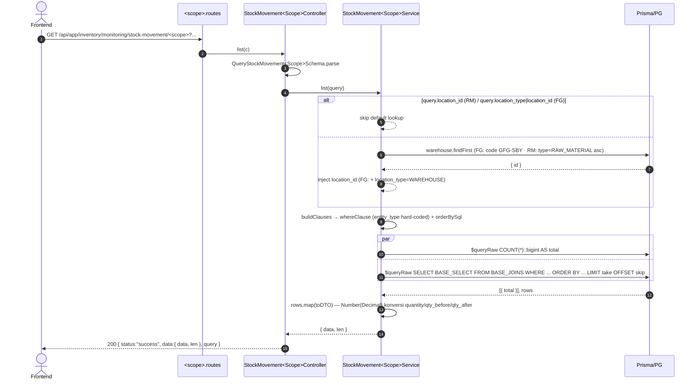

# Module: Inventory / Monitoring / Stock Movement (Pergerakan Stock)

**Base path**: `/api/app/inventory/monitoring/stock-movement`
**Source**: `src/module/application/inventory/monitoring/stock-movement/`
**Tests**: `src/tests/inventory/monitoring/stock-movement/`
**Prisma model**: `StockMovement` (tabel `stock_movements`)

Audit-trail (ledger) pergerakan stok lintas-entity (Product / RawMaterial) dan lintas-lokasi (Warehouse / Outlet), termasuk referensi ke dokumen sumber (Stock Transfer / Stock Return / Goods Receipt / Purchase Order / Production). **Modul dibagi menjadi dua sub-scope simetris** — `fg` (Finished Goods, `entity_type = PRODUCT`) dan `rm` (Raw Material, `entity_type = RAW_MATERIAL`) — mengikuti pola `stock-distribution`. Read-only — semua mutasi terjadi di modul sumber (FG, RM, GR, DO, TG, Return, Production, PO Receipt) yang menulis row ke `stock_movements` saat menjalankan transaksinya.

> **Catatan khusus**:
> - **Dua sub-scope, satu modul**: `fg` dan `rm` punya schema/service/controller/routes terpisah tapi berbagi primitif raw-SQL di `_shared/movement.helpers.ts` (date range, where combiner, ORDER BY whitelist).
> - **Server-side entity filter**: setiap sub-scope hard-code `sm.entity_type = '<TYPE>'::"MovementEntityType"` di base WHERE, jadi FE tidak perlu mengirim `entity_type` dan tidak bisa mencampur PRODUCT dengan RAW_MATERIAL.
> - **Polymorphic JOIN runtime**: discriminator `reference_type` (FG: STOCK_TRANSFER / STOCK_RETURN / GOODS_RECEIPT; RM: PURCHASE_ORDER / GOODS_RECEIPT / STOCK_TRANSFER / PRODUCTION). LEFT JOIN dengan kondisi `AND sm.reference_type = '<X>'` agar query plan tetap satu trip.
> - **Raw SQL justified**: Prisma ORM `include` tidak bisa kondisional berdasarkan discriminator runtime → N+1. `$queryRaw` dengan parameterized tagged template + identifier whitelist untuk ORDER BY (lihat §1.J.B dev-flow SOP).
> - **Default lokasi**: bila filter lokasi tidak dikirim, FG service auto-apply warehouse `GFG-SBY`; RM service auto-apply warehouse `RAW_MATERIAL` pertama (asc by id). Hindari UI meledak menampilkan semua history lintas-warehouse.
> - **Export cap**: 50.000 baris per sub-scope. Lebih → 400. Counter dijalankan sebelum SELECT.

---

## 1. Scope & Fitur (PRD ringkas)

| Fitur                                  | Endpoint                                                   | Catatan                                                                                                       |
| :------------------------------------- | :--------------------------------------------------------- | :------------------------------------------------------------------------------------------------------------ |
| List pergerakan FG (paginated)         | `GET /fg`                                                  | Filter polymorphic (location, movement, reference) + search produk + date range. Default lokasi `GFG-SBY`. Server-side `entity_type=PRODUCT`. |
| Export FG CSV                          | `GET /fg/export`                                           | RFC 4180 + UTF-8 BOM + CRLF. Cap `EXPORT_MAX_ROWS = 50_000`; lebih → 400.                                      |
| List pergerakan RM (paginated)         | `GET /rm`                                                  | Filter polymorphic (location, movement, reference) + search bahan baku/barcode + date range. Default lokasi: warehouse `RAW_MATERIAL` pertama. Server-side `entity_type=RAW_MATERIAL`, `location_type=WAREHOUSE`. |
| Export RM CSV                          | `GET /rm/export`                                           | RFC 4180 + UTF-8 BOM + CRLF. Cap `EXPORT_MAX_ROWS = 50_000`; lebih → 400.                                      |

### Out of scope (tidak dihandle di sini)

- **Membuat / memutasi stok** (in/out, transfer, return, GR, PO receipt, production) — service ini hanya **membaca** `stock_movements`. Tulis-nya dilakukan di:
  - `inventory/fg` (Create/Update FG) — initial / adjust
  - `inventory/rm/stock` (RM stock entries)
  - `inventory-v2/gr` (Goods Receipt FG → +stock)
  - `inventory-v2/do` & `inventory-v2/tg` (Stock Transfer Out/In)
  - `inventory-v2/return` (Stock Return)
  - `purchase/receipt` (PO Receipt RM → +stock)
  - `manufacturing/production` (RM consumption + FG output)
- **Snapshot stok per-lokasi current** — lihat `inventory/monitoring/stock-distribution/{fg|rm}`.
- **Single-location stock detail** — lihat `inventory/monitoring/stock-location`.
- **Discrepancy report** — lihat `inventory/monitoring/stock-discrepancy`.

---

## 2. Arsitektur & Flow

### 2.1 Layer map

```text
┌──────────────────── stock-movement.routes.ts ─────────────────────┐
│ Hono parent router: /fg → FGRoutes, /rm → RMRoutes                 │
└──────────────────────────────────┬─────────────────────────────────┘
                                   ▼
┌─── fg/fg.routes.ts ─────────┐   ┌─── rm/rm.routes.ts ─────────┐
│ GET /export                 │   │ GET /export                 │
│ GET /                       │   │ GET /                       │
└────────────────┬────────────┘   └────────────────┬────────────┘
                 ▼                                  ▼
   StockMovementFGController            StockMovementRMController
   - parse Query schema                  - parse Query schema
   - delegate ke Service                 - delegate ke Service
   - emit Response / Response(CSV)       - emit Response / Response(CSV)
                 │                                  │
                 ▼                                  ▼
   StockMovementFGService                StockMovementRMService
   ┌────────────────────────────┐       ┌────────────────────────────┐
   │ applyDefaultLocation       │       │ applyDefaultLocation       │
   │  → warehouse code GFG-SBY  │       │  → warehouse type=RM (asc) │
   │ buildClauses (entity=FG)   │       │ buildClauses (entity=RM,   │
   │ Promise.all([count, rows]) │       │   loc=WAREHOUSE)           │
   │ rows.map(toDTO)            │       │ Promise.all([count, rows]) │
   │ list() / export()          │       │ rows.map(toDTO)            │
   │ BASE_SELECT + BASE_JOINS   │       │ list() / export()          │
   │  (FG-specific joins)       │       │ BASE_SELECT + BASE_JOINS   │
   └────────────────────────────┘       │  (RM-specific joins)       │
                                        └────────────────────────────┘
                 │                                  │
                 └───── _shared/movement.helpers ───┤
                                                    ▼
                                           Prisma → PostgreSQL
                                           ($queryRaw parametrized)
```

### 2.2 Mermaid: List flow (FG / RM identical)



### 2.3 Mermaid: Export flow (FG / RM identical)

```mermaid
sequenceDiagram
    autonumber
    actor FE as Frontend
    participant R as <scope>.routes
    participant C as StockMovement<Scope>Controller
    participant S as StockMovement<Scope>Service
    participant DB as Prisma/PG

    FE->>R: GET /api/app/inventory/monitoring/stock-movement/<scope>/export?...
    R->>C: export(c)
    C->>C: QueryStockMovement<Scope>Schema.parse
    C->>S: export(query)
    S->>S: applyDefaultLocation + buildClauses
    S->>DB: $queryRaw COUNT(*)::bigint
    DB-->>S: total
    alt total > 50_000
        S--xC: throw ApiError(400, "Hasil melebihi batas export...")
        C-->>FE: 400 { status:"error", message }
    else
        S->>DB: $queryRaw SELECT ... LIMIT 50_000
        DB-->>S: rows
        S->>S: rows.map(toDTO)
        S-->>C: ResponseStockMovement<Scope>DTO[]
        alt rows empty
            C-->>FE: 200 { data:{ message:"Tidak ada data untuk di-export" } }
        else
            C->>C: buildCsv(rows, EXPORT_COLUMNS) — UTF-8 BOM + CRLF
            C-->>FE: 200 text/csv; Content-Disposition: attachment
        end
    end
```

---

## 3. DTO / Schemas (end-to-end SSOT)

Setiap sub-scope punya schema sendiri. Helper umum di `_shared/movement.helpers.ts` (date-range conditions, where combiner, ORDER BY whitelist) **tidak** mengandung Zod — hanya primitif SQL.

Sumber:

- FG → [`src/module/application/inventory/monitoring/stock-movement/fg/fg.schema.ts`](../../../../../src/module/application/inventory/monitoring/stock-movement/fg/fg.schema.ts)
- RM → [`src/module/application/inventory/monitoring/stock-movement/rm/rm.schema.ts`](../../../../../src/module/application/inventory/monitoring/stock-movement/rm/rm.schema.ts)

### 3.1 `QueryStockMovementFGSchema`

```ts
import { z } from "zod";
import {
    MovementLocationType,
    MovementType,
    MovementRefType,
} from "../../../../../../generated/prisma/client.js";

const isoDateString = z
    .string()
    .regex(/^\d{4}-\d{2}-\d{2}(T.*)?$/, "Format tanggal harus ISO (YYYY-MM-DD)");

export const QueryStockMovementFGSchema = z.object({
    page:           z.coerce.number().int().positive().default(1).optional(),
    take:           z.coerce.number().int().positive().max(5000).default(50).optional(),
    /** Cari berdasarkan nama produk atau kode produk */
    search:         z.string().trim().min(1).optional(),
    entity_id:      z.coerce.number().int().positive().optional(),
    location_type:  z.enum(MovementLocationType).optional(),
    location_id:    z.coerce.number().int().positive().optional(),
    movement_type:  z.enum(MovementType).optional(),
    reference_type: z.enum(MovementRefType).optional(),
    reference_id:   z.coerce.number().int().positive().optional(),
    date_from:      isoDateString.optional(),
    date_to:        isoDateString.optional(),
    created_by:     z.string().trim().min(1).optional(),
    sortBy:         z.enum(["created_at", "quantity"]).default("created_at").optional(),
    sortOrder:      z.enum(["asc", "desc"]).default("desc").optional(),
});

export type QueryStockMovementFGDTO = z.infer<typeof QueryStockMovementFGSchema>;
```

| Field            | Type                    | Required | Default       | Constraint                          | Error msg                                          | Catatan                                                                  |
| :--------------- | :---------------------- | :------- | :------------ | :---------------------------------- | :------------------------------------------------- | :----------------------------------------------------------------------- |
| `page`           | `number`                | No       | `1`           | `int >= 1`                          | (Zod default)                                      | Coerce dari string query                                                  |
| `take`           | `number`                | No       | `50`          | `int 1..5000`                       | (Zod default)                                      | Cap 5000 untuk mencegah satu request berat                               |
| `search`         | `string`                | No       | —             | `trim, min 1 char`                  | (Zod default)                                      | Match ILIKE `%search%` ke `p.name/code`                                  |
| `entity_id`      | `number`                | No       | —             | `int positive`                      | (Zod default)                                      | Drill ke produk spesifik                                                  |
| `location_type`  | `MovementLocationType`  | No       | (auto GFG-SBY) | enum                                | (Zod default)                                      | `WAREHOUSE` \| `OUTLET`. Bila tidak dikirim → default warehouse GFG-SBY   |
| `location_id`    | `number`                | No       | (auto)        | `int positive`                      | (Zod default)                                      | Coerce                                                                    |
| `movement_type`  | `MovementType`          | No       | —             | enum                                | (Zod default)                                      | 10 nilai (lihat §3.4)                                                     |
| `reference_type` | `MovementRefType`       | No       | —             | enum                                | (Zod default)                                      | Relevan untuk FG: `STOCK_TRANSFER` \| `STOCK_RETURN` \| `GOODS_RECEIPT`   |
| `reference_id`   | `number`                | No       | —             | `int positive`                      | (Zod default)                                      | Pair dengan `reference_type`                                              |
| `date_from`      | `string` (ISO date)     | No       | —             | regex `^\d{4}-\d{2}-\d{2}(T.*)?$`   | `"Format tanggal harus ISO (YYYY-MM-DD)"`           | `new Date(date_from)` → bind sebagai timestamp param                      |
| `date_to`        | `string` (ISO date)     | No       | —             | regex `^\d{4}-\d{2}-\d{2}(T.*)?$`   | `"Format tanggal harus ISO (YYYY-MM-DD)"`           | Service set ke `setUTCHours(23,59,59,999)` agar konsisten lintas-timezone |
| `created_by`     | `string`                | No       | —             | `trim, min 1`                       | (Zod default)                                      | Match ILIKE `%created_by%` ke `sm.created_by`                             |
| `sortBy`         | `"created_at"\|"quantity"` | No    | `"created_at"` | enum                              | (Zod default)                                      | Whitelist via `SORT_COLUMN` Record sebelum `Prisma.raw`                  |
| `sortOrder`      | `"asc"\|"desc"`         | No       | `"desc"`      | enum                                | (Zod default)                                      | Di-normalize ke literal `"ASC"`/`"DESC"` sebelum `Prisma.raw`            |

### 3.2 `ResponseStockMovementFGDTO`

```ts
export interface ResponseStockMovementFGDTO {
    id:                number;
    entity_id:         number;
    product_code:      string;
    product_name:      string | null;
    category:          string | null;
    size:              string | null;
    gender:            string | null;
    location_type:     string;
    location_id:       number;
    location_name:     string | null;
    movement_type:     string;
    quantity:          number;
    /** Running balance sebelum mutasi */
    qty_before:        number;
    /** Running balance setelah mutasi */
    qty_after:         number;
    reference_id:      number | null;
    reference_type:    string | null;
    reference_code:    string | null;
    reference_subtype: string | null;
    destination_name:  string | null;
    created_by:        string | null;
    created_at:        Date;
}
```

| Field               | Source SQL                                                        | Catatan                                                                                  |
| :------------------ | :---------------------------------------------------------------- | :--------------------------------------------------------------------------------------- |
| `id`                | `sm.id`                                                           | PK row pergerakan                                                                         |
| `entity_id`         | `sm.entity_id`                                                    | FK ke `products.id`                                                                       |
| `product_code`      | `p.code`                                                           | INNER JOIN — selalu ada                                                                   |
| `product_name`      | `p.name`                                                           | INNER JOIN — selalu ada                                                                   |
| `category`          | `pt.name`                                                          | Product type (`product_types.name`)                                                        |
| `size`              | `ps.size::text`                                                    | Dari `product_size.size`                                                                  |
| `gender`            | `p.gender::text`                                                   | `WOMEN \| MEN \| UNISEX`                                                                  |
| `location_type`     | `sm.location_type::text`                                           | `WAREHOUSE` \| `OUTLET`                                                                  |
| `location_id`       | `sm.location_id`                                                  | FK ke `warehouses.id` atau `outlets.id`                                                   |
| `location_name`     | `CASE location_type → w.name \| o.name`                            | Resolved dari tabel union                                                                 |
| `movement_type`     | `sm.movement_type::text`                                           | Lihat §3.4                                                                                |
| `quantity`          | `sm.quantity::numeric`                                             | Decimal(18,2) → number via `Number()` di toDTO                                            |
| `qty_before`        | `sm.qty_before::numeric`                                           | Running balance sebelum                                                                   |
| `qty_after`         | `sm.qty_after::numeric`                                            | Running balance sesudah                                                                   |
| `reference_id`      | `sm.reference_id`                                                  | FK ke STxx / SRxx / GRxx (tergantung `reference_type`)                                   |
| `reference_type`    | `sm.reference_type::text`                                          | `STOCK_TRANSFER` \| `STOCK_RETURN` \| `GOODS_RECEIPT` \| `null`                          |
| `reference_code`    | `CASE reference_type → st/sr/gr.number`                            | `transfer_number` / `return_number` / `gr_number`                                         |
| `reference_subtype` | `CASE → 'DO'/'TG'/'RETURN'/'GR'`                                   | Sub-tipe DO (ke outlet) vs TG (antar warehouse)                                          |
| `destination_name`  | `CASE movement_type + reference_type → tujuan/asal`                | "OUTBOUND" / "INBOUND" / "PRODUCTION / INBOUND" fallback                                  |
| `created_by`        | `sm.created_by`                                                    | Email/identifier user                                                                     |
| `created_at`        | `sm.created_at`                                                    | Timestamp                                                                                  |

### 3.3 `QueryStockMovementRMSchema`

```ts
import { z } from "zod";
import {
    MovementType,
    MovementRefType,
} from "../../../../../../generated/prisma/client.js";

const isoDateString = z
    .string()
    .regex(/^\d{4}-\d{2}-\d{2}(T.*)?$/, "Format tanggal harus ISO (YYYY-MM-DD)");

export const QueryStockMovementRMSchema = z.object({
    page:           z.coerce.number().int().positive().default(1).optional(),
    take:           z.coerce.number().int().positive().max(5000).default(50).optional(),
    /** Cari berdasarkan nama bahan baku atau barcode */
    search:         z.string().trim().min(1).optional(),
    entity_id:      z.coerce.number().int().positive().optional(),
    location_id:    z.coerce.number().int().positive().optional(),
    movement_type:  z.enum(MovementType).optional(),
    reference_type: z.enum(MovementRefType).optional(),
    reference_id:   z.coerce.number().int().positive().optional(),
    date_from:      isoDateString.optional(),
    date_to:        isoDateString.optional(),
    created_by:     z.string().trim().min(1).optional(),
    sortBy:         z.enum(["created_at", "quantity"]).default("created_at").optional(),
    sortOrder:      z.enum(["asc", "desc"]).default("desc").optional(),
});

export type QueryStockMovementRMDTO = z.infer<typeof QueryStockMovementRMSchema>;
```

| Field            | Type                    | Required | Default              | Constraint                          | Error msg                                          | Catatan                                                                       |
| :--------------- | :---------------------- | :------- | :------------------- | :---------------------------------- | :------------------------------------------------- | :---------------------------------------------------------------------------- |
| `page`           | `number`                | No       | `1`                  | `int >= 1`                          | (Zod default)                                      | Coerce                                                                         |
| `take`           | `number`                | No       | `50`                 | `int 1..5000`                       | (Zod default)                                      | Cap 5000                                                                       |
| `search`         | `string`                | No       | —                    | `trim, min 1 char`                  | (Zod default)                                      | Match ILIKE `%search%` ke `rm.name` + `rm.barcode`                            |
| `entity_id`      | `number`                | No       | —                    | `int positive`                      | (Zod default)                                      | Drill ke RM spesifik                                                           |
| `location_id`    | `number`                | No       | (auto, RM warehouse) | `int positive`                      | (Zod default)                                      | Bila tidak dikirim → default warehouse `RAW_MATERIAL` pertama (asc by id)     |
| `movement_type`  | `MovementType`          | No       | —                    | enum                                | (Zod default)                                      | Lihat §3.4                                                                     |
| `reference_type` | `MovementRefType`       | No       | —                    | enum                                | (Zod default)                                      | Relevan untuk RM: `PURCHASE_ORDER` \| `GOODS_RECEIPT` \| `STOCK_TRANSFER` \| `PRODUCTION` |
| `reference_id`   | `number`                | No       | —                    | `int positive`                      | (Zod default)                                      | Pair dengan `reference_type`                                                   |
| `date_from`      | `string` (ISO date)     | No       | —                    | regex `^\d{4}-\d{2}-\d{2}(T.*)?$`   | `"Format tanggal harus ISO (YYYY-MM-DD)"`           | `new Date(date_from)`                                                          |
| `date_to`        | `string` (ISO date)     | No       | —                    | regex `^\d{4}-\d{2}-\d{2}(T.*)?$`   | `"Format tanggal harus ISO (YYYY-MM-DD)"`           | `setUTCHours(23,59,59,999)` di service                                         |
| `created_by`     | `string`                | No       | —                    | `trim, min 1`                       | (Zod default)                                      | Match ILIKE `%created_by%`                                                    |
| `sortBy`         | `"created_at"\|"quantity"` | No    | `"created_at"`        | enum                              | (Zod default)                                      | Whitelist via `SORT_COLUMN`                                                    |
| `sortOrder`      | `"asc"\|"desc"`         | No       | `"desc"`             | enum                                | (Zod default)                                      | Normalize ke `"ASC"`/`"DESC"`                                                 |

> **Catatan**: RM tidak menerima `location_type` — secara struktural raw material hanya berdiam di warehouse. Service hard-code `sm.location_type = 'WAREHOUSE'::"MovementLocationType"`.

### 3.4 `ResponseStockMovementRMDTO`

```ts
export interface ResponseStockMovementRMDTO {
    id:                number;
    entity_id:         number;
    barcode:           string | null;
    rm_name:           string;
    category:          string | null;
    unit:              string | null;
    material_type:     string | null;
    location_id:       number;
    location_name:     string | null;
    movement_type:     string;
    quantity:          number;
    qty_before:        number;
    qty_after:         number;
    reference_id:      number | null;
    reference_type:    string | null;
    reference_code:    string | null;
    reference_subtype: string | null;
    destination_name:  string | null;
    created_by:        string | null;
    created_at:        Date;
}
```

| Field               | Source SQL                                                         | Catatan                                                                                  |
| :------------------ | :----------------------------------------------------------------- | :--------------------------------------------------------------------------------------- |
| `id`                | `sm.id`                                                            | PK row pergerakan                                                                         |
| `entity_id`         | `sm.entity_id`                                                     | FK ke `raw_materials.id`                                                                  |
| `barcode`           | `rm.barcode`                                                       | Nullable di tabel raw_materials                                                           |
| `rm_name`           | `rm.name`                                                          | INNER JOIN — selalu ada                                                                   |
| `category`          | `rmc.name`                                                         | `raw_mat_categories.name`                                                                 |
| `unit`              | `urm.name`                                                         | `unit_raw_materials.name`                                                                 |
| `material_type`     | `rm.type::text`                                                    | `FO \| PCKG \| null`                                                                      |
| `location_id`       | `sm.location_id`                                                   | FK ke `warehouses.id`                                                                     |
| `location_name`     | `w.name`                                                           | LEFT JOIN warehouses                                                                      |
| `movement_type`     | `sm.movement_type::text`                                           | Lihat enum §3.4                                                                           |
| `quantity`          | `sm.quantity::numeric`                                             | Decimal(18,2) → number                                                                    |
| `qty_before`        | `sm.qty_before::numeric`                                           | Running balance sebelum                                                                   |
| `qty_after`         | `sm.qty_after::numeric`                                            | Running balance sesudah                                                                   |
| `reference_id`      | `sm.reference_id`                                                  | FK polymorphic                                                                            |
| `reference_type`    | `sm.reference_type::text`                                          | `PURCHASE_ORDER` \| `GOODS_RECEIPT` \| `STOCK_TRANSFER` \| `PRODUCTION` \| `null`         |
| `reference_code`    | `CASE → po.po_number / pr.receipt_number / st.transfer_number / prod.mfg_number` | —                                                                          |
| `reference_subtype` | `CASE → 'PO'/'GR'/'TG'/'MFG'`                                       | Badge UI                                                                                  |
| `destination_name`  | `CASE movement_type + reference_type → asal/tujuan`                | IN: supplier (via PO atau receipt→PO→supplier) / from-warehouse (TG); OUT: to-warehouse (TG) / "PRODUCTION" |
| `created_by`        | `sm.created_by`                                                    | Email/identifier user                                                                     |
| `created_at`        | `sm.created_at`                                                    | Timestamp                                                                                  |

### 3.5 Enum referensi (Prisma)

```prisma
enum MovementEntityType   { PRODUCT  RAW_MATERIAL }
enum MovementLocationType { WAREHOUSE  OUTLET }
enum MovementType         { IN  OUT  TRANSFER_IN  TRANSFER_OUT  ADJUSTMENT  OPNAME  INITIAL  POS_SALE  RETURN_IN  RETURN_OUT }
enum MovementRefType      { PURCHASE_ORDER  STOCK_TRANSFER  STOCK_ADJUSTMENT  ISSUANCE_TRANSACTION  MANUAL  GOODS_RECEIPT  STOCK_RETURN  PRODUCTION }
```

> `entity_type` **tidak** di-expose ke Zod query — sudah hard-coded per sub-scope di SQL base WHERE.

---

## 4. Routing untuk integrasi Frontend

Base URL: `/api/app/inventory/monitoring/stock-movement`. Mounted di `monitoring.routes.ts`; root-router scope ini mendelegasikan ke `/fg` dan `/rm`.

| #   | Method | Path           | Query type                  | Response status code  | Error utama                                                                  |
| :-- | :----- | :------------- | :-------------------------- | :-------------------- | :--------------------------------------------------------------------------- |
| 1   | `GET`  | `/fg`          | `QueryStockMovementFGDTO`   | `200`                 | `400` validasi Zod (format date, enum, negatif)                              |
| 2   | `GET`  | `/fg/export`   | `QueryStockMovementFGDTO`   | `200` (CSV body)      | `400` validasi Zod / hasil > 50.000 baris                                    |
| 3   | `GET`  | `/rm`          | `QueryStockMovementRMDTO`   | `200`                 | `400` validasi Zod (format date, enum, negatif)                              |
| 4   | `GET`  | `/rm/export`   | `QueryStockMovementRMDTO`   | `200` (CSV body)      | `400` validasi Zod / hasil > 50.000 baris                                    |

### 4.1 Response wrapper

Semua endpoint (kecuali `/export` yang return CSV) memakai `ApiResponse.sendSuccess(c, data, 200, query)`:

```jsonc
{
  "status":  "success",
  "data":    { "data": [/* ResponseStockMovement<Scope>DTO[] */], "len": 1234 },
  "query":   { /* echo of parsed query */ },
  "message": null
}
```

`/export` ketika rows kosong → 200 dengan body JSON `{ data: { message: "Tidak ada data untuk di-export" } }`. Ketika ada data → 200 + `Content-Type: text/csv; charset=utf-8` + `Content-Disposition: attachment; filename="stock-movement-<scope>-YYYY-MM-DD.csv"`.

### 4.2 TanStack Query

Konvensi global (queryKey, mutationKey, error handling) di [../../../frontend-integration.md §2](../../frontend-integration.md). Per-scope wiring di [./frontend-integration.md](./frontend-integration.md).

### 4.3 Header & auth

- `Cookie: session={{session_id}}` (wajib di semua request — diatur via `withCredentials: true`)
- Endpoint ini **GET-only**, **tidak butuh** `x-xsrf-header` (CSRF hanya untuk write methods)

---

## 5. Database / Indexes

```prisma
model StockMovement {
  id             Int                  @id @default(autoincrement())
  entity_type    MovementEntityType
  entity_id      Int
  location_type  MovementLocationType
  location_id    Int
  movement_type  MovementType
  quantity       Decimal              @db.Decimal(18, 2)
  qty_before     Decimal              @db.Decimal(18, 2)
  qty_after      Decimal              @db.Decimal(18, 2)
  reference_id   Int?
  reference_type MovementRefType?
  notes          String?
  created_by     String?              @db.VarChar(100)
  created_at     DateTime             @default(now())

  @@index([entity_type, entity_id])
  @@index([location_type, location_id])
  @@index([movement_type])
  @@index([reference_type, reference_id])
  @@index([created_at])
  @@map("stock_movements")
}
```

### 5.1 Index relevan untuk service ini

| Index                                | Dipakai oleh                                                                  |
| :----------------------------------- | :---------------------------------------------------------------------------- |
| `(entity_type, entity_id)`           | Hard-coded `entity_type` filter per sub-scope + optional `entity_id` drill   |
| `(location_type, location_id)`       | FG default GFG-SBY (WAREHOUSE) + RM hard-coded `WAREHOUSE` + `location_id`   |
| `(movement_type)`                    | Filter `movement_type` opsional                                              |
| `(reference_type, reference_id)`     | Filter `reference_type` + `reference_id` opsional                            |
| `(created_at)`                       | `ORDER BY sm.created_at` + filter `date_from/date_to`                        |

### 5.2 Migrasi khusus

`prisma/migrations/20260520150000_rm_barcode_trgm/migration.sql` — GIN trigram untuk `raw_materials.barcode` agar ILIKE `%barcode%` di RM search service tidak full-scan:

```sql
CREATE EXTENSION IF NOT EXISTS pg_trgm;
CREATE INDEX IF NOT EXISTS "raw_materials_barcode_trgm_idx"
    ON "raw_materials" USING GIN ("barcode" gin_trgm_ops);
```

Trigram lain yang dipakai oleh ILIKE search di sini:

| Table          | Index                                | Dari migrasi                              | Dipakai sub-scope |
| :------------- | :----------------------------------- | :---------------------------------------- | :---------------- |
| `products`     | `(name) USING GIN gin_trgm_ops`       | `20260516120000_fg_search_trgm_indexes`   | FG                |
| `products`     | `(code) USING GIN gin_trgm_ops`       | `20260516120000_fg_search_trgm_indexes`   | FG                |
| `raw_materials` | `(name) USING GIN gin_trgm_ops`      | `20260518135000_rm_indexes_and_trgm`      | RM                |
| `raw_materials` | `(barcode) USING GIN gin_trgm_ops`   | `20260520150000_rm_barcode_trgm`          | RM                |

---

## 6. Error catalog

| HTTP | Message                                                                                    | Trigger                                                              |
| :--- | :----------------------------------------------------------------------------------------- | :------------------------------------------------------------------- |
| 400  | (Zod validation message — mis. `"Format tanggal harus ISO (YYYY-MM-DD)"`)                  | Query param tidak match Zod schema                                   |
| 400  | `"Hasil melebihi batas export (50000 baris). Persempit filter terlebih dahulu."`            | `/fg/export` atau `/rm/export` dipanggil dan COUNT(*) > `EXPORT_MAX_ROWS` |
| 401  | `"Unauthorized, please login to access our system"`                                         | Session tidak valid (auth middleware global)                          |
| 500  | (Mask oleh global error handler)                                                            | Unhandled exception — Postgres timeout, dst.                          |

---

## 7. Testing

**Lokasi**: `src/tests/inventory/monitoring/stock-movement/`

| File                     | Jumlah test | Cakupan                                                                                                                |
| :----------------------- | :---------- | :--------------------------------------------------------------------------------------------------------------------- |
| `fg.service.test.ts`     | 8           | list happy/empty/DTO mapping, default GFG-SBY auto-apply, skip default kalau location_id ada, default tidak ditemukan, export rows, export oversize 400, export empty |
| `rm.service.test.ts`     | 8           | list happy/empty/DTO mapping, default RM warehouse auto-apply, skip default kalau location_id ada, default tidak ditemukan, export rows, export oversize 400, export empty |

**Mock setup**:

- `src/tests/setup.ts` — global mock untuk `prisma.warehouse.findFirst`, `prisma.$queryRaw`, redis, logger.
- Cast `(prisma.<x> as any).mockResolvedValueOnce(...)` mengikuti pola modul monitoring lain.

**Perintah jalanin**:

```bash
rtk vitest run src/tests/inventory/monitoring/stock-movement
# atau
npx vitest run src/tests/inventory/monitoring/stock-movement/
```

Saat ini 16/16 hijau (8 FG + 8 RM).

---

## 8. Postman testing

### 8.1 Variable koleksi

| Key          | Value                       | Catatan                                                |
| :----------- | :-------------------------- | :----------------------------------------------------- |
| `base_url`   | `http://localhost:3000`     | Ubah ke staging/prod jika perlu                        |
| `session_id` | (isi setelah login)         | Dari endpoint `POST /api/auth`                          |
| `csrf_token` | (tidak diperlukan untuk GET) | —                                                      |

### 8.2 Header global

```
Cookie: session={{session_id}}
```

### 8.3 Contoh request — FG List

```http
GET {{base_url}}/api/app/inventory/monitoring/stock-movement/fg?page=1&take=25&sortBy=created_at&sortOrder=desc
Cookie: session={{session_id}}
```

Query optional yang sering dipakai:

```
?search=TSHIRT
?entity_id=10
?location_type=WAREHOUSE&location_id=5
?location_type=OUTLET&location_id=2
?movement_type=TRANSFER_OUT
?reference_type=STOCK_TRANSFER&reference_id=99
?date_from=2026-05-01&date_to=2026-05-31
?created_by=admin
```

Expected (200):

```jsonc
{
  "status": "success",
  "data": {
    "data": [
      {
        "id": 1,
        "entity_id": 10,
        "product_code": "P-001",
        "product_name": "T-Shirt",
        "category": "Apparel",
        "size": "M",
        "gender": "UNISEX",
        "location_type": "WAREHOUSE",
        "location_id": 5,
        "location_name": "Gudang SBY",
        "movement_type": "TRANSFER_OUT",
        "quantity": 50,
        "qty_before": 100,
        "qty_after": 50,
        "reference_id": 99,
        "reference_type": "STOCK_TRANSFER",
        "reference_code": "TRF-202605-0001",
        "reference_subtype": "DO",
        "destination_name": "Toko Mandalika SBY-A",
        "created_by": "admin@mandalika.com",
        "created_at": "2026-05-20T08:00:00.000Z"
      }
    ],
    "len": 234
  },
  "query": { /* echo */ }
}
```

### 8.4 Contoh request — FG Export

```http
GET {{base_url}}/api/app/inventory/monitoring/stock-movement/fg/export?location_type=WAREHOUSE&location_id=5&date_from=2026-05-01&date_to=2026-05-31
Cookie: session={{session_id}}
```

Header CSV (CRLF-separated):

```
ID,Entity ID,Product Code,Product Name,Category,Size,Gender,Location Type,Location ID,Location Name,Movement Type,Quantity,Qty Before,Qty After,Reference ID,Reference Type,Reference Code,Destination/Source,Created By,Created At
```

### 8.5 Contoh request — RM List

```http
GET {{base_url}}/api/app/inventory/monitoring/stock-movement/rm?page=1&take=25&sortBy=created_at&sortOrder=desc
Cookie: session={{session_id}}
```

Query optional:

```
?search=Cotton
?entity_id=12
?location_id=3
?movement_type=IN
?reference_type=GOODS_RECEIPT&reference_id=55
?reference_type=PURCHASE_ORDER&reference_id=77
?reference_type=PRODUCTION&reference_id=88
?date_from=2026-05-01&date_to=2026-05-31
```

Expected (200):

```jsonc
{
  "status": "success",
  "data": {
    "data": [
      {
        "id": 1,
        "entity_id": 12,
        "barcode": "BC-001",
        "rm_name": "Cotton 30s",
        "category": "Fabric",
        "unit": "Meter",
        "material_type": "FO",
        "location_id": 3,
        "location_name": "Gudang RM SBY",
        "movement_type": "IN",
        "quantity": 100,
        "qty_before": 200,
        "qty_after": 300,
        "reference_id": 55,
        "reference_type": "GOODS_RECEIPT",
        "reference_code": "PR-202605-0001",
        "reference_subtype": "GR",
        "destination_name": "Supplier ABC",
        "created_by": "admin@mandalika.com",
        "created_at": "2026-05-20T08:00:00.000Z"
      }
    ],
    "len": 88
  },
  "query": { /* echo */ }
}
```

### 8.6 Contoh request — RM Export

```http
GET {{base_url}}/api/app/inventory/monitoring/stock-movement/rm/export?location_id=3&date_from=2026-05-01&date_to=2026-05-31
Cookie: session={{session_id}}
```

Header CSV:

```
ID,Entity ID,Barcode,Nama Bahan Baku,Kategori,Satuan,Tipe Material,Location ID,Location Name,Movement Type,Quantity,Qty Before,Qty After,Reference ID,Reference Type,Reference Code,Destination/Source,Created By,Created At
```

### 8.7 Edge case responses (berlaku untuk semua /export)

Bila data kosong (200 JSON):

```jsonc
{ "status": "success", "data": { "message": "Tidak ada data untuk di-export" } }
```

Bila > 50.000 baris (400):

```jsonc
{ "status": "error", "message": "Hasil melebihi batas export (50000 baris). Persempit filter terlebih dahulu." }
```

---

## 9. Activity log

Service ini **read-only** — tidak menulis ke `logging_activities`. Audit-trail-nya sendiri sudah ada di `stock_movements` (kolom `created_by` + `created_at`) yang ditulis oleh modul mutasi sumber (FG, RM, GR, DO, TG, Return, PO Receipt, Production).

> Jika di masa depan ditambah endpoint maintenance (mis. purge / archive), `CreateLogger` payload mengikuti pola modul lain: `{ activity: "STOCK_MOVEMENT_PURGE", description: "...", email: session.email }`.

---

## 10. Checklist saat menambah fitur

- [ ] Update `<scope>/<scope>.schema.ts` — Zod chain (preprocess/transform/refine/default/min/max/regex/error msg) verbatim.
- [ ] TDD: tulis test (`src/tests/inventory/monitoring/stock-movement/<scope>.service.test.ts`) **sebelum** implementasi.
- [ ] Update `<scope>/<scope>.service.ts` — tetap `$queryRaw` dengan **Prisma.sql parametrized** dan **identifier whitelist** untuk ORDER BY (lihat §1.J.B dev-flow SOP). Reuse `_shared/movement.helpers.ts` untuk date-range / where combiner / order by.
- [ ] Bila ada filter baru yang menyentuh kolom belum terindeks → buat migration index baru (lihat §5.2).
- [ ] Update file ini (§3 DTO, §4 routing, §6 error catalog, §8 Postman example).
- [ ] Update [`./frontend-integration.md`](./frontend-integration.md) — schema verbatim, endpoint table, service code, hook code.
- [ ] Update folder Postman `Inventory → Monitoring → Stock Movement → FG/RM` di `docs/postman/erp-mandalika.postman_collection.json`.
- [ ] Jalankan `rtk tsc --noEmit` → no errors.
- [ ] Jalankan `rtk vitest run src/tests/inventory/monitoring/stock-movement` → all green.

---

## 11. Referensi silang

- [`../../README.md`](../../README.md) — index modul `inventory`
- [`../README.md`](../README.md) — index sub-modul `inventory/monitoring`
- [`../../frontend-integration.md`](../../frontend-integration.md) — konvensi global FE modul inventory
- [`./frontend-integration.md`](./frontend-integration.md) — BE→FE contract per scope
- [`../stock-distribution/README.md`](../stock-distribution/README.md) — sibling: snapshot stok per-lokasi (matrix view) yang pakai pattern FG/RM split serupa
- [`../../../../../prisma/schema.prisma`](../../../../../prisma/schema.prisma) — model `StockMovement` + enum Movement*Type
- [`../../../../../.claude/skills/dev-flow/SKILL.md`](../../../../../.claude/skills/dev-flow/SKILL.md) — SOP backend (§1.F type safety, §1.G status code, §1.I CSV export, §1.J service)
- ARCHITECTURE / CONVENTIONS / AUTH / ERROR_HANDLING / DATABASE — dokumen lintas-modul di `docs/`
