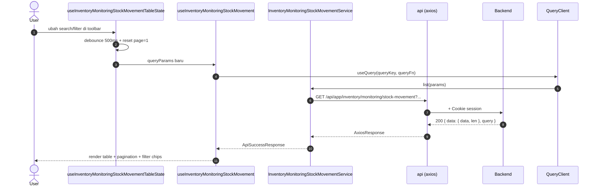
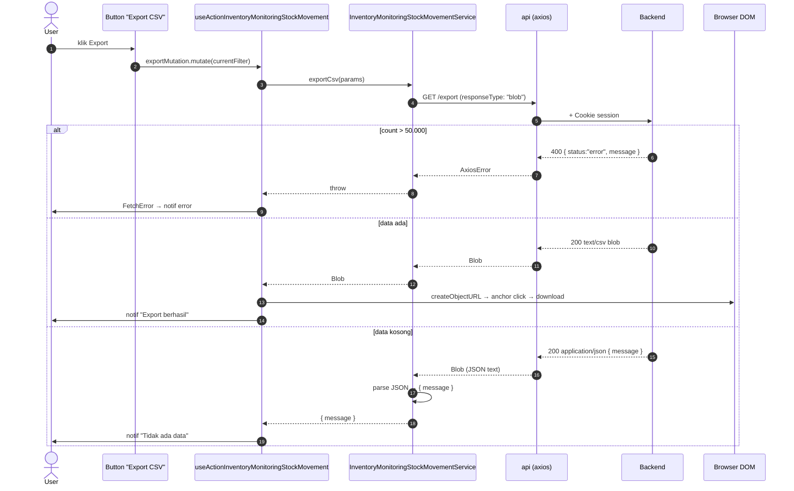

# Inventory / Monitoring / Stock Movement — Frontend Integration

**Module / Scope**: `inventory/monitoring/stock-movement` (Pergerakan Stock)
**Backend base path**: `/api/app/inventory/monitoring/stock-movement`
**Frontend base path** (rencana): `app/src/app/(application)/inventory/monitoring/stock-movement/`
**Component base path** (rencana): `app/src/components/pages/inventory/monitoring/stock-movement/`

**Dependencies**:

- Konvensi global modul → [`../../frontend-integration.md`](../../frontend-integration.md) §2 (CSRF, queryKey, debounce, design tokens, error pattern).
- BE scope doc → [`./README.md`](./README.md).
- Komponen UI implementation → [frontend-dev-flow](../../../../../.claude/skills/frontend-dev-flow/SKILL.md) (saat FE engineer kerja di `app/`).
- Test patterns → [frontend-testing](../../../../../.claude/skills/frontend-testing/SKILL.md).

**Domain**: ledger pergerakan stok lintas-entity (Product/RawMaterial) lintas-lokasi (Warehouse/Outlet). Read-only — UI hanya menampilkan riwayat + export CSV.

**Status FE**: 🚧 **TBD** (per 2026-05-20). Implementasi FE masih di legacy path `app/src/app/(application)/inventory-v2/monitoring/stock-card/` — perlu migrasi ke path baru `inventory/monitoring/stock-movement/` mengikuti rename BE.

---

## 1. Schema BE verbatim

Sumber: [`api/src/module/application/inventory/monitoring/stock-movement/stock-movement.schema.ts`](../../../../../src/module/application/inventory/monitoring/stock-movement/stock-movement.schema.ts).

### 1.1 `QueryStockMovementSchema`

```ts
import { z } from "zod";
import {
    MovementEntityType,
    MovementLocationType,
    MovementType,
    MovementRefType,
} from "../../../../../generated/prisma/client.js";

const isoDateString = z
    .string()
    .regex(/^\d{4}-\d{2}-\d{2}(T.*)?$/, "Format tanggal harus ISO (YYYY-MM-DD)");

export const QueryStockMovementSchema = z.object({
    page:           z.coerce.number().int().positive().default(1).optional(),
    take:           z.coerce.number().int().positive().max(5000).default(50).optional(),
    search:         z.string().trim().min(1).optional(),
    entity_type:    z.enum(MovementEntityType).optional(),
    entity_id:      z.coerce.number().int().positive().optional(),
    location_type:  z.enum(MovementLocationType).optional(),
    location_id:    z.coerce.number().int().positive().optional(),
    movement_type:  z.enum(MovementType).optional(),
    reference_type: z.enum(MovementRefType).optional(),
    reference_id:   z.coerce.number().int().positive().optional(),
    date_from:      isoDateString.optional(),
    date_to:        isoDateString.optional(),
    created_by:     z.string().trim().min(1).optional(),
    sortBy:         z.enum(["created_at", "quantity"]).default("created_at").optional(),
    sortOrder:      z.enum(["asc", "desc"]).default("desc").optional(),
});

export type QueryStockMovementDTO = z.infer<typeof QueryStockMovementSchema>;
```

| Field            | Type                     | Required | Default      | Constraint                          | Catatan FE                                                                       |
| :--------------- | :----------------------- | :------- | :----------- | :---------------------------------- | :------------------------------------------------------------------------------- |
| `page`           | `number`                 | No       | `1`          | `int >= 1`                          | Pagination                                                                       |
| `take`           | `number`                 | No       | `50`         | `int 1..5000`                       | Cap 5000 — UI default 25                                                          |
| `search`         | `string`                 | No       | —            | `trim, min 1`                       | **WAJIB** debounce 500ms (lihat `useDebounce` di [konvensi modul](../../frontend-integration.md#2-konvensi-global-modul-inventory)) |
| `entity_type`    | `MovementEntityType`     | No       | —            | `PRODUCT` \| `RAW_MATERIAL`         | Dropdown filter — opsional                                                       |
| `entity_id`      | `number`                 | No       | —            | `int positive`                      | Bisa dikombinasi dengan `entity_type` untuk drill ke produk/RM spesifik          |
| `location_type`  | `MovementLocationType`   | No       | (auto)       | `WAREHOUSE` \| `OUTLET`             | Bila kosong, BE auto-apply warehouse GFG-SBY                                      |
| `location_id`    | `number`                 | No       | (auto)       | `int positive`                      | Pair dengan `location_type`                                                       |
| `movement_type`  | `MovementType`           | No       | —            | enum (8 nilai)                      | Dropdown filter                                                                  |
| `reference_type` | `MovementRefType`        | No       | —            | `STOCK_TRANSFER`\|`STOCK_RETURN`\|`GOODS_RECEIPT` | Dropdown filter                                            |
| `reference_id`   | `number`                 | No       | —            | `int positive`                      | Pair dengan `reference_type`                                                      |
| `date_from`      | `string` ISO             | No       | —            | regex `YYYY-MM-DD`                  | Date picker → format `YYYY-MM-DD` (gunakan `dateFormatter`)                       |
| `date_to`        | `string` ISO             | No       | —            | regex `YYYY-MM-DD`                  | BE handle end-of-day via `setUTCHours(23,59,59,999)`                              |
| `created_by`     | `string`                 | No       | —            | `trim, min 1`                       | Search by user email                                                              |
| `sortBy`         | `"created_at"\|"quantity"` | No     | `"created_at"` | enum                              | Default sort terbaru dulu                                                         |
| `sortOrder`      | `"asc"\|"desc"`          | No       | `"desc"`     | enum                                | —                                                                                |

### 1.2 `ResponseStockMovementDTO`

```ts
export interface ResponseStockMovementDTO {
    id:                number;
    entity_type:       string;
    entity_id:         number;
    product_code:      string | null;
    product_name:      string | null;
    barcode:           string | null;
    category:          string | null;
    size:              string | null;
    location_type:     string;
    location_id:       number;
    location_name:     string | null;
    movement_type:     string;
    quantity:          number;
    qty_before:        number;
    qty_after:         number;
    reference_id:      number | null;
    reference_type:    string | null;
    reference_code:    string | null;
    reference_subtype: string | null;
    destination_name:  string | null;
    created_by:        string | null;
    created_at:        Date;
}
```

### 1.3 Enum referensi (Prisma)

```prisma
enum MovementEntityType   { PRODUCT  RAW_MATERIAL }
enum MovementLocationType { WAREHOUSE  OUTLET }
enum MovementType         { IN  OUT  TRANSFER_IN  TRANSFER_OUT  RETURN_IN  RETURN_OUT  INITIAL  POS_SALE }
enum MovementRefType      { STOCK_TRANSFER  STOCK_RETURN  GOODS_RECEIPT }
```

---

## 2. FE Schema Mirror

Lokasi (rencana): `app/src/app/(application)/inventory/monitoring/stock-movement/server/inventory.monitoring.stock-movement.schema.ts`.

```ts
import { z } from "zod";
import {
    MovementEntityType,
    MovementLocationType,
    MovementType,
    MovementRefType,
} from "@/shared/types/movement"; // mirror enum dari BE Prisma

const isoDateString = z
    .string()
    .regex(/^\d{4}-\d{2}-\d{2}(T.*)?$/, "Format tanggal harus ISO (YYYY-MM-DD)");

export const QueryStockMovementSchema = z.object({
    page:           z.coerce.number().int().positive().default(1).optional(),
    take:           z.coerce.number().int().positive().max(5000).default(50).optional(),
    search:         z.string().trim().min(1).optional(),
    entity_type:    z.nativeEnum(MovementEntityType).optional(),
    entity_id:      z.coerce.number().int().positive().optional(),
    location_type:  z.nativeEnum(MovementLocationType).optional(),
    location_id:    z.coerce.number().int().positive().optional(),
    movement_type:  z.nativeEnum(MovementType).optional(),
    reference_type: z.nativeEnum(MovementRefType).optional(),
    reference_id:   z.coerce.number().int().positive().optional(),
    date_from:      isoDateString.optional(),
    date_to:        isoDateString.optional(),
    created_by:     z.string().trim().min(1).optional(),
    sortBy:         z.enum(["created_at", "quantity"]).default("created_at").optional(),
    sortOrder:      z.enum(["asc", "desc"]).default("desc").optional(),
});

export type QueryStockMovementDTO = z.input<typeof QueryStockMovementSchema>;

export const ResponseStockMovementSchema = z.object({
    id:                z.number(),
    entity_type:       z.nativeEnum(MovementEntityType),
    entity_id:         z.number(),
    product_code:      z.string().nullable(),
    product_name:      z.string().nullable(),
    barcode:           z.string().nullable(),
    category:          z.string().nullable(),
    size:              z.string().nullable(),
    location_type:     z.nativeEnum(MovementLocationType),
    location_id:       z.number(),
    location_name:     z.string().nullable(),
    movement_type:     z.nativeEnum(MovementType),
    quantity:          z.number(),
    qty_before:        z.number(),
    qty_after:         z.number(),
    reference_id:      z.number().nullable(),
    reference_type:    z.nativeEnum(MovementRefType).nullable(),
    reference_code:    z.string().nullable(),
    reference_subtype: z.string().nullable(),
    destination_name:  z.string().nullable(),
    created_by:        z.string().nullable(),
    created_at:        z.coerce.date(),
});

export type ResponseStockMovementDTO = z.infer<typeof ResponseStockMovementSchema>;
```

**Diff vs BE** (per 2026-05-20):

- ✅ Field name 1:1
- ✅ Enum 1:1 (BE pakai Prisma enum lewat `z.enum(MovementXxxType)`; FE pakai `z.nativeEnum` dari `@/shared/types/movement`)
- ✅ Constraint 1:1 (max take 5000, regex date sama)
- ⚠️ `created_at` di FE pakai `z.coerce.date()` untuk parse string JSON → `Date` object. BE return `Date` langsung; saat serialize lewat HTTP jadi ISO string → FE coerce balik ke `Date`.

---

## 3. Routing — Endpoint Table

Base URL: `/api/app/inventory/monitoring/stock-movement`. Sumber kebenaran tunggal saat FE wiring service. Cek `stock-movement.routes.ts` + `stock-movement.controller.ts` di BE bila ragu.

| #   | Method | Path        | Query type                | Response (status code)                                                                                       | Error utama                                                                       |
| :-- | :----- | :---------- | :------------------------ | :----------------------------------------------------------------------------------------------------------- | :-------------------------------------------------------------------------------- |
| 1   | `GET`  | `/`         | `QueryStockMovementDTO`   | `200` — `ApiSuccessResponse<{ data: ResponseStockMovementDTO[]; len: number }>`                              | `400` — Zod validation (mis. `entity_type=INVALID`, `date_from` format salah)     |
| 2   | `GET`  | `/export`   | `QueryStockMovementDTO`   | `200` — `text/csv` body (UTF-8 BOM + CRLF) **atau** `ApiSuccessResponse<{ message: string }>` saat data kosong | `400` — Zod validation **atau** hasil > 50.000 baris (cap export)                  |

> **Status code** mengikuti SOP `dev-flow §1.G`: 200 untuk read sinkron (list + export). Endpoint ini **read-only**, jadi tidak ada 201/202. Verifikasi langsung di `stock-movement.controller.ts`:
>
> ```ts
> return ApiResponse.sendSuccess(c, result, 200, query);        // list
> return ApiResponse.sendSuccess(c, { message: "..." }, 200);    // export empty
> return new Response(csv, { status: 200, headers: { ... } });   // export CSV
> ```

---

## 4. Service Class FE — FULL CODE

Lokasi (rencana): `app/src/app/(application)/inventory/monitoring/stock-movement/server/inventory.monitoring.stock-movement.service.ts`.

```ts
import { api, ApiSuccessResponse } from "@/lib/api";
import {
    QueryStockMovementDTO,
    ResponseStockMovementDTO,
} from "./inventory.monitoring.stock-movement.schema";

const BASE_URL = "/api/app/inventory/monitoring/stock-movement";

export class InventoryMonitoringStockMovementService {
    /** GET / — paginated list pergerakan stok */
    static async list(params: QueryStockMovementDTO) {
        try {
            const res = await api.get<
                ApiSuccessResponse<{ data: ResponseStockMovementDTO[]; len: number }>
            >(BASE_URL, { params });
            return res.data;
        } catch (e) {
            throw e;
        }
    }

    /** GET /export — download CSV */
    static async exportCsv(params: QueryStockMovementDTO): Promise<Blob | { message: string }> {
        try {
            const res = await api.get(`${BASE_URL}/export`, {
                params,
                responseType: "blob",
            });

            // Bila data kosong, BE return JSON dengan Content-Type application/json
            const contentType = res.headers["content-type"] ?? "";
            if (contentType.includes("application/json")) {
                const text = await (res.data as Blob).text();
                const parsed = JSON.parse(text) as ApiSuccessResponse<{ message: string }>;
                return parsed.data;
            }

            return res.data as Blob;
        } catch (e) {
            throw e;
        }
    }
}
```

**Catatan**:

- Service ini **GET-only** → tidak perlu `setupCSRFToken()` (CSRF hanya untuk write methods, lihat [konvensi modul](../../frontend-integration.md#2-konvensi-global-modul-inventory)).
- `responseType: "blob"` untuk export agar binary content (CSV) tidak diparse axios sebagai string. Component handle download lewat `window.URL.createObjectURL(blob)`.
- Dual-mode export (CSV vs JSON message) ditangani lewat inspect `Content-Type` header response.

---

## 5. Hooks — 5 hook split FULL CODE

Lokasi (rencana): `app/src/app/(application)/inventory/monitoring/stock-movement/server/use.inventory.monitoring.stock-movement.ts`.

```ts
import { useMutation, useQuery, useQueryClient } from "@tanstack/react-query";
import { useState, useMemo } from "react";
import { useDebounce, useQueryParams } from "@/shared/hooks";
import { FetchError, ResponseError } from "@/lib/api";
import { useNotif } from "@/shared/notif";
import { InventoryMonitoringStockMovementService } from "./inventory.monitoring.stock-movement.service";
import { QueryStockMovementDTO } from "./inventory.monitoring.stock-movement.schema";

const QUERY_KEY_LIST = "inventory.monitoring.stock-movement";

// ─── 1. READ ─────────────────────────────────────────────────────────────

export function useInventoryMonitoringStockMovement(params?: QueryStockMovementDTO) {
    return useQuery({
        queryKey: [QUERY_KEY_LIST, params],
        queryFn:  () =>
            InventoryMonitoringStockMovementService.list(params as QueryStockMovementDTO),
        enabled:  Boolean(params),
        staleTime: 30_000,
    });
}

// ─── 2. WRITE ────────────────────────────────────────────────────────────

export const useFormInventoryMonitoringStockMovement = () => {
    // N/A (read-only) — module ini tidak menulis ke stock_movements.
    // Mutasi dilakukan di modul sumber (FG, RM, GR, DO, TG, Return).
    return null;
};

// ─── 3. ACTION ───────────────────────────────────────────────────────────

export function useActionInventoryMonitoringStockMovement() {
    const { setNotif } = useNotif();
    const [err, setErr] = useState<ResponseError | null>(null);

    const exportMutation = useMutation<Blob | { message: string }, ResponseError, QueryStockMovementDTO>({
        mutationKey: [QUERY_KEY_LIST, "export"],
        mutationFn:  (params) =>
            InventoryMonitoringStockMovementService.exportCsv(params),
        onSuccess: (data, vars) => {
            if (data instanceof Blob) {
                const url = window.URL.createObjectURL(data);
                const link = document.createElement("a");
                link.href = url;
                link.download = `stock-movement-${new Date().toISOString().slice(0, 10)}.csv`;
                document.body.appendChild(link);
                link.click();
                link.remove();
                window.URL.revokeObjectURL(url);
                setNotif({ title: "Export berhasil", message: "File CSV terunduh." });
            } else {
                setNotif({ title: "Tidak ada data", message: data.message });
            }
        },
        onError: (e) => FetchError(e, setErr),
    });

    return { exportMutation, err, setErr };
}

// ─── 4. TABLE STATE (URL sync + debounce search) ─────────────────────────

export function useInventoryMonitoringStockMovementTableState() {
    const { params, batchSet } = useQueryParams<QueryStockMovementDTO>();
    const [search, setSearch] = useState(params.search ?? "");
    const debouncedSearch = useDebounce(search, 500);

    const setParams = (next: Partial<QueryStockMovementDTO>) => {
        batchSet({ ...next, page: 1 }); // reset ke halaman 1 saat filter berubah
    };

    const queryParams = useMemo<QueryStockMovementDTO>(
        () => ({
            ...params,
            search: debouncedSearch || undefined,
        }),
        [params, debouncedSearch],
    );

    return { params: queryParams, setParams, search, setSearch };
}

// ─── 5. QUERY WRAPPER (bundling state + list) ────────────────────────────

export function useInventoryMonitoringStockMovementQuery() {
    const state = useInventoryMonitoringStockMovementTableState();
    const query = useInventoryMonitoringStockMovement(state.params);
    const actions = useActionInventoryMonitoringStockMovement();

    return {
        ...state,
        ...query,
        actions,
    };
}
```

**queryKey & invalidation**:

- queryKey list: `["inventory.monitoring.stock-movement", params]`
- mutationKey export: `["inventory.monitoring.stock-movement", "export"]`
- Invalidation: **tidak ada** (read-only, tidak ada mutasi yang mengubah state). Module mutasi lain (FG/RM/GR/DO/TG/Return) yang menulis ke `stock_movements` boleh invalidate `["inventory.monitoring.stock-movement"]` setelah mutasi sukses agar live view ter-refresh.

---

## 6. End-to-end flow Mermaid

### 6.1 List flow



### 6.2 Export CSV flow



---

## 7. Edge cases & per-scope quirks

1. **Debounce search 500ms** — wajib untuk hindari spam request. Konvensi `useDebounce` modul.
2. **Default lokasi GFG-SBY** — bila user tidak set filter lokasi, BE auto-apply warehouse GFG-SBY. UI HARUS clearly indicate ini lewat default chip "Filter: WAREHOUSE GFG-SBY" agar user paham kenapa hasil ter-batas (bukan bug).
3. **Polymorphic filter pairing** — `entity_type` + `entity_id` saling melengkapi tapi independen. UI bisa filter "semua produk" (entity_type=PRODUCT, entity_id kosong) atau "produk #10 spesifik" (keduanya isi). Dropdown `entity_id` bergantung pada `entity_type` aktif (load product list vs raw_material list).
4. **`reference_id` requires `reference_type`** — secara teknis BE accept salah satu, tapi `reference_id` tanpa `reference_type` bisa ambigu (ID 99 di stock_transfers vs stock_returns vs goods_receipts). UI sebaiknya disable `reference_id` input sampai `reference_type` dipilih.
5. **Date range UI** — single date picker untuk `date_from` dan `date_to`. BE set `date_to` ke end-of-day UTC otomatis. Tidak perlu kirim `T23:59:59` dari FE.
6. **CSV export cap 50.000** — UI WAJIB tampilkan warning "Export dibatasi 50.000 baris. Persempit filter dulu untuk dataset lebih besar" sebelum trigger export. BE return 400 dengan pesan ramah bila tetap exceed.
7. **CSV format**: UTF-8 BOM + CRLF — kompatibel langsung di Excel macOS/Windows. FE tidak perlu post-process.
8. **Decimal precision**: `quantity`, `qty_before`, `qty_after` di-cast `::numeric` di BE → returned sebagai `number` di DTO. Untuk display dengan separator ribuan, gunakan helper `formatNumber` (locale `id-ID`).
9. **`reference_subtype = "DO" | "TG" | "RETURN" | "GR"`** — derivasi dari kombinasi `movement_type` + `reference_type` di SQL. UI bisa tampilkan sebagai badge:
    - `DO` (Delivery Order — transfer ke outlet)
    - `TG` (Transfer Gudang — antar warehouse)
    - `RETURN` (Stock Return)
    - `GR` (Goods Receipt)
10. **`destination_name`** — fallback ke `"OUTBOUND"` / `"INBOUND"` / `"PRODUCTION / INBOUND"` saat tabel union tidak resolve nama. Treat fallback ini sebagai placeholder label di UI, bukan sebagai data missing.
11. **Migrasi dari `inventory-v2/monitoring/stock-card`**: FE existing di legacy path masih hidup. Saat siap migrasi, ubah:
    - Path: `inventory-v2/monitoring/stock-card` → `inventory/monitoring/stock-movement`
    - Class: `StockCardService` → `InventoryMonitoringStockMovementService`
    - Hook: `useStockCard` → `useInventoryMonitoringStockMovement`
    - Sidebar URL: `/inventory-v2/monitoring/stock-card` → `/inventory/monitoring/stock-movement`
    - Label sidebar: "Pergerakan Stock" tetap (naming FE sudah benar; BE sekarang catch-up).

---

## 8. Cross-link

- BE scope README: [`./README.md`](./README.md)
- Module-level FE konvensi: [`../../frontend-integration.md`](../../frontend-integration.md)
- SOP FE canonical (untuk komponen UI implementation): [frontend-dev-flow](../../../../../.claude/skills/frontend-dev-flow/SKILL.md)
- SOP FE testing (Vitest + RTL): [frontend-testing](../../../../../.claude/skills/frontend-testing/SKILL.md)
- SOP BE canonical: [dev-flow](../../../../../.claude/skills/dev-flow/SKILL.md)
- Postman folder: `Inventory → Monitoring → Stock Movement` di [`docs/postman/erp-mandalika.postman_collection.json`](../../../../postman/erp-mandalika.postman_collection.json)
- Sibling FE doc: [`../stock-distribution/frontend-integration.md`](../stock-distribution/frontend-integration.md) — matrix view (snapshot stok per-lokasi)
