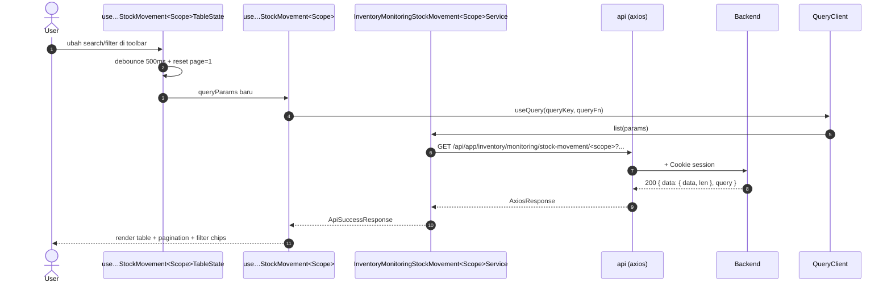
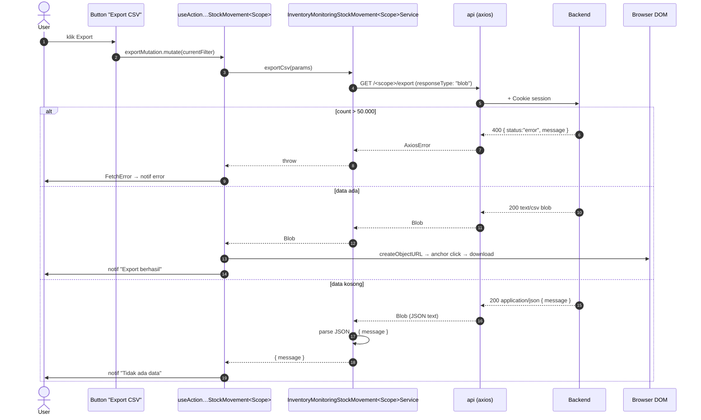

# Inventory / Monitoring / Stock Movement — Frontend Integration

**Module / Scope**: `inventory/monitoring/stock-movement` (Pergerakan Stock) — dibagi 2 sub-scope simetris: **FG** (Finished Goods) + **RM** (Raw Material).
**Backend base path**: `/api/app/inventory/monitoring/stock-movement` → `/fg` + `/rm`
**Frontend base path** (rencana):
- FG: `app/src/app/(application)/inventory/monitoring/stock-movement/fg/`
- RM: `app/src/app/(application)/inventory/monitoring/stock-movement/rm/`

**Dependencies**:

- Konvensi global modul → [`../../frontend-integration.md`](../../frontend-integration.md) §2 (CSRF, queryKey, debounce, design tokens, error pattern).
- BE scope doc → [`./README.md`](./README.md).
- Komponen UI implementation → [frontend-dev-flow](../../../../../.claude/skills/frontend-dev-flow/SKILL.md) (saat FE engineer kerja di `app/`).
- Test patterns → [frontend-testing](../../../../../.claude/skills/frontend-testing/SKILL.md).

**Domain**: ledger pergerakan stok lintas-lokasi. FG mencatat mutasi produk jadi (warehouse FG + outlet); RM mencatat mutasi bahan baku (warehouse RM saja). Read-only — UI hanya menampilkan riwayat + export CSV.

**Status FE**: 🚧 **TBD** (per 2026-05-20). Implementasi FE masih di legacy path `app/src/app/(application)/inventory-v2/monitoring/stock-card/` (gabung FG+RM). Migrasi: split menjadi dua route FE mengikuti rename BE.

---

## 1. Schema BE verbatim

Sumber:

- FG → [`api/src/module/application/inventory/monitoring/stock-movement/fg/fg.schema.ts`](../../../../../src/module/application/inventory/monitoring/stock-movement/fg/fg.schema.ts)
- RM → [`api/src/module/application/inventory/monitoring/stock-movement/rm/rm.schema.ts`](../../../../../src/module/application/inventory/monitoring/stock-movement/rm/rm.schema.ts)

### 1.1 `QueryStockMovementFGSchema`

```ts
import { z } from "zod";
import {
    MovementLocationType,
    MovementType,
    MovementRefType,
} from "../../../../../../generated/prisma/client.js";

const isoDateString = z
    .string()
    .regex(/^\d{4}-\d{2}-\d{2}(T.*)?$/, "Format tanggal harus ISO (YYYY-MM-DD)");

export const QueryStockMovementFGSchema = z.object({
    page:           z.coerce.number().int().positive().default(1).optional(),
    take:           z.coerce.number().int().positive().max(5000).default(50).optional(),
    search:         z.string().trim().min(1).optional(),
    entity_id:      z.coerce.number().int().positive().optional(),
    location_type:  z.enum(MovementLocationType).optional(),
    location_id:    z.coerce.number().int().positive().optional(),
    movement_type:  z.enum(MovementType).optional(),
    reference_type: z.enum(MovementRefType).optional(),
    reference_id:   z.coerce.number().int().positive().optional(),
    date_from:      isoDateString.optional(),
    date_to:        isoDateString.optional(),
    created_by:     z.string().trim().min(1).optional(),
    sortBy:         z.enum(["created_at", "quantity"]).default("created_at").optional(),
    sortOrder:      z.enum(["asc", "desc"]).default("desc").optional(),
});

export type QueryStockMovementFGDTO = z.infer<typeof QueryStockMovementFGSchema>;
```

| Field            | Type                       | Required | Default        | Constraint                          | Catatan FE                                                            |
| :--------------- | :------------------------- | :------- | :------------- | :---------------------------------- | :-------------------------------------------------------------------- |
| `page`           | `number`                   | No       | `1`            | `int >= 1`                          | Pagination                                                            |
| `take`           | `number`                   | No       | `50`           | `int 1..5000`                       | Cap 5000 — UI default 25                                              |
| `search`         | `string`                   | No       | —              | `trim, min 1`                       | **WAJIB** debounce 500ms                                              |
| `entity_id`      | `number`                   | No       | —              | `int positive`                      | Drill ke produk spesifik                                              |
| `location_type`  | `MovementLocationType`     | No       | (auto GFG-SBY) | `WAREHOUSE` \| `OUTLET`             | Bila kosong → BE auto-apply warehouse GFG-SBY                          |
| `location_id`    | `number`                   | No       | (auto)         | `int positive`                      | Pair dengan `location_type`                                            |
| `movement_type`  | `MovementType`             | No       | —              | enum (10 nilai)                     | Dropdown filter                                                       |
| `reference_type` | `MovementRefType`          | No       | —              | enum                                | FG relevan: `STOCK_TRANSFER` \| `STOCK_RETURN` \| `GOODS_RECEIPT`     |
| `reference_id`   | `number`                   | No       | —              | `int positive`                      | Pair dengan `reference_type`                                          |
| `date_from`      | `string` ISO               | No       | —              | regex `YYYY-MM-DD`                  | Date picker                                                           |
| `date_to`        | `string` ISO               | No       | —              | regex `YYYY-MM-DD`                  | BE set end-of-day UTC                                                 |
| `created_by`     | `string`                   | No       | —              | `trim, min 1`                       | Search by user email                                                  |
| `sortBy`         | `"created_at"\|"quantity"` | No       | `"created_at"` | enum                                | Default sort terbaru dulu                                             |
| `sortOrder`      | `"asc"\|"desc"`            | No       | `"desc"`       | enum                                | —                                                                     |

### 1.2 `ResponseStockMovementFGDTO`

```ts
export interface ResponseStockMovementFGDTO {
    id:                number;
    entity_id:         number;
    product_code:      string;
    product_name:      string | null;
    category:          string | null;
    size:              string | null;
    gender:            string | null;
    location_type:     string;
    location_id:       number;
    location_name:     string | null;
    movement_type:     string;
    quantity:          number;
    qty_before:        number;
    qty_after:         number;
    reference_id:      number | null;
    reference_type:    string | null;
    reference_code:    string | null;
    reference_subtype: string | null;
    destination_name:  string | null;
    created_by:        string | null;
    created_at:        Date;
}
```

### 1.3 `QueryStockMovementRMSchema`

```ts
import { z } from "zod";
import {
    MovementType,
    MovementRefType,
} from "../../../../../../generated/prisma/client.js";

const isoDateString = z
    .string()
    .regex(/^\d{4}-\d{2}-\d{2}(T.*)?$/, "Format tanggal harus ISO (YYYY-MM-DD)");

export const QueryStockMovementRMSchema = z.object({
    page:           z.coerce.number().int().positive().default(1).optional(),
    take:           z.coerce.number().int().positive().max(5000).default(50).optional(),
    search:         z.string().trim().min(1).optional(),
    entity_id:      z.coerce.number().int().positive().optional(),
    location_id:    z.coerce.number().int().positive().optional(),
    movement_type:  z.enum(MovementType).optional(),
    reference_type: z.enum(MovementRefType).optional(),
    reference_id:   z.coerce.number().int().positive().optional(),
    date_from:      isoDateString.optional(),
    date_to:        isoDateString.optional(),
    created_by:     z.string().trim().min(1).optional(),
    sortBy:         z.enum(["created_at", "quantity"]).default("created_at").optional(),
    sortOrder:      z.enum(["asc", "desc"]).default("desc").optional(),
});

export type QueryStockMovementRMDTO = z.infer<typeof QueryStockMovementRMSchema>;
```

| Field            | Type                       | Required | Default               | Constraint                          | Catatan FE                                                                    |
| :--------------- | :------------------------- | :------- | :-------------------- | :---------------------------------- | :---------------------------------------------------------------------------- |
| `page`           | `number`                   | No       | `1`                   | `int >= 1`                          | Pagination                                                                    |
| `take`           | `number`                   | No       | `50`                  | `int 1..5000`                       | Cap 5000 — UI default 25                                                      |
| `search`         | `string`                   | No       | —                     | `trim, min 1`                       | **WAJIB** debounce 500ms; matches name & barcode                              |
| `entity_id`      | `number`                   | No       | —                     | `int positive`                      | Drill ke RM spesifik                                                          |
| `location_id`    | `number`                   | No       | (auto, RM warehouse)  | `int positive`                      | Bila kosong → BE auto-apply warehouse RAW_MATERIAL pertama (asc by id)        |
| `movement_type`  | `MovementType`             | No       | —                     | enum                                | Dropdown filter                                                              |
| `reference_type` | `MovementRefType`          | No       | —                     | enum                                | RM relevan: `PURCHASE_ORDER` \| `GOODS_RECEIPT` \| `STOCK_TRANSFER` \| `PRODUCTION` |
| `reference_id`   | `number`                   | No       | —                     | `int positive`                      | Pair dengan `reference_type`                                                  |
| `date_from`      | `string` ISO               | No       | —                     | regex `YYYY-MM-DD`                  | Date picker                                                                   |
| `date_to`        | `string` ISO               | No       | —                     | regex `YYYY-MM-DD`                  | BE set end-of-day UTC                                                         |
| `created_by`     | `string`                   | No       | —                     | `trim, min 1`                       | Search by user email                                                          |
| `sortBy`         | `"created_at"\|"quantity"` | No       | `"created_at"`        | enum                                | Default sort terbaru dulu                                                     |
| `sortOrder`      | `"asc"\|"desc"`            | No       | `"desc"`              | enum                                | —                                                                             |

> **Beda dengan FG**: RM **tidak terima** `location_type` (hard-coded WAREHOUSE di BE) dan **tidak terima** `entity_type` (hard-coded RAW_MATERIAL).

### 1.4 `ResponseStockMovementRMDTO`

```ts
export interface ResponseStockMovementRMDTO {
    id:                number;
    entity_id:         number;
    barcode:           string | null;
    rm_name:           string;
    category:          string | null;
    unit:              string | null;
    material_type:     string | null;
    location_id:       number;
    location_name:     string | null;
    movement_type:     string;
    quantity:          number;
    qty_before:        number;
    qty_after:         number;
    reference_id:      number | null;
    reference_type:    string | null;
    reference_code:    string | null;
    reference_subtype: string | null;
    destination_name:  string | null;
    created_by:        string | null;
    created_at:        Date;
}
```

### 1.5 Enum referensi (Prisma)

```prisma
enum MovementEntityType   { PRODUCT  RAW_MATERIAL }
enum MovementLocationType { WAREHOUSE  OUTLET }
enum MovementType         { IN  OUT  TRANSFER_IN  TRANSFER_OUT  ADJUSTMENT  OPNAME  INITIAL  POS_SALE  RETURN_IN  RETURN_OUT }
enum MovementRefType      { PURCHASE_ORDER  STOCK_TRANSFER  STOCK_ADJUSTMENT  ISSUANCE_TRANSACTION  MANUAL  GOODS_RECEIPT  STOCK_RETURN  PRODUCTION }
```

> `MovementEntityType` **tidak diekspose** ke Zod query — sudah hard-coded per sub-scope di BE.

---

## 2. FE Schema Mirror

Lokasi (rencana):

- FG: `app/src/app/(application)/inventory/monitoring/stock-movement/fg/server/inventory.monitoring.stock-movement.fg.schema.ts`
- RM: `app/src/app/(application)/inventory/monitoring/stock-movement/rm/server/inventory.monitoring.stock-movement.rm.schema.ts`

### 2.1 FG schema mirror

```ts
import { z } from "zod";
import {
    MovementLocationType,
    MovementType,
    MovementRefType,
} from "@/shared/types/movement"; // mirror enum dari BE Prisma

const isoDateString = z
    .string()
    .regex(/^\d{4}-\d{2}-\d{2}(T.*)?$/, "Format tanggal harus ISO (YYYY-MM-DD)");

export const QueryStockMovementFGSchema = z.object({
    page:           z.coerce.number().int().positive().default(1).optional(),
    take:           z.coerce.number().int().positive().max(5000).default(50).optional(),
    search:         z.string().trim().min(1).optional(),
    entity_id:      z.coerce.number().int().positive().optional(),
    location_type:  z.nativeEnum(MovementLocationType).optional(),
    location_id:    z.coerce.number().int().positive().optional(),
    movement_type:  z.nativeEnum(MovementType).optional(),
    reference_type: z.nativeEnum(MovementRefType).optional(),
    reference_id:   z.coerce.number().int().positive().optional(),
    date_from:      isoDateString.optional(),
    date_to:        isoDateString.optional(),
    created_by:     z.string().trim().min(1).optional(),
    sortBy:         z.enum(["created_at", "quantity"]).default("created_at").optional(),
    sortOrder:      z.enum(["asc", "desc"]).default("desc").optional(),
});

export type QueryStockMovementFGDTO = z.input<typeof QueryStockMovementFGSchema>;

export const ResponseStockMovementFGSchema = z.object({
    id:                z.number(),
    entity_id:         z.number(),
    product_code:      z.string(),
    product_name:      z.string().nullable(),
    category:          z.string().nullable(),
    size:              z.string().nullable(),
    gender:            z.string().nullable(),
    location_type:     z.nativeEnum(MovementLocationType),
    location_id:       z.number(),
    location_name:     z.string().nullable(),
    movement_type:     z.nativeEnum(MovementType),
    quantity:          z.number(),
    qty_before:        z.number(),
    qty_after:         z.number(),
    reference_id:      z.number().nullable(),
    reference_type:    z.nativeEnum(MovementRefType).nullable(),
    reference_code:    z.string().nullable(),
    reference_subtype: z.string().nullable(),
    destination_name:  z.string().nullable(),
    created_by:        z.string().nullable(),
    created_at:        z.coerce.date(),
});

export type ResponseStockMovementFGDTO = z.infer<typeof ResponseStockMovementFGSchema>;
```

### 2.2 RM schema mirror

```ts
import { z } from "zod";
import {
    MovementType,
    MovementRefType,
} from "@/shared/types/movement";

const isoDateString = z
    .string()
    .regex(/^\d{4}-\d{2}-\d{2}(T.*)?$/, "Format tanggal harus ISO (YYYY-MM-DD)");

export const QueryStockMovementRMSchema = z.object({
    page:           z.coerce.number().int().positive().default(1).optional(),
    take:           z.coerce.number().int().positive().max(5000).default(50).optional(),
    search:         z.string().trim().min(1).optional(),
    entity_id:      z.coerce.number().int().positive().optional(),
    location_id:    z.coerce.number().int().positive().optional(),
    movement_type:  z.nativeEnum(MovementType).optional(),
    reference_type: z.nativeEnum(MovementRefType).optional(),
    reference_id:   z.coerce.number().int().positive().optional(),
    date_from:      isoDateString.optional(),
    date_to:        isoDateString.optional(),
    created_by:     z.string().trim().min(1).optional(),
    sortBy:         z.enum(["created_at", "quantity"]).default("created_at").optional(),
    sortOrder:      z.enum(["asc", "desc"]).default("desc").optional(),
});

export type QueryStockMovementRMDTO = z.input<typeof QueryStockMovementRMSchema>;

export const ResponseStockMovementRMSchema = z.object({
    id:                z.number(),
    entity_id:         z.number(),
    barcode:           z.string().nullable(),
    rm_name:           z.string(),
    category:          z.string().nullable(),
    unit:              z.string().nullable(),
    material_type:     z.string().nullable(),
    location_id:       z.number(),
    location_name:     z.string().nullable(),
    movement_type:     z.nativeEnum(MovementType),
    quantity:          z.number(),
    qty_before:        z.number(),
    qty_after:         z.number(),
    reference_id:      z.number().nullable(),
    reference_type:    z.nativeEnum(MovementRefType).nullable(),
    reference_code:    z.string().nullable(),
    reference_subtype: z.string().nullable(),
    destination_name:  z.string().nullable(),
    created_by:        z.string().nullable(),
    created_at:        z.coerce.date(),
});

export type ResponseStockMovementRMDTO = z.infer<typeof ResponseStockMovementRMSchema>;
```

**Diff vs BE** (per 2026-05-20):

- ✅ Field name 1:1 (FG punya `product_code/name/category/size/gender`; RM punya `barcode/rm_name/category/unit/material_type`)
- ✅ Enum 1:1 (BE `z.enum(<PrismaEnum>)`; FE `z.nativeEnum` dari `@/shared/types/movement`)
- ✅ Constraint 1:1 (max take 5000, regex date sama)
- ⚠️ `created_at` di FE pakai `z.coerce.date()` untuk parse ISO string JSON → `Date` object
- ⚠️ FG `product_code` non-nullable (INNER JOIN), RM `rm_name` non-nullable (INNER JOIN). Sebelumnya di legacy schema gabungan, `product_code` nullable — sekarang tegas non-nullable di FG.

---

## 3. Routing — Endpoint Table

Base URL: `/api/app/inventory/monitoring/stock-movement`. Sumber kebenaran tunggal saat FE wiring service. Cek `fg/fg.routes.ts`, `rm/rm.routes.ts`, dan kedua controller bila ragu.

| #   | Method | Path           | Query type                    | Response (status code)                                                                                          | Error utama                                                                       |
| :-- | :----- | :------------- | :---------------------------- | :-------------------------------------------------------------------------------------------------------------- | :-------------------------------------------------------------------------------- |
| 1   | `GET`  | `/fg`          | `QueryStockMovementFGDTO`     | `200` — `ApiSuccessResponse<{ data: ResponseStockMovementFGDTO[]; len: number }>`                                | `400` — Zod validation                                                            |
| 2   | `GET`  | `/fg/export`   | `QueryStockMovementFGDTO`     | `200` — `text/csv` body **atau** `ApiSuccessResponse<{ message: string }>` saat data kosong                      | `400` — Zod validation **atau** hasil > 50.000 baris                              |
| 3   | `GET`  | `/rm`          | `QueryStockMovementRMDTO`     | `200` — `ApiSuccessResponse<{ data: ResponseStockMovementRMDTO[]; len: number }>`                                | `400` — Zod validation                                                            |
| 4   | `GET`  | `/rm/export`   | `QueryStockMovementRMDTO`     | `200` — `text/csv` body **atau** `ApiSuccessResponse<{ message: string }>` saat data kosong                      | `400` — Zod validation **atau** hasil > 50.000 baris                              |

> **Status code** mengikuti SOP `dev-flow §1.G`: 200 untuk read sinkron (list + export). Endpoint ini **read-only**, jadi tidak ada 201/202. Verifikasi langsung di controller:
>
> ```ts
> return ApiResponse.sendSuccess(c, result, 200, query);        // list
> return ApiResponse.sendSuccess(c, { message: "..." }, 200);    // export empty
> return new Response(csv, { status: 200, headers: { ... } });   // export CSV
> ```

---

## 4. Service Class FE — FULL CODE

Lokasi (rencana):

- FG: `app/src/app/(application)/inventory/monitoring/stock-movement/fg/server/inventory.monitoring.stock-movement.fg.service.ts`
- RM: `app/src/app/(application)/inventory/monitoring/stock-movement/rm/server/inventory.monitoring.stock-movement.rm.service.ts`

### 4.1 FG service

```ts
import { api, ApiSuccessResponse } from "@/lib/api";
import {
    QueryStockMovementFGDTO,
    ResponseStockMovementFGDTO,
} from "./inventory.monitoring.stock-movement.fg.schema";

const BASE_URL = "/api/app/inventory/monitoring/stock-movement/fg";

export class InventoryMonitoringStockMovementFGService {
    /** GET / — paginated list pergerakan FG */
    static async list(params: QueryStockMovementFGDTO) {
        try {
            const res = await api.get<
                ApiSuccessResponse<{ data: ResponseStockMovementFGDTO[]; len: number }>
            >(BASE_URL, { params });
            return res.data;
        } catch (e) {
            throw e;
        }
    }

    /** GET /export — download CSV (FG) */
    static async exportCsv(
        params: QueryStockMovementFGDTO,
    ): Promise<Blob | { message: string }> {
        try {
            const res = await api.get(`${BASE_URL}/export`, {
                params,
                responseType: "blob",
            });

            const contentType = res.headers["content-type"] ?? "";
            if (contentType.includes("application/json")) {
                const text = await (res.data as Blob).text();
                const parsed = JSON.parse(text) as ApiSuccessResponse<{ message: string }>;
                return parsed.data;
            }

            return res.data as Blob;
        } catch (e) {
            throw e;
        }
    }
}
```

### 4.2 RM service

```ts
import { api, ApiSuccessResponse } from "@/lib/api";
import {
    QueryStockMovementRMDTO,
    ResponseStockMovementRMDTO,
} from "./inventory.monitoring.stock-movement.rm.schema";

const BASE_URL = "/api/app/inventory/monitoring/stock-movement/rm";

export class InventoryMonitoringStockMovementRMService {
    /** GET / — paginated list pergerakan RM */
    static async list(params: QueryStockMovementRMDTO) {
        try {
            const res = await api.get<
                ApiSuccessResponse<{ data: ResponseStockMovementRMDTO[]; len: number }>
            >(BASE_URL, { params });
            return res.data;
        } catch (e) {
            throw e;
        }
    }

    /** GET /export — download CSV (RM) */
    static async exportCsv(
        params: QueryStockMovementRMDTO,
    ): Promise<Blob | { message: string }> {
        try {
            const res = await api.get(`${BASE_URL}/export`, {
                params,
                responseType: "blob",
            });

            const contentType = res.headers["content-type"] ?? "";
            if (contentType.includes("application/json")) {
                const text = await (res.data as Blob).text();
                const parsed = JSON.parse(text) as ApiSuccessResponse<{ message: string }>;
                return parsed.data;
            }

            return res.data as Blob;
        } catch (e) {
            throw e;
        }
    }
}
```

**Catatan**:

- Service ini **GET-only** → tidak perlu `setupCSRFToken()` (CSRF hanya untuk write methods, lihat [konvensi modul](../../frontend-integration.md#2-konvensi-global-modul-inventory)).
- `responseType: "blob"` untuk export agar binary content (CSV) tidak diparse axios sebagai string. Component handle download lewat `window.URL.createObjectURL(blob)`.
- Dual-mode export (CSV vs JSON message) ditangani lewat inspect `Content-Type` header response.

---

## 5. Hooks — 5 hook split FULL CODE

Lokasi (rencana):

- FG: `app/src/app/(application)/inventory/monitoring/stock-movement/fg/server/use.inventory.monitoring.stock-movement.fg.ts`
- RM: `app/src/app/(application)/inventory/monitoring/stock-movement/rm/server/use.inventory.monitoring.stock-movement.rm.ts`

### 5.1 FG hooks

```ts
import { useMutation, useQuery } from "@tanstack/react-query";
import { useState, useMemo } from "react";
import { useDebounce, useQueryParams } from "@/shared/hooks";
import { FetchError, ResponseError } from "@/lib/api";
import { useNotif } from "@/shared/notif";
import { InventoryMonitoringStockMovementFGService } from "./inventory.monitoring.stock-movement.fg.service";
import { QueryStockMovementFGDTO } from "./inventory.monitoring.stock-movement.fg.schema";

const QUERY_KEY_LIST = "inventory.monitoring.stock-movement.fg";

// ─── 1. READ ─────────────────────────────────────────────────────────────

export function useInventoryMonitoringStockMovementFG(params?: QueryStockMovementFGDTO) {
    return useQuery({
        queryKey: [QUERY_KEY_LIST, params],
        queryFn:  () =>
            InventoryMonitoringStockMovementFGService.list(params as QueryStockMovementFGDTO),
        enabled:  Boolean(params),
        staleTime: 30_000,
    });
}

// ─── 2. WRITE ────────────────────────────────────────────────────────────

export const useFormInventoryMonitoringStockMovementFG = () => {
    // N/A (read-only) — module ini tidak menulis ke stock_movements.
    return null;
};

// ─── 3. ACTION ───────────────────────────────────────────────────────────

export function useActionInventoryMonitoringStockMovementFG() {
    const { setNotif } = useNotif();
    const [err, setErr] = useState<ResponseError | null>(null);

    const exportMutation = useMutation<
        Blob | { message: string },
        ResponseError,
        QueryStockMovementFGDTO
    >({
        mutationKey: [QUERY_KEY_LIST, "export"],
        mutationFn:  (params) =>
            InventoryMonitoringStockMovementFGService.exportCsv(params),
        onSuccess: (data) => {
            if (data instanceof Blob) {
                const url = window.URL.createObjectURL(data);
                const link = document.createElement("a");
                link.href = url;
                link.download = `stock-movement-fg-${new Date().toISOString().slice(0, 10)}.csv`;
                document.body.appendChild(link);
                link.click();
                link.remove();
                window.URL.revokeObjectURL(url);
                setNotif({ title: "Export berhasil", message: "File CSV terunduh." });
            } else {
                setNotif({ title: "Tidak ada data", message: data.message });
            }
        },
        onError: (e) => FetchError(e, setErr),
    });

    return { exportMutation, err, setErr };
}

// ─── 4. TABLE STATE (URL sync + debounce search) ─────────────────────────

export function useInventoryMonitoringStockMovementFGTableState() {
    const { params, batchSet } = useQueryParams<QueryStockMovementFGDTO>();
    const [search, setSearch] = useState(params.search ?? "");
    const debouncedSearch = useDebounce(search, 500);

    const setParams = (next: Partial<QueryStockMovementFGDTO>) => {
        batchSet({ ...next, page: 1 });
    };

    const queryParams = useMemo<QueryStockMovementFGDTO>(
        () => ({
            ...params,
            search: debouncedSearch || undefined,
        }),
        [params, debouncedSearch],
    );

    return { params: queryParams, setParams, search, setSearch };
}

// ─── 5. QUERY WRAPPER ────────────────────────────────────────────────────

export function useInventoryMonitoringStockMovementFGQuery() {
    const state   = useInventoryMonitoringStockMovementFGTableState();
    const query   = useInventoryMonitoringStockMovementFG(state.params);
    const actions = useActionInventoryMonitoringStockMovementFG();

    return {
        ...state,
        ...query,
        actions,
    };
}
```

### 5.2 RM hooks

```ts
import { useMutation, useQuery } from "@tanstack/react-query";
import { useState, useMemo } from "react";
import { useDebounce, useQueryParams } from "@/shared/hooks";
import { FetchError, ResponseError } from "@/lib/api";
import { useNotif } from "@/shared/notif";
import { InventoryMonitoringStockMovementRMService } from "./inventory.monitoring.stock-movement.rm.service";
import { QueryStockMovementRMDTO } from "./inventory.monitoring.stock-movement.rm.schema";

const QUERY_KEY_LIST = "inventory.monitoring.stock-movement.rm";

// ─── 1. READ ─────────────────────────────────────────────────────────────

export function useInventoryMonitoringStockMovementRM(params?: QueryStockMovementRMDTO) {
    return useQuery({
        queryKey: [QUERY_KEY_LIST, params],
        queryFn:  () =>
            InventoryMonitoringStockMovementRMService.list(params as QueryStockMovementRMDTO),
        enabled:  Boolean(params),
        staleTime: 30_000,
    });
}

// ─── 2. WRITE ────────────────────────────────────────────────────────────

export const useFormInventoryMonitoringStockMovementRM = () => {
    // N/A (read-only)
    return null;
};

// ─── 3. ACTION ───────────────────────────────────────────────────────────

export function useActionInventoryMonitoringStockMovementRM() {
    const { setNotif } = useNotif();
    const [err, setErr] = useState<ResponseError | null>(null);

    const exportMutation = useMutation<
        Blob | { message: string },
        ResponseError,
        QueryStockMovementRMDTO
    >({
        mutationKey: [QUERY_KEY_LIST, "export"],
        mutationFn:  (params) =>
            InventoryMonitoringStockMovementRMService.exportCsv(params),
        onSuccess: (data) => {
            if (data instanceof Blob) {
                const url = window.URL.createObjectURL(data);
                const link = document.createElement("a");
                link.href = url;
                link.download = `stock-movement-rm-${new Date().toISOString().slice(0, 10)}.csv`;
                document.body.appendChild(link);
                link.click();
                link.remove();
                window.URL.revokeObjectURL(url);
                setNotif({ title: "Export berhasil", message: "File CSV terunduh." });
            } else {
                setNotif({ title: "Tidak ada data", message: data.message });
            }
        },
        onError: (e) => FetchError(e, setErr),
    });

    return { exportMutation, err, setErr };
}

// ─── 4. TABLE STATE ──────────────────────────────────────────────────────

export function useInventoryMonitoringStockMovementRMTableState() {
    const { params, batchSet } = useQueryParams<QueryStockMovementRMDTO>();
    const [search, setSearch] = useState(params.search ?? "");
    const debouncedSearch = useDebounce(search, 500);

    const setParams = (next: Partial<QueryStockMovementRMDTO>) => {
        batchSet({ ...next, page: 1 });
    };

    const queryParams = useMemo<QueryStockMovementRMDTO>(
        () => ({
            ...params,
            search: debouncedSearch || undefined,
        }),
        [params, debouncedSearch],
    );

    return { params: queryParams, setParams, search, setSearch };
}

// ─── 5. QUERY WRAPPER ────────────────────────────────────────────────────

export function useInventoryMonitoringStockMovementRMQuery() {
    const state   = useInventoryMonitoringStockMovementRMTableState();
    const query   = useInventoryMonitoringStockMovementRM(state.params);
    const actions = useActionInventoryMonitoringStockMovementRM();

    return {
        ...state,
        ...query,
        actions,
    };
}
```

**queryKey & invalidation**:

- FG list: `["inventory.monitoring.stock-movement.fg", params]`
- FG export: `["inventory.monitoring.stock-movement.fg", "export"]`
- RM list: `["inventory.monitoring.stock-movement.rm", params]`
- RM export: `["inventory.monitoring.stock-movement.rm", "export"]`
- Invalidation: **tidak ada** dari sisi modul ini (read-only). Module mutasi lain (FG/RM/GR/DO/TG/Return/PO Receipt/Production) yang menulis ke `stock_movements` boleh `invalidateQueries({ queryKey: ["inventory.monitoring.stock-movement.fg"] })` atau `.rm` setelah mutasi sukses agar live view ter-refresh.

---

## 6. End-to-end flow Mermaid

### 6.1 List flow (FG / RM identical pattern)



### 6.2 Export CSV flow (FG / RM identical pattern)



---

## 7. Edge cases & per-scope quirks

### 7.1 Berlaku untuk FG & RM

1. **Debounce search 500ms** — wajib untuk hindari spam request. Konvensi `useDebounce` modul.
2. **CSV export cap 50.000** — UI WAJIB tampilkan warning "Export dibatasi 50.000 baris. Persempit filter dulu untuk dataset lebih besar" sebelum trigger export. BE return 400 dengan pesan ramah bila tetap exceed.
3. **CSV format**: UTF-8 BOM + CRLF — kompatibel langsung di Excel macOS/Windows. FE tidak perlu post-process.
4. **Decimal precision**: `quantity`, `qty_before`, `qty_after` di-cast `::numeric` di BE → returned sebagai `number` di DTO. Untuk display dengan separator ribuan, gunakan helper `formatNumber` (locale `id-ID`).
5. **`reference_id` requires `reference_type`** — secara teknis BE accept salah satu, tapi `reference_id` tanpa `reference_type` bisa ambigu. UI sebaiknya disable `reference_id` input sampai `reference_type` dipilih.
6. **Date range UI** — single date picker untuk `date_from` dan `date_to`. BE set `date_to` ke end-of-day UTC otomatis. Tidak perlu kirim `T23:59:59` dari FE.
7. **`destination_name`** — fallback ke `"OUTBOUND"` / `"INBOUND"` / `"PRODUCTION / INBOUND"` saat tabel union tidak resolve nama. Treat fallback ini sebagai placeholder label di UI, bukan sebagai data missing.

### 7.2 FG-specific

1. **Default lokasi GFG-SBY** — bila user tidak set filter lokasi, BE auto-apply warehouse `GFG-SBY`. UI HARUS clearly indicate ini lewat default chip "Filter: WAREHOUSE GFG-SBY" agar user paham kenapa hasil ter-batas (bukan bug).
2. **Location type WAREHOUSE vs OUTLET** — FG bisa berpindah ke outlet (Delivery Order). Dropdown lokasi harus pakai endpoint `stock-distribution/fg/locations` (warehouse FG + outlet) supaya konsisten.
3. **`reference_subtype = "DO" | "TG" | "RETURN" | "GR"`** — derivasi dari kombinasi `movement_type` + `reference_type` di SQL. Badge UI:
    - `DO` (Delivery Order — transfer ke outlet)
    - `TG` (Transfer Gudang — antar warehouse)
    - `RETURN` (Stock Return)
    - `GR` (Goods Receipt — production output)
4. **`gender`** — field display-only di tabel FG, tidak ada filter UI (filter gender hidup di modul `inventory/fg`).

### 7.3 RM-specific

1. **Default lokasi RM warehouse pertama** — bila user tidak set `location_id`, BE auto-apply warehouse type `RAW_MATERIAL` pertama (asc by id). UI HARUS clearly indicate chip "Filter: WAREHOUSE <nama>" agar user tahu lokasi yang aktif.
2. **Tidak ada `location_type`** — RM hanya bisa di warehouse. UI tidak perlu dropdown WAREHOUSE/OUTLET. Dropdown lokasi pakai endpoint `stock-distribution/rm/locations`.
3. **`reference_subtype = "PO" | "GR" | "TG" | "MFG"`** — badge UI:
    - `PO` (Purchase Order — open PO commitment)
    - `GR` (Goods Receipt — barang masuk dari supplier, reference_id → `purchase_receipts.id`)
    - `TG` (Transfer Gudang — antar warehouse RM)
    - `MFG` (Production — consumption RM untuk production order, reference_id → `production_orders.id`)
4. **`destination_name` untuk RM IN** — resolves ke nama supplier (lewat PO atau receipt→PO→supplier). Untuk OUT lewat TG → ke nama warehouse tujuan; OUT lewat PRODUCTION → label `"PRODUCTION"`.
5. **`material_type`** — `FO | PCKG | null`. Display badge / filter optional.

### 7.4 Migrasi dari `inventory-v2/monitoring/stock-card`

FE existing di legacy path gabung FG+RM. Saat siap migrasi, split menjadi 2 route:

- Path: `inventory-v2/monitoring/stock-card` → `inventory/monitoring/stock-movement/{fg|rm}`
- Class: `StockCardService` → `InventoryMonitoringStockMovementFGService` + `InventoryMonitoringStockMovementRMService`
- Hook: `useStockCard` → `useInventoryMonitoringStockMovementFG` + `…RM`
- Sidebar URL: `/inventory-v2/monitoring/stock-card` → `/inventory/monitoring/stock-movement/fg` + `/inventory/monitoring/stock-movement/rm`
- Sidebar label: tambah child item "Pergerakan FG" + "Pergerakan RM" di bawah "Monitoring".

---

## 8. Cross-link

- BE scope README: [`./README.md`](./README.md)
- Module-level FE konvensi: [`../../frontend-integration.md`](../../frontend-integration.md)
- Sibling pattern (FG/RM split): [`../stock-distribution/frontend-integration.md`](../stock-distribution/frontend-integration.md)
- SOP FE canonical (untuk komponen UI implementation): [frontend-dev-flow](../../../../../.claude/skills/frontend-dev-flow/SKILL.md)
- SOP FE testing (Vitest + RTL): [frontend-testing](../../../../../.claude/skills/frontend-testing/SKILL.md)
- Postman folder: `Inventory → Monitoring → Stock Movement → FG / RM` di `docs/postman/erp-mandalika.postman_collection.json`
