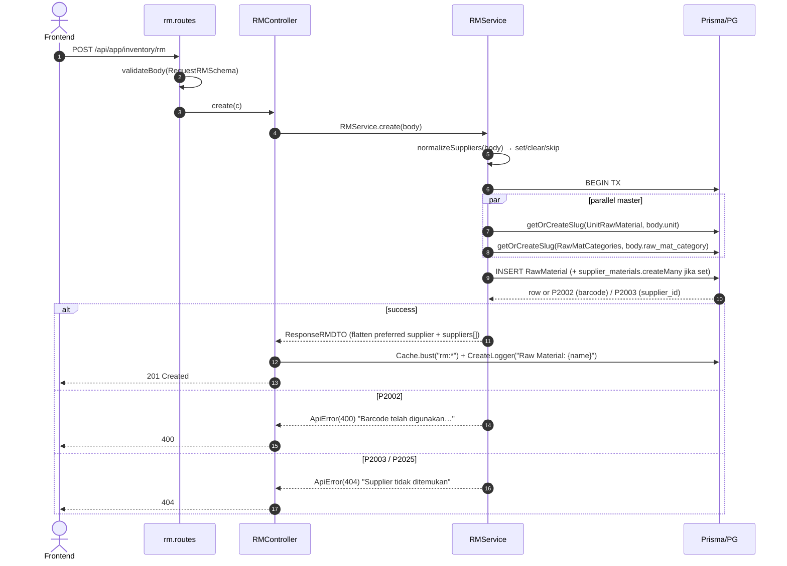
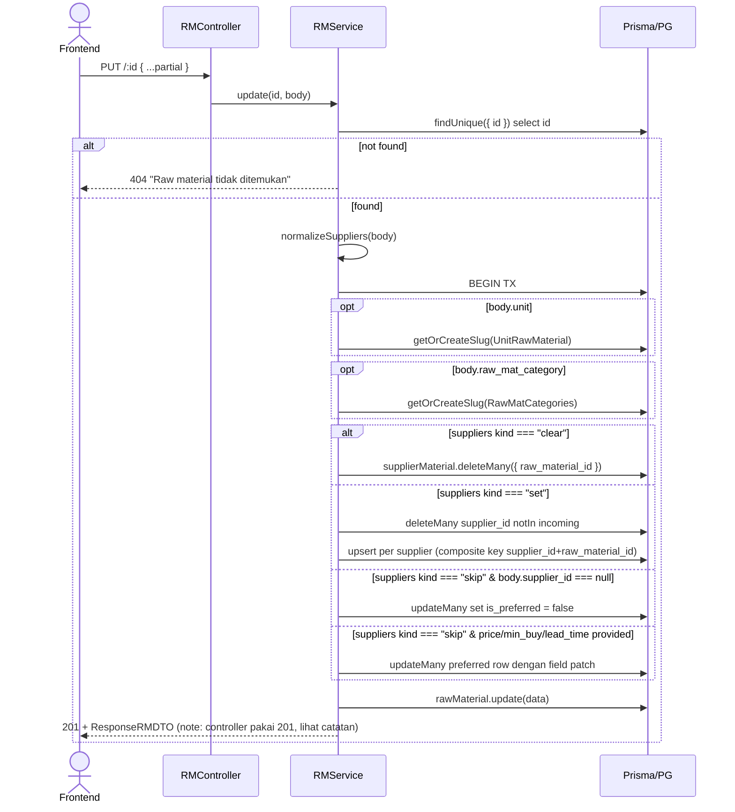

# Module: Inventory / RM (Raw Materials)

**Base path**: `/api/app/inventory/rm`
**Source**: `src/module/application/inventory/rm/`
**Tests**: `src/tests/inventory/rm/` (112 test: 31 core service + 14 core routes + 14 import service + 8 import routes + 14 supplier + 17 category + 14 unit)
**Prisma model**: `RawMaterial` (+ relations `UnitRawMaterial`, `RawMatCategories`, `SupplierMaterial`)

Master data raw material (bahan baku) — fragrance oil (`FO`) dan packaging (`PCKG`). Multi-supplier per material (M:N via `SupplierMaterial`) dengan satu supplier `is_preferred = true`. Mengikuti SOP modul-arsitektur: `schema → service → controller → routes`.

> **Catatan**:
>
> - RM memakai **Redis cache** dengan pattern key `rm:*` (di-bust setelah setiap mutasi lewat `Cache.afterMutation`). Lihat `lib/utils/cache.ts`.
> - Soft delete via `deleted_at` (tanpa kolom `status` di tabel `raw_materials`). Bulk action `"DELETE"` → set timestamp; `"ACTIVE"` → restore.
> - Master `unit` (UoM) dan `raw_mat_category` di-upsert otomatis via `getOrCreateSlug` saat create/update RM. **Tambahan**: sekarang tersedia endpoint dedicated CRUD untuk manage manual — lihat sub-modul `category` dan `unit`.
> - Sub-modul: [`import`](./import/README.md) (async BullMQ bulk import), [`supplier`](./supplier/README.md) (CRUD `Supplier`), [`category`](./category/README.md) (CRUD `RawMatCategories`), [`unit`](./unit/README.md) (CRUD `UnitRawMaterial`).
> - Format `RM_IMPORT_HEADERS` adalah single source of truth untuk header CSV export & import (round-trip safe — SOP `dev-flow §1.I`).

---

## 1. Scope & Fitur

| Fitur                          | Endpoint                                          | Catatan                                                                            |
| :----------------------------- | :------------------------------------------------ | :--------------------------------------------------------------------------------- |
| List + filter + search         | `GET /`                                           | Sort 6 kolom, filter type/category/supplier/unit/status. ILIKE search 5 relasi.    |
| Create (M:N supplier)          | `POST /`                                          | Barcode unik. Auto-upsert `unit`, `raw_mat_category`. `suppliers[]` atau legacy `supplier_id`. |
| Detail                         | `GET /:id`                                        | Include suppliers + preferred flat.                                                |
| Update                         | `PUT /:id`, `PATCH /:id`                          | Partial. Re-sync supplier (`set`/`clear`/legacy patch).                             |
| Soft delete + restore          | `DELETE /:id`, `PATCH /:id/restore`               | `deleted_at = now` / `deleted_at = null`. 400 jika idempotent.                      |
| Bulk action                    | `PUT /bulk-status`                                | `status ∈ {ACTIVE, DELETE}` → restore atau soft-delete sekaligus.                   |
| Permanent delete (clean)       | `DELETE /clean`                                   | Transaksional. Cek FK RESTRICT (`Recipes`, `PurchaseOrderItem`, `ProductionOrderItem`). Cascade `StockMovement`. |
| Export CSV                     | `GET /export`                                     | Cap 50.000 baris. Header selaras `RM_IMPORT_HEADERS`. Expand `supplier_details`.    |
| Bulk import (preview + queue)  | `POST/GET /import/*`                              | BullMQ async, lihat [`./import/README.md`](./import/README.md).                     |
| CRUD Supplier                  | `GET/POST/PUT/DELETE /suppliers/*`                | Lihat [`./supplier/README.md`](./supplier/README.md).                               |
| CRUD Category (RawMatCategories) | `GET/POST/PUT/PATCH/DELETE /categories/*`       | Master kategori RM. Lihat [`./category/README.md`](./category/README.md).            |
| CRUD Unit (UnitRawMaterial)    | `GET/POST/PUT/PATCH/DELETE /units/*`              | Master satuan UoM. Lihat [`./unit/README.md`](./unit/README.md).                     |

### Out of scope (tidak dihandle di sini)

- Stock on hand & movement — di `stock-movement` (tabel `stock_movements`, entity `RAW_MATERIAL`).
- Receipt / GR — di `purchase` (Purchase Receipt) & `manufacturing`.
- Recipe / BoM — di `recipe`.
- Reorder / forecast / open PO — di `forecast`, `recomendation-v2`, `purchase`.

---

## 2. Arsitektur & Flow

### Layer map

```text
┌────────────── routes/rm.routes.ts ─────────────────────────────────┐
│ Sub-mount: /import (RMImportRoutes), /suppliers (SupplierRoutes)   │
│ Hono router + validateBody(RequestRMSchema | partial | bulk)        │
└─────────────────────┬──────────────────────────────────────────────┘
                      ▼
┌──────────── controller/rm.controller.ts ───────────────────────────┐
│ - parseId() via IdParamSchema.parse                                 │
│ - parse Query lewat QueryRMSchema.parse                             │
│ - Cache.afterMutation(fn, "rm:*") untuk semua mutasi                │
│ - CreateLogger audit trail per mutasi (CREATE/UPDATE/DELETE/CLEAN)  │
└─────────────────────┬──────────────────────────────────────────────┘
                      ▼
┌─────────── service/rm.service.ts (RM_INCLUDE include) ─────────────┐
│ - Prisma $transaction (atomic untuk create/update)                  │
│ - getOrCreateSlug(unit, raw_mat_category)                            │
│ - normalizeSuppliers(): legacy single → suppliers[]                  │
│ - syncSuppliers(): set | clear | patch preferred                     │
│ - toDTO(): flatten + Decimal → Number, preferred supplier ke root    │
│ - export(): ExcelJS CSV, cap EXPORT_MAX_ROWS = 50_000                │
│ - clean(): FK RESTRICT pre-check (Recipes, PO, Production) +         │
│            cascade StockMovement                                     │
│ - rethrowPrismaError(): P2002 (barcode) / P2003 / P2025 → ApiError   │
└─────────────────────┬──────────────────────────────────────────────┘
                      ▼
              Prisma → PostgreSQL
```

### Mermaid: Create flow (multi-supplier)



### Mermaid: Update flow (sync suppliers)



> **Catatan status code**: controller `update` saat ini me-return **201** (lihat `rm.controller.ts:65`). Per SOP `dev-flow §1.G`, update seharusnya **200**. Tracking sebagai inkonsistensi — fix kalau touching file ini lagi. <!-- verify -->

### Mermaid: Clean (hard delete)

```mermaid
flowchart TD
    A[DELETE /clean] --> B{Find rawMaterial deleted_at != null}
    B -->|none| E1[400 'Tidak ada raw material yang akan dihapus']
    B -->|some| C{Parallel count: Recipes / POItem / ProductionOrderItem}
    C -->|Recipes > 0| E2[409 'Masih dipakai pada Recipe']
    C -->|POItem > 0| E3[409 'Masih terkait dengan Purchase Order']
    C -->|ProductionOrderItem > 0| E4[409 'Masih terkait dengan Production Order']
    C -->|all 0| D[deleteMany StockMovement where entity_type=RAW_MATERIAL]
    D --> F[rawMaterial.deleteMany]
    F --> G[Return { deleted: count }]
```

---

## 3. DTO / Schemas (end-to-end SSOT)

**Source**: `src/module/application/inventory/rm/rm.schema.ts`. **FE wajib mirror 1:1** — lihat [`../frontend-integration.md`](../frontend-integration.md) §2.

### 3.1 `IdParamSchema`

```ts
export const IdParamSchema = z.object({
    id: z.coerce.number().int().positive("ID raw material tidak valid"),
});

export type IdParamDTO = z.infer<typeof IdParamSchema>;
```

| Field | Type     | Required | Constraint                | Error msg                       |
| :---- | :------- | :------- | :------------------------ | :------------------------------ |
| `id`  | `number` | ✅       | `coerce`, `int`, `> 0`    | `"ID raw material tidak valid"` |

### 3.2 `RequestSupplierMaterialSchema` — item array `suppliers[]`

```ts
export const RequestSupplierMaterialSchema = z.object({
    supplier_id: z.coerce.number().int().positive(),
    unit_price: z.coerce.number().min(0),
    min_buy: z.coerce.number().nullable().optional(),
    lead_time: z.coerce.number().int().positive().nullable().optional(),
    is_preferred: z.boolean().default(false),
    status: z.enum(STATUS).default("ACTIVE").optional(),
});

export type RequestSupplierMaterialDTO = z.infer<typeof RequestSupplierMaterialSchema>;
```

| Field          | Type           | Required | Default    | Constraint                                | Catatan                                                      |
| :------------- | :------------- | :------- | :--------- | :---------------------------------------- | :----------------------------------------------------------- |
| `supplier_id`  | `number` (int) | ✅       | —          | `coerce`, `int`, `> 0`                    | FK `Supplier.id`. P2003 jika invalid.                        |
| `unit_price`   | `number`       | ✅       | —          | `coerce`, `min(0)`                        | Harga per unit (mapped ke `Decimal(18,2)`).                  |
| `min_buy`      | `number?`      | ❌       | `null`     | `coerce`, nullable, optional              | MOQ (Decimal nullable).                                      |
| `lead_time`    | `number?` (int)| ❌       | `null`     | `coerce`, `int`, `> 0`, nullable, optional| Hari (Int nullable).                                         |
| `is_preferred` | `boolean`      | ❌       | `false`    | —                                         | Hanya 1 preferred per RM (tidak di-enforce DB, by convention).|
| `status`       | `STATUS`       | ❌       | `"ACTIVE"` | enum `STATUS`                             | Status row `SupplierMaterial`.                                |

### 3.3 `RequestRMSchema` — POST / & PUT/PATCH /:id (partial)

```ts
export const RequestRMSchema = z.object({
    barcode: z
        .string({ error: "Barcode tidak valid" })
        .max(50, "Barcode material tidak boleh lebih dari 50 karakter")
        .nullable()
        .optional(),
    name: z
        .string({ error: "Nama material tidak boleh kosong" })
        .max(255, "Nama material tidak boleh lebih dari 255 karakter"),
    type: z.enum(MaterialType).nullable().optional(),
    min_stock: z.coerce.number().nullable().optional(),
    unit: z.string().min(1, "Unit tidak boleh kosong"),
    raw_mat_category: z.string().optional(),
    suppliers: z.array(RequestSupplierMaterialSchema).optional(),

    // Kompatibilitas form lama: supplier tunggal di root → service memetakan ke `suppliers`.
    supplier_id: z.coerce.number().int().positive().nullable().optional(),
    price: z.coerce.number().nullable().optional(),
    min_buy: z.coerce.number().nullable().optional(),
    lead_time: z.coerce.number().int().positive().nullable().optional(),
});

export type RequestRMDTO = z.infer<typeof RequestRMSchema>;
```

| Field              | Type                          | Required | Default | Constraint                                                | Error msg                                            | Catatan                                                           |
| :----------------- | :---------------------------- | :------- | :------ | :-------------------------------------------------------- | :--------------------------------------------------- | :---------------------------------------------------------------- |
| `barcode`          | `string \| null`              | ❌       | —       | `max(50)`, nullable, optional                             | `"Barcode tidak valid"`, `"…tidak boleh lebih dari 50 karakter"` | `@unique` di DB. Boleh kosong (auto-generate? lihat service).     |
| `name`             | `string`                      | ✅       | —       | `max(255)`                                                | `"Nama material tidak boleh kosong"` / `"…melebihi 255"` | —                                                                 |
| `type`             | `MaterialType \| null`        | ❌       | —       | enum, nullable, optional                                  | (default Zod)                                        | `FO` (fragrance oil) atau `PCKG` (packaging).                     |
| `min_stock`        | `number \| null`              | ❌       | —       | `coerce`, nullable, optional                              | —                                                    | Stock minimum (Decimal nullable).                                  |
| `unit`             | `string`                      | ✅       | —       | `min(1)`                                                  | `"Unit tidak boleh kosong"`                          | Nama UoM (`ML`, `KG`, `PCS`). Auto-upsert via `getOrCreateSlug`.  |
| `raw_mat_category` | `string`                      | ❌       | —       | optional                                                  | —                                                    | Nama kategori. Auto-upsert via `getOrCreateSlug`.                  |
| `suppliers`        | `RequestSupplierMaterialDTO[]`| ❌       | —       | array, optional                                           | —                                                    | Bila `[]` → clear semua. Bila `[..]` → set sebagai SSOT.          |
| `supplier_id`      | `number \| null`              | ❌       | —       | `coerce`, `int`, `> 0`, nullable, optional                | —                                                    | **Legacy**: single supplier. Mapped jadi `suppliers[0]` preferred.|
| `price`            | `number \| null`              | ❌       | —       | `coerce`, nullable, optional                              | —                                                    | **Legacy**: harga supplier tunggal.                                |
| `min_buy`          | `number \| null`              | ❌       | —       | `coerce`, nullable, optional                              | —                                                    | **Legacy**: MOQ supplier tunggal.                                  |
| `lead_time`        | `number \| null` (int)        | ❌       | —       | `coerce`, `int`, `> 0`, nullable, optional                | —                                                    | **Legacy**: lead time supplier tunggal (hari).                     |

**Aturan service `normalizeSuppliers`** (`rm.service.ts:396`):

- `Array.isArray(suppliers)` → `kind: "set"` (atau `"clear"` jika length 0). SSOT.
- `typeof supplier_id === "number" && > 0` → `kind: "set"` synthetic dengan 1 row preferred (legacy).
- Selain itu → `kind: "skip"` (jangan sentuh `supplier_materials`).
- Saat `supplier_id === null` di update → un-prefer semua row (`is_preferred = false`).
- Saat `price` / `min_buy` / `lead_time` provided tanpa `supplier_id` & tanpa `suppliers` → patch row preferred.

### 3.4 `ResponseSupplierMaterialSchema`

```ts
export const ResponseSupplierMaterialSchema = z.object({
    supplier_id: z.number(),
    supplier_name: z.string(),
    supplier_country: z.string(),
    supplier_source: z.enum(RawMaterialSource).nullable().optional(),
    unit_price: z.number(),
    min_buy: z.number().nullable().optional(),
    lead_time: z.number().nullable().optional(),
    is_preferred: z.boolean(),
    status: z.enum(STATUS),
});
```

### 3.5 `ResponseRMSchema`

```ts
export const ResponseRMSchema = z.object({
    id: z.number(),
    barcode: z.string().nullable(),
    name: z.string(),
    type: z.enum(MaterialType).nullable().optional(),
    min_stock: z.number().nullable().optional(),
    source: z.enum(RawMaterialSource).nullable().optional(),
    price: z.number().nullable().optional(),
    min_buy: z.number().nullable().optional(),
    lead_time: z.number().nullable().optional(),
    unit_raw_material: z.object({ id: z.number(), name: z.string() }),
    raw_mat_category: z
        .object({ id: z.number(), name: z.string(), slug: z.string() })
        .optional(),
    supplier: z
        .object({ id: z.number(), name: z.string(), country: z.string() })
        .optional(),
    suppliers: z.array(ResponseSupplierMaterialSchema).default([]),
    created_at: z.date(),
    updated_at: z.date().nullable(),
    deleted_at: z.date().nullable(),
});

export type ResponseRMDTO = z.infer<typeof ResponseRMSchema>;
```

**Catatan transformasi `toDTO`** (`rm.service.ts:352`):

| Field response       | Sumber Prisma                                          | Transformasi                                                                  |
| :------------------- | :----------------------------------------------------- | :---------------------------------------------------------------------------- |
| `min_stock`          | `RawMaterial.min_stock` (Decimal?)                     | `min_stock !== null ? Number(min_stock) : null`.                              |
| `source`             | `preferred.supplier.source` (`RawMaterialSource`)      | Dari row `supplier_materials` yang `is_preferred = true`; `null` jika tidak. |
| `price`              | `preferred.unit_price` (Decimal)                       | `Number(preferred.unit_price)`.                                               |
| `min_buy`            | `preferred.min_buy` (Decimal?)                         | `Number(min_buy)` atau `null`.                                                |
| `lead_time`          | `preferred.lead_time` (Int?)                           | Diteruskan (`number?`).                                                       |
| `unit_raw_material`  | `RawMaterial.unit_raw_material`                        | `{ id, name }` flat.                                                          |
| `raw_mat_category`   | `RawMaterial.raw_mat_category`                         | `{ id, name, slug }` (omit jika null).                                        |
| `supplier`           | preferred row                                          | `{ id, name, country }` (omit jika tidak ada preferred). **Legacy convenience.**|
| `suppliers`          | `RawMaterial.supplier_materials[]`                     | Array map: `Number(unit_price)`, `Number(min_buy)`, dst.                      |

### 3.6 `QueryRMSchema` — GET / & GET /export

```ts
export const RM_SORT_KEYS = [
    "barcode",
    "name",
    "updated_at",
    "price",
    "created_at",
    "category",
] as const;

export const QueryRMSchema = z.object({
    page: z.coerce.number().int().positive().default(1).optional(),
    take: z.coerce.number().int().positive().max(100).default(25).optional(),
    status: z.enum(["actived", "deleted"]).default("actived"),
    type: z.enum(MaterialType).optional(),
    search: z.string().optional(),
    sortBy: z.enum(RM_SORT_KEYS).default("updated_at"),
    sortOrder: z.enum(["asc", "desc"]).default("asc"),
    category_id: z.coerce.number().int().positive().optional(),
    supplier_id: z.coerce.number().int().positive().optional(),
    unit_id: z.coerce.number().int().positive().optional(),
    visibleColumns: z.string().optional(),
});

export type QueryRMDTO = z.infer<typeof QueryRMSchema>;
```

| Param            | Type                       | Default        | Constraint                  | Catatan                                                                            |
| :--------------- | :------------------------- | :------------- | :-------------------------- | :--------------------------------------------------------------------------------- |
| `page`           | `number` (int)             | `1`            | `coerce`, `int`, `> 0`      | —                                                                                  |
| `take`           | `number` (int)             | `25`           | `coerce`, `int`, `1..100`   | Diabaikan di `/export` (override `EXPORT_MAX_ROWS = 50_000`).                       |
| `status`         | `"actived" \| "deleted"`   | `"actived"`    | enum                        | `actived` → `deleted_at = null`. `deleted` → `deleted_at != null` (trash).         |
| `type`           | `MaterialType`             | —              | enum                        | `FO` atau `PCKG`.                                                                  |
| `search`         | `string`                   | —              | optional                    | ILIKE on `name` + `unit.name` + `category.name` + `supplier.name`; `startsWith` `barcode`. |
| `sortBy`         | enum 6 nilai               | `"updated_at"` | whitelist (`RM_SORT_KEYS`)  | `category` → `raw_mat_category.name`; lainnya kolom langsung.                       |
| `sortOrder`      | `"asc" \| "desc"`          | `"asc"`        | enum                        | —                                                                                  |
| `category_id`    | `number?` (int)            | —              | `coerce`, `int`, `> 0`      | Filter FK.                                                                         |
| `supplier_id`    | `number?` (int)            | —              | `coerce`, `int`, `> 0`      | Filter via relasi `supplier_materials.some`.                                       |
| `unit_id`        | `number?` (int)            | —              | `coerce`, `int`, `> 0`      | Filter FK `unit_id`.                                                               |
| `visibleColumns` | `string?`                  | —              | optional                    | CSV ID kolom untuk export. `supplier_details` mengaktifkan ekspansi supplier group. |

### 3.7 `BulkActionEnum` & `BulkStatusRMSchema` — PUT /bulk-status

```ts
// RawMaterial tidak punya kolom status — aksi ini memetakan ke `deleted_at`.
export const BulkActionEnum = z.enum(["ACTIVE", "DELETE"]);

export const BulkStatusRMSchema = z.object({
    ids: z.array(z.number().int().positive()).min(1, "Minimal 1 raw material harus dipilih"),
    status: BulkActionEnum,
});

export type BulkStatusRMDTO = z.infer<typeof BulkStatusRMSchema>;
export type BulkActionDTO = z.infer<typeof BulkActionEnum>;
```

| Field    | Type            | Required | Constraint                  | Error msg                                  | Catatan                              |
| :------- | :-------------- | :------- | :-------------------------- | :----------------------------------------- | :----------------------------------- |
| `ids`    | `number[]`      | ✅       | `min(1)`, semua int positif | `"Minimal 1 raw material harus dipilih"`   | —                                    |
| `status` | `BulkActionDTO` | ✅       | enum `["ACTIVE","DELETE"]`  | (default Zod)                              | `DELETE` soft-delete; `ACTIVE` restore.|

### 3.8 Enum referensi (Prisma)

```prisma
enum MaterialType {
    FO
    PCKG
}

enum RawMaterialSource {
    LOCAL
    IMPORT
}

enum STATUS {
    PENDING
    ACTIVE
    FAVOURITE
    BLOCK
    DELETE
}
```

Lokasi: `prisma/schema.prisma:1328` (`MaterialType`), `prisma/schema.prisma:1333` (`RawMaterialSource`), `prisma/schema.prisma:1338` (`STATUS`).

### 3.9 Catatan integrasi FE

- Schema mirror: `app/src/app/(application)/inventory/rm/server/inventory.rm.schema.ts` 🚧 TBD.
- DTO export: `RequestRMDTO`, `ResponseRMDTO`, `QueryRMDTO`, `BulkStatusRMDTO`, `RequestSupplierMaterialDTO`.
- Mirror, naming dot-chain, hook split, dan komponen ada di [`../frontend-integration.md`](../frontend-integration.md).

---

## 4. Routing untuk integrasi Frontend

Semua endpoint terproteksi `authMiddleware` (session cookie + Redis session) — lihat [AUTH.md](../../../AUTH.md).

### 4.1 Daftar endpoint RM (tanpa sub-modul)

> **Status code SOP** (`dev-flow §1.G`): create → 201; async enqueue → 202; read/update/status/bulk/clean → 200. **RM saat ini me-return 201 untuk update** (lihat catatan §2 Update flow) — inkonsistensi yang harus ditangani saat sentuh controller berikutnya. <!-- verify -->

| #   | Method  | Path                | Body / Query                                  | Body type | Response (status)                  | Error utama                                              |
| :-- | :------ | :------------------ | :-------------------------------------------- | :-------- | :--------------------------------- | :------------------------------------------------------- |
| 1   | GET     | `/`                 | `QueryRMDTO` (querystring)                    | —         | `{ data, len }` (**200**)          | 400 (query invalid)                                      |
| 2   | POST    | `/`                 | `RequestRMDTO`                                | JSON      | `ResponseRMDTO` (**201**)          | 400 (Zod / barcode dup), 404 (supplier FK)               |
| 3   | GET     | `/:id`              | —                                             | —         | `ResponseRMDTO` (**200**)          | 400 (id invalid), 404                                    |
| 4   | PUT     | `/:id`              | `Partial<RequestRMDTO>`                       | JSON      | `ResponseRMDTO` (**201** ⚠)        | 400 (Zod), 404 (RM atau supplier FK)                     |
| 5   | PATCH   | `/:id`              | `Partial<RequestRMDTO>`                       | JSON      | `ResponseRMDTO` (**201** ⚠)        | 400 / 404 (alias dari PUT)                               |
| 6   | DELETE  | `/:id`              | —                                             | —         | `{}` (**200**)                     | 400 (sudah deleted), 404                                 |
| 7   | PATCH   | `/:id/restore`      | —                                             | —         | `{}` (**200**)                     | 400 (tidak deleted), 404                                 |
| 8   | PUT     | `/bulk-status`      | `{ ids, status: "ACTIVE"\|"DELETE" }`         | JSON      | `{ affected: n }` (**200**)        | 400 (ids kosong / Zod), 404 (no match)                   |
| 9   | DELETE  | `/clean`            | —                                             | —         | `{ deleted: n }` (**200**)         | 400 (tidak ada deleted), 409 (FK Recipe / PO / Production) |
| 10  | GET     | `/export`           | `QueryRMDTO` + `visibleColumns`               | —         | `text/csv` (**200**, buffer)       | 400 (>50k rows)                                          |

### 4.2 Endpoint sub-modul (mount terpisah)

| Sub-mount     | Detail                                                                                                  |
| :------------ | :------------------------------------------------------------------------------------------------------ |
| `/import`     | 4 endpoint (`POST /preview`, `GET /preview/:import_id`, `POST /execute`, `GET /status/:import_id`). Lihat [`./import/README.md`](./import/README.md). |
| `/suppliers`  | CRUD `Supplier` + bulk-delete. Lihat [`./supplier/README.md`](./supplier/README.md).                    |
| `/categories` | CRUD `RawMatCategories` + change-status. Lihat [`./category/README.md`](./category/README.md).          |
| `/units`      | CRUD `UnitRawMaterial`. Lihat [`./unit/README.md`](./unit/README.md).                                   |

### 4.3 Konvensi response

Semua endpoint JSON sukses memakai wrapper standar:

```jsonc
{
  "query":  null | <echo querystring>,
  "status": "success",
  "data":   <payload>
}
```

Error:

```jsonc
{ "status": "error", "message": "<pesan>" }
```

Status code mengikuti HTTP standar (200/201/400/404/409/500).

### 4.4 Contoh integrasi frontend

Snippet di bawah hanya **ringkasan endpoint RM inti**. Konvensi lengkap (class `InventoryRMService`, `setupCSRFToken`, hook split 5, queryKey `["inventory.rm", ...]`, invalidation, error handler `FetchError`, debounce, design tokens) **ada di** [`../frontend-integration.md`](../frontend-integration.md).

```ts
const API = `${process.env.NEXT_PUBLIC_API}/api/app/inventory/rm`;

static async list(params: QueryRMDTO) {
    const { data } = await api.get<ApiSuccessResponse<{ len: number; data: Array<ResponseRMDTO> }>>(API, { params });
    return data.data;
}
static async create(body: RequestRMDTO) {
    await setupCSRFToken();
    await api.post(API, body);
}
static async update(id: number, body: Partial<RequestRMDTO>) {
    await setupCSRFToken();
    await api.put(`${API}/${id}`, body);
}
static async bulkStatus(ids: number[], status: "ACTIVE" | "DELETE") {
    await setupCSRFToken();
    await api.put(`${API}/bulk-status`, { ids, status });
}
static async exportCsv(params: QueryRMDTO): Promise<Blob> {
    const { data } = await api.get<Blob>(`${API}/export`, { params, responseType: "blob" });
    return data;
}
```

### 4.5 Header & autentikasi

- Cookie session: nama dari `env.SESSION_COOKIE_NAME` (default `session`).
- CSRF: header `x-csrf-token` (lihat [AUTH.md](../../../AUTH.md)).
- `Content-Type: application/json` untuk semua mutasi.

---

## 5. Database / Indexes

Model `RawMaterial` di `prisma/schema.prisma:203`:

```prisma
model RawMaterial {
  id                                Int                       @id @default(autoincrement())
  barcode                           String?                   @unique @db.VarChar(50)
  name                              String                    @db.VarChar(255)
  min_stock                         Decimal?                  @db.Decimal(18, 2)
  unit_id                           Int
  raw_mat_categories_id             Int?
  created_at                        DateTime                  @default(now())
  deleted_at                        DateTime?
  updated_at                        DateTime?                 @updatedAt
  type                              MaterialType?
  // relations
  raw_mat_category                  RawMatCategories?         @relation(...)
  unit_raw_material                 UnitRawMaterial           @relation(...)
  supplier_materials                SupplierMaterial[]
  // ...

  @@index([deleted_at])
  @@index([type])
  @@index([unit_id])
  @@index([raw_mat_categories_id])
  @@index([updated_at])
  @@map("raw_materials")
}
```

Tabel terkait:

- `unit_raw_materials` (`UnitRawMaterial`) — `slug @unique`. Auto-upsert.
- `raw_mat_categories` (`RawMatCategories`) — `slug @unique`. Auto-upsert.
- `supplier_materials` (`SupplierMaterial`) — `@@unique([supplier_id, raw_material_id])` (composite). Index per kolom FK.
- `suppliers` (`Supplier`) — `slug @unique nullable`, `phone @unique nullable`, index `name/country/source/updated_at`.

**Migration trigram GIN**: belum ada index trigram khusus untuk RM. ILIKE search saat ini full table scan untuk pattern `%text%` — siapkan migration `raw_materials_name_trgm` + `suppliers_name_trgm` kalau volume bertambah. <!-- verify -->

---

## 6. Error catalog

| HTTP | Pesan                                                                       | Trigger                                                            |
| :--- | :-------------------------------------------------------------------------- | :----------------------------------------------------------------- |
| 400  | `Validation Error` + array `{ message, path }`                              | Body / query gagal Zod (`validateBody`).                            |
| 400  | `ID raw material tidak valid`                                               | `parseId()` Zod fail.                                              |
| 400  | `Barcode telah digunakan, tolong ubah dengan barcode lainnya`               | P2002 saat `create` / `update`.                                    |
| 400  | `Raw material sudah berada pada status deleted`                             | `DELETE /:id` ke row yang sudah soft-deleted.                       |
| 400  | `Raw material tidak berada pada status deleted`                             | `PATCH /:id/restore` ke row yang aktif.                             |
| 400  | `Tidak ada raw material yang dipilih`                                       | `bulkStatus` dipanggil dengan `ids` kosong (defense layer service). |
| 400  | `Tidak ada raw material yang akan dihapus`                                  | `clean()` tidak menemukan kandidat `deleted_at != null`.            |
| 400  | `Data terlalu besar ({n} baris). Gunakan filter untuk membatasi maksimal 50000 baris.` | Export count > `EXPORT_MAX_ROWS`.                          |
| 404  | `Raw material tidak ditemukan`                                              | `update` / `detail` / `delete` / `restore` find = null.             |
| 404  | `Supplier tidak ditemukan`                                                  | P2003 / P2025 saat insert/update `SupplierMaterial`.                |
| 404  | `Tidak ada raw material yang cocok dengan id terpilih`                      | `bulkStatus` updateMany affected = 0.                               |
| 409  | `Raw material masih dipakai pada Recipe. Hapus permanen ditolak.`           | `clean()` FK count `Recipes` > 0.                                   |
| 409  | `Raw material masih terkait dengan Purchase Order. Hapus permanen ditolak.` | `clean()` FK count `PurchaseOrderItem` > 0.                         |
| 409  | `Raw material masih terkait dengan Production Order. Hapus permanen ditolak.` | `clean()` FK count `ProductionOrderItem` > 0.                     |
| 500  | `Internal Server Error`                                                     | Error tak terduga (re-throw non-Prisma).                            |

---

## 7. Testing

Lokasi: `src/tests/inventory/rm/`. **Total scope RM (semua) = 112 test**:

| File                                | Suite                              | Test count |
| :---------------------------------- | :--------------------------------- | :--------- |
| `rm.service.test.ts`                | create/update/detail/list/delete/restore/bulkStatus/clean/export/normalizeSuppliers | 31         |
| `rm.routes.test.ts`                 | HTTP integration via `app.request` | 14         |
| `import/import.service.test.ts`     | preview/execute/getStatus/getPreview | 14       |
| `import/import.routes.test.ts`      | HTTP integration import            | 8          |
| `supplier/supplier.service.test.ts` | CRUD + bulkDelete + Prisma error mapping | 14   |
| `category/category.service.test.ts` | create/update/changeStatus/detail/list/delete + P2002/P2025 | 17 |
| `unit/unit.service.test.ts`         | create/update/detail/list/delete + P2002/P2025 + name defense | 14 |

### 7.1 Setup global

`src/tests/setup.ts` me-mock:

- `env` (envalid bypass)
- `prisma` (`rawMaterial`, `supplierMaterial`, `supplier`, `unitRawMaterial`, `rawMatCategories`, `recipes`, `purchaseOrderItem`, `productionOrderItem`, `stockMovement`)
- `redisClient` (get/set/del/expire/keys/exists)
- `logger`
- `bullmq` Queue/Worker (untuk test import)

### 7.2 Menjalankan test

```bash
# Semua test RM (core + import + supplier)
rtk npm test -- --run src/tests/inventory/rm/

# Hanya RM core
rtk npm test -- --run src/tests/inventory/rm/rm.service.test.ts src/tests/inventory/rm/rm.routes.test.ts

# Watch
rtk npx vitest src/tests/inventory/rm/
```

---

## 8. Postman testing

Import koleksi `docs/postman/erp-mandalika.postman_collection.json` → folder `Inventory / RM`. Set environment variables:

| Var          | Value contoh                       |
| :----------- | :--------------------------------- |
| `base_url`   | `http://localhost:3000`            |
| `session_id` | `<isi dari login>`                 |
| `csrf_token` | `<dari cookie / login response>`   |

Header global tiap request:

- `Cookie: session={{session_id}}`
- `x-csrf-token: {{csrf_token}}` (untuk mutasi)
- `Content-Type: application/json` (untuk POST/PUT/PATCH dengan body)

### 8.1 List

```
GET {{base_url}}/api/app/inventory/rm?page=1&take=25&status=actived&sortBy=updated_at&sortOrder=asc
```

### 8.2 Create (multi-supplier modern)

```http
POST {{base_url}}/api/app/inventory/rm
Content-Type: application/json

{
  "barcode": "RM-FO-0001",
  "name": "Fragrance Oil Citrus Burst",
  "type": "FO",
  "min_stock": 100,
  "unit": "ML",
  "raw_mat_category": "Fragrance Oil",
  "suppliers": [
    { "supplier_id": 1, "unit_price": 25000, "min_buy": 500, "lead_time": 14, "is_preferred": true, "status": "ACTIVE" },
    { "supplier_id": 2, "unit_price": 27000, "min_buy": 300, "lead_time": 10, "is_preferred": false, "status": "ACTIVE" }
  ]
}
```

### 8.3 Create (legacy single supplier)

```http
POST {{base_url}}/api/app/inventory/rm
Content-Type: application/json

{
  "barcode": "RM-PCKG-0001",
  "name": "Glass Bottle 110ml",
  "type": "PCKG",
  "unit": "PCS",
  "raw_mat_category": "Packaging",
  "supplier_id": 1,
  "price": 8500,
  "min_buy": 1000,
  "lead_time": 7
}
```

### 8.4 Update / Patch supplier

```http
PUT {{base_url}}/api/app/inventory/rm/1
Content-Type: application/json

{
  "name": "Fragrance Oil Citrus Burst (Premium)",
  "suppliers": [
    { "supplier_id": 1, "unit_price": 26000, "min_buy": 500, "lead_time": 14, "is_preferred": true }
  ]
}
```

### 8.5 Bulk status

```http
PUT {{base_url}}/api/app/inventory/rm/bulk-status
Content-Type: application/json

{ "ids": [1, 2, 3], "status": "DELETE" }
```

### 8.6 Clean

```http
DELETE {{base_url}}/api/app/inventory/rm/clean
```

### 8.7 Export CSV

```
GET {{base_url}}/api/app/inventory/rm/export?status=actived&visibleColumns=id,barcode,name,unit,supplier_details
```

### 8.8 Expected response sukses

```jsonc
{
  "query": null,
  "status": "success",
  "data": {
    "id": 1,
    "barcode": "RM-FO-0001",
    "name": "Fragrance Oil Citrus Burst",
    "type": "FO",
    "min_stock": 100,
    "source": "LOCAL",
    "price": 25000,
    "min_buy": 500,
    "lead_time": 14,
    "unit_raw_material": { "id": 3, "name": "ML" },
    "raw_mat_category": { "id": 5, "name": "Fragrance Oil", "slug": "fragrance-oil" },
    "supplier": { "id": 1, "name": "PT Aroma Sentosa", "country": "ID" },
    "suppliers": [ /* ResponseSupplierMaterialDTO[] */ ],
    "created_at": "2026-05-19T03:00:00.000Z",
    "updated_at": "2026-05-19T03:00:00.000Z",
    "deleted_at": null
  }
}
```

### 8.9 Expected response error

```jsonc
// 400 — barcode dup
{ "status": "error", "message": "Barcode telah digunakan, tolong ubah dengan barcode lainnya" }

// 404 — supplier FK
{ "status": "error", "message": "Supplier tidak ditemukan" }

// 409 — clean FK
{ "status": "error", "message": "Raw material masih dipakai pada Recipe. Hapus permanen ditolak." }
```

---

## 9. Activity log

Setiap mutasi memanggil `CreateLogger(payload)` dari `src/module/application/shared/activity-logger.ts`. Payload:

| Endpoint           | activity   | description                                    |
| :----------------- | :--------- | :--------------------------------------------- |
| `POST /`           | `CREATE`   | `Raw Material: {name}`                         |
| `PUT/PATCH /:id`   | `UPDATE`   | `Raw Material #{id}: {name}`                   |
| `DELETE /:id`      | `DELETE`   | `Raw Material #{id}`                           |
| `PATCH /:id/restore` | `UPDATE` | `Restore Raw Material #{id}`                   |
| `DELETE /clean`    | `CLEAN`    | `Raw Material`                                 |
| `PUT /bulk-status` | `DELETE` / `UPDATE` | `Bulk {status} Raw Material for {n} items` |

`email` diambil dari `c.get("session")` (set oleh `authMiddleware`). Disimpan di tabel `logging_activities`.

---

## 10. Checklist saat menambah fitur RM

- [ ] Update `rm.schema.ts` (Zod chain + DTO export).
- [ ] Tulis test TDD di `src/tests/inventory/rm/rm.service.test.ts` lebih dulu (atau `rm.routes.test.ts` untuk integrasi HTTP).
- [ ] Tambah index Prisma kalau filter/sort baru (`@@index` di model + migration).
- [ ] Update dokumen ini (section yang relevan: 1, 3, 4, 5, 6, 8) + tabel di `../README.md` jika ada endpoint baru.
- [ ] Pastikan status code mengikuti `dev-flow §1.G` (201 create, 202 async, 200 sisanya). **Saat ini update masih 201 — fix kalau touching controller.**
- [ ] Tambahkan `Cache.afterMutation` di controller untuk semua mutasi.
- [ ] Update Postman folder `Inventory / RM` dengan item baru (lewat skill `module-documentation`).
- [ ] Update FE mirror (`../frontend-integration.md` §2/3/4/5) saat FE menyentuh schema RM.
- [ ] `rtk tsc --noEmit` + `rtk npm test -- --run src/tests/inventory/rm/`.

---

## 11. Referensi silang

- Arsitektur global: [`../../ARCHITECTURE.md`](../../../ARCHITECTURE.md)
- Konvensi modul: [`../../CONVENTIONS.md`](../../../CONVENTIONS.md)
- Auth & session: [`../../AUTH.md`](../../../AUTH.md)
- Error format: [`../../ERROR_HANDLING.md`](../../../ERROR_HANDLING.md)
- Database conventions: [`../../DATABASE.md`](../../../DATABASE.md)
- Module index: [`../README.md`](../README.md)
- Frontend integration: [`../frontend-integration.md`](../frontend-integration.md)
- Sub-modul:
    - [`./import/README.md`](./import/README.md) — bulk import via BullMQ
    - [`./supplier/README.md`](./supplier/README.md) — master `Supplier`
    - [`./category/README.md`](./category/README.md) — master `RawMatCategories`
    - [`./unit/README.md`](./unit/README.md) — master `UnitRawMaterial`
- Modul terkait:
    - `recipe` — BoM yang konsumsi `RawMaterial`.
    - `purchase` — RFQ, PO, Receipt, Vendor Return.
    - `manufacturing` — `ProductionOrder` consume RM.
    - `stock-movement` — pergerakan stock per `entity_type = RAW_MATERIAL`.
