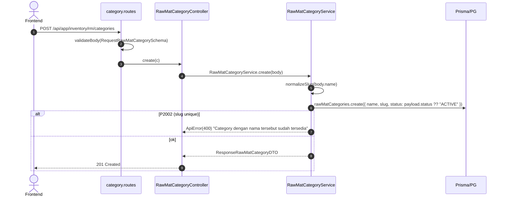

# Module: Inventory / RM / Category

**Base path**: `/api/app/inventory/rm/categories`
**Source**: `src/module/application/inventory/rm/category/`
**Tests**: `src/tests/inventory/rm/category/category.service.test.ts` (17 test)
**Prisma model**: `RawMatCategories` (mapped table `raw_mat_categories`; relasi 1:N → `RawMaterial`)

Master data **kategori Raw Material** (mis. `Fragrance Oil`, `Packaging`, `Kain`, `Benang`). Slug auto-generate (`normalizeSlug(name)`) untuk lookup unik. Mengikuti pola supplier — ORM-only (tanpa `$queryRaw`), try/catch P2002/P2025 (tidak pakai TOCTOU pre-check), select whitelist `CATEGORY_SELECT`.

> **Catatan**:
>
> - Mount path **plural** (`/categories`) di `rm.routes.ts:14`. Class & file pakai singular (`category`).
> - Selain endpoint dedicated ini, RM **masih** auto-upsert kategori saat `POST /api/app/inventory/rm` (lihat `getOrCreateSlug` di `rm.service.ts`). Endpoint ini melengkapi: rename, ganti status, hard-delete kategori yang tidak terpakai.
> - **Hard delete** (bukan soft). Defensive: cek `rawMaterial.count({ where: { raw_mat_categories_id } })` sebelum delete — kalau masih dipakai, tolak 400.
> - Tidak ada `Cache.afterMutation` (`rm:*`) di controller saat ini. Kalau RM list menampilkan nama kategori, mutasi kategori belum bust cache RM. <!-- verify -->
> - Tidak ada `CreateLogger` audit per mutasi. Pasang saat sentuh controller berikutnya. <!-- verify -->
> - Legacy folder `src/module/application/rawmat/category/` masih ada — biarkan; canonical scope ada di sini (memory `rm_module_scope_split.md`).

---

## 1. Scope & Fitur

| Fitur                | Endpoint                          | Catatan                                                                                |
| :------------------- | :-------------------------------- | :------------------------------------------------------------------------------------- |
| List + search + sort | `GET /`                           | Search ILIKE `name` + `slug`. Sort 3 kolom (`created_at`/`updated_at`/`name`). Filter `status`. Pagination max 100. |
| Create               | `POST /`                          | Slug auto via `normalizeSlug`. Default `status = ACTIVE`. P2002 → 400.                  |
| Detail               | `GET /:id`                        | 404 jika tidak ditemukan.                                                              |
| Update (full/partial)| `PUT /:id` / `PATCH /:id`         | Partial; minimal 1 field (refine). Slug regen kalau `name` ikut diubah.                  |
| Change status        | `PATCH /:id/status`               | Body `{ status: STATUS }`. Tidak rename slug.                                          |
| Hard delete          | `DELETE /:id`                     | 400 jika `rawMaterial.count(...)` > 0. 404 jika P2025.                                  |

### Out of scope

- Bulk-delete (belum ada — tambah saat butuh). Cek pola `BulkDeleteSupplierSchema` di `supplier/`.
- Soft delete / restore — kategori tidak punya kolom `deleted_at`. Tetap pakai `status` (`BLOCK` untuk arsip).
- Mengubah relasi ke `RawMaterial` — pakai endpoint `inventory/rm` (`raw_mat_category` di body `RequestRMDTO`).

---

## 2. Arsitektur & Flow

### Layer map

```text
┌──────── routes/category.routes.ts ──────────────────────────┐
│ GET    /:id        → detail                                  │
│ PUT    /:id        (validateBody(UpdateRawMatCategorySchema))│
│ PATCH  /:id        (validateBody(UpdateRawMatCategorySchema))│
│ PATCH  /:id/status (validateBody(ChangeStatusRawMatCategorySchema)) │
│ DELETE /:id        → delete (hard)                           │
│ GET    /           → list                                    │
│ POST   /           (validateBody(RequestRawMatCategorySchema)) │
└────────────────────────┬────────────────────────────────────┘
                         ▼
┌──────── controller/category.controller.ts ──────────────────┐
│ - parseId() via IdParamSchema.parse                          │
│ - parse Query lewat QueryRawMatCategorySchema.parse          │
│ - Tidak ada CreateLogger (TBD)                               │
│ - Tidak ada Cache.afterMutation (TBD)                        │
└────────────────────────┬────────────────────────────────────┘
                         ▼
┌──────── service/category.service.ts ────────────────────────┐
│ - CATEGORY_SELECT: shape ResponseRawMatCategoryDTO            │
│ - create/update: normalizeSlug(name) saat name di-set         │
│ - delete: pre-check count(rawMaterial.raw_mat_categories_id)  │
│ - rethrowPrismaError: P2002 → 400, P2025 → 404                │
└────────────────────────┬────────────────────────────────────┘
                         ▼
                 Prisma → PostgreSQL (raw_mat_categories)
```

### Mermaid: Create flow



### Mermaid: Delete (hard) flow

```mermaid
flowchart TD
    A[DELETE /:id] --> B[count rawMaterial where raw_mat_categories_id=id]
    B -->|usedCount > 0| E1[400 'Category masih digunakan oleh beberapa Raw Material']
    B -->|usedCount = 0| C[rawMatCategories.delete where id]
    C -->|P2025| E2[404 'Category tidak ditemukan']
    C -->|ok| D[Return { deleted: 1 }]
```

---

## 3. DTO / Schemas (end-to-end SSOT)

**Source**: `src/module/application/inventory/rm/category/category.schema.ts`.

### 3.1 `IdParamSchema`

```ts
export const IdParamSchema = z.object({
    id: z.coerce.number().int().positive("ID category tidak valid"),
});

export type IdParamDTO = z.infer<typeof IdParamSchema>;
```

| Field | Type     | Required | Constraint                | Error msg                  |
| :---- | :------- | :------- | :------------------------ | :------------------------- |
| `id`  | `number` | ✅       | `coerce`, `int`, `> 0`    | `"ID category tidak valid"` |

### 3.2 `RequestRawMatCategorySchema` — POST /

```ts
export const RequestRawMatCategorySchema = z.object({
    name: z
        .string({ error: "Nama category tidak boleh kosong" })
        .min(2, "Nama category minimal 2 karakter")
        .max(255, "Nama category maksimal 255 karakter"),
    status: z.enum(STATUS).optional(),
});

export type RequestRawMatCategoryDTO = z.infer<typeof RequestRawMatCategorySchema>;
```

| Field    | Type      | Required | Default     | Constraint                  | Error msg                                                                          |
| :------- | :-------- | :------- | :---------- | :-------------------------- | :--------------------------------------------------------------------------------- |
| `name`   | `string`  | ✅       | —           | `min(2)`, `max(255)`        | `"Nama category tidak boleh kosong"` / `"…minimal 2 karakter"` / `"…maksimal 255"` |
| `status` | `STATUS?` | ❌       | `"ACTIVE"`* | enum `STATUS`               | (default Zod)                                                                      |

> \*Default di **service** (`payload.status ?? "ACTIVE"`), bukan di Zod schema.

### 3.3 `UpdateRawMatCategorySchema` — PUT/PATCH /:id

```ts
export const UpdateRawMatCategorySchema = RequestRawMatCategorySchema.partial().refine(
    (v) => v.name !== undefined || v.status !== undefined,
    { message: "Minimal satu field (name/status) wajib diisi" },
);

export type UpdateRawMatCategoryDTO = z.infer<typeof UpdateRawMatCategorySchema>;
```

| Field    | Type      | Required | Constraint                                  | Error msg                                                       |
| :------- | :-------- | :------- | :------------------------------------------ | :-------------------------------------------------------------- |
| `name`   | `string?` | ❌\*     | inherits `min(2)`, `max(255)` saat dikirim  | inherit                                                          |
| `status` | `STATUS?` | ❌\*     | enum                                        | inherit                                                          |
| —        | —         | ✅ (refine) | minimal 1 field                          | `"Minimal satu field (name/status) wajib diisi"`                |

> \*Salah satu wajib diisi (refine level). Slug regen kalau `name` di-set.

### 3.4 `ChangeStatusRawMatCategorySchema` — PATCH /:id/status

```ts
export const ChangeStatusRawMatCategorySchema = z.object({
    status: z.enum(STATUS),
});

export type ChangeStatusRawMatCategoryDTO = z.infer<typeof ChangeStatusRawMatCategorySchema>;
```

| Field    | Type     | Required | Constraint     | Error msg                |
| :------- | :------- | :------- | :------------- | :----------------------- |
| `status` | `STATUS` | ✅       | enum `STATUS`  | (default Zod)            |

### 3.5 `QueryRawMatCategorySchema` — GET /

```ts
export const QueryRawMatCategorySchema = z.object({
    page: z.coerce.number().int().positive().default(1),
    take: z.coerce.number().int().positive().max(100).default(25),
    search: z.string().trim().min(1).optional(),
    status: z.enum(STATUS).optional(),
    sortBy: z.enum(["created_at", "updated_at", "name"]).default("updated_at"),
    sortOrder: z.enum(["asc", "desc"]).default("desc"),
});

export type QueryRawMatCategoryDTO = z.infer<typeof QueryRawMatCategorySchema>;
```

| Param       | Type                                       | Default        | Constraint                  | Catatan                                                        |
| :---------- | :----------------------------------------- | :------------- | :-------------------------- | :------------------------------------------------------------- |
| `page`      | `number` (int)                             | `1`            | `coerce`, `int`, `> 0`      | —                                                              |
| `take`      | `number` (int)                             | `25`           | `coerce`, `int`, `1..100`   | —                                                              |
| `search`    | `string?`                                  | —              | `trim`, `min(1)`, optional  | ILIKE `name` + `slug` (`mode: "insensitive"`).                  |
| `status`    | `STATUS?`                                  | —              | enum                        | Filter exact match.                                            |
| `sortBy`    | `"created_at" \| "updated_at" \| "name"`   | `"updated_at"` | whitelist                   | Field langsung.                                                |
| `sortOrder` | `"asc" \| "desc"`                          | `"desc"`       | enum                        | —                                                              |

### 3.6 `ResponseRawMatCategorySchema`

```ts
export const ResponseRawMatCategorySchema = z.object({
    id: z.number(),
    name: z.string(),
    slug: z.string(),
    status: z.enum(STATUS),
    created_at: z.date(),
    updated_at: z.date(),
});

export type ResponseRawMatCategoryDTO = z.infer<typeof ResponseRawMatCategorySchema>;
```

> Ditarik via `CATEGORY_SELECT` (`Prisma.RawMatCategoriesSelect`) — **tidak** include `raw_mat[]`.

### 3.7 Enum referensi (Prisma)

```prisma
enum STATUS {
    PENDING
    ACTIVE
    FAVOURITE
    BLOCK
    DELETE
}
```

Lokasi: `prisma/schema.prisma:1338`.

### 3.8 Catatan integrasi FE

- Schema mirror: `app/src/app/(application)/inventory/rm/categories/server/inventory.rm.category.schema.ts` 🚧 TBD.
- DTO export: `RequestRawMatCategoryDTO`, `UpdateRawMatCategoryDTO`, `ChangeStatusRawMatCategoryDTO`, `QueryRawMatCategoryDTO`, `ResponseRawMatCategoryDTO`.
- Mirror lengkap di [`../../frontend-integration.md`](../../frontend-integration.md) §2–§5.

---

## 4. Routing untuk integrasi Frontend

Semua endpoint terproteksi `authMiddleware` (session cookie + Redis session) — lihat [AUTH.md](../../../../AUTH.md).

### 4.1 Daftar endpoint

> **Status code SOP** (`dev-flow §1.G`): create → 201; sisanya → 200.

| #   | Method  | Path             | Body / Query                              | Body type | Response (status)                       | Error utama                                          |
| :-- | :------ | :--------------- | :---------------------------------------- | :-------- | :-------------------------------------- | :--------------------------------------------------- |
| 1   | GET     | `/`              | `QueryRawMatCategoryDTO` (querystring)    | —         | `{ data, len }` (**200**)               | 400 (query invalid)                                  |
| 2   | POST    | `/`              | `RequestRawMatCategoryDTO`                | JSON      | `ResponseRawMatCategoryDTO` (**201**)   | 400 (Zod / slug dup)                                 |
| 3   | GET     | `/:id`           | —                                         | —         | `ResponseRawMatCategoryDTO` (**200**)   | 400 (id invalid), 404                                |
| 4   | PUT     | `/:id`           | `UpdateRawMatCategoryDTO`                 | JSON      | `ResponseRawMatCategoryDTO` (**200**)   | 400 (Zod / refine / dup), 404 (P2025)                |
| 5   | PATCH   | `/:id`           | `UpdateRawMatCategoryDTO`                 | JSON      | `ResponseRawMatCategoryDTO` (**200**)   | 400 / 404 (alias dari PUT)                           |
| 6   | PATCH   | `/:id/status`    | `{ status: STATUS }`                      | JSON      | `ResponseRawMatCategoryDTO` (**200**)   | 400 (Zod), 404 (P2025)                               |
| 7   | DELETE  | `/:id`           | —                                         | —         | `{ deleted: 1 }` (**200**)              | 400 (masih dipakai RM), 404 (P2025)                  |

### 4.2 Konvensi response

```jsonc
{ "query": null | <echo querystring>, "status": "success", "data": <payload> }
```

Error:

```jsonc
{ "status": "error", "message": "<pesan>" }
```

### 4.3 Contoh integrasi frontend

Snippet endpoint-spesifik di bawah; konvensi lengkap (class `InventoryRMCategoryService`, queryKey, hook split) **ada di** [`../../frontend-integration.md`](../../frontend-integration.md).

```ts
const API = `${process.env.NEXT_PUBLIC_API}/api/app/inventory/rm/categories`;

static async list(params: QueryRawMatCategoryDTO) {
    const { data } = await api.get<ApiSuccessResponse<{ len: number; data: Array<ResponseRawMatCategoryDTO> }>>(API, { params });
    return data.data;
}
static async create(body: RequestRawMatCategoryDTO) {
    await setupCSRFToken();
    await api.post(API, body);
}
static async update(id: number, body: UpdateRawMatCategoryDTO) {
    await setupCSRFToken();
    await api.put(`${API}/${id}`, body);
}
static async changeStatus(id: number, status: (typeof STATUS)[number]) {
    await setupCSRFToken();
    await api.patch(`${API}/${id}/status`, { status });
}
static async remove(id: number) {
    await setupCSRFToken();
    await api.delete(`${API}/${id}`);
}
```

### 4.4 Header & autentikasi

- Cookie session + `x-csrf-token` untuk mutasi.
- `Content-Type: application/json` untuk POST/PUT/PATCH dengan body.

---

## 5. Database / Indexes

Model `RawMatCategories` di `prisma/schema.prisma:182`:

```prisma
model RawMatCategories {
  id         Int           @id @default(autoincrement())
  name       String        @db.VarChar(255)
  status     STATUS        @default(ACTIVE)
  created_at DateTime      @default(now())
  updated_at DateTime      @updatedAt
  slug       String        @unique @db.VarChar(255)
  raw_mat    RawMaterial[]

  @@index([status])
  @@index([name])
  @@index([updated_at])
  @@map("raw_mat_categories")
}
```

Relasi:

- `RawMaterial.raw_mat_categories_id` → `RawMatCategories.id`. FK **nullable** (RM boleh tanpa kategori). Default Prisma `onDelete: SetNull` untuk relasi optional — tapi service tetap **reject delete** kalau ada child via pre-check `count()` untuk pesan business yang ramah (ikut pola supplier).

**Migration trigram GIN**: belum ada index trigram khusus. ILIKE `name`/`slug` full-scan (B-tree per kolom). Pertimbangkan migration `raw_mat_categories_name_trgm` kalau volume bertambah. <!-- verify -->

---

## 6. Error catalog

| HTTP | Pesan                                                          | Trigger                                                      |
| :--- | :------------------------------------------------------------- | :----------------------------------------------------------- |
| 400  | `Validation Error` + array `{ message, path }`                 | Body / query gagal Zod.                                      |
| 400  | `ID category tidak valid`                                      | `parseId()` Zod fail.                                         |
| 400  | `Minimal satu field (name/status) wajib diisi`                 | `UpdateRawMatCategorySchema.refine` fail.                     |
| 400  | `Category dengan nama tersebut sudah tersedia`                 | P2002 (`slug` unique) saat create/update.                     |
| 400  | `Category masih digunakan oleh beberapa Raw Material`          | `delete /:id`: `rawMaterial.count(raw_mat_categories_id)` > 0.|
| 404  | `Category tidak ditemukan`                                     | `detail` find = null **atau** P2025 di update/delete/status.  |
| 500  | `Internal Server Error`                                        | Error tak terduga (re-throw non-Prisma).                      |

---

## 7. Testing

Lokasi: `src/tests/inventory/rm/category/category.service.test.ts`. **17 test**.

### 7.1 Setup

Mock `prisma.rawMatCategories.{create,update,findUnique,findMany,count,delete}` + `prisma.rawMaterial.count` (untuk delete pre-check). Re-use global mock di `src/tests/setup.ts`.

### 7.2 Suite

| Suite          | Test cases                                                                                                  |
| :------------- | :---------------------------------------------------------------------------------------------------------- |
| `create`       | (1) sukses set slug otomatis + trim name; (2) memakai status dari payload; (3) P2002 → 400                  |
| `update`       | (1) regen slug saat name di-set; (2) partial status saja tanpa rename slug; (3) P2025 → 404; (4) P2002 → 400 |
| `changeStatus` | (1) sukses ganti status; (2) P2025 → 404                                                                    |
| `detail`       | (1) sukses return shape; (2) 404 saat tidak ditemukan                                                       |
| `list`         | (1) paginated; (2) OR-search `name`/`slug`; (3) filter `status` diteruskan ke `where`                       |
| `delete`       | (1) sukses delete tidak terpakai; (2) 400 saat masih dipakai RM (`prisma.rawMatCategories.delete` tidak dipanggil); (3) P2025 → 404 |

### 7.3 Menjalankan test

```bash
# Hanya Category
rtk npm test -- --run src/tests/inventory/rm/category/

# Watch
rtk npx vitest src/tests/inventory/rm/category/
```

> **Routes test untuk category belum ada** (`category.routes.test.ts` 🚧 TBD). Tambahkan saat sentuh modul ini lagi untuk verifikasi end-to-end HTTP.

---

## 8. Postman testing

Import koleksi `docs/postman/erp-mandalika.postman_collection.json` → folder `Inventory / RM / Categories`. Env var sama dengan RM (lihat [`../README.md`](../README.md) §8).

### 8.1 List

```
GET {{base_url}}/api/app/inventory/rm/categories?page=1&take=25&sortBy=updated_at&sortOrder=desc&search=fragrance
```

### 8.2 Create

```http
POST {{base_url}}/api/app/inventory/rm/categories
Content-Type: application/json

{ "name": "Fragrance Oil", "status": "ACTIVE" }
```

Expected sukses (201):

```jsonc
{
  "query": null,
  "status": "success",
  "data": {
    "id": 1,
    "name": "Fragrance Oil",
    "slug": "fragrance-oil",
    "status": "ACTIVE",
    "created_at": "2026-05-19T03:00:00.000Z",
    "updated_at": "2026-05-19T03:00:00.000Z"
  }
}
```

### 8.3 Update

```http
PUT {{base_url}}/api/app/inventory/rm/categories/1
Content-Type: application/json

{ "name": "Fragrance Oil (Premium)" }
```

### 8.4 Change status

```http
PATCH {{base_url}}/api/app/inventory/rm/categories/1/status
Content-Type: application/json

{ "status": "BLOCK" }
```

### 8.5 Detail

```
GET {{base_url}}/api/app/inventory/rm/categories/1
```

### 8.6 Delete (hard)

```
DELETE {{base_url}}/api/app/inventory/rm/categories/1
```

Expected sukses (200): `{ "data": { "deleted": 1 } }`.

### 8.7 Expected error responses

```jsonc
// 400 — name terlalu pendek
{ "status": "error", "message": "Validation Error", "errors": [{ "message": "Nama category minimal 2 karakter", "path": ["name"] }] }

// 400 — slug dup
{ "status": "error", "message": "Category dengan nama tersebut sudah tersedia" }

// 400 — refine (kosong)
{ "status": "error", "message": "Minimal satu field (name/status) wajib diisi" }

// 400 — masih dipakai RM
{ "status": "error", "message": "Category masih digunakan oleh beberapa Raw Material" }

// 404
{ "status": "error", "message": "Category tidak ditemukan" }
```

---

## 9. Activity log

`RawMatCategoryController` saat ini **tidak memanggil `CreateLogger`** — beda dengan FG/RM. Audit trail untuk perubahan kategori belum tercatat di `logging_activities`.

> Pasang `CreateLogger({ activity: "CREATE" | "UPDATE" | "DELETE", description: "RM Category #{id}: {name}", email })` saat sentuh controller berikutnya. <!-- verify -->

---

## 10. Checklist saat menambah fitur Category

- [ ] Update `category.schema.ts` (Zod chain + DTO export).
- [ ] Tulis test TDD di `src/tests/inventory/rm/category/category.service.test.ts`. **Tambah** `category.routes.test.ts` (belum ada).
- [ ] Tambah `@@index` di Prisma kalau ada filter/sort kolom baru + migration.
- [ ] Pasang `Cache.afterMutation("rm:*")` jika RM list/detail menampilkan kategori (saat ini belum dipasang).
- [ ] Pasang `CreateLogger` audit per mutasi.
- [ ] Update dokumen ini + tabel di `../README.md` + `../../README.md` (sub-modul row).
- [ ] Update Postman folder `Inventory / RM / Categories`.
- [ ] Update FE schema mirror `inventory.rm.category.*` di `app/`.
- [ ] `rtk tsc --noEmit` + `rtk npm test -- --run src/tests/inventory/rm/category/`.

---

## 11. Referensi silang

- Parent scope: [`../README.md`](../README.md)
- Module index: [`../../README.md`](../../README.md)
- FE integration: [`../../frontend-integration.md`](../../frontend-integration.md)
- Arsitektur global: [`../../../ARCHITECTURE.md`](../../../../ARCHITECTURE.md)
- Auth & session: [`../../../AUTH.md`](../../../../AUTH.md)
- Database conventions: [`../../../DATABASE.md`](../../../../DATABASE.md)
- Modul terkait:
    - `inventory/rm` — konsumsi `raw_mat_category` di `RequestRMDTO` (auto-upsert saat create/update RM).
    - `inventory/rm/import` — kategori auto-upsert dari header CSV `CATEGORY`.
    - `inventory/rm/unit` — pola identik untuk master `UnitRawMaterial`.
