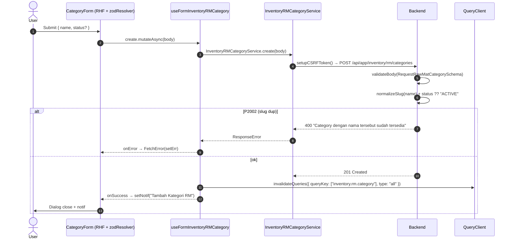
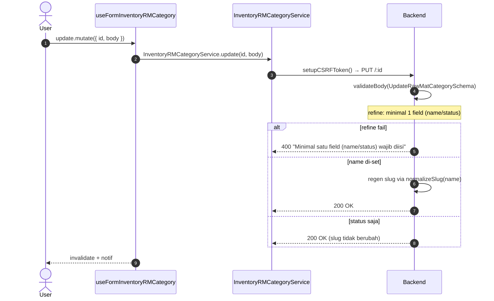
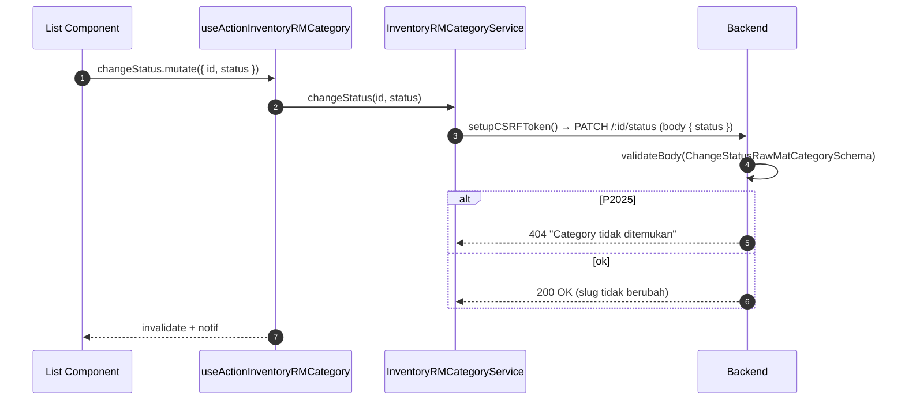
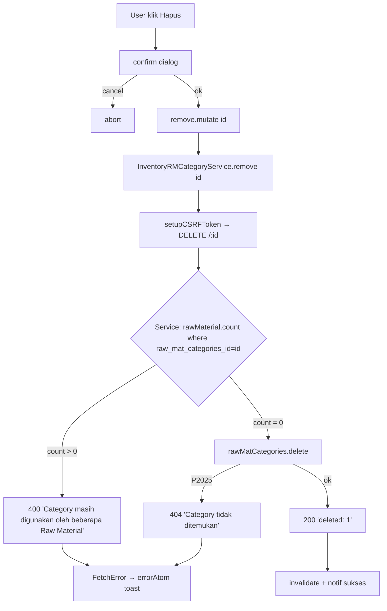

# Inventory / RM / Category — Frontend Integration (Scope Level)

Kontrak BE→FE. Komponen ke frontend-dev-flow SOP.

**Backend scope path**: `api/src/module/application/inventory/rm/category/`
**Frontend scope path**: `app/src/app/(application)/inventory/rm/categories/server/`
**Endpoint base**: `/api/app/inventory/rm/categories`

**Dependencies**:

- Konvensi global modul ([`../../frontend-integration.md`](../../frontend-integration.md)) — CSRF, queryKey naming, error pattern, debounce, design tokens, status code expectation.
- BE scope doc ([`./README.md`](./README.md)) — Zod schema source, endpoint detail, error catalog.
- SOP canonical: [frontend-dev-flow](../../../../.claude/skills/frontend-dev-flow/SKILL.md).

Master data **kategori Raw Material** (mis. `Fragrance Oil`, `Packaging`, `Kain`, `Benang`). Hanya CRUD + change status; **hard delete** dengan pre-check FK ke `RawMaterial`. Slug auto-generated server-side via `normalizeSlug(name)`.

---

## 1. Schema Mirror End-to-End

**Source BE**: `src/module/application/inventory/rm/category/category.schema.ts`. FE mirror WAJIB 1:1.

### 1.1 `RequestRawMatCategorySchema` (BE — verbatim)

```ts
import { z } from "zod";
import { STATUS } from "../../../../../generated/prisma/client.js";

export const RequestRawMatCategorySchema = z.object({
    name: z
        .string({ error: "Nama category tidak boleh kosong" })
        .min(2, "Nama category minimal 2 karakter")
        .max(255, "Nama category maksimal 255 karakter"),
    status: z.enum(STATUS).optional(),
});
```

**Field detail**:

| Field    | Type      | Required | Default      | Constraint              | Error msg                                                                          | Catatan                                          |
| :------- | :-------- | :------- | :----------- | :---------------------- | :--------------------------------------------------------------------------------- | :----------------------------------------------- |
| `name`   | `string`  | ✅       | —            | `min(2)`, `max(255)`    | `"Nama category tidak boleh kosong"` / `"…minimal 2 karakter"` / `"…maksimal 255"` | Trim + slug regen di service.                    |
| `status` | `STATUS?` | ❌       | `"ACTIVE"`\* | enum `STATUS`           | (default Zod)                                                                      | Default di **service** (`payload.status ?? "ACTIVE"`), **bukan** Zod. |

> \*FE jangan duplikasi default `ACTIVE` di Zod resolver — biarkan service yang resolve agar single source of truth.

### 1.2 `UpdateRawMatCategorySchema` — PUT/PATCH /:id (BE — verbatim)

```ts
export const UpdateRawMatCategorySchema = RequestRawMatCategorySchema.partial().refine(
    (v) => v.name !== undefined || v.status !== undefined,
    { message: "Minimal satu field (name/status) wajib diisi" },
);
```

| Field    | Type      | Required | Constraint                                  | Error msg                                                       |
| :------- | :-------- | :------- | :------------------------------------------ | :-------------------------------------------------------------- |
| `name`   | `string?` | ❌\*     | inherits `min(2)`, `max(255)` saat dikirim  | inherit dari `RequestRawMatCategorySchema`                      |
| `status` | `STATUS?` | ❌\*     | enum                                        | inherit                                                          |
| —        | —         | ✅ (refine) | minimal 1 field name/status                | `"Minimal satu field (name/status) wajib diisi"`                |

> \*Salah satu wajib diisi (validasi level `.refine`). Slug **regen** kalau `name` di-set.

### 1.3 `ChangeStatusRawMatCategorySchema` — PATCH /:id/status

```ts
export const ChangeStatusRawMatCategorySchema = z.object({
    status: z.enum(STATUS),
});
```

| Field    | Type     | Required | Constraint     | Error msg     |
| :------- | :------- | :------- | :------------- | :------------ |
| `status` | `STATUS` | ✅       | enum `STATUS`  | (default Zod) |

> Body **bukan** querystring. Service tidak rename slug pada endpoint ini.

### 1.4 `QueryRawMatCategorySchema` — GET /

```ts
export const QueryRawMatCategorySchema = z.object({
    page: z.coerce.number().int().positive().default(1),
    take: z.coerce.number().int().positive().max(100).default(25),
    search: z.string().trim().min(1).optional(),
    status: z.enum(STATUS).optional(),
    sortBy: z.enum(["created_at", "updated_at", "name"]).default("updated_at"),
    sortOrder: z.enum(["asc", "desc"]).default("desc"),
});
```

| Param       | Type                                       | Default        | Constraint                  | Catatan                                                        |
| :---------- | :----------------------------------------- | :------------- | :-------------------------- | :------------------------------------------------------------- |
| `page`      | `number` (int)                             | `1`            | `coerce`, `int`, `> 0`      | —                                                              |
| `take`      | `number` (int)                             | `25`           | `coerce`, `int`, `1..100`   | —                                                              |
| `search`    | `string?`                                  | —              | `trim`, `min(1)`, optional  | ILIKE `name` + `slug` (mode insensitive).                       |
| `status`    | `STATUS?`                                  | —              | enum                        | Filter exact match.                                            |
| `sortBy`    | `"created_at" \| "updated_at" \| "name"`   | `"updated_at"` | whitelist                   | Kolom langsung.                                                |
| `sortOrder` | `"asc" \| "desc"`                          | `"desc"`       | enum                        | —                                                              |

### 1.5 `ResponseRawMatCategorySchema`

```ts
export const ResponseRawMatCategorySchema = z.object({
    id: z.number(),
    name: z.string(),
    slug: z.string(),
    status: z.enum(STATUS),
    created_at: z.date(),
    updated_at: z.date(),
});
```

**Transformasi service** (BE post-processing — FE harus tahu agar tidak salah render):

| Field di response | Sumber Prisma                       | Transformasi service                                  |
| :---------------- | :---------------------------------- | :---------------------------------------------------- |
| `name`            | `RawMatCategories.name`             | `payload.name.trim()` saat create/update.             |
| `slug`            | `RawMatCategories.slug`             | `normalizeSlug(name)` (auto-regen kalau `name` di-set). |
| `status`          | `RawMatCategories.status`           | `payload.status ?? "ACTIVE"` saat create.             |
| `created_at`      | `RawMatCategories.created_at`       | Pass-through (Date).                                   |
| `updated_at`      | `RawMatCategories.updated_at`       | Pass-through (Date, `@updatedAt`).                     |

> Tidak ada `deleted_at` — model **tidak punya soft-delete**. Hard delete only.

### 1.6 Enum referensi (Prisma)

```prisma
enum STATUS {
    PENDING
    ACTIVE
    FAVOURITE
    BLOCK
    DELETE
}
```

Lokasi BE: `prisma/schema.prisma:1338`. FE import via `@/shared/types` — **JANGAN duplikasi literal**.

---

## 2. FE Schema Mirror

**File**: `app/src/app/(application)/inventory/rm/categories/server/inventory.rm.category.schema.ts`

```ts
import { z } from "zod";
import { STATUS } from "@/shared/types";

export const RequestRawMatCategorySchema = z.object({
    name: z
        .string({ error: "Nama category tidak boleh kosong" })
        .min(2, "Nama category minimal 2 karakter")
        .max(255, "Nama category maksimal 255 karakter"),
    status: z.enum(STATUS).optional(),
});

export type RequestRawMatCategoryDTO = z.input<typeof RequestRawMatCategorySchema>;

export const UpdateRawMatCategorySchema = RequestRawMatCategorySchema.partial().refine(
    (v) => v.name !== undefined || v.status !== undefined,
    { message: "Minimal satu field (name/status) wajib diisi" },
);

export type UpdateRawMatCategoryDTO = z.input<typeof UpdateRawMatCategorySchema>;

export const ChangeStatusRawMatCategorySchema = z.object({
    status: z.enum(STATUS),
});

export type ChangeStatusRawMatCategoryDTO = z.infer<typeof ChangeStatusRawMatCategorySchema>;

export const ResponseRawMatCategorySchema = z.object({
    id: z.number(),
    name: z.string(),
    slug: z.string(),
    status: z.enum(STATUS),
    created_at: z.coerce.date(),
    updated_at: z.coerce.date(),
});

export type ResponseRawMatCategoryDTO = z.infer<typeof ResponseRawMatCategorySchema>;

export const QueryRawMatCategorySchema = z.object({
    page: z.coerce.number().int().positive().default(1).optional(),
    take: z.coerce.number().int().positive().max(100).default(25).optional(),
    search: z.string().trim().min(1).optional(),
    status: z.enum(STATUS).optional(),
    sortBy: z.enum(["created_at", "updated_at", "name"]).default("updated_at").optional(),
    sortOrder: z.enum(["asc", "desc"]).default("desc").optional(),
});

export type QueryRawMatCategoryDTO = z.infer<typeof QueryRawMatCategorySchema>;
```

**Diff vs BE**:

- `created_at`/`updated_at` pakai `z.coerce.date()` (BE pakai `z.date()`). FE WAJIB coerce karena payload JSON datang sebagai string ISO.
- Query field semua `.optional()` agar FE bisa kirim partial saat default cocok dengan server.
- Tidak ada `slug` di Request — slug auto-generated server-side; FE **tidak** boleh kirim slug.

---

## 3. Routing — Endpoint Table

**Path prefix**: `/api/app/inventory/rm/categories`

Source BE routes: `src/module/application/inventory/rm/category/category.routes.ts`.

| Method     | Path           | Middleware                                  | Controller                              | Body Schema                        | Success Status | Response Shape                                                  | Catatan                                                                                  |
| :--------- | :------------- | :------------------------------------------ | :-------------------------------------- | :--------------------------------- | :------------- | :-------------------------------------------------------------- | :--------------------------------------------------------------------------------------- |
| **GET**    | `/`            | —                                           | `RawMatCategoryController.list`         | — (querystring `QueryRawMatCategorySchema`) | `200`          | `{ data: ResponseRawMatCategoryDTO[]; len: number }` (+ meta `params`) | List + pagination + search/status filter + sort whitelist (`created_at`/`updated_at`/`name`). |
| **POST**   | `/`            | `validateBody(RequestRawMatCategorySchema)` | `RawMatCategoryController.create`       | `RequestRawMatCategorySchema`      | `201`          | `ResponseRawMatCategoryDTO`                                     | Slug auto-generated `normalizeSlug(name)`. `status` default `ACTIVE` di service. CSRF wajib. |
| **GET**    | `/:id`         | —                                           | `RawMatCategoryController.detail`       | — (param `IdParamSchema`)          | `200`          | `ResponseRawMatCategoryDTO`                                     | `400 "ID category tidak valid"` kalau param non-int. `404` kalau tidak ketemu.            |
| **PUT**    | `/:id`         | `validateBody(UpdateRawMatCategorySchema)`  | `RawMatCategoryController.update`       | `UpdateRawMatCategorySchema`       | `200`          | `ResponseRawMatCategoryDTO`                                     | Mount ke handler yang sama dengan PATCH. `.refine` minimal 1 field. CSRF wajib.            |
| **PATCH**  | `/:id`         | `validateBody(UpdateRawMatCategorySchema)`  | `RawMatCategoryController.update`       | `UpdateRawMatCategorySchema`       | `200`          | `ResponseRawMatCategoryDTO`                                     | **Alias** PUT. FE service cukup pakai PUT untuk konsistensi.                              |
| **PATCH**  | `/:id/status`  | `validateBody(ChangeStatusRawMatCategorySchema)` | `RawMatCategoryController.changeStatus` | `ChangeStatusRawMatCategorySchema` | `200`          | `ResponseRawMatCategoryDTO`                                     | Body `{ status }` JSON. Tidak men-trigger slug regen. CSRF wajib.                          |
| **DELETE** | `/:id`         | —                                           | `RawMatCategoryController.delete`       | —                                  | `200`          | `{ deleted: number }`                                            | **HARD delete**. `400 "Category masih digunakan oleh beberapa Raw Material"` bila FK ke `RawMaterial.raw_mat_categories_id` masih ada. CSRF wajib. |

> Tidak ada bulk-status, bulk-delete, import, atau export pada scope ini. Tidak ada soft-delete / trash.

---

## 4. Service Class — FULL CODE

**File**: `app/src/app/(application)/inventory/rm/categories/server/inventory.rm.category.service.ts`

```ts
import api from "@/lib/api";
import { setupCSRFToken } from "@/shared/api/csrf";
import type { ApiSuccessResponse } from "@/shared/types/api";
import type { STATUS } from "@/shared/types";
import type {
    RequestRawMatCategoryDTO,
    UpdateRawMatCategoryDTO,
    ResponseRawMatCategoryDTO,
    QueryRawMatCategoryDTO,
} from "./inventory.rm.category.schema";

const API = `${process.env.NEXT_PUBLIC_API}/api/app/inventory/rm/categories`;

export class InventoryRMCategoryService {
    static async list(
        params: QueryRawMatCategoryDTO,
    ): Promise<{ data: ResponseRawMatCategoryDTO[]; len: number }> {
        try {
            const { data } = await api.get<
                ApiSuccessResponse<{ data: ResponseRawMatCategoryDTO[]; len: number }>
            >(API, { params });
            return data.data;
        } catch (error) {
            throw error;
        }
    }

    static async detail(id: number): Promise<ResponseRawMatCategoryDTO> {
        try {
            const { data } = await api.get<ApiSuccessResponse<ResponseRawMatCategoryDTO>>(
                `${API}/${id}`,
            );
            return data.data;
        } catch (error) {
            throw error;
        }
    }

    static async create(body: RequestRawMatCategoryDTO): Promise<void> {
        try {
            await setupCSRFToken();
            await api.post(API, body);
        } catch (error) {
            throw error;
        }
    }

    /**
     * PUT untuk full body, server tetap accept partial via `.refine` (min 1 field).
     * Backend mount PUT dan PATCH ke handler yang sama.
     */
    static async update(id: number, body: UpdateRawMatCategoryDTO): Promise<void> {
        try {
            await setupCSRFToken();
            await api.put(`${API}/${id}`, body);
        } catch (error) {
            throw error;
        }
    }

    /**
     * Endpoint khusus untuk toggle status saja. Body JSON `{ status }`.
     * Tidak men-trigger slug regen.
     */
    static async changeStatus(id: number, status: (typeof STATUS)[number]): Promise<void> {
        try {
            await setupCSRFToken();
            await api.patch(`${API}/${id}/status`, { status });
        } catch (error) {
            throw error;
        }
    }

    /**
     * HARD DELETE.
     * 400 bila `RawMaterial.raw_mat_categories_id = id` masih ada referensi.
     * FE sebaiknya pre-check (mis. konfirmasi dialog atau lookup count) — server tetap final guard.
     */
    static async remove(id: number): Promise<void> {
        try {
            await setupCSRFToken();
            await api.delete(`${API}/${id}`);
        } catch (error) {
            throw error;
        }
    }
}
```

> Tidak ada `bulkStatus`, `clean`, `exportCsv`, `import*` untuk scope ini. Bulk-delete + soft-delete + restore → out of scope (lihat BE README §1).

---

## 5. Hooks — 5 Hook Split FULL CODE

**File**: `app/src/app/(application)/inventory/rm/categories/server/use.inventory.rm.category.ts`

```ts
"use client";
import { useQuery, useMutation, useQueryClient } from "@tanstack/react-query";
import { useSetAtom } from "jotai";
import { useState, useMemo, useCallback } from "react";
import { useSearchParams } from "next/navigation";
import { useDebounce, useQueryParams } from "@/shared/hooks";
import { errorAtom, notificationAtom } from "@/shared/atoms";
import { FetchError } from "@/shared/api/errors";
import type { ResponseError } from "@/shared/types/api";
import type { STATUS } from "@/shared/types";
import { InventoryRMCategoryService } from "./inventory.rm.category.service";
import type {
    RequestRawMatCategoryDTO,
    UpdateRawMatCategoryDTO,
    ResponseRawMatCategoryDTO,
    QueryRawMatCategoryDTO,
} from "./inventory.rm.category.schema";

const KEY = ["inventory.rm.category"] as const;

// ──────────────────────────────────────────────────────────────────────────────
// 5.1 READ — useQuery wrapper
// ──────────────────────────────────────────────────────────────────────────────
export function useInventoryRMCategory(params: QueryRawMatCategoryDTO, enabled = true) {
    return useQuery<{ data: ResponseRawMatCategoryDTO[]; len: number }, ResponseError>({
        queryKey: [...KEY, params],
        queryFn: () => InventoryRMCategoryService.list(params),
        enabled,
        staleTime: 30_000,
    });
}

export function useInventoryRMCategoryDetail(id: number, enabled = true) {
    return useQuery<ResponseRawMatCategoryDTO, ResponseError>({
        queryKey: [...KEY, id],
        queryFn: () => InventoryRMCategoryService.detail(id),
        enabled: enabled && Boolean(id),
    });
}

// ──────────────────────────────────────────────────────────────────────────────
// 5.2 WRITE — create + update mutations
// ──────────────────────────────────────────────────────────────────────────────
export function useFormInventoryRMCategory() {
    const setErr = useSetAtom(errorAtom);
    const setNotif = useSetAtom(notificationAtom);
    const queryClient = useQueryClient();

    const invalidate = () =>
        queryClient.invalidateQueries({ queryKey: KEY, type: "all" });

    const create = useMutation<unknown, ResponseError, RequestRawMatCategoryDTO>({
        mutationKey: [...KEY, "create"],
        mutationFn: (body) => InventoryRMCategoryService.create(body),
        onSuccess: () => {
            setNotif({ title: "Tambah Kategori RM", message: "Berhasil menambahkan kategori baru" });
            invalidate();
        },
        onError: (err) => FetchError(err, setErr),
    });

    const update = useMutation<
        unknown,
        ResponseError,
        { id: number; body: UpdateRawMatCategoryDTO }
    >({
        mutationKey: [...KEY, "update"],
        mutationFn: ({ id, body }) => InventoryRMCategoryService.update(id, body),
        onSuccess: () => {
            setNotif({ title: "Ubah Kategori RM", message: "Berhasil memperbarui kategori" });
            invalidate();
        },
        onError: (err) => FetchError(err, setErr),
    });

    return { create, update };
}

// ──────────────────────────────────────────────────────────────────────────────
// 5.3 ACTION — changeStatus + remove (hard delete)
// ──────────────────────────────────────────────────────────────────────────────
export function useActionInventoryRMCategory() {
    const setErr = useSetAtom(errorAtom);
    const setNotif = useSetAtom(notificationAtom);
    const queryClient = useQueryClient();
    const invalidate = () =>
        queryClient.invalidateQueries({ queryKey: KEY, type: "all" });

    const changeStatus = useMutation<
        unknown,
        ResponseError,
        { id: number; status: (typeof STATUS)[number] }
    >({
        mutationKey: [...KEY, "changeStatus"],
        mutationFn: ({ id, status }) => InventoryRMCategoryService.changeStatus(id, status),
        onSuccess: () => {
            setNotif({ title: "Ubah Status", message: "Status kategori berhasil diubah" });
            invalidate();
        },
        onError: (err) => FetchError(err, setErr),
    });

    const remove = useMutation<unknown, ResponseError, number>({
        mutationKey: [...KEY, "remove"],
        mutationFn: (id) => InventoryRMCategoryService.remove(id),
        onSuccess: () => {
            setNotif({ title: "Hapus Kategori", message: "Kategori dihapus permanen" });
            invalidate();
        },
        // 400 "Category masih digunakan oleh beberapa Raw Material" → ditampilkan via FetchError → errorAtom
        onError: (err) => FetchError(err, setErr),
    });

    return { changeStatus, remove };
}

// ──────────────────────────────────────────────────────────────────────────────
// 5.4 TableState — URL sync + debounce search + filter status
// ──────────────────────────────────────────────────────────────────────────────
export function useInventoryRMCategoryTableState() {
    const searchParams = useSearchParams();
    const { batchSet } = useQueryParams();

    const rawSearch = searchParams.get("search") ?? "";
    const [search, setSearchState] = useState(rawSearch);
    const debouncedSearch = useDebounce(search, 500);

    const setSearch = useCallback((val: string) => {
        setSearchState(val);
    }, []);

    // Sync ke URL setelah debounce
    useMemo(() => {
        batchSet({ search: debouncedSearch || null, page: "1" });
    }, [debouncedSearch, batchSet]);

    const page = Number(searchParams.get("page") ?? 1);
    const take = Number(searchParams.get("take") ?? 25);
    const sortBy = (searchParams.get("sortBy") ?? "updated_at") as QueryRawMatCategoryDTO["sortBy"];
    const sortOrder = (searchParams.get("sortOrder") ?? "desc") as QueryRawMatCategoryDTO["sortOrder"];
    const statusFilter = (searchParams.get("status") ?? undefined) as
        | (typeof STATUS)[number]
        | undefined;

    const setStatusFilter = useCallback(
        (status: (typeof STATUS)[number] | null) => {
            batchSet({ status: status ?? null, page: "1" });
        },
        [batchSet],
    );

    const queryParams = useMemo<QueryRawMatCategoryDTO>(
        () => ({
            page,
            take,
            search: debouncedSearch || undefined,
            status: statusFilter,
            sortBy,
            sortOrder,
        }),
        [page, take, debouncedSearch, statusFilter, sortBy, sortOrder],
    );

    return { search, setSearch, page, take, sortBy, sortOrder, statusFilter, setStatusFilter, queryParams };
}

// ──────────────────────────────────────────────────────────────────────────────
// 5.5 Query-wrapper — bundling list + tableState untuk page consumer
// ──────────────────────────────────────────────────────────────────────────────
export function useInventoryRMCategoryQuery() {
    const tableState = useInventoryRMCategoryTableState();
    const query = useInventoryRMCategory(tableState.queryParams);
    return { ...tableState, query };
}
```

> queryKey base: `["inventory.rm.category", params]`. Invalidate `type: "all"` agar list, detail, dan custom variants ikut ter-refresh setelah mutasi.

---

## 6. End-to-End Flow per Operasi

### 6.1 Create



### 6.2 Update (full / partial)



### 6.3 Change status



### 6.4 Delete (HARD, FK pre-check)



---

## 7. Edge Cases & Per-Scope Quirks

- **Default `status = ACTIVE` set di service, bukan Zod**: FE jangan pasang `.default("ACTIVE")` di mirror — biarkan server resolve. Form create boleh kosongkan field status; user expect badge "ACTIVE" muncul setelah refetch.
- **Slug auto-generated**: FE **tidak** boleh kirim `slug` di body create/update. Service akan generate ulang via `normalizeSlug(name)` setiap kali `name` di-set. Tampilkan slug di table & detail tapi tidak editable.
- **Refine update (`.refine` minimal 1 field)**: Form edit yang membiarkan kedua field kosong / undefined akan ditolak server dengan pesan `"Minimal satu field (name/status) wajib diisi"`. FE mirror schema WAJIB ikut sertakan `.refine` agar validasi muncul instan tanpa round-trip.
- **Hard delete blocked by FK**: Pre-check service: `prisma.rawMaterial.count({ where: { raw_mat_categories_id } })` > 0 → `ApiError(400, "Category masih digunakan oleh beberapa Raw Material")`. FE WAJIB tampilkan toast jelas + saran (ubah status ke `BLOCK` sebagai workaround arsip). Tidak ada endpoint untuk reassign children sekaligus.
- **Tidak ada soft delete**: model tidak punya `deleted_at`. Tidak ada `?trash=1` toggle / `clean` endpoint. Skip section trash dari template global.
- **Tidak ada bulk-status / bulk-delete**: per BE README §1.Out of scope. Pilih single-row actions saja sampai backend menambah endpoint.
- **Tidak ada import / export CSV**: skip section export di template global. Kalau kebutuhan muncul, ikuti pola `inventory/rm/import` (BullMQ).
- **PUT vs PATCH**: Backend mount kedua method ke handler yang sama (`validateBody(UpdateRawMatCategorySchema)`). FE service hanya pakai PUT untuk konsistensi — PATCH dipakai khusus `:id/status`.
- **Search ILIKE `name` + `slug`**: FE bisa cari pakai slug (case-insensitive). Min length 1 (`.trim().min(1).optional()`).
- **`sortBy` whitelist 3 kolom**: `created_at`, `updated_at`, `name`. Kalau column lain (mis. `status`) ingin di-sort, perlu BE update.
- **CSRF**: semua mutasi (`POST/PUT/PATCH/DELETE`) WAJIB `setupCSRFToken()` sebelum call — lihat module-level konvensi.
- **Audit log belum dipasang**: lihat BE README §9. FE boleh asumsikan mutation berhasil tanpa entry log di UI activity feed sampai BE menambahkan `CreateLogger`.
- **Cache rm:\***: BE belum bust cache `rm:*` saat kategori berubah. Kalau FE list RM cache nama kategori, manual `queryClient.invalidateQueries({ queryKey: ["inventory.rm"] })` di `useActionInventoryRMCategory` setelah mutation success. <!-- verify saat list RM diintegrasikan -->

---

## 8. Cross-link

- BE scope doc: [./README.md](./README.md)
- Module-level konvensi FE: [../../frontend-integration.md](../../frontend-integration.md)
- Parent scope (RM): [../README.md](../README.md)
- Module index (Inventory): [../../README.md](../../README.md)
- **SOP komponen FE (page, form, dialog, columns, list)** → [frontend-dev-flow](../../../../.claude/skills/frontend-dev-flow/SKILL.md). Schema mirror, service, dan hooks di file ini adalah kontrak BE→FE; implementasi komponen ikut SOP tersebut.
- **SOP testing FE (Vitest + RTL untuk service, hook, component)** → [frontend-testing](../../../../.claude/skills/frontend-testing/SKILL.md).
- Postman folder: `Inventory → RM → Categories` di `docs/postman/erp-mandalika.postman_collection.json`.
- Modul terkait FE:
    - `inventory/rm` — RM list/detail menampilkan `raw_mat_category.name` (consider cross-invalidate setelah mutasi kategori).
    - `inventory/rm/unit` — pola identik untuk master `UnitRawMaterial`; bisa di-template ulang.
