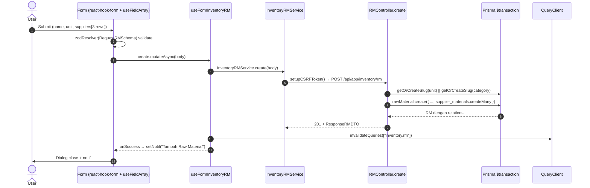
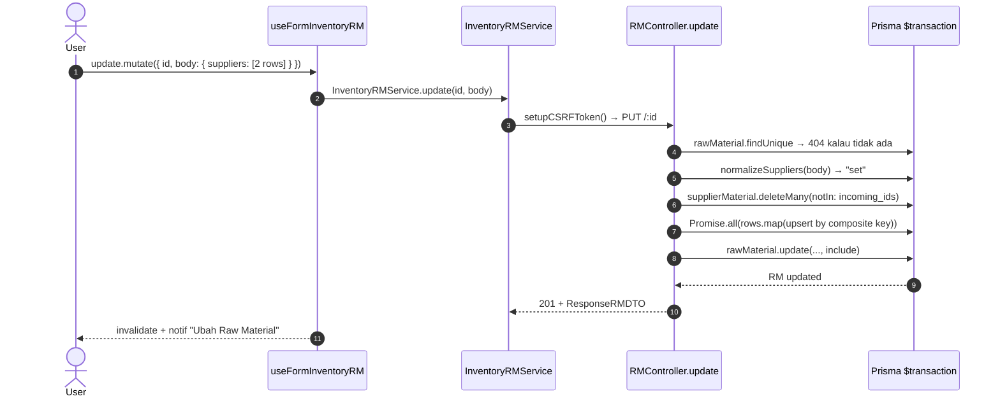
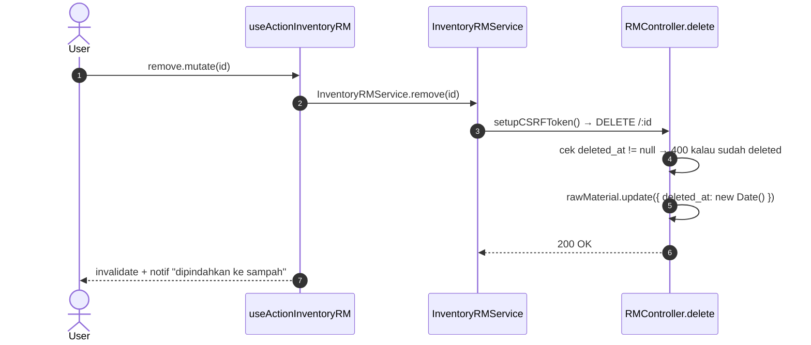
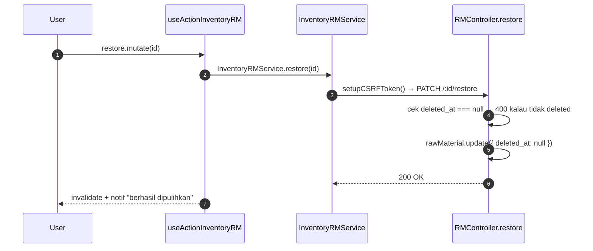
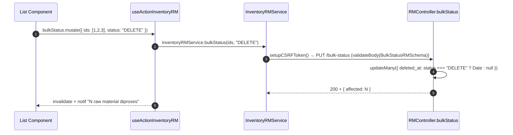
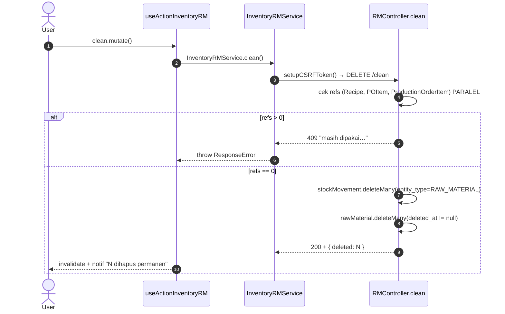
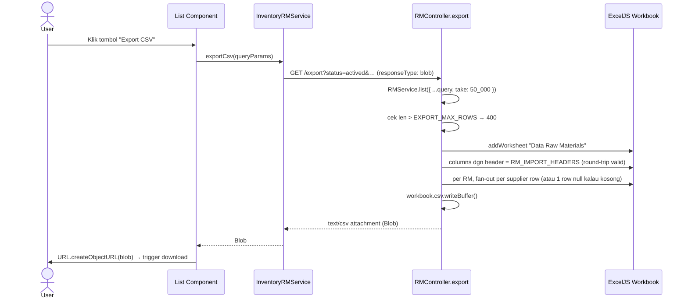

# Inventory / RM — Frontend Integration (Scope Level)

Kontrak BE→FE untuk scope Raw Material (RM): schema, endpoint, service, hooks, flow. Komponen (List/Form/Dialog/Columns/Page) termasuk **nested suppliers field-array form** didelegasikan ke SOP [frontend-dev-flow](../../../../.claude/skills/frontend-dev-flow/SKILL.md).

**Backend scope path**: `api/src/module/application/inventory/rm/`
**Frontend scope path**: `app/src/app/(application)/inventory/rm/server/`
**Component path**: `app/src/components/pages/inventory/rm/`
**Endpoint base**: `/api/app/inventory/rm`
**Status FE**: 🚧 TBD <!-- ubah ke ✅ Ready setelah file FE dibuat -->

**Dependencies**:

- Konvensi global modul Inventory ([`../frontend-integration.md`](../frontend-integration.md)) — CSRF, queryKey naming, error pattern, debounce, design tokens, status code expectation.
- BE scope doc ([`./README.md`](./README.md)) — Zod schema source, endpoint detail, error catalog.
- SOP canonical: [frontend-dev-flow](../../../../.claude/skills/frontend-dev-flow/SKILL.md).

Raw Material (RM) adalah scope master inventory bahan baku dengan **relasi many-to-many ke Supplier** via `SupplierMaterial` (composite key + atribut harga/MOQ/lead-time/preferred). FE perlu meng-handle **nested form `suppliers[]` (field-array)** plus legacy single-supplier shortcut, kategori/unit auto-create-by-slug, soft-delete via `deleted_at`, dan CSV export ber-header sinkron dengan canonical `RM_IMPORT_HEADERS`.

---

## 1. Schema Mirror End-to-End

**Source BE**: `src/module/application/inventory/rm/rm.schema.ts`. FE mirror WAJIB 1:1.

### 1.1 `RequestSupplierMaterialSchema` (BE — verbatim, nested)

```ts
import { z } from "zod";
import { MaterialType, RawMaterialSource, STATUS } from "../../../../generated/prisma/client.js";

export const RequestSupplierMaterialSchema = z.object({
    supplier_id: z.coerce.number().int().positive(),
    unit_price: z.coerce.number().min(0),
    min_buy: z.coerce.number().nullable().optional(),
    lead_time: z.coerce.number().int().positive().nullable().optional(),
    is_preferred: z.boolean().default(false),
    status: z.enum(STATUS).default("ACTIVE").optional(),
});
```

**Field detail**:

| Field          | Type      | Required | Default    | Constraint                                  | Catatan                                       |
| :------------- | :-------- | :------- | :--------- | :------------------------------------------ | :-------------------------------------------- |
| `supplier_id`  | `number`  | ✅       | —          | `int`, `positive`, coerce string→int        | FK → `Supplier`. P2003 → 404 dari service.    |
| `unit_price`   | `number`  | ✅       | —          | `>= 0`, coerce                              | Stored sebagai Decimal di BE.                 |
| `min_buy`      | `number?` | ❌       | `null`     | nullable, coerce                            | MOQ; null = tidak ada minimum.                |
| `lead_time`    | `number?` | ❌       | `null`     | `int`, `positive`, nullable, coerce         | Hari.                                         |
| `is_preferred` | `boolean` | ❌       | `false`    | —                                           | Hanya 1 supplier preferred per RM (UX rule).  |
| `status`       | `enum`    | ❌       | `"ACTIVE"` | `STATUS` (ACTIVE/INACTIVE)                  | Lihat §1.5.                                   |

### 1.2 `RequestRMSchema` (BE — verbatim)

```ts
export const RequestRMSchema = z.object({
    barcode: z
        .string({ error: "Barcode tidak valid" })
        .max(50, "Barcode material tidak boleh lebih dari 50 karakter")
        .nullable()
        .optional(),
    name: z
        .string({ error: "Nama material tidak boleh kosong" })
        .max(255, "Nama material tidak boleh lebih dari 255 karakter"),
    type: z.enum(MaterialType).nullable().optional(),
    min_stock: z.coerce.number().nullable().optional(),
    unit: z.string().min(1, "Unit tidak boleh kosong"),
    raw_mat_category: z.string().optional(),
    suppliers: z.array(RequestSupplierMaterialSchema).optional(),

    // Kompatibilitas form lama: supplier tunggal di root → service memetakan ke `suppliers`.
    supplier_id: z.coerce.number().int().positive().nullable().optional(),
    price: z.coerce.number().nullable().optional(),
    min_buy: z.coerce.number().nullable().optional(),
    lead_time: z.coerce.number().int().positive().nullable().optional(),
});
```

**Field detail**:

| Field              | Type        | Required | Default | Constraint                       | Error msg                                    | Catatan                                                                                  |
| :----------------- | :---------- | :------- | :------ | :------------------------------- | :------------------------------------------- | :--------------------------------------------------------------------------------------- |
| `barcode`          | `string?`   | ❌       | `null`  | `max(50)`, nullable              | `"Barcode material tidak boleh lebih..."`    | Unique di DB; P2002 → 400.                                                               |
| `name`             | `string`    | ✅       | —       | `max(255)`                       | `"Nama material tidak boleh lebih..."`       | —                                                                                        |
| `type`             | `enum?`     | ❌       | `null`  | `MaterialType` (FO / PCKG)       | (default Zod)                                | Lihat §1.5. Nullable di Prisma.                                                          |
| `min_stock`        | `number?`   | ❌       | `null`  | nullable, coerce                 | (default Zod)                                | Decimal di Prisma; FE harus `Number()` cast saat render.                                 |
| `unit`             | `string`    | ✅       | —       | `min(1)`                         | `"Unit tidak boleh kosong"`                  | Lookup-or-create-by-slug di service → kembali sebagai `unit_raw_material: {id,name}`.    |
| `raw_mat_category` | `string?`   | ❌       | —       | string bebas                     | (default Zod)                                | Lookup-or-create-by-slug.                                                                |
| `suppliers`        | `array?`    | ❌       | —       | `RequestSupplierMaterialSchema[]`| (delegated)                                  | **Field-array nested**. `[]` = clear semua. `undefined` = skip.                          |
| `supplier_id`      | `number?`   | ❌       | `null`  | `int positive`, nullable, coerce | (default Zod)                                | Legacy: kalau `suppliers` undefined & `supplier_id` ada → di-promote jadi 1 row preferred.|
| `price`            | `number?`   | ❌       | `null`  | nullable, coerce                 | (default Zod)                                | Legacy companion `supplier_id`.                                                          |
| `min_buy`          | `number?`   | ❌       | `null`  | nullable, coerce                 | (default Zod)                                | Legacy companion.                                                                        |
| `lead_time`        | `number?`   | ❌       | `null`  | `int positive`, nullable, coerce | (default Zod)                                | Legacy companion.                                                                        |

> **Hybrid form note** — FE form baru harus pakai `suppliers[]` (field-array). Legacy fields tetap dipertahankan untuk migrasi gradual; service di BE auto-promote `supplier_id` → 1-row `suppliers` saat `suppliers` undefined.

### 1.3 `ResponseRMSchema` & DTO

```ts
export const ResponseSupplierMaterialSchema = z.object({
    supplier_id: z.number(),
    supplier_name: z.string(),
    supplier_country: z.string(),
    supplier_source: z.enum(RawMaterialSource).nullable().optional(),
    unit_price: z.number(),
    min_buy: z.number().nullable().optional(),
    lead_time: z.number().nullable().optional(),
    is_preferred: z.boolean(),
    status: z.enum(STATUS),
});

export const ResponseRMSchema = z.object({
    id: z.number(),
    barcode: z.string().nullable(),
    name: z.string(),
    type: z.enum(MaterialType).nullable().optional(),
    min_stock: z.number().nullable().optional(),
    unit_raw_material: z.object({ id: z.number(), name: z.string() }),
    raw_mat_category: z
        .object({ id: z.number(), name: z.string(), slug: z.string() })
        .optional(),
    suppliers: z.array(ResponseSupplierMaterialSchema).default([]),
    created_at: z.date(),
    updated_at: z.date().nullable(),
    deleted_at: z.date().nullable(),
});

export type ResponseRMDTO = z.infer<typeof ResponseRMSchema>;
```

**Transformasi service** (BE post-processing — FE harus tahu agar tidak salah render):

| Field di response                      | Sumber Prisma                                | Transformasi service                                  |
| :------------------------------------- | :------------------------------------------- | :---------------------------------------------------- |
| `min_stock`                            | `RawMaterial.min_stock` (Decimal nullable)   | `rm.min_stock !== null ? Number(rm.min_stock) : null` |
| `unit_raw_material`                    | `RawMaterial.unit_raw_material` (relation)   | `{ id, name }` (flatten).                             |
| `raw_mat_category`                     | `RawMaterial.raw_mat_category` (relation)    | `{ id, name, slug }`, **omit kalau null**.            |
| `suppliers[].supplier_name/country`    | `supplier_materials[].supplier.{name,country}` | Flatten dari nested relation.                       |
| `suppliers[].supplier_source`          | `supplier_materials[].supplier.source`       | Pass-through (enum nullable).                         |
| `suppliers[].unit_price`               | `supplier_materials[].unit_price` (Decimal)  | `Number(sm.unit_price)`.                              |
| `suppliers[].min_buy`                  | `supplier_materials[].min_buy` (Decimal?)    | `sm.min_buy != null ? Number(sm.min_buy) : null`.     |

### 1.4 `QueryRMSchema` — GET / & GET /export

```ts
export const RM_SORT_KEYS = [
    "barcode",
    "name",
    "updated_at",
    "created_at",
    "category",
] as const;

export const QueryRMSchema = z.object({
    page: z.coerce.number().int().positive().default(1).optional(),
    take: z.coerce.number().int().positive().max(100).default(25).optional(),
    status: z.enum(["actived", "deleted"]).default("actived"),
    type: z.enum(MaterialType).optional(),
    search: z.string().optional(),
    sortBy: z.enum(RM_SORT_KEYS).default("updated_at"),
    sortOrder: z.enum(["asc", "desc"]).default("asc"),
    category_id: z.coerce.number().int().positive().optional(),
    supplier_id: z.coerce.number().int().positive().optional(),
    unit_id: z.coerce.number().int().positive().optional(),
    visibleColumns: z.string().optional(),
});

export type QueryRMDTO = z.infer<typeof QueryRMSchema>;
```

> **Catatan filter** — `status` di sini bukan STATUS enum; ia adalah **toggle trash mode** dengan nilai `"actived"` (default; `deleted_at IS NULL`) atau `"deleted"` (`deleted_at IS NOT NULL`). FE harus map ke parameter URL `status=deleted` saat user klik "Lihat Sampah", BUKAN pakai `?trash=1`.

### 1.5 `BulkStatusRMSchema` — subset enum

```ts
// RawMaterial tidak punya kolom status — aksi ini memetakan ke `deleted_at`
// (DELETE = soft delete, ACTIVE = restore).
export const BulkActionEnum = z.enum(["ACTIVE", "DELETE"]);

export const BulkStatusRMSchema = z.object({
    ids: z.array(z.number().int().positive()).min(1, "Minimal 1 raw material harus dipilih"),
    status: BulkActionEnum,
});

export type BulkStatusRMDTO = z.infer<typeof BulkStatusRMSchema>;
export type BulkActionDTO = z.infer<typeof BulkActionEnum>;
```

> **Penting** — `BulkActionEnum` di RM adalah **subset** dari `STATUS` Prisma (hanya `ACTIVE` & `DELETE`), karena RawMaterial tidak punya kolom `status` sendiri. Jangan reuse type `STATUS` untuk bulk RM — pakai `BulkActionDTO`.

### 1.6 Enum referensi (Prisma)

```prisma
enum MaterialType {
    FO    // Filling Oil / bahan inti
    PCKG  // Packaging
}

enum RawMaterialSource {
    LOCAL
    IMPORT
}

enum STATUS {
    ACTIVE
    INACTIVE
    DELETE
}
```

Lokasi BE: `prisma/schema.prisma`. FE import via `@/shared/types` — **JANGAN duplikasi literal**. `RM` sendiri tidak punya kolom STATUS — `STATUS` di sini hanya untuk `SupplierMaterial.status`.

---

## 2. FE Schema Mirror

**File**: `app/src/app/(application)/inventory/rm/server/inventory.rm.schema.ts` 🚧 TBD

```ts
import { z } from "zod";
import { MaterialType, RawMaterialSource, STATUS } from "@/shared/types";

export const RequestSupplierMaterialSchema = z.object({
    supplier_id: z.coerce.number().int().positive(),
    unit_price: z.coerce.number().min(0),
    min_buy: z.coerce.number().nullable().optional(),
    lead_time: z.coerce.number().int().positive().nullable().optional(),
    is_preferred: z.boolean().default(false),
    status: z.enum(STATUS).default("ACTIVE").optional(),
});

export type RequestSupplierMaterialDTO = z.input<typeof RequestSupplierMaterialSchema>;

export const RequestRMSchema = z.object({
    barcode: z.string().max(50, "Barcode material tidak boleh lebih dari 50 karakter").nullable().optional(),
    name: z.string().max(255, "Nama material tidak boleh lebih dari 255 karakter"),
    type: z.enum(MaterialType).nullable().optional(),
    min_stock: z.coerce.number().nullable().optional(),
    unit: z.string().min(1, "Unit tidak boleh kosong"),
    raw_mat_category: z.string().optional(),
    suppliers: z.array(RequestSupplierMaterialSchema).optional(),

    // Legacy fields (kompatibilitas form lama)
    supplier_id: z.coerce.number().int().positive().nullable().optional(),
    price: z.coerce.number().nullable().optional(),
    min_buy: z.coerce.number().nullable().optional(),
    lead_time: z.coerce.number().int().positive().nullable().optional(),
});

export type RequestRMDTO = z.input<typeof RequestRMSchema>;

export const ResponseSupplierMaterialSchema = z.object({
    supplier_id: z.number(),
    supplier_name: z.string(),
    supplier_country: z.string(),
    supplier_source: z.enum(RawMaterialSource).nullable().optional(),
    unit_price: z.number(),
    min_buy: z.number().nullable().optional(),
    lead_time: z.number().nullable().optional(),
    is_preferred: z.boolean(),
    status: z.enum(STATUS),
});

export const ResponseRMSchema = z.object({
    id: z.number(),
    barcode: z.string().nullable(),
    name: z.string(),
    type: z.enum(MaterialType).nullable().optional(),
    min_stock: z.number().nullable().optional(),
    unit_raw_material: z.object({ id: z.number(), name: z.string() }),
    raw_mat_category: z.object({ id: z.number(), name: z.string(), slug: z.string() }).optional(),
    suppliers: z.array(ResponseSupplierMaterialSchema).default([]),
    created_at: z.coerce.date(),
    updated_at: z.coerce.date().nullable(),
    deleted_at: z.coerce.date().nullable(),
});

export type ResponseRMDTO = z.infer<typeof ResponseRMSchema>;

export const QueryRMSchema = z.object({
    page: z.coerce.number().int().positive().default(1).optional(),
    take: z.coerce.number().int().positive().max(100).default(25).optional(),
    status: z.enum(["actived", "deleted"]).default("actived"),
    type: z.enum(MaterialType).optional(),
    search: z.string().optional(),
    sortBy: z.enum(["barcode", "name", "updated_at", "created_at", "category"]).default("updated_at"),
    sortOrder: z.enum(["asc", "desc"]).default("asc"),
    category_id: z.coerce.number().int().positive().optional(),
    supplier_id: z.coerce.number().int().positive().optional(),
    unit_id: z.coerce.number().int().positive().optional(),
    visibleColumns: z.string().optional(),
});

export type QueryRMDTO = z.infer<typeof QueryRMSchema>;

export const BulkActionEnum = z.enum(["ACTIVE", "DELETE"]);

export const BulkStatusRMSchema = z.object({
    ids: z.array(z.number().int().positive()).min(1, "Minimal 1 raw material harus dipilih"),
    status: BulkActionEnum,
});

export type BulkStatusRMDTO = z.infer<typeof BulkStatusRMSchema>;
export type BulkActionDTO = z.infer<typeof BulkActionEnum>;
```

**Diff vs BE**: tidak ada deviation. Kalau ada (mis. literal enum di FE), itu bug — fix di FE.

---

## 3. Routing — Endpoint Table

Daftar lengkap endpoint scope RM. Path lengkap di-prefix `/api/app/inventory/rm`. Sumber kebenaran tunggal untuk FE saat wiring service. Status code MUST match controller (`api/src/module/application/inventory/rm/rm.controller.ts`).

| #   | Method   | Path                              | Body / Query                                                       | Response (status code)                 | Error utama                                                                                                                              |
| :-- | :------- | :-------------------------------- | :----------------------------------------------------------------- | :------------------------------------- | :--------------------------------------------------------------------------------------------------------------------------------------- |
| 1   | `GET`    | `/`                               | Query: `QueryRMDTO` (filter trash via `?status=actived\|deleted`)  | **200** `{ data: ResponseRMDTO[], len: number }` | 400 Zod (query invalid).                                                                                                                 |
| 2   | `POST`   | `/`                               | Body: `RequestRMDTO` (validateBody `RequestRMSchema`)              | **201** `ResponseRMDTO`                | 400 Zod, 400 P2002 (`barcode` duplikat), 404 supplier_id tidak ditemukan (P2003).                                                        |
| 3   | `GET`    | `/:id`                            | —                                                                  | **200** `ResponseRMDTO`                | 400 ID invalid, 404 RM tidak ditemukan.                                                                                                  |
| 4   | `PUT`    | `/:id`                            | Body: `Partial<RequestRMDTO>` (validateBody `RequestRMSchema.partial()`) | **201** `ResponseRMDTO`          | 400 Zod, 400 P2002 (barcode), 404 RM/Supplier tidak ditemukan. ⚠️ Controller pakai 201, bukan 200.                                       |
| 5   | `PATCH`  | `/:id`                            | Body: `Partial<RequestRMDTO>` (alias dari PUT, sama handler)        | **201** `ResponseRMDTO`                | sama dengan PUT.                                                                                                                         |
| 6   | `DELETE` | `/:id`                            | —                                                                  | **200** `{}` (soft-delete via `deleted_at`) | 400 ID invalid, 400 sudah deleted, 404 RM tidak ditemukan.                                                                               |
| 7   | `PATCH`  | `/:id/restore`                    | —                                                                  | **200** `{}` (clear `deleted_at`)      | 400 ID invalid, 400 belum deleted, 404 RM tidak ditemukan.                                                                               |
| 8   | `PUT`    | `/bulk-status`                    | Body: `BulkStatusRMDTO` (`{ ids: number[], status: "ACTIVE" \| "DELETE" }`) | **200** `{ affected: number }` | 400 Zod (status di luar `ACTIVE`/`DELETE`, ids kosong).                                                                                  |
| 9   | `DELETE` | `/clean`                          | — (hard-delete semua row `deleted_at IS NOT NULL`)                 | **200** `{ deleted: number }`          | 409 RM masih dipakai Recipe / POItem / ProductionOrderItem.                                                                              |
| 10  | `GET`    | `/export`                         | Query: `QueryRMDTO` (`visibleColumns` opsional)                    | **200** `text/csv` (Blob attachment)   | 400 Zod, 400 `EXPORT_MAX_ROWS` (50.000) exceeded.                                                                                        |

> **Notes**:
>
> - **Trash mode** pakai `?status=actived|deleted` — RM **TIDAK** pakai `?trash=1` (deviasi dari konvensi modul Inventory).
> - **Create vs Update status code**: BE controller mengembalikan **201 untuk create DAN update** (lihat `rm.controller.ts:46,65`). Ini menyimpang dari konvensi 201-create-200-update di module-level — **FE service harus tetap pakai response data, bukan branch berdasarkan status code**.
> - **`PATCH /:id`** adalah alias `PUT /:id`; FE boleh pakai keduanya, tapi prefer `PUT` agar konsisten dengan modul lain.
> - **`POST /`** divalidasi via `validateBody(RequestRMSchema)`; **`PUT/PATCH /:id`** via `validateBody(RequestRMSchema.partial())` — semua field optional pada update.
> - **Sub-routes**: `/import/*`, `/suppliers/*`, `/categories/*`, `/units/*` dimount sebelum dynamic routes (lihat `rm.routes.ts:12-15`) → punya scope doc sendiri di `./import/`, `./supplier/`, `./category/`, `./unit/`.
> - **CSRF**: semua mutasi (POST/PUT/PATCH/DELETE) wajib panggil `setupCSRFToken()` di service.

---

## 4. Service Class — FULL CODE

**File**: `app/src/app/(application)/inventory/rm/server/inventory.rm.service.ts` 🚧 TBD

```ts
import api from "@/lib/api";
import { setupCSRFToken } from "@/shared/api/csrf";
import type { ApiSuccessResponse } from "@/shared/types/api";
import type {
    RequestRMDTO,
    ResponseRMDTO,
    QueryRMDTO,
    BulkActionDTO,
} from "./inventory.rm.schema";

const API = `${process.env.NEXT_PUBLIC_API}/api/app/inventory/rm`;

export class InventoryRMService {
    static async list(params: QueryRMDTO): Promise<{ data: ResponseRMDTO[]; len: number }> {
        try {
            const { data } = await api.get<ApiSuccessResponse<{ data: ResponseRMDTO[]; len: number }>>(API, { params });
            return data.data;
        } catch (error) {
            throw error;
        }
    }

    static async detail(id: number): Promise<ResponseRMDTO> {
        try {
            const { data } = await api.get<ApiSuccessResponse<ResponseRMDTO>>(`${API}/${id}`);
            return data.data;
        } catch (error) {
            throw error;
        }
    }

    static async create(body: RequestRMDTO): Promise<ResponseRMDTO> {
        try {
            await setupCSRFToken();
            const { data } = await api.post<ApiSuccessResponse<ResponseRMDTO>>(API, body);
            return data.data;
        } catch (error) {
            throw error;
        }
    }

    static async update(id: number, body: Partial<RequestRMDTO>): Promise<ResponseRMDTO> {
        try {
            await setupCSRFToken();
            const { data } = await api.put<ApiSuccessResponse<ResponseRMDTO>>(`${API}/${id}`, body);
            return data.data;
        } catch (error) {
            throw error;
        }
    }

    /** Soft-delete: set `deleted_at` di BE. */
    static async remove(id: number): Promise<void> {
        try {
            await setupCSRFToken();
            await api.delete(`${API}/${id}`);
        } catch (error) {
            throw error;
        }
    }

    /** Restore: clear `deleted_at`. */
    static async restore(id: number): Promise<void> {
        try {
            await setupCSRFToken();
            await api.patch(`${API}/${id}/restore`);
        } catch (error) {
            throw error;
        }
    }

    /**
     * Bulk action — subset enum `ACTIVE | DELETE` (RM tidak punya STATUS column).
     * `DELETE` → soft-delete, `ACTIVE` → restore.
     */
    static async bulkStatus(ids: number[], status: BulkActionDTO): Promise<{ affected: number }> {
        try {
            await setupCSRFToken();
            const { data } = await api.put<ApiSuccessResponse<{ affected: number }>>(`${API}/bulk-status`, { ids, status });
            return data.data;
        } catch (error) {
            throw error;
        }
    }

    /** Hard-delete semua row dengan `deleted_at IS NOT NULL`. 409 kalau masih dipakai recipe/PO/production. */
    static async clean(): Promise<{ deleted: number }> {
        try {
            await setupCSRFToken();
            const { data } = await api.delete<ApiSuccessResponse<{ deleted: number }>>(`${API}/clean`);
            return data.data;
        } catch (error) {
            throw error;
        }
    }

    /** Export CSV (ExcelJS workbook.csv.writeBuffer di BE). Response Blob. */
    static async exportCsv(params: QueryRMDTO): Promise<Blob> {
        try {
            const { data } = await api.get<Blob>(`${API}/export`, { params, responseType: "blob" });
            return data;
        } catch (error) {
            throw error;
        }
    }
}
```

---

## 5. Hooks — 5 Hook Split FULL CODE

**File**: `app/src/app/(application)/inventory/rm/server/use.inventory.rm.ts` 🚧 TBD

```ts
"use client";
import { useQuery, useMutation, useQueryClient } from "@tanstack/react-query";
import { useSetAtom } from "jotai";
import { useState, useMemo, useCallback } from "react";
import { useSearchParams } from "next/navigation";
import { useDebounce, useQueryParams } from "@/shared/hooks";
import { errorAtom, notificationAtom } from "@/shared/atoms";
import { FetchError } from "@/shared/api/errors";
import type { ResponseError } from "@/shared/types/api";
import { InventoryRMService } from "./inventory.rm.service";
import type {
    RequestRMDTO,
    ResponseRMDTO,
    QueryRMDTO,
    BulkActionDTO,
} from "./inventory.rm.schema";

const KEY = ["inventory.rm"] as const;

// ──────────────────────────────────────────────────────────────────────────────
// 5.1 READ — useInventoryRM + useInventoryRMDetail
// ──────────────────────────────────────────────────────────────────────────────
export function useInventoryRM(params: QueryRMDTO, enabled = true) {
    return useQuery<{ data: ResponseRMDTO[]; len: number }, ResponseError>({
        queryKey: [...KEY, params],
        queryFn: () => InventoryRMService.list(params),
        enabled,
        staleTime: 30_000,
    });
}

export function useInventoryRMDetail(id: number, enabled = true) {
    return useQuery<ResponseRMDTO, ResponseError>({
        queryKey: [...KEY, "detail", id],
        queryFn: () => InventoryRMService.detail(id),
        enabled: enabled && Boolean(id),
    });
}

// ──────────────────────────────────────────────────────────────────────────────
// 5.2 WRITE — create + update mutations (handle nested suppliers[])
// ──────────────────────────────────────────────────────────────────────────────
export function useFormInventoryRM() {
    const setErr = useSetAtom(errorAtom);
    const setNotif = useSetAtom(notificationAtom);
    const queryClient = useQueryClient();

    const invalidate = () => queryClient.invalidateQueries({ queryKey: KEY, type: "all" });

    const create = useMutation<ResponseRMDTO, ResponseError, RequestRMDTO>({
        mutationKey: [...KEY, "create"],
        mutationFn: (body) => InventoryRMService.create(body),
        onSuccess: () => {
            setNotif({ title: "Tambah Raw Material", message: "Berhasil menambahkan raw material baru" });
            invalidate();
        },
        onError: (err) => FetchError(err, setErr),
    });

    const update = useMutation<ResponseRMDTO, ResponseError, { id: number; body: Partial<RequestRMDTO> }>({
        mutationKey: [...KEY, "update"],
        mutationFn: ({ id, body }) => InventoryRMService.update(id, body),
        onSuccess: () => {
            setNotif({ title: "Ubah Raw Material", message: "Berhasil memperbarui raw material" });
            invalidate();
        },
        onError: (err) => FetchError(err, setErr),
    });

    return { create, update };
}

// ──────────────────────────────────────────────────────────────────────────────
// 5.3 ACTION — soft-delete + restore + bulkStatus + clean
// ──────────────────────────────────────────────────────────────────────────────
export function useActionInventoryRM() {
    const setErr = useSetAtom(errorAtom);
    const setNotif = useSetAtom(notificationAtom);
    const queryClient = useQueryClient();
    const invalidate = () => queryClient.invalidateQueries({ queryKey: KEY, type: "all" });

    const remove = useMutation<void, ResponseError, number>({
        mutationKey: [...KEY, "remove"],
        mutationFn: (id) => InventoryRMService.remove(id),
        onSuccess: () => {
            setNotif({ title: "Hapus Raw Material", message: "Raw material dipindahkan ke sampah" });
            invalidate();
        },
        onError: (err) => FetchError(err, setErr),
    });

    const restore = useMutation<void, ResponseError, number>({
        mutationKey: [...KEY, "restore"],
        mutationFn: (id) => InventoryRMService.restore(id),
        onSuccess: () => {
            setNotif({ title: "Pulihkan Raw Material", message: "Raw material berhasil dipulihkan" });
            invalidate();
        },
        onError: (err) => FetchError(err, setErr),
    });

    /** `status` HANYA boleh "ACTIVE" | "DELETE" (subset BulkActionEnum). */
    const bulkStatus = useMutation<{ affected: number }, ResponseError, { ids: number[]; status: BulkActionDTO }>({
        mutationKey: [...KEY, "bulkStatus"],
        mutationFn: ({ ids, status }) => InventoryRMService.bulkStatus(ids, status),
        onSuccess: (data, vars) => {
            setNotif({
                title: vars.status === "DELETE" ? "Hapus Massal" : "Pulihkan Massal",
                message: `${data.affected} raw material berhasil diproses`,
            });
            invalidate();
        },
        onError: (err) => FetchError(err, setErr),
    });

    const clean = useMutation<{ deleted: number }, ResponseError, void>({
        mutationKey: [...KEY, "clean"],
        mutationFn: () => InventoryRMService.clean(),
        onSuccess: (data) => {
            setNotif({ title: "Bersihkan Sampah", message: `${data.deleted} raw material dihapus permanen` });
            invalidate();
        },
        onError: (err) => FetchError(err, setErr),
    });

    return { remove, restore, bulkStatus, clean };
}

// ──────────────────────────────────────────────────────────────────────────────
// 5.4 TableState — URL sync + debounce search + filter type/category/supplier/unit
// ──────────────────────────────────────────────────────────────────────────────
export function useInventoryRMTableState() {
    const searchParams = useSearchParams();
    const { batchSet } = useQueryParams();

    const rawSearch = searchParams.get("search") ?? "";
    const [search, setSearchState] = useState(rawSearch);
    const debouncedSearch = useDebounce(search, 500);

    const setSearch = useCallback((val: string) => setSearchState(val), []);

    useMemo(() => {
        batchSet({ search: debouncedSearch || null, page: "1" });
    }, [debouncedSearch, batchSet]);

    const page = Number(searchParams.get("page") ?? 1);
    const take = Number(searchParams.get("take") ?? 25);
    const sortBy = (searchParams.get("sortBy") ?? "updated_at") as QueryRMDTO["sortBy"];
    const sortOrder = (searchParams.get("sortOrder") ?? "asc") as QueryRMDTO["sortOrder"];

    // RM TIDAK pakai ?trash=1 — pakai ?status=deleted (lihat §1.4).
    const isTrashMode = searchParams.get("status") === "deleted";
    const toggleTrashMode = useCallback(() => {
        batchSet({ status: isTrashMode ? "actived" : "deleted", page: "1" });
    }, [isTrashMode, batchSet]);

    // Filter scope-specific
    const type = (searchParams.get("type") ?? undefined) as QueryRMDTO["type"];
    const category_id = searchParams.get("category_id") ? Number(searchParams.get("category_id")) : undefined;
    const supplier_id = searchParams.get("supplier_id") ? Number(searchParams.get("supplier_id")) : undefined;
    const unit_id = searchParams.get("unit_id") ? Number(searchParams.get("unit_id")) : undefined;

    const setFilter = useCallback(
        (patch: Partial<Record<"type" | "category_id" | "supplier_id" | "unit_id", string | null>>) => {
            batchSet({ ...patch, page: "1" });
        },
        [batchSet],
    );

    const queryParams = useMemo<QueryRMDTO>(
        () => ({
            page,
            take,
            search: debouncedSearch || undefined,
            sortBy,
            sortOrder,
            status: isTrashMode ? "deleted" : "actived",
            type,
            category_id,
            supplier_id,
            unit_id,
        }),
        [page, take, debouncedSearch, sortBy, sortOrder, isTrashMode, type, category_id, supplier_id, unit_id],
    );

    return {
        search, setSearch,
        page, take,
        sortBy, sortOrder,
        isTrashMode, toggleTrashMode,
        type, category_id, supplier_id, unit_id, setFilter,
        queryParams,
    };
}

// ──────────────────────────────────────────────────────────────────────────────
// 5.5 Query-wrapper — bundling list + tableState untuk page consumer
// ──────────────────────────────────────────────────────────────────────────────
export function useInventoryRMQuery() {
    const tableState = useInventoryRMTableState();
    const query = useInventoryRM(tableState.queryParams);
    return { ...tableState, query };
}
```

---

## 6. End-to-End Flow per Operasi

### 6.1 Create (with nested `suppliers[]`)



### 6.2 Update (sync `suppliers[]`: upsert + delete diff)



### 6.3 Soft-delete (single)



### 6.4 Restore (single)



### 6.5 Bulk action (`ACTIVE` | `DELETE` subset)



### 6.6 Clean (hard-delete trash)



### 6.7 Export CSV (ExcelJS, header sinkron `RM_IMPORT_HEADERS`)



---

## 7. Edge Cases & Per-Scope Quirks

- **`BulkActionEnum` subset** — RM tidak punya kolom `status` di DB. `BulkActionEnum = z.enum(["ACTIVE","DELETE"])` saja. Jangan kirim `INACTIVE` — Zod akan reject 400.
- **`suppliers[]` field-array semantics**:
  - `suppliers: undefined` di body → service `kind: "skip"` (tidak menyentuh `supplier_materials`).
  - `suppliers: []` → service `kind: "clear"` (delete semua `supplier_materials`).
  - `suppliers: [rows]` → service `kind: "set"` (diff + upsert + delete `notIn`).
  - FE harus **sanitasi** sebelum submit: kalau form punya array kosong dan user tidak ingin clear, set ke `undefined` di payload sebelum `mutate`.
- **Legacy `supplier_id` shortcut** — kalau body kirim `supplier_id` tanpa `suppliers`, BE promote ke 1-row preferred. Jangan kirim **dua-duanya** secara bersamaan (`suppliers` menang kalau ada).
- **`MaterialType` nullable** — `FO` / `PCKG` atau `null`. UI dropdown harus punya opsi "—" untuk null.
- **`min_stock` nullable Decimal** — BE service `Number()`-cast saat keluar; FE tetap defensive `Number(x ?? 0)` saat render. Decimal di Prisma serialized sebagai string oleh default → toDTO normalisasi ke number.
- **`barcode` optional + unique** — bisa null/kosong; tapi kalau diisi harus unik. P2002 → 400 `"Barcode telah digunakan, tolong ubah dengan barcode lainnya"`.
- **`unit` & `raw_mat_category` lookup-or-create-by-slug** — FE kirim string bebas; BE `getOrCreateSlug` jamin upsert by slug normalized. Saat read, response punya nested `{id,name,slug}` — FE jangan kirim id, kirim string.
- **Trash mode lewat `?status=deleted`**, bukan `?trash=1` (deviasi dari konvensi modul — kalau perlu konsisten, ubah BE atau alias di FE).
- **Update mengembalikan status 201** (sama dengan create) — controller `rm.controller.ts:65`. FE service jangan branch berdasarkan status code; pakai response body saja.
- **Sort key `category`** memetakan ke relation `raw_mat_category.name`. Sort key tidak include `supplier` / `unit` — kalau perlu sort by itu, request BE patch dulu.
- **RM transfer & stock movement** — RM punya relation ke `StockMovement` (`entity_type: "RAW_MATERIAL"`). `clean()` BE menghapus stock movement juga. **Operasi transfer stok bukan tanggung jawab scope RM** — verify di service `inventory/transfer` atau equivalent kalau ada (FE harus cek ke modul transfer terpisah).
- **CSV export header sinkron** dengan canonical `RM_IMPORT_HEADERS` (`src/module/application/inventory/rm/import/import.schema.ts`): `BARCODE`, `MATERIAL NAME`, `CATEGORY`, `UOM`, `MOQ`, `MIN STOCK`, `LEAD TIME`, `SUPPLIER`, `LOCAL/IMPORT`, `COUNTRY`, `PRICE`. **Round-trip export → import HARUS valid** (SOP §1.I). Jika menambah kolom import, update header export di `rm.service.ts` `export()` dan dokumen ini.
- **`visibleColumns` query param** — comma-separated list untuk filter kolom export. Special token `supplier_details` → expand grup `SUPPLIER_EXPORT_GROUP` (`supplier`, `price`, `min_buy`, `lead_time`, `is_preferred`, `supplier_source`, `supplier_country`).
- **`EXPORT_MAX_ROWS = 50_000`** — kalau filter tidak cukup, BE throw 400. FE harus tampilkan pesan & arahkan user pakai filter.
- **`clean()` 409 cascade** — RM yang masih dipakai `Recipes` / `PurchaseOrderItem` / `ProductionOrderItem` tidak boleh hard-delete. FE harus surface error 409 ke notif dengan judul jelas (mis. "Tidak bisa bersihkan — masih dipakai di {scope}").
- **Optimistic UI**: tidak digunakan default (mutations punya state changes berat: nested upsert, slug create). Pakai `invalidateQueries` after success saja.

---

## 8. Cross-link

- BE scope doc: [./README.md](./README.md)
- Module-level konvensi FE: [../frontend-integration.md](../frontend-integration.md)
- **SOP FE canonical**: [frontend-dev-flow](../../../../.claude/skills/frontend-dev-flow/SKILL.md) — gunakan untuk implementasi komponen (List/Form/Dialog/Columns/Page). **Form dengan `useFieldArray` (suppliers nested) — pattern di frontend-dev-flow SOP** (§Form composite + nested field-array).
- **SOP FE testing**: [frontend-testing](../../../../.claude/skills/frontend-testing/SKILL.md) — gunakan untuk test service (mock axios + CSRF), test hooks (RTL `renderHook` + QueryClient wrapper), dan test komponen termasuk nested field-array form (append/remove suppliers row).
- Sibling sub-scope: [./supplier](./supplier), [./category](./category), [./unit](./unit), [./import](./import)
- Postman folder: `Inventory → RM` di `docs/postman/erp-mandalika.postman_collection.json`.
