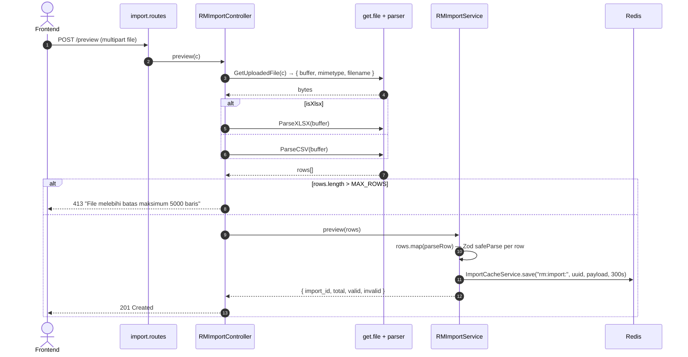
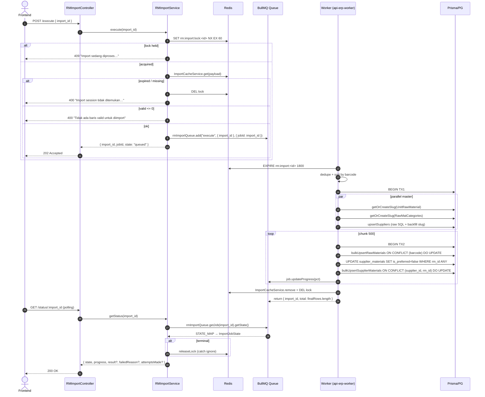

# Module: Inventory / RM / Import (Bulk Import)

**Base path**: `/api/app/inventory/rm/import`
**Source**: `src/module/application/inventory/rm/import/`
**Tests**: `src/tests/inventory/rm/import/` (22 test)
**Prisma model**: `RawMaterial` (target), `Supplier`, `UnitRawMaterial`, `RawMatCategories`, `SupplierMaterial` (master + relasi)
**Queue**: BullMQ — `RM_IMPORT_QUEUE_NAME` (`src/config/queue.ts:14`, `"rm-import"` / `"test-rm-import"`)

Pipeline bulk import RawMaterial dari file Excel / CSV (XLSX & CSV). Dua tahap:

1. **Preview** — parse file di HTTP request, validate per-row dengan Zod, simpan ke Redis cache.
2. **Execute** — async via BullMQ worker, chunked bulk upsert (`INSERT … ON CONFLICT (barcode) DO UPDATE`) untuk `raw_materials` + cascade `supplier_materials`.

> **Catatan kritis**:
>
> - Worker dijalankan terpisah lewat `src/worker.ts` (PM2 process `api-erp-worker` di `ecosystem.config.cjs`). Lihat [DEPLOYMENT.md](../../../../DEPLOYMENT.md).
> - Lock per `import_id` di Redis (`rm:import:lock:<id>`, TTL 60s) untuk cegah double-execute.
> - Cache preview TTL **5 menit** (default `ImportCacheService.save`), di-extend ke **30 menit** oleh worker selama job aktif.
> - File limit: `MAX_ROWS = 5000` baris (`src/lib/get.file.ts:3`).
> - Dedup by `barcode` di worker — row terakhir yang punya barcode sama dimenangkan, lalu di-sort `localeCompare` untuk insert deterministic.
> - Supplier auto-upsert via raw SQL (`unnest` + `ON CONFLICT (slug) DO UPDATE`) + backfill `slug` untuk record lama yang belum punya slug.
> - Imported preferred supplier **selalu menang** — `bulk.upsert.ts` reset `is_preferred = false` dulu untuk RM target, baru upsert dengan `is_preferred = true`.

---

## 1. Scope & Fitur

| Fitur                          | Endpoint                                | Catatan                                                          |
| :----------------------------- | :-------------------------------------- | :--------------------------------------------------------------- |
| Upload + preview validasi      | `POST /preview`                         | multipart/form-data. Return `import_id` + counter valid/invalid. |
| Lihat ulang preview            | `GET /preview/:import_id`               | Ambil snapshot dari Redis selama belum expired.                  |
| Enqueue execute (async)        | `POST /execute`                         | Body `{ import_id }`. Return `jobId`. 409 jika lock terkunci.    |
| Polling status job             | `GET /status/:import_id`                | State BullMQ + progress 0-100. Auto-release lock saat terminal.  |

### Out of scope

- Preview tidak menulis ke DB. Eksekusi nyata hanya lewat worker.
- File parser (XLSX, CSV) di `src/lib/excel.ts` & `src/lib/csv.ts` — bukan tanggung jawab modul ini.
- Authorization / RBAC — diatur middleware (lihat [AUTH.md](../../../../AUTH.md)).
- Master data (`UnitRawMaterial`, `RawMatCategories`, `Supplier`) — di-upsert otomatis (no dedicated CRUD master untuk unit/category; supplier CRUD ada di [`../supplier/README.md`](../supplier/README.md)).

---

## 2. Arsitektur & Flow

### Layer map

```text
┌─────────────── routes/import.routes.ts ───────────────────────┐
│ GET  /preview/:import_id        → getPreview                  │
│ POST /preview  (multipart)      → preview                     │
│ POST /execute  (JSON body)      → execute (+ validateBody)    │
│ GET  /status/:import_id         → getStatus                   │
└────────────────────┬──────────────────────────────────────────┘
                     ▼
┌─────────── controller/import.controller.ts ───────────────────┐
│ - preview:   GetUploadedFile → ParseXLSX/ParseCSV → service   │
│ - execute:   validate body.import_id (UUID) → service         │
│ - getStatus: param → service                                  │
│ - getPreview: param → service                                 │
└────────────────────┬──────────────────────────────────────────┘
                     ▼
┌─────────── service/import.service.ts (RMImportService) ───────┐
│ - preview:    parseRow (Zod) → ImportCacheService.save (TTL 300s) │
│ - execute:    acquireLock (60s) → enqueueRMImport (BullMQ jobId=import_id) │
│ - getStatus:  rmImportQueue.getJob → STATE_MAP → release lock di terminal │
│ - getPreview: ImportCacheService.get(payload + rows)                       │
└────────────────────┬──────────────────────────────────────────┘
                     ▼
┌─── queue/rm-import.queue.ts (Queue) ──────────────────────────┐
│ defaults: attempts=3, backoff exponential 5s,                 │
│           removeOnComplete { age 3600, count 100 },           │
│           removeOnFail=false                                   │
└────────────────────┬──────────────────────────────────────────┘
                     ▼
┌─── queue/rm-import.worker.ts (processRMImportJob) ────────────┐
│ - extend cache TTL 30 min                                     │
│ - dedupe by barcode → sort asc                                │
│ - collect unique units/categories/suppliers                   │
│ - TX1: parallel getOrCreateSlug(unit/category) + upsertSuppliers │
│ - chunked TX (CHUNK_SIZE=500):                                │
│     bulkUpsertRawMaterials → ON CONFLICT (barcode) DO UPDATE  │
│     bulkUpsertSupplierMaterials (reset preferred + upsert)    │
│ - onProgress: floor((processed/total) * 100)                  │
│ - finally: ImportCacheService.remove + releaseLock            │
└───────────────────────────────────────────────────────────────┘
```

### Mermaid: Preview flow



### Mermaid: Execute + worker flow



---

## 3. DTO / Schemas (end-to-end SSOT)

**Source**: `src/module/application/inventory/rm/import/import.schema.ts`.

### 3.1 `RM_IMPORT_HEADERS` (SSOT header CSV)

```ts
export const RM_IMPORT_HEADERS = {
    barcode: "BARCODE",
    name: "MATERIAL NAME",
    category: "CATEGORY",
    unit: "UOM",
    moq: "MOQ",
    minStock: "MIN STOCK",
    leadTime: "LEAD TIME",
    supplier: "SUPPLIER",
    source: "LOCAL/IMPORT",
    country: "COUNTRY",
    price: "PRICE",
} as const;
```

> Konstanta ini juga dipakai `rm.service.ts` (`RM_IMPORT_HEADERS`) untuk header export CSV — round-trip export → edit → re-import langsung valid (SOP `dev-flow §1.I`).

### 3.2 `RMImportRowSchema` — per-row validate

**Zod chain (verbatim)**:

```ts
const sanitizeNumber = (val: unknown): number => {
    if (val === "" || val === null || val === undefined) return 0;
    if (typeof val === "number") return val;
    if (typeof val === "string") {
        const cleaned = val.replace(/[%,\s]/g, "").trim();
        const num = Number(cleaned);
        return isNaN(num) ? 0 : num;
    }
    return Number(val);
};

const sanitizeString = (val: unknown): string | undefined => {
    if (val === null || val === undefined) return undefined;
    const str = String(val).trim();
    return str === "" ? undefined : str;
};

export const RMImportRowSchema = z.object({
    [RM_IMPORT_HEADERS.barcode]:  z.string().min(1, "Barcode wajib diisi").max(50),
    [RM_IMPORT_HEADERS.name]:     z.string().min(1, "Material name wajib diisi").max(255),
    [RM_IMPORT_HEADERS.category]: z.string().min(1, "Kategori wajib diisi").max(255),
    [RM_IMPORT_HEADERS.unit]:     z.preprocess(sanitizeString, z.string().min(1, "UOM wajib diisi").max(100)),
    [RM_IMPORT_HEADERS.moq]:      z.preprocess(sanitizeNumber, z.coerce.number().min(0).optional().default(0)),
    [RM_IMPORT_HEADERS.minStock]: z.preprocess(sanitizeNumber, z.coerce.number().min(0).optional().default(0)),
    [RM_IMPORT_HEADERS.leadTime]: z.preprocess(sanitizeNumber, z.coerce.number().int().min(0).optional().default(0)),
    [RM_IMPORT_HEADERS.supplier]: z.preprocess(sanitizeString, z.string().max(100).optional()),
    [RM_IMPORT_HEADERS.source]:   z.preprocess(sanitizeString, z.string().max(20).optional()),
    [RM_IMPORT_HEADERS.country]:  z.preprocess(sanitizeString, z.string().max(100).optional()),
    [RM_IMPORT_HEADERS.price]:    z.preprocess(sanitizeNumber, z.coerce.number().min(0).optional().default(0)),
});
```

**Field detail** (per CSV column → field internal):

| Header CSV       | Internal             | Type     | Required | Default | Constraint                  | Error msg                                                | Catatan                                                |
| :--------------- | :------------------- | :------- | :------- | :------ | :-------------------------- | :------------------------------------------------------- | :----------------------------------------------------- |
| `BARCODE`        | `barcode`            | string   | ✅       | —       | `min(1)`, `max(50)`         | `"Barcode wajib diisi"`                                  | Key dedup + ON CONFLICT.                               |
| `MATERIAL NAME`  | `name`               | string   | ✅       | —       | `min(1)`, `max(255)`        | `"Material name wajib diisi"`                            | —                                                      |
| `CATEGORY`       | `category`           | string   | ✅       | —       | `min(1)`, `max(255)`        | `"Kategori wajib diisi"`                                 | Service upper + trim; auto-upsert master.              |
| `UOM`            | `unit`               | string   | ✅       | —       | preprocess trim, `min(1)`, `max(100)` | `"UOM wajib diisi"`                            | Auto-upsert `UnitRawMaterial`.                          |
| `MOQ`            | `min_buy`            | number   | ❌       | `0`     | preprocess sanitize, `min(0)` | (default Zod)                                          | Strip `%, , whitespace`.                                |
| `MIN STOCK`      | `min_stock`          | number   | ❌       | `0`     | preprocess sanitize, `min(0)` | —                                                      | —                                                      |
| `LEAD TIME`      | `lead_time`          | number (int) | ❌   | `0`     | preprocess sanitize, `int`, `min(0)` | —                                                | Hari.                                                  |
| `SUPPLIER`       | `supplier`           | string?  | ❌       | —       | preprocess trim, `max(100)` | —                                                        | Empty → `null` di output preview.                       |
| `LOCAL/IMPORT`   | `source`             | string?  | ❌       | —       | preprocess trim, `max(20)`  | —                                                        | Mapped `mapSource()` → `LOCAL` (default) atau `IMPORT`. |
| `COUNTRY`        | `country`            | string?  | ❌       | —       | preprocess trim, `max(100)` | —                                                        | —                                                      |
| `PRICE`          | `price`              | number   | ❌       | `0`     | preprocess sanitize, `min(0)` | —                                                      | Strip `%, , whitespace`.                                |

### 3.3 `RMImportPreviewDTO` — bentuk row hasil preview (cache & response GET /preview)

```ts
export type RMImportPreviewDTO = {
    barcode: string;
    name: string;
    category: string;       // UPPER + trim
    unit: string;           // UPPER + trim
    min_buy: number;
    min_stock: number;
    lead_time: number;
    supplier: string | null; // UPPER + trim atau null
    source: RawMaterialSource;
    country: string;
    price: number;
    errors: string[];       // Zod issue messages (kosong = valid)
};
```

### 3.4 `RequestExecuteRMImportSchema` — POST /execute body

```ts
export const RequestExecuteRMImportSchema = z.object({
    import_id: z.string().uuid("Import ID tidak valid"),
});

export type RequestExecuteRMImportDTO = z.infer<typeof RequestExecuteRMImportSchema>;
```

| Field       | Type     | Required | Constraint | Error msg                |
| :---------- | :------- | :------- | :--------- | :----------------------- |
| `import_id` | `string` | ✅       | UUID v4    | `"Import ID tidak valid"` |

### 3.5 Response types

```ts
export type ResponseRMImportDTO = {
    import_id: string;
    total: number;
    valid: number;
    invalid: number;
};

export type ResponseEnqueueRMImportDTO = {
    import_id: string;
    jobId: string;
    state: "queued";
};

export type ImportJobState =
    | "queued"
    | "active"
    | "completed"
    | "failed"
    | "delayed"
    | "waiting-children"
    | "prioritized"
    | "unknown";

export type ResponseRMImportStatusDTO = {
    import_id: string;
    state: ImportJobState;
    progress: number;
    result?: { import_id: string; total: number };
    failedReason?: string;
    attemptsMade?: number;
};
```

### 3.6 Enum referensi

```prisma
enum RawMaterialSource {
    LOCAL
    IMPORT
}
```

`mapSource()` (service): `"IMPORT"` (case-insensitive) → `IMPORT`; sisanya → `LOCAL`.

### 3.7 Catatan integrasi FE

- Schema mirror: `app/src/app/(application)/inventory/rm/import/server/inventory.rm.import.schema.ts` 🚧 TBD.
- DTO export: `RequestExecuteRMImportDTO`, `ResponseRMImportDTO`, `RMImportPreviewDTO`, `ResponseRMImportStatusDTO`, `ImportJobState`.
- Konstanta `RM_IMPORT_HEADERS` di-share ke FE — penting untuk kolom export ↔ import konsisten.

---

## 4. Routing untuk integrasi Frontend

Semua endpoint terproteksi `authMiddleware` (session cookie + Redis session) — lihat [AUTH.md](../../../../AUTH.md).

### 4.1 Daftar endpoint

> **Status code SOP** (`dev-flow §1.G`): preview → 201; execute (async enqueue) → 202; read (preview/status) → 200.

| #   | Method  | Path                          | Body / Query                              | Body type                | Response (status)                                   | Error utama                                                          |
| :-- | :------ | :---------------------------- | :---------------------------------------- | :----------------------- | :-------------------------------------------------- | :------------------------------------------------------------------- |
| 1   | POST    | `/preview`                    | File (CSV/XLSX)                           | `multipart/form-data`    | `ResponseRMImportDTO` (**201**)                     | 400 (no file), 413 (>5000), 415 (mime invalid)                       |
| 2   | GET     | `/preview/:import_id`         | —                                         | —                        | `{ import_id, total, valid, invalid, rows[], createdAt }` (**200**) | 400 (id missing), 404 (cache expired)                     |
| 3   | POST    | `/execute`                    | `{ import_id }`                           | JSON                     | `ResponseEnqueueRMImportDTO` (**202**)              | 400 (Zod / cache expired / no valid rows), 409 (lock held)           |
| 4   | GET     | `/status/:import_id`          | —                                         | —                        | `ResponseRMImportStatusDTO` (**200**)               | 400 (id missing), 404 (job not found)                                 |

### 4.2 Konvensi response

```jsonc
{ "query": null, "status": "success", "data": <payload> }
```

Error:

```jsonc
{ "status": "error", "message": "<pesan>" }
```

### 4.3 Contoh integrasi frontend

Snippet endpoint-spesifik di bawah; konvensi (wizard 3-step, polling `refetchInterval`, queryKey, design tokens) **ada di** [`../../frontend-integration.md`](../../frontend-integration.md) §4 & §6.

```ts
const API = `${process.env.NEXT_PUBLIC_API}/api/app/inventory/rm/import`;

static async preview(file: File): Promise<ResponseRMImportDTO> {
    await setupCSRFToken();
    const form = new FormData();
    form.append("file", file);
    const { data } = await api.post<ApiSuccessResponse<ResponseRMImportDTO>>(
        `${API}/preview`,
        form,
        { headers: { "Content-Type": "multipart/form-data" } },
    );
    return data.data;
}

static async execute(import_id: string): Promise<ResponseEnqueueRMImportDTO> {
    await setupCSRFToken();
    const { data } = await api.post<ApiSuccessResponse<ResponseEnqueueRMImportDTO>>(
        `${API}/execute`,
        { import_id },
    );
    return data.data;
}

static async status(import_id: string): Promise<ResponseRMImportStatusDTO> {
    const { data } = await api.get<ApiSuccessResponse<ResponseRMImportStatusDTO>>(
        `${API}/status/${import_id}`,
    );
    return data.data;
}
```

### 4.4 Header & autentikasi

- Cookie session + `x-csrf-token` untuk POST.
- `Content-Type: multipart/form-data` untuk `/preview` (axios auto-set saat `FormData`).
- `Content-Type: application/json` untuk `/execute`.

---

## 5. Database / Indexes

Tabel target & relasi (lihat [`../README.md`](../README.md) §5 + `prisma/schema.prisma:182-321`):

- `raw_materials` — `barcode @unique`. ON CONFLICT key.
- `unit_raw_materials` — `slug @unique`. Auto-upsert.
- `raw_mat_categories` — `slug @unique`. Auto-upsert.
- `suppliers` — `slug @unique nullable`, `phone @unique nullable`. Worker backfill `slug` jika legacy row null + match nama lowercase.
- `supplier_materials` — `@@unique([supplier_id, raw_material_id])`. ON CONFLICT key kedua.

**Raw SQL helpers** (`bulk/bulk.upsert.ts`):

- `bulkUpsertRawMaterials`: `INSERT … VALUES (...) ON CONFLICT (barcode) DO UPDATE SET name, min_stock, unit_id, raw_mat_categories_id, updated_at = NOW()`. Returning `id, barcode` untuk mapping ke supplier_materials.
- `bulkUpsertSupplierMaterials`: reset `is_preferred = false` untuk RM target dulu, lalu `INSERT … ON CONFLICT (supplier_id, raw_material_id) DO UPDATE SET unit_price, min_buy, lead_time, is_preferred = true, updated_at = NOW()`.
- Supplier auto-upsert: `INSERT … FROM unnest(...) ON CONFLICT (slug) DO UPDATE SET source, country, updated_at`. Backfill `slug` di record lama via `UPDATE WHERE id = ? AND slug IS NULL`.

**Tidak ada migration trigram khusus** untuk RM import. Preview tidak menyentuh DB; execute lewat raw SQL targeted (PK / unique key only). <!-- verify: butuh index pada `suppliers(LOWER(name))` jika lookup legacy slug-null sering. -->

---

## 6. Error catalog

| HTTP | Pesan                                                              | Trigger                                                                |
| :--- | :----------------------------------------------------------------- | :--------------------------------------------------------------------- |
| 400  | `Validation Error` + array `{ message, path }`                     | Body gagal Zod `RequestExecuteRMImportSchema` (`validateBody`).        |
| 400  | `Import ID wajib dilampirkan`                                      | `c.req.param("import_id")` undefined di `/preview/:id` & `/status/:id`. |
| 400  | `Import session tidak ditemukan atau sudah kadaluarsa`             | `execute`: cache miss (TTL expired) sebelum enqueue.                   |
| 400  | `Tidak ada baris valid untuk diimport`                             | `execute`: `cache.valid <= 0`. Worker juga lempar internal `Error`.    |
| 404  | `Import preview tidak ditemukan atau sudah kadaluarsa`             | `getPreview`: cache miss.                                              |
| 404  | `Import job tidak ditemukan`                                       | `getStatus`: `queue.getJob(id) === null`.                              |
| 409  | `Import sedang diproses, coba lagi sebentar`                       | `execute`: `acquireLock` gagal (lock masih dipegang).                  |
| 413  | `File melebihi batas maksimum 5000 baris`                          | Preview file > `MAX_ROWS`.                                             |
| 415  | (lewat `GetUploadedFile`) `Format file tidak didukung`             | Mime/extension bukan CSV/XLSX.                                          |
| 500  | `Internal Server Error`                                            | Error tak terduga (parser, redis down, dst).                            |

**Worker error** (job `failed`, di-return via `/status/:import_id.failedReason`):

| Pesan                                              | Trigger                                              |
| :------------------------------------------------- | :--------------------------------------------------- |
| `Import session tidak ditemukan atau sudah kadaluarsa` | Worker pickup tapi cache sudah hilang.            |
| `Tidak ada baris valid untuk diimport`             | Setelah filter `errors.length === 0` atau dedup.     |
| `Unit tidak ditemukan untuk material: {name}`      | `bulkUpsertRawMaterials` map-lookup gagal (impossible bila master TX1 sukses; defense). |

Default BullMQ retry: `attempts = 3`, backoff exponential 5s.

---

## 7. Testing

Lokasi: `src/tests/inventory/rm/import/`. **22 test total**.

### 7.1 Service test (`import.service.test.ts` — 14 tests)

| Suite        | Test cases                                                                          |
| :----------- | :---------------------------------------------------------------------------------- |
| `preview`    | parse rows valid/invalid; cache save; count valid/invalid/total                     |
| `execute`    | (1) 400 cache expired; (2) 400 no valid rows; (3) 409 lock held; (4) sukses → 202   |
| `getStatus`  | mapping STATE_MAP; `completed` includes result; `failed` includes reason; release lock terminal |
| `getPreview` | 404 cache miss; sukses include `rows[]` + `createdAt`                               |

### 7.2 Routes test (`import.routes.test.ts` — 8 tests)

`app.request()` simulate HTTP:

- `POST /preview` → 201 sukses / 400 missing file / 413 oversize
- `POST /execute` → 202 sukses / 400 Zod invalid UUID
- `GET /status/:id` → 200 sukses / 404 not found
- `GET /preview/:id` → 200 / 404

### 7.3 Menjalankan test

```bash
# Hanya RM import
rtk npm test -- --run src/tests/inventory/rm/import/

# Watch
rtk npx vitest src/tests/inventory/rm/import/
```

---

## 8. Postman testing

Import koleksi `docs/postman/erp-mandalika.postman_collection.json` → folder `Inventory / RM / Import`. Env var sama dengan RM (lihat [`../README.md`](../README.md) §8).

### 8.1 Preview (upload)

```
POST {{base_url}}/api/app/inventory/rm/import/preview
Content-Type: multipart/form-data
Body (form-data):
  file: <upload CSV/XLSX>
```

Expected sukses (201):

```jsonc
{ "query": null, "status": "success", "data": { "import_id": "uuid-v4", "total": 250, "valid": 248, "invalid": 2 } }
```

### 8.2 Get preview snapshot

```
GET {{base_url}}/api/app/inventory/rm/import/preview/<import_id>
```

Response (200): `{ import_id, total, valid, invalid, rows: RMImportPreviewDTO[], createdAt }`.

### 8.3 Execute

```http
POST {{base_url}}/api/app/inventory/rm/import/execute
Content-Type: application/json

{ "import_id": "<uuid-dari-preview>" }
```

Expected sukses (202):

```jsonc
{ "query": null, "status": "success", "data": { "import_id": "uuid", "jobId": "uuid", "state": "queued" } }
```

### 8.4 Status polling

```
GET {{base_url}}/api/app/inventory/rm/import/status/<import_id>
```

Response (200):

```jsonc
// Active
{ "data": { "import_id": "uuid", "state": "active", "progress": 42 } }

// Completed
{ "data": { "import_id": "uuid", "state": "completed", "progress": 100, "result": { "import_id": "uuid", "total": 248 } } }

// Failed
{ "data": { "import_id": "uuid", "state": "failed", "progress": 0, "failedReason": "Tidak ada baris valid untuk diimport", "attemptsMade": 3 } }
```

### 8.5 Contoh body error

```jsonc
// 409 lock held
{ "status": "error", "message": "Import sedang diproses, coba lagi sebentar" }

// 413 oversize
{ "status": "error", "message": "File melebihi batas maksimum 5000 baris" }

// 400 cache expired
{ "status": "error", "message": "Import session tidak ditemukan atau sudah kadaluarsa" }
```

---

## 9. Activity log

Controller import **tidak memanggil `CreateLogger`** secara langsung (audit dijalankan oleh aksi RM downstream — preview tidak menulis DB; execute lewat worker BullMQ).

> Tambahkan log `CreateLogger({ activity: "IMPORT", description: "Raw Material bulk import {n} rows", email })` di handler `execute` jika audit trail dibutuhkan. <!-- verify dengan tim compliance -->

---

## 10. Checklist saat menambah fitur import

- [ ] Update `import.schema.ts` (header dictionary + Zod row schema). **Sinkronkan `RM_IMPORT_HEADERS` dengan header export di `rm.service.ts`** — bedanya = bug (round-trip rusak).
- [ ] Tulis test TDD di `src/tests/inventory/rm/import/import.service.test.ts` (mock `ImportCacheService` + `rmImportQueue`).
- [ ] Pastikan worker (`rm-import.worker.ts`) idempotent dan dapat dijalankan ulang (`removeOnFail: false`, attempts 3).
- [ ] Index DB baru kalau parser memakai lookup baru.
- [ ] Update dokumen ini + tabel di `../README.md` + `../../README.md` (sub-modul row).
- [ ] Update Postman folder `Inventory / RM / Import`.
- [ ] Update FE schema mirror & service `inventory.rm.import.*` di `app/`.
- [ ] `rtk tsc --noEmit` + `rtk npm test -- --run src/tests/inventory/rm/import/`.
- [ ] Restart worker (`pm2 restart api-erp-worker`) sesuai [DEPLOYMENT.md](../../../../DEPLOYMENT.md).

---

## 11. Referensi silang

- Parent scope: [`../README.md`](../README.md)
- Module index: [`../../README.md`](../../README.md)
- FE integration: [`../../frontend-integration.md`](../../frontend-integration.md)
- Counterpart FG import: [`../../fg/import/README.md`](../../fg/import/README.md) (pattern identik dengan RM)
- Arsitektur global: [`../../../ARCHITECTURE.md`](../../../../ARCHITECTURE.md)
- Auth & session: [`../../../AUTH.md`](../../../../AUTH.md)
- Deployment & worker process: [`../../../DEPLOYMENT.md`](../../../../DEPLOYMENT.md)
- BullMQ + Redis: `src/config/queue.ts`, `src/config/redis.ts`
- Cache util: `src/lib/utils/import.cache.ts`
- File parser: `src/lib/get.file.ts`, `src/lib/excel.ts`, `src/lib/csv.ts`
