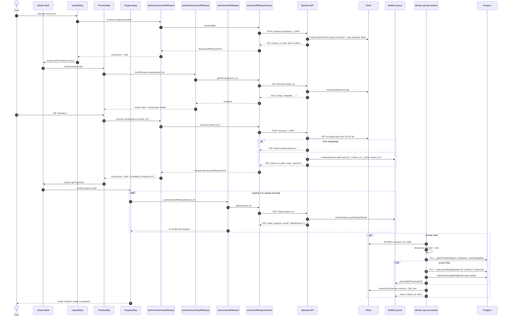

# Inventory / RM / Import — Frontend Integration (Scope Level)

Kontrak BE→FE untuk scope `inventory/rm/import` (bulk upload Raw Material via CSV/XLSX). Async wizard UI ke frontend-dev-flow.

**Backend scope path**: `api/src/module/application/inventory/rm/import/`
**Frontend scope path**: `app/src/app/(application)/inventory/rm/import/server/`
**Endpoint base**: `/api/app/inventory/rm/import`
**Status FE**: 🚧 TBD <!-- ubah ke ✅ Ready setelah file FE dibuat -->

## 0. Dependencies

- Konvensi global modul: [`../../frontend-integration.md`](../../frontend-integration.md) — CSRF policy, queryKey naming, error pattern, debounce, design tokens Gold/Zinc, status code expectation (201/202/200).
- BE scope doc: [`./README.md`](./README.md) — Zod schema source, endpoint detail, error catalog, BullMQ worker flow.
- SOP canonical: [frontend-dev-flow](../../../../../.claude/skills/frontend-dev-flow/SKILL.md) — wizard 3-step UI (Upload → Preview → Progress).
- SOP testing: [frontend-testing](../../../../../.claude/skills/frontend-testing/SKILL.md).
- Counterpart scope: [`../../fg/import/frontend-integration.md`](../../fg/import/frontend-integration.md) — pattern import async identik (RM mengikuti shape FG).

Scope ini meng-handle wizard 3-langkah (Upload → Preview → Progress) untuk import Raw Material massal via Redis-cached preview + BullMQ worker async eksekusi. Header CSV canonical (`RM_IMPORT_HEADERS`) sudah enforced di BE untuk round-trip export ↔ import — tidak ada gap unifikasi seperti FG.

---

## 1. Schema Mirror End-to-End (BE — verbatim)

**Source BE**: `src/module/application/inventory/rm/import/import.schema.ts`. FE mirror WAJIB 1:1.

### 1.1 `RM_IMPORT_HEADERS` — SSOT header CSV

```ts
export const RM_IMPORT_HEADERS = {
    barcode: "BARCODE",
    name: "MATERIAL NAME",
    category: "CATEGORY",
    unit: "UOM",
    moq: "MOQ",
    minStock: "MIN STOCK",
    leadTime: "LEAD TIME",
    supplier: "SUPPLIER",
    source: "LOCAL/IMPORT",
    country: "COUNTRY",
    price: "PRICE",
} as const;
```

> Konstanta ini juga di-export ulang dari `rm.service.ts` (header export CSV) — round-trip export → edit → re-import dijamin valid. SOP `dev-flow §1.I` sudah terpenuhi pada BE; FE hanya perlu re-export konstanta ini.

### 1.2 `RMImportRowSchema` (per-row validate) — Zod verbatim

```ts
import z from "zod";
import { RawMaterialSource } from "../../../../../generated/prisma/client.js";

const sanitizeNumber = (val: unknown): number => {
    if (val === "" || val === null || val === undefined) return 0;
    if (typeof val === "number") return val;
    if (typeof val === "string") {
        const cleaned = val.replace(/[%,\s]/g, "").trim();
        const num = Number(cleaned);
        return isNaN(num) ? 0 : num;
    }
    return Number(val);
};

const sanitizeString = (val: unknown): string | undefined => {
    if (val === null || val === undefined) return undefined;
    const str = String(val).trim();
    return str === "" ? undefined : str;
};

export const RMImportRowSchema = z.object({
    [RM_IMPORT_HEADERS.barcode]: z.string().min(1, "Barcode wajib diisi").max(50),
    [RM_IMPORT_HEADERS.name]: z.string().min(1, "Material name wajib diisi").max(255),
    [RM_IMPORT_HEADERS.category]: z.string().min(1, "Kategori wajib diisi").max(255),
    [RM_IMPORT_HEADERS.unit]: z.preprocess(sanitizeString, z.string().min(1, "UOM wajib diisi").max(100)),
    [RM_IMPORT_HEADERS.moq]: z.preprocess(sanitizeNumber, z.coerce.number().min(0).optional().default(0)),
    [RM_IMPORT_HEADERS.minStock]: z.preprocess(sanitizeNumber, z.coerce.number().min(0).optional().default(0)),
    [RM_IMPORT_HEADERS.leadTime]: z.preprocess(sanitizeNumber, z.coerce.number().int().min(0).optional().default(0)),
    [RM_IMPORT_HEADERS.supplier]: z.preprocess(sanitizeString, z.string().max(100).optional()),
    [RM_IMPORT_HEADERS.source]: z.preprocess(sanitizeString, z.string().max(20).optional()),
    [RM_IMPORT_HEADERS.country]: z.preprocess(sanitizeString, z.string().max(100).optional()),
    [RM_IMPORT_HEADERS.price]: z.preprocess(sanitizeNumber, z.coerce.number().min(0).optional().default(0)),
});
```

**Field detail**:

| Header CSV       | Internal     | Type         | Required | Default | Constraint                            | Error msg                       | Catatan                                        |
| :--------------- | :----------- | :----------- | :------- | :------ | :------------------------------------ | :------------------------------ | :--------------------------------------------- |
| `BARCODE`        | `barcode`    | `string`     | ✅       | —       | `min(1)`, `max(50)`                   | `"Barcode wajib diisi"`         | Key dedup + ON CONFLICT di worker.             |
| `MATERIAL NAME`  | `name`       | `string`     | ✅       | —       | `min(1)`, `max(255)`                  | `"Material name wajib diisi"`   | —                                              |
| `CATEGORY`       | `category`   | `string`     | ✅       | —       | `min(1)`, `max(255)`                  | `"Kategori wajib diisi"`        | UPPER + trim di service; auto-upsert master.   |
| `UOM`            | `unit`       | `string`     | ✅       | —       | preprocess trim, `min(1)`, `max(100)` | `"UOM wajib diisi"`             | Auto-upsert `UnitRawMaterial`.                  |
| `MOQ`            | `min_buy`    | `number`     | ❌       | `0`     | preprocess sanitize, `min(0)`         | (default Zod)                   | Strip `%`/`,`/whitespace.                       |
| `MIN STOCK`      | `min_stock`  | `number`     | ❌       | `0`     | preprocess sanitize, `min(0)`         | (default Zod)                   | —                                              |
| `LEAD TIME`      | `lead_time`  | `number`     | ❌       | `0`     | preprocess sanitize, `int`, `min(0)`  | (default Zod)                   | Satuan hari.                                   |
| `SUPPLIER`       | `supplier`   | `string?`    | ❌       | —       | preprocess trim, `max(100)`           | (default Zod)                   | Empty → `null` di output preview.              |
| `LOCAL/IMPORT`   | `source`     | `string?`    | ❌       | —       | preprocess trim, `max(20)`            | (default Zod)                   | `mapSource()` → `LOCAL` (default) atau `IMPORT`. |
| `COUNTRY`        | `country`    | `string?`    | ❌       | —       | preprocess trim, `max(100)`           | (default Zod)                   | —                                              |
| `PRICE`          | `price`      | `number`     | ❌       | `0`     | preprocess sanitize, `min(0)`         | (default Zod)                   | Decimal di DB; `Number(...)` di output.        |

### 1.3 `RequestExecuteRMImportSchema` — POST /execute body

```ts
export const RequestExecuteRMImportSchema = z.object({
    import_id: z.string().uuid("Import ID tidak valid"),
});

export type RequestExecuteRMImportDTO = z.infer<typeof RequestExecuteRMImportSchema>;
```

| Field       | Type     | Required | Constraint | Error msg                  |
| :---------- | :------- | :------- | :--------- | :------------------------- |
| `import_id` | `string` | ✅       | UUID v4    | `"Import ID tidak valid"`  |

### 1.4 Response types & domain DTOs (verbatim)

```ts
export type RMImportPreviewDTO = {
    barcode: string;
    name: string;
    category: string;
    unit: string;
    min_buy: number;
    min_stock: number;
    lead_time: number;
    supplier: string | null;
    source: RawMaterialSource;
    country: string;
    price: number;
    errors: string[];
};

export type ResponseRMImportDTO = {
    import_id: string;
    total: number;
    valid: number;
    invalid: number;
};

export type ResponseEnqueueRMImportDTO = {
    import_id: string;
    jobId: string;
    state: "queued";
};

export type ImportJobState =
    | "queued"
    | "active"
    | "completed"
    | "failed"
    | "delayed"
    | "waiting-children"
    | "prioritized"
    | "unknown";

export type ResponseRMImportStatusDTO = {
    import_id: string;
    state: ImportJobState;
    progress: number;
    result?: { import_id: string; total: number };
    failedReason?: string;
    attemptsMade?: number;
};
```

### 1.5 Enum referensi (Prisma)

```prisma
enum RawMaterialSource {
    LOCAL
    IMPORT
}
```

Lokasi BE: `prisma/schema.prisma`. FE import via `@/shared/types` — **JANGAN duplikasi literal**. `mapSource()` di service: `"IMPORT"` (case-insensitive) → `IMPORT`; sisanya → `LOCAL`.

---

## 2. FE Schema Mirror

**File**: `app/src/app/(application)/inventory/rm/import/server/inventory.rm.import.schema.ts` 🚧 TBD

```ts
import { z } from "zod";
import type { RawMaterialSource } from "@/shared/types";

// Re-export konstanta header agar FE Upload step bisa render kolom canonical
// dan tetap sinkron dengan BE saat round-trip export ↔ import.
export const RM_IMPORT_HEADERS = {
    barcode: "BARCODE",
    name: "MATERIAL NAME",
    category: "CATEGORY",
    unit: "UOM",
    moq: "MOQ",
    minStock: "MIN STOCK",
    leadTime: "LEAD TIME",
    supplier: "SUPPLIER",
    source: "LOCAL/IMPORT",
    country: "COUNTRY",
    price: "PRICE",
} as const;

export const RequestExecuteRMImportSchema = z.object({
    import_id: z.string().uuid("Import ID tidak valid"),
});

export type RequestExecuteRMImportDTO = z.infer<typeof RequestExecuteRMImportSchema>;

export type RMImportPreviewDTO = {
    barcode: string;
    name: string;
    category: string;
    unit: string;
    min_buy: number;
    min_stock: number;
    lead_time: number;
    supplier: string | null;
    source: RawMaterialSource;
    country: string;
    price: number;
    errors: string[];
};

export type ResponseRMImportDTO = {
    import_id: string;
    total: number;
    valid: number;
    invalid: number;
};

export type ResponseEnqueueRMImportDTO = {
    import_id: string;
    jobId: string;
    state: "queued";
};

export type ImportJobState =
    | "queued"
    | "active"
    | "completed"
    | "failed"
    | "delayed"
    | "waiting-children"
    | "prioritized"
    | "unknown";

export type ResponseRMImportStatusDTO = {
    import_id: string;
    state: ImportJobState;
    progress: number;
    result?: { import_id: string; total: number };
    failedReason?: string;
    attemptsMade?: number;
};

export type RMImportPreviewSnapshotDTO = ResponseRMImportDTO & {
    rows: RMImportPreviewDTO[];
    createdAt: number;
};
```

**Diff vs BE**: empty (FE tidak perlu reproduce `RMImportRowSchema` — parsing CSV/XLSX 100% di BE).

---

## 3. Routing — Endpoint Table

**Path prefix**: `/api/app/inventory/rm/import` (mounted di route loader BE)
**Source BE**: `import.routes.ts` + `import.controller.ts`

| Method | Path                     | Success Status | Body / Params                            | Response shape                  | CSRF | Catatan                                                                                  |
| :----- | :----------------------- | :------------- | :--------------------------------------- | :------------------------------ | :--- | :--------------------------------------------------------------------------------------- |
| POST   | `/preview`               | `201 Created`  | `multipart/form-data` field `file`       | `ResponseRMImportDTO`           | ✅   | Parse CSV/XLSX, validate per-row, simpan snapshot ke Redis (TTL 5 menit). Belum tulis DB. |
| GET    | `/preview/:import_id`    | `200 OK`       | path param `import_id` (UUID)            | `RMImportPreviewSnapshotDTO`    | —    | Ambil snapshot preview dari Redis. 404 kalau TTL sudah expire.                            |
| POST   | `/execute`               | `202 Accepted` | body `{ import_id: string }`             | `ResponseEnqueueRMImportDTO`    | ✅   | Acquire lock 60s + enqueue BullMQ. 409 kalau lock terpegang. 400 kalau snapshot expired.  |
| GET    | `/status/:import_id`     | `200 OK`       | path param `import_id` (UUID)            | `ResponseRMImportStatusDTO`     | —    | Polling 1.5s sampai terminal state (`completed` / `failed`).                              |

**Status code expectation (FE consumer)**:

- `201` ↔ snapshot created — wizard transition Upload → Preview.
- `200` ↔ idempotent read (preview snapshot / job status).
- `202` ↔ async accepted — wizard transition Preview → Progress.
- `400` ↔ validation/expired session (Zod / TTL) — tampil via `FetchError` + reset wizard.
- `409` ↔ lock kontensi — disable tombol Eksekusi saat `execute.isPending`.
- `413` ↔ file > `MAX_ROWS` (5000). Tampil via `FetchError`.
- `415` ↔ mime/extension tidak didukung.

---

## 4. Service Class — FULL CODE

**File**: `app/src/app/(application)/inventory/rm/import/server/inventory.rm.import.service.ts` 🚧 TBD

```ts
import api from "@/lib/api";
import { setupCSRFToken } from "@/shared/api/csrf";
import type { ApiSuccessResponse } from "@/shared/types/api";
import type {
    RequestExecuteRMImportDTO,
    ResponseRMImportDTO,
    ResponseEnqueueRMImportDTO,
    ResponseRMImportStatusDTO,
    RMImportPreviewSnapshotDTO,
} from "./inventory.rm.import.schema";

const API = `${process.env.NEXT_PUBLIC_API}/api/app/inventory/rm/import`;

export class InventoryRMImportService {
    /**
     * Step 1 — Upload + validate. Multipart upload, CSRF required.
     * BE returns 201 Created.
     */
    static async preview(file: File): Promise<ResponseRMImportDTO> {
        try {
            await setupCSRFToken();
            const form = new FormData();
            form.append("file", file);
            const { data } = await api.post<ApiSuccessResponse<ResponseRMImportDTO>>(
                `${API}/preview`,
                form,
                { headers: { "Content-Type": "multipart/form-data" } },
            );
            return data.data;
        } catch (error) {
            throw error;
        }
    }

    /**
     * Step 2a — Ambil snapshot preview dari Redis cache (read-only).
     * Tidak menulis ke DB. 404 jika TTL sudah expire (default 5 menit, di-extend 30 menit oleh worker).
     */
    static async getPreview(import_id: string): Promise<RMImportPreviewSnapshotDTO> {
        try {
            const { data } = await api.get<ApiSuccessResponse<RMImportPreviewSnapshotDTO>>(
                `${API}/preview/${import_id}`,
            );
            return data.data;
        } catch (error) {
            throw error;
        }
    }

    /**
     * Step 2b — Enqueue eksekusi async ke BullMQ. Lock per import_id 60s di Redis.
     * BE returns 202 Accepted. 409 jika lock masih terpegang.
     */
    static async execute(body: RequestExecuteRMImportDTO): Promise<ResponseEnqueueRMImportDTO> {
        try {
            await setupCSRFToken();
            const { data } = await api.post<ApiSuccessResponse<ResponseEnqueueRMImportDTO>>(
                `${API}/execute`,
                body,
            );
            return data.data;
        } catch (error) {
            throw error;
        }
    }

    /**
     * Step 3 — Polling status job (BullMQ state + progress 0-100).
     * Terminal states: completed (with result), failed (with failedReason + attemptsMade).
     */
    static async status(import_id: string): Promise<ResponseRMImportStatusDTO> {
        try {
            const { data } = await api.get<ApiSuccessResponse<ResponseRMImportStatusDTO>>(
                `${API}/status/${import_id}`,
            );
            return data.data;
        } catch (error) {
            throw error;
        }
    }
}
```

---

## 5. Hooks — 5 Hook Split FULL CODE

**File**: `app/src/app/(application)/inventory/rm/import/server/use.inventory.rm.import.ts` 🚧 TBD

```ts
"use client";
import { useQuery, useMutation, useQueryClient } from "@tanstack/react-query";
import { useSetAtom } from "jotai";
import { useState, useCallback, useEffect, useMemo } from "react";
import { FetchError } from "@/shared/api/errors";
import { errorAtom, notificationAtom } from "@/shared/atoms";
import type { ResponseError } from "@/shared/types/api";
import { InventoryRMImportService } from "./inventory.rm.import.service";
import type {
    RequestExecuteRMImportDTO,
    ResponseRMImportDTO,
    ResponseEnqueueRMImportDTO,
    ResponseRMImportStatusDTO,
    RMImportPreviewSnapshotDTO,
} from "./inventory.rm.import.schema";

const KEY = ["inventory.rm.import"] as const;
const TERMINAL = new Set(["completed", "failed"]);

// ──────────────────────────────────────────────────────────────────────────────
// 5.1 READ — status polling (mirror FG import)
// ──────────────────────────────────────────────────────────────────────────────
export function useInventoryRMImport(import_id: string | null, enabled = true) {
    return useQuery<ResponseRMImportStatusDTO, ResponseError>({
        queryKey: [...KEY, import_id],
        queryFn: () => InventoryRMImportService.status(import_id as string),
        enabled: enabled && Boolean(import_id),
        // Polling 1.5s sampai terminal state
        refetchInterval: (query) => {
            const state = query.state.data?.state;
            if (!state) return 1500;
            return TERMINAL.has(state) ? false : 1500;
        },
        staleTime: 0,
    });
}

// ──────────────────────────────────────────────────────────────────────────────
// 5.2 WRITE — preview + execute (wizard step 1 & step 2)
// ──────────────────────────────────────────────────────────────────────────────
export function useFormInventoryRMImport() {
    const setErr = useSetAtom(errorAtom);
    const setNotif = useSetAtom(notificationAtom);
    const queryClient = useQueryClient();

    const invalidateImport = () =>
        queryClient.invalidateQueries({ queryKey: KEY, type: "all" });

    const preview = useMutation<ResponseRMImportDTO, ResponseError, File>({
        mutationKey: [...KEY, "preview"],
        mutationFn: (file) => InventoryRMImportService.preview(file),
        onSuccess: (data) => {
            setNotif({
                title: "Validasi File",
                message: `Total ${data.total} baris — valid ${data.valid}, invalid ${data.invalid}`,
            });
        },
        onError: (err) => FetchError(err, setErr),
    });

    const execute = useMutation<ResponseEnqueueRMImportDTO, ResponseError, RequestExecuteRMImportDTO>({
        mutationKey: [...KEY, "execute"],
        mutationFn: (body) => InventoryRMImportService.execute(body),
        onSuccess: (data) => {
            setNotif({ title: "Import Dijalankan", message: `Job ${data.jobId} masuk antrian` });
            // Invalidate raw-material list jika user kembali ke halaman list setelah import
            queryClient.invalidateQueries({ queryKey: ["inventory.rm"], type: "all" });
            invalidateImport();
        },
        onError: (err) => FetchError(err, setErr),
    });

    return { preview, execute };
}

// ──────────────────────────────────────────────────────────────────────────────
// 5.3 ACTION — fetch preview snapshot + retry helper
// ──────────────────────────────────────────────────────────────────────────────
export function useActionInventoryRMImport() {
    const setErr = useSetAtom(errorAtom);
    const queryClient = useQueryClient();

    const fetchPreview = useMutation<RMImportPreviewSnapshotDTO, ResponseError, string>({
        mutationKey: [...KEY, "fetchPreview"],
        mutationFn: (import_id) => InventoryRMImportService.getPreview(import_id),
        onError: (err) => FetchError(err, setErr),
    });

    const refetchStatus = useCallback(
        (import_id: string) =>
            queryClient.invalidateQueries({ queryKey: [...KEY, import_id], type: "all" }),
        [queryClient],
    );

    return { fetchPreview, refetchStatus };
}

// ──────────────────────────────────────────────────────────────────────────────
// 5.4 SessionState — wizard step + import_id (replaces TableState in CRUD scopes)
// ──────────────────────────────────────────────────────────────────────────────
export type RMImportStep = "upload" | "preview" | "progress";

export function useInventoryRMImportSessionState() {
    const [step, setStep] = useState<RMImportStep>("upload");
    const [importId, setImportId] = useState<string | null>(null);
    const [previewSummary, setPreviewSummary] = useState<ResponseRMImportDTO | null>(null);
    const [snapshot, setSnapshot] = useState<RMImportPreviewSnapshotDTO | null>(null);

    const reset = useCallback(() => {
        setStep("upload");
        setImportId(null);
        setPreviewSummary(null);
        setSnapshot(null);
    }, []);

    const goPreview = useCallback((summary: ResponseRMImportDTO) => {
        setImportId(summary.import_id);
        setPreviewSummary(summary);
        setStep("preview");
    }, []);

    const goProgress = useCallback(() => {
        setStep("progress");
    }, []);

    return {
        step,
        importId,
        previewSummary,
        snapshot,
        setSnapshot,
        reset,
        goPreview,
        goProgress,
    };
}

// ──────────────────────────────────────────────────────────────────────────────
// 5.5 Query-wrapper — bundling sessionState + status query untuk page consumer
// ──────────────────────────────────────────────────────────────────────────────
export function useInventoryRMImportQuery() {
    const session = useInventoryRMImportSessionState();
    const status = useInventoryRMImport(session.importId, session.step === "progress");
    const { fetchPreview } = useActionInventoryRMImport();

    // Auto-fetch snapshot saat memasuki step preview
    useEffect(() => {
        if (session.step === "preview" && session.importId && !session.snapshot) {
            fetchPreview.mutate(session.importId, {
                onSuccess: (data) => session.setSnapshot(data),
            });
        }
        // eslint-disable-next-line react-hooks/exhaustive-deps
    }, [session.step, session.importId]);

    const isTerminal = useMemo(
        () => Boolean(status.data?.state && TERMINAL.has(status.data.state)),
        [status.data?.state],
    );

    return { ...session, status, isTerminal };
}
```

---

## 6. End-to-End Flow Mermaid (async import dengan worker)



---

## 7. Edge Cases & Per-Scope Quirks

- **Header CSV canonical**: `RM_IMPORT_HEADERS` adalah SSOT yang juga dipakai oleh `rm.service.ts` saat export CSV. Round-trip **export → edit → re-import sudah dijamin valid di BE** — tidak ada gap unifikasi seperti FG import. FE cukup re-export konstanta di schema FE; **JANGAN** menulis ulang literal di komponen Upload.
- **File limit**: `MAX_ROWS = 5000` (BE). FE Upload step **tidak melakukan pre-count** — biarkan BE balas 413 + tampilkan via `FetchError`.
- **Mime/extension whitelist**: CSV + XLSX. `<input accept>` cuma UI hint; otoritatif di BE (415 kalau invalid).
- **Lock per import_id**: 60 detik. Klik "Eksekusi" dua kali cepat → request kedua 409. UI **disable tombol** saat `execute.isPending`.
- **TTL preview**: 5 menit default. Worker memperpanjang ke 30 menit saat job pickup. Kalau user diam > 5 menit di step Preview, klik Eksekusi akan 400 (`Import session tidak ditemukan…`) — FE harus reset wizard.
- **Polling cadence**: 1.5 detik (`refetchInterval`) sampai state `completed` atau `failed`. Pakai callback function form (`(query) => ...`) untuk mematikan polling pada terminal state.
- **Supplier auto-upsert**: BE worker auto-upsert supplier by `slug` (normalize dari nama) + backfill `slug` untuk record legacy yang null. FE **tidak perlu** pre-check supplier; cukup paste nama di CSV. Supplier baru otomatis dibuat dengan `addresses = "-"`, `country` & `source` dari row.
- **Country code**: free-text `max(100)`. Tidak ada validasi ISO. FE bisa tampilkan dropdown ISO-3166 di komponen RM detail (out of scope wizard).
- **Price Decimal**: BE store sebagai `Decimal` di kolom `supplier_materials.unit_price`. JSON serialisasi pakai `Number(...)` di service preview, jadi FE selalu terima `number`. Format display pakai `toLocaleString("id-ID")` di Preview table.
- **`RawMaterialSource` LOCAL/IMPORT detection**: `mapSource()` di BE — `"IMPORT"` (case-insensitive, setelah trim) → `IMPORT`; lainnya termasuk kosong → `LOCAL`. FE preview menampilkan hasil mapping (sudah enum), bukan raw string dari CSV.
- **Dedup di worker**: row barcode duplikat di file → row terakhir menang (sort `localeCompare`). FE Preview bisa tampilkan warning total ≠ valid saat ada duplikat — tapi BE tidak balas hint dedup, FE cuma tahu setelah `result.total < summary.valid`.
- **Preferred supplier policy**: imported supplier **selalu jadi preferred** untuk RM target (worker reset `is_preferred=false` dulu di chunk). FE tidak perlu UI khusus; sebut di tooltip step Preview kalau perlu.
- **Cache invalidation pasca-execute**: `useFormInventoryRMImport.execute.onSuccess` meng-invalidate `["inventory.rm"]` (list RM) selain `["inventory.rm.import"]`. List RM auto-refresh saat user navigasi kembali.

---

## 8. Cross-link

- BE scope doc: [`./README.md`](./README.md)
- Parent BE scope (RM CRUD + export): [`../README.md`](../README.md)
- Module-level FE konvensi: [`../../frontend-integration.md`](../../frontend-integration.md)
- Counterpart FG import: [`../../fg/import/frontend-integration.md`](../../fg/import/frontend-integration.md) (pattern identik)
- **Wizard 3-step UI** (Upload → Preview → Progress) ke SOP canonical: [frontend-dev-flow](../../../../../.claude/skills/frontend-dev-flow/SKILL.md) — section komponen wizard, Page entry, Shell, dan masing-masing step component (Upload / Preview / Progress) mengikuti template `frontend-dev-flow`.
- **Testing FE** (Vitest + RTL untuk service, hooks, dan step components) ke SOP: [frontend-testing](../../../../../.claude/skills/frontend-testing/SKILL.md).
- Postman folder: `Inventory → RM → Import` di `docs/postman/erp-mandalika.postman_collection.json`.
- Worker process & deployment: [`../../../../DEPLOYMENT.md`](../../../../DEPLOYMENT.md).
