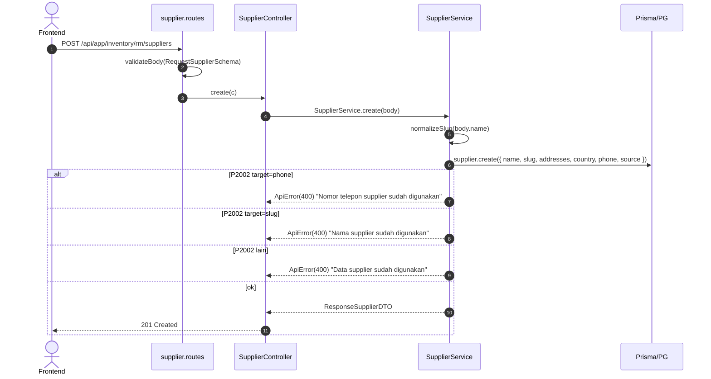

# Module: Inventory / RM / Supplier

**Base path**: `/api/app/inventory/rm/suppliers`
**Source**: `src/module/application/inventory/rm/supplier/`
**Tests**: `src/tests/inventory/rm/supplier/` (14 test)
**Prisma model**: `Supplier` (+ relasi `SupplierMaterial`)

Master data Supplier — partner penyedia raw material. Punya identitas lokasi (`country`, `addresses`, `phone`) dan klasifikasi `source` (`LOCAL` / `IMPORT`). Slug auto-generate dari `name` (lower-case + dash) untuk lookup unique.

> **Catatan**:
>
> - Mount di bawah `/api/app/inventory/rm/suppliers` (path **plural**). Class & file pakai singular (`Supplier`).
> - `slug` di DB **nullable** (record lama belum punya). Worker bulk import melakukan backfill saat lookup; service create selalu set `slug = normalizeSlug(name)`.
> - Hard delete (bukan soft). Defensive: cek `supplier_materials.count` sebelum delete — kalau masih dipakai, tolak.
> - Tidak ada cache layer (`Cache.afterMutation`) di controller saat ini. Cache RM (`rm:*`) **tidak** ikut di-bust kalau supplier berubah. <!-- verify: kalau RM list menampilkan nama supplier, butuh invalidate -->

---

## 1. Scope & Fitur

| Fitur                | Endpoint                          | Catatan                                                                                |
| :------------------- | :-------------------------------- | :------------------------------------------------------------------------------------- |
| List + search + sort | `GET /`                           | Search ILIKE `name` + `phone` + `country`. Sort 4 kolom. Pagination max 100.            |
| Create               | `POST /`                          | Slug auto. Phone unique (kalau diisi).                                                  |
| Detail               | `GET /:id`                        | Return shape `ResponseSupplierDTO` (tanpa relasi).                                      |
| Update               | `PUT /:id`                        | Partial. Slug re-generate kalau `name` ikut diubah.                                     |
| Hard delete          | `DELETE /:id`                     | 400 jika `supplier_materials` masih ada.                                                |
| Bulk delete          | `POST /bulk-delete`               | 400 jika minimal 1 supplier masih punya `supplier_materials`. Single transaction (deleteMany). |

### Out of scope

- Bank account, NPWP, contract terms — belum diadopsi schema saat ini. Tambah field di Prisma + Zod sebelum endpoint baru.
- Approval workflow — tidak ada (CRUD langsung).
- `SupplierMaterial` (relasi M:N dengan RM) — di-manage lewat `inventory/rm` scope (`suppliers[]` di RequestRMSchema) dan worker import. Lihat [`../README.md`](../README.md).

---

## 2. Arsitektur & Flow

### Layer map

```text
┌──────── routes/supplier.routes.ts ──────────────────────────┐
│ POST /bulk-delete (validateBody(BulkDeleteSupplierSchema))  │
│ GET  /:id        → detail                                    │
│ PUT  /:id        (validateBody(RequestSupplierSchema.partial())) → update │
│ DELETE /:id      → delete                                    │
│ GET  /           → list                                      │
│ POST /           (validateBody(RequestSupplierSchema))       │
└────────────────────────┬────────────────────────────────────┘
                         ▼
┌──────── controller/supplier.controller.ts ──────────────────┐
│ - parseId() via IdParamSchema.parse                          │
│ - parse Query lewat QuerySupplierSchema.parse                │
│ - Tidak ada CreateLogger (TBD: audit log belum dipasang)     │
│ - Tidak ada Cache.afterMutation                              │
└────────────────────────┬────────────────────────────────────┘
                         ▼
┌──────── service/supplier.service.ts ────────────────────────┐
│ - SUPPLIER_SELECT: shape ResponseSupplierDTO (tanpa relasi)  │
│ - LIST_INCLUDE: include supplier_materials + raw_material    │
│ - create/update: normalizeSlug(body.name) on every name set  │
│ - delete: pre-check count(supplier_materials)                │
│ - bulkDelete: pre-check `some: {}` → kumpulkan nama in-use   │
│ - rethrowPrismaError: P2002 target phone/slug → 400, P2025 → 404 │
└────────────────────────┬────────────────────────────────────┘
                         ▼
                 Prisma → PostgreSQL
```

### Mermaid: Create flow



### Mermaid: Delete (hard) flow

```mermaid
flowchart TD
    A[DELETE /:id] --> B[count supplier_materials where supplier_id=id]
    B -->|usedCount > 0| E1[400 'Supplier masih digunakan oleh beberapa Raw Material']
    B -->|usedCount = 0| C[supplier.delete where id]
    C -->|P2025| E2[404 'Supplier tidak ditemukan']
    C -->|ok| D[Return { deleted: 1 }]

    F[POST /bulk-delete] --> G[findMany ids with supplier_materials some]
    G -->|inUse.length > 0| E3[400 'Beberapa supplier (X, Y) masih digunakan oleh Raw Material']
    G -->|empty| H[deleteMany ids → count]
    H -->|count = 0| E4[404 'Tidak ada supplier yang cocok dengan id terpilih']
    H -->|count > 0| I[Return { deleted: count }]
```

---

## 3. DTO / Schemas (end-to-end SSOT)

**Source**: `src/module/application/inventory/rm/supplier/supplier.schema.ts`.

### 3.1 `IdParamSchema`

```ts
export const IdParamSchema = z.object({
    id: z.coerce.number().int().positive("ID supplier tidak valid"),
});

export type IdParamDTO = z.infer<typeof IdParamSchema>;
```

| Field | Type     | Required | Constraint                | Error msg                  |
| :---- | :------- | :------- | :------------------------ | :------------------------- |
| `id`  | `number` | ✅       | `coerce`, `int`, `> 0`    | `"ID supplier tidak valid"` |

### 3.2 `RequestSupplierSchema` — POST / & PUT /:id (partial)

```ts
export const RequestSupplierSchema = z.object({
    name: z.string().min(1, "Nama supplier wajib diisi").max(100),
    addresses: z.string().min(1, "Alamat supplier wajib diisi"),
    country: z.string().min(1, "Negara wajib diisi").max(100),
    phone: z.string().max(20).nullable().optional(),
    source: z.enum(RawMaterialSource).default(RawMaterialSource.LOCAL),
});

export type RequestSupplierDTO = z.infer<typeof RequestSupplierSchema>;
```

| Field       | Type                  | Required | Default   | Constraint                          | Error msg                              | Catatan                                                                |
| :---------- | :-------------------- | :------- | :-------- | :---------------------------------- | :------------------------------------- | :--------------------------------------------------------------------- |
| `name`      | `string`              | ✅       | —         | `min(1)`, `max(100)`                | `"Nama supplier wajib diisi"`          | Slug regen tiap kali field ini di-set (`normalizeSlug`).               |
| `addresses` | `string`              | ✅       | —         | `min(1)`                            | `"Alamat supplier wajib diisi"`        | Text (`@db.String` default).                                           |
| `country`   | `string`              | ✅       | —         | `min(1)`, `max(100)`                | `"Negara wajib diisi"`                 | Free text (mis. `"ID"`, `"Indonesia"`). Tidak di-validate vs ISO list. |
| `phone`     | `string \| null`      | ❌       | —         | `max(20)`, nullable, optional       | (default Zod)                          | `@unique` di DB. P2002 jika dup.                                       |
| `source`    | `RawMaterialSource`   | ❌       | `"LOCAL"` | enum                                | (default Zod)                          | `LOCAL` atau `IMPORT`.                                                 |

### 3.3 `QuerySupplierSchema` — GET /

```ts
export const QuerySupplierSchema = z.object({
    page: z.coerce.number().int().positive().default(1),
    take: z.coerce.number().int().positive().max(100).default(25),
    search: z.string().optional(),
    sortBy: z.enum(["country", "name", "updated_at", "created_at"]).default("updated_at"),
    sortOrder: z.enum(["asc", "desc"]).default("desc"),
});

export type QuerySupplierDTO = z.infer<typeof QuerySupplierSchema>;
```

| Param       | Type                                                    | Default        | Constraint                  | Catatan                                                       |
| :---------- | :------------------------------------------------------ | :------------- | :-------------------------- | :------------------------------------------------------------ |
| `page`      | `number` (int)                                          | `1`            | `coerce`, `int`, `> 0`      | —                                                             |
| `take`      | `number` (int)                                          | `25`           | `coerce`, `int`, `1..100`   | —                                                             |
| `search`    | `string?`                                               | —              | optional                    | ILIKE `name` & `country` (insensitive); `contains` `phone`.   |
| `sortBy`    | `"country" \| "name" \| "updated_at" \| "created_at"`   | `"updated_at"` | whitelist                   | Direct field; tidak perlu mapping.                            |
| `sortOrder` | `"asc" \| "desc"`                                       | `"desc"`       | enum                        | —                                                             |

### 3.4 `BulkDeleteSupplierSchema` — POST /bulk-delete

```ts
export const BulkDeleteSupplierSchema = z.object({
    ids: z.array(z.number().int().positive()).min(1, "Minimal 1 supplier harus dipilih"),
});

export type BulkDeleteSupplierDTO = z.infer<typeof BulkDeleteSupplierSchema>;
```

| Field | Type       | Required | Constraint                  | Error msg                              |
| :---- | :--------- | :------- | :-------------------------- | :------------------------------------- |
| `ids` | `number[]` | ✅       | `min(1)`, semua int positif | `"Minimal 1 supplier harus dipilih"`   |

### 3.5 `ResponseSupplierDTO`

```ts
export type ResponseSupplierDTO = {
    id: number;
    name: string;
    slug: string | null;
    addresses: string;
    country: string;
    phone: string | null;
    source: RawMaterialSource;
    created_at: Date;
    updated_at: Date;
};
```

> Ditarik via `SUPPLIER_SELECT` (`Prisma.SupplierSelect`) — **tidak** include `supplier_materials` (untuk endpoint detail/create/update).

### 3.6 `SupplierListItem` — GET / item shape

Pakai `Prisma.SupplierGetPayload<{ include: LIST_INCLUDE }>` — include relasi `supplier_materials` (id, unit_price, min_buy, lead_time, is_preferred, status, plus nested `raw_material` ringkas). Berguna untuk UI master Supplier yang menampilkan jumlah RM yang dipakai.

```ts
const LIST_INCLUDE = {
    supplier_materials: {
        select: {
            id: true,
            unit_price: true,
            min_buy: true,
            lead_time: true,
            is_preferred: true,
            status: true,
            raw_material: {
                select: {
                    id: true,
                    barcode: true,
                    name: true,
                    unit_raw_material: { select: { id: true, name: true } },
                },
            },
        },
    },
} satisfies Prisma.SupplierInclude;
```

### 3.7 Enum referensi

```prisma
enum RawMaterialSource {
    LOCAL
    IMPORT
}
```

### 3.8 Catatan integrasi FE

- Schema mirror: `app/src/app/(application)/inventory/rm/suppliers/server/inventory.rm.supplier.schema.ts` 🚧 TBD.
- DTO export: `RequestSupplierDTO`, `QuerySupplierDTO`, `BulkDeleteSupplierDTO`, `ResponseSupplierDTO`.
- Mirror lengkap di [`../../frontend-integration.md`](../../frontend-integration.md) §2-§5.

---

## 4. Routing untuk integrasi Frontend

Semua endpoint terproteksi `authMiddleware` (session cookie + Redis session) — lihat [AUTH.md](../../../../AUTH.md).

### 4.1 Daftar endpoint

> **Status code SOP** (`dev-flow §1.G`): create → 201; sisanya → 200.

| #   | Method  | Path             | Body / Query                            | Body type | Response (status)                | Error utama                                              |
| :-- | :------ | :--------------- | :-------------------------------------- | :-------- | :------------------------------- | :------------------------------------------------------- |
| 1   | GET     | `/`              | `QuerySupplierDTO` (querystring)        | —         | `{ data, len }` (**200**)        | 400 (query invalid)                                      |
| 2   | POST    | `/`              | `RequestSupplierDTO`                    | JSON      | `ResponseSupplierDTO` (**201**)  | 400 (Zod / phone dup / slug dup)                         |
| 3   | GET     | `/:id`           | —                                       | —         | `ResponseSupplierDTO` (**200**)  | 400 (id invalid), 404                                    |
| 4   | PUT     | `/:id`           | `Partial<RequestSupplierDTO>`           | JSON      | `ResponseSupplierDTO` (**200**)  | 400 (Zod / dup), 404                                     |
| 5   | DELETE  | `/:id`           | —                                       | —         | `{ deleted: 1 }` (**200**)       | 400 (in use), 404                                        |
| 6   | POST    | `/bulk-delete`   | `{ ids: number[] }`                     | JSON      | `{ deleted: n }` (**200**)       | 400 (ids kosong / in use), 404 (no match)                |

### 4.2 Konvensi response

```jsonc
{ "query": null | <echo querystring>, "status": "success", "data": <payload> }
```

Error:

```jsonc
{ "status": "error", "message": "<pesan>" }
```

### 4.3 Contoh integrasi frontend

Snippet endpoint-spesifik di bawah; konvensi lengkap (class `InventoryRMSupplierService`, queryKey, hook split) **ada di** [`../../frontend-integration.md`](../../frontend-integration.md).

```ts
const API = `${process.env.NEXT_PUBLIC_API}/api/app/inventory/rm/suppliers`;

static async list(params: QuerySupplierDTO) {
    const { data } = await api.get<ApiSuccessResponse<{ len: number; data: Array<SupplierListItem> }>>(API, { params });
    return data.data;
}
static async create(body: RequestSupplierDTO) {
    await setupCSRFToken();
    await api.post(API, body);
}
static async update(id: number, body: Partial<RequestSupplierDTO>) {
    await setupCSRFToken();
    await api.put(`${API}/${id}`, body);
}
static async remove(id: number) {
    await setupCSRFToken();
    await api.delete(`${API}/${id}`);
}
static async bulkDelete(ids: number[]) {
    await setupCSRFToken();
    await api.post(`${API}/bulk-delete`, { ids });
}
```

### 4.4 Header & autentikasi

- Cookie session + `x-xsrf-header` untuk mutasi.
- `Content-Type: application/json` untuk semua POST/PUT.

---

## 5. Database / Indexes

Model `Supplier` di `prisma/schema.prisma:281`:

```prisma
model Supplier {
  id                 Int                @id @default(autoincrement())
  name               String             @db.VarChar(100)
  addresses          String
  country            String             @db.VarChar(100)
  phone              String?            @unique @db.VarChar(20)
  created_at         DateTime           @default(now())
  updated_at         DateTime           @updatedAt
  slug               String?            @unique
  source             RawMaterialSource  @default(LOCAL)
  supplier_materials SupplierMaterial[]
  purchase_rfqs      PurchaseRFQ[]
  purchase_orders    PurchaseOrder[]
  account_payables   AccountPayable[]

  @@index([name])
  @@index([country])
  @@index([updated_at])
  @@index([source])
  @@map("suppliers")
}
```

Relasi (RESTRICT default — bukan cascade):

- `SupplierMaterial.supplier_id` → `Supplier.id` (`onDelete: Cascade` di sisi child). Bila dihapus, semua `supplier_materials` di-cascade by Prisma model — **tapi service tetap reject delete kalau child ada**, untuk perlindungan audit.
- `PurchaseRFQ`, `PurchaseOrder`, `AccountPayable` — relasi 1:N tanpa cascade rule eksplisit di model ini. Pre-check belum dilakukan untuk relasi-relasi ini — risk: P2003 di delete kalau ada FK active. <!-- verify -->

**Migration trigram GIN**: belum ada. ILIKE `name`/`country` saat ini full-scan + B-tree index per kolom. Pertimbangkan `suppliers_name_trgm` migration kalau volume bertambah.

---

## 6. Error catalog

| HTTP | Pesan                                                                       | Trigger                                                       |
| :--- | :-------------------------------------------------------------------------- | :------------------------------------------------------------ |
| 400  | `Validation Error` + array `{ message, path }`                              | Body / query gagal Zod.                                       |
| 400  | `ID supplier tidak valid`                                                   | `parseId()` Zod fail.                                          |
| 400  | `Nomor telepon supplier sudah digunakan`                                    | P2002 dengan target `phone` (create/update).                   |
| 400  | `Nama supplier sudah digunakan`                                             | P2002 dengan target `slug` (create/update).                    |
| 400  | `Data supplier sudah digunakan`                                             | P2002 target lain (defense).                                   |
| 400  | `Supplier masih digunakan oleh beberapa Raw Material`                       | `delete /:id`: ada `supplier_materials`.                       |
| 400  | `Beberapa supplier ({names}) masih digunakan oleh Raw Material`             | `bulkDelete`: minimal 1 ID masih punya `supplier_materials`.   |
| 404  | `Supplier tidak ditemukan`                                                  | `detail` / `update` (P2025) find = null.                       |
| 404  | `Tidak ada supplier yang cocok dengan id terpilih`                          | `bulkDelete` deleteMany affected = 0.                          |
| 500  | `Internal Server Error`                                                     | Error tak terduga (re-throw non-Prisma).                       |

---

## 7. Testing

Lokasi: `src/tests/inventory/rm/supplier/supplier.service.test.ts`. **14 test**.

### 7.1 Setup

Mock `prisma.supplier`, `prisma.supplierMaterial`. Re-use global mock di `src/tests/setup.ts`.

### 7.2 Suite

| Suite        | Test cases                                                                                  |
| :----------- | :------------------------------------------------------------------------------------------ |
| `create`     | (1) sukses set slug otomatis; (2) P2002 phone → 400; (3) P2002 slug → 400                   |
| `update`     | (1) regen slug saat name diset; (2) tidak regen kalau name tidak ada; (3) P2025 → 404       |
| `detail`     | (1) 404; (2) sukses return shape SUPPLIER_SELECT                                            |
| `delete`     | (1) 400 in use; (2) sukses delete; (3) P2025 → 404                                          |
| `bulkDelete` | (1) 400 in use (list nama); (2) 404 no match; (3) sukses count                              |
| `list`       | (1) default sort `updated_at desc`; (2) search ILIKE multi-field                            |

### 7.3 Menjalankan test

```bash
# Hanya Supplier
rtk npm test -- --run src/tests/inventory/rm/supplier/

# Watch
rtk npx vitest src/tests/inventory/rm/supplier/
```

> **Routes test untuk supplier belum ada** (`supplier.routes.test.ts` 🚧 TBD). Tambahkan saat sentuh modul ini lagi untuk verifikasi end-to-end HTTP.

---

## 8. Postman testing

Import koleksi `docs/postman/erp-mandalika.postman_collection.json` → folder `Inventory / RM / Suppliers`. Env var sama dengan RM (lihat [`../README.md`](../README.md) §8).

### 8.1 List

```
GET {{base_url}}/api/app/inventory/rm/suppliers?page=1&take=25&sortBy=updated_at&sortOrder=desc&search=aroma
```

### 8.2 Create

```http
POST {{base_url}}/api/app/inventory/rm/suppliers
Content-Type: application/json

{
  "name": "PT Aroma Sentosa",
  "addresses": "Jl. Industri No. 12, Bekasi, Indonesia",
  "country": "ID",
  "phone": "+62811234567",
  "source": "LOCAL"
}
```

Expected sukses (201):

```jsonc
{
  "query": null,
  "status": "success",
  "data": {
    "id": 1,
    "name": "PT Aroma Sentosa",
    "slug": "pt-aroma-sentosa",
    "addresses": "Jl. Industri No. 12, Bekasi, Indonesia",
    "country": "ID",
    "phone": "+62811234567",
    "source": "LOCAL",
    "created_at": "2026-05-19T03:00:00.000Z",
    "updated_at": "2026-05-19T03:00:00.000Z"
  }
}
```

### 8.3 Update

```http
PUT {{base_url}}/api/app/inventory/rm/suppliers/1
Content-Type: application/json

{ "country": "ID", "source": "LOCAL", "phone": "+62811999999" }
```

### 8.4 Delete

```
DELETE {{base_url}}/api/app/inventory/rm/suppliers/1
```

Expected sukses (200): `{ "data": { "deleted": 1 } }`.

### 8.5 Bulk delete

```http
POST {{base_url}}/api/app/inventory/rm/suppliers/bulk-delete
Content-Type: application/json

{ "ids": [2, 3, 4] }
```

Expected sukses (200): `{ "data": { "deleted": 3 } }`.

### 8.6 Expected error responses

```jsonc
// 400 phone dup
{ "status": "error", "message": "Nomor telepon supplier sudah digunakan" }

// 400 nama dup
{ "status": "error", "message": "Nama supplier sudah digunakan" }

// 400 in-use saat delete
{ "status": "error", "message": "Supplier masih digunakan oleh beberapa Raw Material" }

// 400 in-use saat bulk-delete
{ "status": "error", "message": "Beberapa supplier (PT A, PT B) masih digunakan oleh Raw Material" }

// 404
{ "status": "error", "message": "Supplier tidak ditemukan" }
```

---

## 9. Activity log

`SupplierController` saat ini **tidak memanggil `CreateLogger`** — beda dengan FG/RM. Audit trail untuk perubahan supplier belum tercatat di `logging_activities`.

> Pasang `CreateLogger({ activity: "CREATE" | "UPDATE" | "DELETE", description: "Supplier #{id}: {name}", email })` saat sentuh controller berikutnya — penting untuk compliance trail data supplier. <!-- verify -->

---

## 10. Checklist saat menambah fitur Supplier

- [ ] Update `supplier.schema.ts` (Zod chain + DTO export). Tambah field DB lewat migration Prisma.
- [ ] Tulis test TDD di `src/tests/inventory/rm/supplier/supplier.service.test.ts`. **Tambah** `supplier.routes.test.ts` (belum ada).
- [ ] Pre-check FK sebelum delete untuk relasi tambahan (`PurchaseRFQ`, `PurchaseOrder`, `AccountPayable`) — saat ini hanya `SupplierMaterial`.
- [ ] Tambahkan `Cache.afterMutation` jika RM list/detail menampilkan data supplier yang berubah.
- [ ] Pasang `CreateLogger` audit per mutasi.
- [ ] Update dokumen ini + tabel di `../README.md` + `../../README.md` (sub-modul row).
- [ ] Update Postman folder `Inventory / RM / Suppliers`.
- [ ] Update FE schema mirror `inventory.rm.supplier.*` di `app/`.
- [ ] `rtk tsc --noEmit` + `rtk npm test -- --run src/tests/inventory/rm/supplier/`.

---

## 11. Referensi silang

- Parent scope: [`../README.md`](../README.md)
- Module index: [`../../README.md`](../../README.md)
- FE integration: [`../../frontend-integration.md`](../../frontend-integration.md)
- Arsitektur global: [`../../../ARCHITECTURE.md`](../../../../ARCHITECTURE.md)
- Auth & session: [`../../../AUTH.md`](../../../../AUTH.md)
- Database conventions: [`../../../DATABASE.md`](../../../../DATABASE.md)
- Modul terkait:
    - `inventory/rm` — `SupplierMaterial` (M:N), preferred supplier per RM.
    - `inventory/rm/import` — supplier auto-upsert + backfill slug.
    - `purchase` — `PurchaseRFQ`, `PurchaseOrder` (1:N dari Supplier).
    - `finance` — `AccountPayable` (hutang ke supplier).
