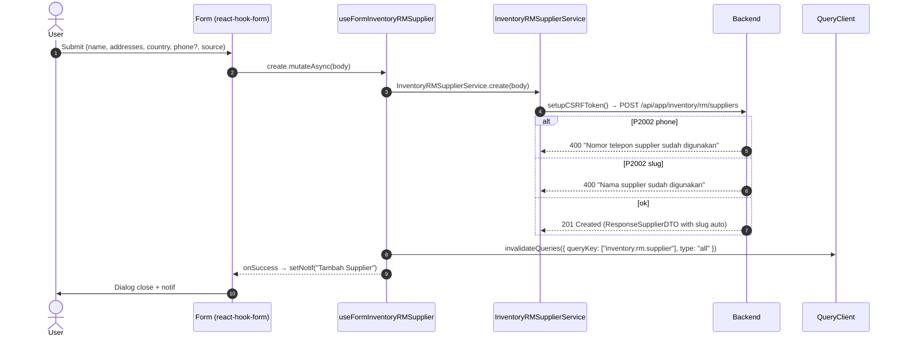
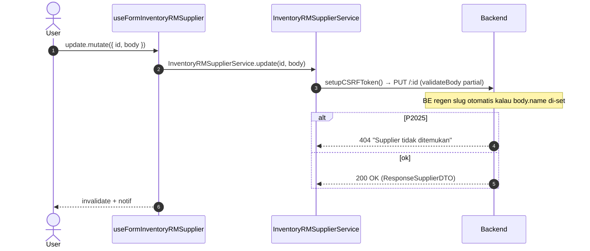
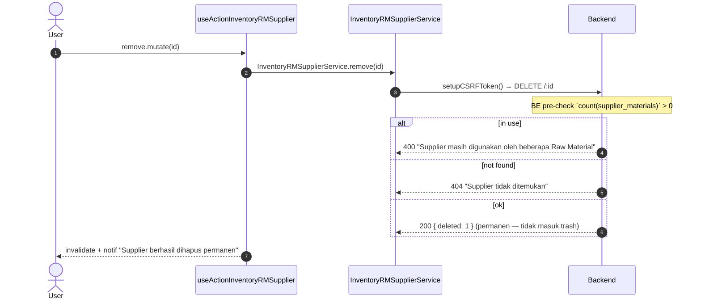
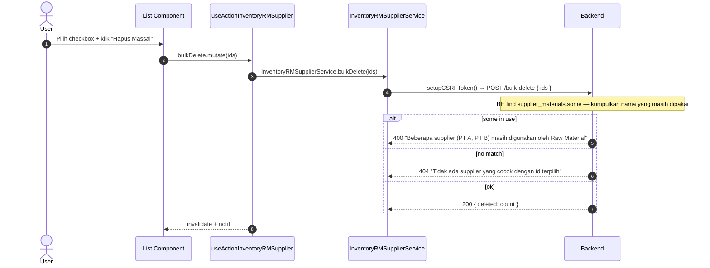

# Inventory / RM / Supplier — Frontend Integration (Scope Level)

End-to-end FE integration **lengkap** untuk scope ini. FE engineer baca file ini saja → bisa implement dari nol.

**Backend scope path**: `api/src/module/application/inventory/rm/supplier/`
**Frontend scope path**: `app/src/app/(application)/inventory/rm/suppliers/server/`
**Component path**: `app/src/components/pages/inventory/rm/suppliers/`
**Endpoint base**: `/api/app/inventory/rm/suppliers`
**Status FE**: 🚧 TBD <!-- ubah ke ✅ Ready setelah file FE dibuat -->

**Dependencies**:

- Konvensi global modul ([`../../frontend-integration.md`](../../frontend-integration.md)) — CSRF, queryKey naming, error pattern, debounce, design tokens, status code expectation.
- BE scope doc ([`./README.md`](./README.md)) — Zod schema source, endpoint detail, error catalog.
- SOP canonical: [frontend-dev-flow](../../../../../.claude/skills/frontend-dev-flow/SKILL.md).

Master data Supplier — partner penyedia raw material. CRUD murni dengan **hard delete** (bukan soft) dan pre-check FK ke `supplier_materials` agar supplier yang masih dipakai oleh RM tidak boleh dihapus. Slug auto-generate server-side dari `name`.

---

## 1. Schema Mirror End-to-End

**Source BE**: `src/module/application/inventory/rm/supplier/supplier.schema.ts`. FE mirror WAJIB 1:1.

### 1.1 `RequestSupplierSchema` (BE — verbatim)

```ts
import { z } from "zod";
import { RawMaterialSource } from "../../../../../generated/prisma/client.js";

export const RequestSupplierSchema = z.object({
    name: z.string().min(1, "Nama supplier wajib diisi").max(100),
    addresses: z.string().min(1, "Alamat supplier wajib diisi"),
    country: z.string().min(1, "Negara wajib diisi").max(100),
    phone: z.string().max(20).nullable().optional(),
    source: z.enum(RawMaterialSource).default(RawMaterialSource.LOCAL),
});
```

**Field detail**:

| Field       | Type                  | Required | Default   | Constraint                          | Error msg                              | Catatan                                                                |
| :---------- | :-------------------- | :------- | :-------- | :---------------------------------- | :------------------------------------- | :--------------------------------------------------------------------- |
| `name`      | `string`              | ✅       | —         | `min(1)`, `max(100)`                | `"Nama supplier wajib diisi"`          | Server-side `normalizeSlug(name)` setiap kali field ini di-set.        |
| `addresses` | `string`              | ✅       | —         | `min(1)`                            | `"Alamat supplier wajib diisi"`        | Single free-text textarea (bukan array; nama field tetap `addresses`). |
| `country`   | `string`              | ✅       | —         | `min(1)`, `max(100)`                | `"Negara wajib diisi"`                 | Free text (mis. `"ID"`, `"Indonesia"`). Tidak di-validate vs ISO list. |
| `phone`     | `string \| null`      | ❌       | —         | `max(20)`, nullable, optional       | (default Zod)                          | `@unique` di DB. P2002 → 400 `"Nomor telepon supplier sudah digunakan"`. |
| `source`    | `RawMaterialSource`   | ❌       | `"LOCAL"` | enum `RawMaterialSource`            | (default Zod)                          | `LOCAL` atau `IMPORT`.                                                 |

### 1.2 `ResponseSupplierDTO` & shape

Penting: di BE **`ResponseSupplierDTO` adalah plain TS type, BUKAN Zod schema** (tidak ada `ResponseSupplierSchema`). Field ditarik dari `SUPPLIER_SELECT` Prisma. `slug` adalah `string | null` (auto-generated server-side dari `name`).

```ts
export type ResponseSupplierDTO = {
    id: number;
    name: string;
    slug: string | null;
    addresses: string;
    country: string;
    phone: string | null;
    source: RawMaterialSource;
    created_at: Date;
    updated_at: Date;
};
```

**Transformasi service** (BE post-processing — FE harus tahu agar tidak salah render):

| Field di response | Sumber Prisma           | Transformasi service                                            |
| :---------------- | :---------------------- | :-------------------------------------------------------------- |
| `slug`            | `Supplier.slug`         | Auto-set via `normalizeSlug(name)` di create + update (saat name ikut diubah). Nullable hanya untuk record legacy. |
| `phone`           | `Supplier.phone`        | `body.phone ?? null` — string kosong tidak diizinkan (Zod max 20). |
| `created_at`, `updated_at` | `DateTime`     | JSON serialisasi → ISO string; FE parse via `z.coerce.date()`.   |

> Endpoint `GET /` (list) mengembalikan shape yang lebih kaya (`SupplierListItem`) — include `supplier_materials` ringkas. Lihat §2.2.

### 1.3 `QuerySupplierSchema` — GET /

```ts
export const QuerySupplierSchema = z.object({
    page: z.coerce.number().int().positive().default(1),
    take: z.coerce.number().int().positive().max(100).default(25),
    search: z.string().optional(),
    sortBy: z.enum(["country", "name", "updated_at", "created_at"]).default("updated_at"),
    sortOrder: z.enum(["asc", "desc"]).default("desc"),
});

export type QuerySupplierDTO = z.infer<typeof QuerySupplierSchema>;
```

| Param       | Type                                                    | Default        | Constraint                  | Catatan                                                       |
| :---------- | :------------------------------------------------------ | :------------- | :-------------------------- | :------------------------------------------------------------ |
| `page`      | `number` (int)                                          | `1`            | `coerce`, `int`, `> 0`      | —                                                             |
| `take`      | `number` (int)                                          | `25`           | `coerce`, `int`, `1..100`   | Max 100.                                                      |
| `search`    | `string?`                                               | —              | optional                    | ILIKE `name`, `country` (insensitive); `contains` `phone`.    |
| `sortBy`    | `"country" \| "name" \| "updated_at" \| "created_at"`   | `"updated_at"` | whitelist                   | Direct field; tidak perlu mapping.                            |
| `sortOrder` | `"asc" \| "desc"`                                       | `"desc"`       | enum                        | —                                                             |

### 1.4 `BulkDeleteSupplierSchema` — POST /bulk-delete

```ts
export const BulkDeleteSupplierSchema = z.object({
    ids: z.array(z.number().int().positive()).min(1, "Minimal 1 supplier harus dipilih"),
});

export type BulkDeleteSupplierDTO = z.infer<typeof BulkDeleteSupplierSchema>;
```

| Field | Type       | Required | Constraint                  | Error msg                              |
| :---- | :--------- | :------- | :-------------------------- | :------------------------------------- |
| `ids` | `number[]` | ✅       | `min(1)`, semua int positif | `"Minimal 1 supplier harus dipilih"`   |

### 1.5 Enum referensi (Prisma)

```prisma
enum RawMaterialSource {
    LOCAL
    IMPORT
}
```

Lokasi BE: `prisma/schema.prisma`. FE import via `@/shared/types` — **JANGAN duplikasi literal**.

---

## 2. FE Schema Mirror

**File**: `app/src/app/(application)/inventory/rm/suppliers/server/inventory.rm.supplier.schema.ts` 🚧 TBD

```ts
import { z } from "zod";
import { RawMaterialSource } from "@/shared/types";

export const RequestSupplierSchema = z.object({
    name: z.string().min(1, "Nama supplier wajib diisi").max(100),
    addresses: z.string().min(1, "Alamat supplier wajib diisi"),
    country: z.string().min(1, "Negara wajib diisi").max(100),
    phone: z.string().max(20).nullable().optional(),
    source: z.enum(RawMaterialSource).default(RawMaterialSource.LOCAL),
});

export type RequestSupplierDTO = z.input<typeof RequestSupplierSchema>;

// ResponseSupplierDTO = plain interface (mirror BE — bukan Zod karena BE tidak punya ResponseSchema).
export interface ResponseSupplierDTO {
    id: number;
    name: string;
    slug: string | null;
    addresses: string;
    country: string;
    phone: string | null;
    source: RawMaterialSource;
    created_at: string; // ISO dari API
    updated_at: string;
}

export const QuerySupplierSchema = z.object({
    page: z.coerce.number().int().positive().default(1),
    take: z.coerce.number().int().positive().max(100).default(25),
    search: z.string().optional(),
    sortBy: z.enum(["country", "name", "updated_at", "created_at"]).default("updated_at"),
    sortOrder: z.enum(["asc", "desc"]).default("desc"),
});

export type QuerySupplierDTO = z.infer<typeof QuerySupplierSchema>;

export const BulkDeleteSupplierSchema = z.object({
    ids: z.array(z.number().int().positive()).min(1, "Minimal 1 supplier harus dipilih"),
});

export type BulkDeleteSupplierDTO = z.infer<typeof BulkDeleteSupplierSchema>;
```

**Diff vs BE**: empty. Catatan: BE tidak punya `ResponseSupplierSchema` Zod, jadi FE mirror pakai plain `interface` — sengaja, mengikuti BE.

---

## 3. Service Class — FULL CODE

**File**: `app/src/app/(application)/inventory/rm/suppliers/server/inventory.rm.supplier.service.ts` 🚧 TBD

```ts
import api from "@/lib/api";
import { setupCSRFToken } from "@/shared/api/csrf";
import type { ApiSuccessResponse } from "@/shared/types/api";
import type {
    RequestSupplierDTO,
    ResponseSupplierDTO,
    QuerySupplierDTO,
} from "./inventory.rm.supplier.schema";

const API = `${process.env.NEXT_PUBLIC_API}/api/app/inventory/rm/suppliers`;

export class InventoryRMSupplierService {
    static async list(
        params: QuerySupplierDTO,
    ): Promise<{ data: ResponseSupplierDTO[]; len: number }> {
        try {
            const { data } = await api.get<
                ApiSuccessResponse<{ data: ResponseSupplierDTO[]; len: number }>
            >(API, { params });
            return data.data;
        } catch (error) {
            throw error;
        }
    }

    static async detail(id: number): Promise<ResponseSupplierDTO> {
        try {
            const { data } = await api.get<ApiSuccessResponse<ResponseSupplierDTO>>(
                `${API}/${id}`,
            );
            return data.data;
        } catch (error) {
            throw error;
        }
    }

    static async create(body: RequestSupplierDTO): Promise<void> {
        try {
            await setupCSRFToken();
            await api.post(API, body);
        } catch (error) {
            throw error;
        }
    }

    static async update(id: number, body: Partial<RequestSupplierDTO>): Promise<void> {
        try {
            await setupCSRFToken();
            await api.put(`${API}/${id}`, body);
        } catch (error) {
            throw error;
        }
    }

    // HARD DELETE — bukan soft. BE melakukan pre-check `supplier_materials.count` → 400 jika masih dipakai.
    static async remove(id: number): Promise<void> {
        try {
            await setupCSRFToken();
            await api.delete(`${API}/${id}`);
        } catch (error) {
            throw error;
        }
    }

    // Bulk hard delete via POST /bulk-delete dengan body { ids: number[] }.
    static async bulkDelete(ids: number[]): Promise<void> {
        try {
            await setupCSRFToken();
            await api.post(`${API}/bulk-delete`, { ids });
        } catch (error) {
            throw error;
        }
    }
}
```

> Catatan: TIDAK ADA `changeStatus`/`bulkStatus`/`restore`/`clean`/`exportCsv` di scope ini. Supplier tidak punya field STATUS dan tidak ada soft-delete trash mode. Endpoint export CSV juga belum dibuka di BE.

---

## 4. Hooks — 5 Hook Split FULL CODE

**File**: `app/src/app/(application)/inventory/rm/suppliers/server/use.inventory.rm.supplier.ts` 🚧 TBD

```ts
"use client";
import { useQuery, useMutation, useQueryClient } from "@tanstack/react-query";
import { useSetAtom } from "jotai";
import { useState, useMemo, useCallback } from "react";
import { useSearchParams } from "next/navigation";
import { useDebounce, useQueryParams } from "@/shared/hooks";
import { errorAtom, notificationAtom } from "@/shared/atoms";
import { FetchError } from "@/shared/api/errors";
import type { ResponseError } from "@/shared/types/api";
import { InventoryRMSupplierService } from "./inventory.rm.supplier.service";
import type {
    RequestSupplierDTO,
    ResponseSupplierDTO,
    QuerySupplierDTO,
} from "./inventory.rm.supplier.schema";

const KEY = ["inventory.rm.supplier"] as const;

// ──────────────────────────────────────────────────────────────────────────────
// 4.1 READ — useQuery wrapper
// ──────────────────────────────────────────────────────────────────────────────
export function useInventoryRMSupplier(params: QuerySupplierDTO, enabled = true) {
    return useQuery<{ data: ResponseSupplierDTO[]; len: number }, ResponseError>({
        queryKey: [...KEY, params],
        queryFn: () => InventoryRMSupplierService.list(params),
        enabled,
        staleTime: 30_000,
    });
}

export function useInventoryRMSupplierDetail(id: number, enabled = true) {
    return useQuery<ResponseSupplierDTO, ResponseError>({
        queryKey: [...KEY, id],
        queryFn: () => InventoryRMSupplierService.detail(id),
        enabled: enabled && Boolean(id),
    });
}

// ──────────────────────────────────────────────────────────────────────────────
// 4.2 WRITE — create + update mutations
// ──────────────────────────────────────────────────────────────────────────────
export function useFormInventoryRMSupplier() {
    const setErr = useSetAtom(errorAtom);
    const setNotif = useSetAtom(notificationAtom);
    const queryClient = useQueryClient();

    const invalidate = () =>
        queryClient.invalidateQueries({ queryKey: KEY, type: "all" });

    const create = useMutation<unknown, ResponseError, RequestSupplierDTO>({
        mutationKey: [...KEY, "create"],
        mutationFn: (body) => InventoryRMSupplierService.create(body),
        onSuccess: () => {
            setNotif({ title: "Tambah Supplier", message: "Berhasil menambahkan supplier baru" });
            invalidate();
        },
        onError: (err) => FetchError(err, setErr),
    });

    const update = useMutation<
        unknown,
        ResponseError,
        { id: number; body: Partial<RequestSupplierDTO> }
    >({
        mutationKey: [...KEY, "update"],
        mutationFn: ({ id, body }) => InventoryRMSupplierService.update(id, body),
        onSuccess: () => {
            setNotif({ title: "Ubah Supplier", message: "Berhasil memperbarui data supplier" });
            invalidate();
        },
        onError: (err) => FetchError(err, setErr),
    });

    return { create, update };
}

// ──────────────────────────────────────────────────────────────────────────────
// 4.3 ACTION — hard delete + bulk delete (NO status / NO restore / NO clean)
// ──────────────────────────────────────────────────────────────────────────────
export function useActionInventoryRMSupplier() {
    const setErr = useSetAtom(errorAtom);
    const setNotif = useSetAtom(notificationAtom);
    const queryClient = useQueryClient();
    const invalidate = () =>
        queryClient.invalidateQueries({ queryKey: KEY, type: "all" });

    const remove = useMutation<unknown, ResponseError, number>({
        mutationKey: [...KEY, "remove"],
        mutationFn: (id) => InventoryRMSupplierService.remove(id),
        onSuccess: () => {
            setNotif({ title: "Hapus Supplier", message: "Supplier berhasil dihapus permanen" });
            invalidate();
        },
        onError: (err) => FetchError(err, setErr),
    });

    const bulkDelete = useMutation<unknown, ResponseError, number[]>({
        mutationKey: [...KEY, "bulkDelete"],
        mutationFn: (ids) => InventoryRMSupplierService.bulkDelete(ids),
        onSuccess: () => {
            setNotif({ title: "Hapus Massal", message: "Supplier terpilih berhasil dihapus permanen" });
            invalidate();
        },
        onError: (err) => FetchError(err, setErr),
    });

    return { remove, bulkDelete };
}

// ──────────────────────────────────────────────────────────────────────────────
// 4.4 TableState — URL sync + debounce search (NO trash toggle — hard delete)
// ──────────────────────────────────────────────────────────────────────────────
export function useInventoryRMSupplierTableState() {
    const searchParams = useSearchParams();
    const { batchSet } = useQueryParams();

    const rawSearch = searchParams.get("search") ?? "";
    const [search, setSearchState] = useState(rawSearch);
    const debouncedSearch = useDebounce(search, 500);

    const setSearch = useCallback((val: string) => {
        setSearchState(val);
    }, []);

    useMemo(() => {
        batchSet({ search: debouncedSearch || null, page: "1" });
    }, [debouncedSearch, batchSet]);

    const page = Number(searchParams.get("page") ?? 1);
    const take = Number(searchParams.get("take") ?? 25);
    const sortBy = (searchParams.get("sortBy") ?? "updated_at") as QuerySupplierDTO["sortBy"];
    const sortOrder = (searchParams.get("sortOrder") ?? "desc") as QuerySupplierDTO["sortOrder"];

    const queryParams = useMemo<QuerySupplierDTO>(
        () => ({ page, take, search: debouncedSearch || undefined, sortBy, sortOrder }),
        [page, take, debouncedSearch, sortBy, sortOrder],
    );

    return { search, setSearch, page, take, sortBy, sortOrder, queryParams };
}

// ──────────────────────────────────────────────────────────────────────────────
// 4.5 Query-wrapper — bundling list + tableState untuk page consumer
// ──────────────────────────────────────────────────────────────────────────────
export function useInventoryRMSupplierQuery() {
    const tableState = useInventoryRMSupplierTableState();
    const query = useInventoryRMSupplier(tableState.queryParams);
    return { ...tableState, query };
}
```

---

## 5. Components — Snippets

### 5.1 List page — `components/pages/inventory/rm/suppliers/index.tsx` 🚧 TBD

NO trash mode toggle (hard delete saja). Bulk bar hanya tombol "Hapus".

```tsx
"use client";
import {
    useInventoryRMSupplierQuery,
    useActionInventoryRMSupplier,
} from "@/app/(application)/inventory/rm/suppliers/server/use.inventory.rm.supplier";
import { DataTable } from "@/components/ui/data-table";
import { columns } from "./table/columns";
import { SupplierFormDialog } from "./form/supplier-form-dialog";

export default function SupplierList() {
    const { query, search, setSearch } = useInventoryRMSupplierQuery();
    const { bulkDelete } = useActionInventoryRMSupplier();

    return (
        <section className="space-y-4">
            <header className="flex items-center justify-between gap-2">
                <input
                    value={search}
                    onChange={(e) => setSearch(e.target.value)}
                    placeholder="Cari nama / phone / negara…"
                    className="rounded-xl border-zinc-200 px-3 py-2"
                />
                <SupplierFormDialog mode="create" />
            </header>
            <DataTable
                tableId="inventory-rm-supplier-table"
                columns={columns}
                data={query.data?.data ?? []}
                total={query.data?.len ?? 0}
                loading={query.isLoading}
                enableMultiSelect
                onBulkAction={(ids) => bulkDelete.mutate(ids)}
            />
        </section>
    );
}
```

### 5.2 Form create — `components/pages/inventory/rm/suppliers/form/create.tsx` 🚧 TBD

```tsx
"use client";
import { useForm } from "react-hook-form";
import { zodResolver } from "@hookform/resolvers/zod";
import { Form } from "@/components/ui/form/main";
import { InputForm, SelectForm, TextareaForm } from "@/components/ui/form";
import {
    RequestSupplierSchema,
    type RequestSupplierDTO,
} from "@/app/(application)/inventory/rm/suppliers/server/inventory.rm.supplier.schema";
import { useFormInventoryRMSupplier } from "@/app/(application)/inventory/rm/suppliers/server/use.inventory.rm.supplier";

const SOURCE_OPTIONS = [
    { label: "Lokal", value: "LOCAL" },
    { label: "Impor", value: "IMPORT" },
];

export function CreateSupplierForm({ onSuccess }: { onSuccess?: () => void }) {
    const form = useForm<RequestSupplierDTO>({
        resolver: zodResolver(RequestSupplierSchema),
        defaultValues: { source: "LOCAL" },
    });
    const { create } = useFormInventoryRMSupplier();

    const handleSubmit = form.handleSubmit(async (body) => {
        await create.mutateAsync(body);
        form.reset();
        onSuccess?.();
    });

    return (
        <Form methods={form}>
            <form onSubmit={handleSubmit} className="space-y-3">
                <InputForm name="name" label="Nama Supplier" required />
                <InputForm name="country" label="Negara" required />
                <InputForm name="phone" label="No. Telepon (opsional)" />
                <TextareaForm name="addresses" label="Alamat" required />
                <SelectForm name="source" label="Source" options={SOURCE_OPTIONS} />
                <button type="submit" disabled={create.isPending}>
                    {create.isPending ? "Menyimpan…" : "Simpan"}
                </button>
            </form>
        </Form>
    );
}
```

### 5.3 Form edit — `components/pages/inventory/rm/suppliers/form/edit.tsx` 🚧 TBD

```tsx
"use client";
import { useForm } from "react-hook-form";
import { zodResolver } from "@hookform/resolvers/zod";
import { Form } from "@/components/ui/form/main";
import { InputForm, SelectForm, TextareaForm } from "@/components/ui/form";
import {
    RequestSupplierSchema,
    type RequestSupplierDTO,
    type ResponseSupplierDTO,
} from "@/app/(application)/inventory/rm/suppliers/server/inventory.rm.supplier.schema";
import { useFormInventoryRMSupplier } from "@/app/(application)/inventory/rm/suppliers/server/use.inventory.rm.supplier";

export function EditSupplierForm({
    initial,
    onSuccess,
}: {
    initial: ResponseSupplierDTO;
    onSuccess?: () => void;
}) {
    const form = useForm<RequestSupplierDTO>({
        resolver: zodResolver(RequestSupplierSchema.partial()),
        defaultValues: {
            name: initial.name,
            addresses: initial.addresses,
            country: initial.country,
            phone: initial.phone ?? undefined,
            source: initial.source,
        },
    });
    const { update } = useFormInventoryRMSupplier();

    const handleSubmit = form.handleSubmit(async (body) => {
        await update.mutateAsync({ id: initial.id, body });
        onSuccess?.();
    });

    return (
        <Form methods={form}>
            <form onSubmit={handleSubmit} className="space-y-3">
                <InputForm name="name" label="Nama Supplier" />
                <InputForm name="country" label="Negara" />
                <InputForm name="phone" label="No. Telepon" />
                <TextareaForm name="addresses" label="Alamat" />
                <SelectForm
                    name="source"
                    label="Source"
                    options={[
                        { label: "Lokal", value: "LOCAL" },
                        { label: "Impor", value: "IMPORT" },
                    ]}
                />
                <button type="submit" disabled={update.isPending}>
                    {update.isPending ? "Menyimpan…" : "Simpan"}
                </button>
            </form>
        </Form>
    );
}
```

### 5.4 Dialog wrapper — `components/pages/inventory/rm/suppliers/form/supplier-form-dialog.tsx` 🚧 TBD

```tsx
"use client";
import { useState } from "react";
import { Dialog, DialogContent, DialogTrigger } from "@/components/ui/dialog";
import { CreateSupplierForm } from "./create";
import { EditSupplierForm } from "./edit";
import type { ResponseSupplierDTO } from "@/app/(application)/inventory/rm/suppliers/server/inventory.rm.supplier.schema";

type Props =
    | { mode: "create" }
    | { mode: "edit"; initial: ResponseSupplierDTO };

export function SupplierFormDialog(props: Props) {
    const [open, setOpen] = useState(false);
    return (
        <Dialog open={open} onOpenChange={setOpen}>
            <DialogTrigger asChild>
                <button className="rounded-xl bg-gold-500 px-3 py-2 text-white">
                    {props.mode === "create" ? "Tambah Supplier" : "Edit"}
                </button>
            </DialogTrigger>
            <DialogContent>
                {props.mode === "create" ? (
                    <CreateSupplierForm onSuccess={() => setOpen(false)} />
                ) : (
                    <EditSupplierForm initial={props.initial} onSuccess={() => setOpen(false)} />
                )}
            </DialogContent>
        </Dialog>
    );
}
```

### 5.5 Columns — `components/pages/inventory/rm/suppliers/table/columns.tsx` 🚧 TBD

```tsx
import type { ColumnDef } from "@tanstack/react-table";
import type { ResponseSupplierDTO } from "@/app/(application)/inventory/rm/suppliers/server/inventory.rm.supplier.schema";
import { Badge } from "@/components/ui/badge";

export const columns: ColumnDef<ResponseSupplierDTO>[] = [
    { accessorKey: "name", header: "Nama" },
    { accessorKey: "country", header: "Negara" },
    {
        accessorKey: "phone",
        header: "Telepon",
        cell: ({ row }) => row.original.phone ?? "—",
    },
    {
        accessorKey: "source",
        header: "Source",
        cell: ({ row }) => (
            <Badge variant={row.original.source === "IMPORT" ? "gold" : "zinc"}>
                {row.original.source}
            </Badge>
        ),
    },
    {
        accessorKey: "updated_at",
        header: "Diperbarui",
        cell: ({ row }) => new Date(row.original.updated_at).toLocaleDateString("id-ID"),
    },
];
```

### 5.6 Page entry — `app/(application)/inventory/rm/suppliers/page.tsx` 🚧 TBD

```tsx
import { Suspense } from "react";
import SupplierList from "@/components/pages/inventory/rm/suppliers";

export default function SupplierPage() {
    return (
        <Suspense fallback={<div>Loading…</div>}>
            <SupplierList />
        </Suspense>
    );
}
```

---

## 6. End-to-End Flow per Operasi

### 6.1 Create



### 6.2 Update



### 6.3 Delete (HARD — bukan soft)



### 6.4 Bulk Delete



---

## 7. Edge Cases & Per-Scope Quirks

- **Debounce search**: 500ms (via `useDebounce`). URL sync via `useQueryParams.batchSet` setelah debounce.
- **NO trash mode**: scope ini **hard delete** (bukan soft). Tidak ada `?trash=1` toggle, tidak ada tombol Restore, tidak ada "Bersihkan Sampah". Bulk bar cuma satu aksi: "Hapus".
- **Slug auto-generated server-side**: FE **jangan kirim** `slug` di body — BE selalu `normalizeSlug(name)` di create & saat `name` diubah pada update. FE hanya read `slug` dari response (boleh `string | null` untuk record legacy).
- **`phone` unique optional**: kosongkan (omit/`undefined`/`null`) untuk skip; kalau diisi WAJIB unique di DB. P2002 → 400 `"Nomor telepon supplier sudah digunakan"` — tampilkan inline error di field `phone`. Note: `max(20)` characters.
- **`source` enum 2 nilai**: `LOCAL` / `IMPORT`. Default `LOCAL` di Zod — kalau tidak dikirim, BE set ke `LOCAL`. UI select WAJIB exactly dua opsi ini; jangan tambah "BOTH" / "OEM" / etc.
- **`addresses` = single textarea field** (string, bukan array). Plural naming `addresses` adalah artefak schema lama; tetap string tunggal.
- **FK pre-check delete**: BE proteksi delete via `count(supplier_materials)`. FE menangani 400 dengan notif yang menjelaskan supplier masih dipakai RM. Saat ini BE belum cek `purchase_rfqs`, `purchase_orders`, `account_payables` — risk P2003 untuk relasi tersebut. <!-- verify backend pre-check expansion -->
- **Sort whitelist BE**: hanya 4 kolom (`country`, `name`, `updated_at`, `created_at`). Header table interaktif WAJIB cocok daftar ini — selain itu BE reject 400 Zod.
- **NO status field**: supplier tidak memiliki kolom STATUS (`ACTIVE`/`INACTIVE`/...). Tidak ada `changeStatus` / `bulkStatus` / `BulkActionEnum`. Hidup-mati supplier diasumsikan dari ada/tidaknya `supplier_materials` aktif (lihat scope RM).
- **List response shape**: `GET /` mengembalikan items yang sudah include `supplier_materials` ringkas (lihat BE README §3.6 `SupplierListItem`). Detail (`GET /:id`) hanya `ResponseSupplierDTO` flat tanpa relasi — perhatikan saat mapping ke `ResponseSupplierDTO`. FE boleh extend type lokal `SupplierListItem` kalau perlu render kolom "Jumlah RM".
- **Activity log absent**: BE controller belum panggil `CreateLogger`. FE jangan asumsikan ada audit trail.
- **Cache invalidation**: scope RM list menampilkan nama supplier. Kalau update Supplier, FE WAJIB invalidate juga `["inventory.rm"]` query key (selain `["inventory.rm.supplier"]`) — atau tunggu staleTime expire 30 s. Tambah cross-invalidate explicit di `useFormInventoryRMSupplier` kalau UX harus instan.

---

## 8. Testing FE (Vitest + RTL)

**Lokasi**: `app/src/__tests__/inventory/rm/supplier/` 🚧 TBD. Mengikuti SOP `frontend-testing`.

### 8.1 Service test

```ts
import { describe, it, expect, vi } from "vitest";
import api from "@/lib/api";
import { InventoryRMSupplierService } from "@/app/(application)/inventory/rm/suppliers/server/inventory.rm.supplier.service";

vi.mock("@/lib/api");
vi.mock("@/shared/api/csrf", () => ({ setupCSRFToken: vi.fn() }));

describe("InventoryRMSupplierService", () => {
    it("list passes params to GET", async () => {
        (api.get as any).mockResolvedValue({ data: { data: { data: [], len: 0 } } });
        await InventoryRMSupplierService.list({
            page: 1,
            take: 25,
            sortBy: "updated_at",
            sortOrder: "desc",
        });
        expect(api.get).toHaveBeenCalledWith(
            expect.stringContaining("/api/app/inventory/rm/suppliers"),
            { params: expect.objectContaining({ page: 1 }) },
        );
    });

    it("create calls setupCSRFToken before POST", async () => {
        (api.post as any).mockResolvedValue({});
        await InventoryRMSupplierService.create({
            name: "PT A",
            addresses: "Jl. X",
            country: "ID",
            source: "LOCAL",
        });
        expect(api.post).toHaveBeenCalledWith(
            expect.stringContaining("/api/app/inventory/rm/suppliers"),
            expect.objectContaining({ name: "PT A", source: "LOCAL" }),
        );
    });

    it("remove sends DELETE /:id (HARD delete)", async () => {
        (api.delete as any).mockResolvedValue({});
        await InventoryRMSupplierService.remove(7);
        expect(api.delete).toHaveBeenCalledWith(
            expect.stringMatching(/\/api\/app\/inventory\/rm\/suppliers\/7$/),
        );
    });

    it("bulkDelete POSTs to /bulk-delete with { ids }", async () => {
        (api.post as any).mockResolvedValue({});
        await InventoryRMSupplierService.bulkDelete([1, 2, 3]);
        expect(api.post).toHaveBeenCalledWith(
            expect.stringMatching(/\/bulk-delete$/),
            { ids: [1, 2, 3] },
        );
    });
});
```

### 8.2 Hook test

```tsx
import { describe, it, expect, vi } from "vitest";
import { renderHook, waitFor } from "@testing-library/react";
import { QueryClient, QueryClientProvider } from "@tanstack/react-query";
import { useInventoryRMSupplier } from "@/app/(application)/inventory/rm/suppliers/server/use.inventory.rm.supplier";
import { InventoryRMSupplierService } from "@/app/(application)/inventory/rm/suppliers/server/inventory.rm.supplier.service";

vi.mock("@/app/(application)/inventory/rm/suppliers/server/inventory.rm.supplier.service");

const wrapper = ({ children }: { children: React.ReactNode }) => {
    const client = new QueryClient({ defaultOptions: { queries: { retry: false } } });
    return <QueryClientProvider client={client}>{children}</QueryClientProvider>;
};

describe("useInventoryRMSupplier", () => {
    it("fetches list via service", async () => {
        (InventoryRMSupplierService.list as any).mockResolvedValue({ data: [], len: 0 });
        const { result } = renderHook(
            () =>
                useInventoryRMSupplier({
                    page: 1,
                    take: 25,
                    sortBy: "updated_at",
                    sortOrder: "desc",
                }),
            { wrapper },
        );
        await waitFor(() => expect(result.current.isSuccess).toBe(true));
        expect(InventoryRMSupplierService.list).toHaveBeenCalled();
    });
});
```

### 8.3 Component test

```tsx
import { describe, it, expect, vi } from "vitest";
import { render, screen } from "@testing-library/react";
import { CreateSupplierForm } from "@/components/pages/inventory/rm/suppliers/form/create";

vi.mock(
    "@/app/(application)/inventory/rm/suppliers/server/use.inventory.rm.supplier",
    () => ({
        useFormInventoryRMSupplier: () => ({
            create: { mutateAsync: vi.fn(), isPending: false },
        }),
    }),
);

describe("CreateSupplierForm", () => {
    it("renders required fields", () => {
        render(<CreateSupplierForm />);
        expect(screen.getByLabelText("Nama Supplier")).toBeInTheDocument();
        expect(screen.getByLabelText("Negara")).toBeInTheDocument();
        expect(screen.getByLabelText("Alamat")).toBeInTheDocument();
    });
});
```

---

## 9. Cross-link

- BE scope doc: [./README.md](./README.md)
- Parent BE scope (RM): [../README.md](../README.md)
- Module-level konvensi FE: [../../frontend-integration.md](../../frontend-integration.md)
- SOP FE canonical: [frontend-dev-flow](../../../../../.claude/skills/frontend-dev-flow/SKILL.md)
- SOP FE testing: [frontend-testing](../../../../../.claude/skills/frontend-testing/SKILL.md)
- Postman folder: `Inventory → RM → Suppliers` di `docs/postman/erp-mandalika.postman_collection.json`.
