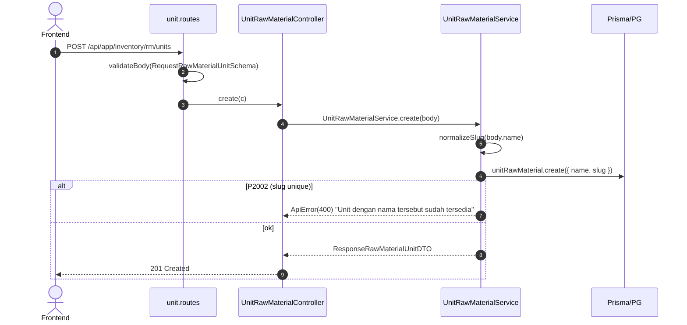

# Module: Inventory / RM / Unit

**Base path**: `/api/app/inventory/rm/units`
**Source**: `src/module/application/inventory/rm/unit/`
**Tests**: `src/tests/inventory/rm/unit/unit.service.test.ts` (14 test)
**Prisma model**: `UnitRawMaterial` (mapped table `unit_raw_materials`; relasi 1:N → `RawMaterial`)

Master data **satuan/UoM** untuk Raw Material (mis. `ML`, `KG`, `PCS`, `LITER`). Slug auto-generate (`normalizeSlug(name)`) untuk lookup unik. Mengikuti pola supplier/category — ORM-only, try/catch P2002/P2025, select whitelist `UNIT_SELECT`.

> **Catatan**:
>
> - Mount path **plural** (`/units`) di `rm.routes.ts:15`. Class & file pakai singular (`unit`).
> - Selain endpoint dedicated ini, RM **masih** auto-upsert satuan saat `POST /api/app/inventory/rm` (lihat `getOrCreateSlug` di `rm.service.ts`). Endpoint ini melengkapi: rename, hard-delete satuan yang tidak terpakai.
> - **Hard delete** (bukan soft). Defensive: cek `rawMaterial.count({ where: { unit_id } })` sebelum delete — kalau masih dipakai, tolak 400.
> - Tidak ada kolom `status` di model (beda dari `RawMatCategories`). Untuk arsip, lakukan delete (kalau tidak dipakai) atau biarkan.
> - Tidak ada `Cache.afterMutation` (`rm:*`) di controller saat ini. Kalau RM list menampilkan nama unit, mutasi unit belum bust cache RM. <!-- verify -->
> - Tidak ada `CreateLogger` audit per mutasi. <!-- verify -->
> - Legacy folder `src/module/application/rawmat/unit/` masih ada — biarkan; canonical scope ada di sini (memory `rm_module_scope_split.md`).

---

## 1. Scope & Fitur

| Fitur                | Endpoint                          | Catatan                                                                          |
| :------------------- | :-------------------------------- | :------------------------------------------------------------------------------- |
| List + search + sort | `GET /`                           | Search ILIKE `name` + `slug`. Sort 3 kolom (`name`/`slug`/`id`). Pagination max 100. |
| Create               | `POST /`                          | Slug auto via `normalizeSlug`. P2002 → 400.                                       |
| Detail               | `GET /:id`                        | 404 jika tidak ditemukan.                                                        |
| Update (full/partial)| `PUT /:id` / `PATCH /:id`         | Partial; `name` wajib via refine. Slug regen.                                     |
| Hard delete          | `DELETE /:id`                     | 400 jika `rawMaterial.count(...)` > 0. 404 jika P2025.                            |

### Out of scope

- Change status endpoint — model tidak punya kolom `status`.
- Bulk-delete (belum ada — tambah saat butuh).
- Mengubah relasi ke `RawMaterial` — pakai endpoint `inventory/rm` (`unit` di body `RequestRMDTO`).

---

## 2. Arsitektur & Flow

### Layer map

```text
┌──────── routes/unit.routes.ts ───────────────────────────────┐
│ GET    /:id        → detail                                   │
│ PUT    /:id        (validateBody(UpdateRawMaterialUnitSchema))│
│ PATCH  /:id        (validateBody(UpdateRawMaterialUnitSchema))│
│ DELETE /:id        → delete (hard)                            │
│ GET    /           → list                                     │
│ POST   /           (validateBody(RequestRawMaterialUnitSchema))│
└────────────────────────┬─────────────────────────────────────┘
                         ▼
┌──────── controller/unit.controller.ts ───────────────────────┐
│ - parseId() via IdParamSchema.parse                           │
│ - parse Query lewat QueryRawMaterialUnitSchema.parse          │
│ - Tidak ada CreateLogger (TBD)                                │
│ - Tidak ada Cache.afterMutation (TBD)                         │
└────────────────────────┬─────────────────────────────────────┘
                         ▼
┌──────── service/unit.service.ts ─────────────────────────────┐
│ - UNIT_SELECT: shape ResponseRawMaterialUnitDTO               │
│ - create/update: normalizeSlug(name) tiap kali name di-set    │
│ - update: defense check name (400 jika kosong)                │
│ - delete: pre-check count(rawMaterial.unit_id)                │
│ - rethrowPrismaError: P2002 → 400, P2025 → 404                │
└────────────────────────┬─────────────────────────────────────┘
                         ▼
                 Prisma → PostgreSQL (unit_raw_materials)
```

### Mermaid: Create flow



### Mermaid: Delete (hard) flow

```mermaid
flowchart TD
    A[DELETE /:id] --> B[count rawMaterial where unit_id=id]
    B -->|usedCount > 0| E1[400 'Satuan masih digunakan oleh beberapa Raw Material']
    B -->|usedCount = 0| C[unitRawMaterial.delete where id]
    C -->|P2025| E2[404 'Unit tidak ditemukan']
    C -->|ok| D[Return { deleted: 1 }]
```

---

## 3. DTO / Schemas (end-to-end SSOT)

**Source**: `src/module/application/inventory/rm/unit/unit.schema.ts`.

### 3.1 `IdParamSchema`

```ts
export const IdParamSchema = z.object({
    id: z.coerce.number().int().positive("ID unit tidak valid"),
});

export type IdParamDTO = z.infer<typeof IdParamSchema>;
```

| Field | Type     | Required | Constraint                | Error msg              |
| :---- | :------- | :------- | :------------------------ | :--------------------- |
| `id`  | `number` | ✅       | `coerce`, `int`, `> 0`    | `"ID unit tidak valid"` |

### 3.2 `RequestRawMaterialUnitSchema` — POST /

```ts
export const RequestRawMaterialUnitSchema = z.object({
    name: z
        .string({ error: "Nama unit tidak boleh kosong" })
        .min(1, "Nama unit tidak boleh kosong")
        .max(100, "Nama unit maksimal 100 karakter"),
});

export type RequestRawMaterialUnitDTO = z.infer<typeof RequestRawMaterialUnitSchema>;
```

| Field  | Type      | Required | Constraint            | Error msg                                                           |
| :----- | :-------- | :------- | :-------------------- | :------------------------------------------------------------------ |
| `name` | `string`  | ✅       | `min(1)`, `max(100)`  | `"Nama unit tidak boleh kosong"` / `"Nama unit maksimal 100 karakter"` |

### 3.3 `UpdateRawMaterialUnitSchema` — PUT/PATCH /:id

```ts
export const UpdateRawMaterialUnitSchema = RequestRawMaterialUnitSchema.partial().refine(
    (v) => v.name !== undefined,
    { message: "Field name wajib diisi" },
);

export type UpdateRawMaterialUnitDTO = z.infer<typeof UpdateRawMaterialUnitSchema>;
```

| Field  | Type      | Required    | Constraint                              | Error msg                  |
| :----- | :-------- | :---------- | :-------------------------------------- | :------------------------- |
| `name` | `string?` | ✅ (refine) | inherits `min(1)`, `max(100)` saat ada  | `"Field name wajib diisi"` |

> Service punya defense tambahan: throw `ApiError(400, "Nama unit wajib diisi")` jika `payload.name` falsy walau lolos validateBody.

### 3.4 `QueryRawMaterialUnitSchema` — GET /

```ts
export const QueryRawMaterialUnitSchema = z.object({
    page: z.coerce.number().int().positive().default(1),
    take: z.coerce.number().int().positive().max(100).default(25),
    search: z.string().trim().min(1).optional(),
    sortBy: z.enum(["name", "slug", "id"]).default("name"),
    sortOrder: z.enum(["asc", "desc"]).default("asc"),
});

export type QueryRawMaterialUnitDTO = z.infer<typeof QueryRawMaterialUnitSchema>;
```

| Param       | Type                          | Default | Constraint                  | Catatan                                                |
| :---------- | :---------------------------- | :------ | :-------------------------- | :----------------------------------------------------- |
| `page`      | `number` (int)                | `1`     | `coerce`, `int`, `> 0`      | —                                                      |
| `take`      | `number` (int)                | `25`    | `coerce`, `int`, `1..100`   | —                                                      |
| `search`    | `string?`                     | —       | `trim`, `min(1)`, optional  | ILIKE `name` + `slug` (`mode: "insensitive"`).         |
| `sortBy`    | `"name" \| "slug" \| "id"`    | `"name"`| whitelist                   | Field langsung.                                        |
| `sortOrder` | `"asc" \| "desc"`             | `"asc"` | enum                        | —                                                      |

### 3.5 `ResponseRawMaterialUnitSchema`

```ts
export const ResponseRawMaterialUnitSchema = z.object({
    id: z.number(),
    name: z.string(),
    slug: z.string(),
});

export type ResponseRawMaterialUnitDTO = z.infer<typeof ResponseRawMaterialUnitSchema>;
```

> Ditarik via `UNIT_SELECT` (`Prisma.UnitRawMaterialSelect`) — **tidak** include `raw_material[]`. Tidak ada `created_at`/`updated_at` (model tidak punya kolom timestamp).

### 3.6 Catatan integrasi FE

- Schema mirror: `app/src/app/(application)/inventory/rm/units/server/inventory.rm.unit.schema.ts` 🚧 TBD.
- DTO export: `RequestRawMaterialUnitDTO`, `UpdateRawMaterialUnitDTO`, `QueryRawMaterialUnitDTO`, `ResponseRawMaterialUnitDTO`.
- Mirror lengkap di [`../../frontend-integration.md`](../../frontend-integration.md) §2–§5.

---

## 4. Routing untuk integrasi Frontend

Semua endpoint terproteksi `authMiddleware` (session cookie + Redis session) — lihat [AUTH.md](../../../../AUTH.md).

### 4.1 Daftar endpoint

> **Status code SOP** (`dev-flow §1.G`): create → 201; sisanya → 200.

| #   | Method  | Path             | Body / Query                              | Body type | Response (status)                          | Error utama                                      |
| :-- | :------ | :--------------- | :---------------------------------------- | :-------- | :----------------------------------------- | :----------------------------------------------- |
| 1   | GET     | `/`              | `QueryRawMaterialUnitDTO` (querystring)   | —         | `{ data, len }` (**200**)                  | 400 (query invalid)                              |
| 2   | POST    | `/`              | `RequestRawMaterialUnitDTO`               | JSON      | `ResponseRawMaterialUnitDTO` (**201**)     | 400 (Zod / slug dup)                             |
| 3   | GET     | `/:id`           | —                                         | —         | `ResponseRawMaterialUnitDTO` (**200**)     | 400 (id invalid), 404                            |
| 4   | PUT     | `/:id`           | `UpdateRawMaterialUnitDTO`                | JSON      | `ResponseRawMaterialUnitDTO` (**200**)     | 400 (Zod / refine / dup), 404 (P2025)            |
| 5   | PATCH   | `/:id`           | `UpdateRawMaterialUnitDTO`                | JSON      | `ResponseRawMaterialUnitDTO` (**200**)     | 400 / 404 (alias dari PUT)                       |
| 6   | DELETE  | `/:id`           | —                                         | —         | `{ deleted: 1 }` (**200**)                 | 400 (masih dipakai RM), 404 (P2025)              |

### 4.2 Konvensi response

```jsonc
{ "query": null | <echo querystring>, "status": "success", "data": <payload> }
```

Error:

```jsonc
{ "status": "error", "message": "<pesan>" }
```

### 4.3 Contoh integrasi frontend

Snippet endpoint-spesifik di bawah; konvensi lengkap (class `InventoryRMUnitService`, queryKey, hook split) **ada di** [`../../frontend-integration.md`](../../frontend-integration.md).

```ts
const API = `${process.env.NEXT_PUBLIC_API}/api/app/inventory/rm/units`;

static async list(params: QueryRawMaterialUnitDTO) {
    const { data } = await api.get<ApiSuccessResponse<{ len: number; data: Array<ResponseRawMaterialUnitDTO> }>>(API, { params });
    return data.data;
}
static async create(body: RequestRawMaterialUnitDTO) {
    await setupCSRFToken();
    await api.post(API, body);
}
static async update(id: number, body: UpdateRawMaterialUnitDTO) {
    await setupCSRFToken();
    await api.put(`${API}/${id}`, body);
}
static async remove(id: number) {
    await setupCSRFToken();
    await api.delete(`${API}/${id}`);
}
```

### 4.4 Header & autentikasi

- Cookie session + `x-xsrf-header` untuk mutasi.
- `Content-Type: application/json` untuk POST/PUT/PATCH dengan body.

---

## 5. Database / Indexes

Model `UnitRawMaterial` di `prisma/schema.prisma:197`:

```prisma
model UnitRawMaterial {
  id           Int           @id @default(autoincrement())
  slug         String        @unique @db.VarChar(100)
  name         String        @db.VarChar(100)
  raw_material RawMaterial[]

  @@index([name])
  @@map("unit_raw_materials")
}
```

Relasi:

- `RawMaterial.unit_id` → `UnitRawMaterial.id`. FK **required** (RM wajib punya unit). Service tetap **reject delete** kalau ada child via pre-check `count()`.

**Catatan**: tidak ada kolom `created_at`/`updated_at`/`status`. Tidak ada index per `slug` selain `@unique` built-in. Pertimbangkan migration tambahkan timestamp kalau butuh audit. <!-- verify -->

---

## 6. Error catalog

| HTTP | Pesan                                                        | Trigger                                                  |
| :--- | :----------------------------------------------------------- | :------------------------------------------------------- |
| 400  | `Validation Error` + array `{ message, path }`               | Body / query gagal Zod.                                  |
| 400  | `ID unit tidak valid`                                        | `parseId()` Zod fail.                                     |
| 400  | `Field name wajib diisi`                                     | `UpdateRawMaterialUnitSchema.refine` fail.               |
| 400  | `Nama unit wajib diisi`                                      | Service defense saat `payload.name` falsy.                |
| 400  | `Unit dengan nama tersebut sudah tersedia`                   | P2002 (`slug` unique) saat create/update.                 |
| 400  | `Satuan masih digunakan oleh beberapa Raw Material`          | `delete /:id`: `rawMaterial.count(unit_id)` > 0.          |
| 404  | `Unit tidak ditemukan`                                       | `detail` find = null **atau** P2025 di update/delete.     |
| 500  | `Internal Server Error`                                      | Error tak terduga (re-throw non-Prisma).                  |

---

## 7. Testing

Lokasi: `src/tests/inventory/rm/unit/unit.service.test.ts`. **14 test**.

### 7.1 Setup

Mock `prisma.unitRawMaterial.{create,update,findUnique,findMany,count,delete}` + `prisma.rawMaterial.count` (untuk delete pre-check). Re-use global mock di `src/tests/setup.ts`.

### 7.2 Suite

| Suite    | Test cases                                                                                                  |
| :------- | :---------------------------------------------------------------------------------------------------------- |
| `create` | (1) sukses set slug otomatis + trim name; (2) P2002 → 400                                                   |
| `update` | (1) regen slug saat name di-set; (2) defense 400 saat name kosong; (3) P2025 → 404; (4) P2002 → 400         |
| `detail` | (1) sukses return shape; (2) 404 saat tidak ditemukan                                                       |
| `list`   | (1) paginated; (2) OR-search `name`/`slug`; (3) `where` kosong saat tidak ada `search`                       |
| `delete` | (1) sukses delete tidak terpakai; (2) 400 saat masih dipakai RM (`prisma.unitRawMaterial.delete` tidak dipanggil); (3) P2025 → 404 |

### 7.3 Menjalankan test

```bash
# Hanya Unit
rtk npm test -- --run src/tests/inventory/rm/unit/

# Watch
rtk npx vitest src/tests/inventory/rm/unit/
```

> **Routes test untuk unit belum ada** (`unit.routes.test.ts` 🚧 TBD). Tambahkan saat sentuh modul ini lagi untuk verifikasi end-to-end HTTP.

---

## 8. Postman testing

Import koleksi `docs/postman/erp-mandalika.postman_collection.json` → folder `Inventory / RM / Units`. Env var sama dengan RM (lihat [`../README.md`](../README.md) §8).

### 8.1 List

```
GET {{base_url}}/api/app/inventory/rm/units?page=1&take=25&sortBy=name&sortOrder=asc&search=kg
```

### 8.2 Create

```http
POST {{base_url}}/api/app/inventory/rm/units
Content-Type: application/json

{ "name": "Kilogram" }
```

Expected sukses (201):

```jsonc
{
  "query": null,
  "status": "success",
  "data": { "id": 1, "name": "Kilogram", "slug": "kilogram" }
}
```

### 8.3 Update

```http
PUT {{base_url}}/api/app/inventory/rm/units/1
Content-Type: application/json

{ "name": "Gram" }
```

### 8.4 Detail

```
GET {{base_url}}/api/app/inventory/rm/units/1
```

### 8.5 Delete (hard)

```
DELETE {{base_url}}/api/app/inventory/rm/units/1
```

Expected sukses (200): `{ "data": { "deleted": 1 } }`.

### 8.6 Expected error responses

```jsonc
// 400 — name kosong
{ "status": "error", "message": "Validation Error", "errors": [{ "message": "Nama unit tidak boleh kosong", "path": ["name"] }] }

// 400 — slug dup
{ "status": "error", "message": "Unit dengan nama tersebut sudah tersedia" }

// 400 — refine update
{ "status": "error", "message": "Field name wajib diisi" }

// 400 — masih dipakai RM
{ "status": "error", "message": "Satuan masih digunakan oleh beberapa Raw Material" }

// 404
{ "status": "error", "message": "Unit tidak ditemukan" }
```

---

## 9. Activity log

`UnitRawMaterialController` saat ini **tidak memanggil `CreateLogger`** — beda dengan FG/RM. Audit trail untuk perubahan unit belum tercatat di `logging_activities`.

> Pasang `CreateLogger({ activity: "CREATE" | "UPDATE" | "DELETE", description: "RM Unit #{id}: {name}", email })` saat sentuh controller berikutnya. <!-- verify -->

---

## 10. Checklist saat menambah fitur Unit

- [ ] Update `unit.schema.ts` (Zod chain + DTO export).
- [ ] Tulis test TDD di `src/tests/inventory/rm/unit/unit.service.test.ts`. **Tambah** `unit.routes.test.ts` (belum ada).
- [ ] Tambah `@@index` di Prisma kalau ada filter/sort kolom baru + migration. Pertimbangkan menambah `created_at`/`updated_at`.
- [ ] Pasang `Cache.afterMutation("rm:*")` jika RM list/detail menampilkan satuan.
- [ ] Pasang `CreateLogger` audit per mutasi.
- [ ] Update dokumen ini + tabel di `../README.md` + `../../README.md` (sub-modul row).
- [ ] Update Postman folder `Inventory / RM / Units`.
- [ ] Update FE schema mirror `inventory.rm.unit.*` di `app/`.
- [ ] `rtk tsc --noEmit` + `rtk npm test -- --run src/tests/inventory/rm/unit/`.

---

## 11. Referensi silang

- Parent scope: [`../README.md`](../README.md)
- Module index: [`../../README.md`](../../README.md)
- FE integration: [`../../frontend-integration.md`](../../frontend-integration.md)
- Arsitektur global: [`../../../ARCHITECTURE.md`](../../../../ARCHITECTURE.md)
- Auth & session: [`../../../AUTH.md`](../../../../AUTH.md)
- Database conventions: [`../../../DATABASE.md`](../../../../DATABASE.md)
- Modul terkait:
    - `inventory/rm` — konsumsi `unit` di `RequestRMDTO` (auto-upsert saat create/update RM).
    - `inventory/rm/import` — unit auto-upsert dari header CSV `UOM`.
    - `inventory/rm/category` — pola identik untuk master `RawMatCategories`.
