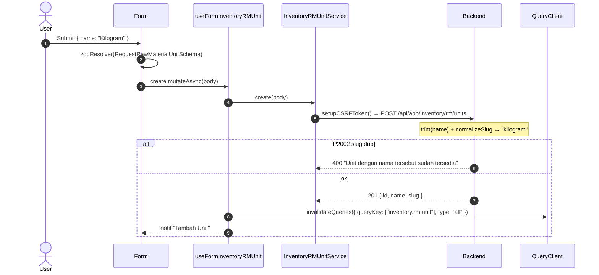
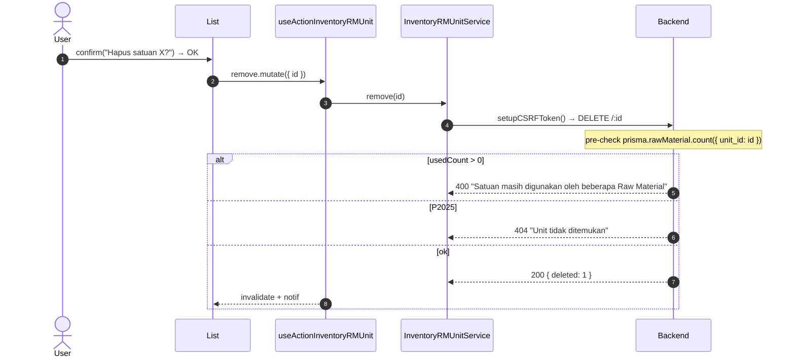

# Inventory / RM / Unit — Frontend Integration (Scope Level)

End-to-end FE integration **lengkap** untuk scope ini. FE engineer baca file ini saja → bisa implement dari nol.

**Backend scope path**: `api/src/module/application/inventory/rm/unit/`
**Frontend scope path**: `app/src/app/(application)/inventory/rm/units/server/`
**Component path**: `app/src/components/pages/inventory/rm/units/`
**Endpoint base**: `/api/app/inventory/rm/units`
**Status FE**: 🚧 TBD <!-- ubah ke ✅ Ready setelah file FE dibuat -->

**Dependencies**: konvensi global modul ([`../../frontend-integration.md`](../../frontend-integration.md)), BE scope doc ([`./README.md`](./README.md)), SOP [frontend-dev-flow](../../../../.claude/skills/frontend-dev-flow/SKILL.md).

Master data **satuan/UoM** untuk Raw Material (mis. `ML`, `KG`, `PCS`, `LITER`). Slug auto-generate server-side via `normalizeSlug(name)`; FE hanya kirim `name`. Hard delete dengan FK pre-check ke `RawMaterial`.

---

## 1. Schema Mirror End-to-End

**Source BE**: `src/module/application/inventory/rm/unit/unit.schema.ts`. FE mirror WAJIB 1:1.

### 1.1 Block Zod verbatim BE

```ts
import { z } from "zod";

export const IdParamSchema = z.object({
    id: z.coerce.number().int().positive("ID unit tidak valid"),
});

export const RequestRawMaterialUnitSchema = z.object({
    name: z
        .string({ error: "Nama unit tidak boleh kosong" })
        .min(1, "Nama unit tidak boleh kosong")
        .max(100, "Nama unit maksimal 100 karakter"),
});

export const UpdateRawMaterialUnitSchema = RequestRawMaterialUnitSchema.partial().refine(
    (v) => v.name !== undefined,
    { message: "Field name wajib diisi" },
);

export const QueryRawMaterialUnitSchema = z.object({
    page: z.coerce.number().int().positive().default(1),
    take: z.coerce.number().int().positive().max(100).default(25),
    search: z.string().trim().min(1).optional(),
    sortBy: z.enum(["name", "slug", "id"]).default("name"),
    sortOrder: z.enum(["asc", "desc"]).default("asc"),
});

export const ResponseRawMaterialUnitSchema = z.object({
    id: z.number(),
    name: z.string(),
    slug: z.string(),
});
```

### 1.2 Tabel field

**`RequestRawMaterialUnitSchema`**:

| Field  | Type     | Required | Constraint            | Error msg                                                              | Catatan                       |
| :----- | :------- | :------- | :-------------------- | :--------------------------------------------------------------------- | :---------------------------- |
| `name` | `string` | ✅       | `min(1)`, `max(100)`  | `"Nama unit tidak boleh kosong"` / `"Nama unit maksimal 100 karakter"` | Trim + slug auto di service.  |

**`UpdateRawMaterialUnitSchema`** — partial + refine `v.name !== undefined`:

| Field  | Type      | Required    | Constraint                              | Error msg                  | Catatan                                                                |
| :----- | :-------- | :---------- | :-------------------------------------- | :------------------------- | :--------------------------------------------------------------------- |
| `name` | `string?` | ✅ (refine) | inherits `min(1)`, `max(100)` saat ada  | `"Field name wajib diisi"` | Service defense ekstra: 400 `"Nama unit wajib diisi"` saat falsy.      |

**`QueryRawMaterialUnitSchema`**:

| Param       | Type                       | Default  | Constraint                | Catatan                                          |
| :---------- | :------------------------- | :------- | :------------------------ | :----------------------------------------------- |
| `page`      | `number` (int)             | `1`      | `coerce`, `int`, `> 0`    | —                                                |
| `take`      | `number` (int)             | `25`     | `coerce`, `int`, `1..100` | —                                                |
| `search`    | `string?`                  | —        | `trim`, `min(1)`          | ILIKE `name` + `slug` (`insensitive`).           |
| `sortBy`    | `"name" \| "slug" \| "id"` | `"name"` | whitelist                 | Dropdown FE wajib match.                         |
| `sortOrder` | `"asc" \| "desc"`          | `"asc"`  | enum                      | —                                                |

**`ResponseRawMaterialUnitSchema`** — fields `id`, `name`, `slug` saja. **TIDAK** ada `created_at`/`updated_at`/`deleted_at`/`status` (model `UnitRawMaterial` tidak punya kolom tersebut). Lihat §7.

### 1.3 DTO export & enum

```ts
export type IdParamDTO = z.infer<typeof IdParamSchema>;
export type RequestRawMaterialUnitDTO = z.infer<typeof RequestRawMaterialUnitSchema>;
export type UpdateRawMaterialUnitDTO = z.infer<typeof UpdateRawMaterialUnitSchema>;
export type QueryRawMaterialUnitDTO = z.infer<typeof QueryRawMaterialUnitSchema>;
export type ResponseRawMaterialUnitDTO = z.infer<typeof ResponseRawMaterialUnitSchema>;
```

Enum: scope ini **tidak memakai enum** (tidak ada `status`/`gender`). Tidak perlu import dari `@/shared/types`.

---

## 2. FE Schema Mirror

**File**: `app/src/app/(application)/inventory/rm/units/server/inventory.rm.unit.schema.ts` 🚧 TBD

Copy block §1.1 + §1.3 verbatim ke file FE (hilangkan `IdParamSchema` jika tidak dipakai — path param di-handle axios). Diff vs BE = **empty**.

---

## 3. Service Class — FULL CODE

**File**: `app/src/app/(application)/inventory/rm/units/server/inventory.rm.unit.service.ts` 🚧 TBD

```ts
import api from "@/lib/api";
import { setupCSRFToken } from "@/shared/api/csrf";
import type { ApiSuccessResponse } from "@/shared/types/api";
import type {
    QueryRawMaterialUnitDTO,
    RequestRawMaterialUnitDTO,
    ResponseRawMaterialUnitDTO,
} from "./inventory.rm.unit.schema";

const API = `${process.env.NEXT_PUBLIC_API}/api/app/inventory/rm/units`;

export class InventoryRMUnitService {
    static async list(params: QueryRawMaterialUnitDTO): Promise<{ data: ResponseRawMaterialUnitDTO[]; len: number }> {
        try {
            const { data } = await api.get<ApiSuccessResponse<{ data: ResponseRawMaterialUnitDTO[]; len: number }>>(API, { params });
            return data.data;
        } catch (error) { throw error; }
    }

    static async detail(id: number): Promise<ResponseRawMaterialUnitDTO> {
        try {
            const { data } = await api.get<ApiSuccessResponse<ResponseRawMaterialUnitDTO>>(`${API}/${id}`);
            return data.data;
        } catch (error) { throw error; }
    }

    static async create(body: RequestRawMaterialUnitDTO): Promise<void> {
        try {
            await setupCSRFToken();
            await api.post(API, body);
        } catch (error) { throw error; }
    }

    static async update(id: number, body: Partial<RequestRawMaterialUnitDTO>): Promise<void> {
        try {
            await setupCSRFToken();
            // BE accept PUT atau PATCH dengan schema yang sama (UpdateRawMaterialUnitSchema)
            await api.put(`${API}/${id}`, body);
        } catch (error) { throw error; }
    }

    static async remove(id: number): Promise<{ deleted: number }> {
        try {
            await setupCSRFToken();
            const { data } = await api.delete<ApiSuccessResponse<{ deleted: number }>>(`${API}/${id}`);
            return data.data;
        } catch (error) {
            // BE 400 "Satuan masih digunakan oleh beberapa Raw Material" kalau FK masih dipakai.
            throw error;
        }
    }
}
```

> **Tidak ada** `changeStatus`/`bulkStatus`/`clean`/`exportCsv` — scope ini minimal CRUD; tidak ada status field & belum ada bulk endpoint.

---

## 4. Hooks — 5 Hook Split FULL CODE

**File**: `app/src/app/(application)/inventory/rm/units/server/use.inventory.rm.unit.ts` 🚧 TBD

```ts
"use client";
import { useQuery, useMutation, useQueryClient } from "@tanstack/react-query";
import { useSetAtom } from "jotai";
import { useState, useMemo, useCallback } from "react";
import { useSearchParams } from "next/navigation";
import { useDebounce, useQueryParams } from "@/shared/hooks";
import { errorAtom, notificationAtom } from "@/shared/atoms";
import { FetchError } from "@/shared/api/errors";
import type { ResponseError } from "@/shared/types/api";
import { InventoryRMUnitService } from "./inventory.rm.unit.service";
import type {
    QueryRawMaterialUnitDTO,
    RequestRawMaterialUnitDTO,
    ResponseRawMaterialUnitDTO,
} from "./inventory.rm.unit.schema";

const KEY = ["inventory.rm.unit"] as const;

// 4.1 READ
export function useInventoryRMUnit(params: QueryRawMaterialUnitDTO, enabled = true) {
    return useQuery<{ data: ResponseRawMaterialUnitDTO[]; len: number }, ResponseError>({
        queryKey: [...KEY, params],
        queryFn: () => InventoryRMUnitService.list(params),
        enabled,
        staleTime: 30_000,
    });
}
export function useInventoryRMUnitDetail(id: number, enabled = true) {
    return useQuery<ResponseRawMaterialUnitDTO, ResponseError>({
        queryKey: [...KEY, id],
        queryFn: () => InventoryRMUnitService.detail(id),
        enabled: enabled && Boolean(id),
    });
}

// 4.2 WRITE — create + update
export function useFormInventoryRMUnit() {
    const setErr = useSetAtom(errorAtom);
    const setNotif = useSetAtom(notificationAtom);
    const qc = useQueryClient();
    const invalidate = () => qc.invalidateQueries({ queryKey: KEY, type: "all" });

    const create = useMutation<unknown, ResponseError, RequestRawMaterialUnitDTO>({
        mutationKey: [...KEY, "create"],
        mutationFn: (body) => InventoryRMUnitService.create(body),
        onSuccess: () => { setNotif({ title: "Tambah Unit", message: "Berhasil menambahkan satuan baru" }); invalidate(); },
        onError: (err) => FetchError(err, setErr),
    });
    const update = useMutation<unknown, ResponseError, { id: number; body: Partial<RequestRawMaterialUnitDTO> }>({
        mutationKey: [...KEY, "update"],
        mutationFn: ({ id, body }) => InventoryRMUnitService.update(id, body),
        onSuccess: () => { setNotif({ title: "Ubah Unit", message: "Berhasil memperbarui satuan" }); invalidate(); },
        onError: (err) => FetchError(err, setErr),
    });
    return { create, update };
}

// 4.3 ACTION — delete only (NO status — model UnitRawMaterial tidak punya kolom status)
export function useActionInventoryRMUnit() {
    const setErr = useSetAtom(errorAtom);
    const setNotif = useSetAtom(notificationAtom);
    const qc = useQueryClient();
    const invalidate = () => qc.invalidateQueries({ queryKey: KEY, type: "all" });

    const remove = useMutation<{ deleted: number }, ResponseError, { id: number }>({
        mutationKey: [...KEY, "remove"],
        mutationFn: ({ id }) => InventoryRMUnitService.remove(id),
        onSuccess: () => { setNotif({ title: "Hapus Unit", message: "Satuan berhasil dihapus" }); invalidate(); },
        onError: (err) => FetchError(err, setErr),
    });
    return { remove };
}

// 4.4 TableState — URL sync + debounce
export function useInventoryRMUnitTableState() {
    const sp = useSearchParams();
    const { batchSet } = useQueryParams();
    const [search, setSearchState] = useState(sp.get("search") ?? "");
    const debouncedSearch = useDebounce(search, 500);
    const setSearch = useCallback((v: string) => setSearchState(v), []);
    useMemo(() => { batchSet({ search: debouncedSearch || null, page: "1" }); }, [debouncedSearch, batchSet]);

    const page = Number(sp.get("page") ?? 1);
    const take = Number(sp.get("take") ?? 25);
    const sortBy = (sp.get("sortBy") ?? "name") as QueryRawMaterialUnitDTO["sortBy"];
    const sortOrder = (sp.get("sortOrder") ?? "asc") as QueryRawMaterialUnitDTO["sortOrder"];

    const queryParams = useMemo<QueryRawMaterialUnitDTO>(
        () => ({ page, take, search: debouncedSearch || undefined, sortBy, sortOrder }),
        [page, take, debouncedSearch, sortBy, sortOrder],
    );
    return { search, setSearch, page, take, sortBy, sortOrder, queryParams };
}

// 4.5 Query-wrapper
export function useInventoryRMUnitQuery() {
    const tableState = useInventoryRMUnitTableState();
    const query = useInventoryRMUnit(tableState.queryParams);
    return { ...tableState, query };
}
```

queryKey root: `["inventory.rm.unit", params]`. Tidak ada `changeStatus`/`bulkStatus`/`trash mode` — lihat §7.

---

## 5. Components — Snippets

### 5.1 List page — `components/pages/inventory/rm/units/index.tsx` 🚧 TBD

```tsx
"use client";
import { useInventoryRMUnitQuery, useActionInventoryRMUnit } from "@/app/(application)/inventory/rm/units/server/use.inventory.rm.unit";
import { DataTable } from "@/components/ui/data-table";
import { columns } from "./table/columns";
import { UnitFormDialog } from "./form/unit-form-dialog";

export default function UnitList() {
    const { query, search, setSearch } = useInventoryRMUnitQuery();
    const { remove } = useActionInventoryRMUnit();
    return (
        <section className="space-y-4">
            <header className="flex items-center justify-between gap-2">
                <input value={search} onChange={(e) => setSearch(e.target.value)} placeholder="Cari nama atau slug satuan…" className="rounded-xl border-zinc-200 px-3 py-2" />
                <UnitFormDialog mode="create" />
            </header>
            <DataTable tableId="rm-unit-table" columns={columns({ onDelete: (id) => remove.mutate({ id }) })} data={query.data?.data ?? []} total={query.data?.len ?? 0} loading={query.isLoading} />
        </section>
    );
}
```

### 5.2 Form create+edit — `components/pages/inventory/rm/units/form/unit-form.tsx` 🚧 TBD

```tsx
"use client";
import { useForm } from "react-hook-form";
import { zodResolver } from "@hookform/resolvers/zod";
import { Form } from "@/components/ui/form/main";
import { InputForm } from "@/components/ui/form";
import { RequestRawMaterialUnitSchema, type RequestRawMaterialUnitDTO, type ResponseRawMaterialUnitDTO } from "@/app/(application)/inventory/rm/units/server/inventory.rm.unit.schema";
import { useFormInventoryRMUnit } from "@/app/(application)/inventory/rm/units/server/use.inventory.rm.unit";

type Props =
    | { mode: "create"; onSuccess?: () => void }
    | { mode: "edit"; initial: ResponseRawMaterialUnitDTO; onSuccess?: () => void };

export function UnitForm(props: Props) {
    const form = useForm<RequestRawMaterialUnitDTO>({
        resolver: zodResolver(RequestRawMaterialUnitSchema),
        defaultValues: { name: props.mode === "edit" ? props.initial.name : "" },
    });
    const { create, update } = useFormInventoryRMUnit();
    const pending = create.isPending || update.isPending;

    const handleSubmit = form.handleSubmit(async (body) => {
        if (props.mode === "create") await create.mutateAsync(body);
        else await update.mutateAsync({ id: props.initial.id, body });
        form.reset();
        props.onSuccess?.();
    });

    return (
        <Form methods={form}>
            <form onSubmit={handleSubmit} className="space-y-3">
                <InputForm name="name" label="Nama Satuan" placeholder="Contoh: Kilogram, ML, PCS" required />
                <p className="text-xs text-zinc-500">Slug akan dibuat otomatis dari nama (mis. <code>Kilogram</code> → <code>kilogram</code>).</p>
                <button type="submit" disabled={pending}>{pending ? "Menyimpan…" : props.mode === "create" ? "Simpan" : "Perbarui"}</button>
            </form>
        </Form>
    );
}
```

### 5.3 Dialog + Columns — `form/unit-form-dialog.tsx` & `table/columns.tsx` 🚧 TBD

```tsx
// unit-form-dialog.tsx
"use client";
import { useState } from "react";
import { Dialog, DialogContent, DialogTrigger } from "@/components/ui/dialog";
import type { ResponseRawMaterialUnitDTO } from "@/app/(application)/inventory/rm/units/server/inventory.rm.unit.schema";
import { UnitForm } from "./unit-form";

type Props = { mode: "create" } | { mode: "edit"; initial: ResponseRawMaterialUnitDTO; trigger?: React.ReactNode };

export function UnitFormDialog(props: Props) {
    const [open, setOpen] = useState(false);
    return (
        <Dialog open={open} onOpenChange={setOpen}>
            <DialogTrigger asChild>{props.mode === "edit" && props.trigger ? props.trigger : <button>{props.mode === "create" ? "Tambah Satuan" : "Edit"}</button>}</DialogTrigger>
            <DialogContent>
                {props.mode === "create"
                    ? <UnitForm mode="create" onSuccess={() => setOpen(false)} />
                    : <UnitForm mode="edit" initial={props.initial} onSuccess={() => setOpen(false)} />}
            </DialogContent>
        </Dialog>
    );
}
```

```tsx
// table/columns.tsx
import type { ColumnDef } from "@tanstack/react-table";
import type { ResponseRawMaterialUnitDTO } from "@/app/(application)/inventory/rm/units/server/inventory.rm.unit.schema";
import { UnitFormDialog } from "../form/unit-form-dialog";

export const columns = ({ onDelete }: { onDelete: (id: number) => void }): ColumnDef<ResponseRawMaterialUnitDTO>[] => [
    { accessorKey: "id", header: "ID", size: 60 },
    { accessorKey: "name", header: "Nama" },
    { accessorKey: "slug", header: "Slug", cell: ({ row }) => <span className="font-mono text-xs">{row.original.slug}</span> },
    // NO created_at/updated_at column — model tidak punya timestamp.
    // NO status badge — model tidak punya kolom status.
    {
        id: "actions", header: "Aksi",
        cell: ({ row }) => (
            <div className="flex gap-2">
                <UnitFormDialog mode="edit" initial={row.original} trigger={<button>Edit</button>} />
                <button onClick={() => { if (confirm(`Hapus satuan "${row.original.name}"?`)) onDelete(row.original.id); }}>Hapus</button>
            </div>
        ),
    },
];
```

### 5.4 Page entry — `app/(application)/inventory/rm/units/page.tsx` 🚧 TBD

```tsx
import { Suspense } from "react";
import UnitList from "@/components/pages/inventory/rm/units";
export default function UnitPage() { return <Suspense fallback={<div>Loading…</div>}><UnitList /></Suspense>; }
```

---

## 6. End-to-End Flow per Operasi

### 6.1 Create



### 6.2 Update

```mermaid
sequenceDiagram
    autonumber
    participant H as useFormInventoryRMUnit
    participant S as InventoryRMUnitService
    participant BE as Backend

    H->>S: update({ id, body })
    S->>BE: setupCSRFToken() → PUT /:id
    Note over BE: refine name!==undefined; service regen slug
    alt refine fail
        BE-->>S: 400 "Field name wajib diisi"
    else P2002
        BE-->>S: 400 "Unit dengan nama tersebut sudah tersedia"
    else P2025
        BE-->>S: 404 "Unit tidak ditemukan"
    else ok
        BE-->>S: 200 { id, name, slug }
        S-->>H: invalidate + notif
    end
```

### 6.3 Delete (HARD with FK pre-check)



---

## 7. Edge Cases & Per-Scope Quirks

- **NO timestamp fields**: model `UnitRawMaterial` tidak punya `created_at`/`updated_at`/`deleted_at`. Jangan render kolom tersebut; jangan harapkan field di response.
- **NO status field**: tidak ada kolom `status`. Tidak ada `changeStatus`/`bulkStatus`/badge status. "Arsip" via hard delete (kalau tidak dipakai).
- **NO trash mode**: hard delete only. Tidak ada `?trash=1` filter.
- **Slug auto-generated server-side**: FE **hanya kirim `name`**. Slug jangan diisi di form — `normalizeSlug(name)` jalan di service. Slug muncul di response untuk display.
- **Hard delete dengan FK pre-check (400)**: BE cek `rawMaterial.count({ where: { unit_id } })`. Kalau > 0 → 400 `"Satuan masih digunakan oleh beberapa Raw Material"`. Surface eksplisit ke user (modal `errorAtom`) — beda dari error generic.
- **Slug unique (P2002)**: nama setelah normalize sama dengan slug existing → 400 `"Unit dengan nama tersebut sudah tersedia"`. Kasus umum: input `"KG"` saat slug `kg` sudah ada.
- **PUT vs PATCH equivalent**: BE pasang handler sama untuk PUT & PATCH dengan `UpdateRawMaterialUnitSchema`. FE pakai PUT konsisten.
- **Debounce search**: 500ms via `useDebounce`. URL sync via `batchSet` setelah debounce.
- **Sort whitelist**: hanya `name`/`slug`/`id`. Input lain → 400 Zod fail.
- **Bulk endpoint**: belum ada. Tambah saat BE provide.
- **Optimistic UI**: tidak diaktifkan — payload kecil, invalidate cukup cepat.

---

## 8. Testing FE (Vitest + RTL)

**Lokasi**: `app/src/__tests__/inventory/rm/unit/` 🚧 TBD. Mengikuti SOP `frontend-testing`.

```ts
// Service stub
import { describe, it, expect, vi } from "vitest";
import api from "@/lib/api";
import { InventoryRMUnitService } from "@/app/(application)/inventory/rm/units/server/inventory.rm.unit.service";

vi.mock("@/lib/api");
vi.mock("@/shared/api/csrf", () => ({ setupCSRFToken: vi.fn() }));

describe("InventoryRMUnitService", () => {
    it("list passes params to GET", async () => {
        (api.get as any).mockResolvedValue({ data: { data: { data: [], len: 0 } } });
        await InventoryRMUnitService.list({ page: 1, take: 25, sortBy: "name", sortOrder: "asc" });
        expect(api.get).toHaveBeenCalledWith(expect.stringContaining("/api/app/inventory/rm/units"), { params: expect.objectContaining({ sortBy: "name" }) });
    });
    it("create posts body after CSRF", async () => {
        (api.post as any).mockResolvedValue({});
        await InventoryRMUnitService.create({ name: "Kilogram" });
        expect(api.post).toHaveBeenCalledWith(expect.any(String), { name: "Kilogram" });
    });
    it("remove returns { deleted } on success", async () => {
        (api.delete as any).mockResolvedValue({ data: { data: { deleted: 1 } } });
        expect(await InventoryRMUnitService.remove(1)).toEqual({ deleted: 1 });
    });
});
```

Hook test pakai `renderHook` + `QueryClientProvider` (mock service). Component test render `<UnitForm mode="create" />` & assert `getByLabelText(/Nama Satuan/i)` ada — full pattern lihat module-level FE doc.

---

## 9. Cross-link

- BE scope doc: [./README.md](./README.md)
- Module-level konvensi FE: [../../frontend-integration.md](../../frontend-integration.md)
- Sibling scope FE doc: [`../category/frontend-integration.md`](../category/frontend-integration.md) (pola identik)
- SOP FE canonical: [frontend-dev-flow](../../../../.claude/skills/frontend-dev-flow/SKILL.md)
- SOP FE testing: [frontend-testing](../../../../.claude/skills/frontend-testing/SKILL.md)
- Postman folder: `Inventory → RM → Units` di `docs/postman/erp-mandalika.postman_collection.json`.
