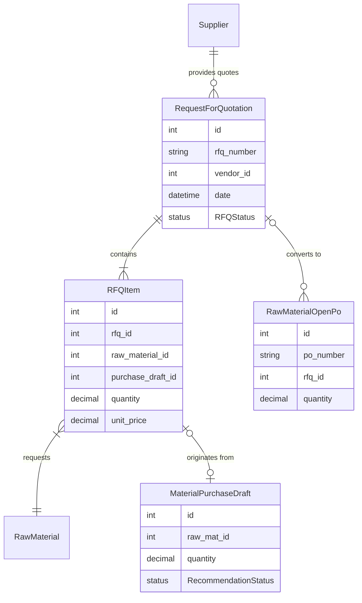

# RFQ Entity Relationship Diagram (ERD)

This document defines the database schema extensions required for the RFQ module, ensuring compatibility with the existing Prisma schema.

## 1. Database Schema Extensions

### 1.1. New Enums
```prisma
enum RFQStatus {
  DRAFT
  SENT
  RECEIVED
  APPROVED
  PARTIAL_CONVERTED
  CONVERTED
  CANCELLED
}
```

### 1.2. New Models
```prisma
model RequestForQuotation {
  id              Int           @id @default(autoincrement())
  rfq_number      String        @unique @db.VarChar(50)
  vendor_id       Int?
  warehouse_id    Int?
  date            DateTime      @default(now())
  status          RFQStatus     @default(DRAFT)
  notes           String?
  created_at      DateTime      @default(now())
  updated_at      DateTime      @updatedAt
  
  vendor          Supplier?     @relation(fields: [vendor_id], references: [id])
  warehouse       Warehouse?    @relation(fields: [warehouse_id], references: [id])
  items           RFQItem[]
  open_pos        RawMaterialOpenPo[]

  @@map("request_for_quotations")
}

model RFQItem {
  id                    Int                  @id @default(autoincrement())
  rfq_id                Int
  raw_material_id       Int
  purchase_draft_id     Int?                 @unique
  quantity              Decimal              @db.Decimal(18, 2)
  unit_price            Decimal?             @db.Decimal(18, 2)
  notes                 String?
  
  rfq                   RequestForQuotation  @relation(fields: [rfq_id], references: [id], onDelete: Cascade)
  raw_material          RawMaterial          @relation(fields: [raw_material_id], references: [id])
  purchase_draft        MaterialPurchaseDraft? @relation(fields: [purchase_draft_id], references: [id])

  @@map("rfq_items")
}
```

### 1.3. Modifications to Existing Models
- **`Supplier`**: Add `rfqs RequestForQuotation[]`
- **`RawMaterial`**: Add `rfq_items RFQItem[]`
- **`MaterialPurchaseDraft`**: Add `rfq_item RFQItem?`
- **`RawMaterialOpenPo`**: Add `rfq_id Int?` and `rfq RequestForQuotation? @relation(fields: [rfq_id], references: [id])`

## 2. Visual Diagram



## 3. Rationale
- **Traceability**: By linking `RFQItem` directly to `MaterialPurchaseDraft`, we can track exactly which recommendation led to which quotation.
- **Per-Supplier Organization**: The `vendor_id` in the RFQ header identifies the supplier. Multiple RFQ records (one per supplier) can exist for the same raw material.
  - Example: Raw Material "Steel Plate" can have RFQ records with Supplier A, Supplier B, and Supplier C.
  - Each RFQ + Supplier combination has its own status (DRAFT, FIX, APPROVED, etc.).
- **Flexibility**: Users can select from existing suppliers or create new supplier entries manually.
- **Manual Input**: Manual RFQs will have `purchase_draft_id` as `null`, allowing independent PO creation without Consolidation dependency.

## 4. Per-Supplier Grouping Example

For a raw material pulled from Consolidation:
```
Raw Material: "Steel Plate" (qty: 100kg, from Consolidation)

RFQ Record 1:
  - vendor_id: 5 (Supplier A)
  - status: APPROVED
  - unit_price: Rp 50,000/kg
  
RFQ Record 2:
  - vendor_id: 8 (Supplier B)
  - status: DRAFT
  - unit_price: Rp 48,000/kg

RFQ Record 3:
  - vendor_id: null (New Supplier - manual entry)
  - supplier_name: "New Steel Vendor"
  - status: FIX
  - unit_price: Rp 52,000/kg
```

Users can view this as:
- **Table View**: All RFQ items across all suppliers in one list.
- **Per-Supplier View**: RFQ items grouped/filtered by supplier for easier comparison and management.
