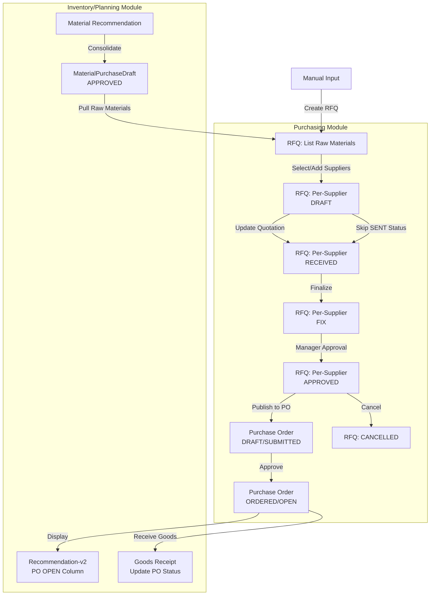

# RFQ Workflow Diagram

This document outlines the lifecycle of a Request for Quotation (RFQ) and its integration with the Consolidation and Purchase Order modules.

## Step-by-Step Flow

1. **Consolidation Approval**: When `MaterialPurchaseDraft` is approved, raw materials are ready to be pulled for RFQ.

2. **RFQ List Creation**: System displays list of approved raw materials. Users can also create manual RFQs independently.

3. **Supplier Selection**: For each raw material, purchasing staff selects existing suppliers or adds new suppliers manually.
   - Status for each supplier combination starts as `DRAFT`.
   - View can be organized per raw material or per supplier.

4. **Quotation Management**: Staff inputs quotation details (unit price, delivery date, etc.).
   - Optional: Move to `SENT` status if tracking supplier communication is needed.
   - Status transitions to `RECEIVED` when quotation is finalized.

5. **Finalization & Approval**:
   - Status moves to `FIX` when quotation is finalized.
   - Status moves to `APPROVED` when manager approves the quoted price.

6. **PO Conversion**: When RFQ is `APPROVED`, it can be published as a Purchase Order.
   - Raw materials, quantities, unit prices, and supplier details are carried over.
   - PO is created in `DRAFT` status, then moved to `SUBMITTED` → `ORDERED` (Open PO).

7. **PO Visibility**: Open POs (status `ORDERED`) appear in Recommendation-v2 under the "PO OPEN" column.

8. **Goods Receipt**: When goods are received, PO status is updated (typically to `CLOSED` or similar).
   - At this point, PO no longer appears in the "PO OPEN" column.
