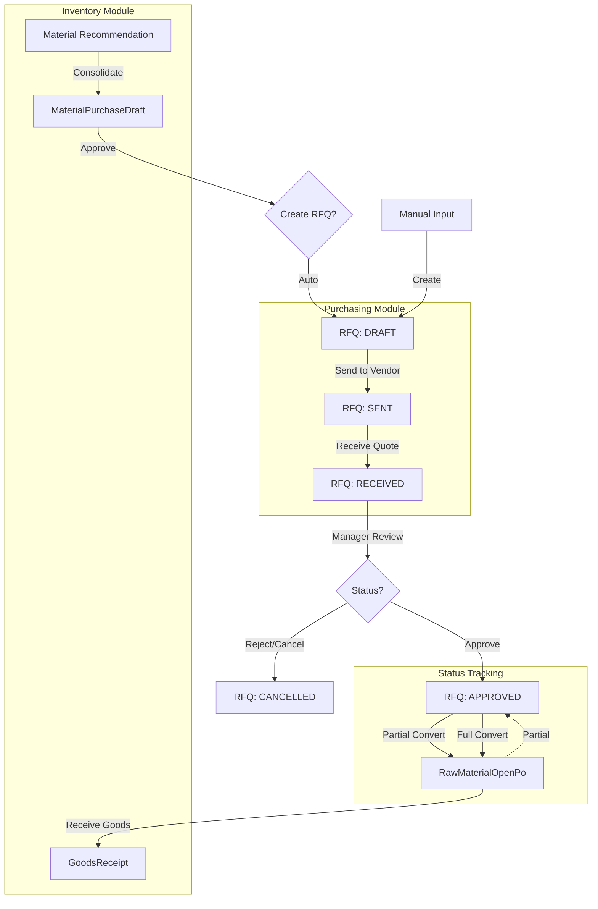

# RFQ Workflow Diagram

This document outlines the lifecycle of a Request for Quotation (RFQ) and its integration with the Consolidation and Purchase Order modules.

## Step-by-Step Flow

1.  **Consolidation Approval**: When the `MaterialPurchaseDraft` reaches the final approval stage, it triggers the creation of one or more RFQs (grouped by suggested supplier).
2.  **RFQ Drafting**: Purchasing staff reviews the items. They can add manual items or adjust quantities.
3.  **Quotation Request**: The RFQ is moved to `SENT` status (representing an email or document sent to the vendor).
4.  **Price Update**: Once the vendor provides prices, the staff updates the RFQ items and sets the status to `RECEIVED`.
5.  **PO Conversion**: Upon final approval of the quoted prices, the RFQ is converted into an Open PO. This closes the RFQ and creates a link for tracking.
